# Kết quả kiểm tra 

Đầu vào là một máy Ubuntu cần được check xem có những lỗ hổng/backdoor nào được cài vào. Do hiện tại chưa biết gì nên sẽ scan một lượt tổng quát từng thành phần.

## Flow scan

- Base line hệ thống
- Các session đăng nhập và log đăng nhập
- Network và service đang mở
- Máy đang public những server nào
- Persistence
- Cron
- Shell startup như `.bashrc` và `.profile`
- Scan các file lạ
  - `/tmp`, `/var`, `/dev`
  - `/home`
  - `/usr/local/bin`
  - `/opt`
  - `/etc`

## 1. Base line hệ thống

`date`: lấy thời gian hiện tại của hệ thống để đối chiếu với timestamp.

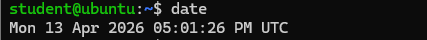

Thời gian hiện tại của hệ thống là **Mon 13 Apr 2026 05:01:26 PM UTC**.

`last -a | head -n 30`: lịch sử đăng nhập gần đây.

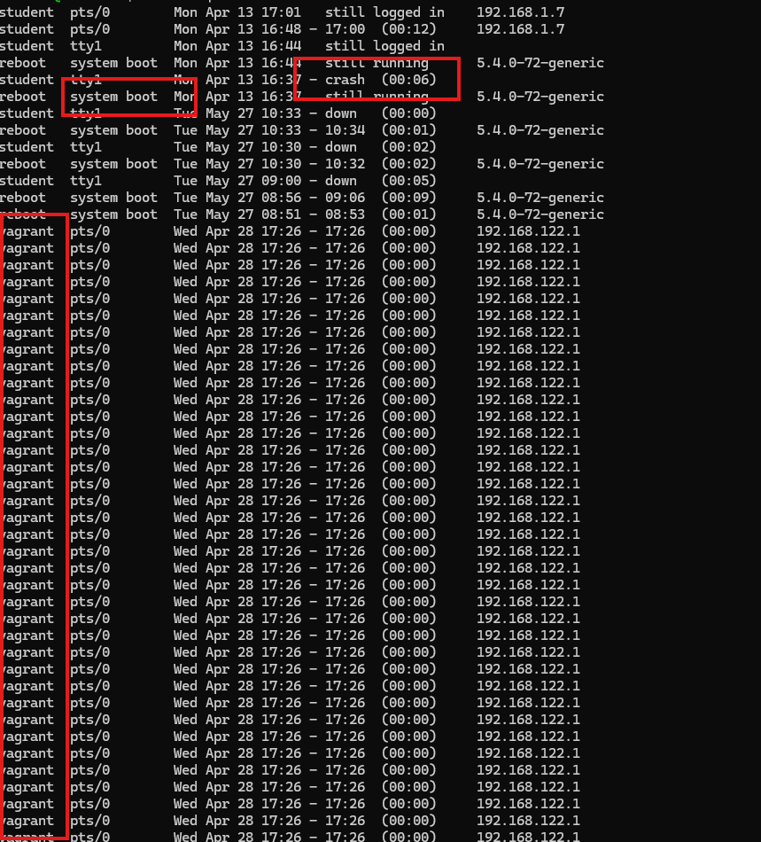

### Xác nhận

- User `student` có các phiên đăng nhập gần thời điểm hiện tại.
- Trong lịch sử cũng xuất hiện nhiều phiên của user `vagrant` từ địa chỉ `192.168.122.1`.
- Ngoài ra có các mốc `reboot`, `shutdown/down`, và một lần `crash` của hệ thống.

`ss -tulpn`: service nào đang listen, cổng nào public.

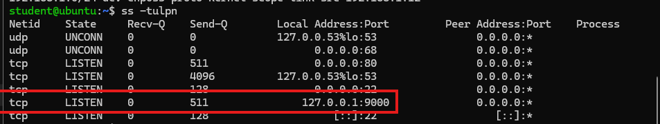

### Xác nhận

- Cổng `80` và `22` đang mở ra ngoài.
- Còn `127.0.0.1:9000` là service chỉ nghe nội bộ `localhost`.

`ss -antp`: kết nối TCP hiện tại.

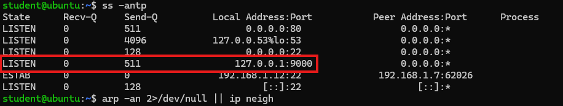

### Xác nhận

- Vẫn tồn tại socket listen trên `127.0.0.1:9000`.
- Có một kết nối TCP đang được thiết lập tới cổng `22` từ địa chỉ `192.168.1.7`.

**Kết luận từ Base line:** user hiện tại là `student`. Lịch sử đăng nhập cho thấy ngoài `student` còn có sự xuất hiện của account `vagrant` từ địa chỉ `192.168.122.1`, đây là một account cần được chú ý. Máy đang mở ít nhất hai service public là `22/tcp` và `80/tcp`.

## 2. Persistence

### Cron

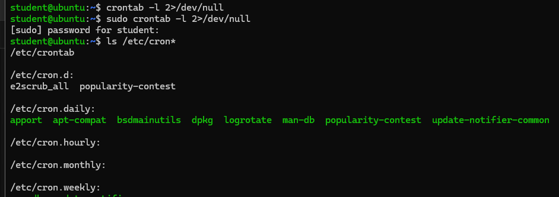

### Xác nhận

Chưa thấy user crontab hoặc root crontab lộ ra nội dung bất thường. Trong các thư mục cron hệ thống đang nhìn thấy chủ yếu là các job quen thuộc của Ubuntu như `apport`, `logrotate`, `update-notifier-common`, và trong `/etc/cron.d` có `e2scrub_all`, `popularity-contest`.

### Kiến thức ngoài lề

- `e2scrub_all`: kiểm tra và dọn metadata của filesystem `ext2/ext3/ext4` sửa lỗi liên quan đến ext filesystem.
- `popularity-contest`: gửi thống kê về các package đang dùng cho Ubuntu để họ biết package nào phổ biến.
- `apport`: thu thập thông tin crash/report lỗi của chương trình để debug.
- `logrotate`: xoay vòng log, nén log cũ, tránh log phình to.
- `update-notifier-common`: kiểm tra/cập nhật thông báo hệ thống.

## 3. Scan file lạ

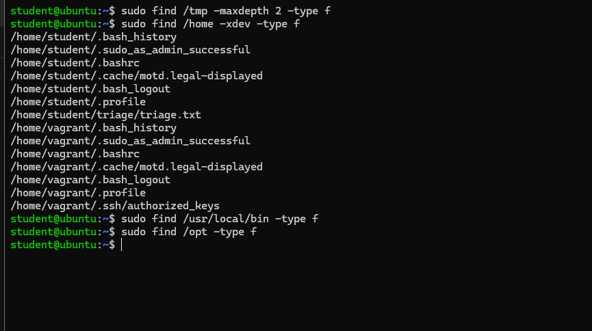

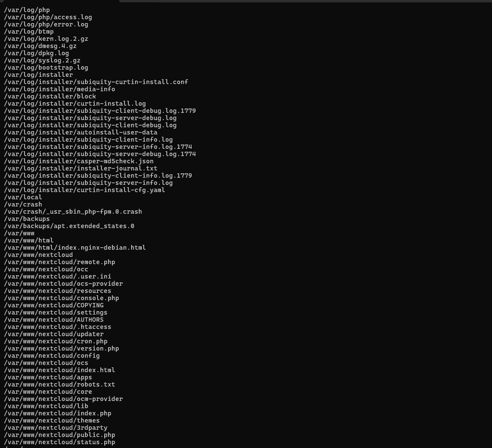

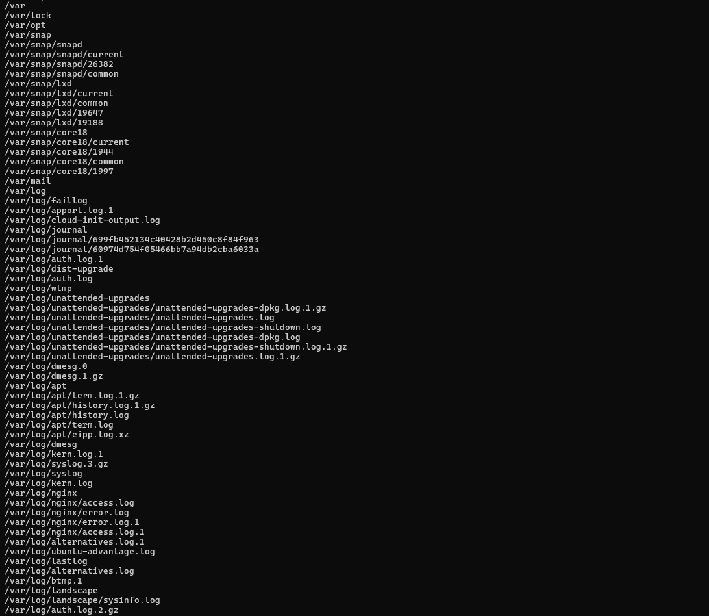

### Xác nhận

Chưa thấy file lạ nổi bật trong `/tmp`. Với `/var`, `/etc` các file đang thấy chủ yếu là log hệ thống và crash artifact, chứa file cấu hình hệ thống chuẩn của Ubuntu trong đó đáng chú ý có `auth.log`, `syslog`, `kern.log`, `apport.log` và file crash `/var/crash/_usr_sbin_php-fpm.0.crash`. 

## 4. Đọc file trong home

Xác nhận file shell startup gồm `.bashrc` và `.profile` đều có nội dung giống mẫu mặc định của Ubuntu, chưa thấy bị chèn thêm lệnh lạ như `curl`, `wget`, `bash -c`, `nohup`, `python`, `perl`, `nc`, `socat` hay lệnh gọi ra file ngoài để duy trì truy cập.

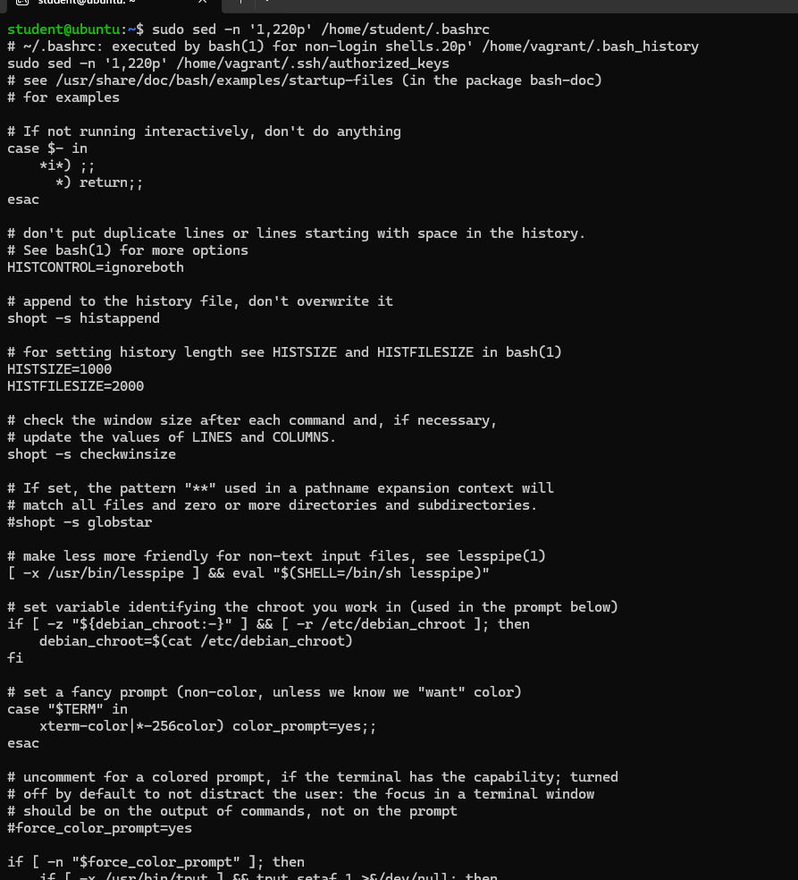

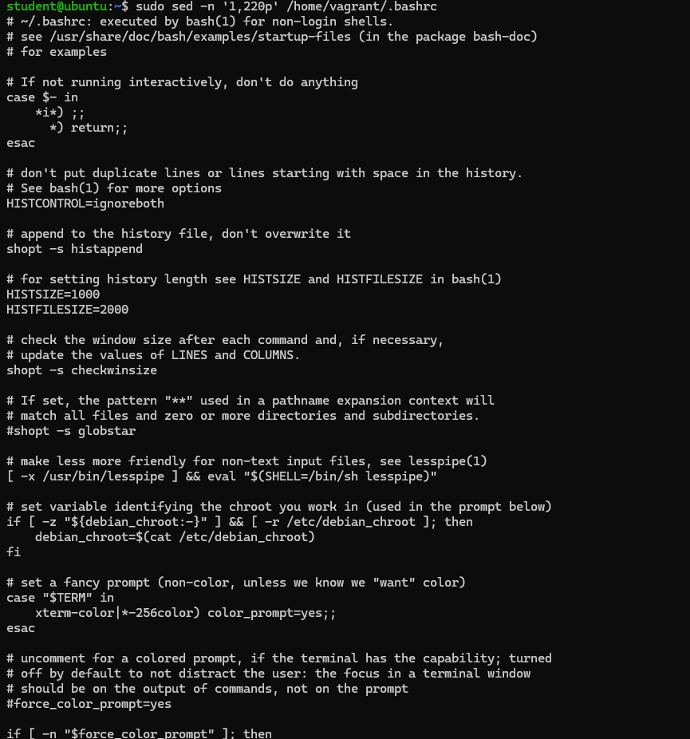

File `.bash_history` của `student` chỉ ghi lại một số lệnh cơ bản như `clear`, `ls`, `ip`, `ip a`, `ssh`, `sudo apt install -y net-tools`, `shutdown now`; các lệnh này cho thấy có thao tác kiểm tra mạng trong thư mục home.

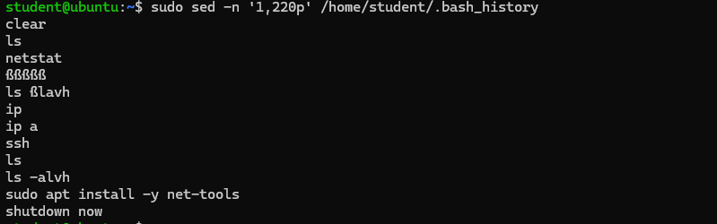

Trong thư mục home, `.bash_history` của `vagrant` hiện trống, và `authorized_keys` của `vagrant` cũng không có nội dung key nào.

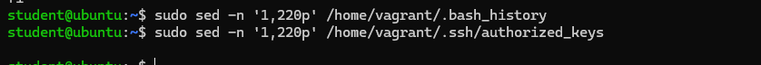

## 5. Đọc log

Bắt đầu với 3 file `auth.log`, `auth.log.1`, `auth.log.2.gz` thì trong file `auth.log.2.gz` có điểm đáng chú ý nhất.

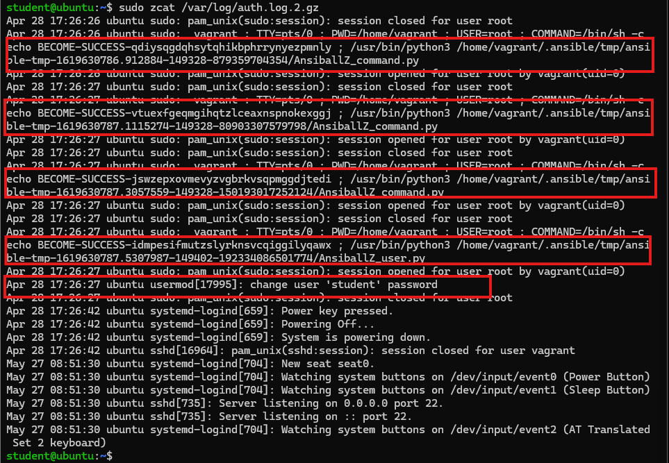

`vagrant` dùng `sudo` nhiều lần để chạy các module Ansible (`AnsiballZ_command.py`, `AnsiballZ_user.py`). Cho thấy `vagrant` được sử dụng như account quản trị.

### Kiến thức ngoài lề 
`Module Ansible` là các script thực thi các tác vụ như cài đặt phần mềm, quản lý tệp tin, người dùng hoặc cấu hình hạ tầng trên máy chủ từ xa.

Tiếp tục tới 2 file `apport.log` và `apport.log.1` thì thấy được thông tin trong file `apport.log.1`.

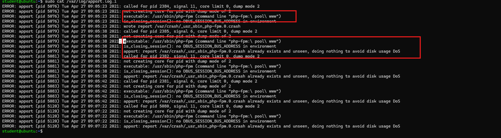

Thấy được `php-fpm` pool `www` bị crash nhiều lần, crash report được ghi ra `/var/crash/_usr_sbin_php-fpm.0.crash`.

Nhưng khi đọc file `_usr_sbin_php-fpm.0.crash` không cho thấy giá trị hữu ích và chỉ có chuỗi base64 dài mà sau khi deocode ra những byte rác.

### Kiến thức ngoài lề

`PHP-FPM Pool 'www'` (*FastCGI Process Manager*) là nhóm các tiến trình con (*worker processes*) mặc định được thiết lập để xử lý các yêu cầu PHP từ web server (như Nginx hoặc Apache).

Do biết được `php-fpm` pool `www` bị crash nhiều lần và `php-fpm` là thành phần xử lý request PHP phía sau web server Nginx, thử đọc 2 file `access.log.1` và `error.log.1` chứa trong folder `nginx`.

Ngay trong file `access.log.1` thấy được request lạ.

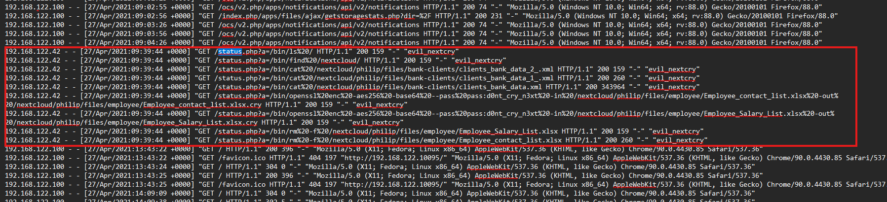

Các request tới path `/status.php` đang bị dùng như kênh thực thi lệnh để thao tác trực tiếp lên dữ liệu của Nextcloud, cụ thể là các file của user `philip` trong datadirectory `/nextcloud`. Attacker đã:

- liệt kê filesystem
- đọc file nhạy cảm
- mã hóa 2 file `Employee_Salary_List.xlsx`, `Employee_contact_list.xlsx` thành `.cry` bằng key `d0nt_cry_n3xt`
- attempt xóa bản gốc `.xlsx`

Tiếp tục check file `error.log.1`.

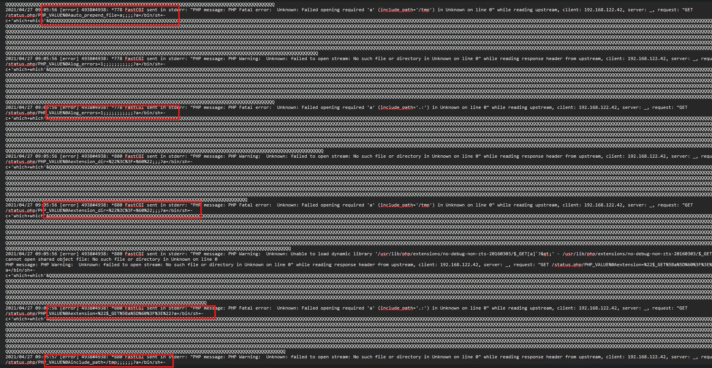

Từ file log này có thể thấy được rằng attacker không chỉ gửi các request bất thường vào `/status.php`, mà còn thử chèn trực tiếp các giá trị cấu hình PHP qua path như:

- `PHP_VALUE`
- `auto_prepend_file=a`
- `include_path=/tmp`
- `extension`
- `extension_dir`

để tác động vào cách PHP-FPM xử lý request. Cùng lúc đó, Nginx liên tục báo lỗi khi đọc upstream `fastcgi://127.0.0.1:9000`, còn PHP trả về các lỗi như `Failed opening required 'a'`, `failed to open stream`.

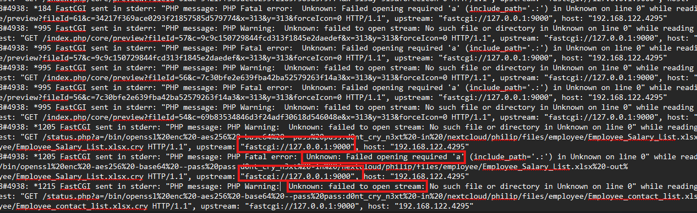

Attacker đang cố gắng khai thác một nhánh lỗi thuộc lớp **Nginx + PHP-FPM**, trong đó request được chế tạo để ép PHP nạp payload/file ngoài luồng xử lý bình thường. Khi đối chiếu thêm với việc `php-fpm` pool `www` bị crash nhiều lần đúng cùng mốc thời gian và các request ở `access.log.1` đã dùng `/status.php` như kênh thực thi lệnh, đồng thời trong các lệnh thực thi truyền qua path cũng thấy nhiều ký tự lạ như `%0a` (xuống dòng).

Tra cứu thêm thì biết được rằng đây là **CVE-2019-11043**.

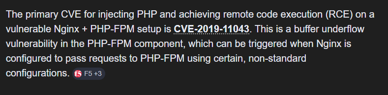

**CVE-2019-11043** là lỗ hổng trong PHP-FPM khi hoạt động sau NGINX, phát sinh do cách xử lý `PATH_INFO` trong luồng FastCGI với một số cấu hình NGINX phổ biến. Lỗ hổng này có thể dẫn tới hỏng bộ nhớ của PHP-FPM và thực thi mã tùy ý trên máy chủ. Các hệ thống dễ bị ảnh hưởng thường là NGINX chuyển request PHP sang PHP-FPM, dùng `fastcgi_split_path_info` và truyền `PATH_INFO`.

Config của Nginx:

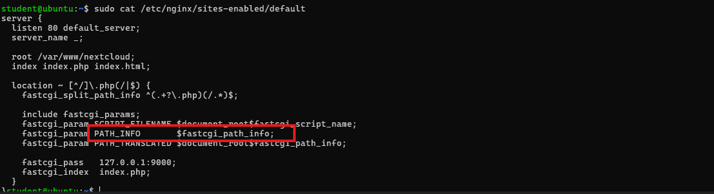

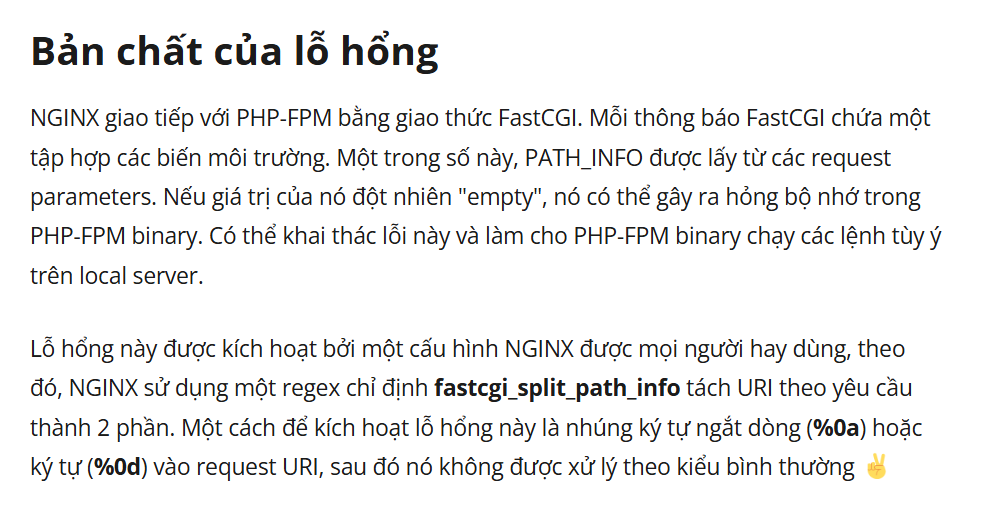

Sau khi xác định được attacker đã tấn công vào server qua **CVE-2019-11043**, cũng xác định được rằng attacker đã thực hiện hành vi hậu khai thác trực tiếp lên dữ liệu trên server. Từ `access.log.1` có thể kết luận attacker đã ít nhất thực hiện một chuỗi hành động gồm mã hóa 2 file `Employee_Salary_List.xlsx` và `Employee_contact_list.xlsx` thành file `.cry` bằng key `d0nt_cry_n3xt`, sau đó xóa 2 file gốc `.xlsx`. Hành động này có thể coi là mang tính chất **ransomware-like**, vì có đặc điểm mã hóa dữ liệu và cố xóa bản gốc.

Thử giải mã 2 file `.cry` rồi tính hash của file `.cry` sau giải mã với file `xlsx` để xem 2 file `.cry` có thực sự được mã hóa từ 2 file `xlsx` tương ứng không.

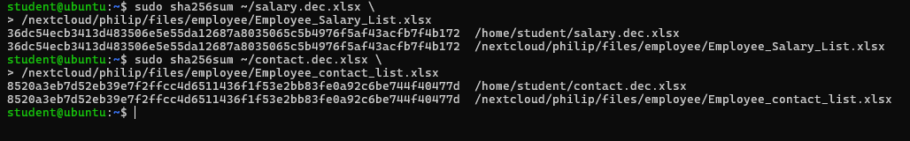

Vậy xác nhận sau khi giải mã hai file `.cry` bằng key `d0nt_cry_n3xt` rồi tính `sha256` để so sánh với hai file gốc tương ứng, hash của từng cặp file đều trùng khớp.

## Tổng kết

### 1. Lỗ hổng bị khai thác

- Lỗ hổng được xác định là **CVE-2019-11043**. Là lỗi thuộc lớp **Nginx + PHP-FPM**, phát sinh khi request được xử lý qua cơ chế `PATH_INFO` trong một số cấu hình Nginx.

### 2. Cách tấn công 

- Attacker gửi các request bất thường tới endpoint `/status.php`.
- Trong request, attacker chèn trực tiếp các giá trị cấu hình PHP như:
  - `PHP_VALUE`
  - `auto_prepend_file=a`
  - `include_path=/tmp`
  - `extension`
  - `extension_dir`
- Mục đích ép PHP-FPM xử lý request theo cách ngoài luồng bình thường để execution path của PHP.

### 3. Tác động

- Đã liệt kê file.
- Đã thao tác trực tiếp lên dữ liệu của Nextcloud, cụ thể là dữ liệu của user `philip` trong datadirectory `/nextcloud`.
- Đã mã hóa 2 file:
  - `Employee_Salary_List.xlsx`
  - `Employee_contact_list.xlsx`
- Hai file trên bị đổi thành file `.cry` bằng key `d0nt_cry_n3xt`.
- Xóa bản gốc `.xlsx`.

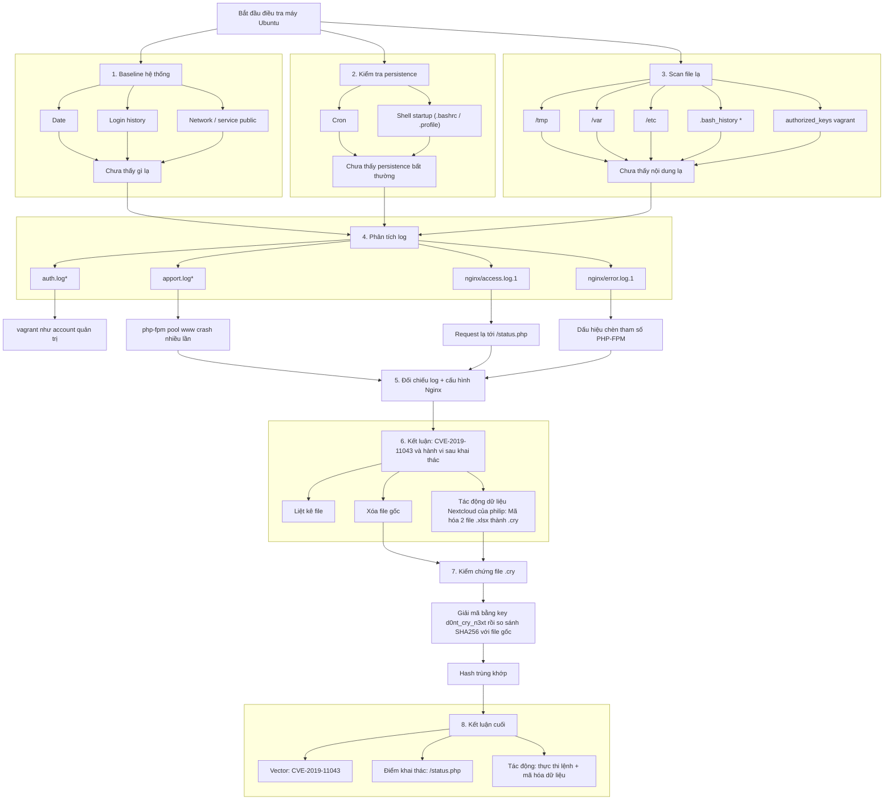
