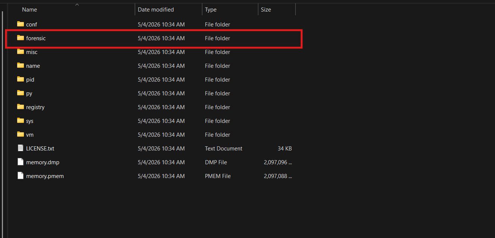
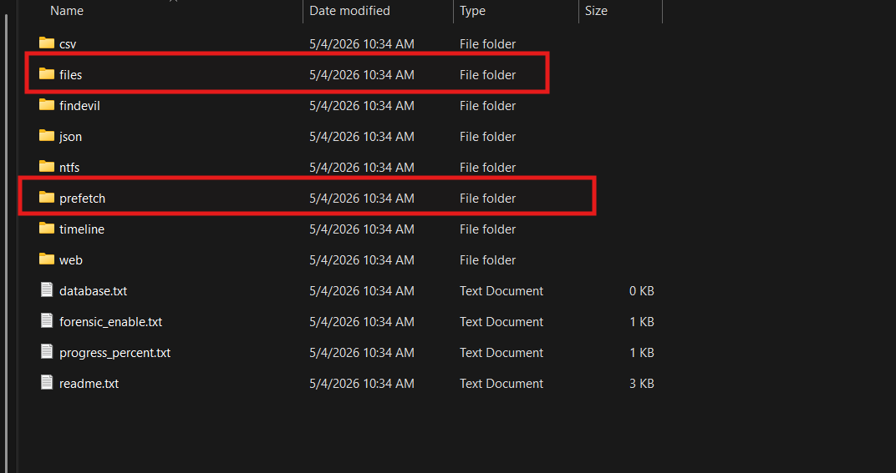
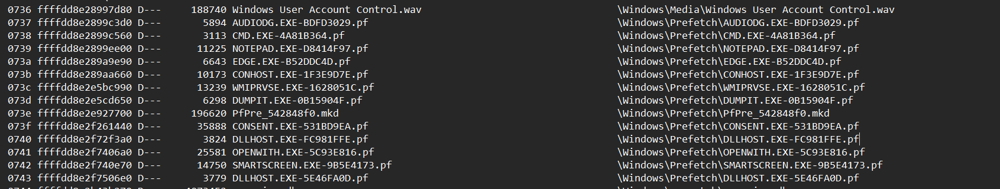
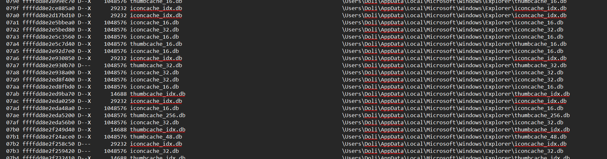
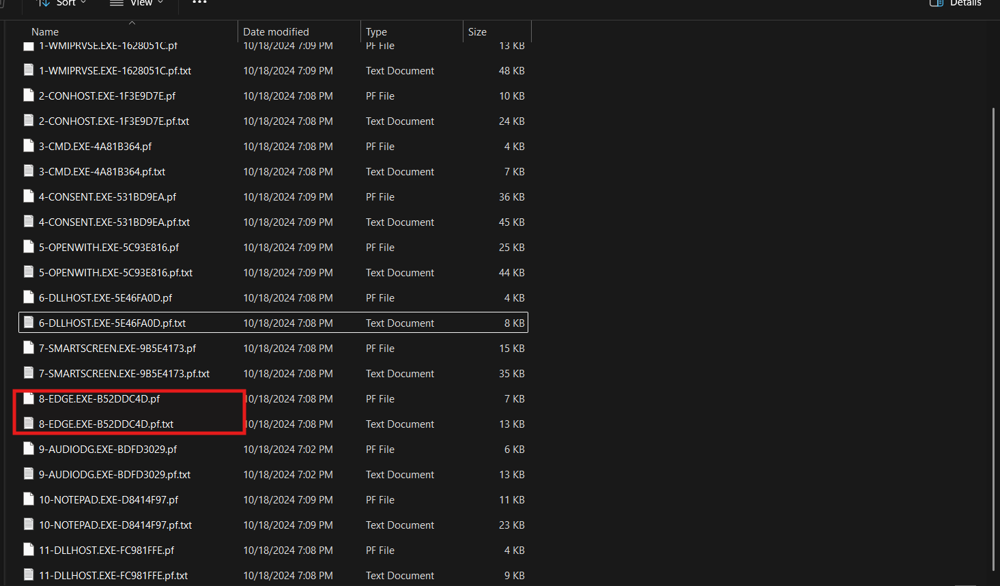
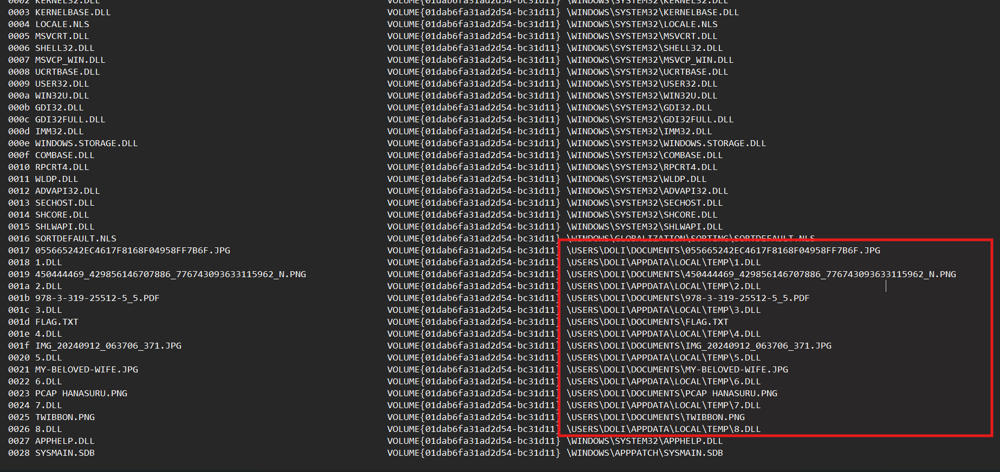
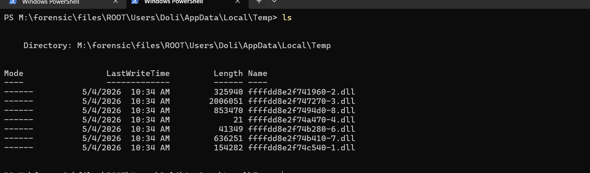
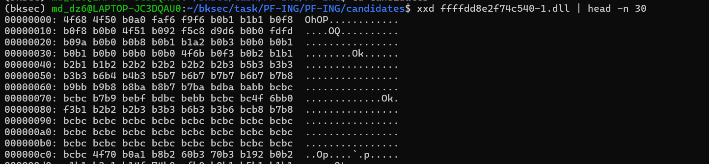
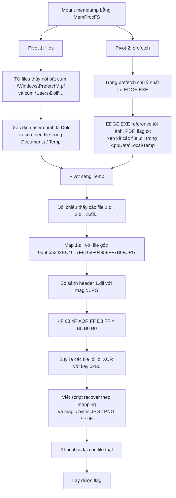

# Challenge PF-ING

## 1. Đầu vào challenge

Đầu vào challenge cung cấp 1 file `memdump`.

Sử dụng **MemProcFS** để mount dump ra thành filesystem:

```powershell
.\MemProcFS.exe -mount M -device D:\ctf\tool\dump.dmp -forensic 1
```



Ngay từ đầu có 2 pivot tự nhiên nhất là `files` và `prefetch`:

- `files`: dùng để xem các file object còn xuất hiện trong memory
- `prefetch`: dùng để xác định chương trình nào đã từng được chạy, thời điểm chạy, và các file mà chương trình đó đã reference/load



---

## 2. Pivot từ folder `files`

Đi từ folder `files` trước.



Chú ý thấy 2 cụm nổi bật nhất.

### Cụm 1: `\Windows\Prefetch\*.pf`

Các dòng này cho thấy trong memory còn tồn tại nhiều file Prefetch như:

- `EDGE.EXE-...pf`
- `CMD.EXE-...pf`
- `CONHOST.EXE-...pf`
- `OPENWITH.EXE-...pf`
- `DUMPIT.EXE-...pf`

Vì tên challenge là `pf-ing`, cụm Prefetch này là pivot rất tự nhiên.

### Cụm 2: `\Users\Doli\...`

Cụm này cho thấy user chính trong máy là `Doli`. Các file không chỉ nằm trong thư mục hệ thống mà còn xuất hiện nhiều trong vùng user profile như:

- `\Users\Doli\AppData\Local\Microsoft\Windows\Explorer\...`
- `\Users\Doli\AppData\Local\Microsoft\...`
- `\Users\Doli\Desktop\...`
- `\Users\Doli\Downloads\...`
- `\Users\Doli\AppData\Local\Temp\...`



Giờ chuyển sang pivot của `prefetch`.

---

## 3. Pivot từ `prefetch`

Chú ý nhất là Prefetch của `EDGE.EXE`, vì các Prefetch còn lại chủ yếu là tiến trình hệ thống hoặc tiến trình phục vụ thao tác dump/desktop bình thường như:

- `DUMPIT.EXE`
- `CONHOST.EXE`
- `CMD.EXE`
- `CONSENT.EXE`
- `OPENWITH.EXE`
- `DLLHOST.EXE`
- `SMARTSCREEN.EXE`
- `AUDIODG.EXE`
- `NOTEPAD.EXE`



Ở đây `EDGE.EXE` không phải Microsoft Edge thật trong `Program Files`, mà là một executable có tên dễ gây nhầm lẫn.

Trong Prefetch của `EDGE.EXE` chứa cụm các file trong `\Users\Doli\Documents\` như ảnh, PDF và `flag.txt`, xuất hiện xen kẽ với các file `.dll` trong `\Users\Doli\AppData\Local\Temp\`.

Pattern này cho thấy `EDGE.EXE` đã reference tới file cá nhân của user rồi tạo hoặc sử dụng các file `.dll` trong `Temp`.



Vì vậy có thể các file gốc đã bị đổi tên hoặc mã hóa thành các file `.dll`.

Xác nhận trong folder:

```text
M:\forensic\files\ROOT\Users\Doli\AppData\Local\Temp
```

có các file `.dll` được đánh số đúng như trong Prefetch của `EDGE.EXE` ghi nhận.



Biết `1.DLL` tương ứng với file gốc:

```text
055665242EC4617F8168F04958FF7B6F.JPG
```

Nghĩa là nếu chỉ bị đổi đuôi thì nội dung file phải bắt đầu bằng magic bytes của JPG:

```text
FF D8 FF
```

---

## 4. Xác định cơ chế mã hóa

Tuy nhiên khi xem file `1.DLL` bằng `xxd`, các byte đầu lại là:

```text
4F 68 4F 50 B0 A0 FA F6 F9 F6 B0 ...
```



Như vậy file này không phải chỉ bị rename từ `.JPG` sang `.DLL`, vì header JPG không còn.

Khi tính thử các byte đầu của file này XOR với byte magic header của JPG thì thấy được:

```text
1.dll: 4F 68 4F
jpg  : FF D8 FF
```

Tính XOR:

```text
4F ^ FF = B0
68 ^ D8 = B0
4F ^ FF = B0
```

Cả 3 byte đều cho ra cùng một giá trị `0xB0`.

Vậy có thể các file này đã bị XOR với key là `0xB0`, và các file khác cũng bị encrypt tương tự.

---

## 5. Recover file thật từ các file `.dll`

Vậy sử dụng script để recover file thật từ file `.dll`:

```python
from pathlib import Path

Path("recovered").mkdir(exist_ok=True)

jobs = [
    (
        Path("candidates/ffffdd8e2f74c540-1.dll"),
        Path("recovered/055665242EC4617F8168F04958FF7B6F.JPG"),
        b"\xff\xd8\xff",
    ),
    (
        Path("candidates/ffffdd8e2f741960-2.dll"),
        Path("recovered/450444469_429856146707886_776743093633115962_N.PNG"),
        b"\x89PNG\r\n\x1a\n",
    ),
    (
        Path("candidates/ffffdd8e2f747270-3.dll"),
        Path("recovered/978-3-319-25512-5_5.PDF"),
        b"%PDF-",
    ),
    (
        Path("candidates/ffffdd8e2f74a470-4.dll"),
        Path("recovered/FLAG.TXT"),
        None,
    ),
    (
        Path("candidates/ffffdd8e2f74b280-6.dll"),
        Path("recovered/MY-BELOVED-WIFE.JPG"),
        b"\xff\xd8\xff",
    ),
    (
        Path("candidates/ffffdd8e2f74b410-7.dll"),
        Path("recovered/PCAP HANASURU.PNG"),
        b"\x89PNG\r\n\x1a\n",
    ),
    (
        Path("candidates/ffffdd8e2f7494d0-8.dll"),
        Path("recovered/TWIBBON.PNG"),
        b"\x89PNG\r\n\x1a\n",
    ),
]

for input_file, output_file, magic in jobs:
    if not input_file.exists():
        print("missing", input_file)
        continue

    data = input_file.read_bytes()

    if magic is None:
        out_dir = Path("recovered") / output_file.stem
        out_dir.mkdir(exist_ok=True)

        for key in range(256):
            dec = bytes(b ^ key for b in data)
            out = out_dir / f"{output_file.stem}_{key:02x}{output_file.suffix}"
            out.write_bytes(dec)

        print(input_file.name, "->", out_dir)
        continue

    key = data[0] ^ magic[0]
    test = bytes(b ^ key for b in data[:len(magic)])

    if test != magic:
        print("bad magic", input_file)
        continue

    dec = bytes(b ^ key for b in data)
    output_file.write_bytes(dec)
    print(input_file.name, "key =", hex(key), "->", output_file)
```

### Giải thích

Danh sách `jobs` là bảng mapping giữa file `.dll` input, tên file sau khi khôi phục và magic bytes của định dạng gốc như JPG, PNG, PDF.

Với các file có magic bytes, script lấy byte đầu của file mã hóa XOR với byte đầu của magic để suy ra key, rồi dùng key đó XOR toàn bộ file và ghi ra file thật.

Riêng `FLAG.TXT` không có magic bytes cố định nên để `magic = None`. Khi đó script thử toàn bộ key từ `00` đến `ff`, giải mã ra 256 bản khác nhau trong `recovered/FLAG` để grep tìm chuỗi đọc được flag.

---

## 6. Flag

Cuối cùng thu được flag là:

```text
SNI{intr0_t0_df1r_and_th1s_g1rl_is_w4y_b3tter_than_Chizuru}
```

được recover từ file `6.dll`.


---

## 7. Flow



