# Challenge Easy Money

## 1. Đầu vào challenge

Challenge cung cấp một bộ artifact Windows để lần theo toàn bộ quá trình người dùng mở shortcut độc hại, attacker tải payload, khai thác ứng dụng dễ bị tấn công, rồi thiết lập C2 trên máy.


---

## 2. Task 1 - At what exact time did the user execute the malicious shortcut file?

### Kiến thức ngoài lề

Prefetch là một cơ chế của Windows dùng để ghi nhận thông tin về những chương trình đã từng được thực thi. Khi một chương trình `.exe` được chạy, Windows có thể tạo ra một file `.pf` trong thư mục `C:\Windows\Prefetch`. Bên trong file này thường chứa tên executable, số lần chạy, các mốc thời gian chạy gần nhất và danh sách các file mà chương trình đã load khi thực thi.

`$MFT` là metadata của hệ thống file NTFS, nên các mốc thời gian ở đây chủ yếu cho biết một file đã được tạo, sửa, truy cập hoặc thay đổi metadata trên đĩa.

Trong khi đó, Prefetch cho biết hoạt động thực thi của chương trình. Khi một executable được Windows chạy, hệ điều hành có thể tạo hoặc cập nhật file `.pf`, từ đó ghi nhận các mốc thời gian chạy, số lần chạy và các file được load trong quá trình thực thi.

File `.lnk` về bản chất là một shortcut chứa thông tin về target hoặc command mà nó trỏ tới. Khi người dùng mở file `.lnk`, Windows sẽ đọc target hoặc command được nhúng trong shortcut rồi thực thi chương trình tương ứng, thay vì chạy chính file `.lnk` như một process độc lập.

---
Để tìm được đáp án của câu này, như một gợi ý của một bậc hiền triết nào đó, dù dùng các tool khác như `MFTECmd.exe` sẽ chỉ lấy được tên shortcut file nhưng timestamp sẽ sai.

Vì vậy sẽ sử dụng `PECmd` để lấy thông tin thời điểm process thực sự được OS schedule và chạy từ prefetch file.

Sử dụng MFT để xác định file shortcut, dùng PE để lấy thời gian chính xác.

Trước tiên ngay trong file CSV được convert từ MFT, thấy có cột `Filename`.

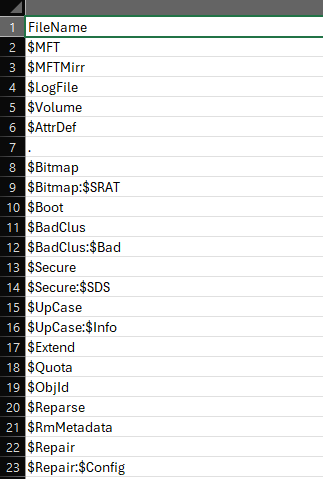

Mà các file shortcut của Windows thường có đuôi là `.lnk`.

Sử dụng `csvsql` để query nhanh xem có file `.lnk` nào xuất hiện trong cột `Filename` này:

```bash
csvsql --query "select Filename from mft where Filename like '%.lnk'" mft.csv
```

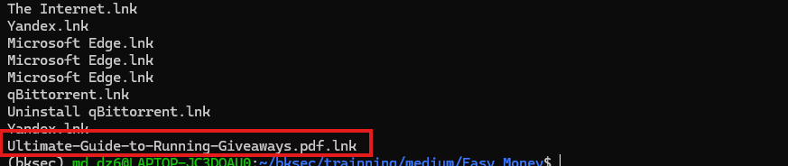
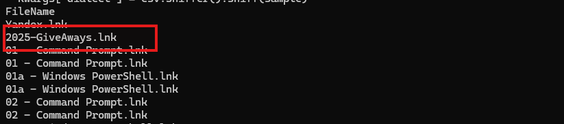

Chú ý hơn vào 2 file có tên lạ này nhưng file `2025-GiveAways.lnk` đáng nghi hơn do file `Ultimate-Guide-to-Running-Giveaways.pdf.lnk` nằm trong `\Users\Administrator\AppData\Roaming\Microsoft\Windows\Recent` và ở cột `SiFlags` chỉ có cờ là `archive`.

Nhưng với file `2025-GiveAways.lnk` lại nằm ở trong `\Users\Administrator\Downloads`, vậy có thể nghĩ tới rằng đây là một shortcut độc hại dùng để gọi command, và trong cột `SiFlags` có cờ `hidden` như để giấu shortcut đi. Đã là shortcut mà còn hidden thì khá lạ.

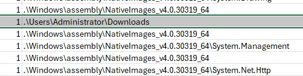
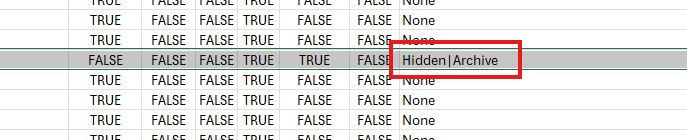


Đồng thời cũng xác nhận file được sử dụng hoặc modify loanh quanh ở khoảng thời gian này.

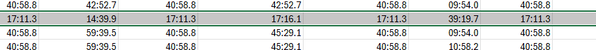

Tiếp tục sử dụng `PECmd` để xác định process nào được shortcut kích hoạt từ 2 file `CMD.EXE-0BD30981.pf` và `POWERSHELL.EXE-CA1AE517.pf`.

Đặc biệt từ nội dung trong file CSV convert từ `POWERSHELL.EXE-CA1AE517.pf` thấy được trong phần `LoadFiles` có `2025-GiveAways.lnk`.

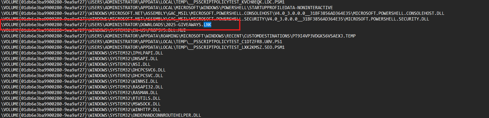

Đồng thời vì đã giới hạn được khoảng thời gian nghi vấn và thấy trong cột `PreviousRun1` thời gian trong khoảng thời gian trùng khớp.

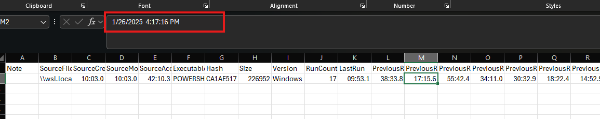

Vậy có thể xác định user thực thi malicious shortcut file.

**Đáp án là:** `2025-01-26 16:17:15`

---

## 3. Task 2 - The previous malicious file executed an initial payload. What is the full path of this payload?

Để nhìn rõ file nào được executed cần đọc qua event log.

Convert 2 file `.evtx` liên quan tới PowerShell này thành CSV.

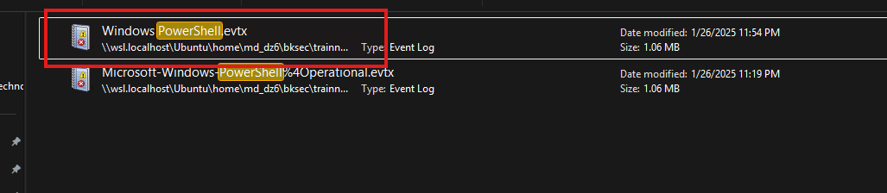

Thấy được trong file CSV convert từ `Windows PowerShell.evtx` có các command PowerShell lạ.

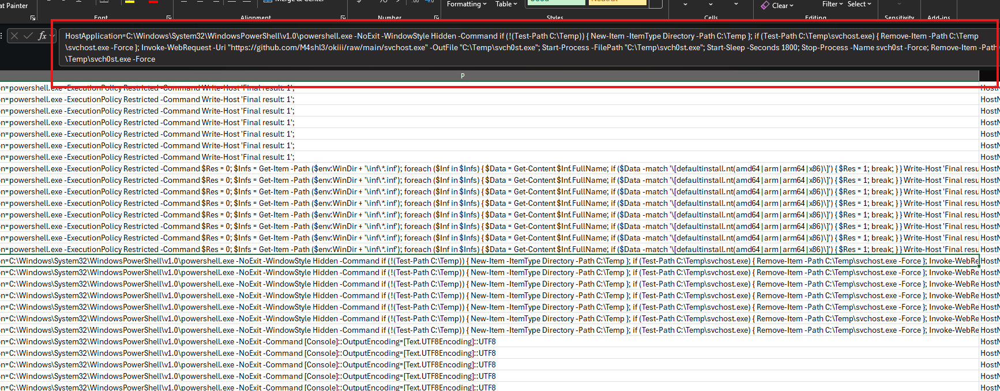

Từ đây thấy được command PowerShell chạy ở chế độ ẩn, tạo thư mục `C:\Temp`, tải file từ URL, lưu file về đường dẫn `C:\Temp\svch0st.exe` rồi thực thi chính file này.

Trong file CSV convert từ `POWERSHELL.EXE-CA1AE517.pf` cũng thấy được file này trong phần `LoadFiles`.

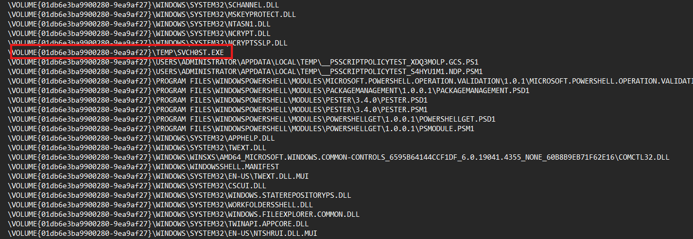

**Vậy đáp án là:** `C:\Temp\svch0st.exe`

---

## 4. Task 3 - At what timestamp did the payload execute and grant the attacker shell access?

Vậy như câu 1, check xem thời gian thực thi payload từ file `SVCH0ST.EXE-9311C47D.pf` khi đã biết payload chứa trong `C:\Temp\svch0st.exe`.

Từ cột `LastRun` thấy được thời gian payload thực hiện lần cuối.

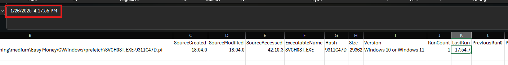

**Vậy đáp án là:** `2025-01-26 16:17:54`

---

## 5. Task 4 - What is the command line the attacker used to enumerate installed packages on the system?

Vẫn từ file CSV convert từ file log `Windows PowerShell.evtx`.

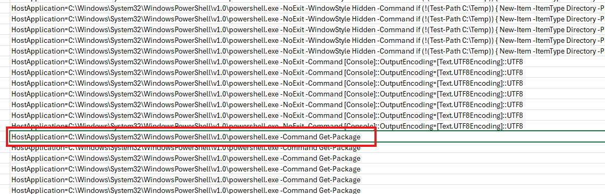

Thấy được có command `C:\Windows\System32\WindowsPowerShell\v1.0\powershell.exe -Command Get-Package` được attacker sử dụng để liệt kê các package đã cài trên hệ thống.

**Vậy đáp án là:** `C:\Windows\System32\WindowsPowerShell\v1.0\powershell.exe -Command Get-Package`

---

## 6. Task 5 - Which application did the attacker identify as vulnerable?

Ở câu hỏi này, không thể thấy trực tiếp đáp án chỉ từ event log. Từ log PowerShell chỉ biết attacker đã enumerate các package đã cài trên hệ thống bằng `Get-Package`.

Vì vậy, bước tiếp theo là pivot sang các file artifact. Với các ứng dụng trên máy thuờng sẽ tạo task update hoặc repair, sau khi tìm thấy folder task thì thấy được các task update hoặc repair tên Yandex Browser.
 
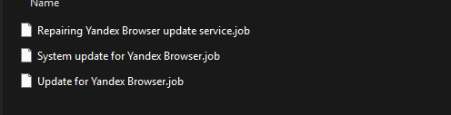
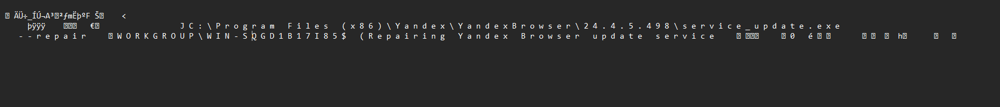
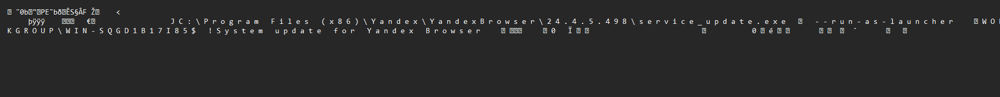
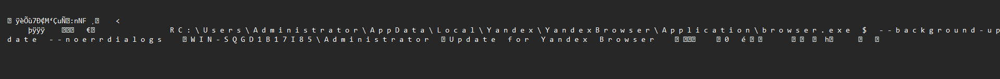

Nội dung của 3 file này là update và repair service.

Đồng thời ngoài folder `Tasks` ở `C`, còn thấy folder `Tasks` trong `System32` cho thấy tồn tại các task tương ứng của Yandex Browser trong hệ thống.

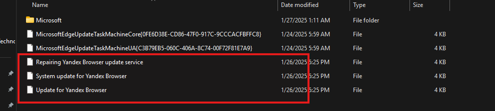

Còn nữa, ở desktop của Administrator cũng thấy shortcut Yandex.

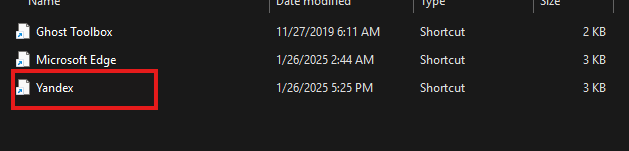

Vậy có thể kết luận hệ thống có cài đặt và sử dụng Yandex Browser.

**Đáp án là:** `YandexBrowser`

---

## 7. Task 6 - What version of that vulnerable application did the attacker identify?

Từ file `System update for Yandex Browser.job` cũng biết được version của app Yandex Browser.

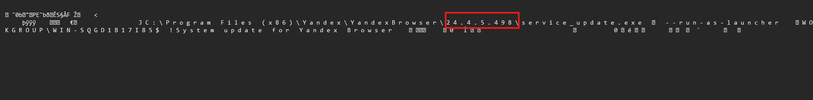

**Đáp án là:** `24.4.5.498`

---

## 8. Task 7 - What is the CVE associated with this vulnerability?

Vì biết rằng hệ thống đang sử dụng `YandexBrowser` phiên bản `24.4.5.498`, thử tra cứu trên NVD thì biết được Yandex Browser for Desktop trước `24.7.1.380` có 1 CVE là `CVE-2024-6473`.

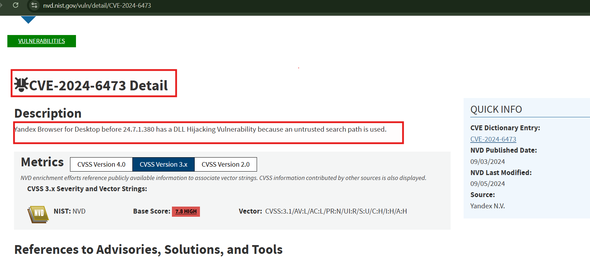

**Vậy đáp án là:** `CVE-2024-6473`

### Kiến thức ngoài lề
Tìm hiểu thêm về CVE này thì hiểu được:

NVD mô tả: Yandex Browser for Desktop trước `24.7.1.380` có lỗi DLL Hijacking vì dùng untrusted search path.

Khi một chương trình Windows cần nạp một DLL, nó sẽ tìm DLL đó theo một số đường dẫn nhất định. Nếu chương trình không chỉ rõ tuyệt đối DLL hợp lệ phải nằm ở đâu, mà lại để Windows đi tìm theo một chuỗi đường dẫn mở, thì attacker có thể đặt một DLL độc có đúng tên ở vị trí mà chương trình sẽ kiểm tra. Khi đó, tiến trình hợp pháp sẽ nạp nhầm DLL độc thay vì DLL chuẩn.

Ví dụ để hiểu:

Có 2 tình huống hay gặp.

**1. Chương trình đang tìm một DLL nhưng thư mục đó chưa có file gốc**

Ví dụ binary hợp pháp chạy và gọi:

```text
abc.dll
```

Nếu ứng dụng không chỉ rõ đường dẫn tuyệt đối, Windows sẽ đi tìm theo thứ tự nào đó. Nếu attacker đặt một `abc.dll` độc vào thư mục mà chương trình sẽ kiểm tra trước, thì chương trình sẽ nạp luôn file đó.

**2. Chương trình ưu tiên nạp DLL từ thư mục ứng dụng**

Ví dụ:

- exe hợp pháp nằm trong thư mục A
- chương trình sẽ tìm DLL trong thư mục A trước
- attacker để `abc.dll` độc vào thư mục A

Nếu thư mục đó trước đây không có `abc.dll`, thì DLL độc sẽ được nạp.

---


## 9. Task 9 - What is the name of the malicious Portable Executable (PE) file that enabled him to accomplish his objective?

Câu hỏi này tìm ra trước câu 8, sau sẽ sử dụng để giải được task 8.

Khi tìm file malicious, chưa thể tìm ngay trong MFT, cũng như trong event log cũng không thấy dấu hiệu của file nào khả nghi, vì vậy quay lại với Prefetch.

Khi thử convert toàn bộ Prefetch sang CSV, từ cột `RunTime` và `ExecutableName`, dùng `csvsql` để query các `ExecutableName` có `RunTime` loanh quanh khoảng thời gian file shortcut được thực thi gọi tới target là tầm `16:xx:xx`.

Đọc qua một lượt, chủ yếu là các filesystem được ghi lại, nhưng riêng có 1 file ở folder temp tên lạ và cũng không phải là file chính thống của Yandex.

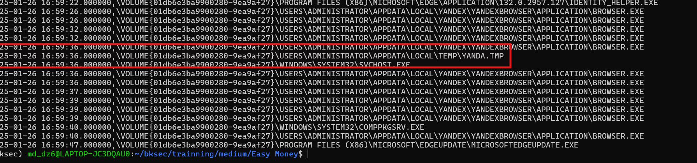

Mà prefetch này xuất hiện quanh các prefetch của browser, vì vậy có thể file này là file được tải xuống để thực thi. Nhưng đây chưa phải đáp án cho câu này nên cần tìm tiếp.

Sau khi tìm một hồi trong `C\Users\Administrator\AppData\Local\Microsoft\Edge\User Data\Default\history` để xem URL mà attacker có thể tận dụng tải file xuống thì chưa thấy gì. Vậy giờ cần tìm những file chứa artifact lưu cache và metadata của nội dung đã được tải hoặc cached.

### Kiến thức ngoài lề

**Content** là file thật đã được cache. Nếu máy từng tải hoặc cached một object nào đó, thì phần dữ liệu thật của object đó nằm trong `Content`.

Ví dụ:

- nếu tải một PE, thì trong `Content` có thể là chính binary PE đó
- nếu tải một script, thì trong `Content` có thể là nội dung script
- nếu tải một file khác, thì `Content` chứa payload thật

**MetaData** là thông tin mô tả về object đã cache. Nó thường cho biết những thứ như:

- object này đến từ URL nào
- tên gốc là gì
- liên quan host nào
- có thể có một số thông tin phụ khác

Vì vậy:

- `Content` giữ file thật
- `MetaData` giữ thông tin mô tả của file đó

---
Tìm thấy folder chứa cache hoặc metadata `C\Users\Administrator\AppData\LocalLow\Microsoft\CryptnetUrlCache`.

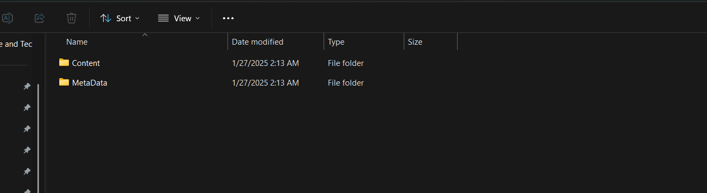

Thử từng folder, dùng `strings` để đọc các chuỗi đọc được rồi dùng `grep` tìm nhanh. 

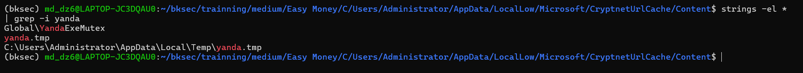

Thấy có `yanda.tmp` và đường dẫn `C:\Users\Administrator\AppData\Local\Temp\yanda.tmp`, tuy nhiên chưa thấy rõ nguồn tải hay URL cụ thể, vì vậy sang thư mục `MetaData` để tìm thêm thông tin.

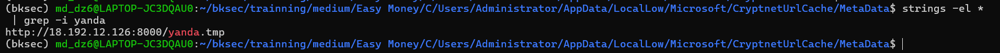

Ở đây thấy ra đường URL dùng để tải file `yanda.tmp`, vì vậy tiếp tục `grep` IP:PORT kia để xem có tìm thấy từ URL này attacker có tải thêm gì không.

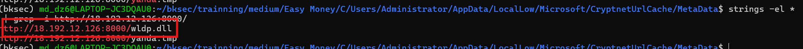

Cuối cùng xác định được ngoài `yanda.tmp`, attacker còn tải thêm file `wldp.dll` từ cùng nguồn `http://18.192.12.126:8000/`.

**Vậy đáp án là:** `wldp.dll`

---

## 10. Task 10 - What is the SHA-256 hash of that malicious file?

Vậy sau khi biết malicious file là `wldp.dll`, cần biết tên file đang chứa dữ liệu thông tin về `wldp.dll` trong `MetaData`, sau đó khi biết tên sẽ mapping sang file trong folder `Content` chứa toàn bộ nội dung của file `wldp.dll` để tính hash.

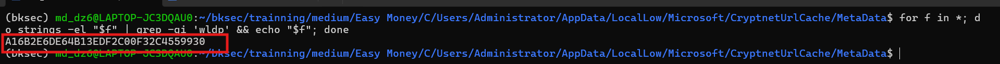

Vậy biết được file chứa URL trỏ tới `wldp.dll` là file `A16B2E6DE64B13EDF2C00F32C4559930`.

Giờ sang `Content` tìm đúng file đó để tính hash thì ra:

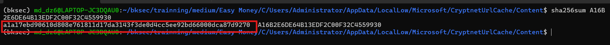

**Vậy kết quả là:** `A1A17EBD90610D808E761811D17DA3143F3DE0D4CC5EE92BD66000DCA87D9270`

---

## 11. Task 11 - How many milliseconds of cumulative coded sleep delays occurred before the C2 binary provided a shell after the vulnerable application was launched?

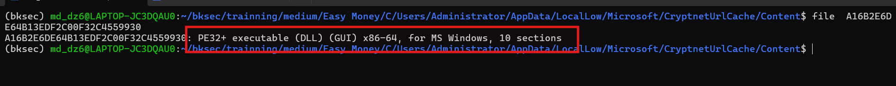

Vì file `wldp.dll` là file `PE32+ executable (DLL)`, nên mở bằng Ghidra để phân tích code và tìm các lệnh gọi `Sleep`.

Sau khi mở vào mục import, tìm hàm `Sleep` thì thấy được:

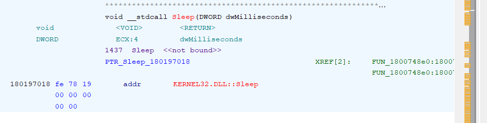

Tiếp tục xem ở đâu đang gọi tới hàm này.

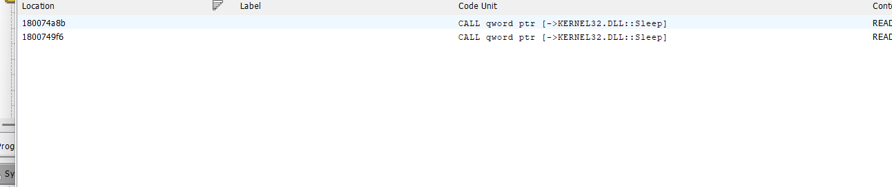

Tìm hàm `Sleep` thì thấy được 2 chỗ tham chiếu tới hàm này. Khi lần theo các XREF và xem phần decompile, thấy có 2 lệnh lần lượt là `Sleep(1000)` và `Sleep(10000)`.

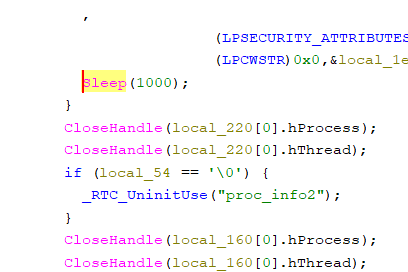
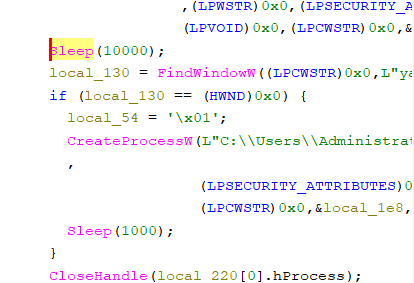

Cuối cùng thấy được tổng thời gian cumulative coded sleep delays là `11000 milliseconds`.

**Đáp án là:** `11000`

---

## 12. Task 12 - What is the mutex name used to ensure only one instance of the C2 binary runs at a time?

### Kiến thức ngoài lề

`mutex` là một key trong Windows hoặc programming dùng để kiểm soát việc nhiều tiến trình hay nhiều luồng cùng dùng một tài nguyên.

---

Từ task 9, sau khi dùng `strings` kết hợp `grep` để tìm các chuỗi liên quan đến `yanda`, ta thu được chuỗi `Global\YandaExeMutex`.

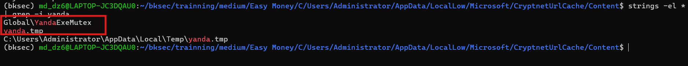

Có thể thấy đây là tên mutex mà mã độc sử dụng.

**Vậy đáp án là:** `Global\\YandaExeMutex`

---

## 13. Task 13 - What is the full path of the Command and Control (C2) Binary?

Từ các 2 chỗ tham chiếu tới hàm `Sleep` xem được trong decompile của Ghidra ở task 11, thấy được sau khi sleep xong có `CreateProcess` và đang trỏ tới process của `yanda.tmp`.

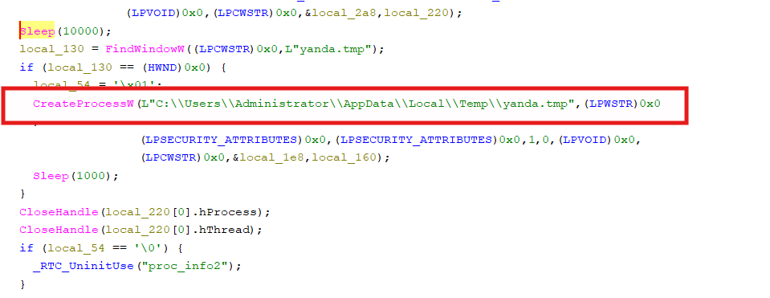

Đồng thời như cũng thấy được mutex ở task 12 là `Global\\YandaExeMutex` cũng khẳng định `yanda.tmp` chính là process mà DLL này tạo ra để tiếp tục thực thi `C:\Users\Administrator\AppData\Local\Temp\yanda.tmp`, cho thấy file này đã thực sự được execute trên hệ thống.

**Vậy đáp án là:** `C:\Users\Administrator\AppData\Local\Temp\yanda.tmp`

---

## 14. Task 14 - What is the name of the C2 framework used by the attacker?

Ở câu hỏi này làm như câu tính hash của `wldp.dll` nhưng với `yanda.tmp`.

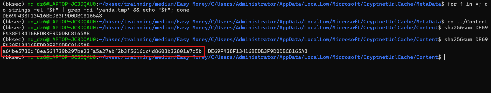

Rồi sử dụng hash này để tra trên VirusTotal.

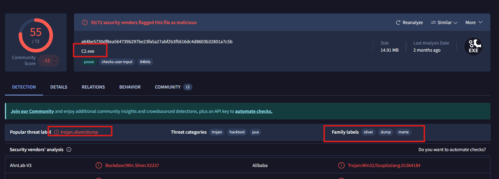

Thấy được trên VirusTotal file này bị nhiều engine nhận diện là C2 hoặc malware, đồng thời phần `popular threat label` hiển thị `trojan.sliver/dump` và `family labels` có `sliver`.

**Vậy đáp án là:** `sliver`

---

## 15. Task 15 - What is the IP address and port number of the malicious C2 server used by the attacker?

Vẫn từ VirusTotal, khi xem ở mục `Network Communication` trong behavior.

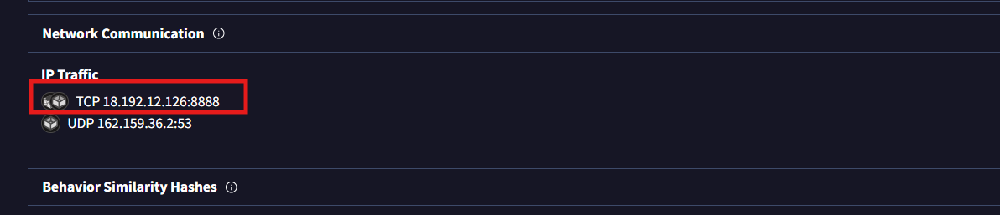

Vậy xác định được malicious C2 server mà implant thực sự kết nối tới là `18.192.12.126` trên cổng `8888`.

**Đáp án là:** `18.192.12.126:8888`

---

## 16. Task 8 - What is the name of the legitimate binary that the attacker used to deliver the malicious payload and establish persistence on the compromised system?

Quay trở lại với task 8.

Sau khi làm đến task 9, đã biết file PE độc hại mà attacker dùng là `wldp.dll`.

Lúc đầu nghi ngờ các binary của Yandex như `browser.exe` hoặc `service_update.exe`, vì từ các task có thể thấy hệ thống tồn tại các tác vụ update hoặc repair của Yandex Browser.

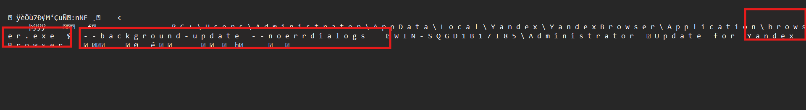
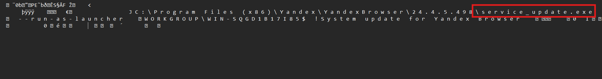

Đồng thời trong Prefetch cũng có nhiều file `BROWSER.EXE-*.pf` và `SERVICE_UPDATE.EXE-*` cho thấy `browser.exe` đã được hệ điều hành thực sự thực thi trên máy và là binary hợp pháp của Yandex Browser.

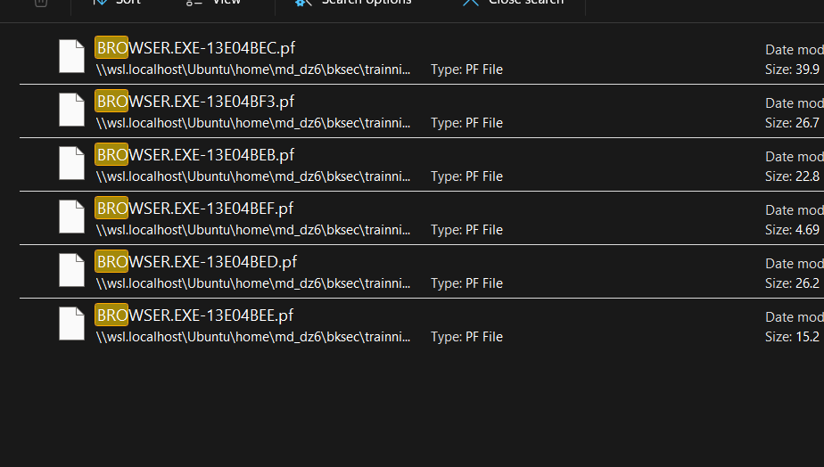
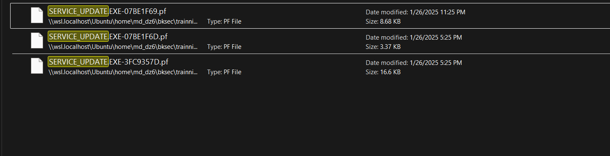

Nhưng đây chưa phải kết quả đúng. Vậy giờ cần suy nghĩ, nếu attacker dùng 1 binary hợp pháp để load DLL độc thì nó có thể có dấu vết hoạt động được ghi lại trong Prefetch.

Sử dụng `csvsql` để query thời gian loanh quanh khoảng thời gian tấn công từ ban đầu xác nhận được (`16:17:xx – 17:00:00`).

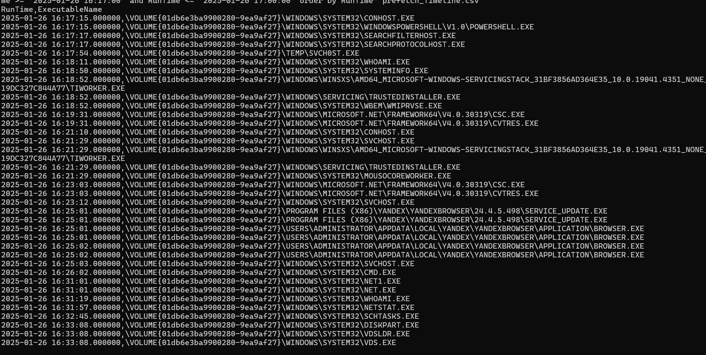

Tìm được rất nhiều binary hợp pháp có Prefetch nằm trong khung thời gian nghi vấn.

Lọc các file trùng thì thu được:

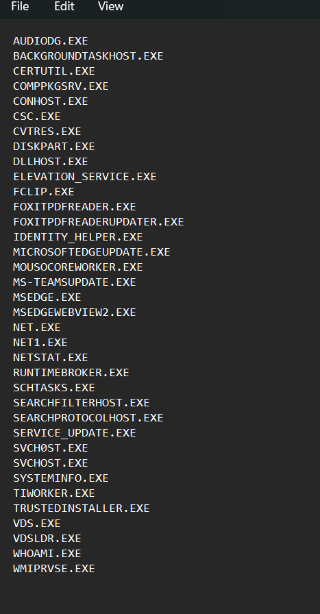

Các file này đã được lọc trùng tên, bỏ đi các file như `yanda.tmp` (đã xác nhận là C2), `browser.exe` (đã xác nhận là sai), `powershell.exe` và `cmd.exe` (đã xác nhận ở các task không có `LoadFiles` nào liên quan tới `yanda.tmp` và `wldp.dll`).

Vì vậy, từ file CSV convert từ toàn bộ các file Prefetch, tiếp tục dùng `csvsql` để lọc ra những binary hợp pháp còn lại trong danh sách nghi vấn. Điều kiện lọc là:

- `SourceFilename` phải trùng với các file đã khoanh vùng
- `FilesLoaded` phải chứa đúng đường dẫn của DLL độc là `C:\Users\Administrator\AppData\Local\Yandex\YandexBrowser\Application\wldp.dll`
- đồng thời phải có ít nhất một mốc thời gian chạy (`LastRun` hoặc các `PreviousRun`) nằm trong khoảng từ `2025-01-26 16:17:00` đến `2025-01-26 17:00:00`

Ví dụ query:

```bash
csvsql -d ',' --query "
select
  SourceFilename,
  ExecutableName,
  FilesLoaded
from prefetch
where
(
  lower(SourceFilename) like '%certutil.exe%' or
  lower(SourceFilename) like '%conhost.exe%' or
  lower(SourceFilename) like '%dllhost.exe%' or
  lower(SourceFilename) like '%foxitpdfreader.exe%' or
  lower(SourceFilename) like '%foxitpdfreaderupdater.exe%' or
  lower(SourceFilename) like '%identity_helper.exe%' or
  lower(SourceFilename) like '%microsoftedgeupdate.exe%' or
  lower(SourceFilename) like '%mousocoreworker.exe%' or
  lower(SourceFilename) like '%ms-teamsupdate.exe%' or
  lower(SourceFilename) like '%msedge.exe%' or
  lower(SourceFilename) like '%msedgewebview2.exe%' or
  lower(SourceFilename) like '%searchfilterhost.exe%' or
  lower(SourceFilename) like '%searchprotocolhost.exe%' or
  lower(SourceFilename) like '%service_update.exe%' or
  lower(SourceFilename) like '%svchost.exe%'
)
and
(
  lower(FilesLoaded) like '%users\\administrator\\appdata\\local\\yandex\\yandexbrowser\\application\\wldp.dll%'
)
and
(
  (LastRun      >= '2025-01-26 16:17:00' and LastRun      <= '2025-01-26 17:00:00') or
  (PreviousRun0 >= '2025-01-26 16:17:00' and PreviousRun0 <= '2025-01-26 17:00:00') or
  (PreviousRun1 >= '2025-01-26 16:17:00' and PreviousRun1 <= '2025-01-26 17:00:00') or
  (PreviousRun2 >= '2025-01-26 16:17:00' and PreviousRun2 <= '2025-01-26 17:00:00') or
  (PreviousRun3 >= '2025-01-26 16:17:00' and PreviousRun3 <= '2025-01-26 17:00:00') or
  (PreviousRun4 >= '2025-01-26 16:17:00' and PreviousRun4 <= '2025-01-26 17:00:00') or
  (PreviousRun5 >= '2025-01-26 16:17:00' and PreviousRun5 <= '2025-01-26 17:00:00') or
  (PreviousRun6 >= '2025-01-26 16:17:00' and PreviousRun6 <= '2025-01-26 17:00:00')
)
order by LastRun
" prefetch.csv > find.csv
```

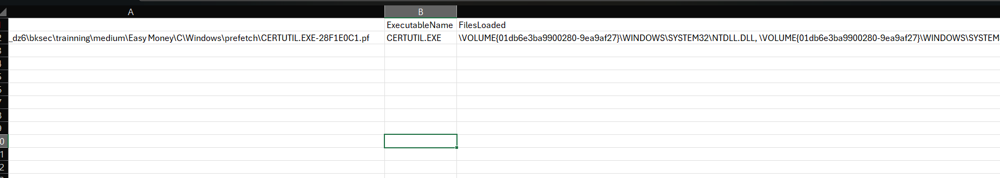

Từ `ExecutableName` có thể thấy được sau khi lọc chỉ còn lại `CERTUTIL.EXE`.

**Vậy đáp án là:** `certutil.exe`

---

## 17. Flow


---

## 18. Bảng câu hỏi - đáp án

| Task | questions | answers |
|---|---|---|
| 1 | At what exact time did the user execute the malicious shortcut file? | `2025-01-26 16:17:15` |
| 2 | The previous malicious file executed an initial payload. What is the full path of this payload? | `C:\Temp\svch0st.exe` |
| 3 | At what timestamp did the payload execute and grant the attacker shell access? | `2025-01-26 16:17:54` |
| 4 | What is the command line the attacker used to enumerate installed packages on the system? | `C:\Windows\System32\WindowsPowerShell\v1.0\powershell.exe -Command Get-Package` |
| 5 | Which application did the attacker identify as vulnerable? | `YandexBrowser` |
| 6 | What version of that vulnerable application did the attacker identify? | `24.4.5.498` |
| 7 | What is the CVE associated with this vulnerability? | `CVE-2024-6473` |
| 8 | What is the name of the legitimate binary that the attacker used to deliver the malicious payload and establish persistence on the compromised system? | `certutil.exe` |
| 9 | What is the name of the malicious Portable Executable (PE) file that enabled him to accomplish his objective? | `wldp.dll` |
| 10 | What is the SHA-256 hash of that malicious file? | `A1A17EBD90610D808E761811D17DA3143F3DE0D4CC5EE92BD66000DCA87D9270` |
| 11 | How many milliseconds of cumulative coded sleep delays occurred before the C2 binary provided a shell after the vulnerable application was launched? | `11000` |
| 12 | What is the mutex name used to ensure only one instance of the C2 binary runs at a time? | `Global\\YandaExeMutex` |
| 13 | What is the full path of the Command and Control (C2) Binary? | `C:\Users\Administrator\AppData\Local\Temp\yanda.tmp` |
| 14 | What is the name of the C2 framework used by the attacker? | `sliver` |
| 15 | What is the IP address and port number of the malicious C2 server used by the attacker? | `18.192.12.126:8888` |

---
