# Challenge FortySeven-1

## 1. Đầu vào challenge

Đề bài này là một Sherlock Scenario dạng **OSINT / Threat Intelligence**.

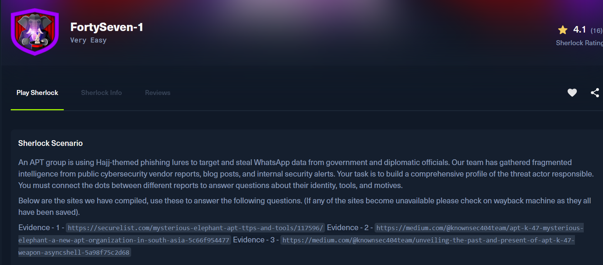

Bối cảnh: có một nhóm APT đang dùng các mồi nhử liên quan đến Hajj để lừa nạn nhân, mục tiêu là quan chức chính phủ và ngoại giao, rồi đánh cắp dữ liệu WhatsApp. Đội điều tra đã thu thập nhiều mảnh thông tin rời rạc từ các báo cáo bảo mật công khai, blog của vendor, và cảnh báo nội bộ.

Ba nguồn evidence chính là:

- **Evidence 1:** SecureList / Kaspersky report  
- **Evidence 2:** KnownSec 404 Team - APT-K-47 / Mysterious Elephant  
- **Evidence 3:** KnownSec 404 Team - Asyncshell analysis  

---

## 2. Task 1

**What is the primary name of the APT group described in the SecureList report?**

Đi vào với Evidence 1, ngay từ tiêu đề đã cho thấy **Mysterious Elephant: a growing threat**.

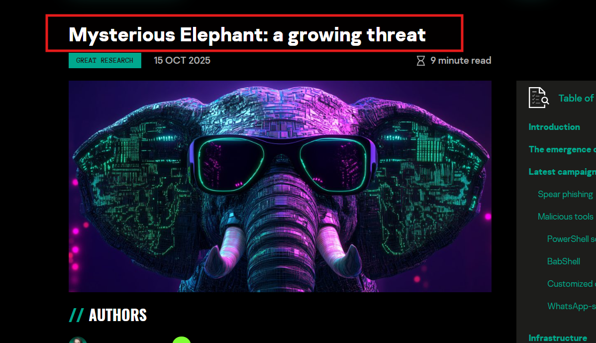

Và ngay ở phần introduction của bài viết cũng cho biết tên của APT đang bị điều tra.

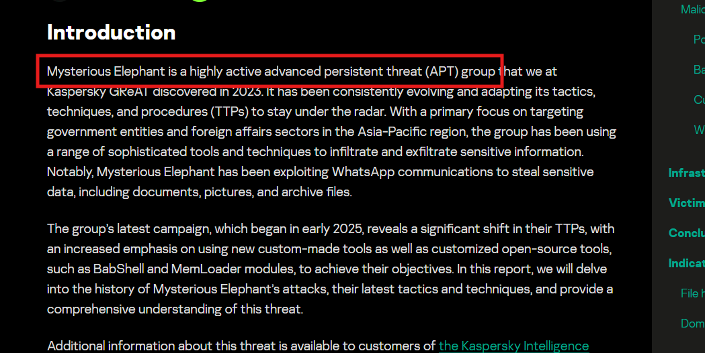

**Vậy đáp án là:** `Mysterious Elephant`

---

## 3. Task 2

**According to the Knownsec 404 team's analysis (Evidence -3), since which year has this group's attack activity been dated back to?**

Từ Evidence 3, khi đọc phần overview biết được nhóm **APT-K-47**, hay còn được gọi là **Mysterious Elephant**, được cho là có nguồn gốc từ khu vực Nam Á và các hoạt động tấn công của nhóm này có thể được truy vết ngược lại xa nhất từ năm **2022**.

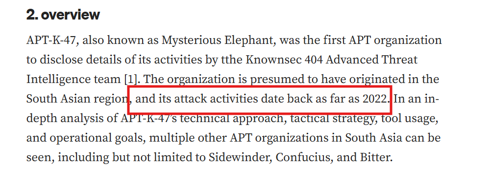

**Vậy đáp án là:** `2022`

---

## 4. Task 3

**The group uses a custom backdoor that communicates via Office Remote Procedure Call (ORPCBackdoor). According to the Knownsec 404 team's analysis (Evidence -2), what is the name of the first malicious exported entry function?**

Từ Evidence 2, khi đọc tới phần **Overview of sample functions** thấy ORPCBackdoor có **17 export functions**. Trong danh sách này cần chú ý tới function `GetFileVersionInfoByHandleEx(void)`.

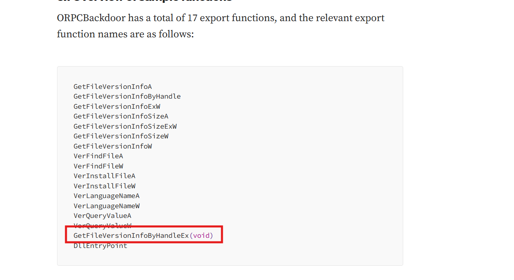

Vì ngay sau đó nó còn được nhắc tới như là malicious entry đầu tiên của ORPCBackdoor. Cụ thể, bài viết nói ORPCBackdoor có 2 malicious entries: entry đầu tiên là `GetFileVersionInfoByHandleEx(void)`, entry thứ hai là `DllEntryPoint`.

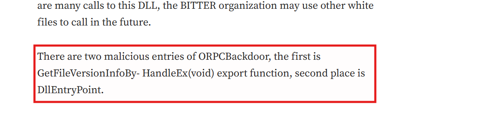

**Vậy đáp án là:** `GetFileVersionInfoByHandleEx(void)`

---

## 5. Task 4

**The previously mentioned backdoor checks for a file before creating persistence. What is the name of the file?**

Vẫn ở Evidence 2, ở mục **persistence** có nhắc tới việc ORPCBackdoor kiểm tra sự tồn tại của file `ts.dat` trước khi tạo persistence. Mục đích là để tránh việc tạo persistence nhiều lần. Nếu file `ts.dat` chưa tồn tại trong cùng đường dẫn, backdoor mới tiến hành tạo persistence rồi sau đó tạo file này.

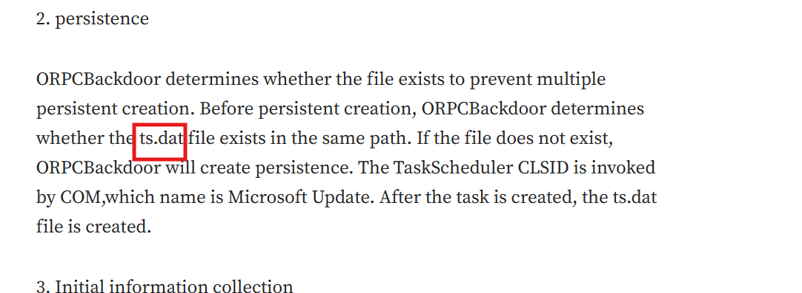

**Vậy đáp án là:** `ts.dat`

---

## 6. Task 5

**The use of the backdoor links the APT to another well-known South Asian APT group. What is the name of this other group?**

Vẫn ở Evidence 2, ngay sau phần liệt kê các export function của ORPCBackdoor, bài viết nhận xét rằng ORPCBackdoor có thể dùng kỹ thuật DLL hijacking và cơ chế white-and-black để né phát hiện. Trong đoạn này, KnownSec nhắc trực tiếp tới **the BITTER organization**, cho thấy backdoor này có liên hệ với nhóm **BITTER**.

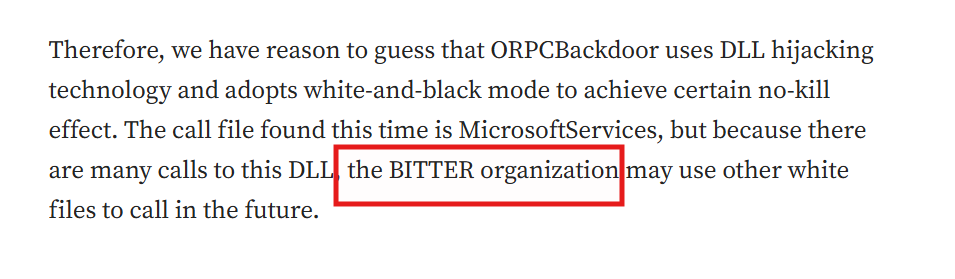

Đồng thời ở phần **Homology analysis**, bài viết cũng so sánh ORPCBackdoor với các chiến thuật từng được nhóm **BITTER** sử dụng.

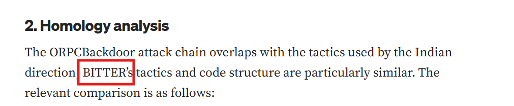

Và ở cuối phần references có hẳn bài viết cùng chủ đề liên quan tới nhóm Bitter này.

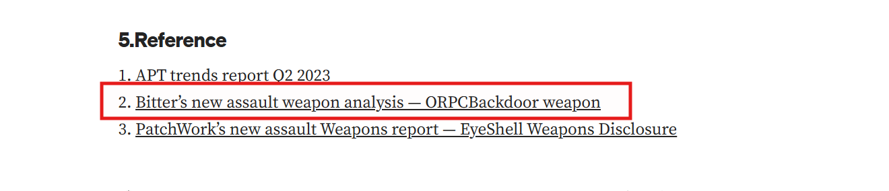

**Vậy đáp án là:** `Bitter`

---

## 7. Task 6

**The APT group we are currently investigating has consistently used and updated another backdoor since 2023, with its C2 communication evolving from TCP to HTTPS. What is the name of this tool?**

Sang Evidence 3, khi đọc tới mục **The transition from tcp to https** thấy được luồng communication đã thay đổi từ TCP sang HTTPS, nên phiên bản này được ghi nhận là **Asyncshell-v2**.

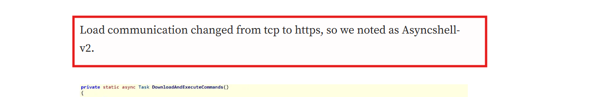

**Vậy đáp án là:** `Asyncshell-v2`

---

## 8. Task 7

**To evade sandbox analysis, the MemLoader HidenDesk tool checks the number of active processes before running. What is the minimum number of processes required for it to proceed?**

Sang Evidence 1, trong phần mô tả **MemLoader HidenDesk** cho biết malware sẽ kiểm tra số lượng active processes đang chạy. Nếu hệ thống có ít hơn **40** process, malware sẽ tự kết thúc để né sandbox analysis.

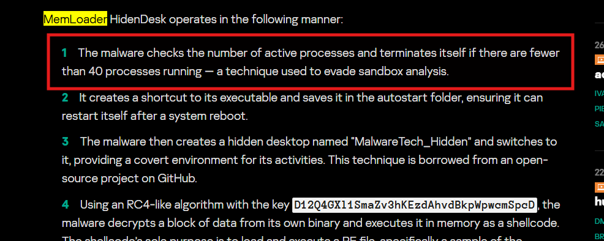

**Vậy đáp án là:** `40`

---

## 9. Task 8

**The MemLoader HidenDesk tool creates a covert environment for its activities by creating and switching to a specific environment. What is the name of this hidden desktop?**

Vẫn ở Evidence 1, trong phần **MemLoader HidenDesk**, sau đoạn kiểm tra số lượng process và tạo shortcut trong autostart folder, malware sẽ tạo một hidden desktop tên là **MalwareTech_Hidden** rồi chuyển sang desktop này.

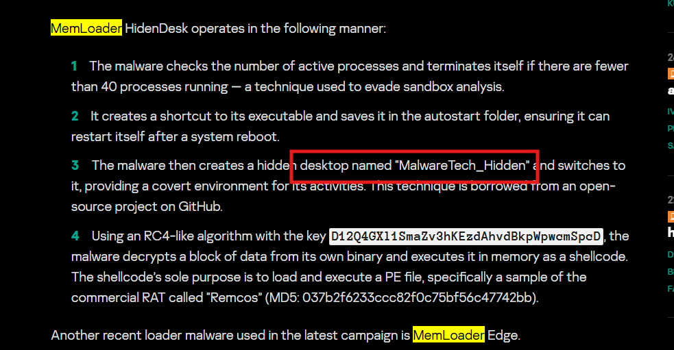

**Vậy đáp án là:** `MalwareTech_Hidden`

---

## 10. Task 9

**The MemLoader HidenDesk tool achieves persistence by placing a shortcut in the autostart folder to ensure it runs after a system reboot. What is the MITRE ATT&CK ID for the 'Registry Run Keys / Startup Folder' technique?**

Từ Evidence 1, MemLoader HidenDesk tạo persistence bằng cách tạo shortcut tới executable của nó và lưu shortcut này vào autostart folder để có thể chạy lại sau khi hệ thống reboot.

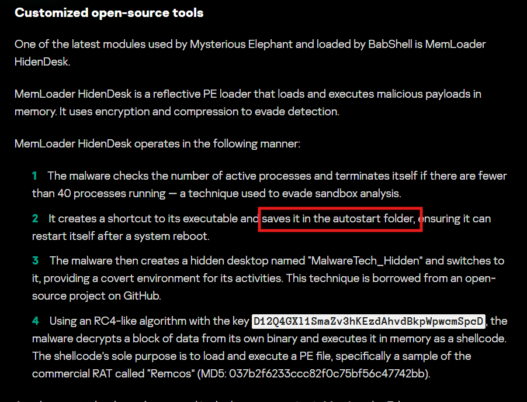

Sau khi tra cứu thêm về MITRE ATT&CK ID của **Registry Run Keys / Startup Folder** biết được có ID là **T1547.001**.

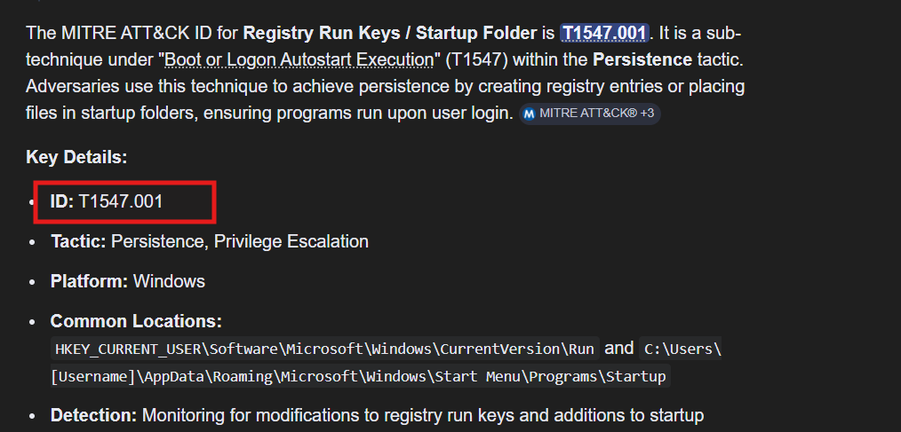

**Vậy đáp án là:** `T1547.001`

---

## 11. Task 10

**The actor uses several custom exfiltration tools targeting WhatsApp. What is the name of the tool that recursively searches specific directories, including the “Desktop” and “Downloads” folders?**

Vẫn ở Evidence 1, trong phần **WhatsApp-specific exfiltration tools**, bài viết liệt kê nhiều công cụ exfiltration mà Mysterious Elephant dùng để đánh cắp dữ liệu liên quan tới WhatsApp.

Khi đọc tới mục **Stom Exfiltrator**, mô tả tool này sẽ recursively searches specific directories, bao gồm **Desktop** và **Downloads**, cũng như các ổ đĩa khác trừ ổ C, để thu thập file theo các phần mở rộng được định nghĩa sẵn.

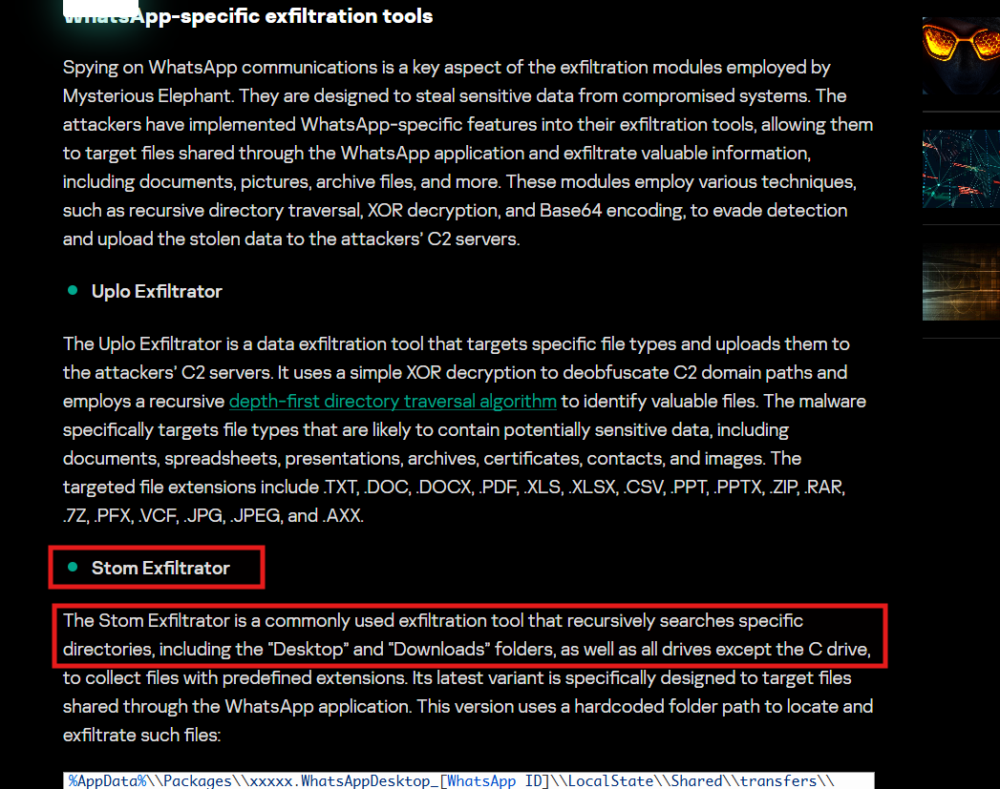

**Vậy đáp án là:** `Stom Exfiltrator`

---

## 12. Task 11

**Kaspersky's analysis highlights the actor's heavy use of scripts for execution and deploying payloads. What is the MITRE ATT&CK ID for the 'PowerShell' technique?**

Từ câu hỏi, có thể tra cứu ngay MITRE ATT&CK ID của **PowerShell** thì thấy được ID của technique là **T1059.001**.

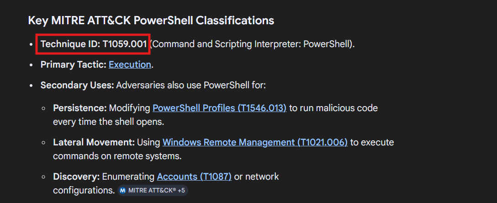

**Vậy đáp án là:** `T1059.001`

---

## 13. Task 12

**In their early attack chains, Mysterious Elephant used a downloader that was previously associated with the Origami Elephant group. What was the name of this downloader?**

Vẫn từ Evidence 1, ở phần **The emergence of Mysterious Elephant**, các early attack chains của Mysterious Elephant có những yếu tố như remote template injection, khai thác **CVE-2017-11882**, sau đó dùng một downloader tên là **Vtyrei**. Downloader này trước đó từng được liên hệ với nhóm **Origami Elephant** và sau này bị nhóm đó bỏ dùng.

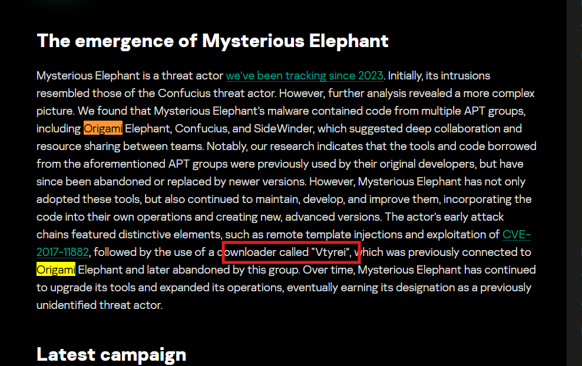

**Vậy đáp án là:** `Vtyrei`

---

## 14. Task 13

**In a January 2024 campaign delivering an Asyncshell payload, which CVE was exploited in the malicious archive file?**

Từ Evidence 3, trong phần **Discover Asyncshell for the first time**, lần đầu phát hiện Asyncshell vào tháng 1/2024. Khi đó, malicious archive file khai thác lỗ hổng **CVE-2023-38831** để thực thi payload. Payload này dùng async programming để triển khai shell functionality nên được đặt tên là **AsyncShell-v1**.

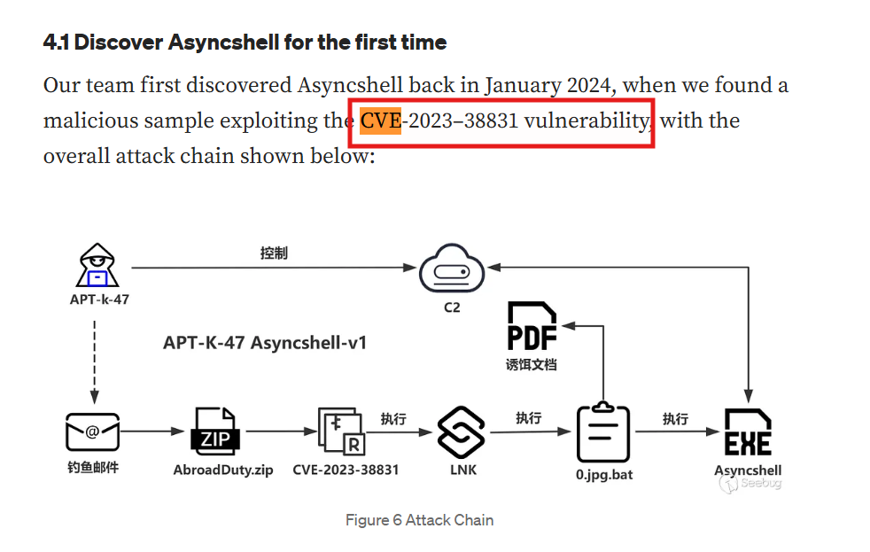

**Vậy đáp án là:** `CVE-2023-38831`

---

## 15. Task 14

**What is the MD5 hash of the ChromeStealer Exfiltrator sample named WhatsAppOB.exe?**

Từ Evidence 1, phần **Indicators of compromise** chứa danh sách hash theo từng nhóm tool. Trong mục **ChromeStealer Exfiltrator** có tên `WhatsAppOB.exe` và có MD5 hash của file này là `9e50adb6107067ff0bab73307f5499b6`.

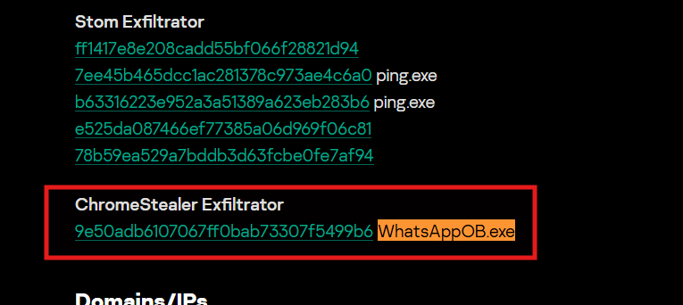

**Vậy đáp án là:** `9e50adb6107067ff0bab73307f5499b6`

---

## 16. Task 15

**The intelligence describes multiple custom tools designed to upload stolen data to the actor's servers. According to the MITRE ATT&CK framework, what is the ID for the 'Exfiltration Over C2 Channel' technique?**

Ngay từ câu hỏi đã biết tên kỹ thuật cần tra là **Exfiltration Over C2 Channel**. Khi tìm technique này trên MITRE ATT&CK, trang chính thức hiển thị ID tương ứng là **T1041**.

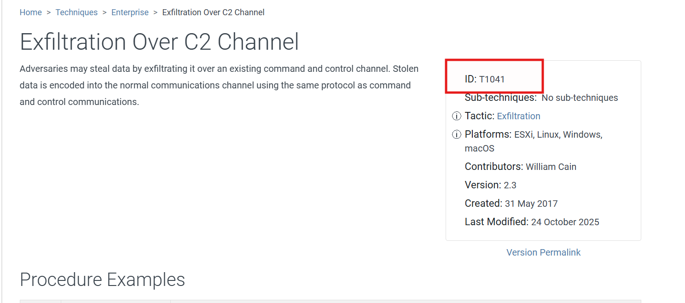

**Vậy đáp án là:** `T1041`

---

## 17. Bảng câu hỏi - đáp án

| Task | Câu hỏi | Đáp án |
|---|---|---|
| 1 | What is the primary name of the APT group described in the SecureList report? | `Mysterious Elephant` |
| 2 | According to the Knownsec 404 team's analysis (Evidence -3), since which year has this group's attack activity been dated back to? | `2022` |
| 3 | What is the name of the first malicious exported entry function? | `GetFileVersionInfoByHandleEx(void)` |
| 4 | The backdoor checks for a file before creating persistence. What is the name of the file? | `ts.dat` |
| 5 | What is the name of the other well-known South Asian APT group linked through the backdoor? | `Bitter` |
| 6 | What is the name of the tool whose C2 communication evolved from TCP to HTTPS? | `Asyncshell-v2` |
| 7 | What is the minimum number of processes required for MemLoader HidenDesk to proceed? | `40` |
| 8 | What is the name of the hidden desktop created by MemLoader HidenDesk? | `MalwareTech_Hidden` |
| 9 | What is the MITRE ATT&CK ID for Registry Run Keys / Startup Folder? | `T1547.001` |
| 10 | What is the name of the WhatsApp exfiltration tool that recursively searches Desktop and Downloads? | `Stom Exfiltrator` |
| 11 | What is the MITRE ATT&CK ID for PowerShell? | `T1059.001` |
| 12 | What was the name of the downloader previously associated with Origami Elephant? | `Vtyrei` |
| 13 | Which CVE was exploited in the January 2024 malicious archive file? | `CVE-2023-38831` |
| 14 | What is the MD5 hash of WhatsAppOB.exe? | `9e50adb6107067ff0bab73307f5499b6` |
| 15 | What is the MITRE ATT&CK ID for Exfiltration Over C2 Channel? | `T1041` |

---

## 18. Flow

```mermaid
flowchart TD

    E1["Evidence 1<br/>SecureList / Kaspersky report"]
    E2["Evidence 2<br/>KnownSec 404 Team - APT-K-47 / Mysterious Elephant"]
    E3["Evidence 3<br/>KnownSec 404 Team - Asyncshell analysis"]
    M["Tra cứu bổ sung<br/>MITRE ATT&CK"]


    E1 --> T1["Task 1<br/>Mysterious Elephant"]
    E1 --> T7["Task 7<br/>40 active processes"]
    E1 --> T8["Task 8<br/>MalwareTech_Hidden"]
    E1 --> T10["Task 10<br/>Stom Exfiltrator"]
    E1 --> T12["Task 12<br/>Vtyrei"]
    E1 --> T14["Task 14<br/>MD5 của WhatsAppOB.exe"]

    E2 --> T3["Task 3<br/>GetFileVersionInfoByHandleEx(void)"]
    E2 --> T4["Task 4<br/>ts.dat"]
    E2 --> T5["Task 5<br/>Bitter"]

    E3 --> T2["Task 2<br/>Hoạt động truy ngược tới 2022"]
    E3 --> T6["Task 6<br/>Asyncshell-v2"]
    E3 --> T13["Task 13<br/>CVE-2023-38831"]

    M --> T9["Task 9<br/>T1547.001"]
    M --> T11["Task 11<br/>T1059.001"]
    M --> T15["Task 15<br/>T1041"]
```
