# Challenge Vantage

## 1. Đầu vào challenge

Challenge cung cấp nhiều file `.pcap`. Đây là bài kiểu trả lời câu hỏi, nên cần bám theo từng traffic để lần ra từng hành động của attacker.

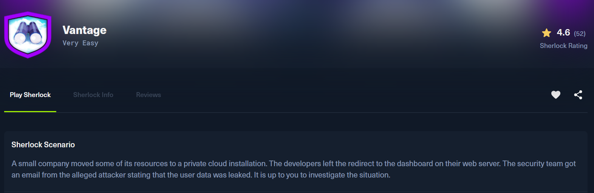

Bài này chia làm 2 hướng chính:

- `web-server.2025-07-01.pcap`: dùng để lần ra bước fuzz web, tìm subdomain, login dashboard và tải file config
- `controller.2025-07-01.pcap`: dùng để lần ra các request trực tiếp tới OpenStack API, Swift, việc tải dữ liệu nhạy cảm và tạo user mới

---

## 2. Task 1

**What tool did the attacker use to fuzz the web server ? (Format- include version e.g, nmap@7.80)**

Trong câu hỏi có cụm **web server**, thử đọc từ file `web-server.2025-07-01.pcap` trước.

Mục tiêu là xem attacker dùng tool gì để fuzz web server. Với web fuzzing, dấu vết thường nằm trong HTTP request, đặc biệt là header `User-Agent`.

Sử dụng filter:

```text
http.user_agent contains "fuzz"
```

khi mở stream thấy được attacker sử dụng:

```text
User-Agent: Fuzz Faster U Fool v2.1.0-dev
```

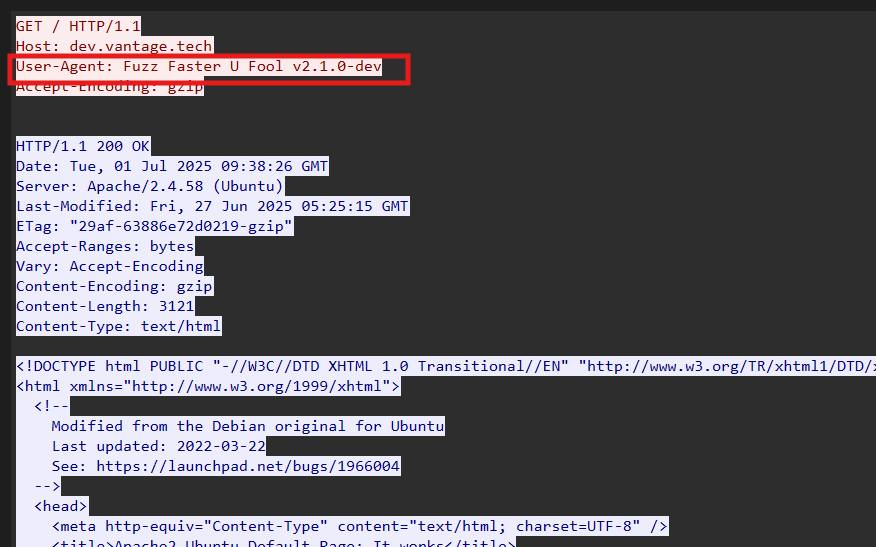

**Vậy đáp án là:** `ffuf@2.1.0`

---

## 3. Task 2

**Which subdomain did the attacker discover?**

Ở câu này attacker đang fuzz subdomain bằng `ffuf`, phần lớn các request tới các subdomain khác đều trả về `200 OK`.

Vậy để tìm subdomain có phản hồi khác biệt, sử dụng filter:

```text
http.response.code && http.response.code != 200
```

để lọc ra các HTTP response không phải `200`.

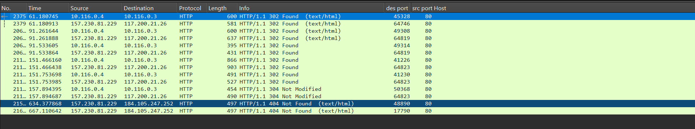

Trong TCP stream cho thấy request được gửi tới:

```text
Host: cloud.vantage.tech
```

bằng `User-Agent: Fuzz Faster U Fool v2.1.0-dev`. Server trả về:

```text
HTTP/1.1 302 Found
Location: http://cloud.vantage.tech/dashboard/
```

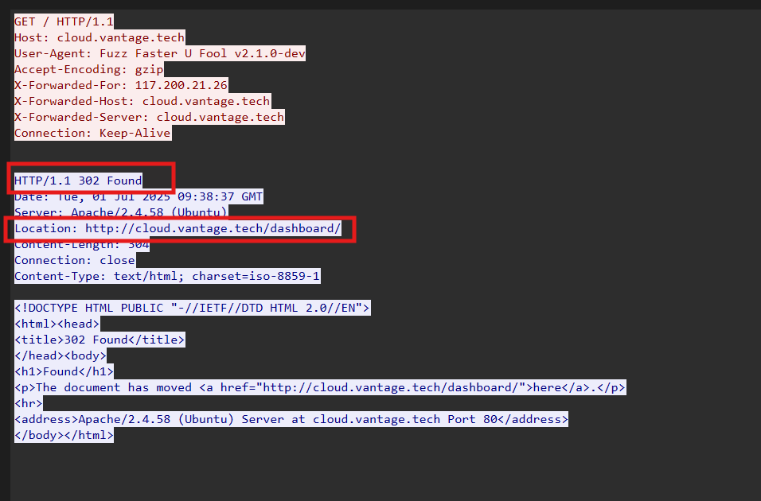

**Vậy đáp án là:** `cloud`

---

## 4. Task 3

**How many login attempts did the attacker make before successfully logging in to the dashboard?**

Ở câu 2 đã tìm thấy subdomain hợp lệ là `cloud.vantage.tech`, và subdomain này redirect tới `/dashboard/`, nên tiếp tục kiểm tra các request đăng nhập vào dashboard.

Sử dụng filter:

```text
http.request.method == "POST" && http.request.uri == "/dashboard/auth/login/"
```

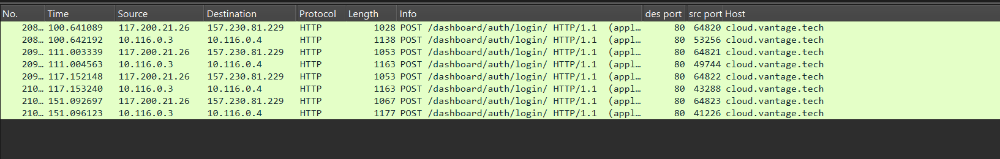

Phần lớn các lần login fail trả về status:

```text
HTTP/1.1 200 OK
```

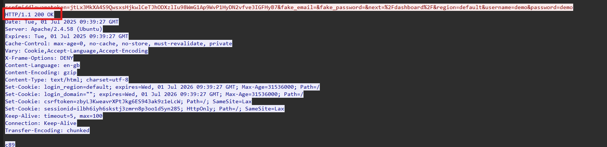

Và có 3 lần đăng nhập thử với:

```text
admin:admin
demo:demo
root:root
```

Login thành công sẽ có redirect:

```text
HTTP/1.1 302 Found
Location: /dashboard/
```

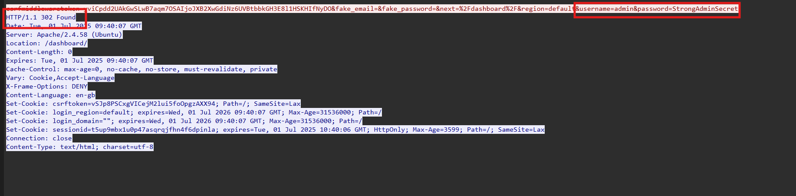

Và chỉ có lần đăng nhập với `admin:StrongAdminSecret` là thành công.

**Vậy đáp án là:** `3`

---

## 5. Task 4

**When did the attacker download the OpenStack API remote access config file? (UTC)**

Sử dụng filter:

```text
http.request && http.host == "cloud.vantage.tech" && http.request.uri contains "dashboard"
```

để lọc các request HTTP tới dashboard trên subdomain `cloud.vantage.tech`, từ đó xem sau khi login attacker đã truy cập những chức năng nào trong OpenStack Horizon.

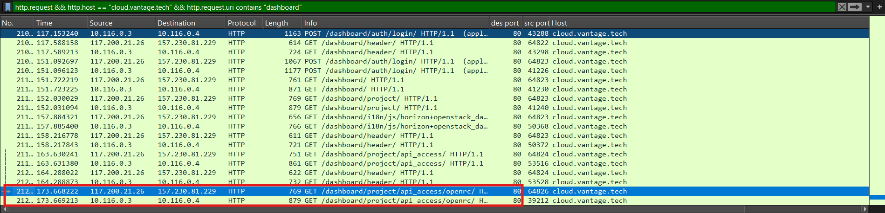

Từ stream có thể thấy request tải file cấu hình remote access của OpenStack, tức file `admin-openrc.sh`.

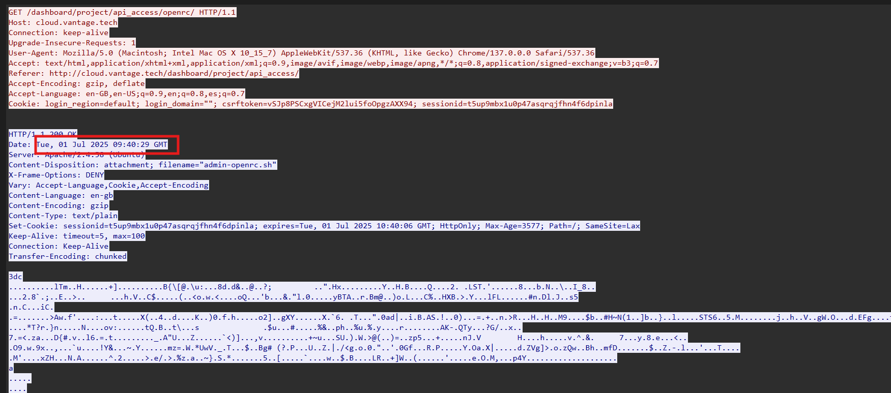

**Vậy đáp án là:** `2025-07-01 09:40:29`

---

## 6. Task 5

**When did the attacker first interact with the API on controller node? (UTC)**

Vì câu hỏi nói rõ **API on controller node** nên mở file `controller.2025-07-01.pcap`.

Ở Task 4, attacker đã tải file `admin-openrc.sh`. File này là OpenStack RC file, dùng để cấu hình truy cập OpenStack API.

Từ web-server PCAP trước đó, IP attacker là `117.200.21.26`.

Sử dụng filter:

```text
ip.src == 117.200.21.26 && http.request
```

để xem request đầu tiên mà attacker gửi tới controller node.

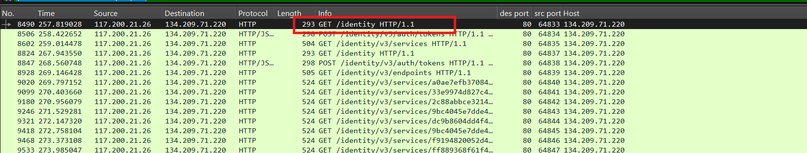

Ngay đầu đã thấy request tới API, mở stream thì thu được thời gian gửi request.

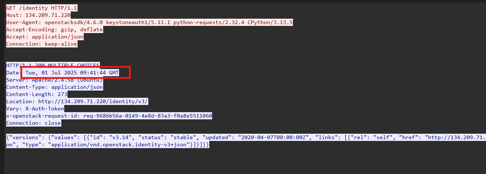

**Vậy đáp án là:** `2025-07-01 09:41:44`

---

## 7. Task 6

**What is the project id of the default project accessed by the attacker?**

Sử dụng filter:

```text
ip.src == 117.200.21.26 && http.request.uri contains "project"
```

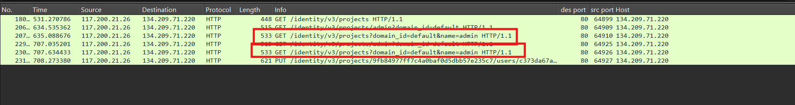

Vì challenge hỏi về **default project** nên chú ý vào các request liên quan tới project trong API. Khi mở stream thì xác định được ID của project mặc định mà attacker truy cập.

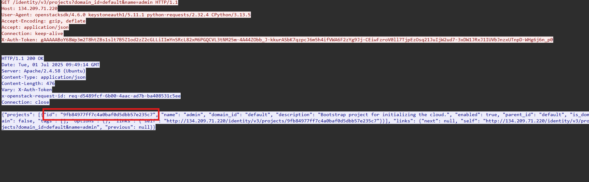

**Vậy đáp án là:** `9fb84977ff7c4a0baf0d5dbb57e235c7`

---

## 8. Task 7

**Which OpenStack service provides authentication and authorization for the OpenStack API?**

Tra cứu xem dịch vụ nào phụ trách **authentication + authorization** của OpenStack.

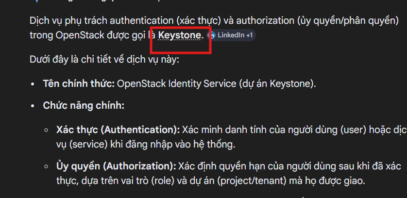

**Vậy đáp án là:** `Keystone`

---

## 9. Task 8

**What is the endpoint URL of the swift service?**

Swift là dịch vụ **Object Storage** của OpenStack, dùng để lưu file/object.

Sử dụng filter:

```text
ip.addr == 117.200.21.26 && http.file_data contains "swift"
```

để tìm trong phần HTTP body/response data chứa từ khóa `swift`, vì endpoint của Swift thường nằm trong service catalog được Keystone trả về sau khi attacker xác thực thành công.

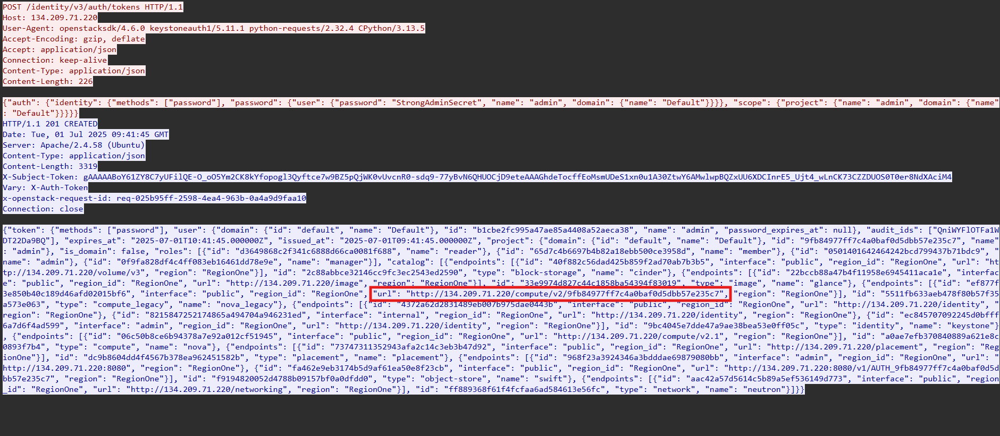

Sau khi xem trong stream của request thấy được response của:

```text
POST /identity/v3/auth/tokens
```

trả về service catalog. Trong đó có service:

- `"type": "object-store"`
- `"name": "swift"`

và phần endpoint chứa URL public của Swift là:

```text
http://134.209.71.220:8080/v1/AUTH_9fb84977ff7c4a0baf0d5dbb57e235c7
```

**Vậy đáp án là:** `http://134.209.71.220:8080/v1/AUTH_9fb84977ff7c4a0baf0d5dbb57e235c7`

---

## 10. Task 9

**How many containers were discovered by the attacker?**

Sử dụng filter:

```text
ip.addr == 117.200.21.26 && http.request.uri contains "v1/AUTH_9fb84977ff7c4a0baf0d5dbb57e235c7"
```

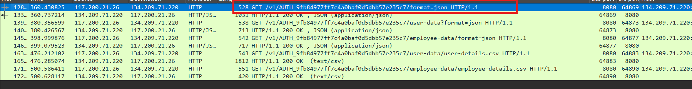

Đây là request list container ở root của Swift account, vì URI chỉ dừng ở:

```text
/v1/AUTH_<project_id>?format=json
```

mà chưa đi vào container cụ thể nào như `/user-data` hay `/employee-data`.

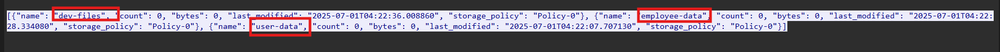

Xem trong stream thấy được có **3** container được trả về.

**Vậy đáp án là:** `3`

---

## 11. Task 10

**When did the attacker download the sensitive user data file? (UTC)**

Attacker download file dữ liệu nhạy cảm của user, vì vậy xem trong các request tới container `user-data`.

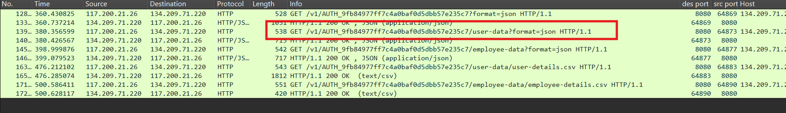

Request này mới chỉ là list file/object trong container `user-data`, nhưng nó cũng gợi ý tới file `user-details.csv`.

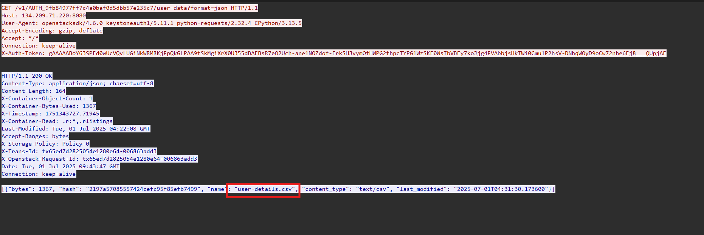

Tiếp tục mở stream của request tải object này thì xác định được thời gian tải file.

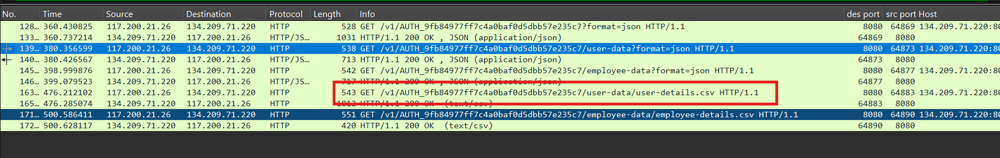

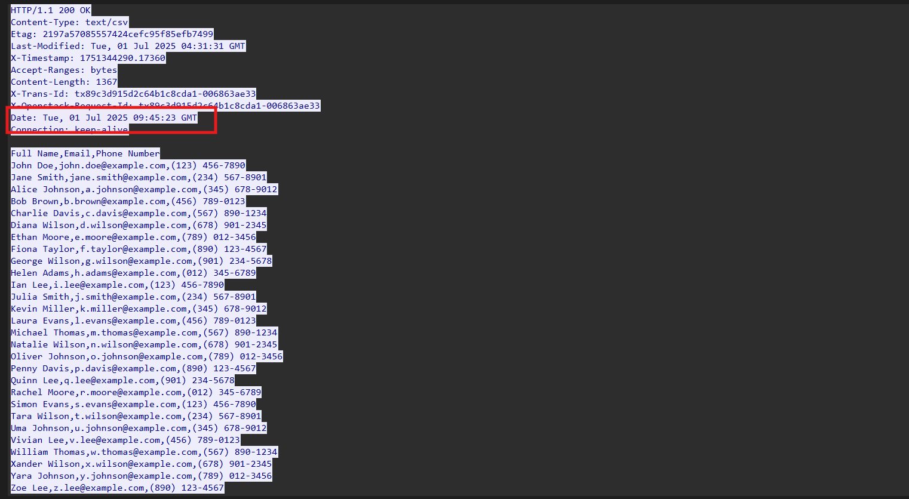

**Vậy đáp án là:** `2025-07-01 09:45:23`

---

## 12. Task 11

**How many user records are in the sensitive user data file?**

Ngay trong stream của request tải `user-details.csv`, đếm số record trong file thì thu được **28** user records.

**Vậy đáp án là:** `28`

---

## 13. Task 12

**For persistence, the attacker created a new user with admin privileges. What is the username of the new user?**

Sử dụng filter:

```text
ip.src == 117.200.21.26 && http.request.method == "POST"
```

để xem attacker đã gửi request nào tới path nào để tạo user.

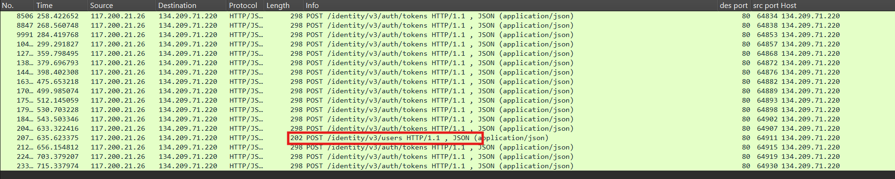

Thấy được có request tạo user, khi xem trong stream thấy được name mà attacker tạo là `jellibean`.

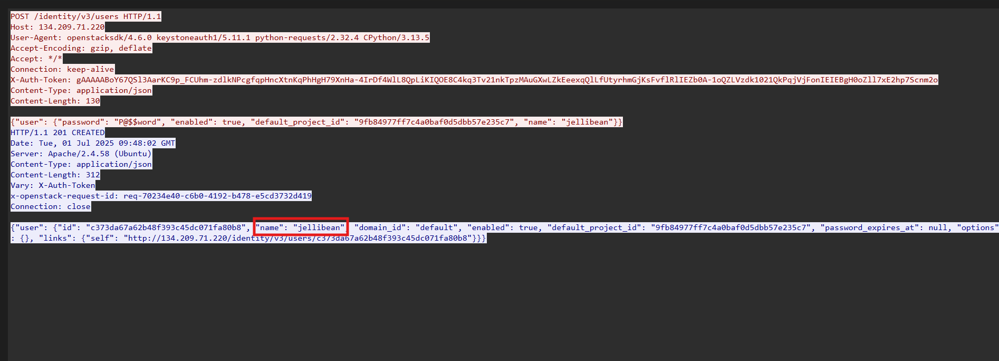

**Vậy đáp án là:** `jellibean`

---

## 14. Task 13

**What is the password of the new user?**

Vẫn trong request tạo user đó cũng thấy được password của user này.

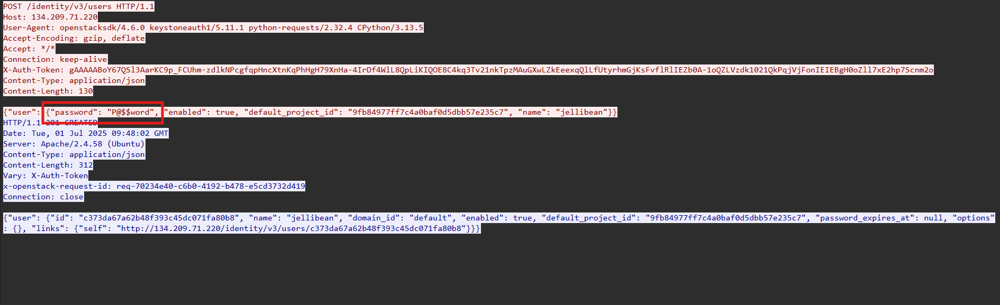

**Vậy đáp án là:** `P@$$word`

---

## 15. Task 14

**What is MITRE tactic id of the technique in task 12?**

Tra cứu về hành vi ở Task 12: attacker tạo một user mới trong môi trường cloud/OpenStack để duy trì quyền truy cập. Trên MITRE ATT&CK, hành vi này tương ứng với kỹ thuật **Create Account: Cloud Account**, thuộc tactic **Persistence**.

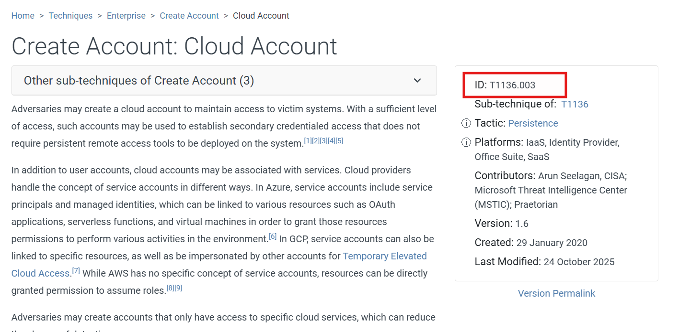

**Vậy đáp án là:** `T1136.003`

---

## 16. Bảng câu hỏi - đáp án

| Task | Câu hỏi | Đáp án |
|---|---|---|
| 1 | What tool did the attacker use to fuzz the web server? | `ffuf@2.1.0` |
| 2 | Which subdomain did the attacker discover? | `cloud` |
| 3 | How many login attempts did the attacker make before successfully logging in to the dashboard? | `3` |
| 4 | When did the attacker download the OpenStack API remote access config file? (UTC) | `2025-07-01 09:40:29` |
| 5 | When did the attacker first interact with the API on controller node? (UTC) | `2025-07-01 09:41:44` |
| 6 | What is the project id of the default project accessed by the attacker? | `9fb84977ff7c4a0baf0d5dbb57e235c7` |
| 7 | Which OpenStack service provides authentication and authorization for the OpenStack API? | `Keystone` |
| 8 | What is the endpoint URL of the swift service? | `http://134.209.71.220:8080/v1/AUTH_9fb84977ff7c4a0baf0d5dbb57e235c7` |
| 9 | How many containers were discovered by the attacker? | `3` |
| 10 | When did the attacker download the sensitive user data file? (UTC) | `2025-07-01 09:45:23` |
| 11 | How many user records are in the sensitive user data file? | `28` |
| 12 | For persistence, the attacker created a new user with admin privileges. What is the username of the new user? | `jellibean` |
| 13 | What is the password of the new user? | `P@$$word` |
| 14 | What is MITRE tactic id of the technique in task 12? | `T1136.003` |

---

## 17. Flow

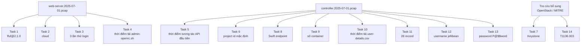
