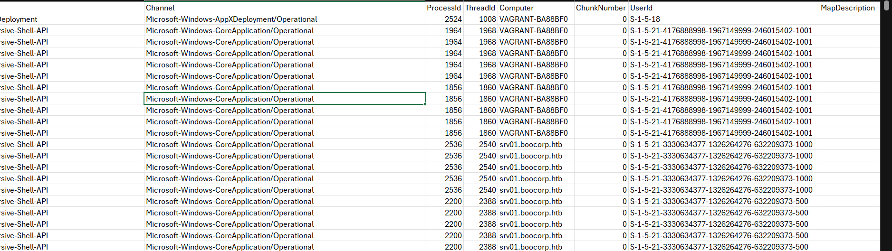
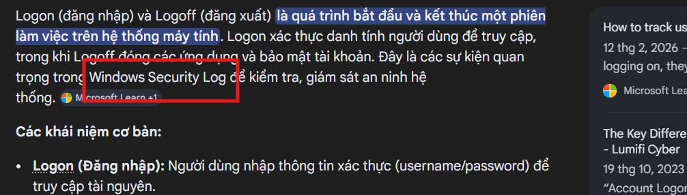
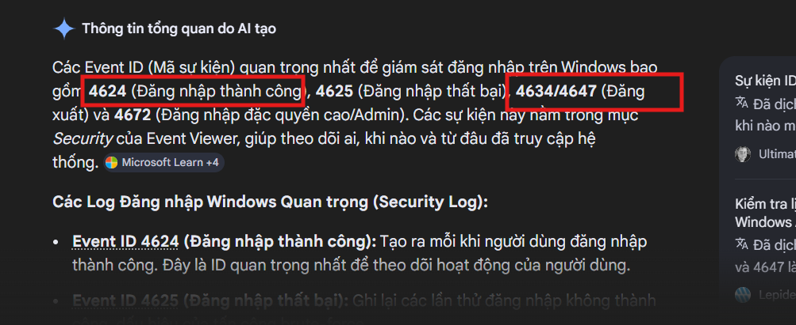
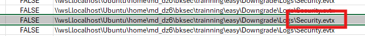
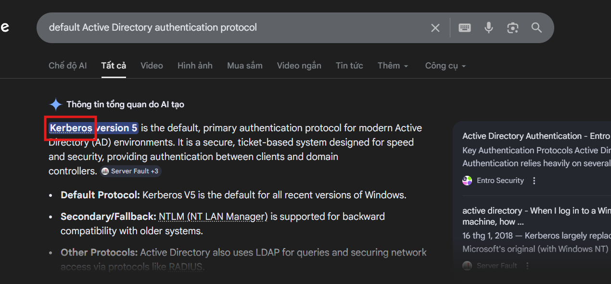
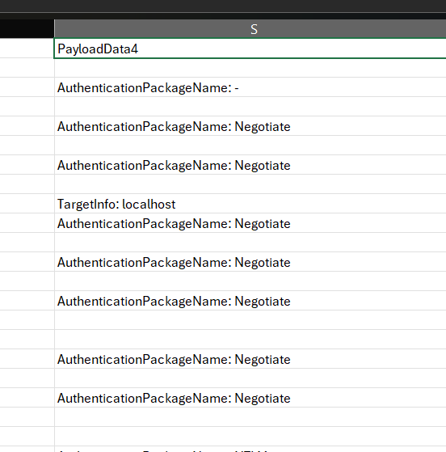
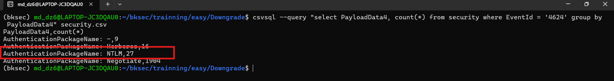
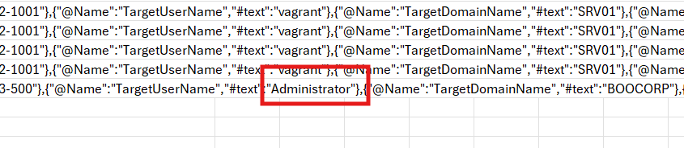
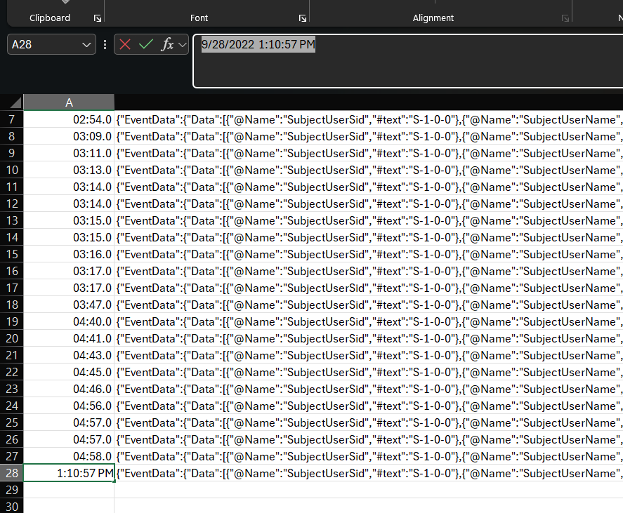
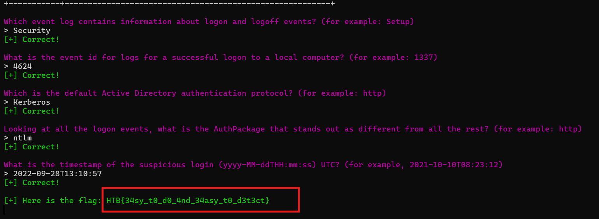

# Challenge Downgrade

## 1. Đầu vào challenge

Đầu vào challenge cung cấp nhiều file log `.evtx`. Trước tiên convert toàn bộ log sang 1 file CSV để dễ quan sát bằng `EvtxECmd.exe`:

```powershell
.\EvtxECmd.exe -d "\\wsl.localhost\Ubuntu\home\md_dz6\bksec\trainning\easy\Downgrade\Logs" --csv "\\wsl.localhost\Ubuntu\home\md_dz6\bksec\trainning\easy\Downgrade" --csvf evtx.csv
```



---

## 2. Which event log contains information about logon and logoff events?

Sau khi tra cứu thêm về **logon** và **logoff** thấy được đây là các sự kiện trong **Windows Security log**.



Đồng thời biết được Event ID của các sự kiện này.





Thử dùng filter là `4624` xác nhận được event này đến từ `Security.evtx`.

**Vậy đáp án là:** `Security`

---

## 3. What is the event id for logs for a successful logon to a local computer? (for example: 1337)

Đã xác định được ở câu trên.

**Đáp án là:** `4624`

---

## 4. Looking at all the logon events, what is the AuthPackage that stands out as different from all the rest? (for example: http)

### Kiến thức ngoài lề

- **Active Directory (AD)** là hệ thống quản lý tài khoản, máy tính, quyền truy cập trong mạng Windows domain.
- **Authentication protocol** là “cách” hoặc “bộ quy tắc” để hệ thống kiểm tra:
  - bạn là ai
  - bạn đăng nhập có đúng không
  - bạn có được phép vào dịch vụ nào không

Trong AD, giao thức mặc định đó là **Kerberos**.



Trong file gốc, ở phần giải thích ngắn ngay sau đoạn kiến thức ngoài lề, đáp án được ghi là:

**Đáp án là:** `Kerberos`

---

## 5. Looking at all the logon events, what is the AuthPackage that stands out as different from all the rest? (for example: http)

Sử dụng filter với Event ID `4624` để chỉ lấy các logon event. Sau đó, quan sát cột `PayloadData4`, vì đây là cột chứa trường `AuthenticationPackageName`, từ đó xác định `AuthPackage` xuất hiện trong các lần đăng nhập.



Nhưng để nhìn bằng mắt thường khá khó để nhận ra, vì vậy sử dụng tool `csvsql` để có thể viết những câu truy vấn như SQL:

```bash
csvsql --query "select PayloadData4, count(*) from security where EventId = '4624' group by PayloadData4" evtx.csv
```

Trong đó, câu lệnh truy vấn lấy các giá trị trong cột `PayloadData4` của những bản ghi có Event ID `4624`, sau đó nhóm và đếm số lần xuất hiện của từng giá trị để xác định `AuthPackage` nào nổi bật hơn so với các giá trị còn lại.

Cuối cùng ra được kết quả như trong ảnh.



### Giải thích

`AuthPackage` **Negotiate** xuất hiện tới `1904` lần nên loại ngay, chỉ còn **NTLM** và **Kerberos** xuất hiện lần lượt `27` lần và `16` lần. Nhưng **Kerberos** là giao thức mặc định trong môi trường AD, nên `AuthPackage` **NTLM** là cái đáng nghi nhất.

**Đáp án là:** `ntlm`

---

## 6. What is the timestamp of the suspicious login (yyyy-MM-ddTHH:mm:ss) UTC?

Với những gì đã tìm được ở câu hỏi trước, tiếp tục dùng `csvsql` để truy vấn rồi xuất ra file `suspicious.csv`:

```bash
csvsql --query "
select TimeCreated, Payload
from security
where EventId = '4624'
and PayloadData4 = 'AuthenticationPackageName: NTLM'
" evtx.csv > suspicious.csv
```



Sau đó mở file đọc và thấy được ở trường `TargetUserName` của các bản ghi trước đó đều là `vagrant` hoặc `ANONYMOUS LOGON`, chỉ có duy nhất 1 bản ghi là `Administrator`.



Từ đó truy ngược ra thời gian của bản ghi đó thì xác định được là:

```text
2022-09-28 13:10:57
```

**Vậy đáp án là:** `2022-09-28T13:10:57`

---

## 7. Flag

Cuối cùng thu được cờ là:



```text
HTB{34sy_t0_d0_4nd_34asy_t0_d3t3ct}
```

---

## 8. Bảng câu hỏi - đáp án

| Câu hỏi | Đáp án |
|---|---|
| Which event log contains information about logon and logoff events? | `Security` |
| What is the event id for logs for a successful logon to a local computer? | `4624` |
| Looking at all the logon events, what is the AuthPackage that stands out as different from all the rest? | `ntlm` |
| What is the timestamp of the suspicious login (yyyy-MM-ddTHH:mm:ss) UTC? | `2022-09-28T13:10:57` |
