# Challenge Fishy HTTP

## 1. Đầu vào challenge

Challenge cung cấp 2 file:

- `sustraffic.pcapng`
- `smpHost.exe`

Ngay từ tên challenge có thể đoán attacker đã có tương tác với web trước khi thực hiện các bước tiếp theo.

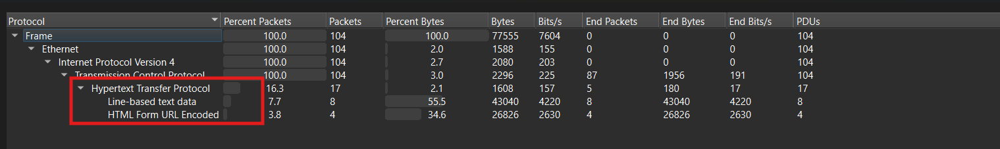

---

## 2. Bắt đầu từ traffic HTTP

Mở file `sustraffic.pcapng` bằng **Wireshark**, sau đó dùng filter:

```text
http
```

thì thấy có nhiều request `POST` được submit.

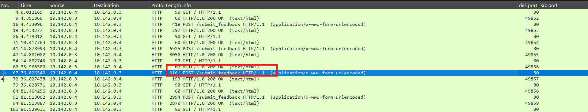

Để bỏ qua các request `GET` và chỉ tập trung vào những request đáng ngờ hơn, tiếp tục dùng filter:

```text
http.request.method == "POST"
```

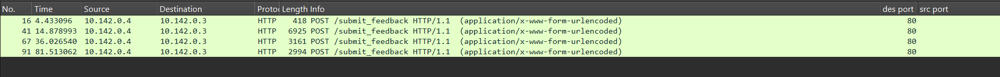

Khi mở **HTTP Stream** để kiểm tra sâu hơn:

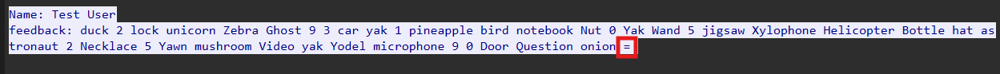

thì thấy trong phần response xuất hiện:

- các chuỗi có dấu `=`
- nhiều số và từ được sắp xếp khá ngẫu nhiên

Điểm này khá đáng nghi vì:

- dấu `=` thường là dấu hiệu hay gặp ở **Base64**
- nhưng nội dung response lại không giống Base64 thuần
-> gợi ý rằng dữ liệu Base64 đang bị **biến đổi** bằng một cơ chế nào đó

---

## 3. Mở `smpHost.exe` bằng ILSpy

Từ đây, nếu chỉ nhìn pcap thì chưa đủ.  
Cần quay sang phân tích file thực thi `smpHost.exe` để hiểu chính xác logic encode/decode.

Mở file `smpHost.exe` bằng **ILSpy** để xem code bên trong.

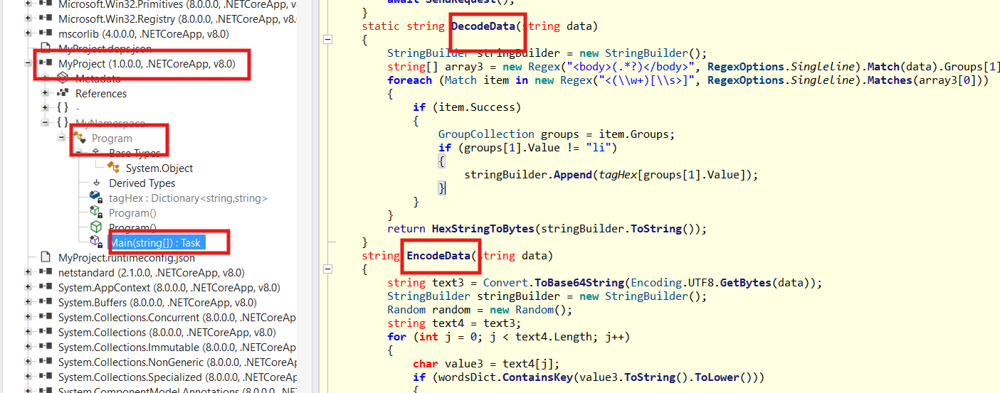

Từ hàm `EncodeData`, có thể rút ra flow hoạt động:

- chuyển payload thành **Base64**
- duyệt từng ký tự trong chuỗi Base64 đó
- mapping từng ký tự đó với **một từ**
- nếu không phải trường hợp cần map thì giữ nguyên
- cuối cùng ghép lại thành một chuỗi mới để gửi đi

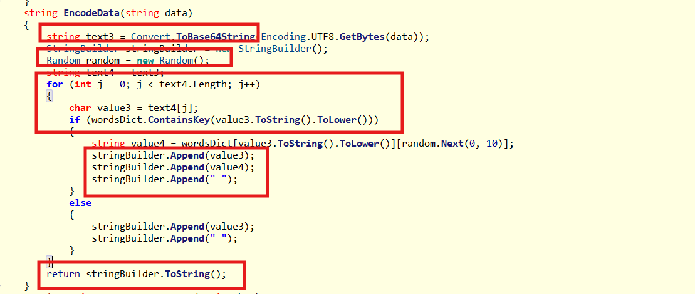

### Ý nghĩa

Điều này có nghĩa là attacker không gửi Base64 trực tiếp. Thay vào đó, họ dùng một lớp word mapping để ngụy trang Base64 thành chuỗi nhìn giống text bình thường hơn.

---

## 4. Decode phần dữ liệu đầu tiên

Hiểu được flow encode hoạt động, chỉ cần làm ngược lại:

1. map từng từ về ký tự Base64 ban đầu
2. ghép lại thành chuỗi Base64 thật
3. decode Base64

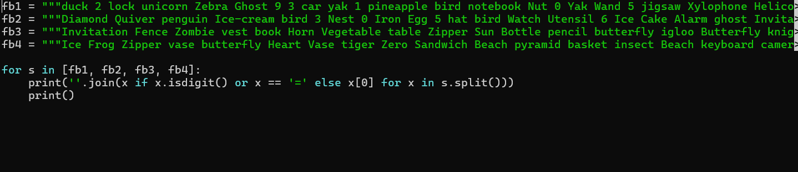

Sau khi thực hiện, thu được kết quả:

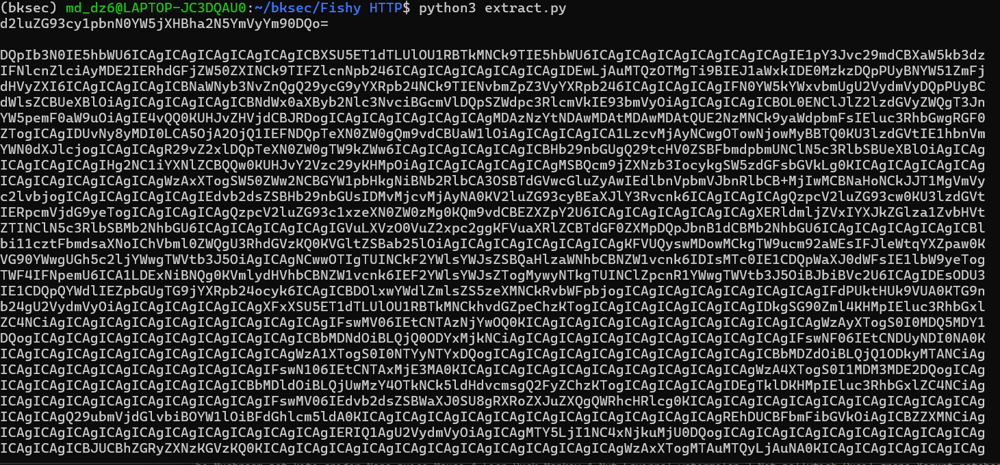

Tiếp tục decode từ Base64:

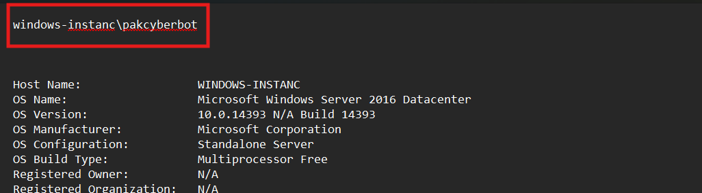

Kết quả cho thấy đây nhiều khả năng là output của:

```text
whoami
```

Điều này gợi ý rằng máy nạn nhân có thể đã bị điều khiển thông qua một cơ chế shell từ xa, nhiều khả năng là **reverse shell**.

---

## 5. Thu được một phần flag

Trong quá trình phân tích, đồng thời biết rằng có file `smpHost.exe` trong folder và từ dữ liệu đã decode được, thu được một phần của flag:

```text
h77P_s73417hy_revSHELL}
```

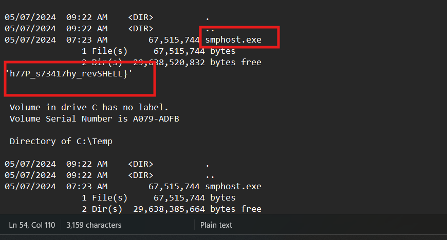

Cần tiếp tục tìm phần còn lại.

---

## 6. Tìm phần còn lại của flag

Khi tìm thêm hint trong code, thấy một hàm / phần logic liên quan tới:

```text
dictionary
```

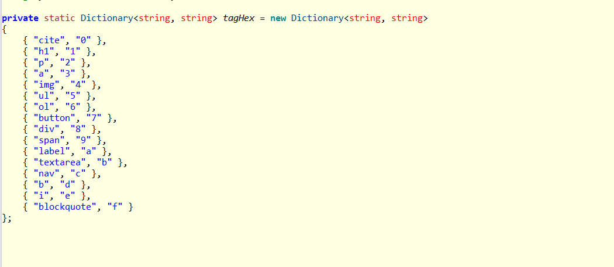

Chức năng của phần này là:

- mapping các tag trong HTML sang từng ký tự **hex**

Đồng thời trong hàm `DecodeData`:

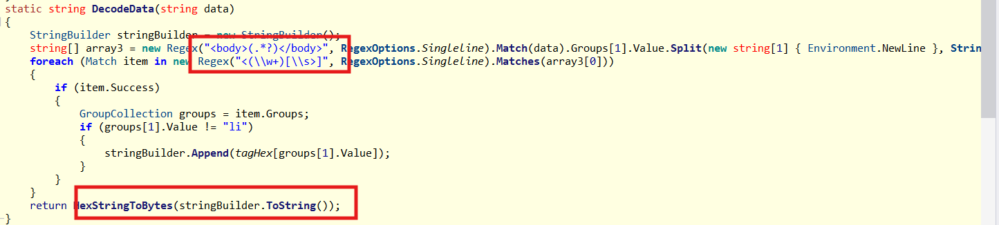

nó sẽ:

- dùng regex để lấy các tag trong phần `body` của HTML
- map từng tag đó về ký tự hex tương ứng
- ghép chuỗi hex lại
- chuyển toàn bộ chuỗi hex thành bytes

---

## 7. Trích phần `body` từ HTTP response

Để lấy phần dữ liệu trong HTTP response ra xử lý và tách riêng ra từng file, dùng lệnh:

```bash
mkdir -p bodies

tshark -r sustraffic.pcapng \
  -Y 'http.response && http.file_data' \
  -T fields \
  -e frame.number \
  -e tcp.stream \
  -e http.file_data \
  -E separator=$'\t' \
| while IFS=$'\t' read -r frame stream hex; do
    [ -n "$hex" ] || continue
    printf '%s' "$hex" | xxd -r -p > "bodies/frame_${frame}_stream_${stream}.bin"
  done
```

Sau đó chỉ cần viết script mô phỏng đúng logic dictionary mapping mà chương trình dùng.

```python
from pathlib import Path
import re

tag_map = {
    "cite": "0",
    "h1": "1",
    "p": "2",
    "a": "3",
    "img": "4",
    "ul": "5",
    "ol": "6",
    "button": "7",
    "div": "8",
    "span": "9",
    "label": "a",
    "textarea": "b",
    "nav": "c",
    "b": "d",
    "i": "e",
    "blockquote": "f",
}

def decode_html_tags(raw: bytes):
    html = raw.decode("utf-8", errors="ignore")

    m = re.search(r"<body[^>]*>(.*)</body>", html, re.S | re.I)
    if m:
        html = m.group(1)

    tags = re.findall(r"<\s*([a-zA-Z0-9]+)(?=[\s>/])", html)
    tags = [t for t in tags if t in tag_map]

    if not tags:
        return None

    hex_str = "".join(tag_map[t] for t in tags)

    if len(hex_str) % 2 != 0:
        return f"[odd hex] {hex_str}"

    try:
        return bytes.fromhex(hex_str)
    except Exception as e:
        return f"[decode error] {e} | {hex_str}"

for path in sorted(Path("bodies").glob("*.bin")):
    raw = path.read_bytes()
    out = decode_html_tags(raw)
    if out is not None:
        print(f"[{path.name}] {out}")
```

---

## 8. Thu được phần còn lại của flag 

Kết quả thu được phần còn lại của flag là:

```text
HTB{Th4ts_d07n37_
```


Ghép hai phần đã thu được flag hoàn chỉnh:

```text
HTB{Th4ts_d07n37_h77P_s73417hy_revSHELL}
```

---

## 10. Tóm tắt flow phân tích

```text
sustraffic.pcapng + smpHost.exe
   |
   v
mở pcap và lọc HTTP
   |
   v
thấy nhiều request POST
   |
   v
mở HTTP Stream
   |
   v
nhận ra response có dạng giống Base64 bị ngụy trang
   |
   v
mở smpHost.exe bằng ILSpy
   |
   v
đọc hàm EncodeData
   |
   v
hiểu được cơ chế map ký tự Base64 sang từ
   |
   v
decode ngược để lấy phần dữ liệu đầu
   |
   v
thu được nửa sau của flag
   |
   v
tìm tiếp hàm dictionary / DecodeData
   |
   v
nhận ra HTML tag được map sang ký tự hex
   |
   v
dùng tshark trích body response
   |
   v
viết script mô phỏng đúng logic mapping
   |
   v
decode ra nửa đầu của flag
   |
   v
ghép lại thành flag hoàn chỉnh
```

---

