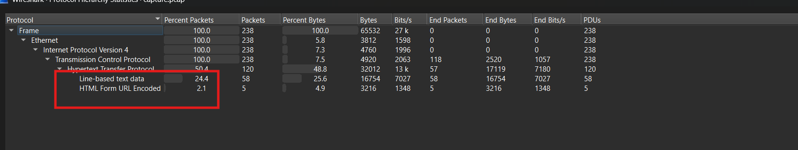
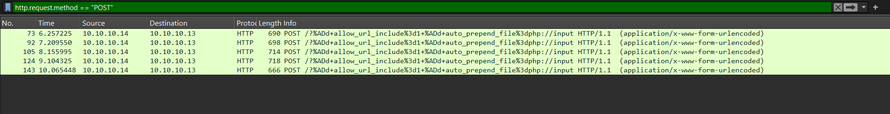
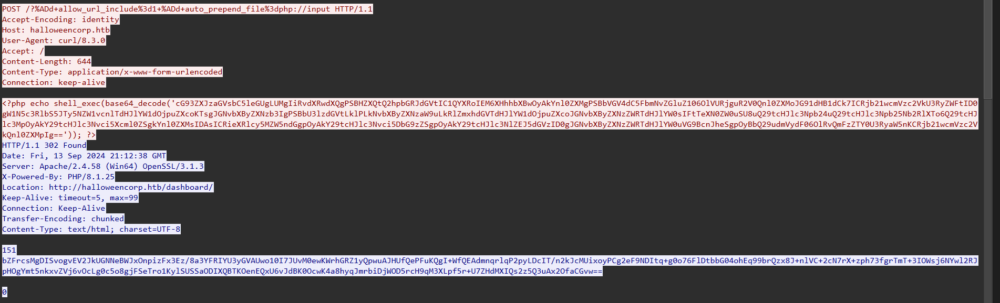
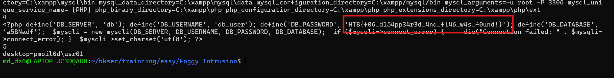

# Challenge Foggy Intrusion

## 1. Đầu vào challenge

Đầu vào challenge cho 1 file `capture.pcap`. Mở file bằng Wireshark thấy được chủ yếu traffic liên quan tới web.



---

## 2. Lọc traffic để tìm request đáng ngờ

Sử dụng filter để lọc các traffic.



Mở thử **TCP Stream** để xem nội dung request.



Thấy nhiều đoạn Base64 khả nghi, decode hết một lượt và thu được các lệnh PowerShell sau.

---

## 3. Các lệnh PowerShell thu được

```powershell
powershell.exe -C "$output = Get-ChildItem -Path C:;
$bytes = [Text.Encoding]::UTF8.GetBytes($output);
$compressedStream = [System.IO.MemoryStream]::new();
$compressor = [System.IO.Compression.DeflateStream]::new($compressedStream, [System.IO.Compression.CompressionMode]::Compress);
$compressor.Write($bytes, 0, $bytes.Length);
$compressor.Close();
$compressedBytes = $compressedStream.ToArray();
[Convert]::ToBase64String($compressedBytes)"
```

```powershell
powershell.exe -C "$output = Get-ChildItem -Path C:\xampp;
$bytes = [Text.Encoding]::UTF8.GetBytes($output);
$compressedStream = [System.IO.MemoryStream]::new();
$compressor = [System.IO.Compression.DeflateStream]::new($compressedStream, [System.IO.Compression.CompressionMode]::Compress);
$compressor.Write($bytes, 0, $bytes.Length);
$compressor.Close();
$compressedBytes = $compressedStream.ToArray();
[Convert]::ToBase64String($compressedBytes)"
```

```powershell
powershell.exe -C "$output = Get-Content -Path C:\xampp\properties.ini;
$bytes = [Text.Encoding]::UTF8.GetBytes($output);
$compressedStream = [System.IO.MemoryStream]::new();
$compressor = [System.IO.Compression.DeflateStream]::new($compressedStream, [System.IO.Compression.CompressionMode]::Compress);
$compressor.Write($bytes, 0, $bytes.Length);
$compressor.Close();
$compressedBytes = $compressedStream.ToArray();
[Convert]::ToBase64String($compressedBytes)"
```

```powershell
powershell.exe -C "$output = Get-Content -Path C:\xampp\htdocs\config.php;
$bytes = [Text.Encoding]::UTF8.GetBytes($output);
$compressedStream = [System.IO.MemoryStream]::new();
$compressor = [System.IO.Compression.DeflateStream]::new($compressedStream, [System.IO.Compression.CompressionMode]::Compress);
$compressor.Write($bytes, 0, $bytes.Length);
$compressor.Close();
$compressedBytes = $compressedStream.ToArray();
[Convert]::ToBase64String($compressedBytes)"
```

```powershell
powershell.exe -C "$output = whoami;
$bytes = [Text.Encoding]::UTF8.GetBytes($output);
$compressedStream = [System.IO.MemoryStream]::new();
$compressor = [System.IO.Compression.DeflateStream]::new($compressedStream, [System.IO.Compression.CompressionMode]::Compress);
$compressor.Write($bytes, 0, $bytes.Length);
$compressor.Close();
$compressedBytes = $compressedStream.ToArray();
[Convert]::ToBase64String($compressedBytes)"
```

- `Get-ChildItem -Path C:`  
  Liệt kê các file và thư mục ở ổ `C:` để xem file hệ thống.

- `Get-ChildItem -Path C:\xampp`  
  Liệt kê nội dung thư mục `xampp` để tìm các file / folder liên quan đến web server.

- `Get-Content -Path C:\xampp\properties.ini`  
  Đọc file `properties.ini` để tìm thông tin cấu hình.

- `Get-Content -Path C:\xampp\htdocs\config.php`  
  Đọc file `config.php` trong thư mục web, thường chứa thông tin như username, password.

- `whoami`  
  Kiểm tra tài khoản hiện tại mà lệnh đang chạy dưới quyền đó.

Chúng đều lấy kết quả lệnh, rồi nén bằng **Deflate** và mã hóa **Base64** trước khi gửi trả về. Vì vậy để đọc được output cần phải decode Base64 trước rồi giải nén.

### Kiến thức ngoài lề
Deflate làm cho dữ liệu nhỏ hơn để tiết kiệm dung lượng lưu trữ hoặc giảm kích thước khi truyền qua mạng. Deflate tìm các chuỗi ký tự hoặc mẫu dữ liệu lặp lại để thay thế chúng bằng các tham chiếu ngắn hơn. Rồi dùng mã hóa Huffman để biểu diễn những ký tự xuất hiện nhiều bằng mã bit ngắn hơn, còn ký tự ít xuất hiện hơn sẽ dùng mã dài hơn. Khi ấy, dữ liệu sau nén thường ngắn hơn so với ban đầu.

---

## 4. Script decode và giải nén

```python
import base64
import zlib

def decode_and_decompress(data):
    raw = base64.b64decode(data.strip())
    try:
        return zlib.decompress(raw, -zlib.MAX_WBITS).decode(errors="ignore")
    except:
        return zlib.decompress(raw).decode(errors="ignore")

b64_1 = "FchbCsAgDAXRrWQF2VN8XzAajLTS1bf9GTiTxFuYshJBK905SMeTFx1RMxKzjigbczi3rZ0C9hAFR3eKcxRUtmZU5MJH/kIYKZ//vg=="
b64_2 = "bZFrcsMgDISvogvEV2JkUGNNeBWJxOnpizFx3Ez/8a3YFRIYU3yGVAUwo10I7JUvM0ewKWrhGRZ1yQpwuAJHUfQePFuKQgI+WfQEAdmnqrlqP2pyLDcIT/n2kJcMUixoyPCg2eF9NDItq+g0o76FlDtbbG04ohEq99brQzx8J+nlVC+2cN7rX+zph73fgrTmT+3IOWsj6NYwl2RJpHOgYmt5nkxvZVj6vOcLg0c5o8gjFSeTro1KylSUSSaODIXQBTKOenEQxU6vJdBK0OcwK4a8hyqJmrbiDjWOD5rcH9qM3XLpf5r+U7ZHdMXIQs2z5Q3uAx2OfaCGvw=="
b64_3 = "hZJdb4IwFIb/Sv8AguKcWdILs4vtYiYsu1kihBxLlcbS1rZM+fcrH92I8SNcQM/z9HDewuaNCqqBZ4gJY4Hzgmn8+pKeoVIKbcHQ3JXJIRdQUfy9WifJuHqgDR6vf6g2TAq8nEwns6cgGjPFwe6krvCJiUKeTHBezNFmpYCUNEPQ3XNDteuRK6ktXkYXVWN4T+bz2CMtpc3d0JRYqRscdoOHPfROaQtJzMjyAcOeeK+QFTDRJZ3OnieRu6aeESl2bF9rsC7ftVa9F7ae31MLdqz76Rmh/RGizbr5+vzIUNWY4xAnjqPFsC6lsZhLArx9GooXGf0r044OzpYJ0M1NK3V8MAuwcNtr6SA+jNxp4X9n0Pu6osIaHNSoHRoFCRqFu34eyXuSIVWqOxEc7YxHE/2J9GypaP/Ea1+9tVJn/AI="
b64_4 = "dY9RS8MwFIX/ynUIyWDKZNkYTjdSW/DFKe3Ux0ttbligpjVtGTL2311a58bA+xIO37nnntwtynUJirSxxFkYYBLFb1HMBsDUB+vPTtHrni3lU9RBbCpyZ44XmSTvz3HoHY+rYKuHE1Q3Y1GWI+FGCoVVqHMxwY2oUA8bqy52ZxGhXMlAJu2RdBwsU6W9Ay4/v6uv3MA9WNpAJ/hf3wGc9GvFoUorDqE+yGjgv2FX86ywlrIaybnC9WELfpQh3nvoiCks6NTkpG6hB9fwz+YMdnBkFdWYrVO3fzlraj31P1jMfwA="
b64_5 = "S0ktzi7JL9AtyM3PzDFIiSktLjIwBAA="

print("1")
print(decode_and_decompress(b64_1))
print("2")
print(decode_and_decompress(b64_2))
print("3")
print(decode_and_decompress(b64_3))
print("4")
print(decode_and_decompress(b64_4))
print("5")
print(decode_and_decompress(b64_5))
```

---

## 5. Kết quả cuối

Thu được flag là:

```text
HTB{f06_d154pp34r3d_4nd_fl46_w4s_f0und!}
```



---

## 6. Flow phân tích

```text
capture.pcap
   |
   v
mở bằng Wireshark
   |
   v
thấy traffic chủ yếu liên quan tới web
   |
   v
dùng filter để thu hẹp các request đáng ngờ
   |
   v
mở TCP Stream
   |
   v
thấy nhiều chuỗi Base64 khả nghi
   |
   v
decode các chuỗi Base64
   |
   v
thu được 5 lệnh PowerShell
   |
   v
nhận ra các lệnh đều:
lấy output -> nén Deflate -> mã hóa Base64
   |
   v
viết script Python để decode + giải nén
   |
   v
đọc lại nội dung exfiltrated
   |
   v
thu được flag
```
---