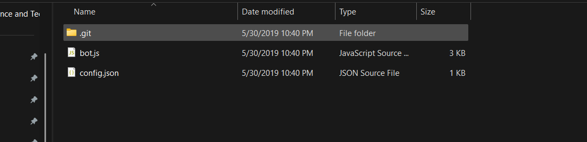
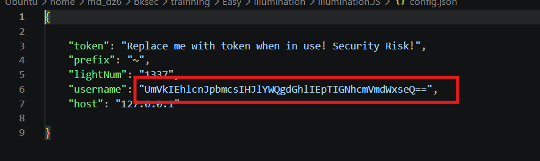
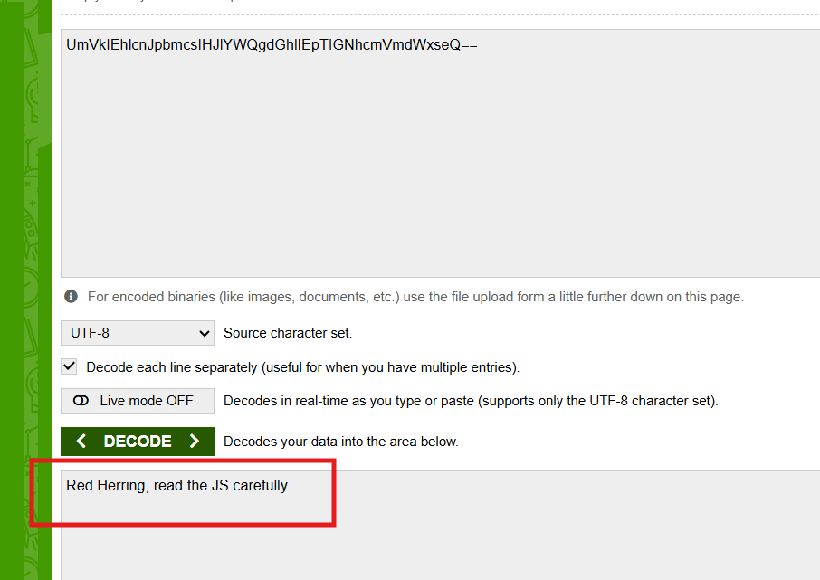
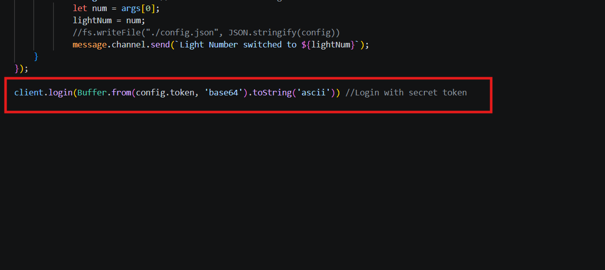
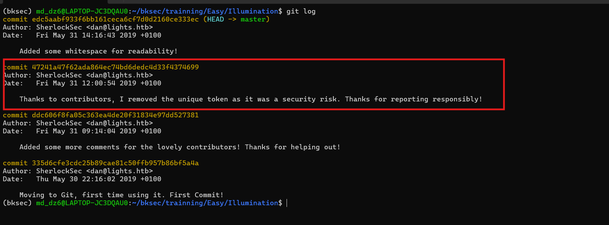
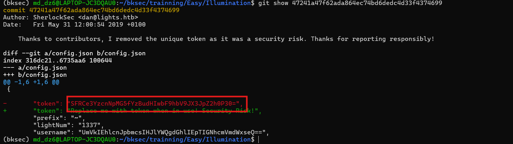
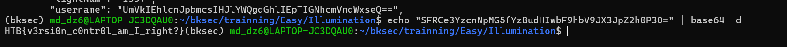

# Challenge Illumination

## 1. Đầu vào challenge

Đầu vào challenge cung cấp 1 folder chứa những file / folder này.



---

## 2. Nhận định ban đầu

Dự đoán challenge này có thể là khôi phục dữ liệu từ những commit cũ. Thử đọc file `config.json` trước, có 1 đoạn Base64 ở trong nhưng khi decode ra chỉ là lời nhắn.





Nó gợi ý rằng cần đọc kỹ file JavaScript, nên tiếp tục đọc file `bot.js`.

---

## 3. Phân tích `bot.js`

Ở đây file `bot.js` lấy token từ file config, nhưng file config hiện tại **không có trường `token`**.



Vì vậy khả năng cao là ở các bản commit trước của `config.json` có trường `token`, nên giờ phải khôi phục lại bản token cũ.

---

## 4. Xem lịch sử commit

Dùng:

```bash
git log
```

để xem lại toàn bộ lịch sử commit thì thấy được commit đáng nghi nhất.



---

## 5. Xem nội dung commit đáng ngờ

Tiếp tục dùng:

```bash
git show <hash>
```

để xem được nội dung của commit đó thì tìm được token đã bị xóa.



---

## 6. Kết quả cuối

Decode chuỗi này ra thì được flag là:

```text
HTB{v3rsi0n_c0ntr0l_am_I_right?}
```



---

## 7. Flow phân tích

```text
folder đầu vào
   |
   v
đọc `config.json`
   |
   v
thấy chuỗi Base64 nhưng decode ra chỉ là lời nhắn
   |
   v
nhận ra cần đọc kỹ `bot.js`
   |
   v
phân tích `bot.js`
   |
   v
thấy code lấy token từ config
   |
   v
nhưng `config.json` hiện tại không còn trường `token`
   |
   v
suy ra token có thể nằm ở commit cũ
   |
   v
dùng `git log`
   |
   v
xác định commit đáng nghi
   |
   v
dùng `git show <hash>`
   |
   v
xem lại nội dung commit cũ
   |
   v
tìm được token đã bị xóa
   |
   v
decode token
   |
   v
thu được flag
```
---