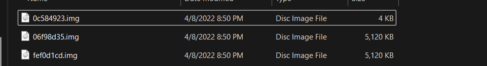
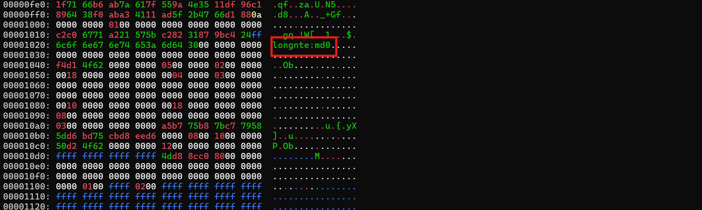
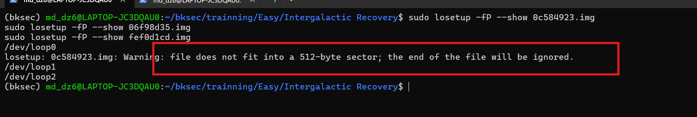
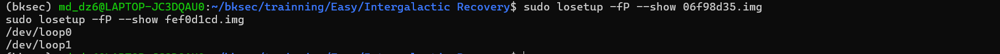
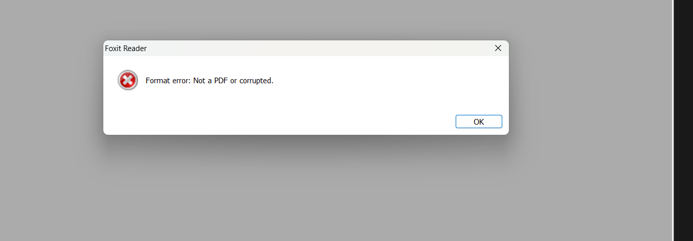
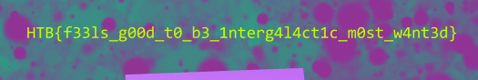

# Challenge Intergalactic Recovery

## 1. Đầu vào challenge

Đầu vào challenge cung cấp **3 file `.img`**.



---

## 2. Kiểm tra dữ liệu đầu file

Thử kiểm tra `10000` byte đầu của file `06f98d35.img` bằng lệnh:

```bash
xxd -l 10000 06f98d35.img
```

Khi xem output, thấy ở vùng offset `00001020` xuất hiện chuỗi:

```text
longnte:md0
```



### Nhận định

 `md0` là một manh mối vì trên Linux đây thường là tên của một thiết bị RAID phần mềm được quản lý bởi `mdadm`.


### Kiến thức ngoài lề

#### RAID

**RAID** là một thiết bị lưu trữ logic được ghép từ nhiều ổ hay nhiều member lại thành một khối nhìn như một ổ duy nhất.

#### `md0`

`md0` là tên thiết bị RAID của Linux. Các mảng RAID phần mềm tạo bởi `mdadm` thường xuất hiện dưới dạng:

```text
/dev/md0
/dev/md1
/dev/md2
...
```

Từ chuỗi `md0` trong dữ liệu thô, có thể dự đoán rằng 3 file `.img` này liên quan tới **một mảng RAID của Linux**. Ở **RAID 5**, dữ liệu và parity được phân tán trên nhiều ổ đĩa.

Với mỗi stripe:

- một phần sẽ là **parity**
- parity được tính từ các phần dữ liệu còn lại bằng phép **XOR**

Nhờ đó, nếu hỏng **một ổ đĩa**, dữ liệu thiếu vẫn có thể được khôi phục từ:

- các ổ còn lại
- và phần parity

Nếu đúng là RAID 5, thì chỉ cần **hai member còn nguyên vẹn** là đã có thể dựng lại mảng ở trạng thái degraded, còn member thứ ba sẽ được đánh dấu là `missing`.

---

## 3. Gắn hai file image vào loop device

Dựa vào dung lượng các file và khi thử gắn cả 3 file vào loop device thì hiện ra 

```text
losetup: 0c584923.img: Warning: file does not fit into a 512-byte sector; the end of the file will be ignored.
```


hai file image còn nguyên là:

- `06f98d35.img`
- `fef0d1cd.img`

gắn vào **loop device** để biến thành các thiết bị dạng `/dev/loopX`, phục vụ cho bước recreate mảng RAID ở trạng thái degraded.

```bash
sudo losetup -fP --show 06f98d35.img
sudo losetup -fP --show fef0d1cd.img
```



### Kiến thức ngoài lề: loop device là gì?

**Loop device** là thiết bị ảo của Linux cho phép map một file thường thành một block device dạng:

```text
/dev/loop0
/dev/loop1
...
```

Nhờ đó, hệ thống có thể xử lý file `.img` giống như một ổ đĩa thật để:

- mount
- kiểm tra filesystem
- hoặc dùng trong quá trình dựng lại RAID

---

## 4. Thử dựng lại mảng RAID 5 ở trạng thái degraded

Sau khi tạo loop device xong, cần làm bước dựng lại mảng RAID 5 ở trạng thái degraded.

Thử trước với thứ tự:

- `/dev/loop0`
- `/dev/loop1`
- `missing`

```bash
sudo mdadm --create /dev/md1 --level=5 --raid-devices=3 /dev/loop0 /dev/loop1 missing
sudo mount -o ro /dev/md1 /mnt/test
```

### Giải thích command

#### Dựng mảng RAID

```bash
sudo mdadm --create /dev/md1 --level=5 --raid-devices=3 /dev/loop0 /dev/loop1 missing
```

Ý nghĩa:

- tạo một mảng RAID mới tại `/dev/md1`
- loại RAID là `5`
- tổng số member là `3`
- hai member thật là `/dev/loop0` và `/dev/loop1`
- member còn lại được đánh dấu là `missing`

#### Mount

```bash
sudo mount -o ro /dev/md1 /mnt/test
```

Do thứ tự sắp xếp các member có thể ảnh hưởng trực tiếp đến cách dữ liệu được ghép lại, nên với cách sắp xếp:

```text
/dev/loop0 /dev/loop1 missing
```

chưa thể khẳng định đây là thứ tự đúng.

Trong RAID 5:

- dữ liệu được chia stripe
- parity được phân tán
- thứ tự member quyết định cách các block dữ liệu được lắp lại

Nếu thứ tự sai, mảng có thể vẫn dựng được nhưng dữ liệu mount ra sẽ:

- lỗi, không đọc được
- nội dung bị sai



Vì vậy, tiếp tục thử các cách sắp xếp khác.

---

## 5. Thứ tự đúng để khôi phục mảng

Sau khi thử các thứ tự khác nhau, xác định được cách sắp xếp đúng là:

```text
/dev/loop1 missing /dev/loop0
```

```bash
sudo mdadm --create /dev/md4 --level=5 --raid-devices=3 /dev/loop1 missing /dev/loop0
sudo mount -o ro /dev/md4 /mnt/test
```

Sau khi mount thành công mảng RAID đúng thứ tự, tìm được flag trong một file PDF:

```text
HTB{f33ls_g00d_t0_b3_1nterg4l4ct1c_m0st_w4nt3d}
```



---

## 10. Tóm tắt flow phân tích

```text
3 file .img
   |
   v
dùng `xxd` kiểm tra dữ liệu đầu file
   |
   v
phát hiện chuỗi `md0`
   |
   v
suy ra có thể đây là member của một mảng RAID Linux
   |
   v
nghi ngờ RAID 5
   |
   v
gắn 2 file còn nguyên vào loop device
   |
   v
thử dựng mảng RAID 5 degraded bằng `mdadm`
   |
   v
mount chỉ-đọc để kiểm tra nội dung
   |
   v
nhận ra thứ tự member đầu tiên chưa đúng
   |
   v
thử các thứ tự khác
   |
   v
xác định thứ tự đúng:
`/dev/loop1 missing /dev/loop0`
   |
   v
dựng lại mảng và mount thành công
   |
   v
mở file PDF trong mảng
   |
   v
lấy flag
```

---

