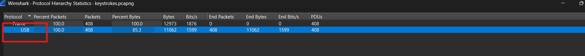
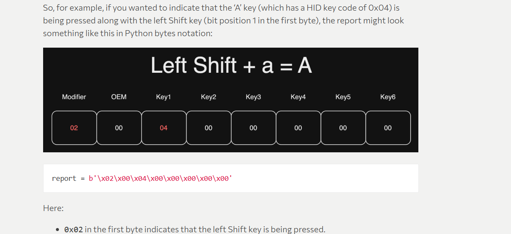
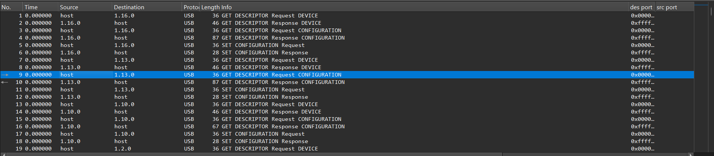
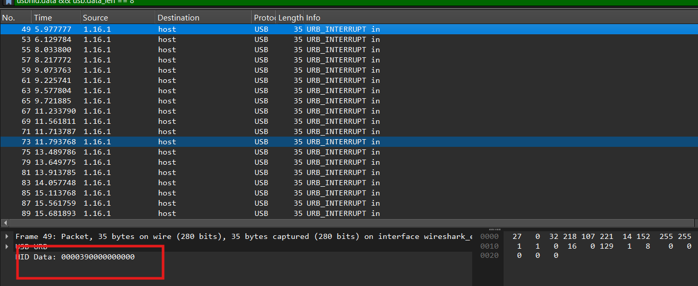
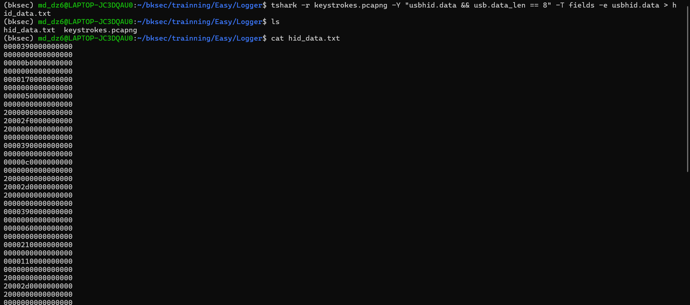
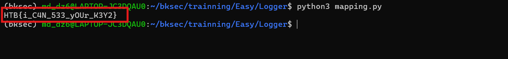

# Challenge Logger

## 1. Đầu vào challenge

Challenge đầu vào cung cấp 1 file:

```text
keystrokes.pcapng
```

Bước đầu tiên là mở file bằng **Wireshark**, sau đó vào mục **Statistics** để nhìn tổng quan loại traffic xuất hiện trong pcapng.



### Nhận định ban đầu

Từ phần thống kê có thể nhận ra file này **không chứa các traffic web thông thường**, mà chủ yếu liên quan tới:

- `usbpcap`
- `usbhid`

Điều đó gợi ý ngay tới khả năng challenge đang ghi lại **dữ liệu từ thiết bị USB**.

### Kiến thức ngoài lề

**USB HID** (*USB Human Interface Device*) là lớp thiết bị dùng cho các thiết bị nhập liệu như:

- bàn phím
- chuột
- thiết bị điều khiển tương tự

Khi thấy traffic thuộc loại **USB HID**, có thể hiểu đây là dữ liệu trao đổi giữa máy tính và thiết bị nhập liệu.

---

## 2. Format dữ liệu bàn phím USB HID

Sau khi tra cứu thêm thì biết được rằng dữ liệu khi nhập **một ký tự từ bàn phím** thường nằm trong một report có độ dài `8 bytes`. Một report HID kiểu bàn phím thường có dạng:

- **byte 0**: modifier key  
  Ví dụ: `Shift`, `Ctrl`, `Alt`
- **byte 1**: reserved
- **byte 2 → byte 7**: các keycode đang được nhấn
  


Đồng thời trong file pcapng hiện tại có rất nhiều packet **không liên quan trực tiếp tới dữ liệu phím gõ**, ví dụ:

- `GET DESCRIPTOR`
- `SET CONFIGURATION`
  


Các gói này chỉ phục vụ quá trình host:

- nhận diện thiết bị USB
- cấu hình thiết bị
- khởi tạo kết nối

Chúng không chứa nội dung phím gõ.

---

## 3. Lọc packet chứa dữ liệu phím gõ

Dùng filter để lọc chỉ các packet có dữ liệu HID và có độ dài đúng 8 byte:

```text
usbhid.data && usb.data_len == 8
```



---

## 4. Trích toàn bộ dữ liệu HID bằng `tshark`

Do số packet có thể nhiều, dùng command để lấy trường `usbhid.data` từ các packet đã lọc:

```bash
tshark -r keystrokes.pcapng -Y "usbhid.data && usb.data_len == 8" -T fields -e usbhid.data
```



Kết quả là các dòng hex, mỗi dòng tương ứng với một HID report 8 byte.

---

## 5. Dùng script để convert HID keycode thành ký tự

Sau khi đã có dữ liệu `usbhid.data`, dùng script để chuyển **HID keycode** thành ký tự thực tế.

```python
m = {
    0x04:'a',0x05:'b',0x06:'c',0x07:'d',0x08:'e',0x09:'f',0x0a:'g',0x0b:'h',
    0x0c:'i',0x0d:'j',0x0e:'k',0x0f:'l',0x10:'m',0x11:'n',0x12:'o',0x13:'p',
    0x14:'q',0x15:'r',0x16:'s',0x17:'t',0x18:'u',0x19:'v',0x1a:'w',0x1b:'x',
    0x1c:'y',0x1d:'z',
    0x1e:'1',0x1f:'2',0x20:'3',0x21:'4',0x22:'5',0x23:'6',0x24:'7',0x25:'8',
    0x26:'9',0x27:'0',
    0x2d:'-',0x2f:'[',0x30:']'
}

s = {'-':'_','[':'{',']':'}','1':'!','2':'@','3':'#','4':'$','5':'%','6':'^','7':'&','8':'*','9':'(','0':')'}

caps = False
out = []

with open('hid_data.txt', 'r', encoding='utf-8') as f:
    for line in f:
        line = line.strip()
        if not line:
            continue

        b = bytes.fromhex(line)
        if len(b) != 8:
            continue

        mod = b[0]
        key = b[2]

        if key == 0:
            continue

        if key == 0x39:
            caps = not caps
            continue

        ch = m.get(key)
        if not ch:
            continue

        shift = bool(mod & 0x22)

        if 'a' <= ch <= 'z':
            if shift ^ caps:
                ch = ch.upper()
        elif shift and ch in s:
            ch = s[ch]

        out.append(ch)

print(''.join(out))
```

---

## 6. Kết quả cuối

Sau khi chạy script, thu được flag:

```text
HTB{i_C4N_533_yOUr_K3Y2}
```



---

## 9. Tóm tắt flow phân tích

```text
keystrokes.pcapng
   |
   v
mở bằng Wireshark
   |
   v
Statistics -> thấy traffic chủ yếu là USB / HID
   |
   v
suy ra có thể đây là dữ liệu bàn phím
   |
   v
xác định bàn phím HID dùng report 8 byte
   |
   v
lọc:
usbhid.data && usb.data_len == 8
   |
   v
dùng tshark để trích toàn bộ trường usbhid.data
   |
   v
lưu ra hid_data.txt
   |
   v
viết script map HID keycode -> ký tự
   |
   v
lấy flag
```

---
