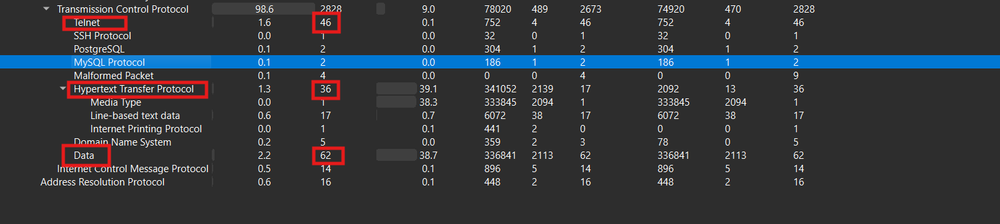
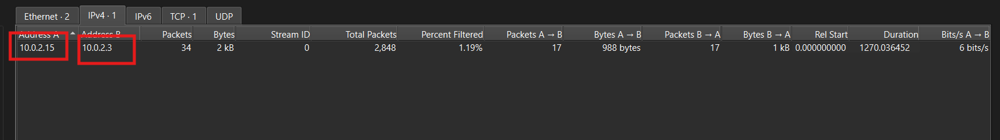
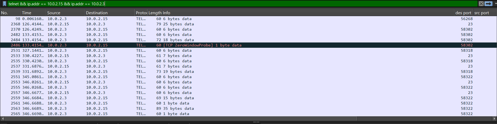
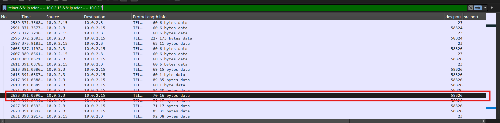
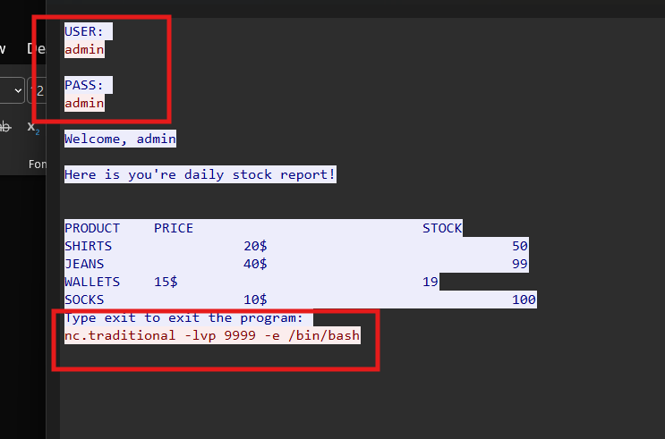
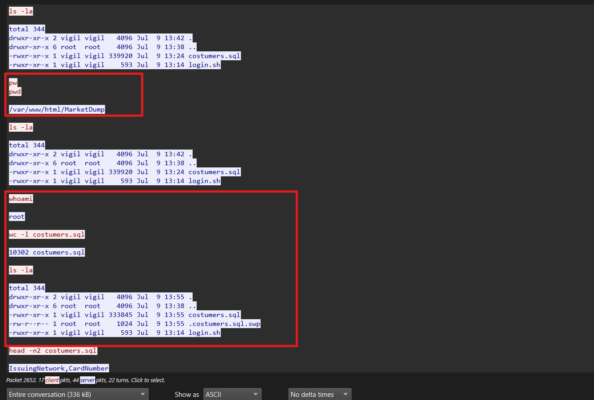
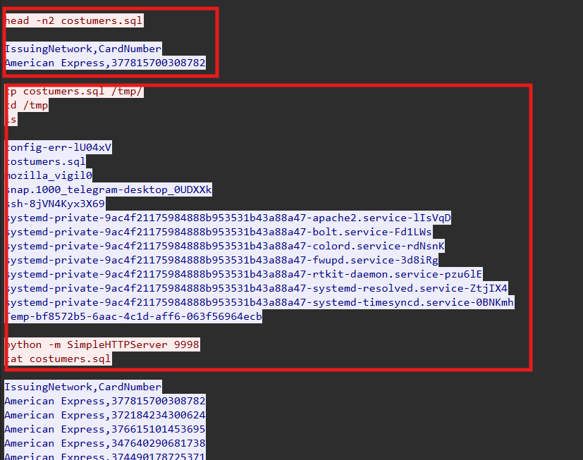
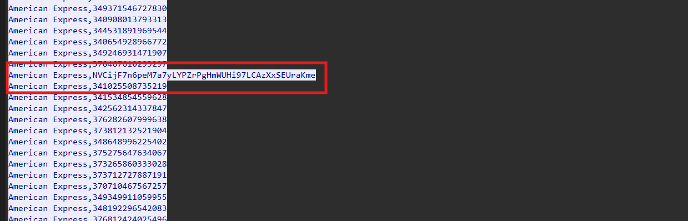
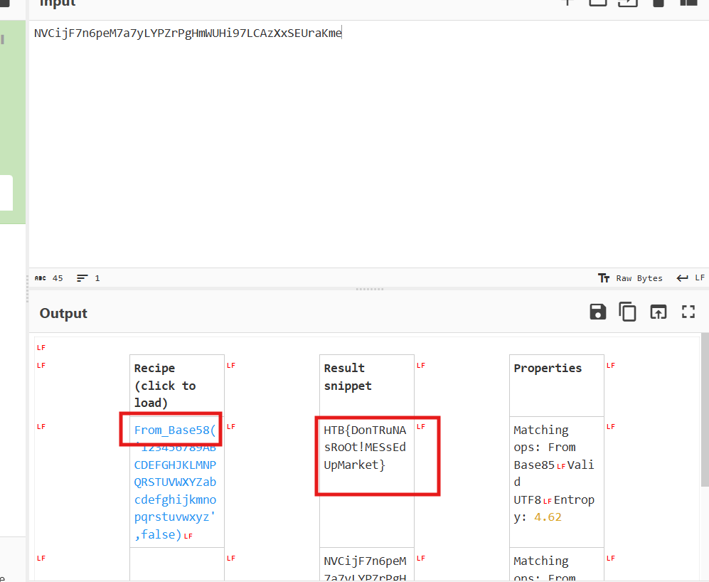

# Challenge MarketDump

## 1. Đầu vào challenge

Đầu vào challenge cung cấp 1 file `MarketDump.pcapng`, mở bằng Wireshark rồi xem mục **Statistics** trước để xem.



---

## 2. Nhận định ban đầu

Thấy được **TCP** chiếm gần như toàn bộ traffic, đặc biệt xuất hiện của **Telnet** và cả các traffic liên quan tới **SQL**, vì vậy nên đây là hướng nên tập trung đầu tiên. Nếu không có gì sẽ đi tiếp đến HTTP rồi data.

## Kiến thức ngoài lề

**Telnet** là một giao thức đăng nhập và điều khiển máy từ xa qua mạng. Vì Telnet thường truyền dữ liệu gần như dạng text thô:

- username
- password
- lệnh
- kết quả lệnh

Đồng thời từ mục **Conversations** trong Statistics có thể thấy chỉ có **2 IP** tương tác với nhau.



---

## 3. Lọc traffic Telnet

Thử dùng filter:

```text
telnet && ip.addr == 10.0.2.15 && ip.addr == 10.0.2.3
```



Sau đó phát hiện 1 traffic chứa cả password và username của admin.





---

## 4. Theo dõi shell mở ở port 9999

Đồng thời thấy được sau khi đăng nhập bằng role admin, còn có 1 command mở shell ở port `9999`. Vì vậy thử tiếp filter:

```text
ip.addr == 10.0.2.15 && ip.addr == 10.0.2.3 && tcp.port == 9999
```

và check ở phần **TCP Stream** xem có thể biết thêm gì.





---

## 5. Suy ra flow của attacker

Từ những command này, có thể đoán ra flow của attacker:

- Đầu tiên, attacker dùng `ls -la` và `pwd` để xem thư mục hiện tại, xác định mình đang ở `/var/www/html/MarketDump` và nhận ra hai file đáng chú ý là `costumers.sql` và `login.sh`.
- Sau đó, attacker chạy `whoami` để kiểm tra mức đặc quyền và xác nhận shell hiện tại đang có quyền `root`. Có thể do đã đăng nhập với role là admin.
- Sau đó attacker copy file `costumers.sql` sang `/tmp`, di chuyển vào folder này rồi chạy:

```bash
python -m SimpleHTTPServer 9998
```

nhằm mở một HTTP server tạm thời phục vụ việc exfiltrate dữ liệu.
- Rồi attacker dùng `cat costumers.sql` để kiểm tra nội dung file. Khi đọc nội dung file có điều khác thường: trong khi các dòng còn lại đều chỉ chứa số, có 1 dòng chứa đoạn string lạ nhìn giống Base64, nhưng khi decode thì không ra. Vì vậy thử dùng **Recipe Magic** của CyberChef để auto decode.



---

## 6. Kết quả cuối

Cuối cùng nhận diện được chuỗi này là encode từ **Base58**, và flag là:

```text
HTB{DonTRuNAsRoOt!MESsEdUpMarket}
```

---

## 7. Flow phân tích

```text
MarketDump.pcapng
   |
   v
mở bằng Wireshark
   |
   v
xem Statistics
   |
   v
thấy TCP chiếm gần như toàn bộ traffic
   |
   v
chú ý Telnet + SQL
   |
   v
xem Conversations
   |
   v
nhận ra chỉ có 2 IP tương tác chính
   |
   v
lọc Telnet giữa 10.0.2.15 và 10.0.2.3
   |
   v
phát hiện username + password của admin
   |
   v
thấy sau đăng nhập có shell mở ở port 9999
   |
   v
lọc traffic tcp.port == 9999
   |
   v
mở TCP Stream
   |
   v
theo dõi các command attacker chạy
   |
   v
xác định attacker đang ở /var/www/html/MarketDump
   |
   v
chú ý 2 file: costumers.sql và login.sh
   |
   v
attacker copy costumers.sql sang /tmp
   |
   v
mở SimpleHTTPServer 9998 để exfiltrate dữ liệu
   |
   v
dùng cat đọc costumers.sql
   |
   v
phát hiện 1 chuỗi lạ giống Base64 nhưng decode không ra
   |
   v
đưa vào CyberChef Recipe Magic
   |
   v
nhận ra chuỗi được encode bằng Base58
   |
   v
lấy flag
```
---