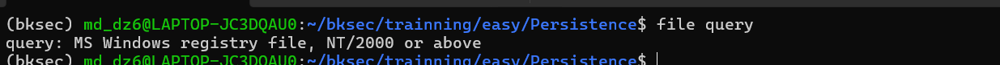
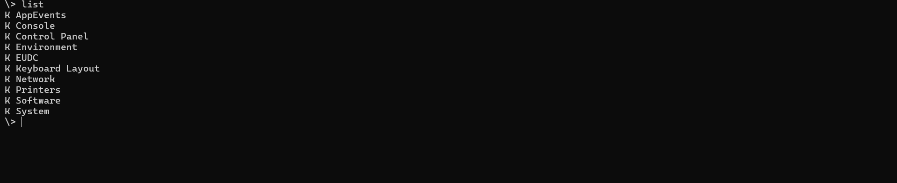
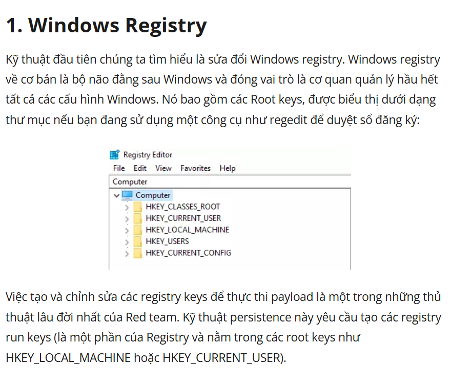
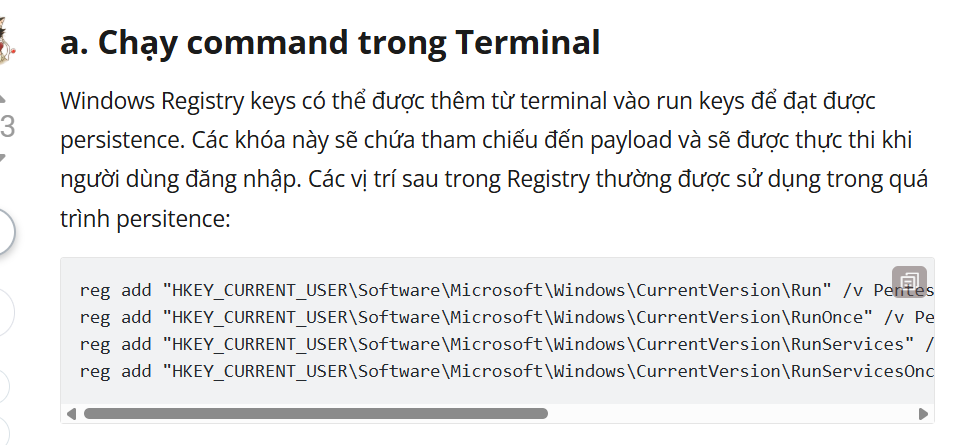
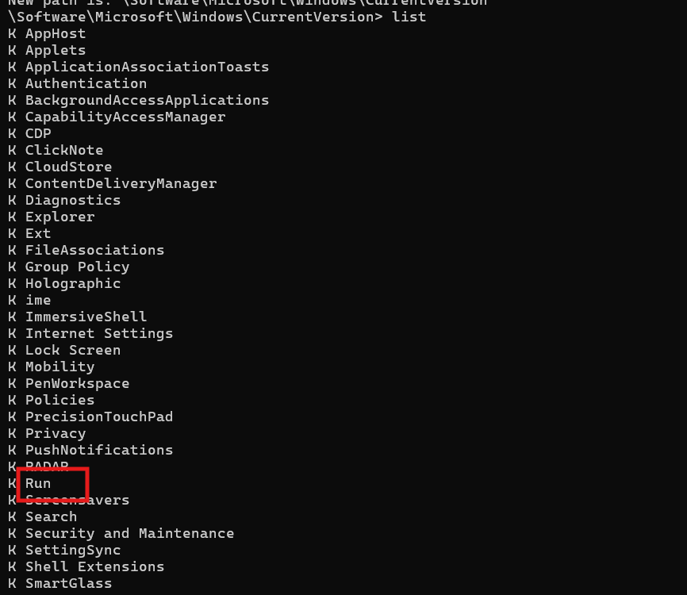
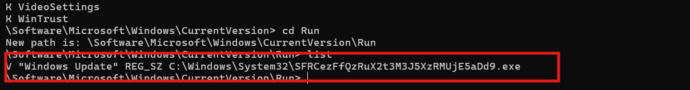
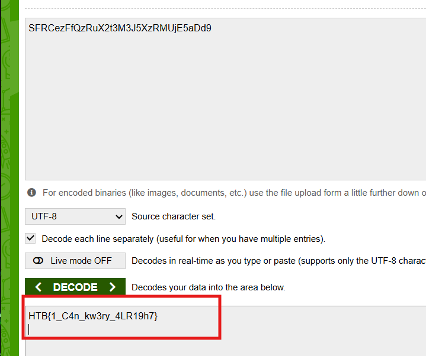

# Challenge Persistence

## 1. Đầu vào challenge

Đầu vào challenge cung cấp file `query`. Thử kiểm tra loại file.



---

## 2. Nhận định ban đầu

Nhận định đây là một **Windows Registry Hive**, cụ thể là file registry của hệ điều hành Windows (dạng NT/2000 trở lên).

### Kiến thức ngoài lề

**Windows Registry** là cơ sở dữ liệu cấu hình của Windows. Nó lưu rất nhiều thông tin như:

- cài đặt hệ điều hành
- tài khoản người dùng
- phần mềm đã cài
- chương trình tự chạy cùng máy
- service, driver, network, USB, recent files...

Còn **hive** là một khối / một file vật lý chứa một phần của registry đó.

#### Ví dụ các hive quen thuộc

- `SAM` → thông tin tài khoản cục bộ
- `SYSTEM` → cấu hình hệ thống, service, control set
- `SOFTWARE` → phần mềm và cấu hình hệ thống
- `SECURITY` → chính sách bảo mật
- `NTUSER.DAT` → cấu hình của một user
- `USRCLASS.DAT` → một phần cấu hình user khác


**Persistence** là cơ chế giúp chương trình tự chạy lại. Sau khi login hoặc khởi động máy, payload vẫn được chạy tiếp.

**Run key** là một vị trí persistence quan trọng.

Key kiểu:

```text
Software\Microsoft\Windows\CurrentVersion\Run
```

được dùng để khai báo chương trình sẽ tự chạy khi user đăng nhập.

### Registry value trong Run key thường gồm tên và dữ liệu

- **Name**: tên hiển thị, có thể ngụy trang như `Windows Update`
- **Data**: lệnh hoặc đường dẫn tới file `.exe` sẽ được chạy

---

## 3. Dùng `registry-tools` để phân tích hive

Sử dụng `registry-tools` để mở hive:

```bash
regshell -F query
```



Tra cứu thêm một chút về Windows Registry thì biết được **Windows Registry** là nơi Windows lưu các thiết lập và cấu hình quan trọng của hệ thống. Khi mở bằng công cụ như `Regedit`, nó được sắp xếp thành các nhánh lớn gọi là **root keys**, trông giống như các thư mục.

Một cách persistence thường gặp là thêm hoặc sửa các **registry run keys** trong những nhánh như:

- `HKEY_CURRENT_USER`
- `HKEY_LOCAL_MACHINE`

để chương trình độc hại tự chạy mỗi khi người dùng đăng nhập hoặc khi máy khởi động.



Đồng thời biết được các payload tấn công thường được sử dụng khi attacker có thể dùng command trong Terminal để thêm các khóa **Registry** vào những vị trí tự chạy của Windows. 

Các khóa này sẽ trỏ tới payload, và khi user login thì Windows sẽ tự chạy payload đó. VD các run keys:

- `Run`
- `RunOnce`
- `RunServices`
- ...

hay được dùng để duy trì chạy payload tấn công.



---

## 4. Tìm đúng key chứa persistence

Theo hướng trên, đi vào đúng key:

```text
Software\Microsoft\Windows\CurrentVersion\Run
```



Sau khi vào key nghi là nơi chứa persistence, phát hiện một file thực thi có tên rất bất thường, nghi là chuỗi Base64.



---

## 5. Lấy flag

Thử decode chuỗi đó ra thì thu được flag là:

```text
HTB{1_C4n_kw3ry_4LR19h7}
```



---

## 6. Flow phân tích

```text
file query
   |
   v
kiểm tra loại file
   |
   v
xác định đây là Windows Registry Hive
   |
   v
nhận ra cần kiểm tra các vị trí persistence trong Registry
   |
   v
tập trung vào Run key
   |
   v
dùng regshell mở hive:
regshell -F query
   |
   v
đi tới:
Software\Microsoft\Windows\CurrentVersion\Run
   |
   v
phát hiện value có tên / dữ liệu rất bất thường
   |
   v
nghi đây là chuỗi Base64 ngụy trang payload
   |
   v
decode chuỗi đó
   |
   v
thu được flag
```
---
