# Challenge POOF

## 1. Đầu vào challenge

Đầu vào challenge cho rất nhiều file gồm:

- file `pcap`
- file `memory dump`
- folder zip nghi là profile sử dụng trong Volatility 2

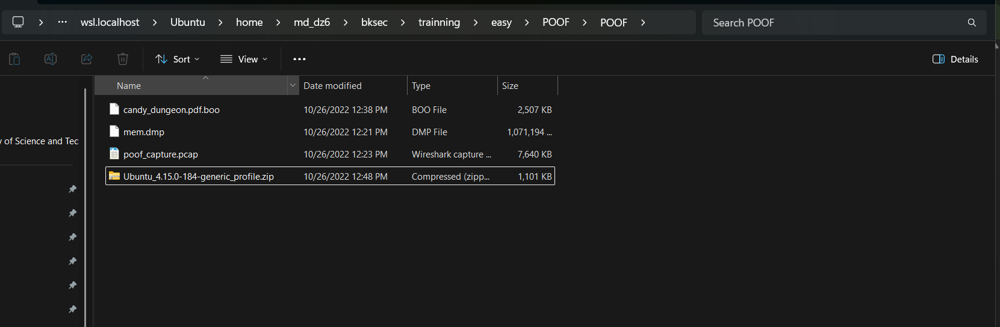

---

## 2. Which is the malicious URL that the ransomware was downloaded from? (for example: http://maliciousdomain/example/file.extension)

Khi hỏi về URL, có thể mở file `pcap` trước vì khi đó có thể xem được các traffic cách rõ nhất.

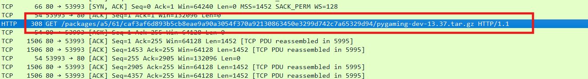

Ngay khi mở đã thấy 1 traffic `GET` cố gắng tải 1 file nén về. Mở `TCP Stream` ra thấy được rõ hơn về domain cũng như path của URL.

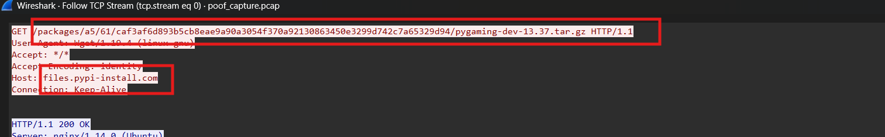

**Đáp án là:**

```text
http://files.pypi-install.com/packages/a5/61/caf3af6d893b5cb8eae9a90a3054f370a92130863450e3299d742c7a65329d94/pygaming-dev-13.37.tar.gz
```

---

## 3. What is the name of the malicious process? (for example: malicious)

Với câu hỏi này để biết rõ hơn cần phân tích dựa vào file memory dump cung cấp, do nó ghi lại hoạt động của process độc hại. Đồng thời từ tên file zip cũng gợi ý rằng có thể sử dụng Volatility 2 với profile `Ubuntu_4.15.0-184-generic_profile`.

### Kiến thức ngoài lề

#### Cách cài Volatility 2 và dùng profile Linux

Volatility 2 yêu cầu **Python 2.7**. Trên các hệ Ubuntu mới, Python 2 không còn được hỗ trợ trực tiếp nên có thể cài thông qua `pyenv` hoặc build từ source. Sau khi cài xong, chỉ cần clone repository:

```bash
git clone https://github.com/volatilityfoundation/volatility.git
cd volatility
```

#### Sử dụng Linux profile

Với Linux, cần có file profile dạng `.zip`. Để Volatility nhận diện profile, cần đặt file này vào thư mục:

```text
volatility/plugins/overlays/linux/
```

#### Kiểm tra profile

Chạy lệnh sau để kiểm tra Volatility đã nhận profile chưa:

```bash
python vol.py --info
```

Nếu thành công, sẽ thấy profile xuất hiện trong danh sách:

```text
<profile>
```

Volatility 2 yêu cầu Python 2, có thể dùng `pyenv` để chuyển đổi qua lại giữa hai phiên bản Python.

```bash
pyenv global 2.7.18
exec "$SHELL"
python --version
```

### Chuyển lại Python 3

```bash
pyenv global system
exec "$SHELL"
python3 --version
```

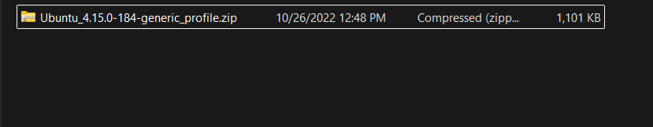

Tra cứu thêm biết được ở Volatility 2 plugin để xem bash command cho Linux là `linux_bash`.

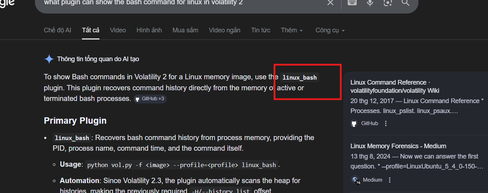

Vì vậy thử sử dụng:

```bash
python vol.py -f ~/bksec/trainning/easy/POOF/POOF/mem.dmp --profile=LinuxUbuntu_4_15_0-184-generic_profilex64 linux_bash
```

Thì được kết quả là sau khi tải file tar kia về và giải nén ra được file độc hại tên là `configure`.

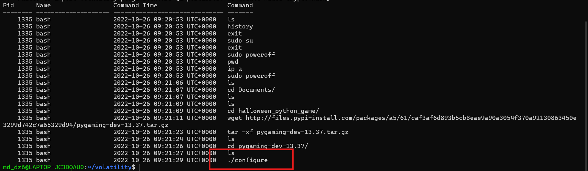

**Đáp án là:** `configure`

---

## 4. Provide the md5sum of the ransomware file.

Câu hỏi này yêu cầu xác định giá trị `md5` của file ransomware.

Vì vậy với câu hỏi này quay lại file `pcap`, sau đó `File` ->`Export Objects` -> `HTTP` để export file nén độc hại ra ngoài.

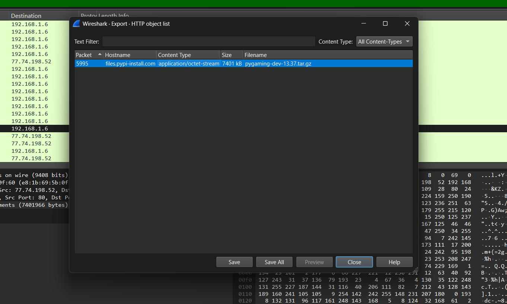

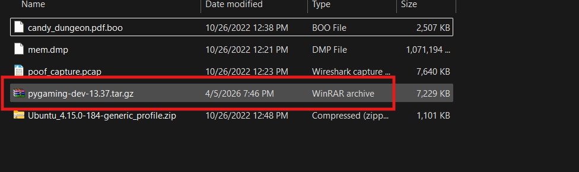

Rồi export file nén đó ra và giải nén. Sau khi giải nén xong thì có thể tính `md5sum` của file ransomware.

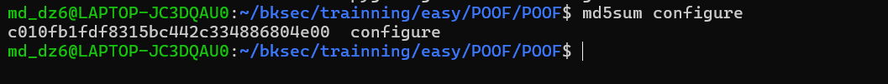

Đáp án là `c010fb1fdf8315bc442c334886804e00`

---

## 5. Which programming language was used to develop the ransomware? (for example: nim)

Thử `strings -a` file này ra thì thấy rất nhiều dấu hiệu cho biết được ngôn ngữ là **Python**.

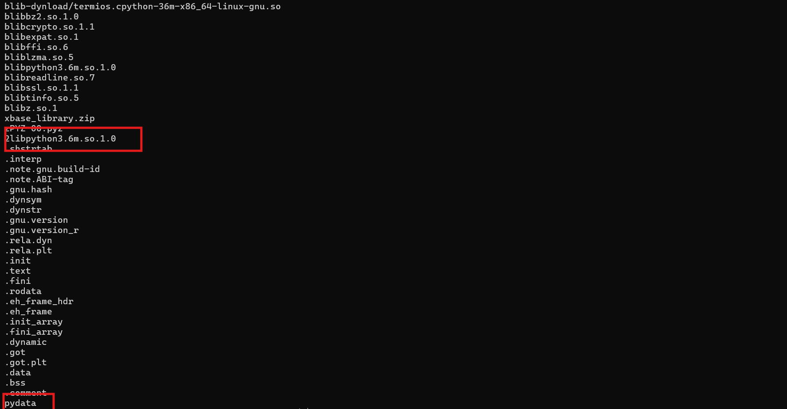

**Đáp án là:** `python`

---

## 6. After decompiling the ransomware, what is the name of the function used for encryption? (for example: encryption)

Nhận thấy file này không phải các file `.pyc` thông thường để decompile, vì vậy thử check xem định dạng file là gì.

```bash
file configure
```

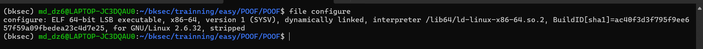


Nhận thấy được đây là một file thực thi dạng **ELF 64-bit** trên Linux, tức là một binary đã được biên dịch. Cho thấy mã nguồn ban đầu không còn ở dạng script thuần mà đã được đóng gói.

Vì vậy, bước tiếp theo là tiến hành extract file ELF này để lấy lại các file pyc bên trong, từ đó có thể decompile và phân tích logic encrypt.

Sau khi xem thử một vài tool đề xuất để extract, cài thử tool **pyinstxtractor-ng**.

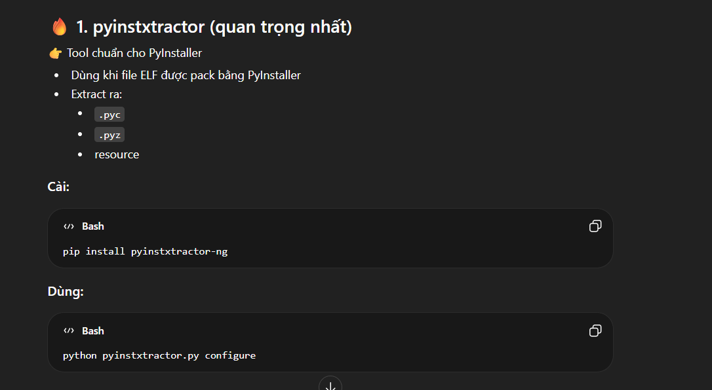

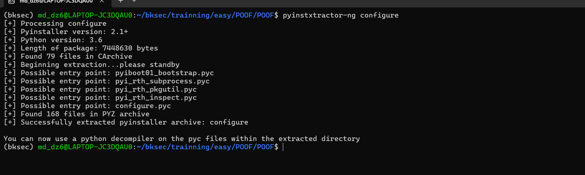

Sau khi extract xong thu được nhiều file. Chú ý vào file `configure.pyc`.

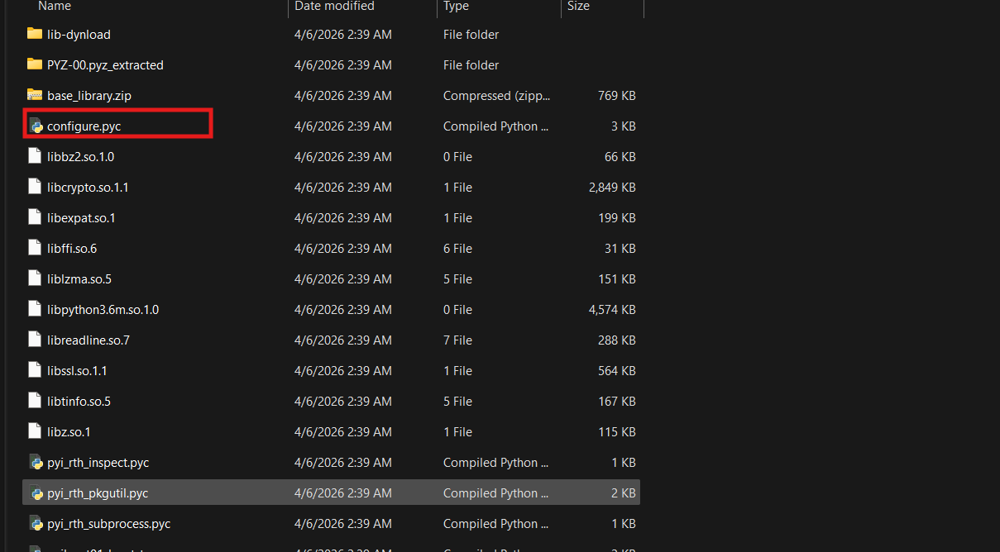

Decompile file với tool `uncompyle6`:

```bash
uncompyle6 -o . configure.pyc
```

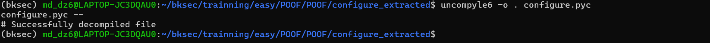

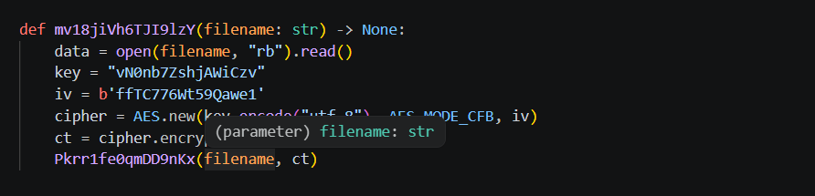

Mở file `configure.py` vừa decompile ra thì tìm thấy hàm `mv18jiVh6TJI9lzY` với chức năng là encrypt bằng **AES-CFB** với:

- key = `vN0nb7ZshjAWiCzv`
- IV = `ffTC776Wt59Qawe1`


**Vậy đáp án là:** `mv18jiVh6TJI9lzY`

---

## 7. Decrypt the given file, and provide its md5sum.

Với key và IV vừa thu được, decrypt file `candy_dungeon.pdf.boo` được cung cấp ban đầu bằng script sau:

```python
from Crypto.Cipher import AES

data = open("candy_dungeon.pdf.boo", "rb").read()
pt = AES.new(b"vN0nb7ZshjAWiCzv", AES.MODE_CFB, b"ffTC776Wt59Qawe1").decrypt(data)
open("candy_dungeon.pdf", "wb").write(pt)
```


Vậy giờ chỉ cần tính md5 của file PDF thu được.

**Đáp án là:** `3bc9f072f5a7ed4620f57e6aa8d7e1a1`

---

## 8. Flag

Cuối cùng thu được flag là:

```text
HTB{Th1s_h4ll0w33n_w4s_r34lly_sp00ky}
```
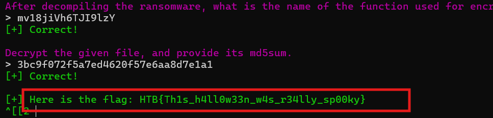

---

## 9. Bảng câu hỏi - đáp án

| Câu hỏi | Đáp án |
|---|---|
| Which is the malicious URL that the ransomware was downloaded from? | `http://files.pypi-install.com/packages/a5/61/caf3af6d893b5cb8eae9a90a3054f370a92130863450e3299d742c7a65329d94/pygaming-dev-13.37.tar.gz` |
| What is the name of the malicious process? | `configure` |
| Provide the md5sum of the ransomware file. | `c010fb1fdf8315bc442c334886804e00` |
| Which programming language was used to develop the ransomware? | `python` |
| After decompiling the ransomware, what is the name of the function used for encryption? | `mv18jiVh6TJI9lzY` |
| Decrypt the given file, and provide its md5sum. | `3bc9f072f5a7ed4620f57e6aa8d7e1a1` |
---