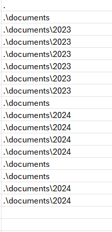
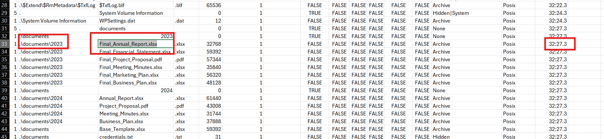
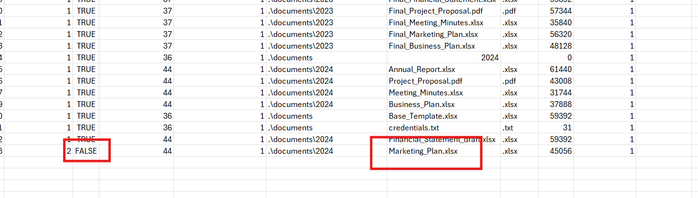
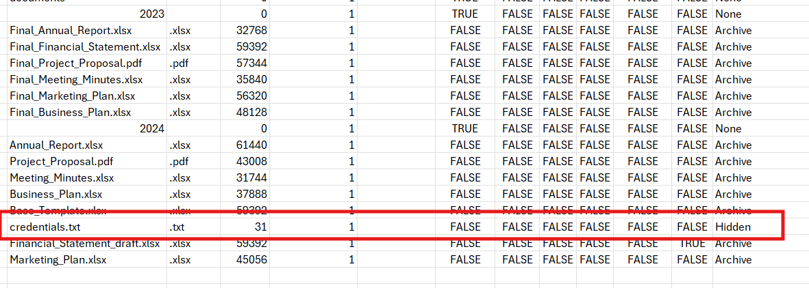
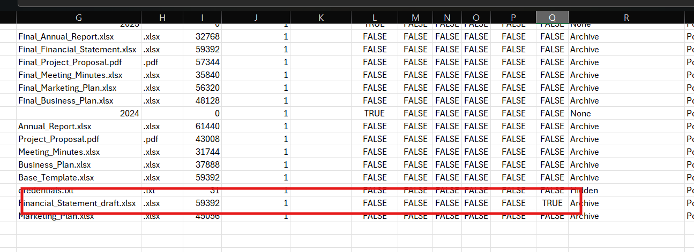
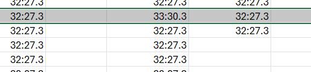
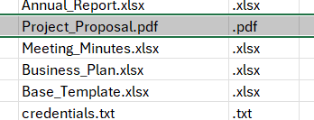
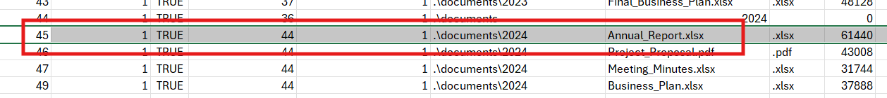
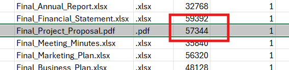
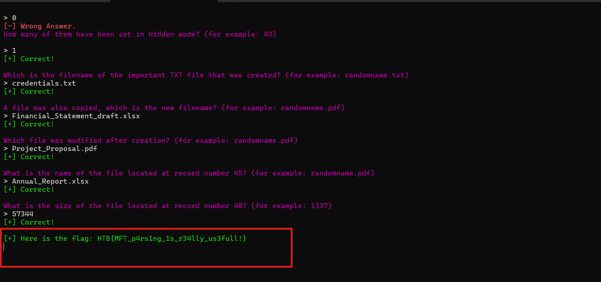

# Challenge Pursue the Tracks

## 1. Đầu vào challenge

Đầu vào challenge cung cấp file `z.mft`.

File `.mft` là metadata của filesystem **NTFS**, dùng để lưu các thông tin như tên file, đường dẫn, mốc thời gian, trạng thái sử dụng, quan hệ thư mục cha - con, ... Vì vậy với dạng bài này cần parse file MFT ra trước để quan sát toàn bộ record.

Sử dụng `MFTECmd.exe` để parse file `z.mft` sang `csv`:

```powershell
.\MFTECmd.exe -f "\\wsl.localhost\Ubuntu\home\md_dz6\bksec\trainning\easy\Pursue the Tracks\z.mft" --csv "\\wsl.localhost\Ubuntu\home\md_dz6\bksec\trainning\easy\Pursue the Tracks"
```
---

## 2. Files are related to two years, which are those? (for example: 1993,1995)

Mở file `csv` ra và quan sát cột đường dẫn thư mục thì thấy các file được tổ chức theo hai thư mục năm riêng biệt là `2023` và `2024`.



**Đáp án là:** `2023,2024`

---

## 3. There are some documents, which is the name of the first file written? (for example: randomname.pdf)

Tiếp tục nhìn vào file `csv`, tập trung vào các file document rồi so mốc thời gian tạo/ghi ban đầu để xác định file nào được ghi sớm nhất.

Từ bảng dữ liệu thấy file xuất hiện sớm nhất là `Final_Annual_Report.xlsx`.



**Đáp án là:** `Final_Annual_Report.xlsx`

---

## 4. Which file was deleted? (for example: randomname.pdf)

Ở câu này chú ý tới cột `InUse`. Nếu một file có cờ `FALSE` thì đó là dấu hiệu cho thấy record không còn đang được sử dụng, thường tương ứng với file đã bị xóa.

Quan sát bảng thấy `Marketing_Plan.xlsx` là file có `InUse = FALSE`.



**Đáp án là:** `Marketing_Plan.xlsx`

---

## 5. How many of them have been set in Hidden mode? (for example: 43)

Để trả lời câu này chỉ cần dò cột `Hidden` và đếm số record có cờ ẩn.

Quan sát thấy chỉ có duy nhất file `credentials.txt` có cờ `Hidden`.



**Đáp án là:** `1`

---

## 6. Which is the filename of the important TXT file that was created? (for example: randomname.txt)

Ngay từ câu trước đã xác định được file `credentials.txt` là file `.txt` duy nhất có cờ `Hidden`, nên đây cũng chính là file quan trọng.

**Đáp án là:** `credentials.txt`

---

## 7. A file was also copied, which is the new filename? (for example: randomname.pdf)

Với câu này, tiếp tục nhìn vào cột `Copy`. Record nào có cờ `TRUE` thì đó là file được tạo ra do thao tác copy.

Từ bảng dữ liệu thấy file có cờ copy là `Financial_Statement_draft.xlsx`.



**Đáp án là:** `Financial_Statement_draft.xlsx`

---

## 8. Which file was modified?

Trong phần dữ liệu gốc của file Word, heading câu này bị ghi chưa khớp, nhưng phần phân tích bên dưới đang xét rõ ràng các mốc `Created0x10` và `LastModified0x10`, tức là đang truy file bị chỉnh sửa.

Đối chiếu hai cột thời gian này thấy `Project_Proposal.pdf` được tạo lúc `32:27.3` nhưng về sau có `LastModified0x10` thay đổi thành `32:30.3`, nên đây là file đã bị modify.





**Đáp án là:** `Project_Proposal.pdf`

---

## 9. What is the name of the file located at record number 45? (for example: randomname.pdf)

Ở câu này chỉ cần dò theo cột `EntryNumber`, tìm record số `45` rồi gióng ngang sang cột tên file.

Từ đó xác định được record `45` là file `Annual_Report.xlsx`.



**Đáp án là:** `Annual_Report.xlsx`

---

## 10. What is the size of the file located at record number 40? (for example: 1337)

Tương tự, tìm record `40` trong bảng rồi đọc sang cột kích thước file.

Kết quả thu được kích thước của file ở record `40` là `57344`.



**Đáp án là:** `57344`

---

## 11. Flag

Cuối cùng thu được flag là:

```text
HTB{MFT_p4rs1ng_1s_r34lly_us3full!}
```



---

## 12. Bảng câu hỏi - đáp án

| Câu hỏi | Đáp án |
|---|---|
| Files are related to two years, which are those? | `2023,2024` |
| There are some documents, which is the name of the first file written? | `Final_Annual_Report.xlsx` |
| Which file was deleted? | `Marketing_Plan.xlsx` |
| How many of them have been set in Hidden mode? | `1` |
| Which is the filename of the important TXT file that was created? | `credentials.txt` |
| A file was also copied, which is the new filename? | `Financial_Statement_draft.xlsx` |
| Which file was modified? | `Project_Proposal.pdf` |
| What is the name of the file located at record number 45? | `Annual_Report.xlsx` |
| What is the size of the file located at record number 40? | `57344` |
