# Challenge Silicon Data Sleuthing

## 1. Đầu vào challenge

Đầu vào challenge cung cấp file `chal_router_dump.bin`.

Trước tiên thử check lần lượt bằng các cách quen thuộc như `file`, `strings`, `exiftool` nhưng chưa thấy gì quá đặc biệt.

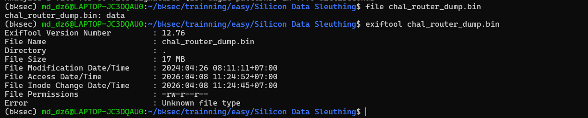

Tuy nhiên khi kiểm tra bằng `binwalk` thì thấy đây là một **flash dump / firmware dump của router**. Lý do là trong file xuất hiện các thành phần rất đặc trưng của firmware nhúng:

- `U-Boot image header` tại offset `0x180000`  
  → cho thấy trong dump có chứa kernel image theo định dạng `uImage`.
- `SquashFS filesystem` tại offset `0x42C2C8`  
  → đây thường là root filesystem của thiết bị, chứa các thư mục hệ thống như `/bin`, `/etc`, `/usr`, ...
- `JFFS2 filesystem` tại offset `0x7C0000`  
  → thường là vùng overlay/config, nơi có thể lưu cấu hình, thông tin người dùng, mật khẩu, log hoặc dữ liệu bị thay đổi sau khi thiết bị hoạt động.

Ngoài ra còn thấy chuỗi liên quan đến `U-Boot` và `OpenWrt Linux` -> dump từ bộ nhớ flash của một router chạy Linux/OpenWrt.

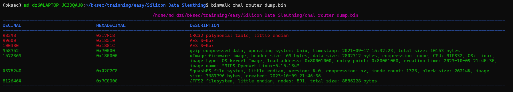

### Kiến thức ngoài lề

**Flash dump / firmware dump của router** là bản sao thô của chip nhớ flash trên router.

Router thường không chỉ có RAM, mà còn có một chip flash để chứa:

- bootloader
- kernel Linux
- filesystem hệ thống
- file cấu hình
- dữ liệu thay đổi sau khi thiết bị chạy

`U-Boot` là bootloader rất phổ biến trên thiết bị nhúng như router, camera, IoT. Nó đóng vai trò gần giống BIOS/boot manager: khởi động phần cứng, rồi nạp kernel lên để boot Linux.

`uImage` là một định dạng image mà `U-Boot` hiểu được.

**SquashFS** là một filesystem nén, chỉ đọc, rất hay dùng trong firmware nhúng. Router dùng nó để chứa hệ thống gốc vì:

- tiết kiệm dung lượng
- khó bị thay đổi
- phù hợp với flash

Bên trong `SquashFS` thường có:

- `/bin`
- `/sbin`
- `/etc`
- `/usr`
- file thực thi
- script khởi động
- web interface
- thư viện hệ thống

Vì vậy khi thấy `SquashFS`, ta hiểu rằng:

- đây rất có thể là root filesystem của router
- nơi này chứa phần lớn file hệ thống gốc

**JFFS2** là filesystem dành cho flash, hỗ trợ ghi/xóa tốt hơn so với kiểu read-only như `SquashFS`.

Trong router, vùng này thường dùng làm:

- overlay
- lưu config
- lưu file người dùng sửa đổi
- log
- state runtime cần giữ lại sau reboot

Vì vậy giờ cần extract các thành phần này ra từ file `.bin` để tiếp tục phân tích.

```bash
dd if=../chal_router_dump.bin of=kernel.uImage bs=1 skip=$((0x180000)) count=$((0x42C2C8-0x180000))
dd if=../chal_router_dump.bin of=kernel.raw bs=1 skip=$((0x180000+64)) count=2802312
dd if=../chal_router_dump.bin of=rootfs.squashfs bs=1 skip=$((0x42C2C8)) count=$((0x7C0000-0x42C2C8))
dd if=../chal_router_dump.bin of=overlay.jffs2 bs=1 skip=$((0x7C0000))
```

---

## 2. What version of OpenWRT runs on the router (ex: 21.02.0)

Phân vùng `rootfs.squashfs` là root filesystem của router, vì vậy extract nó ra trước:

```bash
unsquashfs -d rootfs rootfs.squashfs
```

Sau khi extract xong, tra cứu thêm nơi thường chứa thông tin về version của OpenWrt.

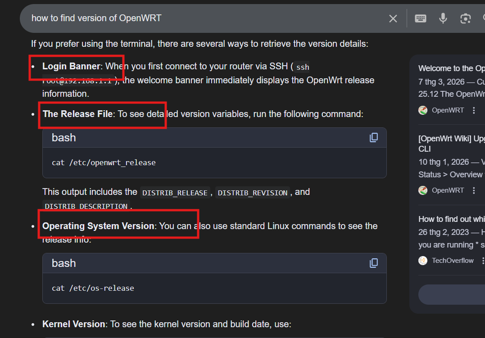

Sử dụng `find` và `grep` để tìm các file khả nghi:

```bash
find rootfs -type f | grep -E 'openwrt_release|os-release|banner'
```

Cuối cùng tìm được version của OpenWrt trong file `os-release`.

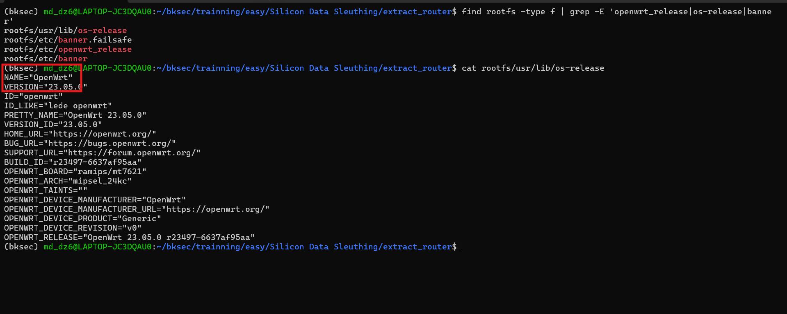

**Đáp án là:** `23.05.0`

---

## 3. What is the Linux kernel version (ex: 5.4.143)

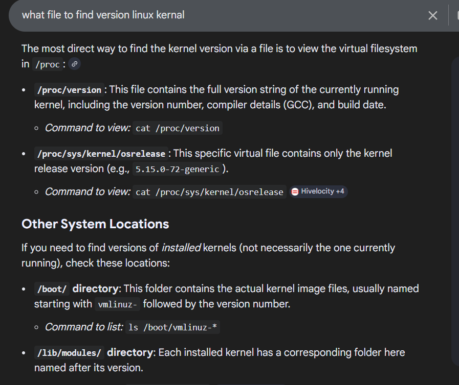

Thử tra các vị trí thường chứa thông tin về kernel version. Nhưng ở đây `/proc` đang rỗng, cũng không có thư mục `/boot`, vì vậy ` /lib/modules/ ` là phương án để tìm tiếp.

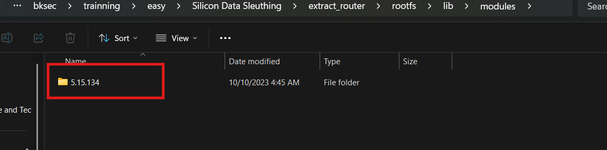

Cuối cùng xác định được version của Linux kernel là `5.15.134`.

**Đáp án là:** `5.15.134`

---

## 4. What's the hash of the root account's password, enter the whole line (ex: root:$2$JgiaOAai....)

Để tìm được hash của `root account's password`, cần tìm file `shadow`, vì đây là nơi lưu **thông tin băm mật khẩu của các tài khoản trên hệ thống Linux/OpenWrt**.

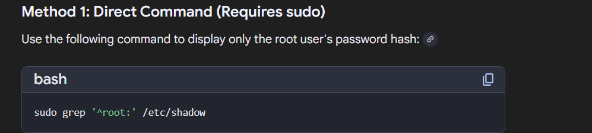

Tuy nhiên, khi kiểm tra `etc/shadow` trong `rootfs.squashfs`, không thấy hash thực tế của tài khoản `root`.

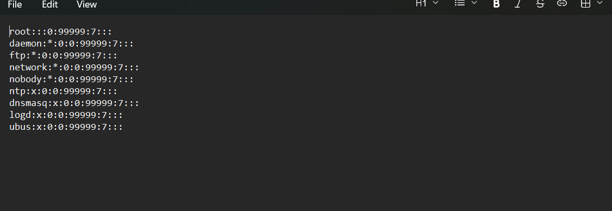

Lý do là `rootfs.squashfs` chỉ là read-only filesystem, vì vậy các thay đổi trong quá trình hệ thống hoạt động, bao gồm cả password hash hiện tại của tài khoản `root`, sẽ không được ghi trực tiếp vào đây mà thường nằm trong vùng overlay writable như `overlay.jffs2`.

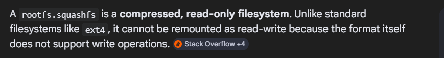

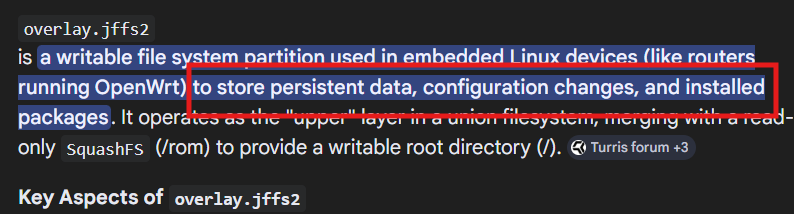

Vì vậy giờ cần extract `overlay.jffs2`:

```bash
jefferson -d jffs2_root overlay.jffs2
```

Sau khi extract xong thu được file `sysupgrade.tgz`. Đây là file backup cấu hình của OpenWrt, dạng `tar.gz` archive, vì vậy rất có thể nó cũng backup cả hash mật khẩu của `root`. Tiếp tục extract `sysupgrade.tgz` và tìm tới file `shadow`.

Cuối cùng thu được hash password của `root`.

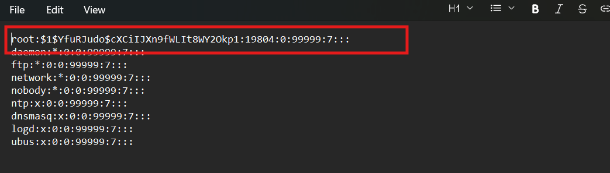

**Đáp án là:** `root:$1$YfuRJudo$cXCiIJXn9fWLIt8WY2Okp1:19804:0:99999:7:::`

---

## 5. What is the PPPoE username

### Kiến thức ngoài lề

`PPPoE` (Point-to-Point Protocol over Ethernet) là giao thức thường được các nhà mạng sử dụng để xác thực kết nối Internet qua đường truyền băng thông rộng. Khi router quay số PPPoE, nó sẽ dùng một cặp thông tin đăng nhập gồm **username** và **password** để thiết lập kết nối WAN.

`WAN` (Wide Area Network - Mạng diện rộng) là cổng kết nối trên router được thiết kế để kết nối mạng nội bộ (LAN) với mạng bên ngoài, chủ yếu là Internet thông qua modem.

Để tìm được **PPPoE username**, mở file `etc/config/network` vì đây là nơi chứa **cấu hình interface `wan` và các thông tin đăng nhập PPPoE**.

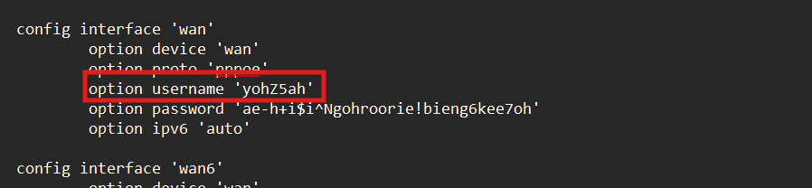

Kết quả thu được username là `yohZ5ah`.

**Đáp án là:** `yohZ5ah`

---

## 6. What is the PPPoE password

Ngay trong file ở câu trước cũng đã thấy được password là `ae-h+i$i^Ngohroorie!bieng6kee7oh`.

**Đáp án là:** `ae-h+i$i^Ngohroorie!bieng6kee7oh`

---

## 7. What is the WiFi SSID

Để trả lời câu hỏi này, mở file `etc/config/wireless` vì đây là nơi chứa cấu hình mạng WiFi của router, bao gồm các thông tin như SSID, chế độ phát sóng, mã hóa và mật khẩu.

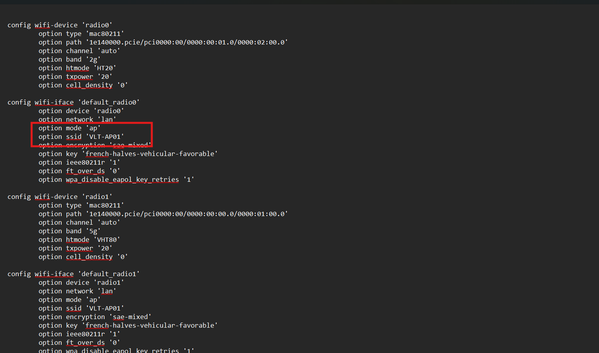

**Đáp án là:** `VLT-AP01`

---

## 8. What is the WiFi Password

Ngay trong file ở câu trước thấy được key của WiFi là `french-halves-vehicular-favorable`.

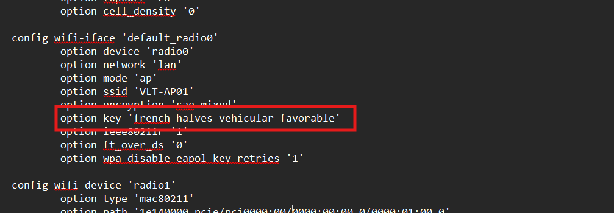

**Đáp án là:** `french-halves-vehicular-favorable`

---

## 9. What are the 3 WAN ports that redirect traffic from WAN -> LAN (numerically sorted, comma sperated: 1488,8441,19990)

### Kiến thức ngoài lề

`WAN -> LAN` nghĩa là lưu lượng đi từ **mạng bên ngoài/Internet (WAN)** vào **mạng nội bộ phía sau router (LAN)**. Bình thường các thiết bị trong LAN bị che sau NAT nên từ bên ngoài sẽ không truy cập trực tiếp được. Muốn cho một dịch vụ nội bộ có thể được truy cập từ Internet, router phải tạo rule **redirect/port forwarding** để chuyển tiếp gói tin từ một cổng ở phía WAN vào một thiết bị hoặc dịch vụ nằm trong LAN.

Sau khi tra cứu, biết được một vài path thường chứa rule firewall/redirect.

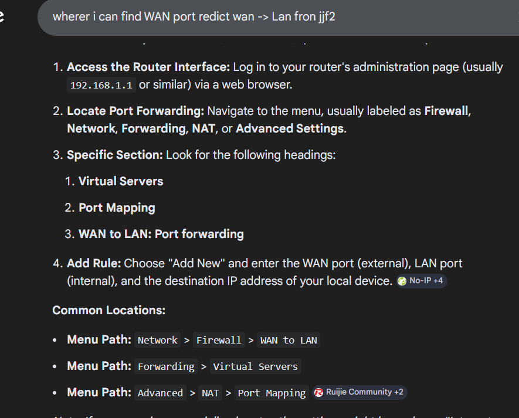

Thử tìm trong file `firewall` thì thấy được `3` port redirect từ `WAN -> LAN`.

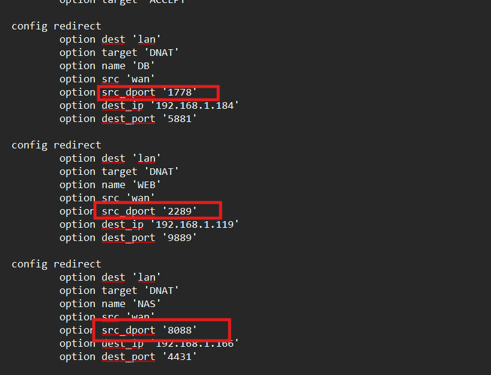

**Đáp án là:** `1778,2289,8088`

---

## 10. Flag

Cuối cùng thu được flag là:

```text
HTB{Y0u'v3_m4st3r3d_0p3nWRT_d4t4_3xtr4ct10n_4nd_c0nf1g!!}
```

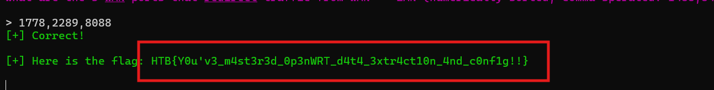

---

## 11. Bảng câu hỏi - đáp án

| Câu hỏi | Đáp án |
|---|---|
| What version of OpenWRT runs on the router? | `23.05.0` |
| What is the Linux kernel version? | `5.15.134` |
| What's the hash of the root account's password, enter the whole line? | `root:$1$YfuRJudo$cXCiIJXn9fWLIt8WY2Okp1:19804:0:99999:7:::` |
| What is the PPPoE username? | `yohZ5ah` |
| What is the PPPoE password? | `ae-h+i$i^Ngohroorie!bieng6kee7oh` |
| What is the WiFi SSID? | `VLT-AP01` |
| What is the WiFi Password? | `french-halves-vehicular-favorable` |
| What are the 3 WAN ports that redirect traffic from WAN -> LAN? | `1778,2289,8088` |
