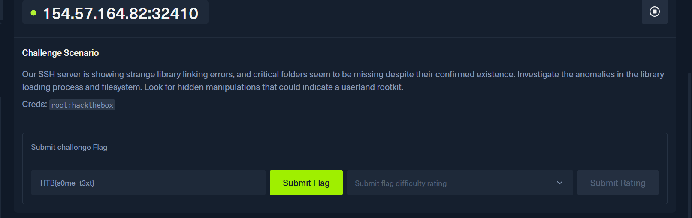
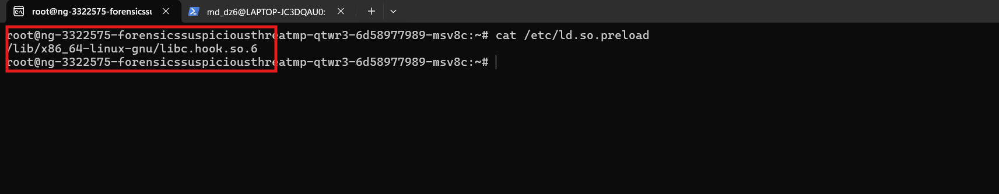
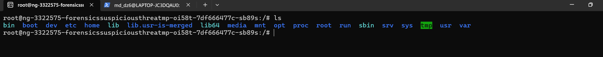
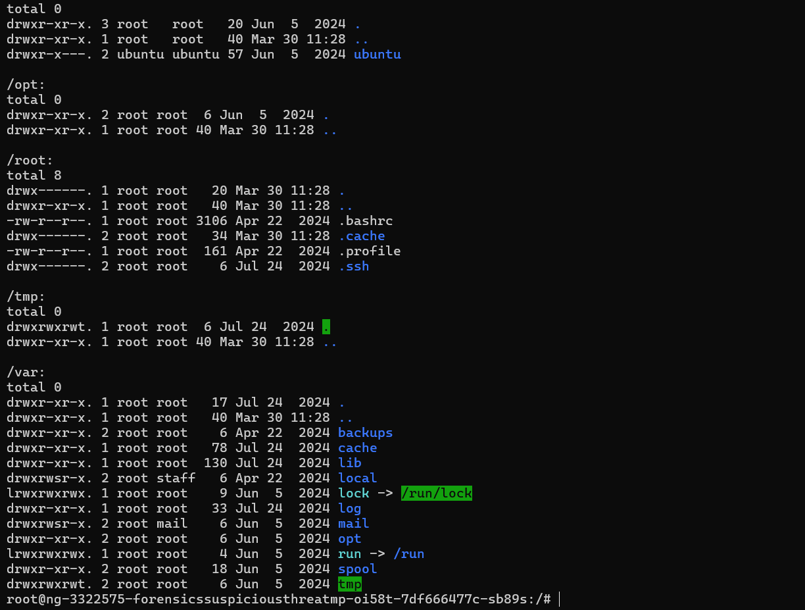
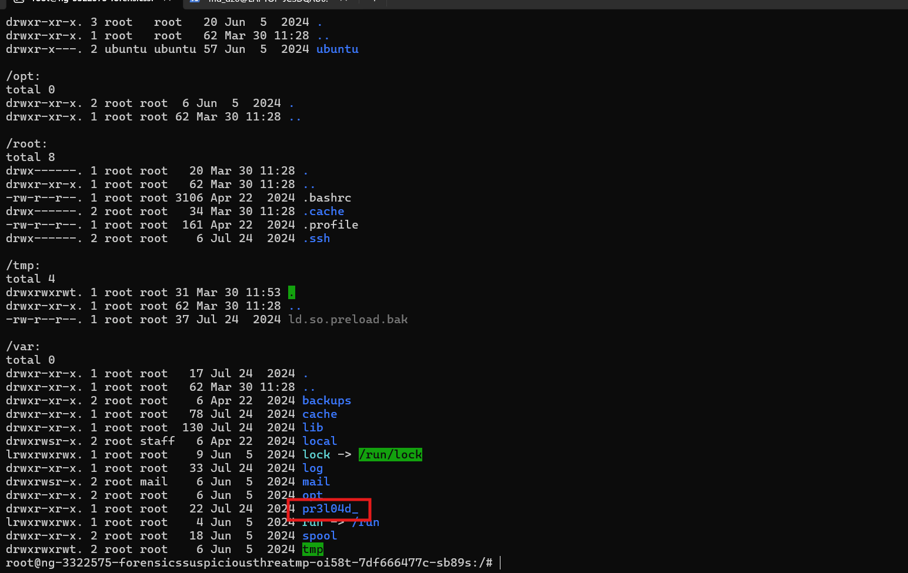
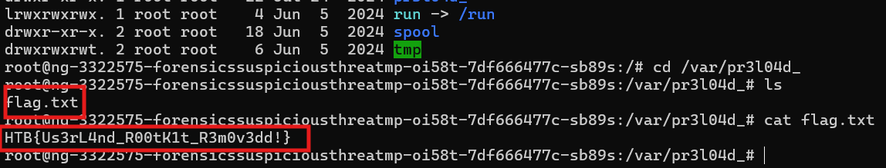

# Challenge Suspicious Threat

## 1. Đề bài

Đề bài của challenge là: Máy chủ SSH đang xuất hiện các lỗi liên kết thư viện bất thường, đồng thời một số thư mục quan trọng dường như bị biến mất dù chắc chắn chúng vẫn tồn tại. Nhiệm vụ là điều tra các bất thường trong quá trình nạp thư viện và hệ thống tệp, từ đó tìm ra những thao tác ẩn đáng ngờ có thể cho thấy sự hiện diện của một userland rootkit.



---

## 2. Kiểm tra cơ chế preload thư viện

Vì đề bài có đề cập tới hiện tượng lỗi liên kết thư viện và các thư mục quan trọng có dấu hiệu bị ẩn, nên trước tiên thử kiểm tra file `/etc/ld.so.preload` để xem hệ thống có đang preload một thư viện bất thường nào hay không.



Tìm được thư viện bị preload là:

```text
/lib/x86_64-linux-gnu/libc.hook.so.6
```

### Kiến thức ngoài lề

- `/etc/ld.so.preload` là file cấu hình của dynamic linker trên Linux, dùng để chỉ định những shared library (`.so`) phải được nạp trước các thư viện khác mỗi khi chạy chương trình động.

- `Userland rootkit` là một cách can thiệp ở tầng chương trình người dùng để đánh lừa các lệnh hệ thống. Nó không xóa file thật, mà làm cho các lệnh như `ls`, `ps`, `cat` hiển thị sai kết quả; ví dụ trong challenge này, thư mục vẫn tồn tại nhưng bị thư viện độc hại che đi nên `ls` không nhìn thấy.

---

## 3. Kiểm tra các thư mục đáng nghi

Giờ vào thử `/` rồi thử `ls`.



### Nhận xét

Do filesystem ở `/` có rất nhiều thư mục, nên không hợp lý để kiểm tra thủ công toàn bộ ngay từ đầu.

Vì challenge đề cập tới lỗi liên kết thư viện và khả năng có userland rootkit, nên trước hết cần kiểm tra các vị trí liên quan trực tiếp tới cơ chế nạp thư viện như `/etc` và `/lib`. Sau khi phát hiện `/etc/ld.so.preload` đang preload thư viện đáng ngờ `libc.hook.so.6`, có thể suy ra hệ thống đang bị can thiệp ở mức userland để che giấu dữ liệu trong filesystem.

Từ đó, ưu tiên rà soát các thư mục có khả năng chứa dữ liệu bị che giấu như:

- `/root`
- `/home`
- `/tmp`
- `/opt`
- `/var`

Đây là vị trí thường chứa dữ liệu người dùng, file tạm, dữ liệu ứng dụng hoặc dữ liệu phát sinh của hệ thống. Trong đó, `/var` đặc biệt đáng chú ý vì thường chứa log, cache, spool và các dữ liệu thay đổi theo thời gian.

Ngược lại, các pseudo-filesystem như:

- `/proc`
- `/sys`
- `/dev`

được tạm thời bỏ qua vì chủ yếu chứa thông tin động của kernel hoặc thiết bị. Các thư mục như `/bin`, `/sbin`, `/usr`, `/boot`, `/media`, `/mnt`, `/run`, `/srv` cũng chưa cần ưu tiên ở bước đầu, vì chúng thiên về binary hệ thống, dữ liệu boot, mount point hoặc dữ liệu dịch vụ.

Dùng lệnh:

```bash
ls -la /root /home /opt /tmp /var
```

sau khi chạy command thấy được:



Từ đây `/var` có nhiều folder đáng nghi nhất nên có thể để ý vào `/var`.

---

## 4. Vô hiệu preload để kiểm tra rootkit có đang che giấu dữ liệu không

Tiếp tục thử di chuyển file preload để vô hiệu cơ chế preload tạm thời, từ đó kiểm tra xem thư viện `libc.hook.so.6` có đang can thiệp vào việc hiển thị file và thư mục hay không.

```bash
mv /etc/ld.so.preload /tmp/ld.so.preload.bak
```

Sau đó chạy lại:

```bash
ls -la /root /home /opt /tmp /var
```

thì thấy trong `/var` xuất hiện folder mới.



---

## 5. Lấy flag

Thử di chuyển vào folder đó thì thấy được file `flag.txt`, thử đọc file đó thì thấy được flag là:

```text
HTB{Us3rL4nd_R00tK1t_R3m0v3dd!}
```



---

## 6. Flow phân tích

```text
máy chủ có dấu hiệu lỗi liên kết thư viện + thư mục bị ẩn
   |
   v
nghi ngờ có cơ chế preload bất thường
   |
   v
kiểm tra /etc/ld.so.preload
   |
   v
phát hiện thư viện:
 /lib/x86_64-linux-gnu/libc.hook.so.6
   |
   v
nghi ngờ đây là userland rootkit can thiệp vào việc hiển thị file / thư mục
   |
   v
không kiểm tra toàn bộ filesystem thủ công
   |
   v
ưu tiên các thư mục:
 /root /home /opt /tmp /var
   |
   v
chạy:
 ls -la /root /home /opt /tmp /var
   |
   v
nhận thấy /var đáng nghi nhất
   |
   v
tạm vô hiệu preload bằng cách di chuyển /etc/ld.so.preload
   |
   v
chạy lại lệnh ls
   |
   v
một folder mới xuất hiện trong /var
   |
   v
di chuyển vào folder đó
   |
   v
đọc file flag.txt
```
---