# Challenge Tangled Heist

## 1. Đầu vào challenge

Đầu vào challenge cung cấp 1 file `capture.pcapng`.

---

## 2. [1/11] Which is the username of the compromised user used to conduct the attack? (for example: username)

Mở conversation để xem luôn giao tiếp của IP.

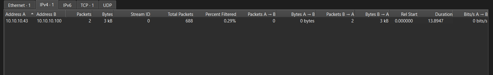

Thấy được chỉ có 2 IP nói chuyện và khả năng:

- `10.10.10.43` = máy attacker
- `10.10.10.100` = LDAP server

Ngay khi mở file để phân tích đã thấy lượt đăng nhập vào thành công của user **Copper**.

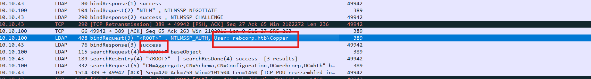

**Đáp án là:** `Copper`

---

## 3. [2/11] What is the Distinguished Name (DN) of the Domain Controller?

Trong Active Directory, **Domain Controllers** là tên OU mặc định dùng để chứa các tài khoản máy tính của các máy đang làm domain controller. Vì vậy dùng filter:

```text
ldap contains "OU=Domain Controllers"
```

để lọc các traffic và tìm thấy được.

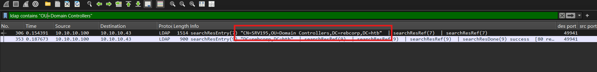

**Đáp án là:** `CN=SRV195,OU=Domain Controllers,DC=rebcorp,DC=htb`

---

## 4. [3/11] Which is the Domain managed by the Domain Controller? (for example: corp.domain)

Do đã tìm được ở câu 2 trong đó:

- `CN=SRV195` → tên object
- `OU=Domain Controllers` → OU chứa máy DC
- `DC=rebcorp,DC=htb` → các thành phần domain

**Đáp án là:** `rebcorp.htb`

---

## 5. [4/11] How many failed login attempts are recorded on the user account named 'Ranger'? (for example: 6)

Câu này sử dụng filter để lọc các traffic có user là `Ranger`:

```text
ldap contains "Ranger"
```

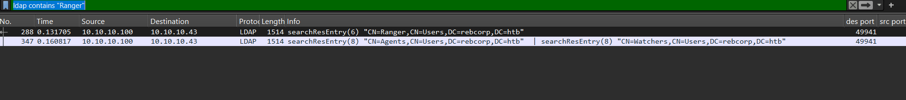

Sau đấy tìm `badPwdCount`.

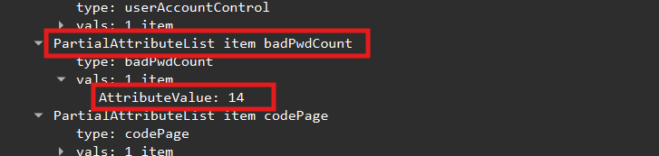

Thấy được **14** lần đăng nhập sai pass.

**Đáp án là:** `14`

---

## 6. [5/11] Which LDAP query was executed to find all groups? (for example: (object=value))

Từ câu 1, thấy được IP chủ yếu được gửi bởi `10.10.10.43`, đồng thời có keyword và format keyword là:

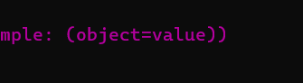

Thử dùng filter:

```text
ldap contains "object" and ip.src == 10.10.10.43
```
Sau khi ngồi xem 1 lúc thì và việc ngay trong câu hỏi có hỏi “find all groups?” thì tìm thấy được

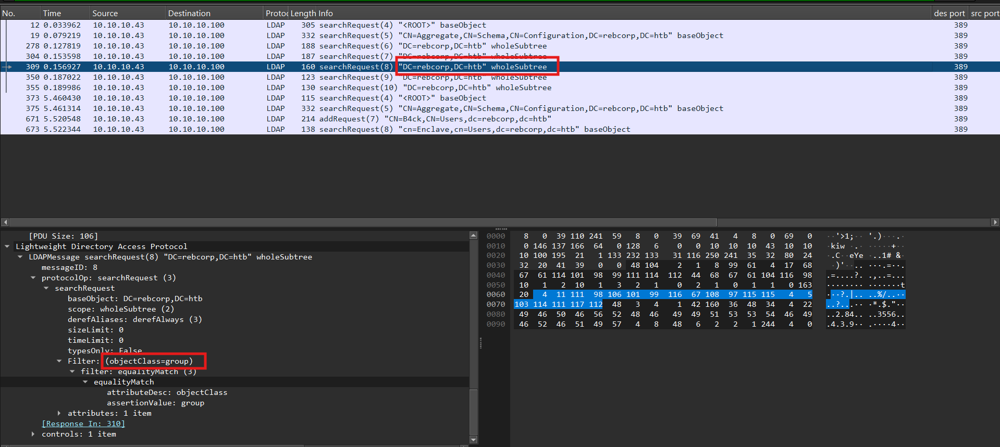

Sau khi ngồi xem 1 lúc thì tìm thấy được:

```text
(objectClass=group)
```

**Đáp án là:** `(objectClass=group)`

---

## 7. [6/11] How many non-standard groups exist? (for example: 1)

Sử dụng filter:

```text
ldap contains "group"
```

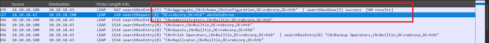

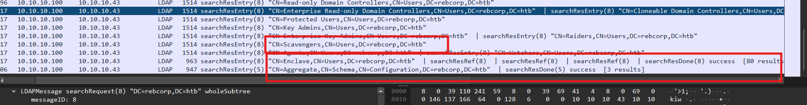

Thấy được **5** non-standard group.

**Đáp án là:** `5`

---

## 8. [7/11] One of the non-standard users is flagged as 'disabled', which is it? (for example: username)

Theo tài liệu về UserAccountControl, mỗi trạng thái của tài khoản được biểu diễn bằng một giá trị cờ riêng. Trong đó, NORMAL_ACCOUNT có giá trị 512, còn ACCOUNTDISABLE có giá trị 2. 

Khi một tài khoản vừa là tài khoản người dùng bình thường vừa bị vô hiệu hóa, hai giá trị này được cộng dồn, tạo thành 514. Vì vậy, nếu userAccountControl = 514 thì có thể suy ra tài khoản đó đang ở trạng thái disabled.

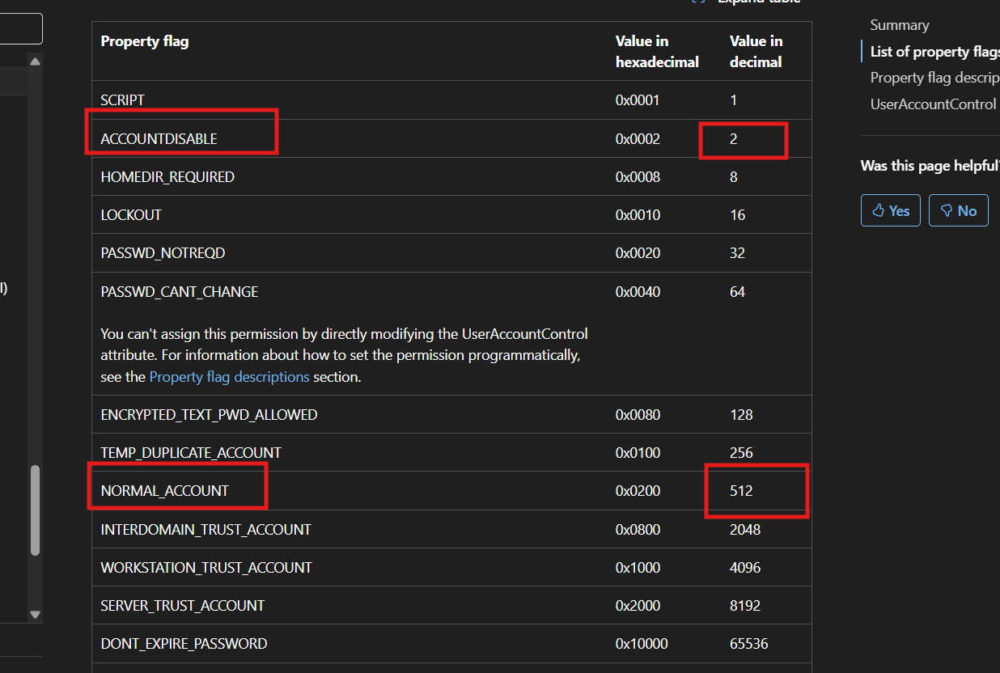

Vì vậy sử dụng filter:

```text
ldap contains "514" && ldap contains "CN=Users"
```

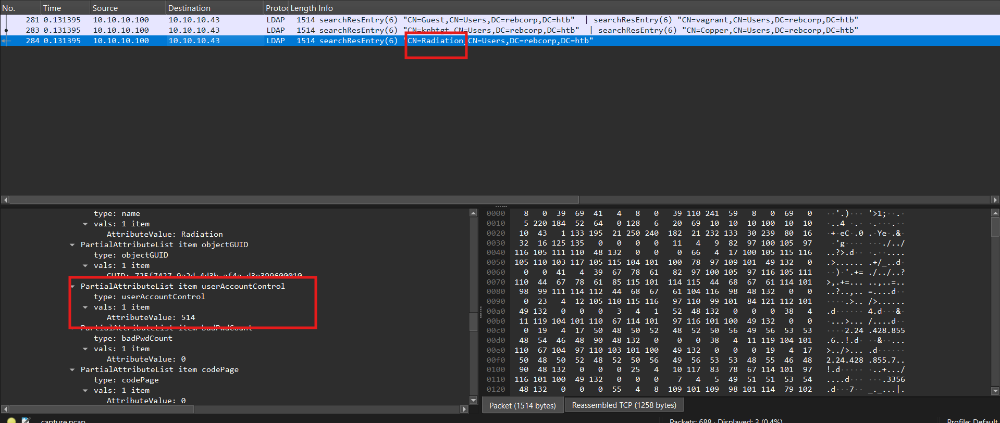

Xác định được user là **Radiation**.

**Đáp án là:** `Radiation`

---

## 9. [8/11] The attacker targeted one user writing some data inside a specific field. Which is the field name? (for example: field_name)

Câu hỏi này hỏi về attacker đã ghi data vào field nào, vậy có thể LDAP sẽ xuất hiện `modifyRequest`. Khi đã biết IP attacker dùng, sử dụng filter:

```text
ip.src == 10.10.10.100 && ldap
```

để lọc các traffic cần xem. Tìm được 2 traffic nhưng trong này có field đáng nghi.


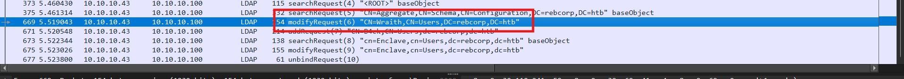

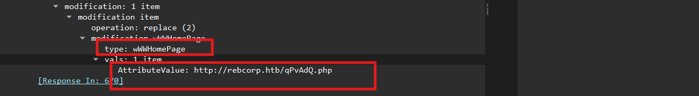

**Đáp án là:** `wWWHomePage`

---

## 10. [9/11] Which is the new value written in it? (for example: value123)

Đáp án có ngay trên ở câu 8.

**Đáp án là:** `http://rebcorp.htb/qPvAdQ.php`

---

## 11. [10/11] The attacker created a new user for persistence. Which is the username and the assigned group? Don't put spaces in the answer (for example: username,group)

Đến câu này traffic modify ở dưới lại có giá trị khi nó cho biết username mà attacker đã tạo.

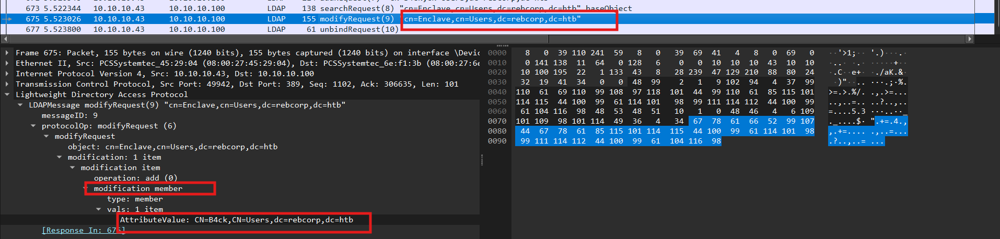

**Đáp án là:** `B4ck,Enclave`

---

## 12. [11/11] The attacker obtained an hash for the user 'Hurricane' that has the UF_DONT_REQUIRE_PREAUTH flag set. Which is the correspondent plaintext for that hash? (for example: plaintext_password)

Vì user `Hurricane` có flag `DONT_REQUIRE_PREAUTH`, attacker có thể gửi **AS-REQ** mà không cần cung cấp pre-auth, và KDC vẫn trả về **AS-REP** để trích hash rồi crack offline.

Thử:

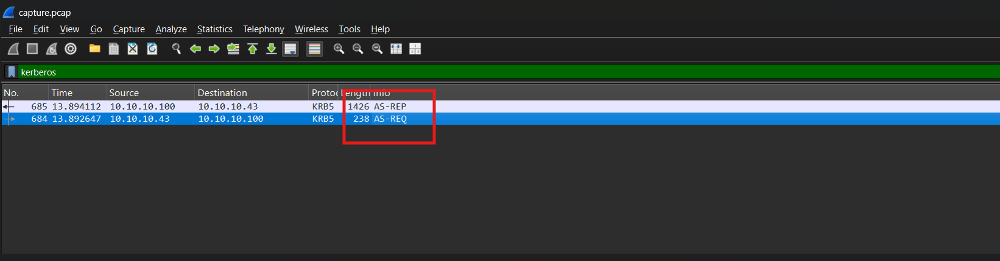

- `10.10.10.43 -> 10.10.10.100` là **AS-REQ**
- `10.10.10.100 -> 10.10.10.43` là **AS-REP**

Điều này chứng minh:

- attacker xin vé cho account `Hurricane`
- server vẫn trả AS-REP
- nên account này đúng là **roastable**

Dùng `tshark` xuất pcap sang PDML, rồi dùng `krb2john.py` để trích dữ liệu AS-REP ra file hash:

```bash
tshark -r capture.pcap -T pdml > capture.pdml
python3 ~/john/run/krb2john.py capture.pdml > hash.txt
```

Kiểm tra nội dung hash thu được:

```text
$krb5asrep$23$d87559a87bea8bebe93b5c067909dbeb$fa371e535597c50cbd0e92b26d2d58a733e0d92b950621dc37a7523611888da6ce0266518cdd5c08b13e050e5487d678feaa30e2910275a1e70912c011b6e408ce448ccc070946089413e9750b7a9685534742f3e43066154a7d06c343b9fc2560da668b9d1dff2cdf9d9fe6791c09c65e3a3064fa128315f3f76cf185d905bdad08acf48a14bfd2ddd5bb8c63f7785b7195ac28f607e2bad049aee6d257cfc0d2f19094c3a9c484145a1949e5fdfb64618b0a61f9b754b50855ab69ba2f48db614eeafebdacab14b4f50e883ef9e78db8be8240461c861e543606358be0ce24982237baaf0d99cc5580
```

Do hash trích ra đang thiếu phần principal `user@REALM`, cần dựng lại hash đầy đủ theo format AS-REP cho Hashcat:

```text
$krb5asrep$23$Hurricane@REBCORP.HTB:<checksum>$<ciphertext>
```

Sau đó lưu hash hoàn chỉnh, bruteforce bằng Hashcat với mode `18200`:

```bash
hashcat -m 18200 hashcat_hash.txt /usr/share/seclists/Passwords/Leaked-Databases/rockyou.txt
```

Kết quả thu được plaintext password của user `Hurricane` là: `april18`

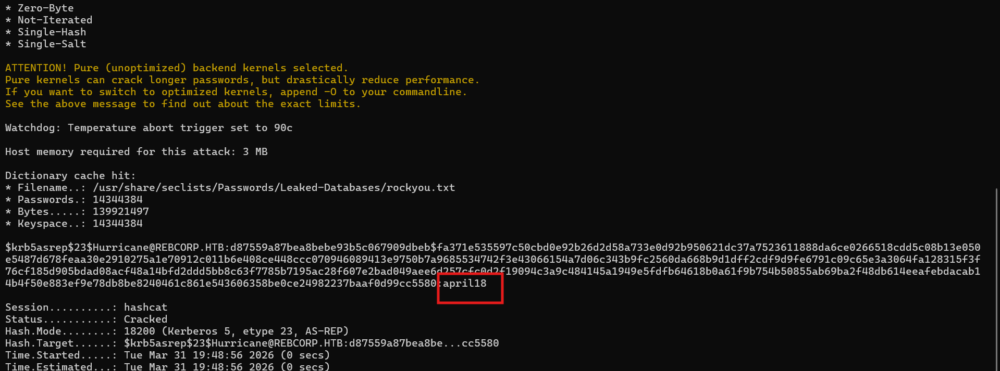

**Đáp án là:** `april18`

---

## 13. Flag

Vậy cuối cùng thu được flag là:

```text
HTB{1nf0rm4t10n_g4th3r3d_fr0m_ld4p_4nd_th3_w1r3!}
```

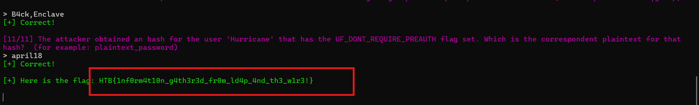

---

## 14. Kiến thức ngoài lề

**LDAP** là viết tắt của **Lightweight Directory Access Protocol**. Nó là giao thức chuẩn để truy cập các dịch vụ thư mục phân cấp, phân quyền.

### DN (Distinguished Name)

DN là chuỗi định danh duy nhất của một object trong cây thư mục.

- `CN` = Common Name, thường là tên object hoặc container.
- `OU` = Organizational Unit, đơn vị tổ chức dùng để sắp xếp object.
- `DC` = Domain Component, từng phần của tên domain DNS.

`CN=...,CN=...,DC=...,DC=...` nghĩa là object nằm trong một container khác cũng được biểu diễn bằng `CN`.  
`CN=...,OU=...,DC=...,DC=...` nghĩa là object nằm trong `OU`.

### PDML

**PDML** là định dạng XML chứa chi tiết packet dissection của Wireshark / TShark, không chỉ raw bytes.

### Kerberos

**Kerberos** là cơ chế / giao thức xác thực chính trong Windows domain / Active Directory, còn **LDAP** là giao thức truy cập dữ liệu thư mục của AD.

### AS-REQ và AS-REP

Đây là cặp message của **Authentication Service (AS) exchange** trong Kerberos.

- `KRB_AS_REQ` là gói client gửi tới KDC để xin TGT.
- `KRB_AS_REP` là gói KDC trả về, chứa TGT và session key để client tiếp tục làm việc với KDC ở các bước sau.

- Client gửi AS-REQ tới KDC để xin TGT.
- Nếu KDC yêu cầu pre-auth mà request đầu chưa có, KDC có thể trả về lỗi kiểu `KDC_ERR_PREAUTH_REQUIRED`.
- Client gửi lại AS-REQ kèm dữ liệu pre-auth.
- Nếu hợp lệ, KDC trả AS-REP chứa TGT và khóa phiên.

Nếu account có `DONT_REQ_PREAUTH`, bước yêu cầu pre-auth có thể bị bỏ qua, nên attacker có thể nhận AS-REP trực tiếp hơn.

### Flag `DONT_REQ_PREAUTH` / `DONT_REQUIRE_PREAUTH`

Tên trong `UserAccountControl` của Microsoft là `DONT_REQ_PREAUTH`, giá trị `0x400000` hay `4194304`.

Nó cho biết tài khoản đó **không bắt buộc Kerberos pre-authentication** trong AS exchange. Đây là flag cần chú ý vì nó mở đường cho **AS-REP roasting**: attacker có thể xin AS-REP cho user đó mà không cần chứng minh biết password trước.

---

## Q&A

| Câu hỏi | Đáp án |
|---|---|
| [1/11] Which is the username of the compromised user used to conduct the attack? | `Copper` |
| [2/11] What is the Distinguished Name (DN) of the Domain Controller? | `CN=SRV195,OU=Domain Controllers,DC=rebcorp,DC=htb` |
| [3/11] Which is the Domain managed by the Domain Controller? | `rebcorp.htb` |
| [4/11] How many failed login attempts are recorded on the user account named 'Ranger'? | `14` |
| [5/11] Which LDAP query was executed to find all groups? | `(objectClass=group)` |
| [6/11] How many non-standard groups exist? | `5` |
| [7/11] One of the non-standard users is flagged as 'disabled', which is it? | `Radiation` |
| [8/11] The attacker targeted one user writing some data inside a specific field. Which is the field name? | `wWWHomePage` |
| [9/11] Which is the new value written in it? | `http://rebcorp.htb/qPvAdQ.php` |
| [10/11] The attacker created a new user for persistence. Which is the username and the assigned group? Don't put spaces in the answer | `B4ck,Enclave` |
| [11/11] The attacker obtained an hash for the user 'Hurricane' that has the UF_DONT_REQUIRE_PREAUTH flag set. Which is the correspondent plaintext for that hash? | `april18` |
