# Challenge Valhalloween

## 1. Đầu vào challenge

Đầu vào challenge cung cấp các file log `.evtx`.

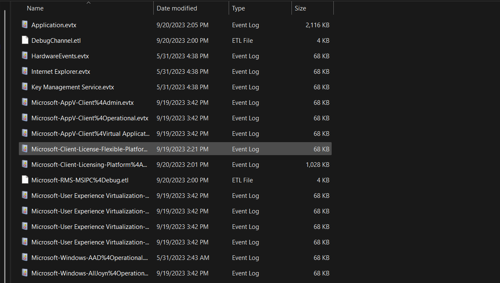

---

## 2. What are the IP address and port of the server from which the malicious actors downloaded the ransomware? (for example: 98.76.54.32:443)

Thử liệt kê các file có dung lượng lớn để khoanh vùng nhanh log đáng nghi.

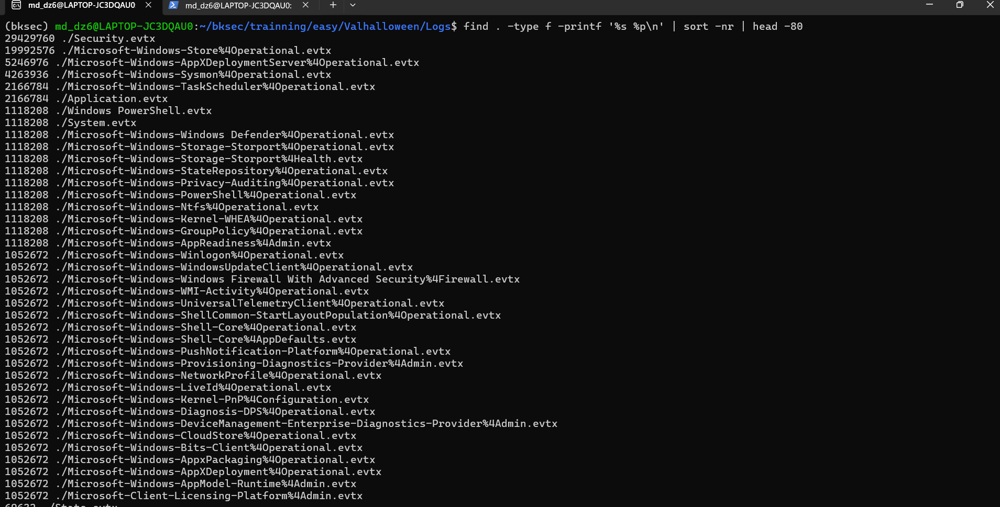

Vậy trước tiên hãy thử mở file `.evtx` liên quan tới PowerShell vì thường các file này sẽ log khá chi tiết hành vi của payload. Phát hiện ra trong file `Windows PowerShell.evtx` có thông tin về `IP:PORT` mà payload độc hại đang connect tới.

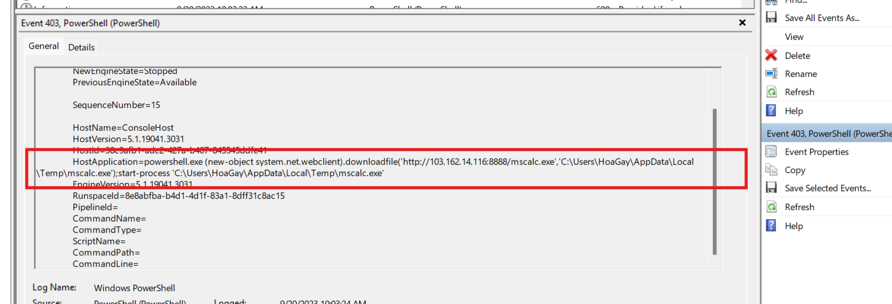

Payload này đang cố gắng tải file `mscalc.exe` và chạy chương trình đó.

**Đáp án là:** `103.162.14.116:8888`

---

## 3. According to the sysmon logs, what is the MD5 hash of the ransomware? (for example: 6ab0e507bcc2fad463959aa8be2d782f)

Từ câu hỏi đã gợi ý ngay file `Sysmon logs`. Ở các bài trước đã thử dùng tool để convert sang CSV, còn với bài này thử dùng tool khác là `chainsaw`.

### Kiến thức ngoài lề

`Chainsaw` là tool dùng để search và hunt nhanh các Windows forensic artifacts. Tool hỗ trợ tìm kiếm theo chuỗi, regex, hoặc điều kiện, và có thể xuất kết quả ra JSON để tiếp tục lọc bằng các công cụ như `jq`.

### Cách hoạt động

Nó tìm trên file EVTX: đọc log, tìm các event chứa chuỗi được truyền vào rồi xuất ra những record khớp điều kiện. Sau đó mình đọc các field quan trọng như `Image`, `CommandLine`, `ParentImage`, `ParentProcessId`, `UtcTime`, ...

Sử dụng command:

```bash
chainsaw search mscalc.exe Microsoft-Windows-Sysmon%4Operational.evtx --json | jq > out.json
```

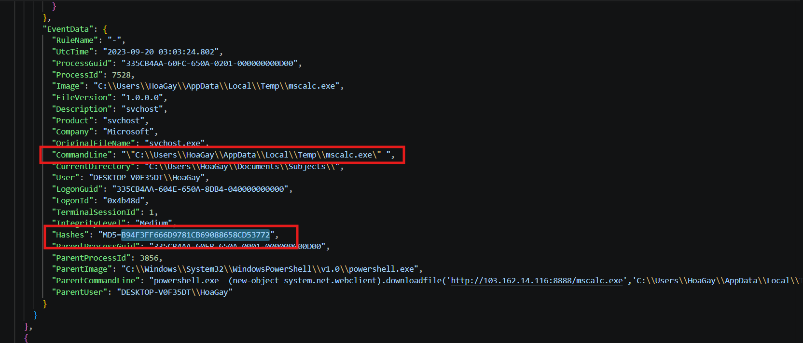

Tìm thấy command line của `mscalc.exe`, và thu được hash MD5 là `B94F3FF666D9781CB69088658CD53772`.

**Đáp án là:** `B94F3FF666D9781CB69088658CD53772`

---

## 4. Based on the hash found, determine the family label of the ransomware in the wild from online reports such as Virus Total, Hybrid Analysis, etc. (for example: wannacry)

Để tìm kiếm **family label** (nhãn họ) của một payload độc hại từ hash thì có thể tra cứu trên `virustotal.com`. Từ đó thấy được family label là `lokilocker`.

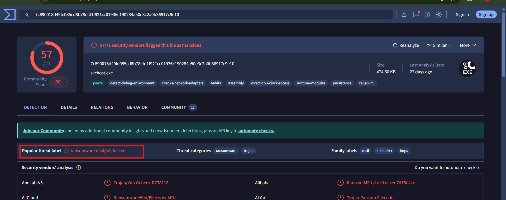

**Đáp án là:** `lokilocker`

---

## 5. What is the name of the task scheduled by the ransomware? (for example: WindowsUpdater)

Từ câu hỏi đã gợi ý về **scheduled task**, tìm kỹ hơn trong command để xem malware đã tạo task như thế nào.

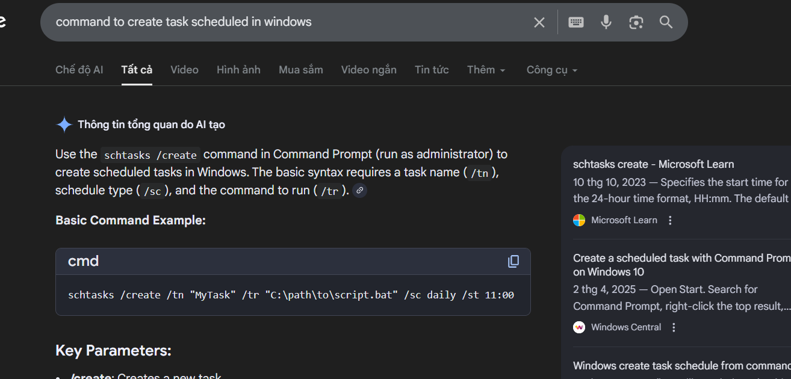

Vậy thử tìm chuỗi `schtasks /CREATE` trong file JSON.

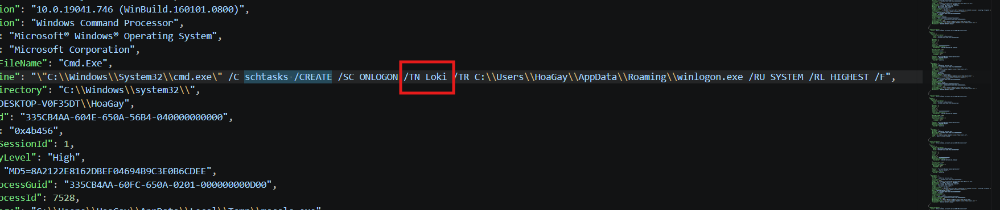

Thấy được `/TN Loki` (trong đó `TN` là task name).

**Đáp án là:** `Loki`

---

## 6. What are the parent process name and ID of the ransomware process? (for example: svchost.exe_4953)

Từ kết quả của câu 3 thấy được ngay `ParentImage` là:

```text
C:\Windows\System32\WindowsPowerShell\v1.0\powershell.exe
```

và `ParentProcessId` là `3856`.

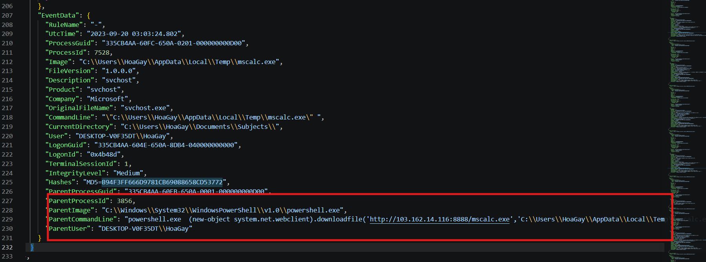

**Vậy đáp án là:** `powershell.exe_3856`

---

## 7. Following the PPID, provide the file path of the initial stage in the infection chain. (for example: D:\Data\KCorp\FirstStage.pdf)

### Nhận định lại

- Ransomware là `mscalc.exe`
- Parent của nó là `powershell.exe` với `ParentProcessId = 3856`

Quay ngược tìm parent của `powershell.exe`.

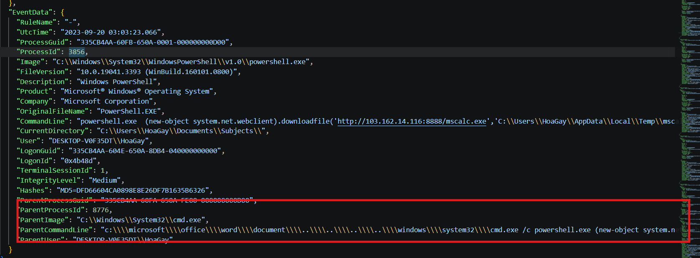

Thấy được parent của nó là `cmd.exe` với `ParentProcessId = 8776`. Tiếp tục tìm tiếp parent của `cmd.exe` thì thấy được stage đầu tiên.

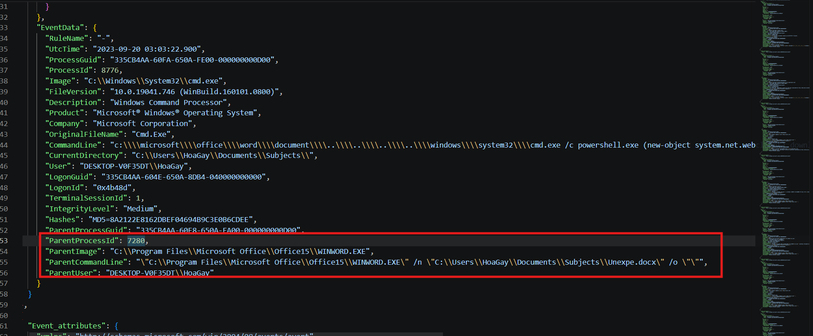

`cmd.exe` có parent là `WINWORD.EXE`, và `ParentCommandLine` cho thấy Word đang mở file `Unexpe.docx`.

**Vậy đáp án là:** `C:\Users\HoaGay\Documents\Subjects\Unexpe.docx`

---

## 8. When was the first file in the infection chain opened (in UTC)? (for example: 1975-04-30_12:34:56)

Vì cần tìm thời điểm chính xác file đầu tiên trong infection chain được mở, ta dùng `Chainsaw` để search chuỗi `Unexpe.docx` trong log Sysmon.

```bash
chainsaw search "Unexpe.docx" "Microsoft-Windows-Sysmon%4Operational.evtx" --json | jq . > ../Unexpe.json
```

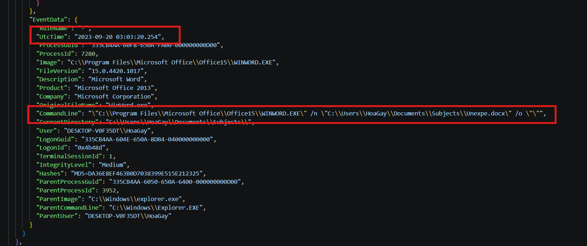

Mở file output ra, thấy ngay event process creation của `WINWORD.EXE` với `CommandLine` mở file `C:\Users\HoaGay\Documents\Subjects\Unexpe.docx`, đồng thời trường `UtcTime` là `2023-09-20 03:03:20.254`.

### Nhận xét
File JSON ban đầu không chứa event mở file đầu tiên, mà chỉ bắt đầu từ event cmd.exe lúc 2023-09-20 03:03:22.900. Trong event này, ParentImage là WINWORD.EXE và ParentCommandLine cho thấy Word đang mở C:\Users\HoaGay\Documents\Subjects\Unexpe.docx, nên từ JSON này chỉ kết luận được rằng đến 03:03:22 thì tài liệu đã được mở rồi, chưa thể lấy chính xác thời điểm mở đầu tiên. 


Muốn tìm đúng đáp án, search trực tiếp Unexpe.docx trên file log Sysmon, khi đó thấy được event sớm hơn của WINWORD.EXE, trong đó CommandLine mở đúng file Unexpe.docx và UtcTime là 2023-09-20 03:03:20.254. 


**Đáp án là:** `2023-09-20_03:03:20`

---

## 9. Flag

Cuối cùng thu được flag là:

```text
HTB{l0k1_R4ns0mw4r3_w4s_n0t_sc4ry_en0ugh}
```

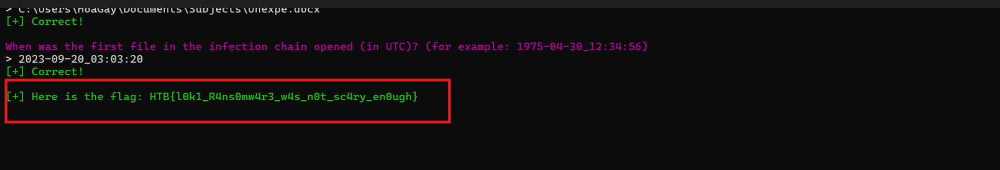

---

## 10. Bảng câu hỏi - đáp án

| Câu hỏi | Đáp án |
|---|---|
| What are the IP address and port of the server from which the malicious actors downloaded the ransomware? | `103.162.14.116:8888` |
| According to the sysmon logs, what is the MD5 hash of the ransomware? | `B94F3FF666D9781CB69088658CD53772` |
| Based on the hash found, determine the family label of the ransomware in the wild from online reports such as Virus Total, Hybrid Analysis, etc.? | `lokilocker` |
| What is the name of the task scheduled by the ransomware? | `Loki` |
| What are the parent process name and ID of the ransomware process? | `powershell.exe_3856` |
| Following the PPID, provide the file path of the initial stage in the infection chain. | `C:\Users\HoaGay\Documents\Subjects\Unexpe.docx` |
| When was the first file in the infection chain opened (in UTC)? | `2023-09-20_03:03:20` |
