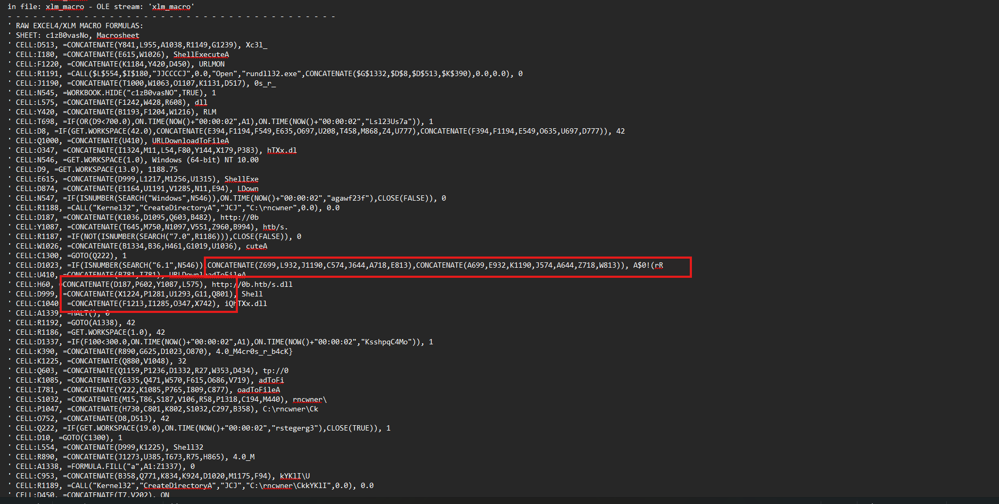
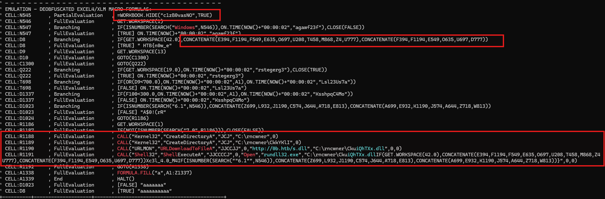
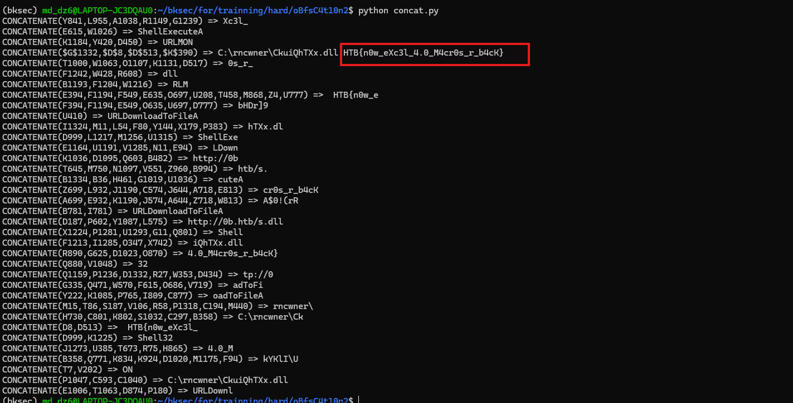

# Challenge oBfsC4t10n2

## 1. Đầu vào challenge

Đầu vào challenge cung cấp file `oBfsC4t10n2.xls`.

Sử dụng `olevba` để check VBA:

```bash
olevba oBfsC4t10n2.xls > test.txt
```

Kết quả trả về, chú ý vào các đoạn này:





## 2. Phân tích macro

- Macro bắt đầu tại `N545` với lệnh `WORKBOOK.HIDE`, sau đó kiểm tra môi trường bằng `GET.WORKSPACE`, cụ thể là kiểm tra hệ điều hành có chứa chuỗi `Windows` hay không. Nếu điều kiện hợp lệ, macro tiếp tục thực thi các cell tiếp theo thông qua `ON.TIME` và `GOTO`.

- Phần quan trọng, macro gọi `CreateDirectoryA` để tạo thư mục `C:\rncwner` và `C:\rncwner\CkkYKlI`, sau đó dùng `URLDownloadToFileA` để tải file DLL từ `http://0b.htb/s.dll` về đường dẫn `C:\rncwner\CkuiQhTXx.dll`.

- Cuối cùng, macro gọi `ShellExecuteA` để chạy `rundll32.exe` với DLL vừa tải. Tham số truyền vào được ghép bằng nhiều hàm `CONCATENATE`, trong đó các chuỗi không nằm liên tục mà bị tách thành nhiều cell rải rác trong file `test.txt`.

## 3. Deobfuscate các chuỗi `CONCATENATE`

Sử dụng script để lấy giá trị của các cell được tham chiếu, sau đó mô phỏng lại các hàm `CONCATENATE` theo đúng thứ tự thực thi.

```python
import re

text = open("test.txt", "rb").read().replace(b"\x00", b"").decode(errors="ignore")

values = {}
formulas = {}

def split_formula(s):
    depth = 0
    quote = False

    for i, c in enumerate(s):
        if c == '"':
            quote = not quote
        elif not quote:
            if c == "(":
                depth += 1
            elif c == ")":
                depth -= 1
            elif c == "," and depth == 0:
                return s[:i].strip()

    return s.strip()

def find_concats(s):
    out = []
    i = 0

    while True:
        m = re.search(r"CONCATENATE\s*\(", s[i:], re.I)
        if not m:
            break

        start = i + m.start()
        p = i + m.end() - 1
        depth = 0

        for j in range(p, len(s)):
            if s[j] == "(":
                depth += 1
            elif s[j] == ")":
                depth -= 1
                if depth == 0:
                    out.append(s[start:j + 1])
                    i = j + 1
                    break
        else:
            break

    return out

def get_args(expr):
    inside = expr[expr.find("(") + 1:expr.rfind(")")]
    return [x.strip().replace("$", "") for x in inside.split(",")]

for line in text.splitlines():
    m = re.search(r"CELL:([A-Z]+\d+)\s*,\s*None\s*,\s?(.*)", line)
    if m:
        values[m.group(1)] = m.group(2)

    m = re.search(r"CELL:([A-Z]+\d+)\s*,\s*=(.*)", line)
    if m:
        formulas[m.group(1)] = split_formula(m.group(2))

def calc(expr):
    result = ""

    for ref in get_args(expr):
        result += resolve(ref)

    return result

def resolve(ref):
    ref = ref.strip().replace("$", "")

    if ref in formulas:
        concats = find_concats(formulas[ref])
        if concats:
            return calc(concats[0])

    return values.get(ref, "")

seen = set()

for expr in find_concats(text):
    if expr in seen:
        continue

    seen.add(expr)
    result = calc(expr)

    if result:
        print(expr, "=>", result)
```

### Giải thích

Script deobfuscate trong file `test.txt`. Script lưu lại các cell có dạng `CELL:<tọa độ>, None, <giá trị>` vào dictionary `values`. Tiếp theo, script tìm `CONCATENATE(...)` trong file, tách danh sách cell bên trong rồi lần lượt tra giá trị của từng cell. Nếu một cell lại trỏ tới công thức `CONCATENATE` khác, script sẽ resolve tiếp để xử lý các chuỗi lồng nhau. Cuối cùng, các giá trị được ghép lại theo đúng thứ tự xuất hiện trong công thức và in ra chuỗi đã được deobfuscate.

## 4. Flag

Cuối cùng thu được flag là:

```text
HTB{n0w_eXc3l_4.0_M4cr0s_r_b4cK}
```


