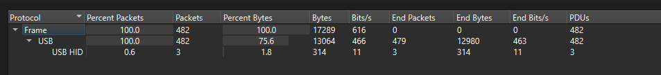
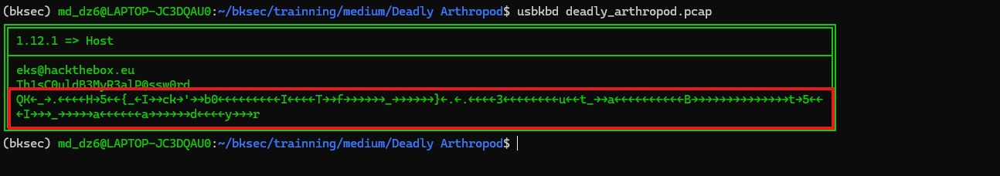
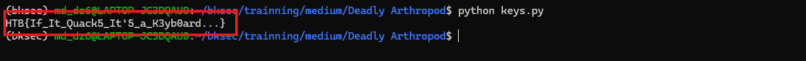
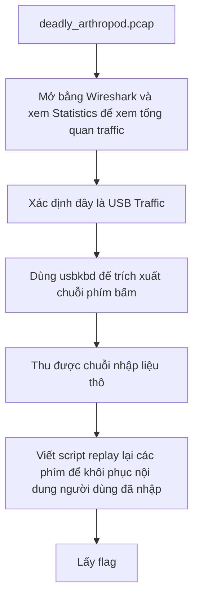

# Challenge Deadly Arthropod

## 1. Đầu vào challenge

Đầu vào challenge cung cấp file `pcap`, mở bằng Wireshark rồi vào **Statistics** để xem và phán đoán hướng tiếp theo để tìm kiếm.



Xác định được các traffic là **USB Traffic** vì vậy challenge thường phân tích dữ liệu **USB HID / keystroke của bàn phím** để lấy được flag.

## 2. Trích xuất chuỗi phím bấm

Sử dụng tool `usbkbd` để trích xuất các phím bấm từ file `deadly_arthropod.pcap`:

```bash
usbkbd deadly_arthropod.pcap
```



Cuối cùng thu được chuỗi nhập liệu thô, từ đó tiếp tục khôi phục lại flag hoàn chỉnh.

## 3. Replay lại chuỗi phím bấm

Sử dụng script để replay lại chuỗi phím bấm và khôi phục nội dung nhập:

```python
s = "QK←_→.←←←←H→5←←{_←I→→ck→'→→b0←←←←←←←←←I←←←←T→→f→→→→→→_→→→→→→}←.←.←←←←3←←←←←←←←u←←t_→→a←←←←←←←←←←B→→→→→→→→→→→→→→t→5←←←I→→→_→→→→→a←←←←←←a→→→→→→d←←←←y→→→r"

buf = []
cur = 0

for ch in s:
    if ch == "←":
        if cur > 0:
            cur -= 1
    elif ch == "→":
        if cur < len(buf):
            cur += 1
    else:
        buf.insert(cur, ch)
        cur += 1

print("".join(buf))
```

Sau khi replay lại toàn bộ chuỗi phím bấm thì thu được flag là `HTB{If_It_Quack5_It'5_a_K3yb0ard...}`



## 4. Flow


