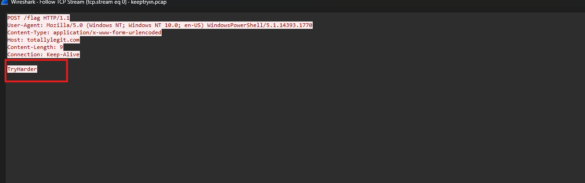
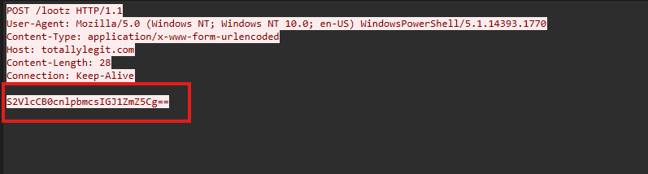
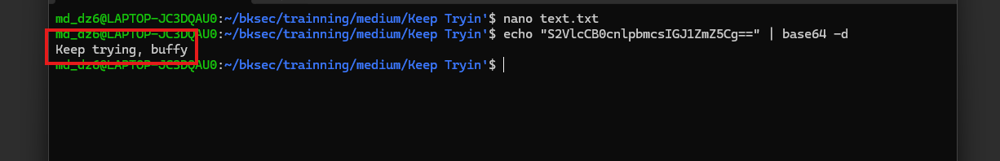
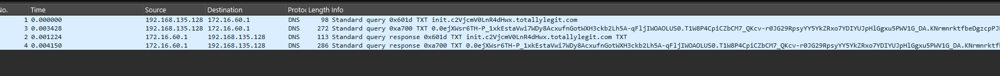
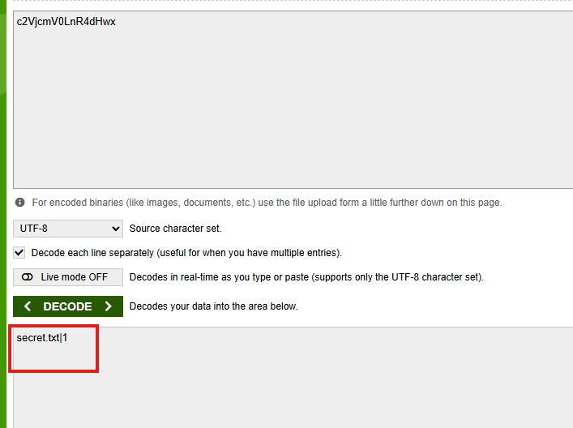
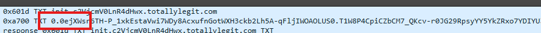
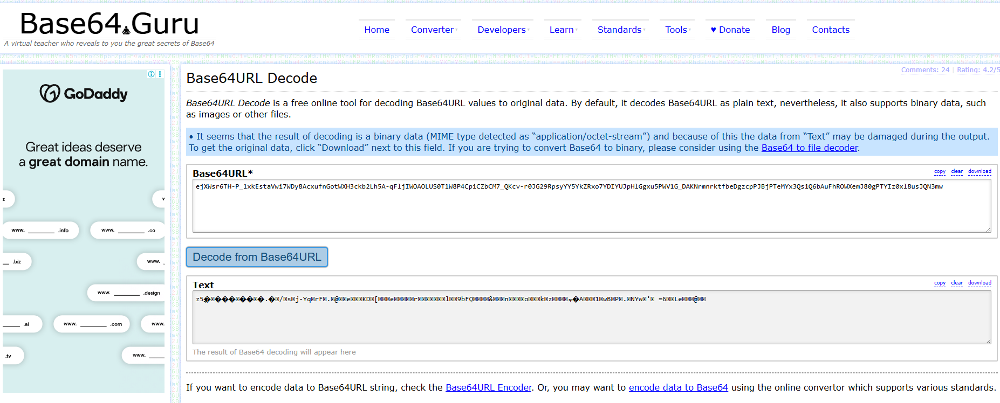
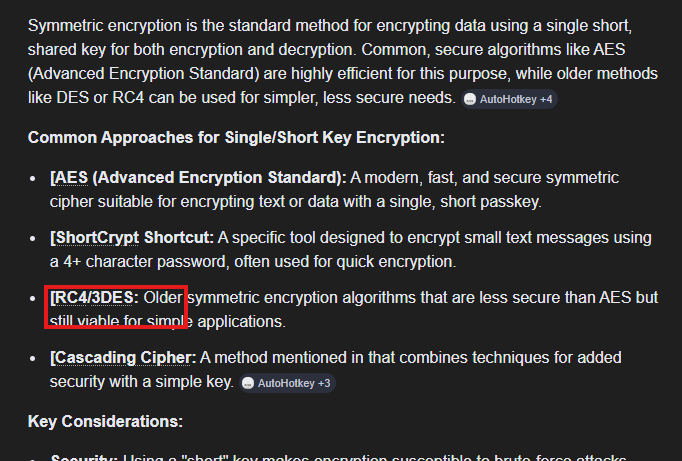
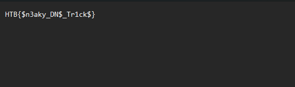
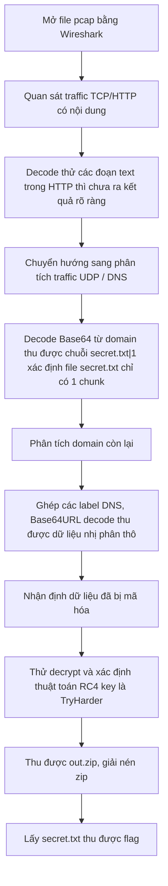

# Challenge Keep Tryin'

## 1. Đầu vào challenge

Đầu vào challenge cung cấp file `pcap`, mở bằng Wireshark.

File `pcap` này khá ít traffic nên khi mở thử các traffic TCP/HTTP chứa nội dung:



Hoặc:



Mà khi decode ra thì thu được:



Những đoạn text này chưa có tác dụng gì nhiều nên giờ đi vào tìm kiếm dựa vào các traffic UDP.



Khi thử decode Base64 của domain thì ra được nội dung như này:



Vậy sau khi decode thì thấy được chuỗi `secret.txt|1`. Điều này cho biết dữ liệu bị lấy ra là file `secret.txt`, và file này chỉ được chia thành **1 chunk** để gửi đi qua DNS.



Đồng thời ở domain 2 cũng thấy phần dữ liệu còn lại. Nhãn đầu tiên là `0`, tức là **chunk số 0**. Phần phía sau chính là nội dung của chunk này nhưng đã bị chia nhỏ thành nhiều label DNS. Ghép các label đó lại, bỏ các dấu chấm, rồi thực hiện **Base64URL decode** (thể hiện qua việc chuỗi sử dụng các ký tự `-` và `_`) sẽ thu được dữ liệu.



## 2. Khôi phục dữ liệu bị exfiltrate

Sau khi decode xong, chỉ thu được 1 file chứa data byte thô, vì vậy khả năng file đang bị mã hóa và 1 trong 2 text trong request HTTP là key.

Sau 1 lúc tra cứu và thử decrypt thì biết file đang được encrypt bằng RC4 với key là `TryHarder`.



### Script decrypt RC4

```python
key = b"TryHarder"
data = open("enc.bin", "rb").read()

S = list(range(256))
j = 0
for i in range(256):
    j = (j + S[i] + key[i % len(key)]) % 256
    S[i], S[j] = S[j], S[i]

i = 0
j = 0
out = bytearray()
for b in data:
    i = (i + 1) % 256
    j = (j + S[i]) % 256
    S[i], S[j] = S[j], S[i]
    k = S[(S[i] + S[j]) % 256]
    out.append(b ^ k)

open("out.zip", "wb").write(out)
```

Sau khi decrypt xong thì thu được file zip, extract file zip đó thu được file `secret.txt` và bên trong chứa flag là `HTB{$n3aky_DN$_Tr1ck$}`.



## 3. Flag

```text
HTB{$n3aky_DN$_Tr1ck$}
```

## 4. Flow


