# Challenge No Start Where

## 1. Đầu vào challenge

Đầu vào challenge cung cấp file `pcap`, mở bằng Wireshark rồi vào phần **Protocol Hierarchy**.

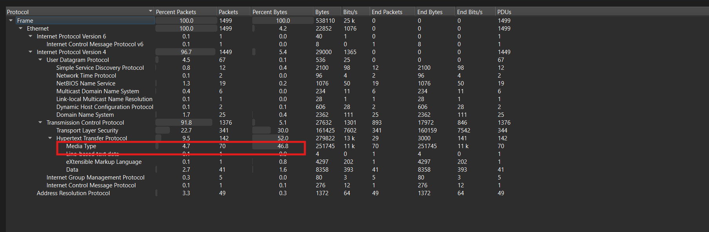

Nhận thấy **Media Type** lớn, nghĩa là trong HTTP có file/content được truyền, vậy đi từ HTTP trước.

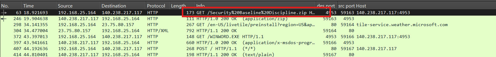

Ngay ở đầu đã thấy request tải một file zip nào đó. Export file này ra rồi extract thì thu được 2 file.

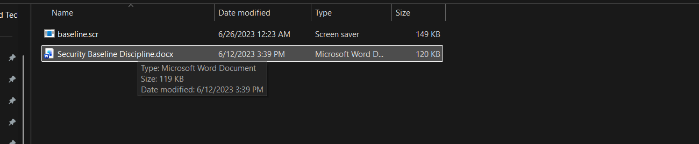

Chú ý hơn vào file `baseline.scr`.

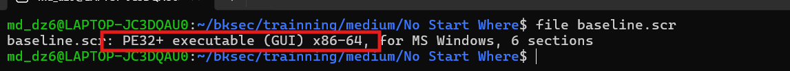

Đây là file thực thi PE dành cho Windows 64-bit.

---

## 2. Chạy mẫu trong máy ảo để quan sát hành vi

Giờ dựng một máy ảo để chạy file `baseline.scr` xem nó làm gì.

Trong máy ảo sử dụng **Process Monitor** để quan sát hành vi. Sau khi chạy `baseline.scr`, vào **Tools → Process Tree** để xem cây tiến trình thì thấy `baseline.scr` gọi `cmd.exe`.

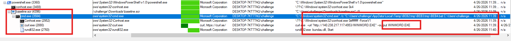

Đồng thời cũng thấy một lỗi liên quan tới `bundau.dll`, cho thấy mẫu đang cố gọi một DLL nào đó nhưng chưa có đủ thành phần.

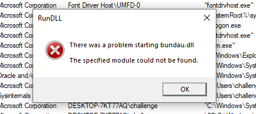

Giờ thử export file `WINWORD.EXE` mà attacker đang cố tải. Sau khi check file thì biết được file này thực chất là một file `7z`.

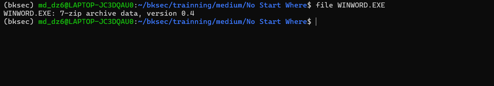

Đồng thời cũng thấy một file batch tạm được tạo trong thư mục `Temp` và được `cmd.exe` gọi thực thi.

Để lấy được nội dung batch tạm mà `baseline.scr` bung ra khi chạy, tạo một thư mục tạm do mình kiểm soát là `C:\CatchTemp`. Sau đó cấp quyền ghi cho user hiện tại nhưng chặn quyền xóa file/thư mục con bằng `icacls`. Tiếp theo, trong cùng cửa sổ PowerShell, ép biến môi trường `TEMP` và `TMP` trỏ về `C:\CatchTemp` rồi chạy lại `baseline.scr`.

Mục đích của cách này là khiến các file tạm do `baseline.scr` tạo ra, bao gồm file `.bat`, được ghi vào `C:\CatchTemp`. Khi malware hoặc wrapper cố dọn dẹp file tạm sau khi chạy, thao tác xóa sẽ bị chặn bởi quyền `D` và `DC`, nhờ đó file `.bat` không bị mất ngay.

Đoạn lệnh đi kèm:

```powershell
New-Item -ItemType Directory -Force C:\CatchTemp
icacls C:\CatchTemp /grant "$($env:USERNAME):(OI)(CI)(F)"
icacls C:\CatchTemp /deny "$($env:USERNAME):(OI)(CI)(D,DC)"
$env:TEMP = "C:\CatchTemp"
$env:TMP = "C:\CatchTemp"
cd $env:USERPROFILE\Downloads
.\baseline.scr
```

### Giải thích `icacls`

- `D` = Delete
- `DC` = Delete Child

Tức là chương trình vẫn có thể tạo/ghi file vào `C:\CatchTemp`, nhưng không thể xóa file tạm sau khi tạo.

Việc ép `TEMP`/`TMP` sang `C:\CatchTemp` và chặn quyền xóa là một dạng can thiệp vào môi trường chạy của mẫu. Vì vậy một số dropper hoặc self-extractor phụ thuộc vào quá trình tạo thư mục tạm, chạy script, rồi cleanup sau khi chạy. Khi thao tác xóa/cleanup bị chặn, wrapper có thể gặp lỗi hoặc dừng sớm, khiến batch không đi tiếp tới bước gọi `curl.exe` tải `WINWORD.EXE` và `rundll32.exe` load `bundau.dll`.

Cuối cùng thu được file `.bat` đang bị obfuscate.

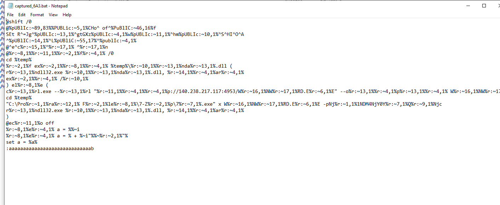

---

## 3. Deobfuscate batch và dựng lại flow stage đầu

Sử dụng tool hoặc tự deobfuscate thì ra được nội dung thật của batch.

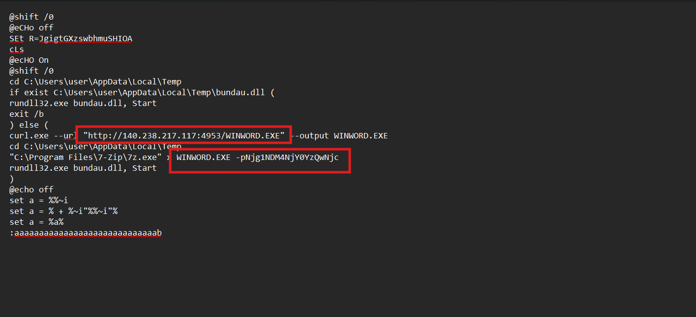

Vậy là xác nhận đúng file `WINWORD.EXE` là file `7z`, và mật khẩu extract là:

```text
Njg1NDM4NjY0YzQwNjc
```

Sau khi extract thì thu được file `bundau.dll`.

Vậy flow của attacker đến hiện tại là:

- `baseline.scr`
- bung batch tạm
- `curl` tải `WINWORD.EXE`
- `7z` giải nén `WINWORD.EXE` với password
- chạy `bundau.dll` bằng `rundll32.exe`

## 4. Xác định traffic C2 và họ malware

Đồng thời cũng biết `140.238.217.117` là server dùng để phát payload. Đáng chú ý hơn, sau request tải `WINWORD.EXE`, máy nạn nhân tiếp tục gửi nhiều request `POST / HTTP/1.1` tới cùng IP này và đều nhận `HTTP/1.1 200 OK`.

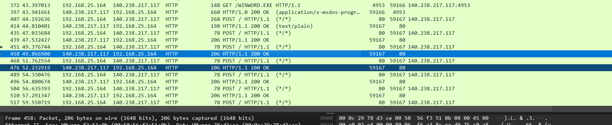

Các request `POST` này có đặc điểm:

- cùng source: `192.168.25.164`
- cùng destination: `140.238.217.117`
- lặp lại nhiều lần sau khi payload được tải
- cùng endpoint: `POST /`
- payload dạng binary, không giống HTTP web thông thường
- server phản hồi `200 OK` đều đặn

Vậy khả năng cao đây là traffic C2/beacon giữa máy nạn nhân và server điều khiển.

Đồng thời khi check file `bundau.dll` qua VirusTotal cũng thấy được dấu hiệu liên quan tới **Havoc**.

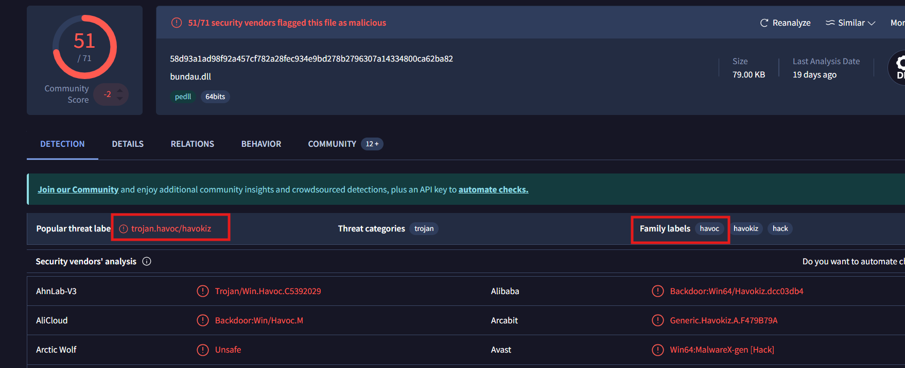

Vậy có thể khẳng định `bundau.dll` là một implant/backdoor thuộc họ **Havoc C2**. Kết hợp với hành vi mạng trong PCAP, các request `POST` sau khi DLL được load nhiều khả năng chính là luồng giao tiếp giữa **Havoc Demon agent** và **Havoc teamserver**.

---

## 5. Trích xuất session Havoc từ PCAP

Sử dụng tool `havoc-pcap-parser` để quét PCAP:

```bash
havoc-pcap-parser \
  --pcap capture.pcap \
  --out ~/bksec/trainning/medium/'No Start Where'/c2_report \
  --find-havoc-sessions \
  --extract \
  --verbose
```

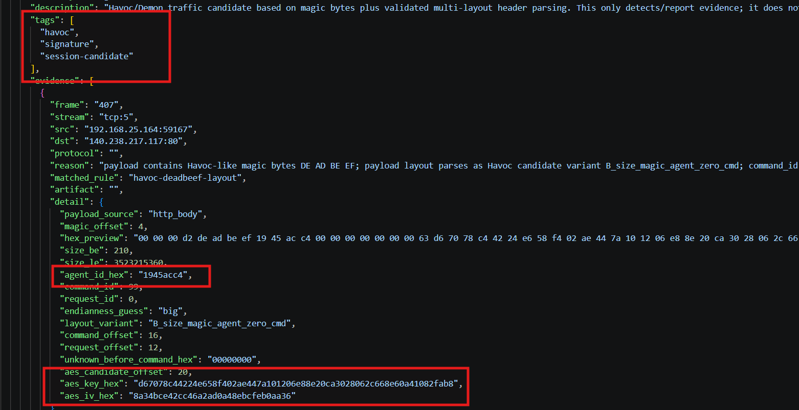

Xác định được:

```text
agent_id = 1945acc4
aes_key  = d67078c44224e658f402ae447a101206e88e20ca3028062c668e60a41082fab8
aes_iv   = 8a34bce42cc46a2ad0a48ebcfeb0aa36
```
---

## 6. Decrypt luồng C2 Havoc

Sau đó dùng session này để decrypt luồng C2:

```bash
havoc-pcap-parser \
  --pcap capture.pcap \
  --out ~/bksec/trainning/medium/'No Start Where'/c2_report_decrypt_clean \
  --max-payload-bytes 20000000 \
  --decrypt \
  --decrypt-family havoc \
  --havoc-session "1945acc4:d67078c44224e658f402ae447a101206e88e20ca3028062c668e60a41082fab8:8a34bce42cc46a2ad0a48ebcfeb0aa36" \
  --havoc-ctr-endian big \
  --min-quality medium \
  --save-full-output \
  --extract \
  --verbose
```

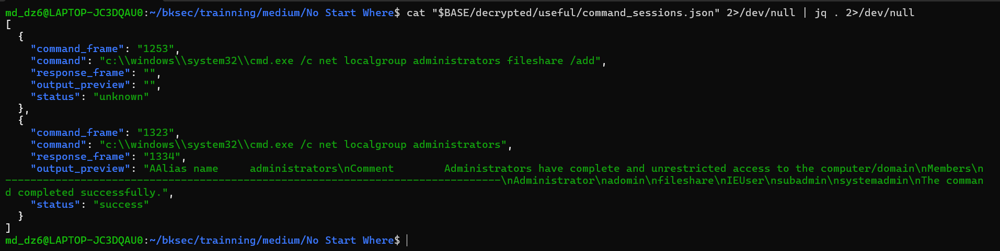

Thấy được command thật của attacker trong C2, bao gồm lệnh thêm user `fileshare` vào nhóm `administrators` và lệnh kiểm tra lại nhóm `administrators`.

---

## 7. Tìm stage tiếp theo được carve ra từ C2

Tiếp tục check xem có các loại file thực thi nào được tool carve ra từ dữ liệu đã decrypt hay không.

```bash
find "$BASE/decrypted" -type f \
  ! -name "*.json" ! -name "*.txt" ! -name "*.csv" \
| while read -r f; do
    info="$(file "$f")"
    if echo "$info" | grep -Eiq "PE|Mono|\.NET|executable|DLL"; then
        echo "$info"
    fi
done
```

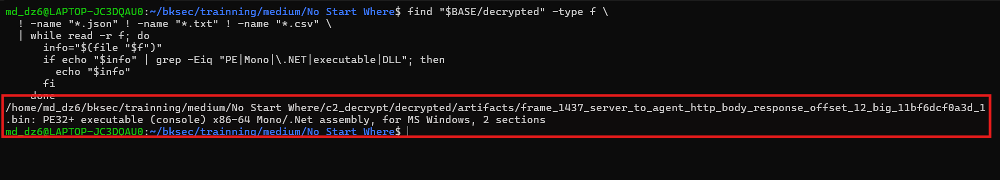

Thấy được một artifact dạng `PE32+ executable` và được nhận diện là `Mono/.Net assembly`.

Mở bằng ILSpy thì thấy trong hàm `Main()` đang gọi hàm `Stage2()` sau khi vượt qua hàm kiểm tra `Checks()`.

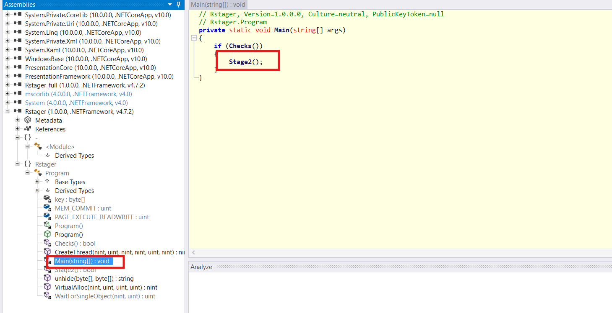

Khi mở hàm `Stage2()`:

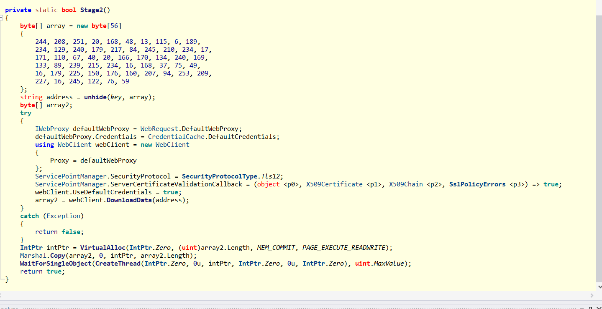

Thấy được hàm này đang thực hiện giải mã một địa chỉ bằng `unhide(key, array)`, sau đó dùng `WebClient.DownloadData(address)` để tải dữ liệu từ địa chỉ đó về.

Thử check xem hàm `unhide()` đang làm gì với các byte trong `key` và `_string`, thấy được logic: hàm này tạo một mảng byte mới có cùng độ dài với `_string`, sau đó duyệt từng byte và XOR byte của `_string` với byte tương ứng trong `key`. Nếu `_string` dài hơn `key` thì key sẽ được lặp lại bằng phép `% key.Length`. Cuối cùng, kết quả được convert lại thành string bằng `Encoding.Default.GetString()`.

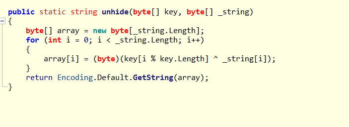

Và mảng `key` được lấy ở đây:

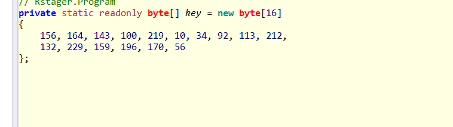

---

## 8. Mô phỏng `unhide()` để lấy URL thật

Sử dụng script để mô phỏng lại hàm `unhide()`:

```python
key = bytes([
    156, 164, 143, 100, 219, 10, 34, 92,
    113, 212, 132, 229, 159, 196, 170, 56
])

arr = bytes([
    244, 208, 251, 20, 168, 48, 13, 115, 6, 189,
    234, 129, 240, 179, 217, 84, 245, 210, 234, 17,
    171, 110, 67, 40, 20, 166, 170, 134, 240, 169,
    133, 89, 239, 215, 234, 16, 168, 37, 75, 49,
    16, 179, 225, 150, 176, 160, 207, 94, 253, 209,
    227, 16, 245, 122, 76, 59
])

decoded = bytes(arr[i] ^ key[i % len(key)] for i in range(len(arr)))
print(decoded.decode(errors="replace"))
```

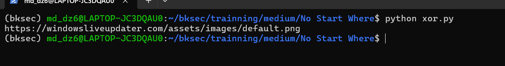

Kết quả thu được URL:

```text
https://windowsliveupdater.com/assets/images/default.png
```

nhưng URL này chỉ là **decoy**.

Sau khi tìm thêm thì thấy được một mảng byte khác trong hàm `Checks()`.

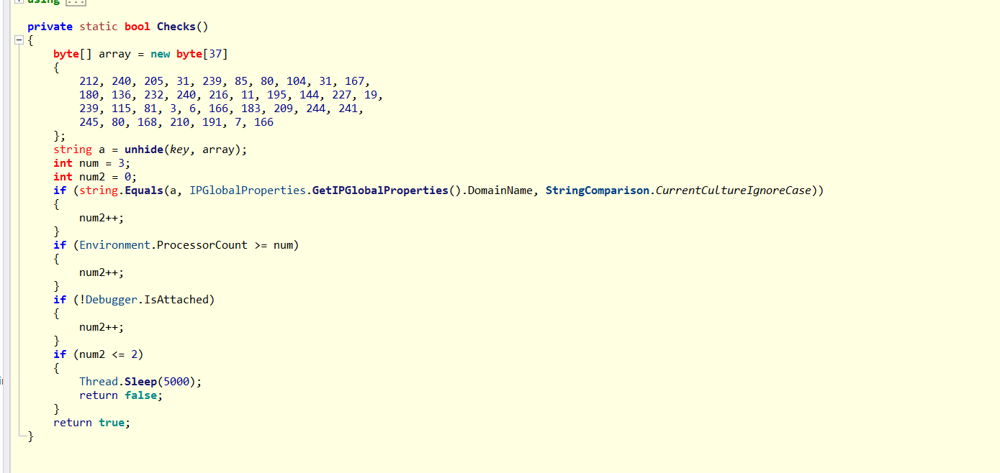

Sử dụng lại script trên nhưng thay các byte `arr`:

```python
key = bytes([
    156, 164, 143, 100, 219, 10, 34, 92,
    113, 212, 132, 229, 159, 196, 170, 56
])

arr = bytes([
    212, 240, 205, 31, 239, 85, 80, 104, 31, 167,
    180, 136, 232, 240, 216, 11, 195, 144, 227, 19,
    239, 115, 81, 3, 6, 166, 183, 209, 244, 241,
    245, 80, 168, 210, 191, 7, 166
])

decoded = bytes(arr[i] ^ key[i % len(key)] for i in range(len(arr)))
print(decoded.decode(errors="replace"))
```

Cuối cùng thu được flag là:

```text
HTB{4_r4ns0mw4r3_4lw4ys_wr34k5_h4v0c}
```

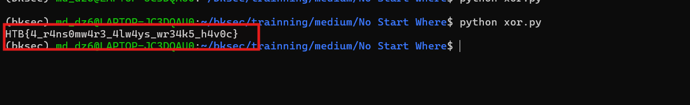

---

## 9. Flag

```text
HTB{4_r4ns0mw4r3_4lw4ys_wr34k5_h4v0c}
```

---

## 10. Flow

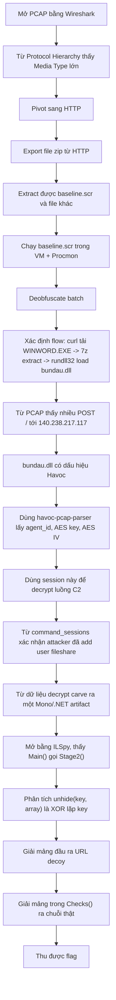
