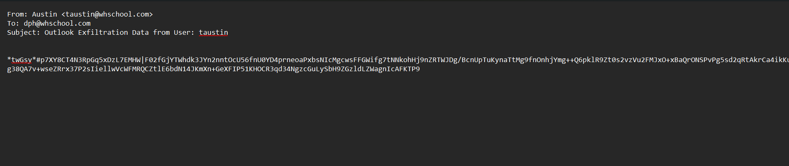
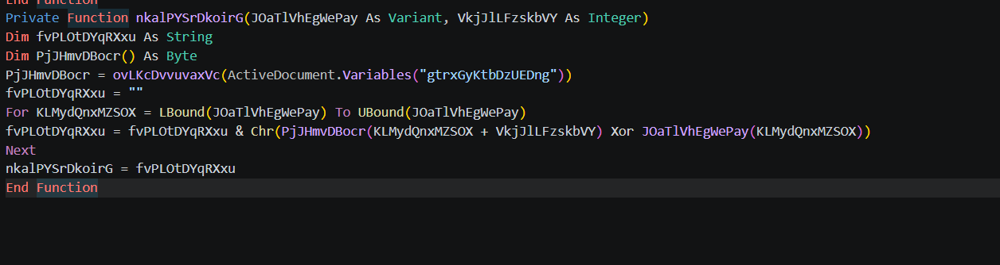
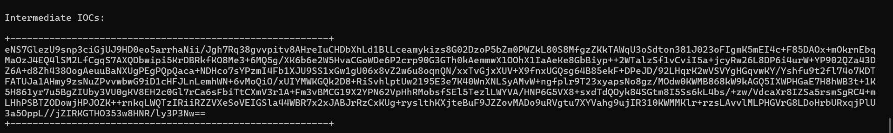
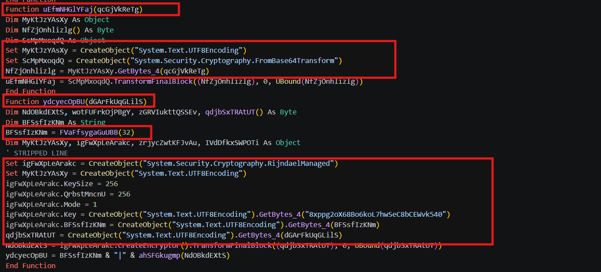
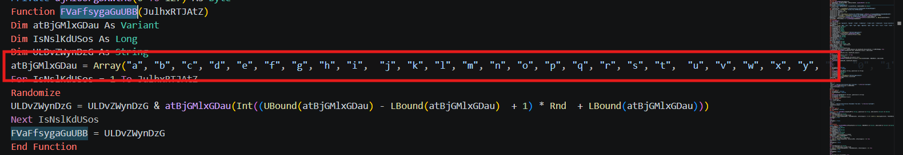
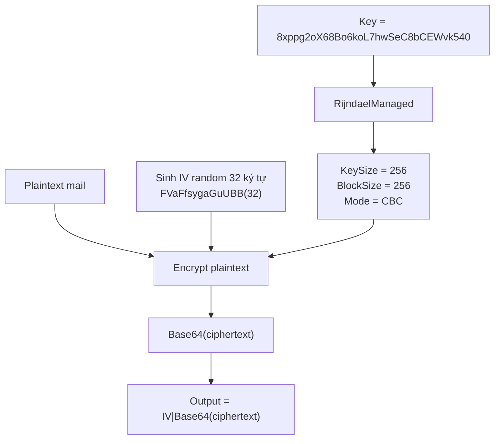
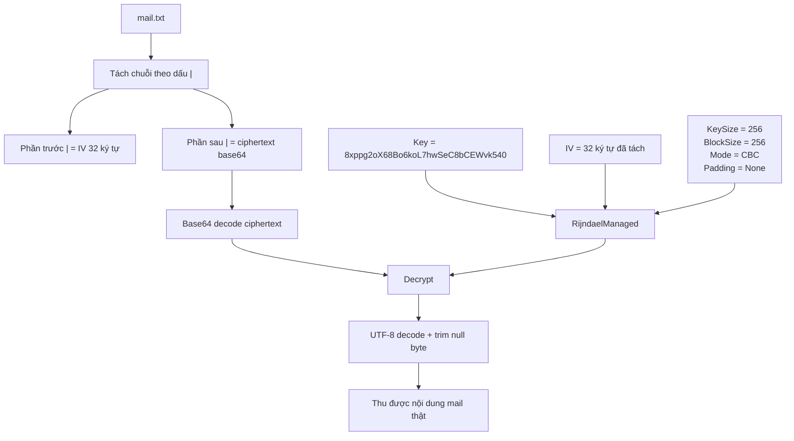
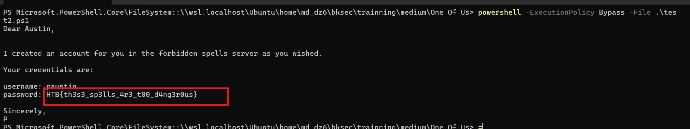

# Challenge One Of Us

## 1. Đầu vào challenge

Mở file `mail.txt` trước.



Khả năng cao đây là dữ liệu đã mã hóa, vậy pivot sang file `.docm` trước.

Check bằng `olevba` thì xác nhận file này chứa VBA macro trong stream và đang bị obfuscated.

Thấy hàm `nkalPYSrDkoirG` được gọi rất nhiều lần.



Hàm này có tác dụng giải mã chuỗi obfuscate. Cụ thể, nó lấy key từ biến document `gtrxGyKtbDzUEDng`, base64-decode key đó qua `ovLKcDvvuvaxVc`, rồi XOR từng byte trong `Array(...)` với byte key tương ứng theo offset `VkjJlLFzskbVY` để khôi phục chuỗi thật.

Sử dụng ViperMonkey để deobfuscate thử thì chỉ thu được value của biến `gtrxGyKtbDzUEDng`.



Còn không có file nào thu được sau quá trình emulate, vậy khả năng script VBA thực chất là mã hóa mail đọc được rồi gửi đi, và file `mail.txt` được cung cấp là file mã hóa đó. Giờ cần tìm logic decrypt.

---

## 2. Mô phỏng hàm `nkalPYSrDkoirG` để deobfuscate VBA

Vì đã có value của biến `gtrxGyKtbDzUEDng`, có thể mô phỏng hàm `nkalPYSrDkoirG` để giải mã các chuỗi bị obfuscate trong VBA, giúp đọc rõ logic mã hóa.

```python
#!/usr/bin/env python3
import re, ast, base64, operator
from pathlib import Path

DOCVAR_VAL = r"""
eNS7GlezU9snp3ciGjUJ9HD0eo5arrhaNii/Jgh7Rq38gvvpitv8AHreIuCHDbXhLd1BlLceamykizs8G02DzoP5bZm0PWZkL80S8MfgzZKkTAWqU3oSdton381J023oFIgmK5mEI4c+F85DAOx+mOkrnEbqMaOzJ4EQ4lSM2LfCgqS7AXQDbwipi5KrDBRkfKO8Me3+6MQ5g/XK6b6e2W5HvaCGoWDe6P2crp90G3GTh0kAemmwX1OOhX1IaAeKe8GbBiyp++2WTalzSf1vCviI5a+jcyRw26L8DP6i4urW+YP902QZa43DZ6A+d8Zh438OogAeuuBaNXUgPEgPQpQaca+NDHco7sYPzmI4Fb1XJU9SS1xGw1gU06x8vZ2w6u8oqnQN/xxTvGjxXUV+X9fnxUGQsg64B85ekF+DPeJD/92LHqrK2wVSVYgHGqvwKY/Yshfu9t2fl74o7KDTFATUJa1AHmy9zsNuZPvvwbwG9iD1cHFJLnLemhWN+6vMoQiO/xUIYMWKGQk2D8+RiSvhlptUw2195E3e7K40WnXNLSyAMvW+ngfplr9T23xyapsNo8gz/MOdw0KWMB868kW9kAGQ5IXWPHGaE7H8hWB3t+1K5H861yr7u5BgZIUby3VU0gKV8EH2c0Gl7rCa6sFbiTtCXmV3r1A+Fm3vBMCG19X2YPN62VpHhRMobsfSEl5TezlLWYVA/HNP6G5VX8+sxdTdQOyk84SGtm8I5Ss6kL4bs/+zw/VdcaXr8IZSa5rsmSgRC4+mLHhPSBTZODowjHPJOZK+
+rnkqLWQTzIRiiRZZVXeSoVEIGSla44WBR7x2xJABJrRzCxKUg+ryslthKXjteBuF9JZZovMADo9uRVgtu7XYVahg9ujIR310KWMMKlr+rzsLAvvlMLPHGVrG8LDoHrbURxqjPlU3a5OppL//jZIRKGTHO353w8HNR/ly3P3Nw==
"""

IN_FILE = "test.txt"
OUT_FILE = "test.deob.txt"
FUNC = "nkalPYSrDkoirG"

OPS = {
    ast.Add: operator.add,
    ast.Sub: operator.sub,
    ast.Mult: operator.mul,
    ast.FloorDiv: operator.floordiv,
    ast.Mod: operator.mod,
    ast.BitXor: operator.xor,
    ast.BitAnd: operator.and_,
    ast.BitOr: operator.or_,
    ast.UAdd: operator.pos,
    ast.USub: operator.neg,
}

def eval_vba(expr):
    expr = re.sub(r"(?i)&H([0-9A-F]+)", r"0x\1", expr)
    expr = re.sub(r"(?i)\bXor\b", "^", expr)
    expr = re.sub(r"(?i)\bAnd\b", "&", expr)
    expr = re.sub(r"(?i)\bOr\b", "|", expr)
    expr = re.sub(r"(?i)\bMod\b", "%", expr)
    expr = expr.replace("\\", "//")

    def walk(n):
        if isinstance(n, ast.Constant):
            return int(n.value)
        if isinstance(n, ast.UnaryOp):
            return OPS[type(n.op)](walk(n.operand))
        if isinstance(n, ast.BinOp):
            return OPS[type(n.op)](walk(n.left), walk(n.right))
        raise ValueError(expr)

    return walk(ast.parse(expr, mode="eval").body)

def close_paren(s, p):
    depth = 0
    for i in range(p, len(s)):
        if s[i] == "(":
            depth += 1
        elif s[i] == ")":
            depth -= 1
            if depth == 0:
                return i
    return -1

def split_args(s):
    out, start, depth = [], 0, 0
    for i, c in enumerate(s):
        if c == "(":
            depth += 1
        elif c == ")":
            depth -= 1
        elif c == "," and depth == 0:
            out.append(s[start:i].strip())
            start = i + 1
    out.append(s[start:].strip())
    return out

def parse_array(s):
    p = s.find("(")
    q = close_paren(s, p)
    inner = s[p + 1:q].strip()
    if not inner:
        return []
    return [eval_vba(x) for x in split_args(inner)]

def decode_call(args, key):
    arr_expr, off_expr = split_args(args)
    arr = parse_array(arr_expr)
    off = eval_vba(off_expr)
    return "".join(chr(key[off + i] ^ (v & 0xFF)) for i, v in enumerate(arr))

def vba_str(s):
    if s == "":
        return '""'
    return '"' + s.replace('"', '""') + '"'

def deob(text, key):
    out, i, count = [], 0, 0
    while True:
        pos = text.find(FUNC, i)
        if pos == -1:
            out.append(text[i:])
            break
        p = text.find("(", pos)
        q = close_paren(text, p)
        if p == -1 or q == -1:
            out.append(text[i:])
            break
        args = text[p + 1:q]
        try:
            if not args.strip().lower().startswith("array"):
                raise ValueError
            plain = decode_call(args, key)
            out.append(text[i:pos])
            out.append(vba_str(plain))
            count += 1
        except Exception:
            out.append(text[i:q + 1])
        i = q + 1
    return "".join(out), count

def fold_constants(text):
    pat = re.compile(r"\(([^()'\"]+)\)")
    def is_const_expr(expr):
        tmp = re.sub(r"(?i)&H[0-9A-F]+|\bXor\b|\bAnd\b|\bOr\b|\bMod\b|\d+|\s+|[+\-*\\/]", "", expr)
        return tmp.strip() == ""
    changed = True
    while changed:
        changed = False
        def repl(m):
            nonlocal changed
            expr = m.group(1)
            if not is_const_expr(expr):
                return m.group(0)
            try:
                val = eval_vba(expr)
                changed = True
                return str(val)
            except Exception:
                return m.group(0)
        text = pat.sub(repl, text)
    return text

def join_strings(text):
    pat = re.compile(r'"([^"\r\n]*)"\s*&\s*"([^"\r\n]*)"')
    while True:
        text, n = pat.subn(lambda m: '"' + m.group(1) + m.group(2) + '"', text)
        if n == 0:
            break
    return text

def main():
    key = base64.b64decode(re.sub(r"\s+", "", DOCVAR_VAL))
    text = Path(IN_FILE).read_text(errors="ignore")
    result, count = deob(text, key)
    result = fold_constants(result)
    result = join_strings(result)
    Path(OUT_FILE).write_text(result, encoding="utf-8")
    print(f"decoded {count} nkal strings")
    print(f"output: {OUT_FILE}")

if __name__ == "__main__":
    main()
```

Script lấy chuỗi `DOCVAR_VAL` đã trích từ `gtrxGyKtbDzUEDng`, base64 decode thành key bytes, rồi mô phỏng hàm `nkalPYSrDkoirG`. Với mỗi call dạng:

```vb
nkalPYSrDkoirG(Array(...), offset)
```

script sẽ XOR từng phần tử trong `Array(...)` với key tại vị trí offset để khôi phục chuỗi thật, sau đó thay ngược lại vào file VBA.

Sau lớp decode string, script tiếp tục làm sạch thêm bằng cách:

```text
(0 Xor 0) -> 0
(357 Xor 245) -> 404
"Outlook.Ap" & "plication" -> "Outlook.Application"
```

---

## 3. Xác định flow mã hóa mail

Sau khi deobfuscate, nhận định khả năng hàm `uEfmNHGlYFaj` là hàm base64 decode, còn `ydcyecOpBU` là hàm encrypt dữ liệu trước khi exfil.



`uEfmNHGlYFaj` dùng `System.Security.Cryptography.FromBase64Transform`, nên nhiệm vụ chính là decode base64.

`ydcyecOpBU` dùng `RijndaelManaged`, set key:

```text
8xppg2oX68Bo6koL7hwSeC8bCEWvk540
```

tạo IV random 32 ký tự bằng hàm `FVaFfsygaGuUBB`, rồi trả về dạng:

```text
IV|base64(ciphertext)
```

nên đây là hàm mã hóa nội dung mail.



Vậy flow là:

1. Từ VBA đã deob, xác định hàm encrypt là `ydcyecOpBU`
2. Đọc `ydcyecOpBU`:
   - Sinh IV 32 ký tự bằng `FVaFfsygaGuUBB(32)`
   - Dùng `RijndaelManaged`
   - Key = `8xppg2oX68Bo6koL7hwSeC8bCEWvk` & `540`
   - Encrypt plaintext
   - Output = `IV + "|" + Base64(ciphertext)`

### Flow mã hóa trong VBA



---

## 4. Từ flow encrypt suy ra cách decrypt `mail.txt`

Vậy để decrypt `mail.txt`:

- Tìm chuỗi có dạng `<IV>|<ciphertext>`
- Phần trước dấu `|` là IV, dài 32 ký tự. Lưu ý IV có thể chứa cả ký tự đặc biệt như `*`, `#`
- Phần sau dấu `|` là ciphertext được base64 encode
- Base64 decode phần ciphertext
- Dùng `RijndaelManaged` để decrypt với cấu hình:

```text
Key = 8xppg2oX68Bo6koL7hwSeC8bCEWvk540
IV = 32 ký tự trước dấu |
KeySize = 256
BlockSize = 256
Mode = CBC
Padding = None
```

### Mermaid 2 — Flow decrypt `mail.txt`



Sử dụng script PowerShell để tách IV/ciphertext từ `mail.txt`, base64 decode ciphertext rồi decrypt bằng `RijndaelManaged`.

```powershell
$mail = Get-Content -Raw ".\mail.txt"
$mail -match '([A-Za-z0-9!@#\$%\^&\*]{32})\|([A-Za-z0-9+/=]+)' | Out-Null

$iv  = [Text.Encoding]::UTF8.GetBytes($matches[1])
$ct  = [Convert]::FromBase64String($matches[2])
$key = [Text.Encoding]::UTF8.GetBytes("8xppg2oX68Bo6koL7hwSeC8bCEWvk540")

$rij = [Security.Cryptography.RijndaelManaged]::new()
$rij.KeySize = 256
$rij.BlockSize = 256
$rij.Mode = [Security.Cryptography.CipherMode]::CBC
$rij.Padding = [Security.Cryptography.PaddingMode]::None
$rij.Key = $key
$rij.IV = $iv

$pt = $rij.CreateDecryptor().TransformFinalBlock($ct, 0, $ct.Length)
[Text.Encoding]::UTF8.GetString($pt).Trim([char]0)
```

Cuối cùng thu được nội dung mail sau decrypt chứa flag.



---

## 5. Flag

```text
HTB{th3s3_sp3lls_4r3_t00_d4ng3r0us}
```

---

