# Challenge PersistenceIsFutile

## 1. Đề bài challenge

Challenge mô phỏng một tình huống **incident response / threat hunting** trên một máy Linux thật đã bị attacker chiếm quyền truy cập. Mạng của server đã bị IR ngắt để tránh attacker điều khiển tiếp, nhưng trên máy vẫn còn **8 backdoor / persistence** khác nhau, nên mục tiêu là phải tìm ra và xóa sạch chúng.

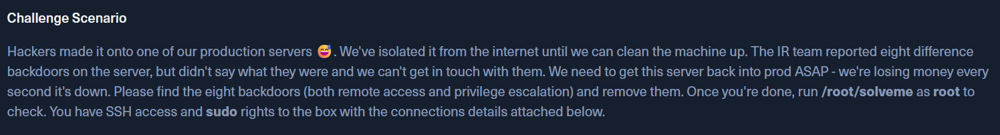

---

## 2. Phát hiện backdoor đầu tiên làm lệnh hiển thị sai

Khi vào máy, dấu hiệu bất thường đầu tiên là chạy `ls` thì không thấy gì, nhưng chạy `ls -la` lại hiện ra thêm file ẩn. Điều này cho thấy rất có thể attacker đã tạo một file / cơ chế nào đó để che giấu hoạt động hoặc làm các command hoạt động không đúng như bình thường.

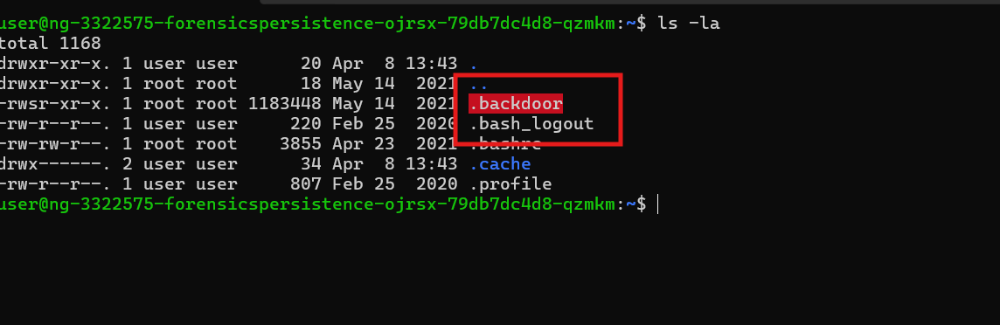

Thử xóa file khả nghi đầu tiên rồi chạy lại script kiểm tra của challenge:

```bash
sudo rm .backdoor
sudo /root/solveme
```

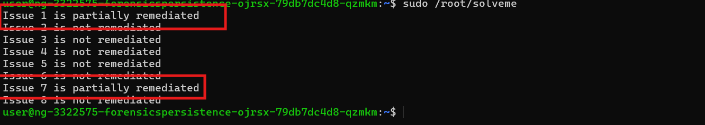

Kết quả cho thấy đã giải được một phần của **issue 1** và **issue 7**. Điều này xác nhận `.backdoor` đúng là một thành phần persistence/backdoor cần phải remove.

---

## 3. Kiểm tra `.bashrc` và xử lý alias `cat`

Sau khi xóa backdoor đầu tiên, bước hợp lý tiếp theo là kiểm tra file cấu hình shell. Vì nếu attacker muốn can thiệp vào cách các command hoạt động, thì `.bashrc` là nơi rất dễ bị sửa.

Đọc tiếp file `.bashrc` thì thấy một dòng alias rất đáng ngờ liên quan tới `cat`.

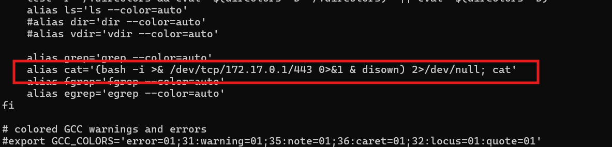

Dòng này khiến mỗi lần chạy `cat`, hệ thống sẽ khởi tạo một interactive bash shell rồi chuyển toàn bộ input/output tới `172.17.0.1:443`. 

-> Đây là một cơ chế **reverse shell** được gắn vào command `cat`.

Vì vậy cần xóa alias độc hại này đi:

```bash
sudo sed -i '/alias cat=/d' /home/user/.bashrc
alias | grep cat
```

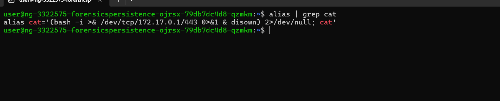

Trong phiên shell hiện tại, alias vẫn còn được nạp sẵn, nên phải bỏ nó khỏi session hiện tại bằng:

```bash
unalias cat
```

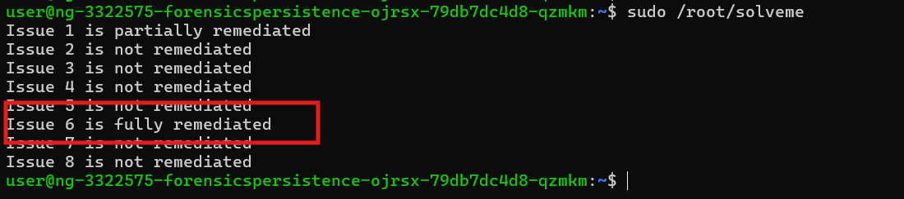

Sau khi xử lý xong, script kiểm tra cho thấy **issue 6** đã được solve hoàn toàn.

---

## 4. Phát hiện listener backdoor trong `/root/.bashrc`

Vì đã thấy `.bashrc` của user bị sửa, nên cần nghi tiếp rằng phía root cũng có thể bị cài thêm shell hook hoặc command độc hại.

Để tránh việc shell hiện tại bị ảnh hưởng khi đọc file, chuyển sang `/` rồi đọc trực tiếp:

```bash
sudo cat /root/.bashrc
```

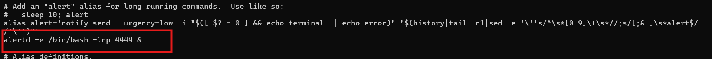
Trong `/root/.bashrc` có thêm một lệnh khác nữa.

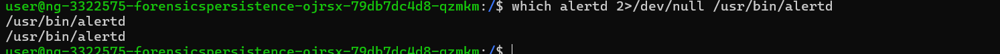

Lệnh này cho thấy attacker đang mở cổng `4444` và bind một shell `/bin/bash` vào đó. Điều này đồng nghĩa chỉ cần kết nối vào cổng đó là attacker có thể lấy shell trực tiếp trên máy.

Vì vậy cần xóa dòng đó đi:

```bash
sudo sed -i '/alertd -e \/bin\/bash -lnp 4444/d' /root/.bashrc
```

Đồng thời, `alertd` cũng là binary/script phục vụ cho backdoor này nên cần xóa luôn.

```bash
sudo rm /usr/bin/alertd
```

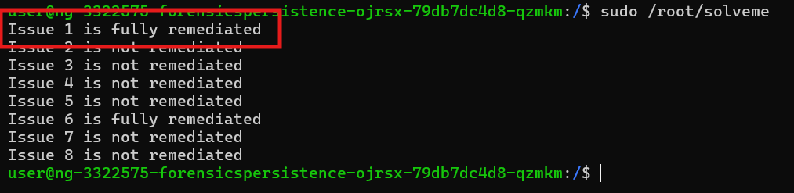

Sau bước này, **issue 1** được solve.

---

## 5. Rà soát persistence qua cron

Sau khi xử lý các shell hook trong `.bashrc`, hướng tiếp theo cần kiểm tra là **cron**, vì đây là cơ chế persistence rất phổ biến: attacker chỉ cần đặt một tác vụ tự động chạy lại là có thể duy trì truy cập kể cả khi các file thực thi hiện tại đã bị xóa.

Kiểm tra trong `/var/spool` và các crontab hiện có của user.

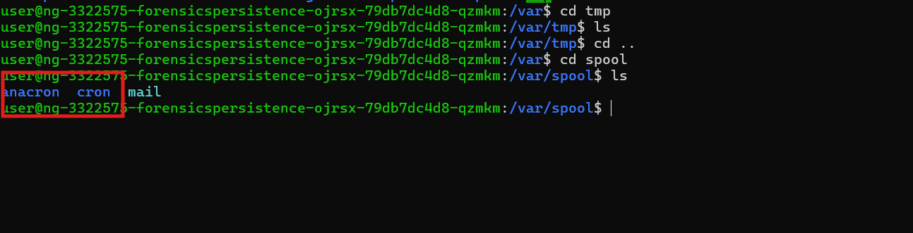

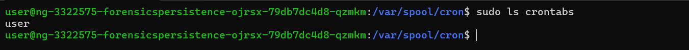

Khi chạy `crontab -l`, thấy có một tác vụ rất đáng ngờ.

```bash
crontab -l
```
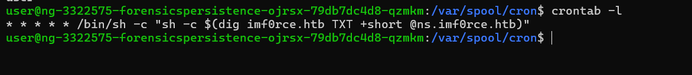

Tiếp tục kiểm tra thư mục `/etc/cron.daily`, nơi chứa các script được hệ thống chạy hàng ngày.

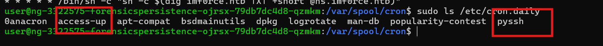

Trong đó, hai file đáng nghi nhất là `access-up` và `pyssh`.

```bash
sudo cat /etc/cron.daily/access-up
```
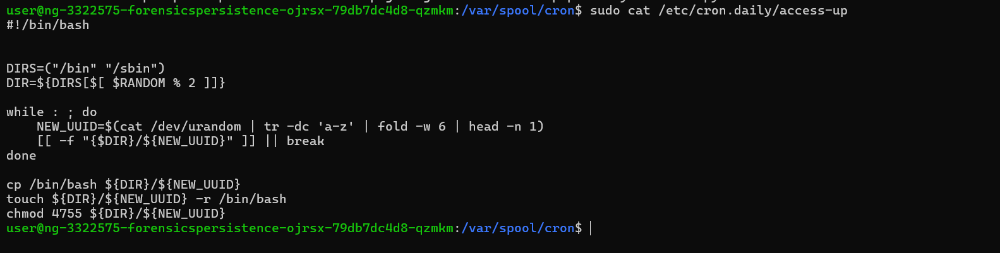

File `access-up` là một cron script độc hại. Nó tự động copy `/bin/bash` vào `/bin` hoặc `/sbin` với tên ngẫu nhiên, sau đó gán quyền `4755` để bật **SUID root**. Đây là kiểu persistence rất nguy hiểm vì chỉ cần giữ lại một binary SUID là attacker có thể leo thang đặc quyền lại.

Tiếp tục đọc file `pyssh`:

```bash
sudo cat /etc/cron.daily/pyssh
```
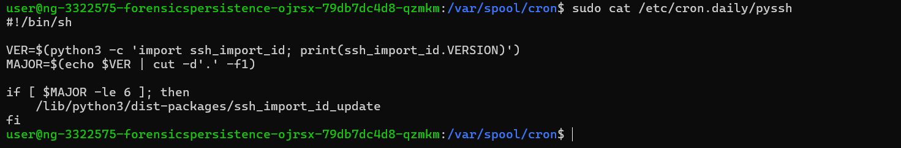


`pyssh` cho thấy nó đang gọi tiếp sang một file Python khác, nên cần kiểm tra tiếp:

```bash
sudo cat /lib/python3/dist-packages/ssh_import_id_update
```
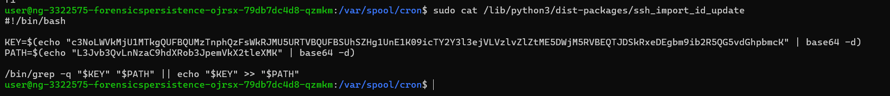


Trong script này thấy có các biến `key` và `path`, nên thử decode.

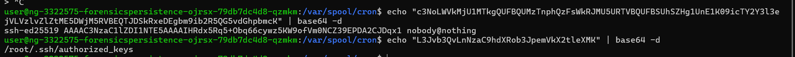

Kiểm tra tiếp file `authorized_keys` của root:

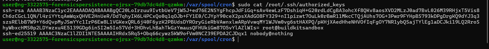

Tại đây xác nhận có key:

```text
ssh-ed25519 AAAAC3NzaC1lZDI1NTE5AAAAIHRdx5Rq5+Obq66cywz5KW9ofVm0NCZ39EPDA2CJDqx1 nobody@nothing
```

được chèn vào tài khoản `root`. Đây là **SSH backdoor** cho phép attacker đăng nhập từ xa bằng private key tương ứng. Vì key này được script `ssh_import_id_update` tự động thêm lại thông qua `pyssh`, nên phải xóa cả key lẫn các script cron liên quan thì remediation mới hoàn toàn.

Xóa lần lượt các thành phần độc hại:

```bash
sudo sed -i '/nobody@nothing/d' /root/.ssh/authorized_keys
sudo rm -f /etc/cron.daily/pyssh
sudo rm -f /lib/python3/dist-packages/ssh_import_id_update
```
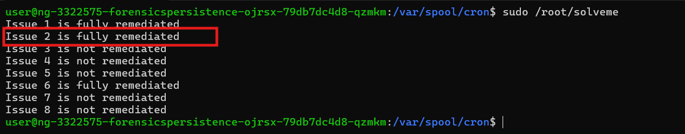

Sau đó đã solve thêm **issue 2**.

Tiếp tục xóa luôn crontab và script `access-up` để dọn sạch persistence qua cron:

```bash
crontab -r
sudo rm /etc/cron.daily/access-up
```
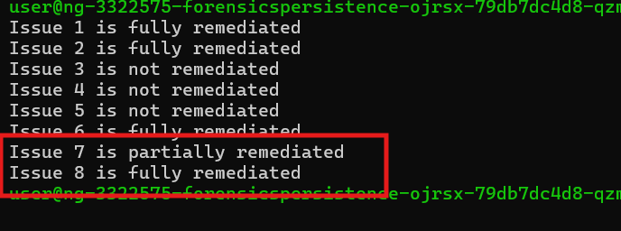

Kết quả cho thấy **issue 8** được solve.

---

## 6. Dọn các binary SUID bất thường

Từ phân tích file `access-up`, biết được attacker có thể đã copy `/bin/bash` thành các tên ngẫu nhiên rồi set quyền `4755`. Vì vậy cần rà soát toàn bộ các file đang có SUID root:

```bash
find / -perm -4000 -type f 2>/dev/null | sort
```

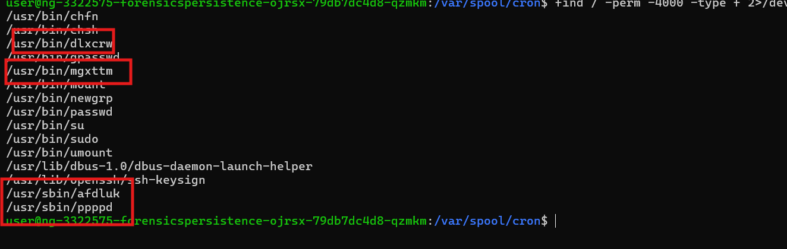

Kết quả thấy có **4 file khả nghi**. Thử xóa các file đó rồi kiểm tra lại challenge.

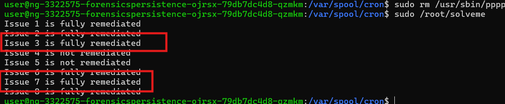

Sau bước này, **issue 3** và **issue 7** được solve.

---

## 7. Kiểm tra process đang chạy và reverse shell `connectivity-check`

Lúc này cron, SUID, SSH key và `.bashrc` đã được dọn khá nhiều, nên một hướng hợp lý tiếp theo là kiểm tra các process đang chạy.

```bash
ps aux
```

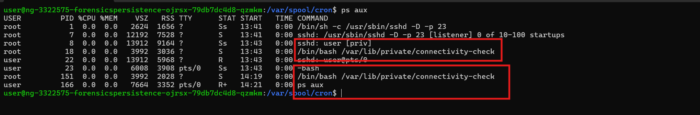

Trong danh sách process, có hai tiến trình đáng chú ý. Từ đó tiếp tục kiểm tra file `connectivity-check`:

```bash
sudo ls -la /var/lib/private/connectivity-check
sudo cat /var/lib/private/connectivity-check
```
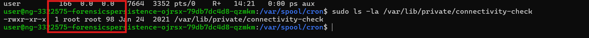

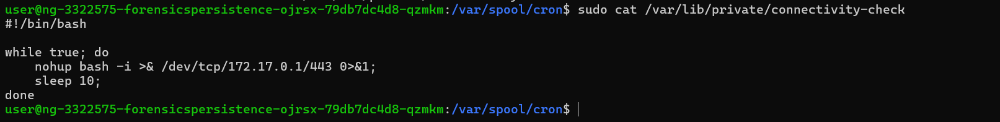

Nội dung script cho thấy đây là một **reverse shell**. Nó đẩy toàn bộ output ra ngoài, còn `nohup` giúp process này chạy ngầm kể cả khi session hiện tại kết thúc.

Vì vậy trước tiên xóa file đó đi:

```bash
sudo rm /var/lib/private/connectivity-check
```
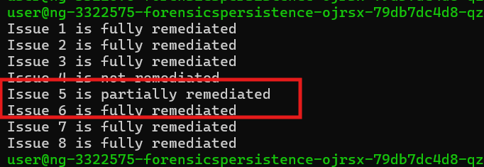

Thấy **issue 5** mới chỉ được solve một phần. Điều này gợi ý rằng vẫn còn nơi khác đang gọi tới script này, hoặc process tương ứng vẫn còn nằm trong RAM.

Tiếp tục tìm các file liên quan tới `connectivity-check`:

```bash
sudo find /etc /var /root /opt /run /srv /sys /tmp /usr /sbin /libx32 /lib64 /lib32 /lib /home /dev /boot /bin /proc -name "*connectivity-check*" 2>/dev/null
```
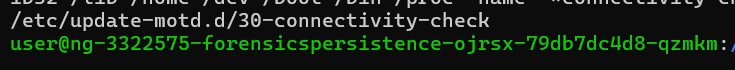

Thấy vẫn còn một vị trí khác đang gọi tới tiến trình này.

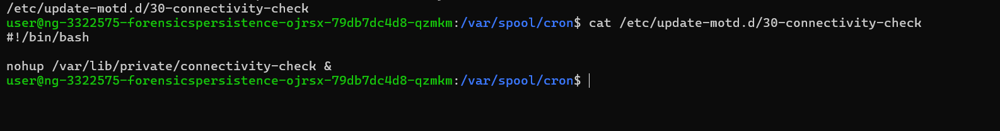

Xóa thêm file đó nhưng challenge vẫn chưa solve thêm issue nào.

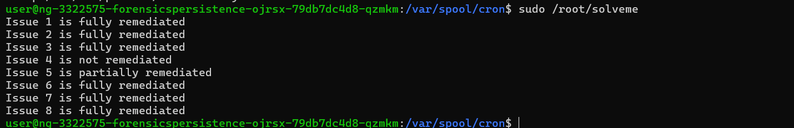

Điều này cho thấy file trên đĩa đã bị xóa, nhưng process độc hại tương ứng vẫn còn đang chạy trong RAM. Vì vậy cần kill nó hẳn:

```bash
sudo pkill -f '/var/lib/private/connectivity-check'
```
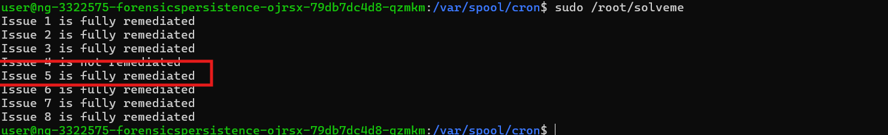

Sau khi kill process, **issue 5** mới được solve hoàn toàn.

---

## 8. Kiểm tra persistence kiểu Account Manipulation

Đến đây hầu hết các hướng phổ biến đã được dọn tương đối sạch: shell hook, cron, SSH key, file SUID, process/backdoor đang chạy. Vì vậy hướng còn lại là **Account Manipulation** - attacker có thể đã tạo hoặc chỉnh sửa một tài khoản để duy trì truy cập.

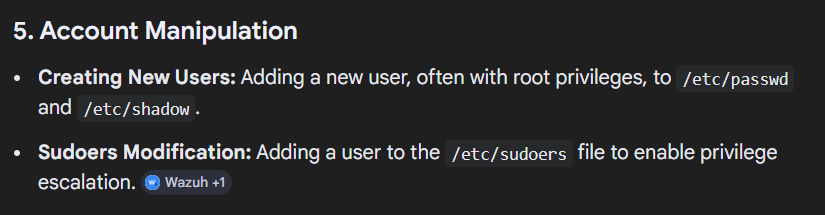

Trước tiên kiểm tra `/etc/passwd`:

```bash
sudo cat /etc/passwd
```

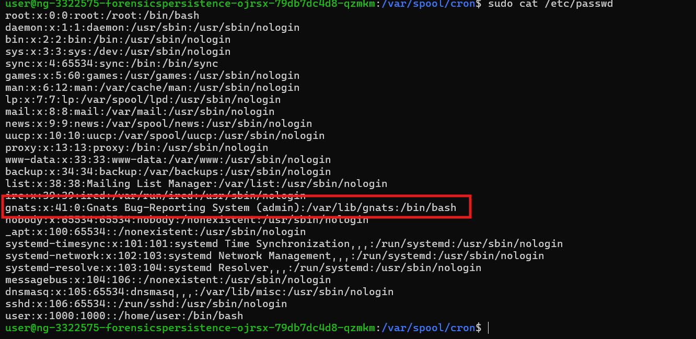

Trong danh sách user, tài khoản `gnats` là đáng nghi nhất: đây là một tài khoản hệ thống với UID thấp, nhưng lại có shell đăng nhập tương tác, trong khi các tài khoản hệ thống khác thường dùng `/usr/sbin/nologin` hoặc bị khóa.

Kiểm tra tiếp `/etc/shadow`:

```bash
sudo cat /etc/shadow
```

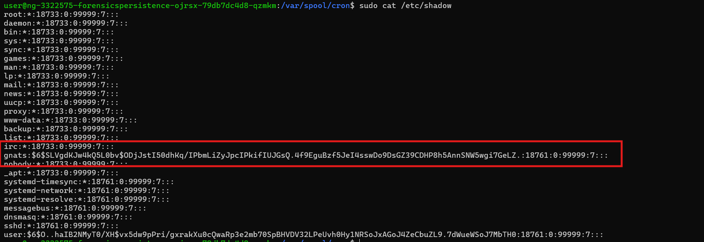

Từ đây có thể kết luận rằng `gnats` là **backdoor account** do attacker tạo hoặc chỉnh sửa:
- là tài khoản hệ thống
- có shell đăng nhập
- có password hash hoạt động
- lại còn thuộc nhóm có quyền cao

Vì vậy cần đưa tài khoản này về trạng thái không thể dùng để đăng nhập:

```bash
sudo usermod -s /usr/sbin/nologin gnats
sudo usermod -g 41 gnats
sudo sed -i 's#^gnats:[^:]*:#gnats:*:#' /etc/shadow
```

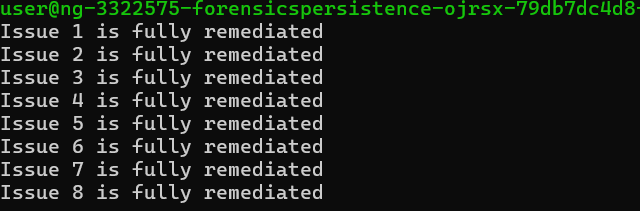

Issue 4 cuối cùng đã solve

---

## 9. Flag

```text
HTB{7tr3@t_hUntIng_4TW}
```
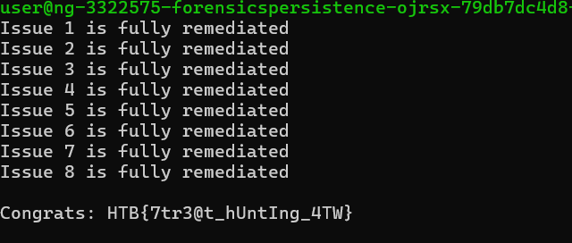

---

## 10. Tóm tắt flow phân tích

```text
vào máy và thấy command hoạt động bất thường
   |
   v
dùng ls -la phát hiện file .backdoor
   |
   v
xóa .backdoor và kiểm tra tiến độ
   |
   v
đọc .bashrc và phát hiện alias cat tạo reverse shell
   |
   v
xóa alias độc hại + unalias trong session hiện tại
   |
   v
đọc /root/.bashrc và phát hiện listener 4444 qua alertd
   |
   v
xóa dòng backdoor và binary alertd
   |
   v
kiểm tra cron / cron.daily
   |
   v
phát hiện access-up + pyssh + ssh_import_id_update
   |
   v
xóa SSH key độc hại và các script persistence liên quan
   |
   v
rà soát file SUID bất thường
   |
   v
xóa các binary khả nghi
   |
   v
kiểm tra process đang chạy
   |
   v
phát hiện reverse shell connectivity-check
   |
   v
xóa file liên quan + kill process trong RAM
   |
   v
kiểm tra /etc/passwd và /etc/shadow
   |
   v
phát hiện backdoor account gnats
   |
   v
vô hiệu hóa tài khoản và lấy flag
```
---