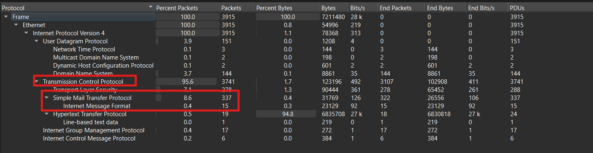
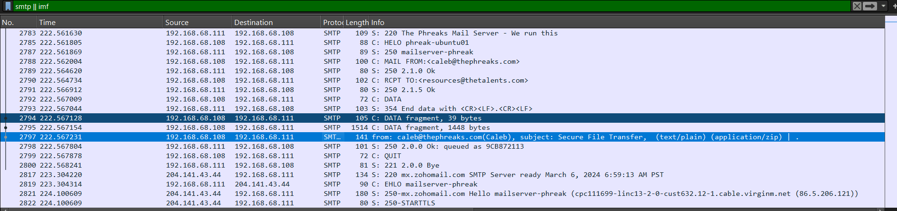
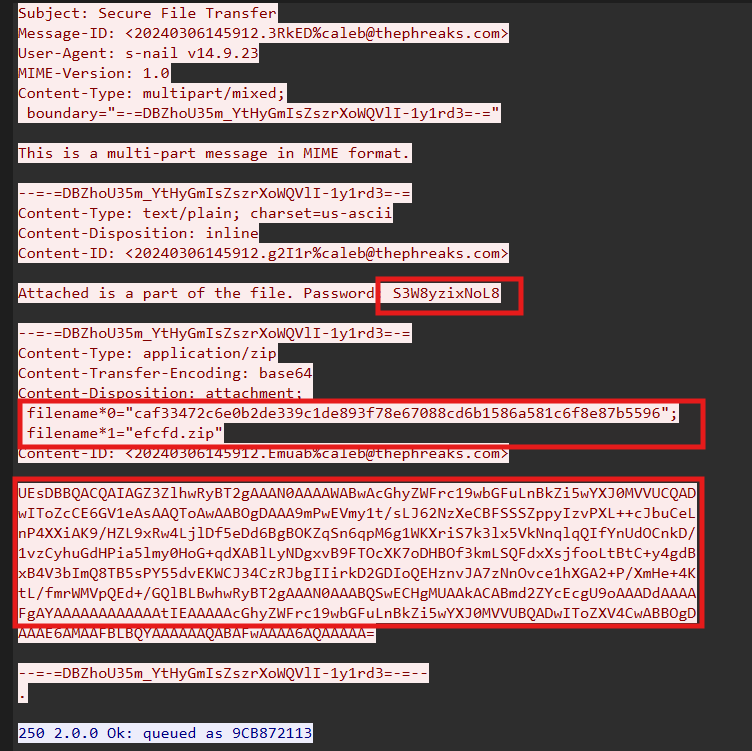
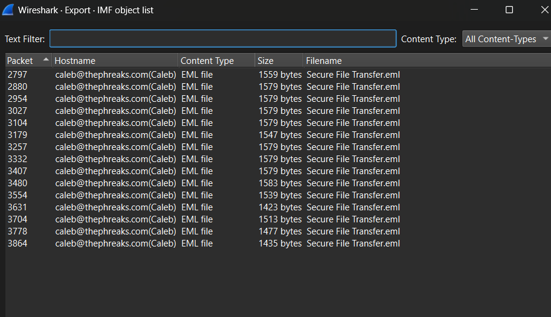
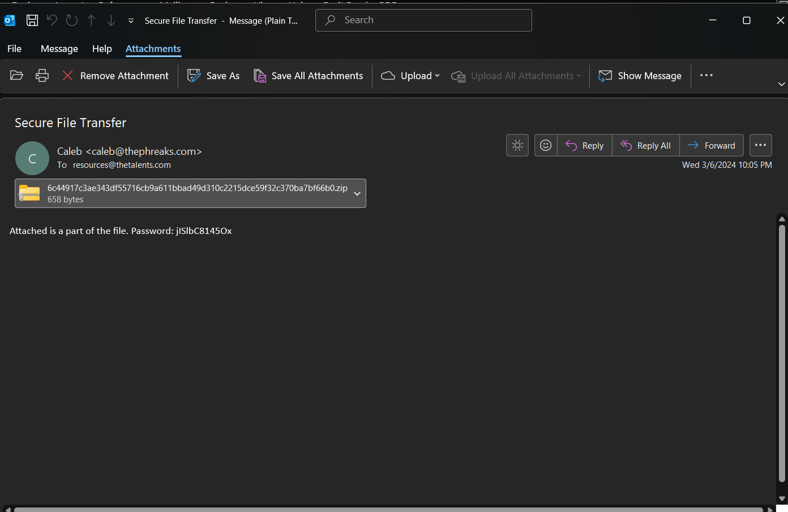
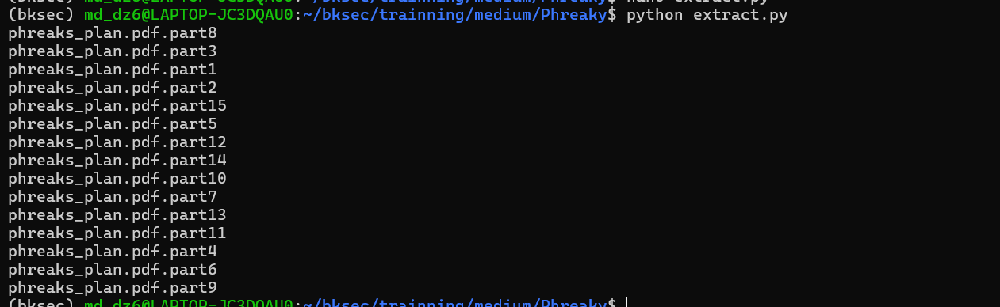
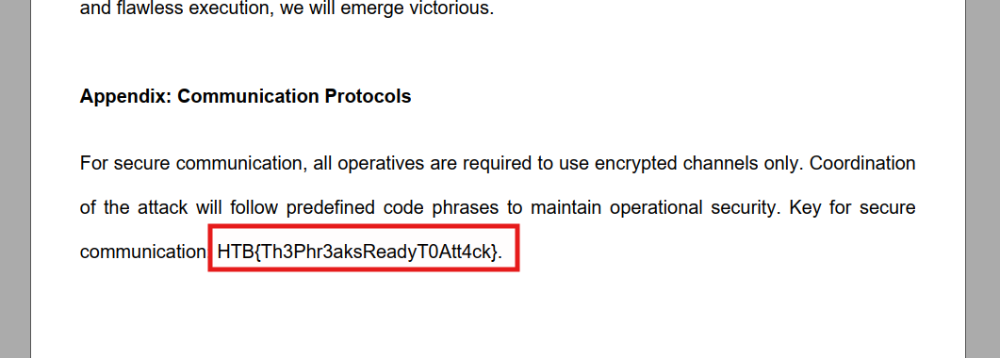
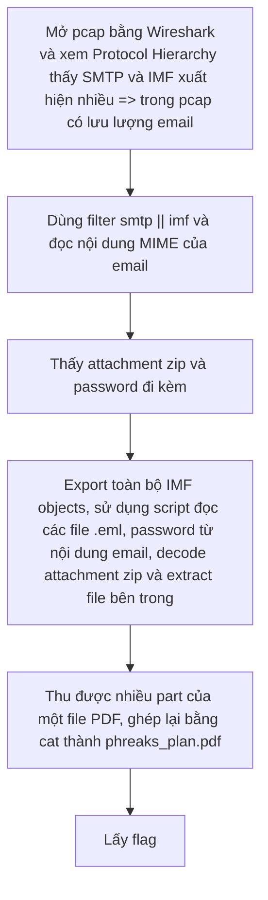

# Challenge Phreaky

## 1. Đầu vào challenge

Đầu vào challenge cung cấp 1 file `pcap`, mở bằng Wireshark và xem phần **Protocol Hierarchy**.



Ở đây chú ý **SMTP** và **Internet Message Format** xuất hiện khá nhiều. Điều này cho thấy trong file PCAP có lưu lượng email.

---

## 2. Tập trung vào luồng email

Sử dụng filter:

```text
smtp || imf
```

để tập trung vào các gói liên quan đến email.



Ta thấy nội dung email ở dạng **MIME**. Trong email có một file đính kèm kiểu `.zip` và có password đi cùng.



Nhưng đồng thời thấy được nội dung file zip đang được encode ở base64, vậy cần decode rồi dùng password để extract lấy được nội dung trong file zip.


---

## 3. Export các email rồi tự động extract attachment

Export toàn bộ **IMF objects**.




Sau đó sử dụng script để tự động đọc toàn bộ file `.eml` đã export, lấy password trong nội dung email, lấy attachment `.zip` đang được encode trong email, rồi giải nén trực tiếp các file bên trong zip.

```python
from pathlib import Path
from email import policy
from email.parser import BytesParser
from io import BytesIO
import re
import zipfile

base = Path(".")

for eml in base.glob("*.eml"):
    msg = BytesParser(policy=policy.default).parse(open(eml, "rb"))

    text = ""
    for part in msg.walk():
        if part.get_content_type() == "text/plain":
            text += part.get_content()

    password = re.search(r"Password:\s*(\S+)", text).group(1)

    for part in msg.walk():
        name = part.get_filename()
        if name and name.lower().endswith(".zip"):
            data = part.get_payload(decode=True)

            with zipfile.ZipFile(BytesIO(data)) as z:
                z.extractall(base, pwd=password.encode())

                for extracted in z.namelist():
                    print(extracted)
```



---

## 4. Ghép lại các part của file PDF

Thu được các file có thể xem như là các phần của một file PDF tổng, vậy giờ cần ghép các part này lại theo đúng thứ tự.

```bash
cat phreaks_plan.pdf.part{1..15} > phreaks_plan.pdf
```

Sau khi ghép xong thì thu được file PDF hoàn chỉnh, và từ đó lấy được flag:

```text
HTB{Th3Phr3aksReadyT0Att4ck}
```



---

## 5. Flow


