# Challenge Precious Guidance

## 1. Đầu vào challenge

Challenge cung cấp 1 file `vbs` và đang bị obfuscate.

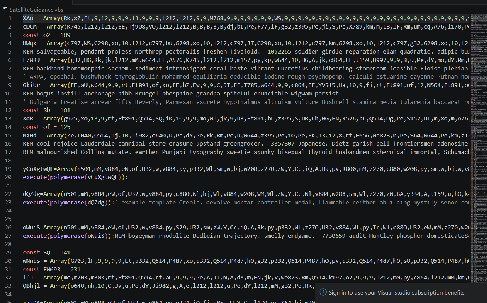

Script này vẫn đang bị obfuscate, sử dụng tool trong repo này để deobfuscate.
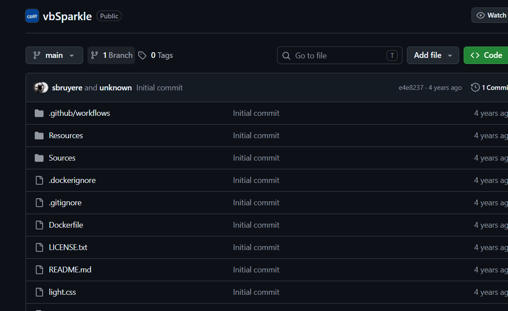

Sau khi deobfuscate thấy được script vẫn còn rất nhiều mảng số `Array(...)` và các `Const`.

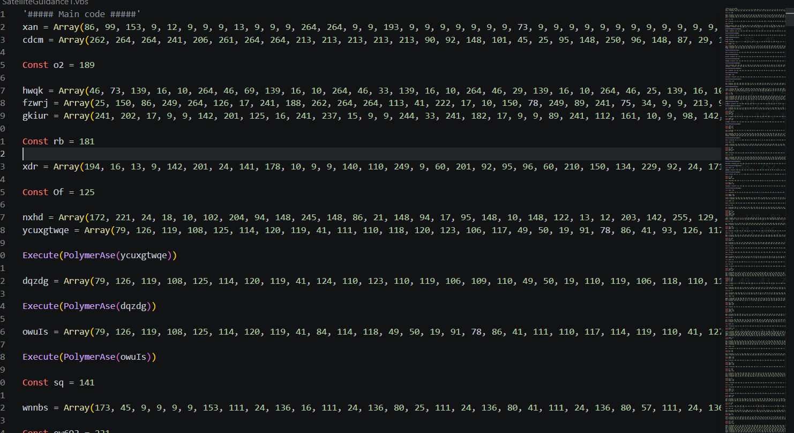

Nhưng ở dưới cùng có hàm `PolymerAse()` có chức năng nhận vào một mảng số, duyệt từng phần tử, trừ đi `9`, sau đó dùng `ChrW()` để chuyển số đó thành ký tự và nối lại thành chuỗi code VBS thật.

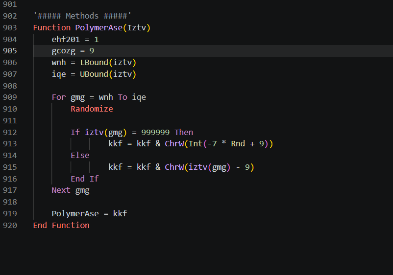

Đồng thời khi đọc script cũng phát hiện quy tắc: các đoạn code thật thường có dạng một biến `Array(...)` được tạo ngay phía trên, sau đó biến này được truyền trực tiếp vào `Execute(PolymerAse(...))` để giải mã và thực thi. Vì vậy có thể ưu tiên decode các mảng nằm ngay trước `Execute`, còn những `Array` hoặc `Const` khác cần kiểm tra xem có được reference ở stage sau hay chỉ là decoy.

---

## 2. Deobfuscate theo logic của `PolymerAse()`

Sử dụng script Python để deobfuscate theo đúng logic hàm `PolymerAse()`:

```python
import re
from pathlib import Path

src = Path("SatelliteGuidance1.vbs").read_text(errors="ignore").splitlines()

arrays = {}
exec_vars = []

for i, line in enumerate(src, 1):
    if "= Array(" in line:
        name = line.split("=", 1)[0].strip()
        nums = list(map(int, re.findall(r"\d+", line)))
        arrays[name] = (i, nums)

    m = re.search(r"Execute\(PolymerAse\((\w+)\)\)", line)
    if m:
        exec_vars.append((i, m.group(1)))

def decode(nums):
    return "".join(chr(n - 9) for n in nums)

for exec_line, var in exec_vars:
    arr_line, nums = arrays[var]
    out = decode(nums)
    print(out[:100000])
```

Sau khi decode ra stage tiếp theo thì bắt đầu phân tích các đoạn cần chú ý.

---

## 3. Phân tích các hàm quan trọng

Khả năng cao hàm `serenade()` là hàm thực thi payload cuối, nó tạo command `rundll32` để gọi file `textual.m3u` với export `DllRegisterServer`.

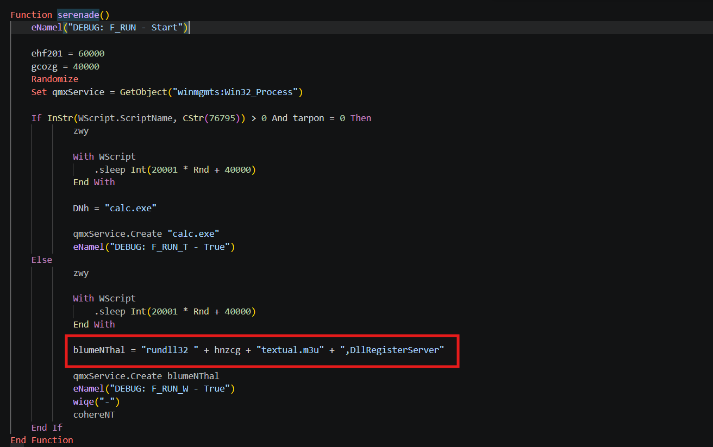

Đồng thời ngay cuối hàm này có gọi tới hàm `cohereNT()`, khi tìm tới hàm này biết được hành vi của nó là xóa file, vậy là script có hành vi xóa dấu vết.

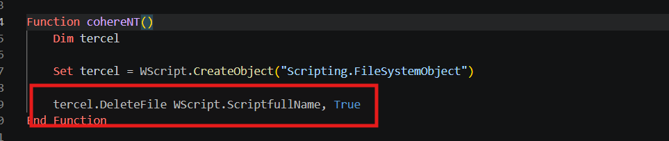

Trong script còn có các đoạn delay / làm chậm.

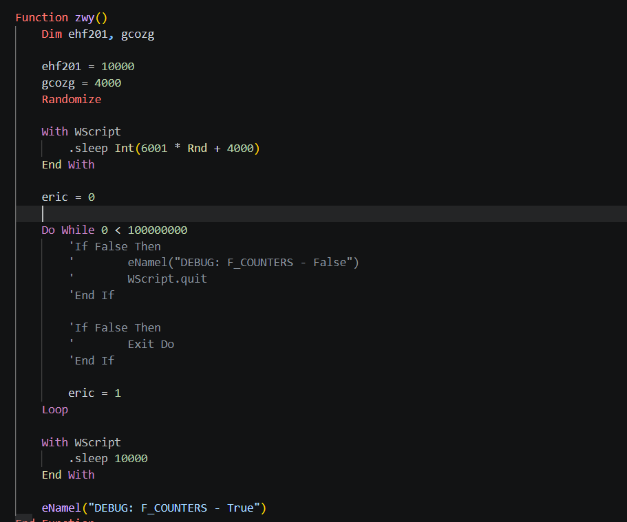

Hàm này thực hiện hành vi tạo độ trễ, làm script chạy chậm bằng vòng lặp lớn và lệnh `Sleep` trước khi tiếp tục thực thi.

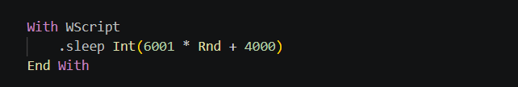


Hàm `lga()`, đây là hàm xử lý khi các bước kiểm tra anti-analysis thất bại. Ở nhánh bình thường, hàm này gọi `wiqe("-")`, gọi `cohereNT()` để dọn dấu vết rồi `WScript.Quit` để dừng script.

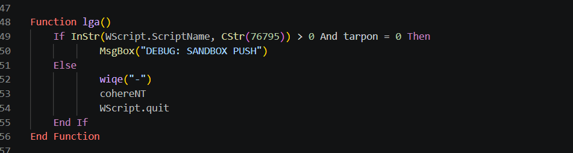

---

## 4. Giữ lại phần cần thiết để chỉ drop artifact

Tận dụng file stage đã deobfuscate sẵn và chỉnh sửa tối thiểu để phân tích.

Cụ thể, tìm lại `Const` ở file gốc vì các giá trị này được dùng để resolve những biến trong mảng `HCZ` và `SECRET`. Tiếp theo, giữ hàm `pooch()` vì đây là hàm drop payload: nó tạo `ADODB.Stream`, duyệt từng phần tử trong `Array(HCZ)`, ghi dữ liệu đã decode bằng `PolymerAse(HCZ)`, sau đó lưu ra file `textual.m3u` trong thư mục tạm bằng:

```vbscript
.SaveToFile hNZCG + "textual.m3u", 2
```

Xóa phần lớn các hàm không cần thiết cho bước drop như `serenade()`, `femoral()`, `kim()`, `rkkog()`, `mwkz()`, `lbud()`, `rctu()`, `htgtm()`, `zwy()` và `dryx()`. Trong đó, đặc biệt không gọi `serenade()` vì đây là hàm thực thi payload bằng:

```text
rundll32 <TEMP>\textual.m3u,DllRegisterServer
```

Chỉ giữ lại 3 phần chính:

- bảng `Const`
- hàm `pooch()`
- hàm `hNZCG()`

Sau đó thêm lại hàm `PolymerAse()` vào file để có thể decode các phần tử trong `HCZ` và `SECRET` theo đúng logic: lấy từng giá trị trừ đi `9`, rồi chuyển thành ký tự bằng `ChrW()`.

Nhưng sau khi cố gắng chạy, không thể compile được dù đã cố sửa, vì vậy sử dụng script Python với logic tương tự.

---

## 5. Dùng Python để drop `textual.m3u` và `SECRET`

```python
from pathlib import Path

HCZ = [...]
SECRET = [...]

def dec(a):
    return bytes(2 if x == 999999 else x - 9 for x in a)

Path("textual.m3u").write_bytes(dec(HCZ))
Path("secret.txt").write_bytes(dec(SECRET))
print(dec(SECRET).decode(errors="replace"))
```

Thu được `secret`.

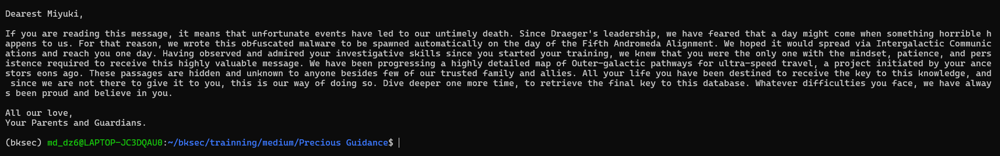

Đồng thời cũng check được file `textual.m3u` là file `EXE/.NET` bị đổi đuôi thành `.m3u` để ngụy trang.

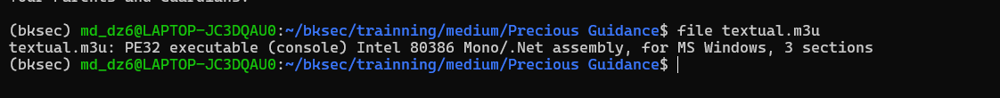

---

## 6. Mở `textual.m3u` bằng ILSpy

Sau khi mở file này bằng ILSpy, chú ý hơn vào hàm `backdoor`.

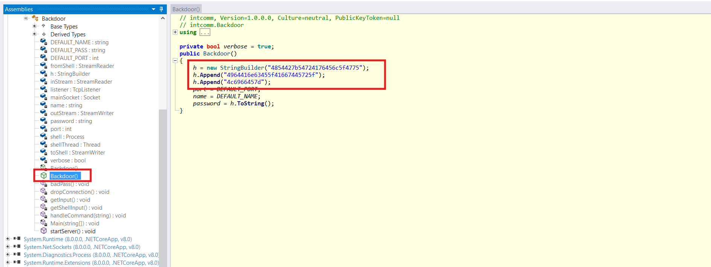

Hàm này ghép 3 chuỗi hex vào với nhau để thành chuỗi tổng, sau khi decode thì thu được flag.

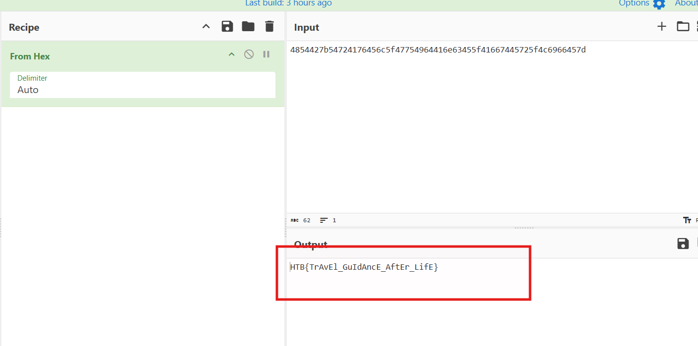

---

## 7. Flag

```text
HTB{TrAvEl_GuIdAncE_AftEr_LifE}
```

---

## 8. Flow

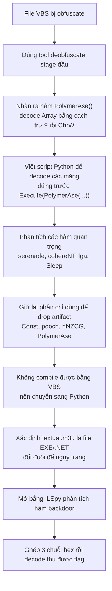
